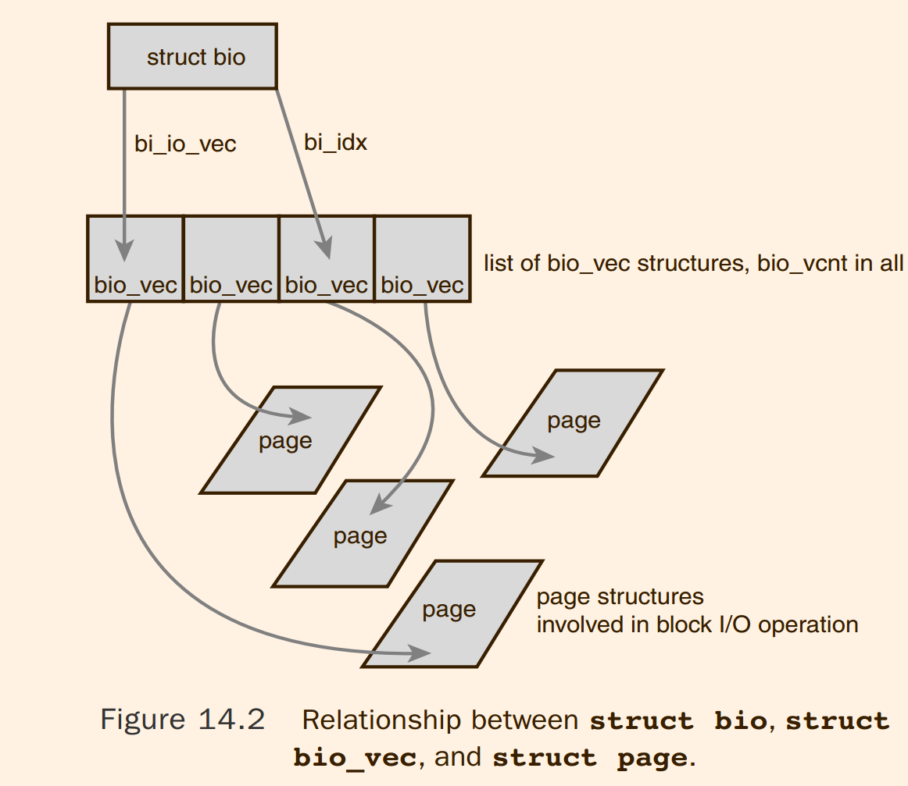

# Linux Kernel Development : The Block I/O Layer

## 1 Anatomy of a Block Device

## 2 Buffers and Buffer Head

Because the kernel requires some associated control information to
accompany the data (such as **from which block device** and which specific block the buffer
is), each buffer is associated with a descriptor. The descriptor is called a buffer head and is
of type struct `buffer_head`.The buffer_head structure holds all the information that the
kernel needs to manipulate buffers and is defined in `<linux/buffer_head.h>`

> 我们真的需要 bh 吗 ?
> 至少存在很多 nobh 为前缀的函数 ?

The physical page in memory to which a given buffer corresponds is the page pointed
to by `b_page`. More specifically, b_data is a pointer directly to the block (that exists
somewhere in `b_page`), which is b_size bytes in length.Therefore, the block is located in
memory starting at address `b_data` and ending at address (`b_data` + `b_size`).

The purpose of a buffer head is to describe this mapping between the on-disk block
and the physical in-memory buffer (which is a sequence of bytes on a specific page).
Acting as a descriptor of this buffer-to-block mapping is the data structure’s only role in the
kernel.

> 虽然，page cache 和物理页面和 file offset 的关系，但是想要 io, 需要 sector number
> 注意，page 根据自己在 address_space 以及 offset 显然可以计算出来 sector number ，但是太慢了, 也许这是一个原因!

Before the 2.6 kernel, the buffer head was a much more important data structure:
It was the unit of I/O in the kernel. Not only did the buffer head describe the **disk-block-to-physical-page mapping**,
but it also acted as the container used for all block I/O.
> @todo disk-block-to-physical-page mapping : 的确如此，但是我想知道，为什么我们需要这一个东西 ?

> 后面讲解了，将曾经的 buffer_head 的部分功能拆分出来形成 bio 的功能

## 3 The bio Structure
This structure represents block I/O operations that are in flight
(active) as a list of **segments**. A segment is a *chunk* of a buffer that is contiguous in memory.
Thus, individual buffers need not be contiguous in memory. By allowing the buffers
to be described in chunks, the bio structure provides the capability for the kernel 
to *perform block I/O operations of even a single buffer from multiple locations in memory.*
Vector I/O such as this is called **scatter-gather I/O**.
> @todo 什么叫做 perform block IO operations 一个 buffer 多个内存位置



#### 3.1 I/O Vectors

```c
/*
 * was unsigned short, but we might as well be ready for > 64kB I/O pages
 */
struct bio_vec {
	struct page	*bv_page;
	unsigned int	bv_len;
	unsigned int	bv_offset;
};
```

The full array of these vectors describes the entire buffer.

#### 3.2 The Old Versus the New

The difference between buffer heads and the new bio structure is important.The bio
structure represents an I/O operation, which may include one or more pages in memory.
On the other hand, the buffer_head structure represents a single buffer, which describes
a single block on the disk. Because buffer heads are tied to a single disk block in a single
page, buffer heads result in the unnecessary dividing of requests into block-sized chunks,
only to later reassemble them. Because the bio structure is lightweight, it can describe
discontiguous blocks and does not unnecessarily split I/O operations.
> bio 可以处理非连续的，而 bh 曾经只能处理单个 block 

Switching from struct buffer_head to struct bio provided other benefits, as well:
- The bio structure can easily represent high memory, because struct bio deals with only physical pages and not direct pointers.
- The bio structure can represent both normal page I/O and direct I/O (I/O operations that do not go through the page cache—see Chapter 16,“The Page Cache and Page Writeback,” for a discussion on the page cache)
- The bio structure makes it easy to perform scatter-gather (vectored) block I/O operations, with the data involved in the operation originating from multiple physical pages.
- The bio structure is much more lightweight than a buffer head because it contains only the minimum information needed to represent a block I/O operation and not unnecessary information related to the buffer itself

The concept of buffer heads is still required, however; buffer heads function as descriptors, mapping disk blocks to pages.The bio structure does not contain any information
about the state of a buffer—it is simply an array of vectors describing one or more segments of data for a single block I/O operation, plus related information. In the current
setup, the buffer_head structure is still needed to contain information about buffers
while the bio structure describes in-flight I/O. Keeping the two structures separate
enables each to remain as small as possible.

## 4 Request Queue

each `bio` structure can describe multiple segments (recall, segments are contiguous
chunks of a block in memory) and the request can be composed of multiple `bio` structures.

## 5 I/O Scheduler
Therefore, the kernel does not issue block I/O requests to the disk in the order they
are received or as soon as they are received. Instead, it performs operations called merging
and sorting to greatly improve the performance of the system as a whole. The subsystem
of the kernel that performs these operations is called the I/O scheduler.


#### 5.1 The Job of an I/O Scheduler

> 原来这就是 io scheduler，原来这就是 elevator 

## 6 Conclusion
the `bio`, representing in-flight I/O;
the `buffer_head`, representing a block-to-page mapping; 
and the `request` structure, representing a specific I/O request.
