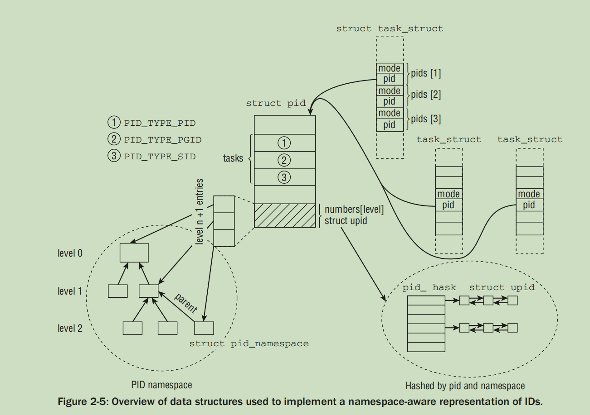
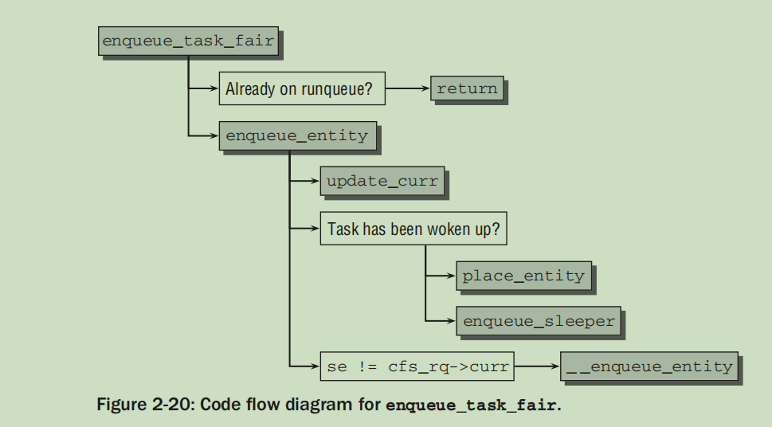
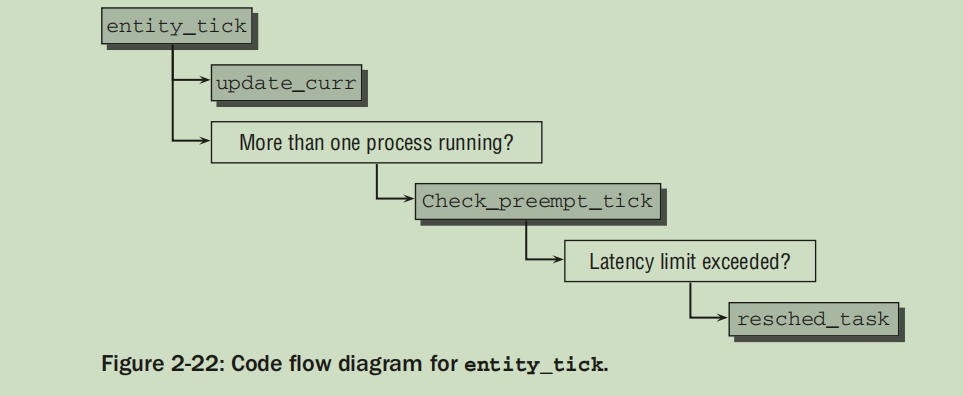

# Professional Linux Kernel Architecture : Process Management and Scheduling

> 基于章节2
> 2.1 - 2.4 处理process的生老病死
> 2.5 - 2.8 scheduler 的内容

## KeyNote
1. Notice that processes connected with pipes are contained in a process group.
    1. 这是一定的吗? 为什么不检查一下其中 pipe.c 的实现

## 2.1 Process Priorities
introduce `Hard real-time processes`, `Soft real-time processes`, `preemptive multitasking` and schedulers(completely fair scheduler, )

## 2.2 Process Life Cycle
1. Sleep
2. Run
3. wait
4. A process always switches briefly to the **zombie** state between termination and removal of its
data from the process table.

#### 2.2.1 Preemptive Multitasking
The preemptive scheduling model of the kernel establishes a hierarchy that determines which process
states may be interrupted by which other states.
1. Normal processes may always be interrupted — even by other processes.
2. If the system is in kernel mode and is processing a system call, no other process in the system is able to cause withdrawal of CPU time. The scheduler is forced to wait until execution of the system call has terminated before it can select another process. However, the system call can be suspended by an interrupt.
3. Interrupts can suspend processes in user mode and in kernel mode. They have the highest priority because it is essential to handle them as soon as possible after they are issued.

## 2.3 Process Representation
Admittedly, it is difficult to digest the amount of information in this structure. However, the structure contents can be broken down into sections, each of which represents a specific aspect of the process:
- State and execution information such as *pending signals*, *binary format* used (and any emulation information for binary formats of other systems), process identification number (pid), pointers to parents and other related processes, priorities, and time information on program execution (e.g., CPU time).
- Information on allocated virtual memory.
- Process credentials such as user and group ID, capabilities,2 and so on. *System calls can be used to query (or modify) these data; I deal with these in greater detail when describing the specific subsystems.*
- Files used: Not only the binary file with the program code but also filesystem information on all files handled by the process must be saved.
- *Thread information, which records the CPU-specific runtime data of the process* (the remaining fields in the structure are not dependent on the hardware used).
- Information on interprocess communication required when working with other applications.
- Signal handlers used by the process to respond to incoming signals
> `thread_struct` 中间的内容和具体的架构有关

In the present chapter, I consider some elements of `task_struct` that are of particular significance in process management implementation.

Linux provides the resource limit (`rlimit`) mechanism to impose certain system resource usage limits on
processes. The mechanism makes use of the rlim array in `task_struct`, whose elements are of the struct
rlimit type.

#### 2.3.1 Process Types
In principle, **clone** works in the same way as fork, but the new
process is not independent of its parent process and can share some resources with it. It is possible to
specify which resources are to be shared and which are to be copied — for example, data in memory,
open files, or the installed signal handlers of the parent process

`clone` is used to implement threads. However, the system call alone is not enough to do this. Libraries are
also needed in userspace to complete implementation. Examples of such libraries are `Linuxthreads` and
`Next Generation Posix Threads`.

> 1. 产生新的进程的方法 :  fork 和 exec
> 2. 实现 Posix Thread 的方法 : clone 

#### 2.3.2 Namespaces
> @todo 这一个章节就是分析了 Namespaces 的内容，和 process 关系不打，到时候过来分析!

首先参考一下别人的意见:
1. http://man7.org/linux/man-pages/man7/namespaces.7.html

Changes to the global resource are visible to other processes that are members of
the namespace, but are invisible to other processes.  One use of
namespaces is to implement containers.

2. https://www.toptal.com/linux/separation-anxiety-isolating-your-system-with-linux-namespaces

With Linux namespaces, one can have this data structure cloned, so that processes under different namespaces can change the mountpoints without affecting each other.

------

Namespaces provide a lightweight form of virtualization by allowing us to view the global properties of
a running system under different aspects. 

Using virtualized environments as provided
by KVM or VMWare is one way to solve the problem, but does not distribute resources very well: One
separate kernel is required for each customer on the machine, and also one complete installation of the
surrounding userland.A different solution that is less demanding on resources is provided by namespaces.

Namespaces can also be non-hierarchical if they wrap simpler quantities, for instance, like the UTS
namespace discussed below. In this case, there is no connection between parent and child namespaces

Notice that support for namespaces in a simple form has been available in Linux for quite a long time in the form of the `chroot` system call

New namespaces can be established in two ways:
1. When a new process is created with the `fork` or `clone` system call, specific options control if namespaces will be shared with the parent process, or if new namespaces are created.
2. The `unshare` system call dissociates parts of a process from the parent, and this also includes namespaces.

Once a process has been disconnected from the parent namespace using any of the two mechanisms
above, changing a — from its point of view — global property will not propagate into the parent namespace, and neither will a change on the parent side propagate into the child, at least for simple quantities.
The situation is more involved for filesystems where the sharing mechanisms are very powerful and allow a plethora of possibilities, as discussed in Chapter 8.


The implementation of namespaces requires two components: 
1. per-subsystem namespace structures that wrap *all* *formerly* global components on a per-namespace basis, 
2. and a mechanism that associates a given process with the individual namespaces to which it belongs.
> all 就是由　`struct nsproxy` 实现，其中持有多个类型namespace的指针

Formerly global properties of subsystems are wrapped up in namespaces, and each process is associated
with a particular selection of namespaces. 
> 在重复说一遍


Each kernel subsystem that is aware of namespaces must
provide a data structure that collects all objects that must be available on a per-namespace basis. `struct nsproxy` is used to collect pointers to the subsystem-specific namespace wrappers:

```c
/*
 * A structure to contain pointers to all per-process
 * namespaces - fs (mount), uts, network, sysvipc, etc.
 *
 * The pid namespace is an exception -- it's accessed using
 * task_active_pid_ns.  The pid namespace here is the
 * namespace that children will use.
 *
 * 'count' is the number of tasks holding a reference.
 * The count for each namespace, then, will be the number
 * of nsproxies pointing to it, not the number of tasks.
 *
 * The nsproxy is shared by tasks which share all namespaces.
 * As soon as a single namespace is cloned or unshared, the
 * nsproxy is copied.
 */
struct nsproxy {
	atomic_t count;
	struct uts_namespace *uts_ns;
	struct ipc_namespace *ipc_ns;
	struct mnt_namespace *mnt_ns;
	struct pid_namespace *pid_ns_for_children;
	struct net 	     *net_ns;
};
```


Since `fork` can be instructed to
open a new namespace when a new task is created, appropriate flags to control the behavior must be
provided. One flag is available for each individual namespace:
```c
#define CLONE_NEWUTS		0x04000000	/* New utsname namespace */
#define CLONE_NEWIPC		0x08000000	/* New ipc namespace */
#define CLONE_NEWUSER		0x10000000	/* New user namespace */
#define CLONE_NEWPID		0x20000000	/* New pid namespace */
#define CLONE_NEWNET		0x40000000	/* New network namespace */
#define CLONE_IO		0x80000000	/* Clone io context */
```


Because a pointer is used, a collection of sub-namespaces can be shared among multiple processes. This
way, changes in a given namespace will be visible in all processes that belong to this namespace.

The initial global namespace is defined by `init_nsproxy`, which keeps pointers to the initial objects of
the per-subsystem namespaces:
```c
struct nsproxy init_nsproxy = {
	.count			= ATOMIC_INIT(1),
	.uts_ns			= &init_uts_ns,
#if defined(CONFIG_POSIX_MQUEUE) || defined(CONFIG_SYSVIPC)
	.ipc_ns			= &init_ipc_ns,
#endif
	.mnt_ns			= NULL,
	.pid_ns_for_children	= &init_pid_ns,
#ifdef CONFIG_NET
	.net_ns			= &init_net,
#endif
};
```

The UTS namespace can be handled with particularly little effort because it only has to manage simple
quantities and does not require a hierarchical organization. All relevant information is collected in an
instance of the following structure:

```c
struct uts_namespace {
	struct kref kref;
	struct new_utsname name;
	struct user_namespace *user_ns;
	struct ns_common ns;
};
```
How does the kernel go about creating a new UTS namespace? This falls under the responsibility of
the function `copy_utsname`. The function is called when a process is forked and the flag CLONE_NEWUTS
specifies that a new UTS namespace is to be established.
In this case, a copy of the previous instance
of `uts_namespace` is generated, and a corresponding pointer is installed into the nsproxy instance of the
current task. Nothing more is required! 

How does the kernel go about creating a new UTS namespace? This falls under the responsibility of
the function `copy_utsname`. The function is called when a process is forked and the flag `CLONE_NEWUTS`
specifies that a new UTS namespace is to be established. In this case, a copy of the previous instance
of uts_namespace is generated, and a corresponding pointer is installed into the nsproxy instance of the
current task. Nothing more is required! 
Since the kernel makes sure to always operate on the task-specific
`uts_namespace` instance whenever a UTS value is read or set, changes for the current process will not be
reflected in the parent, and changes in the parent will also not propagate toward the children.

**The User Namespace**
> 正如前面的代码展示，根本就没有 `user_namespace`

#### 2.3.3 Process Identification Numbers

* ***Process Identifiers***

Each process is, however, not only characterized by its PID but also by other identifiers.
Several types are possible:
1. All processes in a thread group (i.e., different execution contexts of a process created by calling clone with CLONE_THREAD as we will see below) 
have a uniform thread group id (`TGID`). If a process does not use threads, its PID and TGID are identical.

The main process in a thread group is called the group leader. The `group_leader` element of the
task structures of all cloned threads points to the `task_struct` instance of the group leader.

2. Otherwise, **independent processes can be combined into a process group** (using the `setpgrp` system call).
The pgrp elements of their task structures all have the same value, namely,
the PID of the process group leader. Process groups facilitate the sending of signals to all members of the
group, which is helpful for various system programming applications. *Notice that processes connected with pipes are contained in a process group.*

3. Several process groups can be combined in a **session**. All processes in a session have the same
session ID which is held in the session element of the task structure. The SID can be set using
the setsid system call. It is used in terminal programming but is of no particular relevance to us
here.

We have to distinguish between local and global IDs:
1. Global IDs are identification numbers that are valid within the kernel itself and in the initial namespace to which the init tasks started during boot belongs
2. Local IDs belong to a specific namespace and are not globally valid.

The **global** PID and TGID are directly stored in the task struct, namely, in the elements pid and tgid:
```c
struct task_struct {
  ...
  pid_t pid;
  pid_t tgid;
  ...
}
```

The session and process group IDs are not directly contained in the task structure itself, but in the structure used for signal handling.
`task_struct->signal->__session` denotes the global SID, while the
global PGID is stored in `task_struct->signal->__pgrp`. The auxiliary functions `set_task_session` and
`set_task_pgrp` are provided to modify the values.

```c
/*
 * Without tasklist or RCU lock it is not safe to dereference
 * the result of task_pgrp/task_session even if task == current,
 * we can race with another thread doing sys_setsid/sys_setpgid.
 */
static inline struct pid *task_pgrp(struct task_struct *task)
{
	return task->signal->pids[PIDTYPE_PGID];
}

static inline struct pid *task_session(struct task_struct *task)
{
	return task->signal->pids[PIDTYPE_SID];
}
```

* ***Managing PIDs***

```c
struct pid_namespace {
	struct kref kref;
	struct pidmap pidmap[PIDMAP_ENTRIES];
	struct rcu_head rcu;
	int last_pid;
	unsigned int nr_hashed;
	struct task_struct *child_reaper;
	struct kmem_cache *pid_cachep;
	unsigned int level;
	struct pid_namespace *parent;
#ifdef CONFIG_PROC_FS
	struct vfsmount *proc_mnt;
	struct dentry *proc_self;
	struct dentry *proc_thread_self;
#endif
#ifdef CONFIG_BSD_PROCESS_ACCT
	struct fs_pin *bacct;
#endif
	struct user_namespace *user_ns;
	struct work_struct proc_work;
	kgid_t pid_gid;
	int hide_pid;
	int reboot;	/* group exit code if this pidns was rebooted */
	struct ns_common ns;
};
```
What is interesting are the following elements:
1. Every PID namespace is equipped with a task that assumes the role taken by `init` in the global
picture. One of the purposes of init is to call wait4 for orphaned tasks, and this must likewise
be done by the namespace-specific init variant. A pointer to the task structure of this task is
stored in `child_reaper`.
2. `parent` is a pointer to the parent namespace, and `level` denotes the depth in the namespace hierarchy.
The initial namespace has level 0, any children of this namespace are in level 1, children
of children are in level 2, and so on. Counting the levels is important because IDs in higher levels
must be visible in lower levels. From a given level setting, the kernel can infer how many IDs
must be associated with a task.

PID management is centered around two data structures:
1. `struct pid` is the kernel-internal representation of a PID, and
2. `struct upid` represents the information that is visible in a specific namespace.

As for `struct upid`, `nr` represents the numerical value of an ID, and `ns` is a pointer to the namespace to
which the value belongs. All `upid` instances are kept on a hash table to which we will come in a moment,
and `pid_chain` allows for implementing hash overflow lists with standard methods of the kernel.

The definition of struct pid is headed by a reference counter `count`. `tasks` is an array with a hash
list head for every ID type. This is necessary because an ID can be used for several processes. All
`task_struct` instances that share a given ID are linked on this list. `PIDTYPE_MAX` denotes the number of
ID types:



Notice that thread group IDs are not contained in this collection! This is because the thread group ID is
simply given by the PID of the thread group leader, so a separate entry is not necessary.
A process can be visible in multiple namespaces, and the local ID in each namespace will be different.
level denotes in how many namespaces the process is visible (in other words, this is the depth of the
containing namespace in the namespace hierarchy), and numbers contains an instance of upid for each
level. Note that the array consists formally of one element, and this is true if a process is contained only
in the global namespace. Since the element is at the end of the structure, additional entries can be added
to the array by simply allocating more space.

> 3. 结合`struct pid`的注释，似乎后面介绍的函数都是为了处理`struct task` `struct pid` 的关系的，但是没有理解清楚。
> 4. **任务阅读其中的函数对于问题大有帮助**

A process can be visible in multiple namespaces, and the local ID in each namespace will be different.
level denotes in how many namespaces the process is visible (in other words, this is the depth of the
containing namespace in the namespace hierarchy), and numbers contains an instance of upid for each
level. Note that the array consists formally of one element, and this is true if a process is contained only
in the global namespace. Since the element is at the end of the structure, additional entries can be added
to the array by simply allocating more space.


* **Generating Unique PIDs**

To keep track of which PIDs have been allocated and which are still free, the kernel uses a large bitmap in which each PID is identified by a bit. The value of the PID is obtained from the position of the bit in the bitmap.

```c
static int alloc_pidmap(struct pid_namespace *pid_ns)
static void free_pidmap(struct upid *upid)
```

When a new process is created, it may be visible in multiple namespaces. For each of them a local PID
must be generated. This is handled in `alloc_pid`:

Starting at the level of the namespace in which the process is created, the kernel goes down to the initial,
global namespace and creates a local PID for each. All upids that are contained in struct pid are filled
with the newly generated PIDs. Each upid instance must be placed on the PID hash:


#### 2.3.4 Task Relationships
In `struct task_struct`:
1. `children` is the list head for the list of all child elements of the process.
2. `siblings` is used to link siblings with each other.
> 我不能知道通过这种简单的关心形成各种control group


## 2.4 Process Management System Calls
The methods used to switch from user mode to kernel mode differ from architecture to architecture.
In Appendix A, I describe at length the mechanisms used to switch between these two modes and also
explain how parameters are exchanged between userspace and kernel space.

#### 2.4.1 Process Duplication
1. `fork` is the heavy-weight call because it creates a full copy of the parent process that then
executes as a child process.
2. `vfork` is similar to fork but does not create a copy of the data of the parent process
3. `clone` generates threads and enables a decision to be made as to exactly which elements are
to be shared between the parent and the child process and which are to be copied.

**Copy on Write**

**Executing System Calls**

```c
#ifdef __ARCH_WANT_SYS_FORK
SYSCALL_DEFINE0(fork)
{
#ifdef CONFIG_MMU
	return _do_fork(SIGCHLD, 0, 0, NULL, NULL, 0);
#else
	/* can not support in nommu mode */
	return -EINVAL;
#endif
}
#endif
```
```c
pid_t kernel_thread(int (*fn)(void *), void *arg, unsigned long flags)
{
	return _do_fork(flags|CLONE_VM|CLONE_UNTRACED, (unsigned long)fn,
		(unsigned long)arg, NULL, NULL, 0);
}
```

```c
#ifdef __ARCH_WANT_SYS_CLONE
#ifdef CONFIG_CLONE_BACKWARDS
SYSCALL_DEFINE5(clone, unsigned long, clone_flags, unsigned long, newsp,
		 int __user *, parent_tidptr,
		 unsigned long, tls,
		 int __user *, child_tidptr)
#elif defined(CONFIG_CLONE_BACKWARDS2)
SYSCALL_DEFINE5(clone, unsigned long, newsp, unsigned long, clone_flags,
		 int __user *, parent_tidptr,
		 int __user *, child_tidptr,
		 unsigned long, tls)
#elif defined(CONFIG_CLONE_BACKWARDS3)
SYSCALL_DEFINE6(clone, unsigned long, clone_flags, unsigned long, newsp,
		int, stack_size,
		int __user *, parent_tidptr,
		int __user *, child_tidptr,
		unsigned long, tls)
#else
SYSCALL_DEFINE5(clone, unsigned long, clone_flags, unsigned long, newsp,
		 int __user *, parent_tidptr,
		 int __user *, child_tidptr,
		 unsigned long, tls)
#endif
{
	return _do_fork(clone_flags, newsp, 0, parent_tidptr, child_tidptr, tls);
}
#endif
```
> 看来道路千万条，最后全部汇聚到`_do_fork`上面了，下面是其参数的解释:
1. A flag set (`clone_flags`) to specify duplication properties. The low byte specifies the signal number to be sent to the parent process when the child process terminates. The higher bytes hold various constants discussed below.
1. The start address of the user mode stack (`start_stack`) to be used.
1. A pointer to the register set holding the call parameters in raw form (regs). The data type used is the architecture-specific `struct pt_regs` structure, which holds all registers in the order in which they are saved on the kernel stack when a system call is executed (more information is provided in Appendix A).
1. The size of the user mode stack (`stack_size`). This parameter is usually unnecessary and set to 0.
1. Two pointers to addresses in userspace (`parent_tidptr` and `child_tidptr`) that hold the TIDs of the parent and child processes. They are needed for the thread implementation of the NPTL (Native Posix Threads Lilbrary) library. I discuss their meaning below.

vfork is designed for the situation in which a child process just generated immediately executes an execve system call to load a new program. The kernel also guarantees that the
parent process is blocked until the child process exits or starts a new program.

**Implementation of do\_fork**
处理的事情主要为:
1. ptrace
2. copy_process
4. wake_up_new_task

**Copying Processes**
```
copy_process
  检查标志
	retval = security_task_create(clone_flags);
	p = dup_task_struct(current, node);
  检查资源限制(task_rlimit)
  初始化task_struct
  sched_fork(处理和scheduler相关的初始化)
  复制和进程相关的各个部分
	    sched_fork(clone_flags, p);
	    perf_event_init_task(p);
	    audit_alloc(p);
	     /* copy all the process information */
	     shm_init_task(p);
	    copy_semundo(clone_flags, p);
	    copy_files(clone_flags, p);
	    copy_fs(clone_flags, p);
	    copy_sighand(clone_flags, p);
	    copy_signal(clone_flags, p);
	    copy_mm(clone_flags, p);
	    copy_namespaces(clone_flags, p);
	    copy_io(clone_flags, p);
	    copy_thread_tls(clone_flags, stack_start, stack_size, p, tls);
  设置ID，进程间关系等等
```

Some further flag checks are required:
1.  When a thread is created with CLONE_THREAD, signal sharing must be activated with
CLONE_SIGHAND. Individual threads in a thread group cannot be addressed by a signal.
2. Shared signal handlers can only be provided if the virtual address space is shared between parent and child (CLONE_VM). Transitive thinking reveals that threads, therefore, also have to share
the address space with the parent
```c
	/*
	 * Shared signal handlers imply shared VM. By way of the above,
	 * thread groups also imply shared VM. Blocking this case allows
	 * for various simplifications in other code.
	 */
	if ((clone_flags & CLONE_SIGHAND) && !(clone_flags & CLONE_VM))
		return ERR_PTR(-EINVAL);
```


The task structures for parent and child **differ only in one element**: A new `kernel mode stack` is allocated
for the new process. A pointer to it is stored in `task_struct->stack`. Usually the stack is stored in a
union with `thread_info`, which holds all required processor-specific low-level information about the
thread.

```c
// 一下所有的node 参数取值
#define	NUMA_NO_NODE	(-1)


static struct task_struct *copy_process(unsigned long clone_flags,
					unsigned long stack_start,
					unsigned long stack_size,
					int __user *child_tidptr,
					struct pid *pid,
					int trace,
					unsigned long tls,
					int node)

static struct task_struct *dup_task_struct(struct task_struct *orig, int node)


static struct thread_info *alloc_thread_info_node(struct task_struct *tsk, int node) {
  // 熟不熟悉，惊不惊喜 // 数个月之后，我现在已经发看不懂了
  // 不要赶进度，自己骗自己
	struct page *page = alloc_kmem_pages_node(node, THREADINFO_GFP,
						  THREAD_SIZE_ORDER);

	return page ? page_address(page) : NULL;
}


#define page_address(page) lowmem_page_address(page)

struct page *alloc_kmem_pages_node(int nid, gfp_t gfp_mask, unsigned int order) {
	struct page *page;

	page = alloc_pages_node(nid, gfp_mask, order);
	if (page && memcg_kmem_charge(page, gfp_mask, order) != 0) {
		__free_pages(page, order);
		page = NULL;
	}
	return page;
}
```

源代码中间有很奇怪的函数,他有两个定义:
1. fork.c 中间为什么不使用static ，而是使用`__week`
2. 从原理的角度上讲，调用者更加应该是调用x86/kernel/process.c 中间的版本
```
	err = arch_dup_task_struct(tsk, orig);
```

`thread_info`在内核stack的底部:
```c
static inline struct thread_info *current_thread_info(void) {
	return (struct thread_info *)(current_top_of_stack() - THREAD_SIZE);
}
// 下层调用的函数设计到SMP 的内容，可以关注一下。
```
> 此处仅仅分析了stack的初始化而已，
> 我想知道是在stack 是如何使用的


```c
struct thread_info {
	struct task_struct	*task;		/* main task structure */
	__u32			flags;		/* low level flags */
	__u32			status;		/* thread synchronous flags */
	__u32			cpu;		/* current CPU */
	mm_segment_t		addr_limit;
	unsigned int		sig_on_uaccess_error:1;
	unsigned int		uaccess_err:1;	/* uaccess failed */
};
```
> 1. 让人感到非常疑惑的地方是: `struct task_struct` 中间包含了`struct thread_struct` ，为什么不把这`thread_info`也放到其中: 因为后者是架构间相关，用于实现切换进程的恢复上下文
> 2. 既然`struct task_struct`中间包含了 current cpu 的字段，那么如何实现一个进程在多个cpu 上运行。


```c
// task 的复制
#define task_thread_info(task)	((struct thread_info *)(task)->stack)
#define task_stack_page(task)	((task)->stack)

static inline void setup_thread_stack(struct task_struct *p, struct task_struct *org) {
	*task_thread_info(p) = *task_thread_info(org);
	task_thread_info(p)->task = p;
}

// struct task 的 void * stack 指向此处
union thread_union {
	struct thread_info thread_info;
	unsigned long stack[THREAD_SIZE/sizeof(long)];
};
```


关于`current`
```c
static __always_inline struct task_struct *get_current(void) {
	return this_cpu_read_stable(current_task);
}

#define current get_current()

/*
 * this_cpu_read() makes gcc load the percpu variable every time it is
 * accessed while this_cpu_read_stable() allows the value to be cached.
 * this_cpu_read_stable() is more efficient and can be used if its value
 * is guaranteed to be valid across cpus.  The current users include
 * get_current() and get_thread_info() both of which are actually
 * per-thread variables implemented as per-cpu variables and thus
 * stable for the duration of the respective task.
 */
#define this_cpu_read_stable(var)	percpu_stable_op("mov", var)
```

After `dup_task_struct` has succeeded, the kernel checks if the maximam
number of processes allowed for a particular **user** are exceeded with the creation of the new task:
```c
	if (atomic_read(&p->real_cred->user->processes) >=
			task_rlimit(p, RLIMIT_NPROC)) {
		if (p->real_cred->user != INIT_USER &&
		    !capable(CAP_SYS_RESOURCE) && !capable(CAP_SYS_ADMIN))
			goto bad_fork_free;
	}
	current->flags &= ~PF_NPROC_EXCEEDED;
```
> 检查当前用户可以拥有的最大的进程的数量
> 细节，可以深究

If resource limits do not prevent process creation, the interface function `sched_fork` is called to give
the scheduler a chance to set up things for the new task. Essentially, the routines initialize statistical fields and on multi-processor
systems probably re-balance the available processes between the CPUs if this is necessary.
Besides, the task state is set to TASK_RUNNING — which is not really true since the new process is, in fact, not yet
running. However, this prevents any other part of the kernel from trying to change the process state from
non-running to running and scheduling the new process before its setup has been completely finished

A large number of `copy_xyz` routines are then invoked to copy or share the resources of specific kernel
subsystems.

Back in `copy_process`, the kernel must fill in various elements of the task structure that differ between
parent and child. These include the following:
* The various list elements contained in task_struct, for instance, `sibling` and `children`.
* The interval timer elements `cpu_timers` (see Chapter 15).
* The list of `pending signals` (pending) discussed in Chapter 5.


**Special Points When Generating Threads**

concentrate on the flags used by user thread libraries (above all, NPTL) to implement multithreading capabilities

> 讲解三个3个flag
> 处理`_do_fork`参数 : tidptr 

https://en.wikipedia.org/wiki/Native_POSIX_Thread_Library

#### 2.4.2 Kernel Threads
Kernel threads are often referred to as (kernel) daemons. They
are used to perform, for example, the following tasks:
1. To periodically synchronize modified memory pages with the block device from which the pages originate (e.g., files mapped using mmap).
2. To write memory pages into the swap area if they are seldom used.
3. To manage deferred actions.
4. To implement transaction journals for filesystems.

Basically, there are two types of kernel thread:
1. Type 1 — The thread is started and waits until requested by the kernel to perform a specific action.
2. Type 2 — Once started, the thread runs at periodic intervals, checks the utilization of a specific resource, and takes action when utilization exceeds or falls below a set limit value. The kernel uses this type of thread for continuous monitoring tasks.

Because kernel threads are generated by the kernel itself, two special points should be noted:
1. They execute in the supervisor mode of the CPU, not in the user mode.
2. They may access only the kernel part of virtual address space (all addresses above `TASK_SIZE`) but not the virtual user area.

*Every time the kernel performs a context
switch, the userland portion of the virtual address space must be replaced to match the then-running
process.*

To signalize that the userspace portion
must not be accessed, mm is set to a NULL pointer. However, since the kernel must know what is currently
contained in the userspace, a pointer to the `mm_struct` describing it is preserved in `active_mm`
> TLB 刷新相关的内容，虽然具体内容不清楚，但是在切换进程的时候，TLB 原则上需要清空，但是内核态的userland 部分不关心，都是应该是有优化的部分的，优化的方法依赖于 active_mm

Why are processes without an mm pointer called *lazy* TLB processes? Suppose that the process that runs
after a kernel thread is the same process that has run before. In this case, the kernel does not need to
modify the userspace address tables, and the information in the translation lookaside buffers is still
valid. A switch (and a corresponding clearance of TLB data) is only required when a different userland
process from before executes after the kernel thread.

Notice that when the kernel is operating in process context, `mm` and `active_mm` have identical values.

A kernel thread can be implemented in one of two ways
1. `kernel_thread`
2. `kthread_create`
> 所以为什么要创建两种方法出来，第二种的好处是什么?

```c
/**
 * kthread_create_on_node - create a kthread.
 * @threadfn: the function to run until signal_pending(current).
 * @data: data ptr for @threadfn.
 * @node: task and thread structures for the thread are allocated on this node
 * @namefmt: printf-style name for the thread.
 *
 * Description: This helper function creates and names a kernel
 * thread.  The thread will be stopped: use wake_up_process() to start
 * it.  See also kthread_run().  The new thread has SCHED_NORMAL policy and
 * is affine to all CPUs.
 *
 * If thread is going to be bound on a particular cpu, give its node
 * in @node, to get NUMA affinity for kthread stack, or else give NUMA_NO_NODE.
 * When woken, the thread will run @threadfn() with @data as its
 * argument. @threadfn() can either call do_exit() directly if it is a
 * standalone thread for which no one will call kthread_stop(), or
 * return when 'kthread_should_stop()' is true (which means
 * kthread_stop() has been called).  The return value should be zero
 * or a negative error number; it will be passed to kthread_stop().
 *
 * Returns a task_struct or ERR_PTR(-ENOMEM) or ERR_PTR(-EINTR).
 */
struct task_struct *kthread_create_on_node(int (*threadfn)(void *data),
					   void *data, int node,
					   const char namefmt[],
					   ...)
{
```
> 注释内容和书中间的内容相似.

#### 2.4.3 Starting New Programs

* **Implementation of execve**

```c
int do_execve(struct filename *filename,
	const char __user *const __user *__argv,
	const char __user *const __user *__envp)
{
	struct user_arg_ptr argv = { .ptr.native = __argv };
	struct user_arg_ptr envp = { .ptr.native = __envp };
	return do_execveat_common(AT_FDCWD, filename, argv, envp, 0);
}
```

Suffice it to say that the implementation of this function consists essentially of decrementing reference
counters and returning memory areas to memory management once the reference counter has reverted
to 0 and the corresponding structure is no longer being used by any process in the system.
> `exit.c`中间定义的 `do_exit` 函数流程简单，但是调用了无数函数

```
do_execve
**Open executable file**
bprm_init
  mm_alloc
  init_new_context
  __bprm_mm_init
prepare_binprm
**Copy environment and arguments**
search_binary_handler
```
`bprm_init` then handles several administrative tasks:
1. `mm_alloc` generates a new instance of mm_struct to
manage the process address space (see Chapter 4). 
2. `init_new_context` is an architecture-specific function
that initializes the instance,
3. and `__bprm_mm_init` sets up an initial stack
4. `search_binary_handler` is used at the end of do_execve to find a suitable binary format for the particular
file.

Generally, a binary format handler performs the following
actions:
* It releases all resources used by the old process.
* It maps the application into virtual address space. The following segments must be taken into
account (the variables specified are elements of the task structure and are set to the correct values
by the binary format handler):
* The instruction pointer of the process and some other architecture-specific registers are set so
that the main function of the program is executed when the scheduler selects the process

* **Interpreting Binary Formats**

> 介绍linux_binfmt 其中就有曾经觉得很神奇的事情，load_binary ?

#### 2.4.4 Exiting Processes
Suffice it to say that the implementation of this function consists essentially of decrementing reference
counters and returning memory areas to memory management once the reference counter has reverted
to 0 and the corresponding structure is no longer being used by any process in the system
> 如果单独分析的话，那么没有什么神奇的，就是一堆free dec 

## 2.5 Implementation of the Scheduler
Scheduler's task is split into two different parts
1. scheduling policy 
2. context switching

#### 2.5.1 Overview
The kernel must provide a method of sharing CPU time as fairly as possible between the individual
processes while at the same time taking into account differing task priorities.

The implementation of the scheduler is obscured a little by several factors:
1. On multiprocessor systems, several details (some very subtle) must be noted so that the scheduler doesn’t get under its own feet.
2. Not only priority scheduling but also two other soft real-time policies required by the Posix standard are implemented.
3. gotos are used to generate optimal assembly language code. These jump backward and forward
in the C code and run counter to all principles of structured programming. However, this feature
can be beneficial if it is used with great care, and the scheduler is one example where gotos make
sense.
> @todo 对于第三条，其实并不知道对应的位置。


Besides the red-black tree, a run queue is also equipped with a virtual clock.

#### 2.5.2 Data Structures
Scheduling can be activated in two ways: 
1. (generic scheduler) either directly if a task goes to sleep or wants to yield the CPU for other reasons
2. (core scheduler) or by a periodic mechanism that is run with constant frequency and that checks
from time to time if switching tasks is necessary. 

There are several scheduling-relevant elements in the task structure of each process.
```c
struct task_struct {
  ...
  int prio, static_prio, normal_prio;
  unsigned int rt_priority;

	struct sched_rt_entity		rt;

  struct list_head run_list;
  const struct sched_class *sched_class;
  struct sched_entity se;
  unsigned int policy;
  cpumask_t cpus_allowed;
  unsigned int time_slice;
  ...
}

struct sched_rt_entity {
	struct list_head		run_list;
	unsigned long			timeout;
	unsigned long			watchdog_stamp;
	unsigned int			time_slice;
	unsigned short			on_rq;
	unsigned short			on_list;

	struct sched_rt_entity		*back;
#ifdef CONFIG_RT_GROUP_SCHED
	struct sched_rt_entity		*parent;
	/* rq on which this entity is (to be) queued: */
	struct rt_rq			*rt_rq;
	/* rq "owned" by this entity/group: */
	struct rt_rq			*my_q;
#endif
} __randomize_layout;
```
1. 
    * `static_prio` the static priority of a process.
  The static priority is the priority assigned to the process when it was started. It can be modified
  with the `nice` and `sched_setscheduler` system calls, but remains otherwise constant during the
  process’ run time
    * `normal_priority` denotes a priority that is computed based on the static priority and the
  scheduling policy of the process. When a process forks, the child process will inherit the normal priority
    * However, the priority considered by the scheduler is kept in `prio`.
> @todo 似乎normal 和 rr 并不共享，优先级的表示
> @todo static_prio normal_prio 以及 prio 之间的计算方法是什么 ? 

2. `rt_priority` denotes the priority of a real-time process. 
3. `sched_class` denotes the scheduler class the process is in.
4. The scheduler is not limited to schedule processes, but can also work with larger entities. 
This generality requires that the scheduler does not directly operate on processes but works with
schedulable entities. An entity is represented by an instance of `sched_entity`
5. `policy` holds the scheduling policy applied to the process. Linux supports five possible values:
    * `SCHED_NORMAL` is used for normal processes on which our description focuses. They are
handled by the completely fair scheduler. `SCHED_BATCH` and `SCHED_IDLE` are also handled
by the completely fair scheduler but can be used for less important tasks.
    * `SCHED_RR` and `SCHED_FIFO` are used to implement soft real-time processes. `SCHED_RR` implements a round robin method, while SCHED_FIFO uses a first in, first out mechanism. These
are not handled by the completely fair scheduler class, but by the real-time scheduler class
6. `cpus_allowed` is a bit field used on multiprocessor systems to restrict the CPUs on which a process may run.
7. `run_list` and `time_slice` are required for the round-robin real-time scheduler, but not for the
completely fair scheduler. `run_list` is a list head used to hold the process on a run list, while
`time_slice` specifies the remaining time quantum during which the process may use the CPU.

* ***Scheduler Classes***

The `next` element connects the `sched_class` instances of the different scheduling
classes in the described order. 

1. `enqueue_task` adds a new process to the run queue. This happens when a process changes from
a sleeping into a runnable state.
2. `dequeue_task` provides the inverse operation: It takes a process off a run queue. Naturally, this
happens when a process switches from a runnable into an un-runnable state, or when the kernel
decides to take it off the run queue for other reasons — for instance, because its priority needs to
be changed. Although the term run queue is used, the individual scheduling classes need not represent their
processes on a simple queue. In fact, recall from above that the completely fair scheduler uses a
red-black tree for this purpose.
> dequeue_task : switch to un-runnable 或者 修改 priority 的时候，所以 enqueue_task 的时候，会根据priority 确定加入的 rq 吗 ?
> 和 pick_next_task 的区别，pick_next_task 表示一定离开RUNABLE 的状态，所以 pick_next_task 会调用 dequeue_task ?
> 猜测其实会，但是存在首先调用 pick_next_task 然后马上调用 dequeue_task 的情况!

3. When a process wants to relinquish control of the processor voluntarily, it can use the
`sched_yield` system call. This triggers yield_task to be called in the kernel.
4. `check_preempt_curr` is used to preempt the current task with a newly woken task if this is
necessary. The function is called, for instance, when a new task is woken up with
`wake_up_new_task`.
5. **`pick_next_task` selects the next task that is supposed to run, while `put_prev_task` is called
before the currently executing task is replaced with another one. Note that these operations are
not equivalent to putting tasks on and off the run queue like `enqueue_task` and `dequeue_task`.
Instead, they are responsible to give the CPU to a task, respectively, take it away. Switching
between different tasks, however, still requires performing a low-level context switch.**
6. `set_curr_task` is called when the scheduling policy of a task is changed. There are also some
other places that call the function, but they are not relevant for our purposes.
7. `task_tick` is called by the periodic scheduler each time it is activated.
8. `new_task` allows for setting up a connection between the fork system call and the scheduler.
Each time a new task is created, the scheduler is notified about this with `new_task`.
> 以上没有分析SMP的内容

The standard functions `activate_task` and `deactivate_task` are provided to enqueue and dequeue a
task by calling the aforementioned functions. Additionally, they keep the kernel statistics up to date.

`core.c`
```c
static inline void enqueue_task(struct rq *rq, struct task_struct *p, int flags)
{
	if (!(flags & ENQUEUE_NOCLOCK))
		update_rq_clock(rq);

	if (!(flags & ENQUEUE_RESTORE)) {
		sched_info_queued(rq, p);
		psi_enqueue(p, flags & ENQUEUE_WAKEUP);
	}

	p->sched_class->enqueue_task(rq, p, flags);
}

static inline void dequeue_task(struct rq *rq, struct task_struct *p, int flags)
{
	if (!(flags & DEQUEUE_NOCLOCK))
		update_rq_clock(rq);

	if (!(flags & DEQUEUE_SAVE)) {
		sched_info_dequeued(rq, p);
		psi_dequeue(p, flags & DEQUEUE_SLEEP);
	}

	p->sched_class->dequeue_task(rq, p, flags);
}

void activate_task(struct rq *rq, struct task_struct *p, int flags)
{
	if (task_contributes_to_load(p))
		rq->nr_uninterruptible--;

	enqueue_task(rq, p, flags);
}

void deactivate_task(struct rq *rq, struct task_struct *p, int flags)
{
	if (task_contributes_to_load(p))
		rq->nr_uninterruptible++;

	dequeue_task(rq, p, flags);
}
```

Besides these, the kernel defines the convenience method `check_preempt_curr` to call the
`check_preempt_curr` method of the scheduling class that is associated with a given task:
```c
void check_preempt_curr(struct rq *rq, struct task_struct *p, int flags)
{
	const struct sched_class *class;

	if (p->sched_class == rq->curr->sched_class) {
		rq->curr->sched_class->check_preempt_curr(rq, p, flags);
	} else {
		for_each_class(class) {
			if (class == rq->curr->sched_class)
				break;
			if (class == p->sched_class) {
				resched_curr(rq);
				break;
			}
		}
	}

	/*
	 * A queue event has occurred, and we're going to schedule.  In
	 * this case, we can save a useless back to back clock update.
	 */
	if (task_on_rq_queued(rq->curr) && test_tsk_need_resched(rq->curr))
		rq_clock_skip_update(rq);
}
```


* ***Run Queues***

```c
/*
 * This is the main, per-CPU runqueue data structure.
 *
 * Locking rule: those places that want to lock multiple runqueues
 * (such as the load balancing or the thread migration code), lock
 * acquire operations must be ordered by ascending &runqueue.
 */
struct rq {
	/* runqueue lock: */
	raw_spinlock_t		lock;

	/*
	 * nr_running and cpu_load should be in the same cacheline because
	 * remote CPUs use both these fields when doing load calculation.
	 */
	unsigned int		nr_running;
#ifdef CONFIG_NUMA_BALANCING
	unsigned int		nr_numa_running;
	unsigned int		nr_preferred_running;
	unsigned int		numa_migrate_on;
#endif
	#define CPU_LOAD_IDX_MAX 5
	unsigned long		cpu_load[CPU_LOAD_IDX_MAX];
#ifdef CONFIG_NO_HZ_COMMON
#ifdef CONFIG_SMP
	unsigned long		last_load_update_tick;
	unsigned long		last_blocked_load_update_tick;
	unsigned int		has_blocked_load;
#endif /* CONFIG_SMP */
	unsigned int		nohz_tick_stopped;
	atomic_t nohz_flags;
#endif /* CONFIG_NO_HZ_COMMON */

	/* capture load from *all* tasks on this CPU: */
	struct load_weight	load;
	unsigned long		nr_load_updates;
	u64			nr_switches;

	struct cfs_rq		cfs;
	struct rt_rq		rt;
	struct dl_rq		dl;

#ifdef CONFIG_FAIR_GROUP_SCHED
	/* list of leaf cfs_rq on this CPU: */
	struct list_head	leaf_cfs_rq_list;
	struct list_head	*tmp_alone_branch;
#endif /* CONFIG_FAIR_GROUP_SCHED */

	/*
	 * This is part of a global counter where only the total sum
	 * over all CPUs matters. A task can increase this counter on
	 * one CPU and if it got migrated afterwards it may decrease
	 * it on another CPU. Always updated under the runqueue lock:
	 */
	unsigned long		nr_uninterruptible;

	struct task_struct	*curr;
	struct task_struct	*idle;
	struct task_struct	*stop;
	unsigned long		next_balance;
	struct mm_struct	*prev_mm;

	unsigned int		clock_update_flags;
	u64			clock;
	/* Ensure that all clocks are in the same cache line */
	u64			clock_task ____cacheline_aligned;
	u64			clock_pelt;
	unsigned long		lost_idle_time;

	atomic_t		nr_iowait;

#ifdef CONFIG_SMP
	struct root_domain	*rd;
	struct sched_domain	*sd;

	unsigned long		cpu_capacity;
	unsigned long		cpu_capacity_orig;

	struct callback_head	*balance_callback;

	unsigned char		idle_balance;

	unsigned long		misfit_task_load;

	/* For active balancing */
	int			active_balance;
	int			push_cpu;
	struct cpu_stop_work	active_balance_work;

	/* CPU of this runqueue: */
	int			cpu;
	int			online;

	struct list_head cfs_tasks;

	struct sched_avg	avg_rt;
	struct sched_avg	avg_dl;
#ifdef CONFIG_HAVE_SCHED_AVG_IRQ
	struct sched_avg	avg_irq;
#endif
	u64			idle_stamp;
	u64			avg_idle;

	/* This is used to determine avg_idle's max value */
	u64			max_idle_balance_cost;
#endif

#ifdef CONFIG_IRQ_TIME_ACCOUNTING
	u64			prev_irq_time;
#endif
#ifdef CONFIG_PARAVIRT
	u64			prev_steal_time;
#endif
#ifdef CONFIG_PARAVIRT_TIME_ACCOUNTING
	u64			prev_steal_time_rq;
#endif

	/* calc_load related fields */
	unsigned long		calc_load_update;
	long			calc_load_active;

#ifdef CONFIG_SCHED_HRTICK
#ifdef CONFIG_SMP
	int			hrtick_csd_pending;
	call_single_data_t	hrtick_csd;
#endif
	struct hrtimer		hrtick_timer;
#endif

#ifdef CONFIG_SCHEDSTATS
	/* latency stats */
	struct sched_info	rq_sched_info;
	unsigned long long	rq_cpu_time;
	/* could above be rq->cfs_rq.exec_clock + rq->rt_rq.rt_runtime ? */

	/* sys_sched_yield() stats */
	unsigned int		yld_count;

	/* schedule() stats */
	unsigned int		sched_count;
	unsigned int		sched_goidle;

	/* try_to_wake_up() stats */
	unsigned int		ttwu_count;
	unsigned int		ttwu_local;
#endif

#ifdef CONFIG_SMP
	struct llist_head	wake_list;
#endif

#ifdef CONFIG_CPU_IDLE
	/* Must be inspected within a rcu lock section */
	struct cpuidle_state	*idle_state;
#endif
};
```
The central data structure of the core scheduler that is used to manage active processes is known as the
run queue. Each CPU has its own run queue, and each active process appears on just one run queue. It is
not possible to run a process on several CPUs at the same time


**The run queue is the starting point for many actions of the global scheduler.** 
Note, however, that processes are not directly managed by the general elements of the run queue!
This is the responsibility of the individual scheduler classes, 
and a class-specific sub-run queue is therefore *embedded* in each run
queue.
> sched_class 通过事先注册的函数处理具体事物，而rq 则是调度中心,对于SMP，每一个processor 都定义一个.

1. `nr_running` specifies the number of runnable processes on the queue — regardless of their priority or scheduling class.
2. `load` provides a measure for the current load on the run queue. The queue load is essentially
proportional to the number of currently active processes on the queue, where each process is
additionally weighted by its priority. The speed of the virtual per-run queue clock is based on
this information. Since computing the load and other related quantities is an important component of the scheduling algorithm,
I devote Section 2.5.3 below to a detailed discussion of the mechanisms involved.
3. `cpu_load` allows for tracking the load behavior back into the past.
4. `cfs` and `rt` are the embedded sub-run queues for the completely fair and real-time scheduler,
respectively.
5. `curr` points to the task structure of the process currently running.
6. `idle` points to the task structure of the idle process called when no other runnable process is
available — the idle thread.
7. `clock` and `prev_raw_clock` are used to implement the per-run queue clock. The value of clock
is updated each time the periodic scheduler is called. Additionally, the kernel provides the standard function `update_rq_clock`
that is called from many places in the scheduler that manipulate
the run queue, for instance, when a new task is woken up in `wakeup_new_task`.

All run queues of the system are held in the runqueues array, which contains an element for each CPU in
the system. On single-processor systems, there is, of course, just one element because only one run queue
is required
```c
/*
 * Declaration/definition used for per-CPU variables that must be cacheline
 * aligned under SMP conditions so that, whilst a particular instance of the
 * data corresponds to a particular CPU, inefficiencies due to direct access by
 * other CPUs are reduced by preventing the data from unnecessarily spanning
 * cachelines.
 *
 * An example of this would be statistical data, where each CPU's set of data
 * is updated by that CPU alone, but the data from across all CPUs is collated
 * by a CPU processing a read from a proc file.
 */
#define DECLARE_PER_CPU_SHARED_ALIGNED(type, name)			\
	DECLARE_PER_CPU_SECTION(type, name, PER_CPU_SHARED_ALIGNED_SECTION) \
	____cacheline_aligned_in_smp

DECLARE_PER_CPU_SHARED_ALIGNED(struct rq, runqueues);

#define cpu_rq(cpu)		(&per_cpu(runqueues, (cpu)))
#define this_rq()		this_cpu_ptr(&runqueues)
#define task_rq(p)		cpu_rq(task_cpu(p))
#define cpu_curr(cpu)		(cpu_rq(cpu)->curr)
#define raw_rq()		raw_cpu_ptr(&runqueues)
```
> 这里有我的一生之敌: `percpu-defs.h`

**Scheduling Entities**
Since the scheduler can operate with more general entities than tasks, an appropriate data structure is
required to describe such an entity. It is defined as follows:
```c
struct sched_entity {
	/* For load-balancing: */
	struct load_weight		load;
	unsigned long			runnable_weight;
	struct rb_node			run_node;
	struct list_head		group_node;
	unsigned int			on_rq;

	u64				exec_start;
	u64				sum_exec_runtime;
	u64				vruntime;
	u64				prev_sum_exec_runtime;

	u64				nr_migrations;

	struct sched_statistics		statistics;

#ifdef CONFIG_FAIR_GROUP_SCHED
	int				depth;
	struct sched_entity		*parent;
	/* rq on which this entity is (to be) queued: */
	struct cfs_rq			*cfs_rq;
	/* rq "owned" by this entity/group: */
	struct cfs_rq			*my_q;
#endif

#ifdef CONFIG_SMP
	/*
	 * Per entity load average tracking.
	 *
	 * Put into separate cache line so it does not
	 * collide with read-mostly values above.
	 */
	struct sched_avg		avg;
#endif
};
```
- `load` specifies a weight for each entity that contributes to the total load of the queue. Computing the load weight is an important task of the scheduler because the speed of the virtual clock
required for CFS will ultimately depend on it, so I discuss the method in detail in Section 2.5.3.

- At each invocation, the difference between the current time and exec_start is computed, and `exec_start` is updated to
the current time. The difference interval is added to `sum_exec_runtime`.
The amount of time that has elapsed on the virtual clock during process execution is accounted
in `vruntime`.
> vruntime 我感觉 和 sum_exec_runtime 就是简单的映射关系。

- When a process is taken off the CPU, its current `sum_exec_runtime` value is preserved in
`prev_exec_runtime`. The data will later be required in the context of process preemption.
Notice, however, that preserving the value of `sum_exec_runtime` in `prev_exec_runtime`
does not mean that `sum_exec_runtime` is reset! The old value is kept, and `sum_exec_runtime`
continues to grow monotonically.
```c
static void set_next_entity(struct cfs_rq *cfs_rq, struct sched_entity *se)
// 在其中使用 sum_exec_runtime 来初始化 prev_exec_runtime

/*
 * Preempt the current task with a newly woken task if needed:
 */
static void check_preempt_tick(struct cfs_rq *cfs_rq, struct sched_entity *curr)
// 需要计算 sum_exec_runtime和 prev_exec_runtime 之间的差值
```
> @todo 又是preemption 

#### 2.5.3 Dealing with Priorities

**Kernel Representation of Priorities**
The range from 0 to 99 is reserved for real-time processes. The nice 
values [−20,+19] are mapped to the range from 100 to 139,


The following macros are used to convert between the different forms of representation (MAX_RT_PRIO
specifies the maximum priority of real-time processes, and MAX_PRIO is the maximal priority value for
regular processes):
> 都在`prio.h`中间

**Computing Priorities**

`static_prio` is the starting point of the calculations. Assume that it has been already set and that the
kernel now wants to compute the other priorities. This is done by a one-liner:

```c
void set_user_nice(struct task_struct *p, long nice)
...
  p->prio = effective_prio(p);
...
// 如此通过 static_prio 可以同时刷新prio 以及 normal_prio 两个变量!
```

```c
/*
 * Calculate the current priority, i.e. the priority
 * taken into account by the scheduler. This value might
 * be boosted by RT tasks, or might be boosted by
 * interactivity modifiers. Will be RT if the task got
 * RT-boosted. If not then it returns p->normal_prio.
 */
static int effective_prio(struct task_struct *p)
{
	p->normal_prio = normal_prio(p);
	/*
	 * If we are RT tasks or we were boosted to RT priority,
	 * keep the priority unchanged. Otherwise, update priority
	 * to the normal priority:
	 */
	if (!rt_prio(p->prio))
		return p->normal_prio;
	return p->prio;
}

/*
 * Calculate the expected normal priority: i.e. priority
 * without taking RT-inheritance into account. Might be
 * boosted by interactivity modifiers. Changes upon fork,
 * setprio syscalls, and whenever the interactivity
 * estimator recalculates.
 */
static inline int normal_prio(struct task_struct *p)
{
	int prio;

	if (task_has_dl_policy(p))
		prio = MAX_DL_PRIO-1;
	else if (task_has_rt_policy(p))
		prio = MAX_RT_PRIO-1 - p->rt_priority;
	else
		prio = __normal_prio(p);
	return prio;
}

/*
 * __normal_prio - return the priority that is based on the static prio
 */
static inline int __normal_prio(struct task_struct *p)
{
	return p->static_prio;
}

static inline int rt_prio(int prio)
{
	if (unlikely(prio < MAX_RT_PRIO))
		return 1;
	return 0;
}
```
> 更新 normal 简单 : normal_prio
> 更新 prio 则是取决于 prio 的数值 : effective_prio
> @todo 到底什么时候刷新啊 
> rt_prio 使用原因如下 : (@todo rt_mutex 是什么, 之前的问题, 为什么使用这个诡异的方法解决，为什么这一个方法可以解决)

However, one question remains: Why does the kernel base the real-time check in effective_prio on the
numerical value of the priority instead of using `task_has_rt_policy`? This is required for non-real-time
tasks that have been temporarily boosted to a real-time priority, which can happen when RT-Mutexes
are in use.

Real-time mutexes allow for protection of dangerous parts of the kernel against concurrent access by multiple processors. However,
a phenomenon called priority inversion, in which a process with lower priority executes even though a process with higher priority
is waiting for the CPU, can occur. This can be solved by temporarily boosting the priority of processes. Refer to the discussion in
**Section 5.2.8** for more details about this problem.
> @todo 看一下卖的什么药。

Notice that when a process forks off a child, the current static priority will be inherited from the parent.
The dynamic priority of the child, that is, `task_struct->prio`, is set to the normal priority of the parent.
This ensures that priority boosts caused by RT-Mutexes are not transferred to the child process.
> @todo 让人更加迷惑的

**Computing Load Weights**

> 之前一直load weight 就是 CPU 使用的时间

The importance of a task is not only specified by its priority, but also by the load weight stored in
`task_struct->se.load`. `set_load_weight` is responsible to compute the load weight depending on
the process type and its static priority.
> load weight 似乎和自己想象的完全不同，`set_load_weight` 在 fork 以及两个用户接口函数来调整
> 还有，到底是谁在使用 load_weight ?

The kernel not only keeps the load itself, but also another quantity that can be used to perform divisions
by the weight.

```c
static void set_load_weight(struct task_struct *p, bool update_load)
{
	int prio = p->static_prio - MAX_RT_PRIO;
  // static_prio 的含义，经过nice 装换的，而且是给normal 使用的，可以保证在此处计算出来的 prio 是在 [0 40] 之间的。
	struct load_weight *load = &p->se.load;

	/*
	 * SCHED_IDLE tasks get minimal weight:
	 */
	if (idle_policy(p->policy)) {
		load->weight = scale_load(WEIGHT_IDLEPRIO);
		load->inv_weight = WMULT_IDLEPRIO;
		return;
	}

	/*
	 * SCHED_OTHER tasks have to update their load when changing their
	 * weight
	 */
	if (update_load && p->sched_class == &fair_sched_class) {
		reweight_task(p, prio);
	} else {
		load->weight = scale_load(sched_prio_to_weight[prio]);
		load->inv_weight = sched_prio_to_wmult[prio];
	}
}

struct load_weight {
	unsigned long			weight;
	u32				inv_weight; // 只是用于辅助实现分数之类的吧!
};
```

Recall that not only processes, but also run queues are associated with a load weight. Every time a process
is added to a run queue, the kernel calls `inc_nr_running`. This not only ensures that the run queue keeps
track of how many processes are running, but also adds the process weight to the weight of the run
queue:
> @todo 非常的迷茫，load weight 成为了分数，对于rq 的load weight 和 每一个entity 的更新的关系是什么啊 ?
> 怀疑，之所以rq 需要计算出 load weight 是因为分析出来到底谁比较忙
> 其二，htop 中间的CPU usage 其实不是实时统计，而是通过runqueue 中间entity 得到的。

#### 2.5.4 Core Scheduler
As mentioned above, scheduler implementation is based on two functions — the **periodic scheduler** and
the **main scheduler** function. I discuss how priority scheduling is implemented in this section.
> generic scheduler 都是被迫放弃，没有分析必要
> @todo 请问，什么时候TMD 说过main scheduler 和 periodic scheduler 的 ?

**The Periodic Scheduler**

The periodic scheduler is implemented in `scheduler_tick`. 
The function is automatically called by the kernel with the frequency HZ if system activity is going on. 
```c
/*
 * This function gets called by the timer code, with HZ frequency.
 * We call it with interrupts disabled.
 */
void scheduler_tick(void)
{
	int cpu = smp_processor_id();
	struct rq *rq = cpu_rq(cpu);
	struct task_struct *curr = rq->curr;
	struct rq_flags rf;

	sched_clock_tick();

	rq_lock(rq, &rf);

	update_rq_clock(rq);
	curr->sched_class->task_tick(rq, curr, 0); // 本函数的调用者，显然来自timer 系统，但是，复杂的事情都在这一行中间了!
	cpu_load_update_active(rq);
	calc_global_load_tick(rq);
	psi_task_tick(rq);

	rq_unlock(rq, &rf);

	perf_event_task_tick();

#ifdef CONFIG_SMP
	rq->idle_balance = idle_cpu(cpu);
	trigger_load_balance(rq);
#endif
}
```
The function has two principal tasks.
1. To manage the kernel scheduling-specific statistics relating to the whole system and to the
individual processes. The main actions performed involve incrementing counters and are of
no particular interest to us.
> `update_rq_clock` 和 `update_cpu_load`
2. To activate the periodic scheduling method of the scheduling class responsible for the current process.
> `curr->sched_class->task_tick(rq, curr, 0);`

`update_cpu_load` then deals with updating the `cpu_load[]` history array of the run queue.
This essentially shifts the previously stored load values one array position ahead, and inserts the present
run queue load into the first position. Additionally, the function introduces some averaging to ensure
that the contents of the load array do not exhibit large discontinuous jumps.

If the current task is supposed to be rescheduled, the scheduler class methods set the TIF_NEED_RESCHED
flag in the task structure to express this request, and the kernel fulfills it at the next opportune moment

**The Main Scheduler**
The main scheduler function (schedule) is invoked directly at many points in the kernel to allocate the
CPU to a process other than the currently active one. 

Before I discuss schedule in detail, I need to make one remark that concerns the `__sched` prefix. This is
used for functions that can potentially call schedule, including the schedule function itself.
The purpose of the prefix is to put the compiled code of the function into a special section of the object file,
namely, `.sched.text`. This information enables
the kernel to ignore all scheduling-related calls when a *stack dump* or similar information needs to be
shown. Since the scheduler function calls are not part of the regular code flow, they are of no interest in
such cases.
> 应该是为了实现便于简化ptrace的实现之类，神奇的ELF

`schedule` first determines the
current run queue and saves a pointer to the task structure of the (still) active process in prev.
```c
asmlinkage __visible void __sched schedule(void)
{
	struct task_struct *tsk = current;

	sched_submit_work(tsk);
	do {
		preempt_disable();
		__schedule(false);
		sched_preempt_enable_no_resched();
	} while (need_resched());
}
EXPORT_SYMBOL(schedule);
```
> 1. 查询`preempt_disable()`, 内核居然不是 preempt 的
> 2. need_resched 在检测 TIF_NEED_RESCHED 这一个flag, 但是为什么是 do_while(need_resched) [一个从ucore就有的疑问]

```c
/*
 * __schedule() is the main scheduler function.
 *
 * The main means of driving the scheduler and thus entering this function are:
 *
 *   1. Explicit blocking: mutex, semaphore, waitqueue, etc.
 *
 *   2. TIF_NEED_RESCHED flag is checked on interrupt and userspace return
 *      paths. For example, see arch/x86/entry_64.S.
 *
 *      To drive preemption between tasks, the scheduler sets the flag in timer
 *      interrupt handler scheduler_tick().
 *
 *   3. Wakeups don't really cause entry into schedule(). They add a
 *      task to the run-queue and that's it.
 *
 *      Now, if the new task added to the run-queue preempts the current
 *      task, then the wakeup sets TIF_NEED_RESCHED and schedule() gets
 *      called on the nearest possible occasion:
 *
 *       - If the kernel is preemptible (CONFIG_PREEMPT=y):
 *
 *         - in syscall or exception context, at the next outmost
 *           preempt_enable(). (this might be as soon as the wake_up()'s
 *           spin_unlock()!)
 *
 *         - in IRQ context, return from interrupt-handler to
 *           preemptible context
 *
 *       - If the kernel is not preemptible (CONFIG_PREEMPT is not set)
 *         then at the next:
 *
 *          - cond_resched() call
 *          - explicit schedule() call
 *          - return from syscall or exception to user-space
 *          - return from interrupt-handler to user-space
 *
 * WARNING: must be called with preemption disabled!
 */
static void __sched notrace __schedule(bool preempt)
```
> 1. `thread_info.h`中间定义了操作flags的基本函数
> 2. `arch/x86/include/asm/thread_info.h` 定义了具体的flags

> 以下的内容逐个分析schedule的代码:
1. If the current task was in an *interruptible sleep* but has received a signal now, it must be promoted
to a running task again. Otherwise, the task is deactivated with the scheduler-class-specific methods
(`deactivate_task` essentially ends up in calling `sched_class->dequeue_task`)
```c

	/**
    * state :  -1 unrunnable, 0 runnable, >0 stopped
    * prev 此时指向的为current
    */
	if (!preempt && prev->state) {
		if (signal_pending_state(prev->state, prev)) {
			prev->state = TASK_RUNNING;
		} else {
			deactivate_task(rq, prev, DEQUEUE_SLEEP | DEQUEUE_NOCLOCK);
			prev->on_rq = 0;

			if (prev->in_iowait) {
				atomic_inc(&rq->nr_iowait);
				delayacct_blkio_start();
			}

			/*
			 * If a worker went to sleep, notify and ask workqueue
			 * whether it wants to wake up a task to maintain
			 * concurrency.
			 */
			if (prev->flags & PF_WQ_WORKER) {
				struct task_struct *to_wakeup;

				to_wakeup = wq_worker_sleeping(prev);
				if (to_wakeup)
					try_to_wake_up_local(to_wakeup, &rf);
			}
		}
		switch_count = &prev->nvcsw;
	}
```
2. `put_prev_task` first announces to the scheduler class that the currently running task is going to be
replaced by another one. Note that this is not equivalent to taking the task off the run queue, but provides
the opportunity to perform some accounting and bring statistics up to date. The next task that is supposed to be executed must also be selected by the scheduling class, and `pick_next_task` is responsible
to do so:
```c
/*
 * Pick up the highest-prio task:
 */
static inline struct task_struct *
pick_next_task(struct rq *rq, struct task_struct *prev, struct rq_flags *rf)
{
	const struct sched_class *class;
	struct task_struct *p;

	/*
	 * Optimization: we know that if all tasks are in the fair class we can
	 * call that function directly, but only if the @prev task wasn't of a
	 * higher scheduling class, because otherwise those loose the
	 * opportunity to pull in more work from other CPUs.
	 */
	if (likely((prev->sched_class == &idle_sched_class ||
		    prev->sched_class == &fair_sched_class) &&
		   rq->nr_running == rq->cfs.h_nr_running)) {

		p = fair_sched_class.pick_next_task(rq, prev, rf);
		if (unlikely(p == RETRY_TASK))
			goto again;

		/* Assumes fair_sched_class->next == idle_sched_class */
		if (unlikely(!p))
			p = idle_sched_class.pick_next_task(rq, prev, rf);

		return p;
	}

again:
	for_each_class(class) {
		p = class->pick_next_task(rq, prev, rf);
		if (p) {
			if (unlikely(p == RETRY_TASK))
				goto again;
			return p;
		}
	}

	/* The idle class should always have a runnable task: */
	BUG();
}
```
3. `context_switch` is the interface to the architecture-specific methods that perform a low-level context
switch.

**Interaction with fork**
Whenever a new process is created using the fork system call or one of its variants, the scheduler gets a
chance to hook into the process with the `sched_fork` function. On a single-processor system, the function
performs essentially three actions: 
1. Initialize the scheduling-related fields of the new process,
2. set up data structures (this is rather straightforward), 
3. and determine the dynamic priority of the process:

> sched_fork 函数仅仅被 copy_process 调用

When a new task is woken up using `wake_up_new_task`, 
a second opportunity for the scheduler to interact with task creation presents itself: The kernel calls the `task_new` function of the scheduling class. This
gives an opportunity to enqueue the new process into the run queue of the respective class.
> `task_new` 并不存在，而且这一段的英语我看不懂.
```c
/*
 * wake_up_new_task - wake up a newly created task for the first time.
 *
 * This function will do some initial scheduler statistics housekeeping
 * that must be done for every newly created context, then puts the task
 * on the runqueue and wakes it.
 */
void wake_up_new_task(struct task_struct *p)
```

**Context Switching**

```c
/*
 * context_switch - switch to the new MM and the new thread's register state.
 */
static __always_inline struct rq *
context_switch(struct rq *rq, struct task_struct *prev,
	       struct task_struct *next, struct rq_flags *rf)
{
	struct mm_struct *mm, *oldmm;

	prepare_task_switch(rq, prev, next);

	mm = next->mm;
	oldmm = prev->active_mm;
	/*
	 * For paravirt, this is coupled with an exit in switch_to to
	 * combine the page table reload and the switch backend into
	 * one hypercall.
	 */
	arch_start_context_switch(prev);

	/*
	 * If mm is non-NULL, we pass through switch_mm(). If mm is
	 * NULL, we will pass through mmdrop() in finish_task_switch().
	 * Both of these contain the full memory barrier required by
	 * membarrier after storing to rq->curr, before returning to
	 * user-space.
	 */
	if (!mm) {
		next->active_mm = oldmm;
		mmgrab(oldmm);
		enter_lazy_tlb(oldmm, next);
	} else
		switch_mm_irqs_off(oldmm, mm, next);

	if (!prev->mm) {
		prev->active_mm = NULL;
		rq->prev_mm = oldmm;
	}

	rq->clock_update_flags &= ~(RQCF_ACT_SKIP|RQCF_REQ_SKIP);

	prepare_lock_switch(rq, next, rf);

	/* Here we just switch the register state and the stack. */
	switch_to(prev, next, prev);
	barrier();

	return finish_task_switch(prev);
}
```
1. Immediately before a task switch, the `prepare_arch_switch` hook that must be defined by every architecture is called from `prepare_task_switch`. This enables the kernel to execute architecture-specific code
to prepare for the switch. 
```c
/**
 * prepare_task_switch - prepare to switch tasks
 * @rq: the runqueue preparing to switch
 * @prev: the current task that is being switched out
 * @next: the task we are going to switch to.
 *
 * This is called with the rq lock held and interrupts off. It must
 * be paired with a subsequent finish_task_switch after the context
 * switch.
 *
 * prepare_task_switch sets up locking and calls architecture specific
 * hooks.
 */
static inline void
prepare_task_switch(struct rq *rq, struct task_struct *prev,
		    struct task_struct *next)
{
	kcov_prepare_switch(prev);
	sched_info_switch(rq, prev, next);
	perf_event_task_sched_out(prev, next);
	rseq_preempt(prev);
	fire_sched_out_preempt_notifiers(prev, next);
	prepare_task(next);
	prepare_arch_switch(next); // 
}


/*
 * NOP if the arch has not defined these:
 */

#ifndef prepare_arch_switch
# define prepare_arch_switch(next)	do { } while (0)
#endif
```
> 的确，`prepare_arch_switch`在x86下面就是一个空函数了.

The context switch proper is performed by invoking two processor-specific functions:
1. `switch_mm` changes the memory context described in `task_struct->mm`. Depending on the
processor, this is done by loading the page tables, flushing the translation lookaside buffers
(partially or fully), and supplying the MMU with new information. Because these actions go
deep into CPU details, I do not intend to discuss their implementation here.
2. `switch_to` switches the processor register contents and the kernel stack (the virtual user
address space is changed in the first step, and as it includes the user mode stack, it is not
necessary to change the latter explicitly). This task also varies greatly from architecture to
architecture and is usually coded entirely in assembly language. Again, I ignore implementation details.
Because the register contents of the userspace process are saved on the kernel stack when
kernel mode is entered (see Chapter 14 for details), this need not be done explicitly during
the context switch. And because each process first begins to execute in kernel mode (at that
point during scheduling at which control is passed to the new process), the register contents
are automatically restored using the values on the kernel stack when a return is made to
userspace.
> emmmmmm, 14章什么时候讲过将用户寄存器文件保存到内核stack 中间的

Remember, however, that kernel threads do not have their own userspace memory context and execute on top of the address space of a random task; their `task_struct->mm` is NULL. The address space
‘‘borrowed’’ from the current task is noted in `active_mm` instead:
```c
	/*
	 * If mm is non-NULL, we pass through switch_mm(). If mm is
	 * NULL, we will pass through mmdrop() in finish_task_switch().
	 * Both of these contain the full memory barrier required by
	 * membarrier after storing to rq->curr, before returning to
	 * user-space.
	 */
	if (!mm) {
		next->active_mm = oldmm;
		mmgrab(oldmm);
    /**
      * enter_lazy_tlb notifies the underlying architecture that
      * exchanging the userspace portion of the virtual address space is not required.
      * This speeds up the context switch and is known as the lazy TLB technique.
      */
		enter_lazy_tlb(oldmm, next); 
	} else
		switch_mm_irqs_off(oldmm, mm, next);
```
> `context_switch 部分代码`

The code following after `switch_to` will only be executed when the current process is selected to run
next time. `finish_task_switch` performs some cleanups and allows for correctly releasing locks, which,
however, we will not discuss in detail.

The barrier statement is
a directive for the compiler that ensures that the order in which the `switch_to` and `finish_task_switch`
statements are executed is not changed by any unfortunate optimizations.


====> Intricacies of `switch_to`

> 书上的内容不知道在说些什么?
> 但是代码想要表达其他的一些内容，或者同样也没有被理解.
> 1. 的确是三个参数
> 2. VMAP 是什么
> 3. prepare_switch_to 的含义是什么 ?

```c
#define switch_to(prev, next, last)					\
do {									\
	prepare_switch_to(next);					\
									\
	((last) = __switch_to_asm((prev), (next)));			\
} while (0)


/* This runs runs on the previous thread's stack. */
static inline void prepare_switch_to(struct task_struct *next)
{
#ifdef CONFIG_VMAP_STACK
	/*
	 * If we switch to a stack that has a top-level paging entry
	 * that is not present in the current mm, the resulting #PF will
	 * will be promoted to a double-fault and we'll panic.  Probe
	 * the new stack now so that vmalloc_fault can fix up the page
	 * tables if needed.  This can only happen if we use a stack
	 * in vmap space.
	 *
	 * We assume that the stack is aligned so that it never spans
	 * more than one top-level paging entry.
	 *
	 * To minimize cache pollution, just follow the stack pointer.
	 */
	READ_ONCE(*(unsigned char *)next->thread.sp);
#endif
}
```

====> Lazy FPU Mode
It should also be noted that, regardless of platform, the contents of the
floating-point registers are not saved on the process stack but in its thread data structure.

## 2.6 The Completely Fair Scheduling Class

#### 2.6.1 Data Structures
```c
/* CFS-related fields in a runqueue */
struct cfs_rq {
	struct load_weight	load;
	unsigned long		runnable_weight;
	unsigned int		nr_running;
	unsigned int		h_nr_running;

	u64			exec_clock;
	u64			min_vruntime;
#ifndef CONFIG_64BIT
	u64			min_vruntime_copy;
#endif

	struct rb_root_cached	tasks_timeline;

	/*
	 * 'curr' points to currently running entity on this cfs_rq.
	 * It is set to NULL otherwise (i.e when none are currently running).
	 */
	struct sched_entity	*curr;
	struct sched_entity	*next;
	struct sched_entity	*last;
	struct sched_entity	*skip;
};

// 其实是rbtree 的公用机制，反向映射采用类似的方法，不是想象的持有rb_node 的方法。
// 因为这TMD是cfs_rq整棵树的root 所以保存两个root

/*
 * Leftmost-cached rbtrees.
 *
 * We do not cache the rightmost node based on footprint
 * size vs number of potential users that could benefit
 * from O(1) rb_last(). Just not worth it, users that want
 * this feature can always implement the logic explicitly.
 * Furthermore, users that want to cache both pointers may
 * find it a bit asymmetric, but that's ok.
 */
struct rb_root_cached {
	struct rb_root rb_root;
	struct rb_node *rb_leftmost;
};
```
> 用于实现SMP 和 FAIR_GROUP_SCHED的内容被删除了.

1. `nr_running` counts the number of runnable processes on the queue, and `load` maintains the
cumulative load values of them all. Recall that you have already encountered the load calculation in Section 2.5.3.
2. `min_vruntime` tracks the minimum virtual run time of all processes on the queue. This value
forms the basis to implement the virtual clock associated with a run queue. The name is slightly
confusing because `min_vruntime` can actually be bigger than the vruntime setting of the leftmost
tree element as it needs to increase monotonically, but I will come back to this when I discuss
how the value is set in detail.
3. `tasks_timeline` is the base element to manage all processes in a time-ordered red-black tree.
`rb_leftmost` is always set to the leftmost element of the tree, that is, the element that deserves
to be scheduled most. The element could, in principle, be obtained by walking through the redblack tree,
but since usually only the leftmost element is of interest, this speeds up the average time spent searching the tree.
4. `curr` points to the schedulable entity of the currently executing process.

#### 2.6.2 CFS Operations
```c
/*
 * All the scheduling class methods:
 */
const struct sched_class fair_sched_class = {
	.next			= &idle_sched_class,
	.enqueue_task		= enqueue_task_fair,
	.dequeue_task		= dequeue_task_fair,
	.yield_task		= yield_task_fair,
	.yield_to_task		= yield_to_task_fair,

	.check_preempt_curr	= check_preempt_wakeup,

	.pick_next_task		= pick_next_task_fair,
	.put_prev_task		= put_prev_task_fair,

#ifdef CONFIG_SMP
	.select_task_rq		= select_task_rq_fair,
	.migrate_task_rq	= migrate_task_rq_fair,

	.rq_online		= rq_online_fair,
	.rq_offline		= rq_offline_fair,

	.task_dead		= task_dead_fair,
	.set_cpus_allowed	= set_cpus_allowed_common,
#endif

	.set_curr_task          = set_curr_task_fair,
	.task_tick		= task_tick_fair,
	.task_fork		= task_fork_fair,

	.prio_changed		= prio_changed_fair,
	.switched_from		= switched_from_fair,
	.switched_to		= switched_to_fair,

	.get_rr_interval	= get_rr_interval_fair,

	.update_curr		= update_curr_fair,

#ifdef CONFIG_FAIR_GROUP_SCHED
	.task_change_group	= task_change_group_fair,
#endif
};
```
* ***The Virtual Clock***

All required information can be inferred from the existing real-time clocks combined with the
*load weight associated with every process*. All calculations related to the virtual clock are performed in
`update_curr`, which is called from various places in the system including the periodic scheduler. 
> task_tick 和 update_curr 的关系是什么 ? 
> @todo 我猜测一个就是时钟周期触发的，而一个应该是运行结束(或者运行中)进行时间统计的一个东西


> 接下来分析一下 `update_curr`

```c
/*
 * Return accounted runtime for the task.
 * In case the task is currently running, return the runtime plus current's
 * pending runtime that have not been accounted yet.
 */
unsigned long long task_sched_runtime(struct task_struct *p)
  // update_curr 的唯一调用位置
```

```c
static void update_curr_fair(struct rq *rq)
{
	update_curr(cfs_rq_of(&rq->curr->se));
}

/*
 * Update the current task's runtime statistics.
 */
static void update_curr(struct cfs_rq *cfs_rq)
{
	struct sched_entity *curr = cfs_rq->curr;
	u64 now = rq_clock_task(rq_of(cfs_rq));
	u64 delta_exec;

	if (unlikely(!curr))
		return;

	delta_exec = now - curr->exec_start;
	if (unlikely((s64)delta_exec <= 0))
		return;

	curr->exec_start = now;

	schedstat_set(curr->statistics.exec_max,
		      max(delta_exec, curr->statistics.exec_max));

	curr->sum_exec_runtime += delta_exec;
	schedstat_add(cfs_rq->exec_clock, delta_exec);

	curr->vruntime += calc_delta_fair(delta_exec, curr);
  // calc_delta_fair 函数的作用 : delta_exec / curr->load.weight
	update_min_vruntime(cfs_rq); // 更新 update_min_vruntime 保证其中的 vruntime 总是增加的

	if (entity_is_task(curr)) {
		struct task_struct *curtask = task_of(curr);

		trace_sched_stat_runtime(curtask, delta_exec, curr->vruntime);
		cgroup_account_cputime(curtask, delta_exec);
		account_group_exec_runtime(curtask, delta_exec);
	}

	account_cfs_rq_runtime(cfs_rq, delta_exec);
}
```

**For processes that run at nice level 0, virtual and physical time are identical by definition.**
When a different priority is used, the time must be weighted according to the **load weight** of the process.
> @todo 同时load weight 是利用 priority 计算的
> `rq->vruntime`的作用是什么，为什么总是需要保证其是保持顺序增加的 ?

One really crucial point of the completely fair scheduler is that sorting processes on the red-black tree is
based on the following key:

```c
static inline s64 entity_key(struct cfs_rq *cfs_rq, struct sched_entity *se) {
  return se->vruntime - cfs_rq->min_vruntime;
}
// @todo 书上说，但是实际上已经不存在了，似乎存在更好的更新策略
```
> @todo 既然使用RB tree 那么必定存在这样的这种比较函数。

* ***Latency Tracking***

It is given in `sysctl_sched_latency`, which can be controlled via `/proc/sys/kernel/sched_latency_ns` and defaults to,
respectively, 20,000,000 ns (nanoseconds) and 20 ms (milliseconds). A second control parameter, `sched_nr_latency`, controls the
number of active processes that are at most handled in one latency period.

`sched_nr_latency` can be
indirectly controlled via `sysctl_sched_min_granularity`, which can be set via `/proc/sys/kernel/sched_min_granularity_ns`.
The default value is 4,000,000 ns, that is, 4 ms, and `sched_nr_latency` is
computed as `sysctl_sched_latency/sysctl_sched_min_granularity` each time one of the values is changed.

**If the number of active processes grows larger than this bound, the latency period is extended linearly.**

Distribution of the time among active processes in one latency period is performed by considering the relative
weights of the respective tasks. The slice length for a given process as represented by a schedulable
entity is computed as follows:


> 此处让人混乱概念:(这个东西的Man 在哪里呀 ?)
> https://www.systutorials.com/239998/sched_min_granularity_ns-sched_latency_ns-cfs-affect-timeslice-processes/
> 1. sched_latency_ns 
> 2. period 的含义是什么呀 ?


```c
/*
 * This value is kept at sysctl_sched_latency/sysctl_sched_min_granularity
 */
static unsigned int sched_nr_latency = 8;
// 也就是，认为一般情况下，使用 sysctl_sched_latency 作为一个周期，然后对于其中的所有全部运行一下，
// 但是，如果其中的数量太多了，不能让时间片太小，那么需要保证每一个人至少运行一个最小时间片。
// @todo 找一个 cfs_rq->nr_running 是什么东西啊 ?

/*
 * The idea is to set a period in which each task runs once.
 *
 * When there are too many tasks (sched_nr_latency) we have to stretch
 * this period because otherwise the slices get too small.
 *
 * p = (nr <= nl) ? l : l*nr/nl
 */
static u64 __sched_period(unsigned long nr_running)
{
	if (unlikely(nr_running > sched_nr_latency))
		return nr_running * sysctl_sched_min_granularity;
	else
		return sysctl_sched_latency;
}


/*
 * We calculate the wall-time slice from the period by taking a part
 * proportional to the weight.
 *
 * s = p*P[w/rw]
 */
static u64 sched_slice(struct cfs_rq *cfs_rq, struct sched_entity *se)
{
	u64 slice = __sched_period(cfs_rq->nr_running + !se->on_rq);

	for_each_sched_entity(se) {
		struct load_weight *load;
		struct load_weight lw;

		cfs_rq = cfs_rq_of(se);
		load = &cfs_rq->load;

		if (unlikely(!se->on_rq)) {
			lw = cfs_rq->load;

			update_load_add(&lw, se->load.weight);
			load = &lw;
		}
		slice = __calc_delta(slice, se->load.weight, load);
	}
	return slice;
}

/*
 * We calculate the vruntime slice of a to-be-inserted task.
 *
 * vs = s/w
 */
static u64 sched_vslice(struct cfs_rq *cfs_rq, struct sched_entity *se)
{
	return calc_delta_fair(sched_slice(cfs_rq, se), se);
}
```
Recall that the run queue load weight accumulates the load weights of all active processes on the queue.
The resulting time slice is given in real time,
but the kernel sometimes also needs to know the equivalent in virtual time.
> @todo sched_slice 谁来使用这个函数，为什么需要整个rq 的 load weight 才可以得到 ?

#### 2.6.3 Queue Manipulation

Besides pointers to the generic run queue and the task structure in question, the function accepts one
more parameter: wakeup. This allows for specifying if the task that is enqueued has only recently been
woken up and changed into the running state (wakeup is 1 in this case), or if it was runnable before
(wakeup is 0 then).
> 而且为什么enqueue 的task 为什么还需要wakeup 看来对于wakeup 的理解有点问题
> 或者说，是对于 sleep 机制的理解含有问题。



```c
/*
 * The enqueue_task method is called before nr_running is
 * increased. Here we update the fair scheduling stats and
 * then put the task into the rbtree:
 */
static void
enqueue_task_fair(struct rq *rq, struct task_struct *p, int flags)
  enqueue_entity
    place_entity // 处理wakeup，也就是该process 曾经睡眠过，为了支持latency，TODO 但是可以其方法只是 vruntime -= thresh;
    __enqueue_entity // 加入到rb tree 中间
```

If the task has recently been running, its virtual run time is still valid, and (unless it is currently executing)
it can be directly included into the red-black tree with `__enqueue_entity`.

The essential point is that the process is placed at
the proper position, but this has already been ensured before by setting the `vruntime` field of the process,
and by the constant `min_vruntime` updates performed by the kernel for the queue.

If the process has been sleeping before, the virtual run time of the process is first adjusted in
`place_entity`
> place_entity 用于调整 sleep 造成的 vruntime 之类的东西。

```c
static void
place_entity(struct cfs_rq *cfs_rq, struct sched_entity *se, int initial)
{
	u64 vruntime = cfs_rq->min_vruntime;

	/*
	 * The 'current' period is already promised to the current tasks,
	 * however the extra weight of the new task will slow them down a
	 * little, place the new task so that it fits in the slot that
	 * stays open at the end.
	 */
	if (initial && sched_feat(START_DEBIT))
		vruntime += sched_vslice(cfs_rq, se);

	/* sleeps up to a single latency don't count. */
	if (!initial) {
		unsigned long thresh = sysctl_sched_latency;

		/*
		 * Halve their sleep time's effect, to allow
		 * for a gentler effect of sleepers:
		 */
		if (sched_feat(GENTLE_FAIR_SLEEPERS))
			thresh >>= 1;

		vruntime -= thresh;
	}

	/* ensure we never gain time by being placed backwards. */
	se->vruntime = max_vruntime(se->vruntime, vruntime);
  // 保证vruntime 总是大于 vruntime 的，但是为什么可以在下一个lantency 周期啊 ?
}
```

Since the kernel has promised to run all active processes at least once within the current latency
period, the `min_vruntime` of the queue is used as the base virtual time, and by subtracting
`sysctl_sched_latency`, **it is ensured that the newly awoken process will only run after the current
latency period has been finished**.

However, if the sleeper has accumulated a large unfairness as indicated by a large `se_vruntime` value,
the kernel must honor this. If `se->vruntime` is larger than the previously computed difference, it is kept
as the `vruntime` of the process, which leads to a leftward placement on the red-black tree — recall that
large vruntime values are good to schedule early.
> @todo 难道 vruntime of the process 和 se_vruntime 不是一个东西吗 ?

Let us go back to `enqueue_entity`: After place_entity has determined the proper virtual run time for
the process, it is placed on the red-black tree with `__enqueue_entity`. I have already noted before that
this is a purely mechanical function that uses standard methods of the kernel to sort the task into the red-black tree.
> `__enqueue_entity` 就是RB tree 的简单的实现，奇怪的在于判断 `cfs_rq->curr == se` 中间的判断而已，请问 `cfs_rq->curr` 和 current 是一个东西吗 
> rq 中间的RB tree 仅仅用于存储 runable 的，而`rq->curr` 并不在其中

#### 2.6.4 Selecting the Next Task
```c
static struct task_struct *
pick_next_task_fair(struct rq *rq, struct task_struct *prev, struct rq_flags *rf)
{
// ...
	do {
		se = pick_next_entity(cfs_rq, NULL);
		set_next_entity(cfs_rq, se);
		cfs_rq = group_cfs_rq(se);
	} while (cfs_rq);
// ...


/*
 * Pick the next process, keeping these things in mind, in this order:
 * 1) keep things fair between processes/task groups
 * 2) pick the "next" process, since someone really wants that to run
 * 3) pick the "last" process, for cache locality
 * 4) do not run the "skip" process, if something else is available
 */
static struct sched_entity * pick_next_entity(struct cfs_rq *cfs_rq, struct sched_entity *curr)
static void set_next_entity(struct cfs_rq *cfs_rq, struct sched_entity *se)
```

Now the task has been selected, but some more work is required to mark it as the running task.
This is handled by `set_next_entity`.
> 让 set_next_entity 当其离开队列的时候进行设置内容，比如更新统计信息。
> 但是比较特殊的位置 : set_next_entity 调用之前无法保证 当前的 se 就是在 queue 之外的，所以需要检查一下。

```c
static void
set_next_entity(struct cfs_rq *cfs_rq, struct sched_entity *se)
{
	/* 'current' is not kept within the tree. */
	if (se->on_rq) {
		/*
		 * Any task has to be enqueued before it get to execute on
		 * a CPU. So account for the time it spent waiting on the
		 * runqueue.
		 */
		update_stats_wait_end(cfs_rq, se);
		__dequeue_entity(cfs_rq, se);           // 将 se 清理到 RB tree 之外
		update_load_avg(cfs_rq, se, UPDATE_TG);
	}

	update_stats_curr_start(cfs_rq, se);
	cfs_rq->curr = se;

	/*
	 * Track our maximum slice length, if the CPU's load is at
	 * least twice that of our own weight (i.e. dont track it
	 * when there are only lesser-weight tasks around):
	 */
	if (schedstat_enabled() && rq_of(cfs_rq)->load.weight >= 2*se->load.weight) {
		schedstat_set(se->statistics.slice_max,
			max((u64)schedstat_val(se->statistics.slice_max),
			    se->sum_exec_runtime - se->prev_sum_exec_runtime));
	}

	se->prev_sum_exec_runtime = se->sum_exec_runtime;
}
```


#### 2.6.5 Handling the Periodic Tick


This aforementioned difference is important when the periodic tick is handled. The formally responsible
function is `task_tick_fair`, but the real work is done in `entity_tick`.

```c
static void entity_tick(struct cfs_rq *cfs_rq, struct sched_entity *curr, int queued)
  static void check_preempt_tick(struct cfs_rq *cfs_rq, struct sched_entity *curr) // TODO lantency and preempt
```

First of all, the statistics are — as always — updated using `update_curr`. If the `nr_running` counter of
the queue indicates that fewer than two processes are runnable on the queue, nothing needs to be done.
If a process is supposed to be preempted, there needs to be at least another one that could preempt it.
Otherwise, the decision is left to `check_preempt_tick`:
```c
/*
 * Preempt the current task with a newly woken task if needed:
 */
static void
check_preempt_tick(struct cfs_rq *cfs_rq, struct sched_entity *curr)
{
	unsigned long ideal_runtime, delta_exec;
	struct sched_entity *se;
	s64 delta;

	ideal_runtime = sched_slice(cfs_rq, curr);
	delta_exec = curr->sum_exec_runtime - curr->prev_sum_exec_runtime;
	if (delta_exec > ideal_runtime) { // 运行时间过长，直接干掉
		resched_curr(rq_of(cfs_rq));
		/*
		 * The current task ran long enough, ensure it doesn't get
		 * re-elected due to buddy favours.
		 */
		clear_buddies(cfs_rq, curr);
		return;
	}

	/*
	 * Ensure that a task that missed wakeup preemption by a
	 * narrow margin doesn't have to wait for a full slice.
	 * This also mitigates buddy induced latencies under load.
	 */
	if (delta_exec < sysctl_sched_min_granularity) // 运行时间不够，抢占失败 @todo 那么下一次重新抢占发生在什么时候!
		return;

	se = __pick_first_entity(cfs_rq);
	delta = curr->vruntime - se->vruntime;

	if (delta < 0)
		return;

	if (delta > ideal_runtime)
		resched_curr(rq_of(cfs_rq));
}
```

When a running task is preempted by a new task, the kernel ensures that the old one has at least
been running for a certain minimum amount of time. The minimum is kept in `sysctl_sched_wakeup_granularity`,
which crossed our path before. Recall that it is per default set to 4 ms. 

The purpose of the function is to ensure that no process runs longer than specified by its share of
the latency period. This length of this share in real-time is computed in `sched_slice`,
and the real-time interval during which the process has been running on the CPU is given by `sum_exec_runtime`
- `prev_sum_exec_runtime` as explained above. The preemption decision is thus easy: If the task has been
running for longer than the desired time interval, a reschedule is requested with `resched_task`. This sets
the `TIF_NEED_RESCHED` flag in the task structure, and the core scheduler will initiate a rescheduling at the
next opportune moment.

#### 2.6.6 Wake-up Preemption

When tasks are woken up in `try_to_wake_up` and `wake_up_new_task`, the kernel uses
`check_preempt_curr` to see if the new task can preempt the currently running one. *Notice that
the core scheduler is not involved in this process!* For completely fair handled tasks, the function
`check_preempt_wakeup` performs the desired check.
> @todo 什么jb是 core scheduler 啊? 

```c
/**
 * try_to_wake_up - wake up a thread
 * @p: the thread to be awakened
 * @state: the mask of task states that can be woken
 * @wake_flags: wake modifier flags (WF_*)
 *
 * If (@state & @p->state) @p->state = TASK_RUNNING.
 *
 * If the task was not queued/runnable, also place it back on a runqueue.
 *
 * Atomic against schedule() which would dequeue a task, also see
 * set_current_state().
 *
 * This function executes a full memory barrier before accessing the task
 * state; see set_current_state().
 *
 * Return: %true if @p->state changes (an actual wakeup was done),
 *	   %false otherwise.
 */
static int
try_to_wake_up(struct task_struct *p, unsigned int state, int wake_flags)
// 然后被三个辅助封装函数调用
// 函数很长(core.c)，似乎关键的工作都是在 ttwu_queue 中间
    static void ttwu_queue(struct task_struct *p, int cpu, int wake_flags)
       static void ttwu_do_activate(struct rq *rq, struct task_struct *p, int wake_flags, struct rq_flags *rf)
          // Mark the task runnable and perform wakeup-preemption.
          static void ttwu_do_wakeup(struct rq *rq, struct task_struct *p, int wake_flags, struct rq_flags *rf)
            // 最后调用 check_preempt_curr 函数
```

```c
// core.c
void check_preempt_curr(struct rq *rq, struct task_struct *p, int flags)
{
	const struct sched_class *class;

	if (p->sched_class == rq->curr->sched_class) {
		rq->curr->sched_class->check_preempt_curr(rq, p, flags); // 在此处调用各自的函数
	} else {
		for_each_class(class) {
			if (class == rq->curr->sched_class)
				break;
			if (class == p->sched_class) {
				resched_curr(rq);
				break;
			}
		}
	}

	/*
	 * A queue event has occurred, and we're going to schedule.  In
	 * this case, we can save a useless back to back clock update.
	 */
	if (task_on_rq_queued(rq->curr) && test_tsk_need_resched(rq->curr))
		rq_clock_skip_update(rq);
}
```

```c
const struct sched_class fair_sched_class = {
// ...
	.check_preempt_curr	= check_preempt_wakeup,
// ...

/*
 * Preempt the current task with a newly woken task if needed:
 */
static void check_preempt_wakeup(struct rq *rq, struct task_struct *p, int wake_flags)
// 其实就是这种简单 curr 是否可以被抢占
```

#### 2.6.7 Handling New Tasks
The last operation of the completely fair scheduler that we need to consider is the hook function that
is called when new tasks are created: `task_new_fair`. 
> 这一个部分，似乎并不存在，也许在 taks_fork 中间吧!

## 2.7 The Real-Time Scheduling Class

#### 2.7.1 Properties
....

## 2.8 Scheduler Enhancements
#### 2.8.2 Scheduling Domains and Control Groups
In the previous discussion of the scheduler code, we have often come across the situation that the scheduler does not deal directly with processes, but with schedulable entities. This allows for implementing
group scheduling: Processes are placed into different groups, and the scheduler is first fair among these
groups and then fair among all processes in the group.
> 实现一个 entity 对应多个process


On multiprocessor systems, the kernel must consider a few additional issues in order to ensure good scheduling:
1. The CPU load must be shared as fairly as possible over the available processors.
2. The affinity of a task to certain processors in the system must be selectable. 
3. The kernel must be able to migrate processes from one CPU to another.

* ***Extensions to the Data Structures***

> 忽然想到，如果两个CPU的性能不同，大核和小核不同，靠什么确定对应的参数的初始化啊 !

> 注册和触发的路线

```c
asmlinkage __visible void __init start_kernel(void)

void __init sched_init(void)　// TODO 初始化 ? 居然调度器也需要初始化 ?

__init void init_sched_fair_class(void) {
#ifdef CONFIG_SMP
	open_softirq(SCHED_SOFTIRQ, run_rebalance_domains); // 核心的注册，多么熟悉的感觉 !

  // @todo 暂时不考虑 NO_HZ 的情况
#ifdef CONFIG_NO_HZ_COMMON
	nohz.next_balance = jiffies;
	nohz.next_blocked = jiffies;
	zalloc_cpumask_var(&nohz.idle_cpus_mask, GFP_NOWAIT);
#endif
#endif /* SMP */

}

/*
 * run_rebalance_domains is triggered when needed from the scheduler tick.
 * Also triggered for nohz idle balancing (with nohz_balancing_kick set).
 */
static __latent_entropy void run_rebalance_domains(struct softirq_action *h)
static void rebalance_domains(struct rq *rq, enum cpu_idle_type idle)
/*
 * It checks each scheduling domain to see if it is due to be balanced,
 * and initiates a balancing operation if so.
 *
 * Balancing parameters are set up in init_sched_domains.
 */
// TODO domain 用于抽象什么东西的 ?
static void rebalance_domains(struct rq *rq, enum cpu_idle_type idle)
```

```c
void scheduler_tick(void)
/*
 * Trigger the SCHED_SOFTIRQ if it is time to do periodic load balancing.
 */
void trigger_load_balance(struct rq *rq)
/*
 * Trigger the SCHED_SOFTIRQ if it is time to do periodic load balancing.
 */
void trigger_load_balance(struct rq *rq)
{
	/* Don't need to rebalance while attached to NULL domain */
	if (unlikely(on_null_domain(rq)))
		return;

	if (time_after_eq(jiffies, rq->next_balance))
		raise_softirq(SCHED_SOFTIRQ); // TODO 所以softirq的执行的内容是什么?

	nohz_balancer_kick(rq);
}
```


Furthermore, all run queues are organized in scheduling domains.
`/proc/sys/kernel/sched_domain` These include the minimal
and maximal time interval after which load balancing is initiated, the minimal imbalance for a queue
to be re-balanced, and so on.
Besides, the structure also manages fields that are set at run time and that
allow the kernel to keep track when the last balancing operation has been performed, and when the next will take place.

```
├── cpu3
│   ├── domain0
│   │   ├── busy_factor
│   │   ├── cache_nice_tries
│   │   ├── flags
│   │   ├── imbalance_pct
│   │   ├── max_interval
│   │   ├── max_newidle_lb_cost
│   │   ├── min_interval
│   │   └── name
│   └── domain1
│       ├── busy_factor
│       ├── cache_nice_tries
│       ├── flags
│       ├── imbalance_pct
│       ├── max_interval
│       ├── max_newidle_lb_cost
│       ├── min_interval
│       └── name
```

> 部分关键内容已经发生了修改! load_balance() 函数消失!


* ***The Migration Thread***

```c
int sched_cpu_dying(unsigned int cpu)


/*
 * Migrate all tasks from the rq, sleeping tasks will be migrated by
 * try_to_wake_up()->select_task_rq().
 *
 * Called with rq->lock held even though we'er in stop_machine() and
 * there's no concurrency possible, we hold the required locks anyway
 * because of lock validation efforts.
 */
static void migrate_tasks(struct rq *dead_rq, struct rq_flags *rf)
```

* ***Core Scheduler Changes***

Besides the additions discussed above, some changes to the existing methods are required in the core
scheduler on SMP systems. While numerous small details change all over the place, the most important
differences as compared to uniprocessor systems are the following:

1. When a new process is started with the `exec` system call, a good opportunity for the scheduler to move the task across CPUs arises.
Naturally, it has not been running yet, so there cannot be any negative effects on the CPU cache by moving the task to another CPU. `sched_exec`
is the hook function invoked by the `exec` system call, and the code flow diagram is shown in
Figure 2-28

```c
#ifdef CONFIG_SMP
extern void sched_exec(void);
#else
// 如果单核，那么直接跳过该问题
#define sched_exec()   {}
#endif

/*
 * sched_exec - execve() is a valuable balancing opportunity, because at
 * this point the task has the smallest effective memory and cache footprint.
 */
void sched_exec(void)
{
	struct task_struct *p = current;
	unsigned long flags;
	int dest_cpu;

	raw_spin_lock_irqsave(&p->pi_lock, flags);
  // 居然还有含有　select_task_rq 的功能 !
	dest_cpu = p->sched_class->select_task_rq(p, task_cpu(p), SD_BALANCE_EXEC, 0);
	if (dest_cpu == smp_processor_id())
		goto unlock;

  // TODO 迁移的过程分析
	if (likely(cpu_active(dest_cpu))) {
		struct migration_arg arg = { p, dest_cpu };

		raw_spin_unlock_irqrestore(&p->pi_lock, flags);
		stop_one_cpu(task_cpu(p), migration_cpu_stop, &arg);
		return;
	}
unlock:
	raw_spin_unlock_irqrestore(&p->pi_lock, flags);
}
```

In the previous discussion of the scheduler code, we have often come across the situation that the scheduler
does not deal directly with processes, but with schedulable entities. This allows for implementing
group scheduling: Processes are placed into different groups, and the scheduler is first fair among these
groups and then fair among all processes in the group

Grouping tasks between users is not the only possibility. The kernel also offers control groups, which
allow — via the special filesystem cgroups — creating arbitrary collections of tasks, which may even be
sorted into multiple hierarchies
```c
/* Walk up scheduling entities hierarchy */
#define for_each_sched_entity(se) \
		for (; se; se = se->parent)
// TODO 对于parent的功能猜测，其实是next 的作用，所以添加一个entity 导致整个group全部被添加进去
```

#### 2.8.3 Kernel Preemption and Low Latency Efforts
As described above, the scheduler is invoked before returning to user mode after system calls or at
certain designated points in the kernel. This ensures that the kernel, unlike user processes, cannot be
interrupted unless it explicitly wants to be. 
> 用户其实一直都是没有问题的，只要保证在interrupt 返回的时候 !
> 但是从ucore的经验中间，所有的内核返回都是采用相同的方法啊 !

These problems can be resolved by compiling the kernel with support for kernel preemption. This allows
not only userspace applications but also the kernel to be interrupted if a high-priority process has some
things to do. Keep in mind that kernel preemption and preemption of userland tasks by other userland
tasks are two different concepts

If the kernel can be preempted, even uniprocessor systems will behave like SMP systems. Consider that
the kernel is working inside a critical region when it is preempted. The next task also operates in kernel
mode, and unfortunately also wants to access the same critical region. This is effectively equivalent to
two processors working in the critical region at the same time and must be prevented. Every time the
kernel is inside a critical region, kernel preemption must be disabled.
> 和一些长久相信的论断不一致啊 ! 我认为 : kernel 进入到 critical region 的时候上锁即可，根本不需要关闭 preemption 


> 还要利用一个preempt count 而不是一个bit ?
```c
static __always_inline int preempt_count(void) { return raw_cpu_read_4(__preempt_count) & ~PREEMPT_NEED_RESCHED; }
```

* ***Low Latency***

```c
/*
 * cond_resched() and cond_resched_lock(): latency reduction via
 * explicit rescheduling in places that are safe. The return
 * value indicates whether a reschedule was done in fact.
 * cond_resched_lock() will drop the spinlock before scheduling,
 */
#ifndef CONFIG_PREEMPT
extern int _cond_resched(void);
#else
static inline int _cond_resched(void) { return 0; }
#endif
```
> 当没有配置的 CONFIG_PREEMPT 的时候的补助机制。


## 附录
- [Linus 在 1996 回复的关于process 和 thread 区别是什么](http://lkml.iu.edu/hypermail/linux/kernel/9608/0191.html)

## Man sched(7)

| Function                | Analyze                                                |
|-------------------------|--------------------------------------------------------|
| nice                    |                                                        |
| getpriority setpriority | thread, process group or user , 似乎是为 normal 而言的 |
| sched_get_priority_max  | 似乎是为 rr 设置的 其余返回值为 0                      |
| sched_setattr           |                                        |
| sched_setaffinity       | 探索迁移thread 的入口                                  |
| sched_rr_get_interval   | 为什么没有对应的set 函数                               |

- https://askubuntu.com/questions/656771/process-niceness-vs-priority
> It is important to note that for real time processes, the nice value is not used.
> 
> for normal processes: PR = 20 + NI (NI is nice and ranges from -20 to 19)
> for real time processes: PR = - 1 - real_time_priority (real_time_priority ranges from 1 to 99)


The scheduler is the kernel component that decides which runnable thread will be executed by the CPU next.  Each thread has an associated scheduling policy and a static scheduling priority, sched_priority.  The scheduler makes its decisions based on knowledge of the scheduling policy and static priority of all threads on the system.
> policy 和 static priority 决定

For threads scheduled under one of the normal scheduling policies (SCHED_OTHER, SCHED_IDLE, SCHED_BATCH), sched_priority is not used in scheduling decisions (it must be specified as 0).
> 虽然的确是映射为 1~140 之间，描述两个区间的词汇其实都是不同的 sched_priority 和 nice

