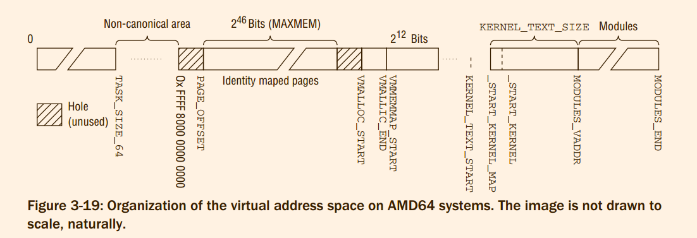

# Professional Linux Kernel Architecture : Memory Management
## 3.1 Overview
Memory management implementation covers many areas:
1. Management of physical pages in memory.
1. The buddy system to allocate memory in large chunks.
1. The slab, slub, and slob allocators to allocate smaller chunks of memory.
1. The vmalloc mechanism to allocate non-contiguous blocks of memory.
1. The address space of processes

As we know, the virtual address space of the processor is in general divided into two parts by
the Linux kernel. The lower and larger part is available to user processes, and the upper part is
reserved for the kernel
Whereas the **lower part** is modified during a context switch (between two
user processes), the **kernel part** of virtual address space always remains the same.

***The available physical memory is mapped into the address space of the kernel.***
Accesses with virtual addresses whose offset to the start of the kernel area does not exceed the size of the available RAM are therefore *automatically* associated with physical page frames. This is practical because memory allocations in the kernel area always land in physical RAM when this scheme is adopted.
However, there is one problem. The virtual address space portion of the kernel is necessarily smaller than the
maximum theoretical address space of the CPU. If there is more physical RAM than can be mapped
into the kernel address space, the kernel must resort to the *highmem* method to manage ‘‘superfluous‘‘ memory.
On IA-32 systems, up to 896 MiB of RAM can be managed *directly*; anything above this figure (up to a maximum of 4 GiB) can only be addressed by means of highmem.
> 问题:
> 1. 896M的空间直接管理的含义是不是因为虚拟地址和物理地址就是做差的得到的线性映射?
> 2. 是不是当内核空间是一一映射，如果是，那么内核可以使用的物理空间总是在1:3 中的1 里面,或者说内核kmalloc可以分配的空间只有896M
> 3. 为什么要将available physical memory全部映射到内核地址空间中间 ?


1. https://www.kernel.org/doc/Documentation/vm/highmem.txt
> 问题:
> 1. 一块物理内存，被映射(mapping)之后才可以被使用，那么被映射是什么意思 ?
> 2. 书上似乎没有提到vmap kmap


2. https://unix.stackexchange.com/questions/4929/what-are-high-memory-and-low-memory-on-linux

A kernel processes gets its address (range) here. The kernel can directly access this 1 GB of addresses (well, not the full 1 GB, there are 128 MB reserved for high memory access).

Processes spawned in kernel space are trusted, urgent and assumed error-free, the memory request gets processed instantaneously.

Every kernel process can also access the user space range if it wishes to. And to achieve this, the kernel maps an address from the user space (the high memory) to its kernel space (the low memory), the 128 MB mentioned above are especially reserved for this.

The use of highmem pages is problematic only for the kernel itself. The kernel
must first invoke the `kmap` and `kunmap` functions discussed below to map the
highmem pages into its virtual address space before it can use them — this is not
necessary with normal memory pages. However, for userspace processes, it makes
absolutely no difference if the pages are highmem or normal pages because they are
always accessed via page tables and never directly.
> kmap 和 kunmap 在64位机器上根本没有highmem,所以也不存在`kmap`和`kunmap`的问题
> 应该是: 内核的页表将所有的物理内存都是进行的线性映射，所以所有的访问都是简单的做差即可。


## 3.2 Organization in the (N)UMA Model
First, RAM memory is divided into `nodes`. A node is associated with each processor of the system and is
represented in the kernel by an instance of `pg_data_t` (these data structures are defined shortly)
```c
/*
 * The pg_data_t structure is used in machines with CONFIG_DISCONTIGMEM
 * (mostly NUMA machines?) to denote a higher-level memory zone than the
 * zone denotes.
 *
 * On NUMA machines, each NUMA node would have a pg_data_t to describe
 * it's memory layout.
 *
 * Memory statistics and page replacement data structures are maintained on a
 * per-zone basis.
 */
struct bootmem_data;
typedef struct pglist_data {
```

Each node is split into `zones` as further subdivisions of memory

```c
enum zone_type {
#ifdef CONFIG_ZONE_DMA
  /*
   * ZONE_DMA is used when there are devices that are not able
   * to do DMA to all of addressable memory (ZONE_NORMAL). Then we
   * carve out the portion of memory that is needed for these devices.
   * The range is arch specific.
   *
   * Some examples
   *
   * Architecture   Limit
   * ---------------------------
   * parisc, ia64, sparc  <4G
   * s390     <2G
   * arm      Various
   * alpha    Unlimited or 0-16MB.
   *
   * i386, x86_64 and multiple other arches
   *      <16M.
   */
  ZONE_DMA,
#endif
#ifdef CONFIG_ZONE_DMA32
  /*
   * x86_64 needs two ZONE_DMAs because it supports devices that are
   * only able to do DMA to the lower 16M but also 32 bit devices that
   * can only do DMA areas below 4G.
   */
  ZONE_DMA32,
#endif
  /*
   * Normal addressable memory is in ZONE_NORMAL. DMA operations can be
   * performed on pages in ZONE_NORMAL if the DMA devices support
   * transfers to all addressable memory.
   */
  ZONE_NORMAL,
#ifdef CONFIG_HIGHMEM
  /*
   * A memory area that is only addressable by the kernel through
   * mapping portions into its own address space. This is for example
   * used by i386 to allow the kernel to address the memory beyond
   * 900MB. The kernel will set up special mappings (page
   * table entries on i386) for each page that the kernel needs to
   * access.
   */
  ZONE_HIGHMEM,
#endif
  ZONE_MOVABLE,
#ifdef CONFIG_ZONE_DEVICE
  ZONE_DEVICE,
#endif
  __MAX_NR_ZONES

};
```
Each zone is associated with an array in which the physical memory pages belonging to the
zone — known as `page frames` in the kernel — are organized. An instance of `struct page` with the
required management data is allocated for each page frame.

> 这JB就非常的搞笑了，为什么CONFIG_NUMA在什么位置啊?


The nodes are kept on a singly linked list so that the kernel can traverse them.
> 跟踪一下代码，node 的管理总体来说的确如此:
> 1. node_states 和 pg_data_t 两者管理
> 2. 定义一个指针数组
> 有待分析的地方:
> 1. node_states 的具体实现


```c
/*
 * On NUMA machines, each NUMA node would have a pg_data_t to describe
 * it's memory layout. On UMA machines there is a single pglist_data which
 * describes the whole memory.
 *
 * Memory statistics and page replacement data structures are maintained on a
 * per-zone basis.
 */
struct bootmem_data;
typedef struct pglist_data {
  struct zone node_zones[MAX_NR_ZONES];
  struct zonelist node_zonelists[MAX_ZONELISTS];
  int nr_zones;
  ...
} pg_data_t;


#define MAX_NR_ZONES 4 /* __MAX_NR_ZONES */
```
> 一个node的描述

```c
/**
 * for_each_online_pgdat - helper macro to iterate over all online nodes
 * @pgdat - pointer to a pg_data_t variable
 */
#define for_each_online_pgdat(pgdat)      \
  for (pgdat = first_online_pgdat();    \
       pgdat;         \
       pgdat = next_online_pgdat(pgdat))
/**
 * for_each_zone - helper macro to iterate over all memory zones
 * @zone - pointer to struct zone variable
 *
 * The user only needs to declare the zone variable, for_each_zone
 * fills it in.
 */
#define for_each_zone(zone)             \
  for (zone = (first_online_pgdat())->node_zones; \
       zone;          \
       zone = next_zone(zone))

#define for_each_populated_zone(zone)           \
  for (zone = (first_online_pgdat())->node_zones; \
       zone;          \
       zone = next_zone(zone))      \
    if (!populated_zone(zone))    \
      ; /* do nothing */    \
    else
```
> 两个用于迭代的函数

`arch/x86/include/asm/mmzone_64.h`
```c
#ifdef CONFIG_NUMA

#include <linux/mmdebug.h>
#include <asm/smp.h>

extern struct pglist_data *node_data[];

#define NODE_DATA(nid)    (node_data[nid])

#endif

```

`arch/x86/mm/numa.c`
```c
struct pglist_data *node_data[MAX_NUMNODES] __read_mostly;
EXPORT_SYMBOL(node_data);
```


```c
#ifndef CONFIG_NEED_MULTIPLE_NODES
struct pglist_data __refdata contig_page_data;
EXPORT_SYMBOL(contig_page_data);
#endif
```
> 这应该就是所需要的list 吧!


`mmzone.h`: 每一个node 对于zone 的管理
```c
/*
 * This struct contains information about a zone in a zonelist. It is stored
 * here to avoid dereferences into large structures and lookups of tables
 */
struct zoneref {
  struct zone *zone;  /* Pointer to actual zone */
  int zone_idx;   /* zone_idx(zoneref->zone) */
};

/*
 * One allocation request operates on a zonelist. A zonelist
 * is a list of zones, the first one is the 'goal' of the
 * allocation, the other zones are fallback zones, in decreasing
 * priority.
 *
 * To speed the reading of the zonelist, the zonerefs contain the zone index
 * of the entry being read. Helper functions to access information given
 * a struct zoneref are
 *
 * zonelist_zone()  - Return the struct zone * for an entry in _zonerefs
 * zonelist_zone_idx()  - Return the index of the zone for an entry
 * zonelist_node_idx()  - Return the index of the node for an entry
 */
struct zonelist {
  struct zoneref _zonerefs[MAX_ZONES_PER_ZONELIST + 1];
};
```


If more than one node can be present on the system, the kernel keeps a bitmap that provides state information for each node. The states are specified with a bitmask, and the following values are possible:

> 本节的内容，正如NUMA的架构，从node -> zone -> page frame 逐级分析的.


**Memory Zones**
* The striking aspect of this structure is that it is divided into several sections separated by `ZONE_PADDING`. The compiler keyword `__cacheline_maxaligned_in_smp` is also used to achieve optimal cache alignment.
* The two spinlocks of the structure — `zone->lock` and `zone->lru_lock` — are often acquired because the kernel very frequently accesses the structure
> 为了处理SMP 上高频和并发访问的问题
> 1. 比较窒息的是: 每一个ZONE_PADDING的包含的内容属性是各有侧重的

* `free_area` is an array of data structures of the same name used to implement the buddy system.
Each array element stands for contiguous memory areas of a fixed size. Management of free
memory pages contained in each area is performed starting from `free_area`.
```c
struct free_area {
  struct list_head  free_list[MIGRATE_TYPES];
  unsigned long   nr_free;
};
```

* `name`

* `zone_start_pfn`

* `spanned_pages` specifies the total number of pages in the zone. However, not all need be usable
since there may be small holes in the zone as already mentioned.

```c
  /*
   * spanned_pages is the total pages spanned by the zone, including
   * holes, which is calculated as:
   *  spanned_pages = zone_end_pfn - zone_start_pfn;
   *
   * present_pages is physical pages existing within the zone, which
   * is calculated as:
   *  present_pages = spanned_pages - absent_pages(pages in holes);
   *
   * managed_pages is present pages managed by the buddy system, which
   * is calculated as (reserved_pages includes pages allocated by the
   * bootmem allocator):
   *  managed_pages = present_pages - reserved_pages;
   *
   * So present_pages may be used by memory hotplug or memory power
   * management logic to figure out unmanaged pages by checking
   * (present_pages - managed_pages). And managed_pages should be used
   * by page allocator and vm scanner to calculate all kinds of watermarks
   * and thresholds.
   *
   * Locking rules:
   *
   * zone_start_pfn and spanned_pages are protected by span_seqlock.
   * It is a seqlock because it has to be read outside of zone->lock,
   * and it is done in the main allocator path.  But, it is written
   * quite infrequently.
   *
   * The span_seq lock is declared along with zone->lock because it is
   * frequently read in proximity to zone->lock.  It's good to
   * give them a chance of being in the same cacheline.
   *
   * Write access to present_pages at runtime should be protected by
   * mem_hotplug_begin/end(). Any reader who can't tolerant drift of
   * present_pages should get_online_mems() to get a stable value.
   */
  atomic_long_t   managed_pages;
  unsigned long   spanned_pages;
  unsigned long   present_pages;
```

**Calculation of Zone Watermarks**
. This value scales nonlinearly with the size of the available
RAM. It is stored in the global variable `min_free_kbytes`.

The file `/proc/sys/vm/min_free_kbytes` allows reading and adapting the
value from userland.

```c
/*
 * Initialise min_free_kbytes.
 *
 * For small machines we want it small (128k min).  For large machines
 * we want it large (64MB max).  But it is not linear, because network
 * bandwidth does not increase linearly with machine size.  We use
 *
 *  min_free_kbytes = 4 * sqrt(lowmem_kbytes), for better accuracy:
 *  min_free_kbytes = sqrt(lowmem_kbytes * 16)
 *
 * which yields
 *
 * 16MB:  512k
 * 32MB:  724k
 * 64MB:  1024k
 * 128MB: 1448k
 * 256MB: 2048k
 * 512MB: 2896k
 * 1024MB:  4096k
 * 2048MB:  5792k
 * 4096MB:  8192k
 * 8192MB:  11584k
 * 16384MB: 16384k
 */
int __meminit init_per_zone_wmark_min(void)
{
...
  setup_per_zone_wmarks();
  refresh_zone_stat_thresholds();
  setup_per_zone_lowmem_reserve();
...
}
```


`setup_per_zone_pages_min` sets the `pages_min`, `pages_low`, and `pages_high` elements of struct zone.

Computing lowmem_reserve is done in `setup_per_zone_lowmem_reserve`. The kernel iterates over all
nodes of the system and calculates the minimum reserve for each zone of the node by dividing the total
number of page frames in the zone by sysctl_lowmem_reserve_ratio[zone]. The default settings for
the divisor are 256 for low memory and 32 for high memory

**Hot-N-Cold Pages**
The `pageset` element of struct zone is used to implement a hot-n-cold allocator

If possible, the per-CPU caches are not filled with individual pages but with multipage chunks. `batch` is
a guideline to the number of pages to be added in a single pass.


**Page Frames**
`mm_types.h`

```c
/*
 * Each physical page in the system has a struct page associated with
 * it to keep track of whatever it is we are using the page for at the
 * moment. Note that we have no way to track which tasks are using
 * a page, though if it is a pagecache page, rmap structures can tell us
 * who is mapping it.
 *
 * The objects in struct page are organized in double word blocks in
 * order to allows us to use atomic double word operations on portions
 * of struct page. That is currently only used by slub but the arrangement
 * allows the use of atomic double word operations on the flags/mapping
 * and lru list pointers also.
 */
struct page {
  unsigned long flags;    /* Atomic flags, some possibly
           * updated asynchronously */
  /*
   * Five words (20/40 bytes) are available in this union.
   * WARNING: bit 0 of the first word is used for PageTail(). That
   * means the other users of this union MUST NOT use the bit to
   * avoid collision and false-positive PageTail().
   */
  union {
    struct {  /* Page cache and anonymous pages */
      /**
       * @lru: Pageout list, eg. active_list protected by
       * pgdat->lru_lock.  Sometimes used as a generic list
       * by the page owner.
       */
      struct list_head lru;
      /* See page-flags.h for PAGE_MAPPING_FLAGS */
      struct address_space *mapping;
      pgoff_t index;    /* Our offset within mapping. */
      /**
       * @private: Mapping-private opaque data.
       * Usually used for buffer_heads if PagePrivate.
       * Used for swp_entry_t if PageSwapCache.
       * Indicates order in the buddy system if PageBuddy.
       */
      unsigned long private;
    };
    struct {  /* page_pool used by netstack */
      /**
       * @dma_addr: might require a 64-bit value even on
       * 32-bit architectures.
       */
      dma_addr_t dma_addr;
    };
    struct {  /* slab, slob and slub */
      union {
        struct list_head slab_list; /* uses lru */
        struct {  /* Partial pages */
          struct page *next;
#ifdef CONFIG_64BIT
          int pages;  /* Nr of pages left */
          int pobjects; /* Approximate count */
#else
          short int pages;
          short int pobjects;
#endif
        };
      };
      struct kmem_cache *slab_cache; /* not slob */
      /* Double-word boundary */
      void *freelist;   /* first free object */
      union {
        void *s_mem;  /* slab: first object */
        unsigned long counters;   /* SLUB */
        struct {      /* SLUB */
          unsigned inuse:16;
          unsigned objects:15;
          unsigned frozen:1;
        };
      };
    };
    struct {  /* Tail pages of compound page */
      unsigned long compound_head;  /* Bit zero is set */

      /* First tail page only */
      unsigned char compound_dtor;
      unsigned char compound_order;
      atomic_t compound_mapcount;
    };
    struct {  /* Second tail page of compound page */
      unsigned long _compound_pad_1;  /* compound_head */
      unsigned long _compound_pad_2;
      struct list_head deferred_list;
    };
    struct {  /* Page table pages */
      unsigned long _pt_pad_1;  /* compound_head */
      pgtable_t pmd_huge_pte; /* protected by page->ptl */
      unsigned long _pt_pad_2;  /* mapping */
      union {
        struct mm_struct *pt_mm; /* x86 pgds only */
        atomic_t pt_frag_refcount; /* powerpc */
      };
#if ALLOC_SPLIT_PTLOCKS
      spinlock_t *ptl;
#else
      spinlock_t ptl;
#endif
    };
    struct {  /* ZONE_DEVICE pages */
      /** @pgmap: Points to the hosting device page map. */
      struct dev_pagemap *pgmap;
      unsigned long hmm_data;
      unsigned long _zd_pad_1;  /* uses mapping */
    };

    /** @rcu_head: You can use this to free a page by RCU. */
    struct rcu_head rcu_head;
  };

  union {   /* This union is 4 bytes in size. */
    /*
     * If the page can be mapped to userspace, encodes the number
     * of times this page is referenced by a page table.
     */
    atomic_t _mapcount;

    /*
     * If the page is neither PageSlab nor mappable to userspace,
     * the value stored here may help determine what this page
     * is used for.  See page-flags.h for a list of page types
     * which are currently stored here.
     */
    unsigned int page_type;

    unsigned int active;    /* SLAB */
    int units;      /* SLOB */
  };

  /* Usage count. *DO NOT USE DIRECTLY*. See page_ref.h */
  atomic_t _refcount;

#ifdef CONFIG_MEMCG
  struct mem_cgroup *mem_cgroup;
#endif

  /*
   * On machines where all RAM is mapped into kernel address space,
   * we can simply calculate the virtual address. On machines with
   * highmem some memory is mapped into kernel virtual memory
   * dynamically, so we need a place to store that address.
   * Note that this field could be 16 bits on x86 ... ;)
   *
   * Architectures with slow multiplication can define
   * WANT_PAGE_VIRTUAL in asm/page.h
   */
#if defined(WANT_PAGE_VIRTUAL)
  void *virtual;      /* Kernel virtual address (NULL if
             not kmapped, ie. highmem) */
#endif /* WANT_PAGE_VIRTUAL */

#ifdef LAST_CPUPID_NOT_IN_PAGE_FLAGS
  int _last_cpupid;
#endif
} _struct_page_alignment;


> 正如前面说过的那样，`struct page `中间包含超级内容，而且使用union的方式
> 1. 一定存在只有两个变量
>     * `_refcount`
>     * flags
> 2. 若干可选变量
> 3. union ----> 4byte ---> 标志信息
> 4. union ----> 4byte ---> 具体用途信息
> ```c
>      struct { /* Page cache and anonymous pages */
>      struct { /* page_pool used by netstack */
>      struct { /* slab, slob and slub */
>      struct { /* Tail pages of compound page */
>      struct { /* Second tail page of compound page */
>      struct { /* Page table pages */
>      struct { /* ZONE_DEVICE pages */
>  ```

> FIXME 文章描述其中部分变量，但是实际上已经发生了变化

**Architecture-Independent Page Flags**
Not only are the individual flags defined with the help of the pre-processor in `page-flags.h`, but also
macros are generated to set, delete, and query the flags. In doing so, the kernel conforms to a universal
naming scheme;

Which page flags are available? The following list includes the most important flags (again, their meanings become clear in later chapters):

```c
/*
 * Various page->flags bits:
 *
 * PG_reserved is set for special pages. The "struct page" of such a page
 * should in general not be touched (e.g. set dirty) except by its owner.
 * Pages marked as PG_reserved include:
 * - Pages part of the kernel image (including vDSO) and similar (e.g. BIOS,
 *   initrd, HW tables)
 * - Pages reserved or allocated early during boot (before the page allocator
 *   was initialized). This includes (depending on the architecture) the
 *   initial vmemmap, initial page tables, crashkernel, elfcorehdr, and much
 *   much more. Once (if ever) freed, PG_reserved is cleared and they will
 *   be given to the page allocator.
 * - Pages falling into physical memory gaps - not IORESOURCE_SYSRAM. Trying
 *   to read/write these pages might end badly. Don't touch!
 * - The zero page(s)
 * - Pages not added to the page allocator when onlining a section because
 *   they were excluded via the online_page_callback() or because they are
 *   PG_hwpoison.
 * - Pages allocated in the context of kexec/kdump (loaded kernel image,
 *   control pages, vmcoreinfo)
 * - MMIO/DMA pages. Some architectures don't allow to ioremap pages that are
 *   not marked PG_reserved (as they might be in use by somebody else who does
 *   not respect the caching strategy).
 * - Pages part of an offline section (struct pages of offline sections should
 *   not be trusted as they will be initialized when first onlined).
 * - MCA pages on ia64
 * - Pages holding CPU notes for POWER Firmware Assisted Dump
 * - Device memory (e.g. PMEM, DAX, HMM)
 * Some PG_reserved pages will be excluded from the hibernation image.
 * PG_reserved does in general not hinder anybody from dumping or swapping
 * and is no longer required for remap_pfn_range(). ioremap might require it.
 * Consequently, PG_reserved for a page mapped into user space can indicate
 * the zero page, the vDSO, MMIO pages or device memory.
 *
 * The PG_private bitflag is set on pagecache pages if they contain filesystem
 * specific data (which is normally at page->private). It can be used by
 * private allocations for its own usage.
 *
 * During initiation of disk I/O, PG_locked is set. This bit is set before I/O
 * and cleared when writeback _starts_ or when read _completes_. PG_writeback
 * is set before writeback starts and cleared when it finishes.
 *
 * PG_locked also pins a page in pagecache, and blocks truncation of the file
 * while it is held.
 *
 * page_waitqueue(page) is a wait queue of all tasks waiting for the page
 * to become unlocked.
 *
 * PG_uptodate tells whether the page's contents is valid.  When a read
 * completes, the page becomes uptodate, unless a disk I/O error happened.
 *
 * PG_referenced, PG_reclaim are used for page reclaim for anonymous and
 * file-backed pagecache (see mm/vmscan.c).
 *
 * PG_error is set to indicate that an I/O error occurred on this page.
 *
 * PG_arch_1 is an architecture specific page state bit.  The generic code
 * guarantees that this bit is cleared for a page when it first is entered into
 * the page cache.
 *
 * PG_hwpoison indicates that a page got corrupted in hardware and contains
 * data with incorrect ECC bits that triggered a machine check. Accessing is
 * not safe since it may cause another machine check. Don't touch!
 */

/*
 * Don't use the *_dontuse flags.  Use the macros.  Otherwise you'll break
 * locked- and dirty-page accounting.
 *
 * The page flags field is split into two parts, the main flags area
 * which extends from the low bits upwards, and the fields area which
 * extends from the high bits downwards.
 *
 *  | FIELD | ... | FLAGS |
 *  N-1           ^       0
 *               (NR_PAGEFLAGS)
 *
 * The fields area is reserved for fields mapping zone, node (for NUMA) and
 * SPARSEMEM section (for variants of SPARSEMEM that require section ids like
 * SPARSEMEM_EXTREME with !SPARSEMEM_VMEMMAP).
 */
enum pageflags {
```

Often it is necessary to wait until the state of a page changes, and then resume work. Two auxiliary
functions provided by the kernel are of particular interest for us:
`pagemap.h`
```c
void wait_on_page_locked(struct page *page);
void wait_on_page_writeback(struct page *page)

/*
 * Wait for a page to complete writeback
 */
static inline void wait_on_page_writeback(struct page *page)
{
  if (PageWriteback(page))
    wait_on_page_bit(page, PG_writeback);
}
```

A number of standard macros are defined to check if a page has a specific bit is set, or to manipulate a
bit. Their names follow a certain pattern:
1. `PageXXX(page)` checks if a page has the PG_XXX bit set.
2. To set a bit if it is not set and return the previous value, `SetPageXXX` is provided.
3. `ClearPageXXX` unconditionally deletes a specific bit.
4. `TestClearPageXXX` clears a bit if it is set, but also returns the previously active value.


## 3.3 Page Tables
The structures discussed so far
serve to describe the structure of RAM memory (partitioning into **nodes** and **zones**) and to specify the
number and state (used or free) of the page frames contained.

1. Page tables are used to make a uniform virtual address space available to each process; the applications see this space as a contiguous memory area.
2. The tables also map the virtual pages used into RAM, thus supporting the implementation of shared memory (memory shared by several processes at the same time) and the swapping-out of pages

***Page table management is split into two parts, the first architecture-dependent, the second architecture-independent.***

Kernel memory management assumes four-level page tables — regardless of whether this is the case
for the underlying processor. The best example where this assumption is not true is IA-32 systems. By
default, this architecture uses only a two-level paging system — assuming the PAE extensions are not
used. Consequently, the third and fourth levels must be emulated by architecture- specific code.
> 所有的四级page walk，对于IA-32 的系统来说，其中两级使用模拟!
> ***证据***


#### 3.3.1 Data Structures
The kernel sources assume that `void*` and `unsigned long` have the same number of bits so that they can
be mutually converted by means of typecasts without loss of information. This assumption — expressed
formally as `sizeof(void*) == sizeof(unsigned long)` — is, of course, true on all architectures supported by Linux.

Memory management prefers to use variables of type unsigned long instead of void pointers because
they are easier to handle and manipulate. Technically, they are both equally valid.

**Breakdown of Addresses in Memory**
The size of the address area that can be addressed with pointers of n-bit length is 2n bytes. The kernel
defines additional macro variables to hold the values calculated so that it is unnecessary to repeat the
calculations time and time again. The variables are defined as follows:


```c
#define PAGE_SIZE (1UL << PAGE_SHIFT)
#define PUD_SIZE (1UL << PUD_SHIFT)
#define PMD_SIZE (1UL << PMD_SHIFT)
#define PGDIR_SIZE (1UL << PGDIR_SHIFT)

#define PGDIR_SHIFT 39
#define PTRS_PER_PGD 512
#define PUD_SHIFT 30
#define PTRS_PER_PUD 512
#define PMD_SHIFT 21
#define PTRS_PER_PMD 512
```
> x86的定义中间: page size 是锁死的
> 定义被划分到两个文件中间了 `page_types.h` 以及 `pagetable_64_types.h`

**Format of Page Tables**
The standard functions to analyze page table entries are listed in ***Table 3-2***.

**PTE-Specific Entries**
Each final entry in the page table not only yields a pointer to the memory location of the page, but also
holds additional information on the page in the superfluous bits mentioned above. Although these data
are CPU-specific, they usually provide at least some information on page access control. The following
elements are found in most CPUs supported by the Linux kernel:
> PTE 最后的bit 一般会放入flags, 不同的架构放入的一般相同
> 1. 注意page struct 中间的flag 和　此处的flag 的区别

```c
#define _PAGE_BIT_PRESENT 0 /* is present */
#define _PAGE_BIT_RW    1 /* writeable */
#define _PAGE_BIT_USER    2 /* userspace addressable */
#define _PAGE_BIT_PWT   3 /* page write through */
#define _PAGE_BIT_PCD   4 /* page cache disabled */
#define _PAGE_BIT_ACCESSED  5 /* was accessed (raised by CPU) */
#define _PAGE_BIT_DIRTY   6 /* was written to (raised by CPU) */
#define _PAGE_BIT_PSE   7 /* 4 MB (or 2MB) page */
#define _PAGE_BIT_PAT   7 /* on 4KB pages */
#define _PAGE_BIT_GLOBAL  8 /* Global TLB entry PPro+ */
#define _PAGE_BIT_SOFTW1  9 /* available for programmer */
#define _PAGE_BIT_SOFTW2  10  /* " */
#define _PAGE_BIT_SOFTW3  11  /* " */
#define _PAGE_BIT_PAT_LARGE 12  /* On 2MB or 1GB pages */
#define _PAGE_BIT_SOFTW4  58  /* available for programmer */
#define _PAGE_BIT_PKEY_BIT0 59  /* Protection Keys, bit 1/4 */
#define _PAGE_BIT_PKEY_BIT1 60  /* Protection Keys, bit 2/4 */
#define _PAGE_BIT_PKEY_BIT2 61  /* Protection Keys, bit 3/4 */
#define _PAGE_BIT_PKEY_BIT3 62  /* Protection Keys, bit 4/4 */
#define _PAGE_BIT_NX    63  /* No execute: only valid after cpuid check */
```

A summary of all functions provided to manipulate PTE entries can be found in ***Table 3-3***.


> ***Table 3-2***  ***Table 3-3*** omit
> 本节介绍的内容主要是:
> 1. 一个虚拟地址一般划分为 4部分
> 2. 多余的bit 可以利用
> 3. 以上两者

#### 3.3.2 Creating and Manipulating Entries
1. mk_pte
2. pte_page
3. `*_alloc`
4. `*_free`
5. `set_*`


## 3.4 Initialization of Memory Management
As the CPU-specific parts of memory management initialization employ many minor, subtle details of
the underlying architecture that reveal little of interest about the structure of the kernel and are simply
best practices in assembly language programming, let’s concern ourselves in this section only with initialization work on a higher level. The key aspect is initialization of the `pg_data_t` data structure (and its
subordinate structures) introduced in Section 3.2.2 because this is already machine-independent.
> 本节仅仅介绍 high level 的东西, 仅仅分析到`pg_data_t`

Because the kernel needs memory before memory management is fully initialized,
a simple additional form of memory management is used during the boot process and is
discarded thereafter.


#### 3.4.1 Data Structure Setup
At this point, an instance of `pg_data_t` has been generated for each system memory mode
to hold information on how much memory there is in the node and how it is distributed over the node
zones. The architecture-specific `NODE_DATA` macro implemented on all platforms is used to query the
`pg_data_t` instance associated with a NUMA node by reference to the number of the instance
> 原来`NODE_DATA`是 arch specific 的

**Prerequisites**

Since the majority of systems have just one memory node, only systems of this type are examined below. What is the situation on such systems?
To ensure that memory management code is portable (so that it
can be used on UMA and NUMA systems alike), the kernel defines a single instance of `pg_data_t` (called `node_data`) in `mm/page_alloc.c` to manage all system memory.
As the file pathname suggests, this is not a CPU-specific implementation; in fact, it is adopted by most architectures. The implementation
of `NODE_DATA` is now even simpler.

```c
struct pglist_data *node_data[MAX_NUMNODES] __read_mostly;
EXPORT_SYMBOL(node_data);

#define NODE_DATA(nid)  (node_data[nid])
```

The kernel can also rely on the fact that the architecture-dependent initialization code has set the
`numnodes` variable to the number of nodes present in the system. This number is 1 on UMA systems
because only one (formal) node is present.
> 1. 实际上，显然这一个数值有点奇怪啊, 只有在x86 powerpc 中间才定义
> 2. 应该采用了其他的方案


* **System Start**
```c
start_kernel
  setup_arch
  setup_per_cpu_areas
  build_all_zonelists
  mem_init
  setup_per_cpu_pageset
```
> 其实，start_kernel 中间调用了超级多函数，上面是内存初始化的关键函数

1. `setup_arch` is an architecture-specific set-up function responsible for, among other things, initialization of the boot allocator.
2. On SMP systems, `setup_per_cpu_areas` initializes per-CPU variables defined statically
in the source code (using the per_cpu macro) and of which there is a separate copy for each
CPU in the system. Variables of this kind are stored in a separate section of the
kernel binaries. The purpose of `setup_per_cpu_areas` is to create a copy of these data for each system CPU. This function is a null operation on non-SMP systems.
3. `build_all_zonelists` sets up the node and zone data structures.
4. `mem_init` is another architecture-specific function to disable the bootmem allocator and perform
the transition to the actual memory management functions.
5. `kmem_cache_init` initializes the in-kernel allocator for small memory regions.
6. `setup_per_cpu_pageset` allocates memory for the first array element of the pageset arrays from
struct zone mentioned above. Allocating the first array element means, in other words, for the
first system processor. All memory zones of the system are taken into account.
The function is also responsible for setting the limits for the hot-n-cold allocator discussed at
length in Section 3.5.3.
Notice that the pageset arrays members of other CPUs on SMP systems will be initialized when
they are activated.
> 1. 函数具体实现不了解
> 2. 就初始化内存而言，有东西是欠缺的


* **Node and Zone Initialization**

The portion of `build_all_zonelists` that is currently of
interest to us (there is some more work to do for the *page group mobility extensions* to the page allocator,
but I will discuss this separately below) delegates all work to `__build_all_zonelists`, which, in turn,
invokes `build_zonelists` for each NUMA node in the system.


```c
/* return values int ....just for stop_machine() */
static int __build_all_zonelists(void *data)
{
...
  for_each_online_node(nid) {
    pg_data_t *pgdat = NODE_DATA(nid);

    build_zonelists(pgdat);
  }
...
}
```

The task of the function(`build_all_zonelists`) is to establish a **ranking order** between the zones of the node currently being
processed and the other nodes in the system; memory is then allocated according to this order. *This is important if no memory is free in the desired node zone.*

On UMA systems, NODE_DATA returns the address of `contig_page_data`
```c
#ifndef CONFIG_NEED_MULTIPLE_NODES
struct pglist_data __refdata contig_page_data;
EXPORT_SYMBOL(contig_page_data);
#endif
```
> 当没有多个节点(node) 的时候，那么就没有必要定义成为数组了

The kernel defines a memory hierarchy and first tries to allocate ‘‘cheap‘‘ memory. If this fails, it gradually
tries to allocate memory that is ‘‘more costly‘‘ in terms of access and capacity.

The high memory (highmem) range is cheapest because *no part of the kernel depends on memory allocated from this area*. There is no negative effect on the kernel if the highmem area is full — and this is
why it is filled first.

`build_zonelists`: A large external loop first iterates over all node zones. Each loop pass looks for the zone entry for the i-th
zone in the zonelist array in which the fallback list is held.

```c
/*
 * Build zonelists ordered by zone and nodes within zones.
 * This results in conserving DMA zone[s] until all Normal memory is
 * exhausted, but results in overflowing to remote node while memory
 * may still exist in local DMA zone.
 */

static void build_zonelists(pg_data_t *pgdat)
{
  static int node_order[MAX_NUMNODES];
  int node, load, nr_nodes = 0;
  nodemask_t used_mask;
  int local_node, prev_node;

  /* NUMA-aware ordering of nodes */
  local_node = pgdat->node_id;
  load = nr_online_nodes;
  prev_node = local_node;
  nodes_clear(used_mask);

  memset(node_order, 0, sizeof(node_order));
  while ((node = find_next_best_node(local_node, &used_mask)) >= 0) {
    /*
     * We don't want to pressure a particular node.
     * So adding penalty to the first node in same
     * distance group to make it round-robin.
     */
    if (node_distance(local_node, node) !=
        node_distance(local_node, prev_node))
      node_load[node] = load;

    node_order[nr_nodes++] = node;
    prev_node = node;
    load--;
  }

  build_zonelists_in_node_order(pgdat, node_order, nr_nodes);
  build_thisnode_zonelists(pgdat);
}
```

The kernel uses an array of **zonelist** elements in `pg_data_t` to represent the described hierarchy as a
data structure.
>

#### 3.4.2 Architecture-Specific Setup
> 这里，作者解释了为什么使用IA-32作为例子

**Arrangement of the Kernel in Memory**


1. The first 4,096 KiB — the first page frame — are omitted because they are
often reserved for the BIOS.
2. The next 640 KiB would be usable in principle, but are again not used for
kernel loading. The reason is that this area is immediately followed by an area reserved for the system
into which various ROM ranges are mapped (typically the system BIOS and the graphic card ROM). It
is not possible to write to these areas. However, the kernel should always be loaded into a contiguous
memory range, and this would be possible only for kernels smaller than 640 KiB if the start address of
RAM memory were used as the start position for the kernel image.
3. To resolve these problems, IA-32 kernels use 0x100000 as the start address; this corresponds to the start
of the first megabyte in RAM memory. There is sufficient contiguous memory at this point to hold the
entire kernel

The memory occupied by the kernel is split into several sections whose bounds are held in variables.
1. `_text` and `_etext` are the start and end address of the text section that contains the compiled kernel code.
1. The data section in which most kernel variables are kept is located between `_etext` and `_edata`.
1. Initialization data no longer needed after the kernel boot process is finished (among others, e.g.,
the BSS segment that contains all static global variables initialized to 0) are held in the last
section, which extends from `_edata` to `_end`. Once kernel initialization has completed, most of
the data can be removed from memory leaving more space for applications. The interval is split
> 放屁，怎么可能初始化完毕之后，initialization data 就不需要了，举个例子。

Although the variables used to define section bounds are defined in the kernel source code
(`arch/x86/kernel/setup.c`), no values are assigned to them at this point. This is simply not
possible. How can the compiler know at compilation time how large the kernel will be ? The exact value is
only established when the object files are linked, and it is then patched into the binary file. This action is
controlled by `arch/x86/vmlinux.lds.S`, where
the kernel memory layout is also defined

> 1. 在`arch/x86/kernel/setup.c` 中间，有老朋友`e820`
> 2. vmlinux.lds.S ld的脚本必须学会

Each time the kernel is compiled, a file named `System.map` is generated and stored in the source base directory.
1. Besides the addresses of all other (global) variables, procedures, and functions defined in the kernel, (所有的函数定义)
2. this file also includes the values of the constants shown in Figure 3-11(`_text`, `_etext`等的位置)

> 观察脚本可以发现:
> 1. `ffffffff81000000 T _text` 所以为什么选择`81000000` 的位置开始
> 2. `ffffffff81000000`难道不是一个超过实际物理内存范围的数值吗, 所以采用什么方式进行的映射
> 3. `T` 是表示什么类型 ?
> 4. 哪一个函数用于生成`System.map`的?
> 5. 为什么`System.map`　开始的部分有大量的地址似乎是实地址`0000000000000000 D __per_cpu_start`

All values have the offset `0xC0000000`, which is the start address of the kernel
segment if the standard 3 : 1 split between user and kernel address space is chosen.
**The addresses are virtual addresses because RAM memory is mapped into the
virtual address space as a linear mapping starting at this address.
The corresponding physical addresses are obtained by subtraction from `0xC0000000`**


`sudo cat /proc/iomem` also provides information on the sections into which RAM memory is divided.

The kernel image begins above the first megabyte (0x00100000). The size of the code is approximately
2.5 MiB, and the data section accounts for about 0.9 MiB.
```
100000000-46effffff : System RAM
  1f8c00000-1f9800e90 : Kernel code
  1f9800e91-1f9f429bf : Kernel data
  1fa434000-1fa7fffff : Kernel bss
```
> 1. 在真机(x86_64)上测试结果为12M
> 2. 由于是64bit的机器，所以开始位置是从16M的位置开始的
> 3. 上面的地址是物理地址(正常)


> 本小节分析了
> 1. 内核中间的分布(我觉得和前面的内容有点脱节 -> 对于NUMA系统，加载到哪一个位置上面去?)
> 2. 两种验证的方法

**Initialization Steps**

> 注意: `setup_arch` 虽然是在 `build_zonelists` 后面介绍的，但是其中

基本
- `setup_arch`
  - `machine_specific_memory_setup`
  - `parse_early_param`
  - `setup_memory`
  - `paging_init`
    - `pagetable_init`
  - `zone_sizes_init`
    - `add_active_range`
    - `free_area_init_nodes`
> IA-32 调用

```
setup_arch
  setup_memory_region
  parse_early_param
  e820_register_active_region
      add_active_range
  init_memory_mapping
  contig_initmem_init
  paging_init
     free_area_init_nodes
```
> 调用流程IA-64
> 变化是很大的，总体如此.


1. `machine_specific_memory_setup` is first invoked to create a list with the memory regions occupied by
the system and the free memory regions.
> 实际上由于架构优化，这一个函数并不存在，实际上实现功能的函数为`default_machine_specific_memory_setup`
> 1. 我不知道上面的结论是如何得的，两个函数都都没有找到.


```c
void __init setup_memory_map(void) {
  char *who;

  who = x86_init.resources.memory_setup();
  memcpy(&e820_saved, &e820, sizeof(struct e820map));
  printk(KERN_INFO "e820: BIOS-provided physical RAM map:\n");
  e820_print_map(who);
}


/*
 * The platform setup functions are preset with the default functions
 * for standard PC hardware.
 */
struct x86_init_ops x86_init __initdata = {

  .resources = {
    .probe_roms   = probe_roms,
    .reserve_resources  = reserve_standard_io_resources,
    .memory_setup   = default_machine_specific_memory_setup,
  },
```


```c
void __init e820_print_map(char *who) {
  int i;

  for (i = 0; i < e820.nr_map; i++) {
    printk(KERN_INFO "%s: [mem %#018Lx-%#018Lx] ", who,
           (unsigned long long) e820.map[i].addr,
           (unsigned long long)
           (e820.map[i].addr + e820.map[i].size - 1));
    e820_print_type(e820.map[i].type);
    printk(KERN_CONT "\n");
  }
}
```


2. The kernel then analyzes the command line with `parse_cmdline_early`

```c
/* Arch code calls this early on, or if not, just before other parsing. */
void __init parse_early_param(void) {
  static int done __initdata;
  static char tmp_cmdline[COMMAND_LINE_SIZE] __initdata;

  if (done)
    return;

  /* All fall through to do_early_param. */
  strlcpy(tmp_cmdline, boot_command_line, COMMAND_LINE_SIZE);
  parse_early_options(tmp_cmdline);
  done = 1;
}
```
> 1. 参数是从什么位置传送过来的,　是从BIOS 还是用户的配置文件中间?


3. The next major step is performed in `setup_memory`
They both have the same effect although their implementation differ.
- The number of physical pages available (per node) is determined.
- The `bootmem` allocator is initialized
- Various memory areas are then reserved, for instance, for the initial RAM disk needed when running the first userspace processes.


4. `paging_init` initializes the kernel page tables and enables paging since it is not active by default on IA-32 machines.
By calling `pagetable_init`, ***the function also ensures that the direct mapping of physical memory into the kernel
address space is initialized***. All page frames in low memory are directly mapped to the virtual memory
region above `PAGE_OFFSET`. This allows the kernel to address a good part of the available memory without having to deal with page tables anymore.
> 应该此处就是内核中间实现　线性映射 建立的地方了

`x86_init.h`
```c
/**
 * struct x86_init_paging - platform specific paging functions
 * @pagetable_init: platform specific paging initialization call to setup
 *      the kernel pagetables and prepare accessors functions.
 *      Callback must call paging_init(). Called once after the
 *      direct mapping for phys memory is available.
 */
struct x86_init_paging {
  void (*pagetable_init)(void);
};
```
`x86_init.c`
```c
/*
 * The platform setup functions are preset with the default functions
 * for standard PC hardware.
 */
struct x86_init_ops x86_init __initdata = {
...
  .paging = {
    .pagetable_init   = native_pagetable_init,
  },
...
}
```

`pagetable_types.h`
```c
#ifdef CONFIG_X86_32
extern void native_pagetable_init(void);
#else
#define native_pagetable_init        paging_init
#endif
```

`init_64.c`
```c
void __init paging_init(void)
{
  sparse_memory_present_with_active_regions(MAX_NUMNODES);
  sparse_init();

  /*
   * clear the default setting with node 0
   * note: don't use nodes_clear here, that is really clearing when
   *   numa support is not compiled in, and later node_set_state
   *   will not set it back.
   */
  node_clear_state(0, N_MEMORY);
  if (N_MEMORY != N_NORMAL_MEMORY)
    node_clear_state(0, N_NORMAL_MEMORY);

  zone_sizes_init();
}
```

> 1. 查询pagetable_init 函数其实是找不到的，因为采用了船新的初始化模式, 在IA-64上最终注册的函数是 paging_init
> 2. 并没有查询到paging_init 所处理的初始化 page table 相关的内容


5. Calling `zone_sizes_init` initializes the `pgdat_t` instances of all nodes of the system
 First a comparatively simple list of the available physical memory is prepared using `add_active_range`. The
architecture-independent function `free_area_init_nodes` then uses this information to prepare the
**full-blown** kernel data structures.
> 1. emmmmmm ? `paging_init` 调用的 `zone_sizes_init`, 你敢信 ?
> 2. `free_area_init_nodes` ????

6. The basic memory setup does not require any machine-type-specific handling, but can always be
done with `setup_memory_region`. Information about the available RAM is given by the so-called
E820 map supplied from the BIOS. After parsing the command-line options relevant for the
early boot process, a simple list of the available memory is created by `add_active` called from
`e820_register_active_region`, which, in turn, just walks over the information provided by parsing the
E820 map above.
> 1. `setup_memory_region` 找不到啊
> 2. `e820_register_active_region` 也没有啊


7. The kernel then calls `init_memory_mapping` to directly map the available physical memory into the virtual address space portion of the kernel starting from PAGE_OFFSET. contig_initmem_init is responsible
to activate the bootmem allocator

8. The last function in the list, `paging_init`, is actually a misnomer: **It does not initialize paging, but has
to deal with some set-up routines for sparse memory systems that are not interesting for our purposes.**
The important thing, however, is that the function also calls `free_area_init_nodes`, which is as in the
IA-32 case responsible to initialize the data structures required to manage physical page frames by the
kernel. Recall that this is an architecture-independent function and relies on the information provided
by `add_active_range` as mentioned above.


**Initialization of Paging**
`paging_init` is responsible for setting up the page tables that can be used only by the kernel and are not accessible in userspace.
This has far-reaching effects on the way in which access to memory is regulated
between normal applications and the kernel itself.
> `paging_init` 是划分用户和内核空间的开始


The major reasons for this division(4 GiB in a ratio of 3 : 1) are as follows:
1. When execution of a user application switches to kernel mode, the kernel must be embedded in
a reliable environment. It is therefore essential to assign part of the address space exclusively to the kernel.
2. The physical pages are mapped to the start of the kernel address space so that the kernel can
access them directly without the need for complicated page table operations
> 1. 对于第一条，我是不认可的，难道不可以使用page_table进行管理吗 ? 内核的page dir 难道不可以记录到底哪里的内存区域是被kernel 使用的

If all physical pages were mapped into the address space accessible to userspace processes, this would
lead to serious security problems if several applications were running on the system. Each application
would then be able to read and modify the memory areas of other processes in physical RAM. Obviously
this must be prevented at all costs.
> 我是不赞成的，因为什么所有的user program 也是有自己的 page directory 的，显然是可以通过限制user program 只能访问指定的page frame
> 而不是通过1:3 如何粗暴的方法，直接禁止访问指定的位置的物理内存


As the figure shows, the `direct mapping` area extends from `0xC0000000` to the `high_memory`

Here’s the bad news. The kernel cannot map the whole of physical memory at once if it is larger than 896 MiB
> 1. 这不是废话吗? 仅仅划分1G 怎么可能映射所有的空间，我比较怀疑ucore 中间，内核就是映射所有的物理地址


It would also be possible to get rid of the split completely by introducing two 4 GiB address spaces, one for the kernel and one for
each userspace program. However, context switches between kernel and user mode are more costly in this case.
> 1. 这不就是我一直想要的东西吗?
> 2. 使用划分的方案，context switch 的代价是什么，使用两个4G 的空间，增加的代价是什么?

The kernel port must provide two macros for each architecture to translate between physical and virtual
addresses in the identity-mapped part of virtual kernel memory (ultimately this is a platform-dependent
task)
1. `__pa(vaddr)` returns the physical address associated with the virtual address vaddr.
2. `__va(paddr)` yields the virtual address corresponding to the physical address paddr.

```c
#define __pa(x)   __phys_addr((unsigned long)(x))

unsigned long __phys_addr(unsigned long x)
{
  unsigned long y = x - __START_KERNEL_map;

  /* use the carry flag to determine if x was < __START_KERNEL_map */
  if (unlikely(x > y)) {
    x = y + phys_base;

    VIRTUAL_BUG_ON(y >= KERNEL_IMAGE_SIZE);
  } else {
    x = y + (__START_KERNEL_map - PAGE_OFFSET);

    /* carry flag will be set if starting x was >= PAGE_OFFSET */
    VIRTUAL_BUG_ON((x > y) || !phys_addr_valid(x));
  }

  return x;
}

static inline unsigned long __phys_addr_nodebug(unsigned long x) {
  unsigned long y = x - __START_KERNEL_map;

  /* use the carry flag to determine if x was < __START_KERNEL_map */
  x = y + ((x > y) ? phys_base : (__START_KERNEL_map - PAGE_OFFSET));

  return x;
}
```
> 实际上ccls对于`phys_base`的符号跳转有问题
> 目前没有办法找到`phys_base`的位置
> 这导致，根本无法理`__phys_addr`的具体细节，只是知道内核空间的确含有


接下来对于32位和64位两个版本分别展示:

1. 64位
```
#define __AC(X,Y) (X##Y)
#define _AC(X,Y)  __AC(X,Y)
#define _AT(T,X)  ((T)(X))
```

```
/*
 * Set __PAGE_OFFSET to the most negative possible address +
 * PGDIR_SIZE*16 (pgd slot 272).  The gap is to allow a space for a
 * hypervisor to fit.  Choosing 16 slots here is arbitrary, but it's
 * what Xen requires.
 */
#define __PAGE_OFFSET       _AC(0xffff880000000000, UL)

#define __START_KERNEL_map  _AC(0xffffffff80000000, UL)

#define PAGE_OFFSET   ((unsigned long)__PAGE_OFFSET)
```

2. 32位
```
#define __phys_addr_nodebug(x)  ((x) - PAGE_OFFSET)
#define PAGE_OFFSET   ((unsigned long)__PAGE_OFFSET)


/*
 * This handles the memory map.
 *
 * A __PAGE_OFFSET of 0xC0000000 means that the kernel has
 * a virtual address space of one gigabyte, which limits the
 * amount of physical memory you can use to about 950MB.
 *
 * If you want more physical memory than this then see the CONFIG_HIGHMEM4G
 * and CONFIG_HIGHMEM64G options in the kernel configuration.
 */
#define __PAGE_OFFSET   _AC(CONFIG_PAGE_OFFSET, UL)
```


For what purpose does the kernel use the last 128 MiB of its address space? As Figure 3-15 shows, it is
put to three uses:
1. Virtually contiguous memory areas that are not contiguous in physical memory can be
reserved in the `vmalloc` area. While this mechanism is commonly used with user processes,
the kernel itself tries to avoid non-contiguous physical addresses as best it can. It usually
succeeds because most of the large memory blocks are allocated for the kernel at boot time
when RAM is not yet fragmented. However, on systems that have been running for longer
periods, situations can arise in which the kernel requires physical memory but the space
available is not contiguous. A prime example of such a situation is when modules are loaded
dynamically.
2. `Persistent mappings` are used to map non-persistent pages from the highmem area into the kernel.
3. `Fixmaps` are virtual address space entries associated with a *fixed but freely selectable page
in physical address space*. In contrast to directly mapped pages that are associated with
RAM memory by means of a fixed formula, the association between a virtual fixmap address
and the position in RAM memory can be freely defined and is then always observed by the kernel.

Two pre-processor symbols are important in this context: `__VMALLOC_RESERVE` sets the size of the vmalloc
area, and MAXMEM denotes the maximum possible amount of physical RAM that can be directly addressed
by the kernel.
> 1. pre-processor

`page_32_types.h`
```c
/*
 * This much address space is reserved for vmalloc() and iomap()
 * as well as fixmap mappings.
 */
extern unsigned int __VMALLOC_RESERVE;
```

`pgtable_64_types.h`
```c
/*
 * See Documentation/x86/x86_64/mm.txt for a description of the memory map.
 *
 * Be very careful vs. KASLR when changing anything here. The KASLR address
 * range must not overlap with anything except the KASAN shadow area, which
 * is correct as KASAN disables KASLR.
 */
#define MAXMEM      (1UL << MAX_PHYSMEM_BITS)
```
> 上面介绍了内存地址空间的分配，接下来在代码中间查找对应的证据(也就是头文件中间的一些macro)

For some purposes
it may be better to split the address space symmetrically, 2 GiB for user address space and 2 GiB for
kernel address space. `__PAGE_OFFSET` must then be set to 0x80000000 instead of the typical default of
0xC0000000.
> 内核也是需要确保 内核和用户的虚拟地址也是相互分离开来的，所以对于32位空间来说，`__PAGE_OFFSET`就决定了内核和用户空间的大小比例
> 当时对于64位空间而言，就没有这一个意义，甚至为了保护，抠出来了巨大的空洞出来.

> 接下来，书上再一次讲解了paging_init 这一个东西.
> 显然，我们知道 paging_init 已经变化了，可以检查一下这些函数实现的功能被具体放到哪里去了


**Initialization of the Hot-n-Cold Cache**

`zone_pcp_init` is responsible for initializing the cache. The kernel calls the function from
`free_area_init_nodes`, which is, in turn, invoked during boot on both IA-32 and AMD64.
```c
void __init free_area_init_node(int nid, unsigned long *zones_size,
  ----> static void __init free_area_init_core(struct pglist_data *pgdat)
      ----> static void __meminit zone_init_internals(struct zone *zone, enum zone_type idx, int nid,
          ----> static __meminit void zone_pcp_init(struct zone *zone)
              ----> static int zone_batchsize(struct zone *zone)


void __ref build_all_zonelists(pg_data_t *pgdat)
     ----> static noinline void __init build_all_zonelists_init(void)
         ----> static void setup_pageset(struct per_cpu_pageset *p, unsigned long batch)
```
> 1. 调用规则简单
> 2. 初始化　hot-n-cold cache 相关的数据

**Registering Active Memory Regions**
An active memory region is simply a memory region that does not contain any holes. `add_active_range`
must be used to register a region in the global variable `early_node_map`.

> something is missing again

-> Registering Regions on IA-32
Besides calling `add_active_range`, the function `zone_sizes_init` stores the boundaries of the different memory zones in terms of page frames.
> 1. `add_active_range` 真的没有
> 2. 跳过zone_sizes_init 的详细描述

-> Registering Regions on IA-64
> skip, because I'am tideous and missing function


**Address Space Setup on AMD64**

While having a 64-bit virtual address space allows for avoiding oddities like **high memory**,
things are complicated by another factor: The address space spanned by 64 bits is so large
that there are currently simply no applications that would require this.

Current implementations therefore implement a smaller physical address space that is only 48 bits wide.

Since future hardware implementations might support larger physical address spaces, it is not possible
to simply to remap the subset that is not addressable to a different subset of the address space. Suppose
that any program would rely on pointers into the unimplemented address space to be remapped to some
part of the regular address space. Next-generation processors that implement more physical address bits
would lead to a different behavior and thus break all existing code
> emmmmmm

The complete lower half of the accessible address space is used as userspace, while the complete upper
half is reserved for the kernel. Since both spaces are huge, no fiddling with splitting ratios and the like is
required.

> 因为 最多使用 48的虚拟地址空间，所以在中间的位置挖出一个hole




The `virtual memory map` (VMM) area immediately behind the vmalloc area is 1 TiB in size. It is only
useful on kernels that use the sparse memory model. Converting between virtual and physical page
frame number via `pfn_to_page` and `page_to_pfn` can be costly on such machines because all holes in
the physical address space must be taken into account. Starting with kernel 2.6.24, a simpler solution is
offered by generic code in mm/sparse-memmap.c: *The page tables for the VMM area are set up such that
all struct page instances located in physical memory are mapped into the area without any holes.* This
provides a virtually contiguous area in which only the active memory regions are included. The MMU
therefore automatically aids the translation between virtual and physical numbers that does not need to
be concerned with holes anymore. This accelerates the operation considerably.
> emmmm
> 1. because all holes in the physical address space
> 2. VMM 难道和 VMALLOC 不是一个东西吗?

Besides simplifying the translation between physical and virtual page numbers, the technique also has
benefits for the implementation of the auxiliary functions `virt_to_page` and `page_address`, because the
required calculations are likewise simplified.


#### 3.4.3 Memory Management during the Boot Process
> 1. 所以这一个函数的调用到底在 刚才的一堆调用函数的什么位置 ?
> 2. 临时分配器　需要处理什么　事情，为什么不给编译时间确定出来


Although memory management is not yet initialized, the kernel needs to reserve memory during the
boot process so that it can create various data structures. A bootmem allocator that assigns memory in the
early boot phase is used to do this.

1. Kernel developers therefore decided to implement a ***first-fit*** allocator as the simplest conceivable
way of managing memory in the boot phase.
2. A ***bitmap*** with (at least) as many bits as there are physical pages present in the system is used to manage pages.

**Data Structures**
`struct bootmem_data;`
> 由于内核升级, 具体内容参考 [this](../../insides/MM/linux-mm-1.md)

> 1. 阅读start_kernel 函数，可以发现此函数在之前分析 build_all_zonelists 之类东西初始化之后。
> 2. 内存初始化的整个过程似乎是， 通过 build_all_zonelists 获取 zone的初始化，然后将zone 中间的内存回收，最后提交给 buddy system

## 3.5 Management of Physical Memory

#### 3.5.1 Structure of the Buddy System
Each memory zone is associated with an instance of struct zone that holds the `central` array for
managing buddy data
> 对于每一个zone 含有一个free_area 来管理内存，例如DMA以及highmem


```c
struct free_area {
  struct list_head free_list[MIGRATE_TYPES];
  // 定义MIGRATE_TYPES 的原因在于组合相同的类型的内存在一起，进而实现防止内存碎片
  unsigned long nr_free;
};
```
1. `nr_free` specifies the number of free page blocks in the current area (counting is page by page for the
zeroth area, by two-page pairs for order 1, by sets of four pages for order 2, etc.).
2. `free_list` is used to link page lists.

The ***order*** is a very important term in buddy systems. It describes the quantified units in which memory
can be allocated. The typical value of this constant is 11, which means that the maximum number of pages that can be
requested in a single allocation is 2^11 = 2, 048.
> 为什么 order 会有最大值 ?

```c
struct zone{
...
  /* free areas of different sizes */
  struct free_area  free_area[MAX_ORDER];
...
}
```


#### 3.5.2 Avoiding Fragmentation
I have mentioned that memory fragmentation only concerns the kernel, but this is only partially true:
Most modern CPUs provide the possibility to work with huge pages whose page size is much bigger
than for regular pages. This has benefits for memory-intensive applications. When bigger pages are
used, the translation lookaside buffer has to handle fewer entries, and the chance of a TLB cache miss is
reduced. Allocating huge pages, however, requires free contiguous areas of physical RAM
> 不仅仅是内核需要连续空间，透明巨大页也需要连续空间。

Therefore, the kernel’s approach is anti-fragmentation: Try to
prevent fragmentation as well as possible from the very beginning.

How does anti-fragmentation work? To understand the approach, we must be aware that the kernel
distinguishes three different types of reserved pages:
1. ***Non-movable pages*** : Most allocations of the core kernel fall into this category.
2. ***Reclaimable pages*** : cannot be moved directly, but they can be deleted and their contents regenerated from some source
3. ***Movable pages*** : can be moved around as desired. Pages that belong to userspace applications fall
into this category. They are mapped via page tables. If they are copied into a new location, the
page table entries can be updated accordingly, and the application won’t notice anything.

| Mobility          | Desc                   |
|-------------------|------------------------|
| Non-movable pages | 内核的数据结构         |
| Reclaimable pages | 配合kswap 换入换出使用 |
| Movable pages     | 用户数据               |

A page has a certain ***mobility*** depending into which of the three categories it falls. The anti-fragmentation
technique used by the kernel is based on the idea of grouping pages with identical mobility together


Note, however, that the memory is not partitioned into different mobility regions from the very
beginning. They will be populated at run time.

**Data Structure**
Although the anti-fragmentation technique used by the kernel is highly effective, it has astonishingly little
impact on code and data structures of the buddy allocator. The kernel defines some macros to represent
the different migrate types:


The macro `for_each_migratetype_order(order, type)` can be used to iterate over the migrate
types of all allocation orders.
```c
#define for_each_migratetype_order(order, type) \
  for (order = 0; order < MAX_ORDER; order++) \
    for (type = 0; type < MIGRATE_TYPES; type++)
```

What happens if the kernel cannot fulfill an allocation request for a given migrate type? A similar problem
has already occurred ***before***(*emmmmmm 什么时候*),
namely, when we considered what happens when an allocation cannot
be fulfilled from a specific NUMA zone. The kernel proceeds similarly as in this case by providing a
fallback list regulating which migrate types should be used next if a request cannot be fulfilled from the
desired list:

* **Global Variables and Auxiliary Functions**

While page mobility grouping is always compiled into the kernel, it only makes sense if enough memory
that can be distributed across multiple migrate lists is present in a system. Since on each migrate list a
suitable amount of memory should be present, the kernel needs a notion of ‘‘suitable.’’
This is provided
by the two global variables `pageblock_order` and `pageblock_nr_pages`. The first denotes an allocation
order that is considered to be ‘‘large,’’ and `pageblock_nr_pages` denotes the corresponding number of
pages for this allocation order. Usually the the page order is selected to be the order of huge pages if such
are provided by the architecture
> 各种空间的大小难道不是通过计算得到的吗，为什么变成手动调参得到的了。
> * 应该也是动态分配的，而不是编译时间确定的，即使是对于　Non-movable pages
> 接下来讨论了一些设置默认值的东西

```c
/* Huge pages are a constant size */
#define pageblock_order   HUGETLB_PAGE_ORDER
```

How does the kernel know to which migrate type a given allocation belongs?
The kernel provides two flags that signal that the allocated memory will be movable (`__GFP_MOVABLE`) or reclaimable
(`__GFP_RECLAIMABLE`). If none of these flags is specified, the allocation is assumed to be non-movable.
> 1. 又看到GFP flags
> 2. 所以为什么就只有两个FLAG，其他的在哪?

Finally, note that each memory zone provides a special field that allows for tracking properties of page
blocks with `pageblock_nr_pages` pages. Since this is currently only used by the page mobility code, I
have not introduced this feature before:
```c
struct zone{
...
#ifndef CONFIG_SPARSEMEM
  /*
   * Flags for a pageblock_nr_pages block. See pageblock-flags.h.
   * In SPARSEMEM, this map is stored in struct mem_section
   */
  unsigned long   *pageblock_flags;
#endif /* CONFIG_SPARSEMEM */
...
```
> @todo 内存模型，简直是一生之敌

During initialization,
the kernel automatically ensures that for each page block group in the zone,
sufficient space is available in `pageblock_flags` to store `NR_PAGEBLOCK_BITS` bits.
Currently, 3 bits are required to denote the migrate type of the page range:

`set_pageblock_migratetype` is responsible to set the migrate type for a page block headed by page:
```c
void set_pageblock_migratetype(struct page *page, int migratetype)
    ---> #define set_pageblock_flags_group(page, flags, start_bitidx, end_bitidx)
        ---> void set_pfnblock_flags_mask(struct page *page, unsigned long flags, unsigned long pfn, unsigned long end_bitidx, unsigned long mask)
```

When memory is released, the pages must
be put back to the proper migrate list, and this is only possible because the required information can be
obtained with `get_pageblock_migratetype`.
> gfp 的时候，可以指定mobility,进而可以到特定的free-list上获取，但是释放的时候，并不知道知道将page放到哪里.

> @todo 为什么需要拆分形成多个list 来管理 ?

> @todo 释放的时候，需要依赖于pageblock 才可以知道 migratetype , 那么，是不是page 的 mobility 属性仅仅由page block 确定，而自己没有flags
> 好像的确是的 page-flags.h 中间的定义不处理 mobility
> 那么page blocks 的mobility 属性确定是靠什么，动态修改的方法 ?
> fallback 机制会不会，unmoveable 的 page 逐渐增加 ?

* ***Initializing Mobility-Based Grouping***

During the initialization of the memory subsystem, `memmap_init_zone` is responsible to handle the page
instances of a memory zone. The function does some standard initializations that are not too interesting,
but one thing is essential: **All pages are initially marked to be movable!**
> fallback : 当 movable 没有了，向 unmoveable 靠近。
> 但是，实际上，现在变成了 unmoveable 当没有page 的时候，向 movable 中间借用。
> 其实是两个东西，一个是放置 page 一个是移动 page group

```c
/*
 * Initially all pages are reserved - free ones are freed
 * up by memblock_free_all() once the early boot process is
 * done. Non-atomic initialization, single-pass.
 */
void __meminit memmap_init_zone(unsigned long size, int nid, unsigned long zone,
    unsigned long start_pfn, enum memmap_context context,
    struct vmem_altmap *altmap)
{

void __meminit __weak memmap_init(unsigned long size, int nid,
          unsigned long zone, unsigned long start_pfn)
{
  memmap_init_zone(size, nid, zone, start_pfn, MEMMAP_EARLY, NULL);
}

/*
 * Set up the zone data structures:
 *   - mark all pages reserved
 *   - mark all memory queues empty
 *   - clear the memory bitmaps
 *
 * NOTE: pgdat should get zeroed by caller.
 * NOTE: this function is only called during early init.
 */
static void __init free_area_init_core(struct pglist_data *pgdat)
{


void __init free_area_init_node(int nid, unsigned long *zones_size,
           unsigned long node_start_pfn,
           unsigned long *zholes_size)
{
// 后面的没有分析了，主要被　page_alloc.c 中间的两个函数调用
// 总之都是memory 初始化的哪一类
```


How does the kernel know to which migrate type a given allocation belongs ?

**The Virtual Movable Zone**
Grouping pages by mobility order is one possible method to prevent fragmentation of physical
memory, but the kernel additionally provides another means to fight this problem: the virtual
zone `ZONE_MOVABLE`.

The basic idea is simple: The available physical memory is partitioned into one zone used for movable
allocations, and one zone used for non-movable allocations.
This will automatically prevent any nonmovable pages from introducing fragmentation into the movable zone.
> 这一个被默认不会开启，由管理员开启和配置

> SKIP(只有两页)
#### 3.5.3 Initializing the Zone and Node Data Structures
Until now, we have only seen how the kernel detects the available memory in the system in the
architecture-specific code. **The association with higher-level structures — zones and nodes — needs to
be constructed from this information**. Recall that architectures are required to established the following
information during boot:
1. The page frame boundaries of the various zones in the system as stored in the `max_zone_pfn` array.
2. The distribution of page frames across nodes as stored in the global variable `early_node_map`.
> early_node_map 已经不存在了
> TO BE HONEST, 难道刚才的内容不是讲解的 zone 和 nodes 的初始化吗 ?
> TODO 看一下前面的内容在说什么


**Managing Data Structure Creation**

```c
/**
 * free_area_init_nodes - Initialise all pg_data_t and zone data
 * @max_zone_pfn: an array of max PFNs for each zone
 *
 * This will call free_area_init_node() for each active node in the system.
 * Using the page ranges provided by memblock_set_node(), the size of each
 * zone in each node and their holes is calculated. If the maximum PFN
 * between two adjacent zones match, it is assumed that the zone is empty.
 * For example, if arch_max_dma_pfn == arch_max_dma32_pfn, it is assumed
 * that arch_max_dma32_pfn has no pages. It is also assumed that a zone
 * starts where the previous one ended. For example, ZONE_DMA32 starts
 * at arch_max_dma_pfn.
 */
void __init free_area_init_nodes(unsigned long *max_zone_pfn)
{
```
> 将体系结构相关的代码获取内存基本信息，然后内核将这些内存初始化成被伙伴系统管理的内容。
> 所以说 free_area_init_node 是 architecture-specific 和 general 的桥梁

> 首先看一下到底是谁在调用

```c
void __init paging_init(void)
{
  sparse_memory_present_with_active_regions(MAX_NUMNODES);
  sparse_init(); // 我们的老朋友，pfn_to_page 应该是此时建立的，同样的问题，到底探测了什么内容让此时可以建立该信息

  /*
   * clear the default setting with node 0
   * note: don't use nodes_clear here, that is really clearing when
   *   numa support is not compiled in, and later node_set_state
   *   will not set it back.
   */
  node_clear_state(0, N_MEMORY);
  if (N_MEMORY != N_NORMAL_MEMORY)
    node_clear_state(0, N_NORMAL_MEMORY);

  zone_sizes_init();
}

void __init zone_sizes_init(void)
{
  unsigned long max_zone_pfns[MAX_NR_ZONES]; // 大小为4, noramle moveable dma 和 dma32

  memset(max_zone_pfns, 0, sizeof(max_zone_pfns));

#ifdef CONFIG_ZONE_DMA
  max_zone_pfns[ZONE_DMA]   = min(MAX_DMA_PFN, max_low_pfn);
#endif
#ifdef CONFIG_ZONE_DMA32
  max_zone_pfns[ZONE_DMA32] = min(MAX_DMA32_PFN, max_low_pfn);
#endif
  max_zone_pfns[ZONE_NORMAL]  = max_low_pfn;

  // 这一个没有配置
#ifdef CONFIG_HIGHMEM
  max_zone_pfns[ZONE_HIGHMEM] = max_pfn;
#endif

  free_area_init_nodes(max_zone_pfns);
}
```


* **Creating Data Structures for Each Node**

*Once the zone boundaries have been determined, `free_area_init_nodes` creates the data structures for
the individual zones iteratively by calling `free_area_init_node`. Several helper functions are required
for this purpose.*
> 其实是  free_area_init_nodes 前半部分计算出来每一个zone中间的起止位置，然后调用 free_area_init_node 建立数据结构


```c
void __init free_area_init_node(int nid, unsigned long *zones_size,
           unsigned long node_start_pfn,
           unsigned long *zholes_size)
{
  pg_data_t *pgdat = NODE_DATA(nid);
  unsigned long start_pfn = 0;
  unsigned long end_pfn = 0;

  /* pg_data_t should be reset to zero when it's allocated */
  WARN_ON(pgdat->nr_zones || pgdat->kswapd_classzone_idx);

  pgdat->node_id = nid;
  pgdat->node_start_pfn = node_start_pfn;
  pgdat->per_cpu_nodestats = NULL;
#ifdef CONFIG_HAVE_MEMBLOCK_NODE_MAP
  get_pfn_range_for_nid(nid, &start_pfn, &end_pfn);
  pr_info("Initmem setup node %d [mem %#018Lx-%#018Lx]\n", nid,
    (u64)start_pfn << PAGE_SHIFT,
    end_pfn ? ((u64)end_pfn << PAGE_SHIFT) - 1 : 0);
#else
  start_pfn = node_start_pfn;
#endif
  calculate_node_totalpages(pgdat, start_pfn, end_pfn,
          zones_size, zholes_size);

  alloc_node_mem_map(pgdat);
  pgdat_set_deferred_range(pgdat);

  free_area_init_core(pgdat);
}
```
首先完成部分变量初始化的过程，
然后分析 free_area_init_node 中间的函数

1. `calculate_node_totalpages` first calculates the total number of pages in the node by summing up the
pages in the individual zones. In the case of contiguous memory, this could be done in zones_size_init,
but calculate_zone_totalpages also takes holes in the zone into account. The number of pages found
for each node is output in a short message when the system is booted. The example below is taken from
a UMA system with 512 MiB of RAM.
2. `alloc_node_mem_map` is responsible for initializing a simple but nevertheless very important data structure.
As noted above, there is an instance of struct page for every physical memory page in the system.
Initialization of this structure is performed by `alloc_node_mem_map`
> 显然，这必须是一个空函数，struct page 的映射工作不是如此完成的!

```c
/*
 * Set up the zone data structures:
 *   - mark all pages reserved
 *   - mark all memory queues empty
 *   - clear the memory bitmaps
 *
 * NOTE: pgdat should get zeroed by caller.
 * NOTE: this function is only called during early init.
 */
static void __init free_area_init_core(struct pglist_data *pgdat)
```
The task of the remaining part of free_area_init_core is to initialize the list heads of the zone structure and to initialize the various structure members to 0. Of particular interest are two helper functions
invoked:
1. `zone_pcp_init` initializes the per-CPU caches for the zone as discussed extensively in the next
section.
2. `init_currently_empty_zone` initializes the free_area lists and sets all page instances of pages
belonging to the zone to their initial defaults. memmap_init_zone as discussed above is invoked
to initialize the pages of the zone. Also recall that all pages are attributed to MIGRATE_MOVABLE in
the beginning
> 具体代码稍微含有变化，但是，大致内容是清空zone控制的链表，等到memblock disable 之后，启动zone 的buddy system !

#### 3.5.4 Allocator API
As far as the interface to the buddy system is concerned, it makes no difference whether a NUMA or
a UMA architecture is used as the call syntax is the same for both. Common to all functions is the fact
that pages can only be allocated in integer powers of 2.

1. `alloc_pages(mask, order)` allocates 2^order pages and returns an instance of struct page to represent the start of
the reserved block. `alloc_page(mask)` is a shorter notation for order = 0 if
only one page is requested.
2. `get_zeroed_page(mask)` allocates a page and returns a page instance but fills the page with
zeros (with all other functions, page contents are undefined after allocation).
3. `__get_free_pages(mask, order)` and `__get_free_page(mask)` work in the same way as the
above functions but return the virtual address of the reserved memory chunk instead of a page
instance.
4. `get_dma_pages(gfp_mask,order)` allows for obtaining pages suitable for DMA.

The kernel provides other memory management functions in addition to the buddy system functions.
They build on layers that are used as a basis by the buddy system but do not belong to the buddy allocator
itself. These functions are `vmalloc` and `vmalloc_32`, which use page tables to map discontiguous memory
into kernel address space so that it appears to be contiguous.

Four slightly different functions are defined to return pages no longer needed in memory to the kernel.
1. `free_page(struct page*)` and `free_pages(struct page*, order)` return one or 2order pages
to memory management. The start of the memory area is indicated by means of a pointer to the
first page instance of the area.
2. `__free_page(addr)` and `__free_pages(addr, order)` operate in the same way as the functions
just mentioned but use a virtual memory address instead of a page instance to select the memory
area to be returned.

**Allocation Masks**
> 没有细看，和ldd 中间类似，介绍了GFP各种flag的作用

**Allocation Macros**
> 都是一些简单的函数最后,并且分析如何指向`alloc_pages_node`

#### 3.5.5 Reserving Pages
> @todo 其中包含了关于swap 的部分内容

All API functions lead back to `alloc_pages_node`,
which is a kind of ‘‘launch pad‘‘ for central implementation of the buddy system

```c
/*
 * Allocate pages, preferring the node given as nid. The node must be valid and
 * online. For more general interface, see alloc_pages_node().
 */
static inline struct page *
__alloc_pages_node(int nid, gfp_t gfp_mask, unsigned int order)
{
  VM_BUG_ON(nid < 0 || nid >= MAX_NUMNODES);
  VM_WARN_ON((gfp_mask & __GFP_THISNODE) && !node_online(nid));

  return __alloc_pages(gfp_mask, order, nid);
}

/*
 * Allocate pages, preferring the node given as nid. When nid == NUMA_NO_NODE,
 * prefer the current CPU's closest node. Otherwise node must be valid and
 * online.
 */
static inline struct page *alloc_pages_node(int nid, gfp_t gfp_mask,
            unsigned int order)
{
  if (nid == NUMA_NO_NODE)
    nid = numa_mem_id();

  return __alloc_pages_node(nid, gfp_mask, order);
}
```

**Selecting Pages**
> 首先介绍几个 helper function

1. 检查watermark

```
2. `get_page_from_freelist` is another important helper function used by the buddy system. It refers to the
flags set and the allocation order to decide whether allocation can be made; if so, it initiates actual page
allocation
```c
/*
 * get_page_from_freelist goes through the zonelist trying to allocate
 * a page.
 */
static struct page *
get_page_from_freelist(gfp_t gfp_mask, unsigned int order, int alloc_flags,
            const struct alloc_context *ac)
{
```
> 这个东西其实就是 alloc_page 的核心实现，后面之所以有那么多的内容，只是由于内存不足，然后fallback处理之类的啊

> SKIP 跳过非常多的page，主要内容是


#### 3.5.6 Freeing Pages
> SKIP 相对而言，内容比较少


#### 3.5.7 Allocation of Discontiguous Pages in the Kernel
A self-contained area separated from the other areas by a memory page is assigned to each vmalloc
allocation. Like the boundary between direct mappings and the `vmalloc` area, the purpose of this is to
safeguard against incorrect memory access operations; these occur only as a result of kernel faults and
should be reported by a system error message rather than allowing the data of other kernel parts to be
overwritten unnoticed. Because this separation is made in virtual address space, no valuable real memory
pages are wasted.
> 在哪里的 self-contained area ?


* ***Reserving Memory with vmalloc***
The best-known example of vmalloc use is in the module implementation of the kernel.
> 主要给module 使用


The kernel uses an important data structure called `vm_area_struct` to manage the
virtual address space contents of a userspace process. Despite the similarity of name
and purpose, these two structures must not be confused.


Because the memory pages used for vmalloc must in any case be actively mapped in kernel address
space, it is obviously preferable to use pages from ZONE_HIGHMEM for this purpose. This allows the
kernel to conserve the more valuable lower zones without incurring any added disadvantages. For
this reason, vmalloc (along with the mapping functions discussed in Section 3.5.8) is one of the few
occasions when the kernel is able to use highmem pages for its own purposes (and not for userspace
applications)
> 所以在64位中间根本没有high memoryde 的时候，怎么才可以找到内核中间的数据。

```c
struct vm_struct {
  struct vm_struct  *next;
  void      *addr;
  unsigned long   size;
  unsigned long   flags;
  struct page   **pages;
  unsigned int    nr_pages;
  phys_addr_t   phys_addr;
  const void    *caller;
};
```
There is an instance of the structure in kernel memory for each area allocated with vmalloc. The meanings
of the structure elements are as follows:
* `pages` pointer to an array of page pointers.

-> Creating a `vm_area`

Before a new virtual memory area can be created, it is necessary to find a suitable location for it. A linked
list with instances of `vm_area` manages the sections already created in the vmalloc area. The global
variable vmlist defined in `mm/vmalloc` is the list head.

```c
static struct vm_struct *vmlist __initdata;
```

The kernel provides the `get_vm_area` helper function in mm/vmalloc; It is a frontend for` __get_vm_area_node` that does
the actual work. On the basis of the size information for the area, the function tries to find a suitable place
in the virtual vmalloc space.
> suitable place ? 都是瞎几把map了，为什么还是需要 suitable ?

As a safety gap of 1 page (guard page) is inserted between each vmalloc area, the kernel first increases
the size specification by the appropriate amount
> 什么时候介绍的，为毛需要1 page


```c
/**
 * get_vm_area - reserve a contiguous kernel virtual area
 * @size:  size of the area
 * @flags:   %VM_IOREMAP for I/O mappings or VM_ALLOC
 *
 * Search an area of @size in the kernel virtual mapping area,
 * and reserved it for out purposes.  Returns the area descriptor
 * on success or %NULL on failure.
 *
 * Return: the area descriptor on success or %NULL on failure.
 */
struct vm_struct *get_vm_area(unsigned long size, unsigned long flags)
{
  return __get_vm_area_node(size, 1, flags, VMALLOC_START, VMALLOC_END,
          NUMA_NO_NODE, GFP_KERNEL,
          __builtin_return_address(0));
}

struct vm_struct *__get_vm_area(unsigned long size, unsigned long flags,
        unsigned long start, unsigned long end)
{
  return __get_vm_area_node(size, 1, flags, start, end, NUMA_NO_NODE,
          GFP_KERNEL, __builtin_return_address(0));
}
// 这一个函数似乎是给　module　或者　用户使用的，但是下划线开头，不科学啊


static struct vm_struct *__get_vm_area_node(unsigned long size,
    unsigned long align, unsigned long flags, unsigned long start,
    unsigned long end, int node, gfp_t gfp_mask, const void *caller)
{
  struct vmap_area *va;
  struct vm_struct *area;

  BUG_ON(in_interrupt());
  size = PAGE_ALIGN(size);
  if (unlikely(!size))
    return NULL;

  if (flags & VM_IOREMAP)
    align = 1ul << clamp_t(int, get_count_order_long(size),
               PAGE_SHIFT, IOREMAP_MAX_ORDER);

  area = kzalloc_node(sizeof(*area), gfp_mask & GFP_RECLAIM_MASK, node);
  if (unlikely(!area))
    return NULL;

  if (!(flags & VM_NO_GUARD))
    size += PAGE_SIZE;

  va = alloc_vmap_area(size, align, start, end, node, gfp_mask);
  if (IS_ERR(va)) {
    kfree(area);
    return NULL;
  }

  setup_vmalloc_vm(area, va, flags, caller);

  return area;
}
```
> 书上接下来描述了其中 `__get_vm_area_node` 的细节，但是实际上并没有那么直白，
> 而是采用了一些新的机制(vmap ?)

The `remove_vm_area` function removes an existing area from the vmalloc address space.
`<vmalloc.h>`
```c
/**
 * remove_vm_area - find and remove a continuous kernel virtual area
 * @addr:     base address
 *
 * Search for the kernel VM area starting at @addr, and remove it.
 * This function returns the found VM area, but using it is NOT safe
 * on SMP machines, except for its size or flags.
 *
 * Return: pointer to the found area or %NULL on faulure
 */
struct vm_struct *remove_vm_area(const void *addr)
{
  struct vmap_area *va;

  might_sleep();

  va = find_vmap_area((unsigned long)addr);
  if (va && va->flags & VM_VM_AREA) {
    struct vm_struct *vm = va->vm;

    spin_lock(&vmap_area_lock);
    va->vm = NULL;
    va->flags &= ~VM_VM_AREA;
    va->flags |= VM_LAZY_FREE;
    spin_unlock(&vmap_area_lock);

    kasan_free_shadow(vm);
    free_unmap_vmap_area(va);

    return vm;
  }
  return NULL;
}
```
The function expects as a parameter the virtual start address of the area to be removed. To find the area,
the kernel must successively scan the list elements of vmlist until it finds a match. The corresponding
`vm_area` instance can then be removed from the list

Allocation of a non-continuous memory area is initiated by vmalloc. This is simply a front-end function
to supply `__vmalloc` with suitable parameters and to directly invoke `__vmalloc_node`.


```c
/**
 * __vmalloc_node_range - allocate virtually contiguous memory
 * @size:     allocation size
 * @align:      desired alignment
 * @start:      vm area range start
 * @end:      vm area range end
 * @gfp_mask:     flags for the page level allocator
 * @prot:     protection mask for the allocated pages
 * @vm_flags:     additional vm area flags (e.g. %VM_NO_GUARD)
 * @node:     node to use for allocation or NUMA_NO_NODE
 * @caller:     caller's return address
 *
 * Allocate enough pages to cover @size from the page level
 * allocator with @gfp_mask flags.  Map them into contiguous
 * kernel virtual space, using a pagetable protection of @prot.
 *
 * Return: the address of the area or %NULL on failure
 */
void *__vmalloc_node_range(unsigned long size, unsigned long align,
      unsigned long start, unsigned long end, gfp_t gfp_mask,
      pgprot_t prot, unsigned long vm_flags, int node,
      const void *caller)
{


/**
 * __vmalloc_node - allocate virtually contiguous memory
 * @size:     allocation size
 * @align:      desired alignment
 * @gfp_mask:     flags for the page level allocator
 * @prot:     protection mask for the allocated pages
 * @node:     node to use for allocation or NUMA_NO_NODE
 * @caller:     caller's return address
 *
 * Allocate enough pages to cover @size from the page level
 * allocator with @gfp_mask flags.  Map them into contiguous
 * kernel virtual space, using a pagetable protection of @prot.
 *
 * Reclaim modifiers in @gfp_mask - __GFP_NORETRY, __GFP_RETRY_MAYFAIL
 * and __GFP_NOFAIL are not supported
 *
 * Any use of gfp flags outside of GFP_KERNEL should be consulted
 * with mm people.
 *
 * Return: pointer to the allocated memory or %NULL on error
 */
static void *__vmalloc_node(unsigned long size, unsigned long align,
          gfp_t gfp_mask, pgprot_t prot,
          int node, const void *caller)
{
  return __vmalloc_node_range(size, align, VMALLOC_START, VMALLOC_END,
        gfp_mask, prot, 0, node, caller);
}

static inline void *__vmalloc_node_flags(unsigned long size,
          int node, gfp_t flags)
{
  return __vmalloc_node(size, 1, flags, PAGE_KERNEL,
          node, __builtin_return_address(0));
}

/**
 * vmalloc - allocate virtually contiguous memory
 * @size:    allocation size
 *
 * Allocate enough pages to cover @size from the page level
 * allocator and map them into contiguous kernel virtual space.
 *
 * For tight control over page level allocator and protection flags
 * use __vmalloc() instead.
 *
 * Return: pointer to the allocated memory or %NULL on error
 */
void *vmalloc(unsigned long size)
{
  return __vmalloc_node_flags(size, NUMA_NO_NODE,
            GFP_KERNEL);
}
```
> SKIP 含有一些变动了


#### 3.5.8 Kernel Mappings
Although the vmalloc family of functions can be used to map pages from the highmem area into the
kernel (these are then not usually directly visible in kernel space), this is not the actual purpose of these
functions. It is important to underline this fact because the kernel provides other functions for the explicit
mapping of ZONE_HIGHMEM pages into kernel space, and these are unrelated to the vmalloc mechanism;
this is, therefore, a common source of confusion.
> 有一种机制用于分配highmem，所以相同的问题，没有highmem的时候怎么搞 ?

> SKIP

## 3.6 The Slab Allocator
#### 3.6.1 Alternative Allocators
Problems arise when slab allocation is used on machines
that range on the borders of the current hardware scale: tiny embedded systems and large, massively
parallel systems equipped with huge amounts of RAM.

1.The ***slob*** allocator is especially optimized for low code size. It is centered around a simple linked
lists of blocks (thus its name). To allocate memory, a likewise simple first-fit algorithm is used.
With only roughly 600 lines, the total footprint of the slob allocator is very small. Naturally, it
is not the most efficient allocator in terms of speed and is definitely not designed to be used on
large-scale systems.
2. The ***slub*** allocator tries to minimize the required memory overhead by packing page frames into
groups and to manage these groups by overloading unused fields in struct page. While this
certainly does not simplify the definition of this structure, as you have seen before, the effort is
justified by the better performance of slub in contrast to slab on large machines.

The visible front end is identical for all allocators.
Each must implement a certain set of functions for memory allocation and caching:
1. `kmalloc`, `__kmalloc`, and `kmalloc_node` as general (node-specific) allocation functions.
2. `kmem_cache_alloc`, `kmem_cache_alloc_node` as (node-specific) providers of specific kernel caches

#### 3.6.2 Memory Management in the Kernel

In contrast to the situation in userspace programming, the kernel also includes the `percpu_alloc` and
`percpu_free` functions to reserve and free the desired memory area for each system CPU (and not specifically for the CPU currently active)
> 并没有找到对应的函数，可能名称发生了变化

The task of setting up and using caches is not especially difficult from the programmer’s point of view. A
suitable cache must first be created with `kmem_cache_create`, then the objects it contains can be allocated
and freed using `kmem_cache_alloc` and `kmem_cache_free`. The slab allocator is automatically responsible
for interaction with the buddy system to reserve the required pages
> 这里说的 cache 具体是指?

A list of all ***active caches*** is held in `/proc/slabinfo` (the output below omits a few less important columns for reasons of space).

The file columns contain the following information in addition to a string that identifies each cache (and
also ensures that no identical caches are created):
1. Number of active objects in the cache.
2. Total number of objects in the cache (used and unused).
3. Size of the managed objects in bytes.
4. Number of objects in a slab.
5. Pages per slab.
6. Number of active slabs.
7. Object number allocated when the kernel decides to make more memory available to a cache. (A
larger memory block is allocated in one chunk so that the required interaction with the buddy
system is worthwhile.) This value is also used as the block size when shrinking the cache.

```
sabinfo - version: 2.1
# name            <active_objs> <num_objs> <objsize> <objperslab> <pagesperslab> : tunables <limit> <batchcount> <sharedfactor> : slabdata <active_slabs> <num_slabs> <sharedavail>
nf_conntrack         215         325        320             25           2       : tunables    0              0     0           : slabdata     13              13      0
fuse_request          20         100        392             20           2       : tunables    0              0     0           : slabdata      5               5      0
fuse_inode            78          78        832             39           8       : tunables    0              0     0           : slabdata      2               2      0
i915_request         224         224        576             28           4       : tunables    0              0     0           : slabdata      8               8      0
i915_vma            3630        4928        576             28           4       : tunables    0              0     0           : slabdata    176             176      0
kvm_async_pf           0           0        136             30           1       : tunables    0              0     0           : slabdata      0               0      0
kvm_vcpu               0           0      16064              2           8       : tunables    0              0     0           : slabdata      0               0      0
kvm_mmu_page_header    0           0        152             26           1       : tunables    0              0     0           : slabdata      0               0      0
// 后面还有各种大小版本的 kmalloc
```
> 注意，整个内核中间只有一个slab 分配器，所以针对于各种大小建立cache 应该是完全可以接受的

There are other fields called `kmalloc-size`. (Machines that provide DMA memory
also include caches for DMA allocations, but these are not present in the above example.) These are the
basis of the kmalloc function in which the kernel provides slab caches for various memory sizes that, with
few exceptions, are in power-of-2 steps between 2^5 = 32 (for machines with 4 KiB page size), respective
64 (for all other machines), and 2^25 bytes. The upper bound can also be considerably smaller and is set by
`KMALLOC_MAX_SIZE`, which, in turn, is computed based on the page size of the system and the maximally
allowed allocation order:

```c
#define KMALLOC_SHIFT_HIGH  (PAGE_SHIFT + 1)
#define KMALLOC_SHIFT_MAX (MAX_ORDER + PAGE_SHIFT - 1)

/* Maximum allocatable size */
#define KMALLOC_MAX_SIZE  (1UL << KMALLOC_SHIFT_MAX)
/* Maximum size for which we actually use a slab cache */
#define KMALLOC_MAX_CACHE_SIZE  (1UL << KMALLOC_SHIFT_HIGH)
/* Maximum order allocatable via the slab allocagtor */
#define KMALLOC_MAX_ORDER (KMALLOC_SHIFT_MAX - PAGE_SHIFT)
```

Each time kmalloc is invoked, the kernel finds the most suitable cache and allocates one of its objects to
satisfy the request for memory as best it can (if no cache fits exactly, larger objects are always allocated
but never smaller objects).
> kmalloc 申请大小也不是想要多少就给多少，毕竟kmalloc 的大小只有几个选项


#### 3.6.3 The Principle of Slab Allocation
Basically, the slab cache consists of the two components shown in Figure 3-44: a cache object to hold the
management data and slabs to hold the managed objects.
[](../img/3-44.png)

Each cache is responsible for just one object type

All caches in the system are also kept in a doubly linked list. This gives the kernel the opportunity to
traverse all caches one after the other; this is necessary, for example, when shrinking cache memory
because of an impending memory shortage.

**Fine Structure of the Cache**
Besides management data (such as the number of used and free objects or flag registers), the cache structure includes two elements of special significance:
1. A pointer to an array in which the last freed objects can be kept for each specific CPU.
2. Three list heads per memory node under which slabs can be listed. The first list contains *full*
slabs, the second *partially free* slabs, and the third *free* slabs.

The cache structure points to an array that contains as many entries as there are CPUs in the system.
Each element is a pointer to a further structure known as an array cache, which contains the management
data for the particular system CPU (and not for the cache as a whole). The memory area immediately
following the management data contains an array with pointers to as-yet-unused objects in the slabs.
> 指的是 kmem_cache 吗?


This results in a three-level hierarchy for object allocation within which both the allocation cost and the
negative impact of the operation on caches and TLBs rise from level to level:
1. Per-CPU objects in the CPU cache.
2. Unused objects from an existing slab.
3. Unused objects from a new slab just reserved using the buddy system

[](../img/3-45.png)

**Fine Structure of Slabs**

Fill bytes speed access to the objects in a slab. Memory access is faster on almost all architectures if aligned
addresses are used. This compensates for the disadvantage of higher memory requirements entailed by
the use of fill bytes.

The management structure holding all the management data (and the list element to link with the
cache lists) is **located at the start of each slab**. It is immediately followed by an array that includes
an (integer) entry for each object in the slab.
The entries are only of significance if the associated
object is not allocated. In this case, it specifies the index of the next free object. Because the number
of the free object with the lowest number is also stored in the management structure at the start of
the slab, the kernel is easily able to find all objects currently available without having to use linked
lists or other complicated associations. The last array entry is always an end marker with the value
`BUFCTL_END`.

> SKIP about one page which is confusing
#### 3.6.4 Implementation
Various data structures are used to implement the slab allocator as described above.
> WDNMD 什么时候介绍过 data structure, 迷的一匹

The code is also pervaded with pre-processor statements because the slab
system features numerous debugging options. 31 Some of these are listed below:
1. Red Zoning — An additional memory area filled with a known byte pattern is placed at the start
and end of each object. If this pattern is overwritten, programmers will note when analyzing
kernel memory that their code accesses memory areas that don’t belong to them.
2. Object Poisoning — Objects are filled with a predefined pattern when a slab is created and
freed. If it is noted at object allocation that this pattern is changed, programmers know that
unauthorized access has already taken place.
> 用于debug 的一些方法和措施

**Data Structures**
Each cache is represented by an instance of the kmem_cache structure defined in `mm/slab.c`

This is because users of the cache need not know in detail how the cache is implemented. It is
sufficient to regard slab caches as mechanisms for the efficient creation and release of objects of a specific
type by means of a set of standard functions.

```c
struct kmem_cache_cpu {
  void **freelist;  /* Pointer to next available object */
  unsigned long tid;  /* Globally unique transaction id */
  struct page *page;  /* The slab from which we are allocating */
#ifdef CONFIG_SLUB_CPU_PARTIAL
  struct page *partial; /* Partially allocated frozen slabs */
#endif
#ifdef CONFIG_SLUB_STATS
  unsigned stat[NR_SLUB_STAT_ITEMS];
#endif
};

/*
 * Slab cache management.
 */
struct kmem_cache {
  struct kmem_cache_cpu __percpu *cpu_slab;
  /* Used for retrieving partial slabs, etc. */
  slab_flags_t flags;
  unsigned long min_partial;
  unsigned int size;  /* The size of an object including metadata */
  unsigned int object_size;/* The size of an object without metadata */
  unsigned int offset;  /* Free pointer offset */

  struct kmem_cache_order_objects oo;

  /* Allocation and freeing of slabs */
  struct kmem_cache_order_objects max;
  struct kmem_cache_order_objects min;
  gfp_t allocflags; /* gfp flags to use on each alloc */
  int refcount;   /* Refcount for slab cache destroy */
  void (*ctor)(void *);
  unsigned int inuse;   /* Offset to metadata */
  unsigned int align;   /* Alignment */
  unsigned int red_left_pad;  /* Left redzone padding size */
  const char *name; /* Name (only for display!) */
  struct list_head list;  /* List of slab caches */

  unsigned int useroffset;  /* Usercopy region offset */
  unsigned int usersize;    /* Usercopy region size */

  struct kmem_cache_node *node[MAX_NUMNODES];
};

struct kmem_cache_node {
  spinlock_t list_lock;

#ifdef CONFIG_SLAB
  struct list_head slabs_partial; /* partial list first, better asm code */
  struct list_head slabs_full;
  struct list_head slabs_free;
  unsigned long total_slabs;  /* length of all slab lists */
  unsigned long free_slabs; /* length of free slab list only */
  unsigned long free_objects;
  unsigned int free_limit;
  unsigned int colour_next; /* Per-node cache coloring */
  struct array_cache *shared; /* shared per node */
  struct alien_cache **alien; /* on other nodes */
  unsigned long next_reap;  /* updated without locking */
  int free_touched;   /* updated without locking */
#endif

#ifdef CONFIG_SLUB
  unsigned long nr_partial;
  struct list_head partial;
#ifdef CONFIG_SLUB_DEBUG
  atomic_long_t nr_slabs;
  atomic_long_t total_objects;
  struct list_head full;
#endif
#endif
};


/*
 * struct array_cache
 *
 * Purpose:
 * - LIFO ordering, to hand out cache-warm objects from _alloc
 * - reduce the number of linked list operations
 * - reduce spinlock operations
 *
 * The limit is stored in the per-cpu structure to reduce the data cache
 * footprint.
 *
 */
struct array_cache {
  unsigned int avail;
  unsigned int limit;
  unsigned int batchcount;
  unsigned int touched;
  void *entry[];  /*
       * Must have this definition in here for the proper
       * alignment of array_cache. Also simplifies accessing
       * the entries.
       */
};

struct alien_cache {
  spinlock_t lock;
  struct array_cache ac;
};
```
> 似乎书上描述的关键的代码都放置到 kmem_cache_node 中间去

> 本section 全部就是介绍 kmem_cache ，但是具体细节已经发生改变
> 并没有搞清楚到底 cache 和 object 这些东西是如何勾连起来的

**Initialization**
At first sight, initialization of the slab system does not appear to be especially complicated because the
buddy system is already fully enabled and no other particular restrictions are imposed on the kernel.
Nevertheless, there is a chicken-and-egg problem because of the structure of the slab allocator.

The `kmem_cache_init` function is used to initialize the slab allocator. It is invoked during the kernel
initialization phase (`start_kernel`) once the buddy system is enabled. However, on multiprocessor
systems, the boot CPU is running and the other CPUs are not yet initialized. `kmem_cache_init` employs
a multistep process to activate the slab allocator step-by-step.
```c
/*
 * Initialisation.  Called after the page allocator have been initialised and
 * before smp_init().
 */
void __init kmem_cache_init(void)
{
  int i;

  kmem_cache = &kmem_cache_boot;

  if (!IS_ENABLED(CONFIG_NUMA) || num_possible_nodes() == 1)
    use_alien_caches = 0;

  for (i = 0; i < NUM_INIT_LISTS; i++)
    kmem_cache_node_init(&init_kmem_cache_node[i]);

  /*
   * Fragmentation resistance on low memory - only use bigger
   * page orders on machines with more than 32MB of memory if
   * not overridden on the command line.
   */
  if (!slab_max_order_set && totalram_pages() > (32 << 20) >> PAGE_SHIFT)
    slab_max_order = SLAB_MAX_ORDER_HI;

  /* Bootstrap is tricky, because several objects are allocated
   * from caches that do not exist yet:
   * 1) initialize the kmem_cache cache: it contains the struct
   *    kmem_cache structures of all caches, except kmem_cache itself:
   *    kmem_cache is statically allocated.
   *    Initially an __init data area is used for the head array and the
   *    kmem_cache_node structures, it's replaced with a kmalloc allocated
   *    array at the end of the bootstrap.
   * 2) Create the first kmalloc cache.
   *    The struct kmem_cache for the new cache is allocated normally.
   *    An __init data area is used for the head array.
   * 3) Create the remaining kmalloc caches, with minimally sized
   *    head arrays.
   * 4) Replace the __init data head arrays for kmem_cache and the first
   *    kmalloc cache with kmalloc allocated arrays.
   * 5) Replace the __init data for kmem_cache_node for kmem_cache and
   *    the other cache's with kmalloc allocated memory.
   * 6) Resize the head arrays of the kmalloc caches to their final sizes.
   */

  /* 1) create the kmem_cache */

  /*
   * struct kmem_cache size depends on nr_node_ids & nr_cpu_ids
   */
  create_boot_cache(kmem_cache, "kmem_cache",
    offsetof(struct kmem_cache, node) +
          nr_node_ids * sizeof(struct kmem_cache_node *),
          SLAB_HWCACHE_ALIGN, 0, 0);
  list_add(&kmem_cache->list, &slab_caches);
  memcg_link_cache(kmem_cache);
  slab_state = PARTIAL;

  /*
   * Initialize the caches that provide memory for the  kmem_cache_node
   * structures first.  Without this, further allocations will bug.
   */
  kmalloc_caches[KMALLOC_NORMAL][INDEX_NODE] = create_kmalloc_cache(
        kmalloc_info[INDEX_NODE].name,
        kmalloc_size(INDEX_NODE), ARCH_KMALLOC_FLAGS,
        0, kmalloc_size(INDEX_NODE));
  slab_state = PARTIAL_NODE;
  setup_kmalloc_cache_index_table();

  slab_early_init = 0;

  /* 5) Replace the bootstrap kmem_cache_node */
  {
    int nid;

    for_each_online_node(nid) {
      init_list(kmem_cache, &init_kmem_cache_node[CACHE_CACHE + nid], nid);

      init_list(kmalloc_caches[KMALLOC_NORMAL][INDEX_NODE],
            &init_kmem_cache_node[SIZE_NODE + nid], nid);
    }
  }

  create_kmalloc_caches(ARCH_KMALLOC_FLAGS);
}

// 本函数被 mm_init 调用
```
> SKIP(half of a page) 书上描述kmem_cache_init 的过程，划分为三个步骤
> 但是似乎注释的内容更加清晰


**Creating Caches**
`kmem_cache_create` must be invoked to create a new slab cache

```c
/**
 * kmem_cache_create - Create a cache.
 * @name: A string which is used in /proc/slabinfo to identify this cache.
 * @size: The size of objects to be created in this cache.
 * @align: The required alignment for the objects.
 * @flags: SLAB flags
 * @ctor: A constructor for the objects.
 *
 * Cannot be called within a interrupt, but can be interrupted.
 * The @ctor is run when new pages are allocated by the cache.
 *
 * The flags are
 *
 * %SLAB_POISON - Poison the slab with a known test pattern (a5a5a5a5)
 * to catch references to uninitialised memory.
 *
 * %SLAB_RED_ZONE - Insert `Red` zones around the allocated memory to check
 * for buffer overruns.
 *
 * %SLAB_HWCACHE_ALIGN - Align the objects in this cache to a hardware
 * cacheline.  This can be beneficial if you're counting cycles as closely
 * as davem.
 *
 * Return: a pointer to the cache on success, NULL on failure.
 */
struct kmem_cache *
kmem_cache_create(const char *name, unsigned int size, unsigned int align,
    slab_flags_t flags, void (*ctor)(void *))
{
  return kmem_cache_create_usercopy(name, size, align, flags, 0, 0,
            ctor);
}
EXPORT_SYMBOL(kmem_cache_create);
```
> 1. 终于找到了 /proc/slabinfo 的名称的源头

> SKIP (multiple pages) 本节全部都是描述 该函数的实现

**Allocating Objects**
`kmem_cache_alloc` is invoked to obtain objects from a specific cache.

**Growing the Cache**

**Destroying Caches**


#### 3.6.5 General Caches


## 3.7 Processor Cache and TLB Control

## 3.8 3.8 Summary


## 整理

#### [zhihu](https://www.zhihu.com/question/321040802/answer/664205133)
32位的cpu，Linux虚拟内存有1g的内核空间，低端内存线性映射到这个内核空间的一部分，高端内存采用其他办法动态映射，保证内核空间有办法映射到所有的物理内存。我的问题是：内核运行又不需要全部的物理页框
> 1. 难道是内核是为了将所有的空间映射到内核中间，　
> 2. 既然都是线性映射，那如此还需要内核页表干什么？


高端内存和低端内存是物理的划分吗，或者是和memory zone的相关联的东西(是的，因为前面就是根本没有理解好好的内存需要划分成为一堆zone)
> 64位没有high memory, 那么对于zone 的各种类型划分，怎么说
> zone 的类型到底是软件确定的，还是硬件确定的

内核的虚拟地址空间映射了所有的物理内存。
> 1. 既然，物理内存比内核的虚拟空间要大的多的多，所以都是一一映射是不可能的
> 2. 由于32bit 中间，内核的虚拟空间分配为1G，为了映射所有的物理空间，所以就需要high memory吗?
> 3. 注意，映射和使用　完全是两个东西

内核和用户可以都是使用4G虚拟地址空间会带来什么问题吗?
书上说: 当用户和内核进行上下文切换的时候，代价更高。
> 注意，这都是虚拟空间，也就是说，就算是访问虚拟地址，用户程序不可以访问0xC0000000以上的地址。
> 所以切换的时候，到底搞了什么。
> 感觉和代价根本就没有任何的关系。


就算是一一映射了，当需要空间的时候，不是也需要首先首先向分配器请求才可以的。
当然可以不一一映射，如果不一一映射，会遇到的问题是什么:
1. 通过`struct page` 和　物理地址 依旧是互相一一对应，通过page walk的时候一样的可以获取

为什么不能接受一一映射，因为如果一一映射，那么这一片区域就默认被占用了，并不是被默认占据了。

映射的含义是什么
> `page struct`数组含有对应的项目。
> 到底是靠什么映射了所有的物理地址的:


为什么用户程序为什么不能一一映射，因为含有多个用户程序。

a). bootloader跳转到kernel后，此时MMU是关闭的。注意这并不是说bootloader不能开MMU，而是bootloader与kernel之间有一个协议，就算bootloader开启了MMU，
那跳转到kernel之前也得先把MMU给关了再跳过去。跳转到kernel后，kernel开始只能使用物理地址(bootloader会告诉它kernel被加载在何处)。
kernel的迫切需求是立即建立一个映射并尽快开启MMU。但是这个映射限于有限的信息，只是映射kernel自身，使得kernel的代码可以访问它自身，一般这个映射在head.S(kernel最先执行的代码一般也在这个文件中)中就会建立。

b). 然后建立一个 fixmap 映射，也就是占用几个固定的虚拟空间中的 pages 来映射一些除了 kernel 自身映射外迫切需要访问的物理内存。

c). 然后才可以去探知物理内存的布局，而且物理内存中间完全可能存在空洞。这期间会建立一个叫做 memblock 的简单内存管理器来管理物理内存(早一点的内核如linux2.6不是 memblock 而是 bootmem 分配器)。探知物理内存布局后，就可以真正建立映射了。

d). 当当当当当，paging_init(不是所有体系构架都叫这个名字。arm64是这么叫的，i386也是这么叫的，但x86_64的paging_init干的却并不是初始化页表的事情)，此时就会建立内核线性映射并初始化映射页表啦。

e). 然后呢？sparse_init! zone_sizes_init! free_area_init_node! 之类的！伙伴系统就建立起来了！这中间，之前已经做的映射，已经占用的物理页会有记录，如何处理它们，这些之前的管理结构该何去何从，自然也会被考虑到。
> 正确的说法!


#### [elinux](https://elinux.org/images/b/b0/Introduction_to_Memory_Management_in_Linux.pdf)
Kernel address space is the area above `CONFIG_PAGE_OFFSET`.
1. For 32-bit, this is configurable at kernel build time.
  1. The kernel can be given a different amount of address space as desired, See `CONFIG_VMSPLIT_1G`, `CONFIG_VMSPLIT_2G`, etc.
2. For 64-bit, the split varies by architecture, but it's high enough:
  1. `0x8000000000000000` – ARM64
  2. `0xffff880000000000` – x86_64

> 1. 似乎在编译期间的定义，是无法找到定义的, 就算如此，`phys_base`定义找不到也是不科学的。
> 2. 所以 `PAGE_OFFSET` 选择的依据是什么,至少从`__START_KERNEL_map`可以知道内核使用的空间为2G的大小.

There are three kinds of virtual addresses in Linux.


#### `arch/x86/include/asm/page.h`

#### [wiki](https://en.wikipedia.org/wiki/High_memory)
High memory is the part of physical memory in a computer which **is not directly mapped by the page tables of its operating system kernel**.
The phrase is also sometimes used as shorthand for the `High Memory Area`, **which is a different concept entirely**.
> 直接被页表映射是一种什么体验啊?

The lower 896 MB, from 0xC0000000 to 0xF7FFFFFF, is directly mapped to the kernel physical address space, and the remaining 128 MB, from 0xF8000000 to 0xFFFFFFFF, is used on demand by the kernel to be mapped to high memory
> 有的空间直接和物理地址映射，剩下的128M空间，被映射到high memory中间

However, if the kernel needs to refer to physical memory for which a userspace translation has not already been provided,
it has only 1GB (for example) of virtual memory to use.
On computers with a lot of physical memory, this can mean that there exists memory that the kernel cannot refer to directly—this is called high memory. When the kernel wishes to address high memory, it creates a mapping on the fly and destroys the mapping when done, which incurs a performance penalty.

#### [linux-mm.org](https://linux-mm.org/HighMemory)
On traditionally sized (for lack of a better euphemism) 32 bit systems, this meant the kernel could map all of physical memory into its address space, which makes it possible to:
1. Directly access any memory from inside the kernel, which makes things a lot simpler and faster.
2. Use pointers from kernel object to another. The alternative would be to track physical addresses, mapping in a physical address and calculating the virtual address of the structure before accessing it, and unmapping the physical address after use.
3. Use huge pages from kernel space, resulting in more TLB coverage and better performance.
> 1. 什么叫做map 整个物理内存到地址空间中.
> 2. 第二条的alternative 操作对应的函数是什么?

Memory above the physical address of 896MB are temporarily mapped into kernel virtual memory whenever the kernel needs to access that memory

Data which the kernel frequently needs to access is allocated in the lower 896MB of memory (ZONE_NORMAL) and can be immediately accessed by the kernel (see Temporary mapping).

The temporary mapping of data from highmem into kernel virtual memory is done using the functions kmap(), kunmap(), kmap_atomic() and kunmap_atomic().

#### [stackoverflow](https://stackoverflow.com/questions/35620385/why-does-high-memory-not-exist-for-64-bit-cpu)
A 32-bit system can only address 4GB of memory. In Linux this is divided into 3GB of user space and 1GB of kernel space. This 1GB is sometimes not enough so the kernel might need to map and unmap areas of memory which incurs a fairly significant performance penalty. The kernel space is the "high" 1GB hence the name "high memory problem".

A 64-bit system can address a huge amount of memory - 16 EB -so this issue does not occur there.

From the Wikipedia article the "problem" is that there is insufficient virtual address (VA) space to fully map the physical address space when the physical address (PA) size is larger than the portion of the total VA space allocated in the OS section devoted to that purpose (Wikipedia is somewhat misleading in that 2GiB/2GiB [sign-bit-based] division was initially common; 3GiB/1GiB was an adaptation to support larger application space.). With 47 bits of VA space for the OS (in x86-64), even with only half used for the mapping, 64 TiB of PA space is available

> 综合几个人的意见，我觉得可能是两个问题

#### [quora](https://www.quora.com/In-reference-to-Linux-Kernel-what-is-the-difference-between-high-memory-and-normal-memory)


> zone　上面也包含high memory 和 low memory

#### [kernel doc](https://www.kernel.org/doc/html/latest/admin-guide/mm/index.html)
为了减少TLB miss带来的影响，使用huge page，实现的方法有两种， HugeTLB filesystem　和  Transparent HugePages

A node has its own set of zones, lists of free and used pages and various statistics counters

The most notable categories of the reclaimable pages are page cache and anonymous memory

> 问题
> 1. 有没有办法编译出来一个不支持mmu的版本来

#### [init memory](http://www.wowotech.net/memory_management/mm-init-1.html)
注意这是ARM64的架构:


> 问题:
> 1. bootloader的源代码在哪里，在内核中间的source tree 里面吗?

#### others
low memory is normal memory,  direct kernel mapping
high memory , no direct kernel mapping
