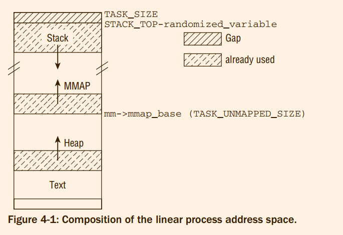
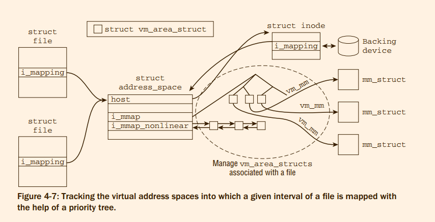
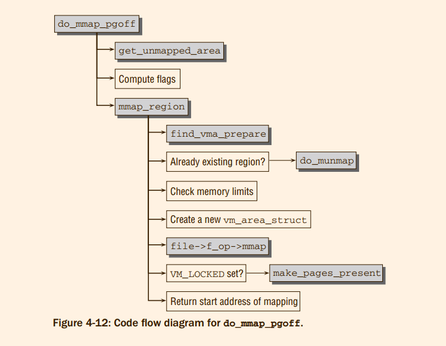
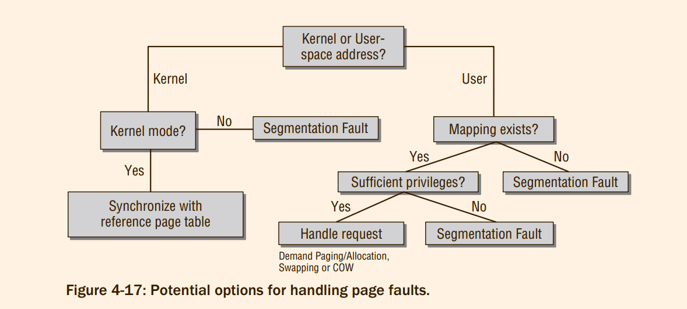
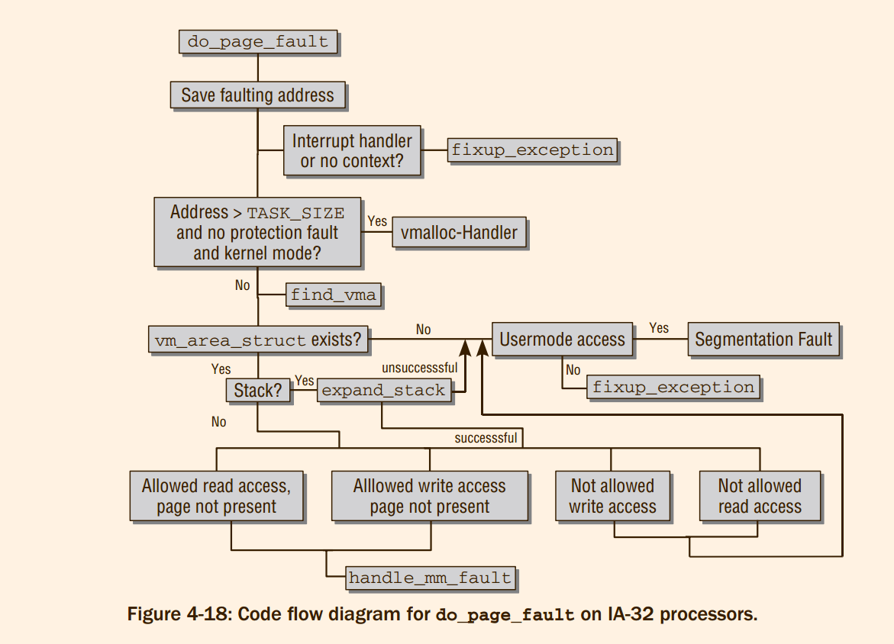
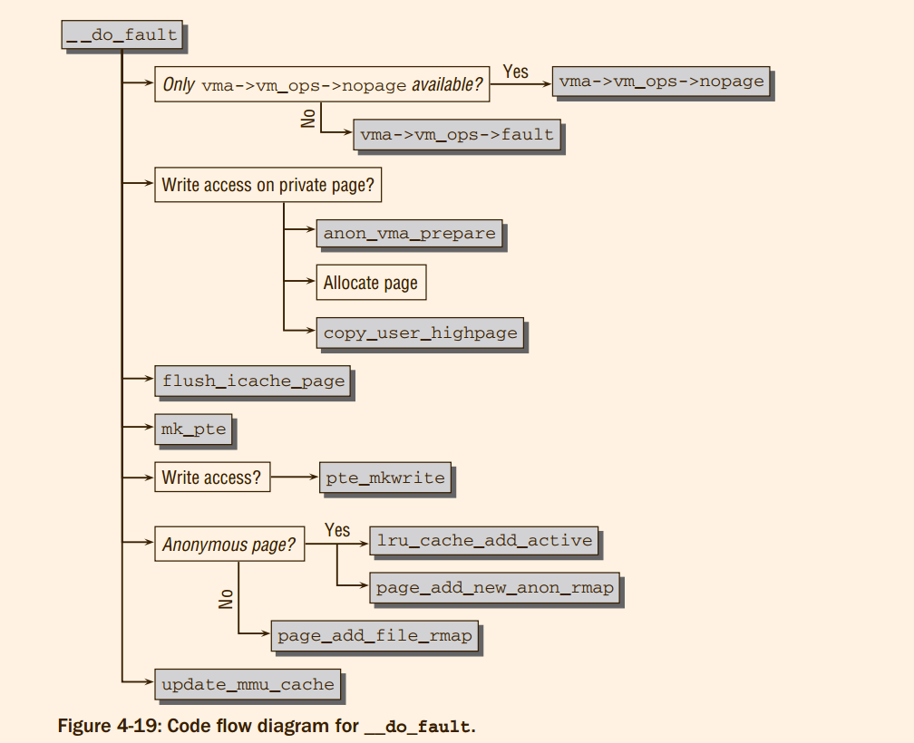

# Professional Linux Kernel Architecture : Virtual Process Memory
This also requires an examination of the
connection between page frames of the available physical RAM and pages in all virtual process
address spaces: **The reverse mapping technique helps to track which virtual pages are backed by
which physical page**, and page fault handling allows filling the virtual address space with data from
block devices on demand.
> 只是reverse mapping映射的含义吗 ?


## 4.1 Introduction
All the memory management methods discussed in the preceding chapter were concerned either
with the **organization of physical memory** or **management of the virtual kernel address space**.
This section examines the methods required by the kernel to manage the **virtual user address space**.


a variety of reasons, some of which are given below, this is more complex than managing kernel
address space:
1. Each application has its own address space that is segregated from all other applications.
2. Usually only a few sections of the large linear address space available to each userspace
process are actually used, and they may also be some distance from each other. The kernel
needs data structures to efficiently manage these (randomly) spread sections.
3. Only the smallest part of the address space is directly associated with physical pages. Infrequently used parts are linked with pages only when necessary.
4. The kernel has trust in itself, but not in user processes. For this reason, each operation to
manipulate user address space is accompanied by various checks to ensure that programs
cannot acquire more rights than are due to them and thus endanger system stability and
security
5. The fork-exec model used under Unix to generate new processes (described in Chapter 2)
is not very powerful if implemented carelessly. The kernel must therefore concentrate on
managing user address spaces as efficiently as possible by resorting to a few tricks.
> 分别处理方法:
> 1. 虚拟
> 2. mm_struct 和 vm_area_struct
> 3. page fault
> 4. protection
> 5. COW

## 4.2 Virtual Process Address Space
The information below covers only machines with MMU. I do not deal with the oddities and
modifications needed for MMU-less architectures.


#### 4.2.1 Layout of the Process Address Space
The virtual address space is populated by a number of regions.
How they are distributed is architecturespecific, but all approaches have the following elements in common:
1. The binary code(***.text***) of the code currently running. This code is normally referred to as text and the area of virtual memory in which it is located as a text segment.
2. The code of dynamic libraries(***.so***) used by the program.
3. The ***heap*** where global variables and dynamically generated data are stored.
4. The ***stack*** used to hold local variables and to implement function and procedure calls.
5. Sections with environment variables and command-line arguments(***cmd***).
6. Memory mappings that map the contents of ***files*** into the virtual address space.
> 1. 这些不同类型的region 的创建得到不同类型 vm_area_struct 创建方式是什么 ?
> 2. 只有mmap 调用实现加载，还是别的什么方法
> 3. 如果使用fopen 打开的文件也是放到虚拟地址空间的吗 ?

each process in the system is equipped with an instance of `struct mm_struct`
that can be accessed via the task structure. This instance holds memory management information for the process:

```c
struct mm_struct {
	struct vm_area_struct *mmap;		/* list of VMAs */

#ifdef CONFIG_MMU
  unsigned long (*get_unmapped_area) (struct file *filp,
      unsigned long addr, unsigned long len,
      unsigned long pgoff, unsigned long flags);
#endif
  unsigned long mmap_base;	/* base of mmap area */

  unsigned long start_code, end_code, start_data, end_data;
  unsigned long start_brk, brk, start_stack;
  unsigned long arg_start, arg_end, env_start, env_end;

  unsigned long task_size;	/* size of task vm space */
  unsigned long highest_vm_end;	/* highest vma end address */
```

1. `mmap_base` denotes the starting point for memory mappings in the virtual address space
2. `get_unmapped_area` is invoked to find a suitable place for a new mapping in the mmap area.


The individual architectures can influence the layout of the virtual address space by several configuration
options:
1. how the mmap area is arranged
2. When a new memory mapping is created, the kernel needs to find a suitable place for it **unless
a specific address has been specified by the user**. If the architecture wants to choose the proper
location itself, it must set the pre-processor symbol HAVE_ARCH_UNMAPPED_AREA and define the
function `arch_get_unmapped_area` accordingly
3. New locations for memory mappings are usually found by starting the search from lower memory locations and progressing toward higher addresses
4. Usually, the stack grows from bottom to top.
> 1. 总之，刚刚分析的变量表示虚拟地址空间可以通过其中的那些参数可以配置的，而且也大概表示了虚拟地址空间的主要成分
> 2. 在mm/mmap.c:2003 中间定义了 `arch_get_unmapped_area_topdown` 但是sys_x86_64.c 同样定义了  `arch_get_unmapped_area_topdown`，ccls 的跳转工具显示，后者才是真正被使用的，函数指针的赋值位置: `arch/x86/mm/mmap.c`
> 3. 总的来说和书中间说的一致，但是如果`#ifndef HAVE_ARCH_UNMAPPED_AREA_TOPDOWN`的条件成立，编译的时候不就是含有两个符号吗?

```c
/*
 * This function, called very early during the creation of a new
 * process VM image, sets up which VM layout function to use:
 */
void arch_pick_mmap_layout(struct mm_struct *mm)
{
	unsigned long random_factor = 0UL;

	if (current->flags & PF_RANDOMIZE)
		random_factor = arch_mmap_rnd();

	mm->mmap_legacy_base = TASK_UNMAPPED_BASE + random_factor;

	if (mmap_is_legacy()) {
		mm->mmap_base = mm->mmap_legacy_base;
		mm->get_unmapped_area = arch_get_unmapped_area;
	} else {
		mm->mmap_base = mmap_base(random_factor);
		mm->get_unmapped_area = arch_get_unmapped_area_topdown;
	}
}

void setup_new_exec(struct linux_binprm * bprm) {
	arch_pick_mmap_layout(current->mm);


static int load_elf_binary(struct linux_binprm *bprm){


static struct linux_binfmt elf_format = {
	.module		= this_module,
	.load_binary	= load_elf_binary,
	.load_shlib	= load_elf_library,
	.core_dump	= elf_core_dump,
	.min_coredump	= elf_exec_pagesize,
};
```

`PF_RANDOMIZE`  it will be much
harder to construct malicious code that deliberately manipulates stack entries after access to the memory
region has been gained by a buffer overflow.
> 好吧，实际上固定的stack 位置实现 buffer overflow 攻击都不知道如何实现。




How the text segment is mapped into the virtual address space is determined by the ELF standard

IA-32 systems start at 0x08048000, leaving a gap of *roughly* 128 MiB between the
lowest possible address and the start of the text mapping that is used to catch **NULL pointers**
> 0. 注意: 不要和IA-32 上的内核开始位置搞混了，那是0x80000000
> 1. 忽然想到了下一次题目的内容，从NULL pointer 错误触发的全部过程
> 2. 有点不对的地方, ucore 中间用户的stack 是如何设置的?

The argument list and environment of a process are stored as initial stack elements

The region for memory mappings starts at `mm_struct->mmap_base`, which is usually set to `TASK_UNMAPPED_BASE`, needing to be defined by every architecture. In nearly all cases, `TASK_SIZE`/3 is
chosen.

> 最后一小段分析在IA-32架构上的 heap 的最大值不足的问题，以及解决方案(IA-32, who cares)

#### 4.2.2 Creating the Layout
> 本节分析关键函数 `static int load_elf_binary(struct linux_binprm *bprm)`(although 600 lines, with knowledge of elf, not so difficult)， 但是一笔带过
> 本章全部的内容都是分析 `arch_pick_mmap_layout`， 算是承接上一章的内容吧!

```c
void arch_pick_mmap_layout(struct mm_struct *mm, struct rlimit *rlim_stack)
{
	if (mmap_is_legacy())
		mm->get_unmapped_area = arch_get_unmapped_area;
	else
		mm->get_unmapped_area = arch_get_unmapped_area_topdown;

	arch_pick_mmap_base(&mm->mmap_base, &mm->mmap_legacy_base,
			arch_rnd(mmap64_rnd_bits), task_size_64bit(0),
			rlim_stack);

#ifdef CONFIG_HAVE_ARCH_COMPAT_MMAP_BASES
	/*
	 * The mmap syscall mapping base decision depends solely on the
	 * syscall type (64-bit or compat). This applies for 64bit
	 * applications and 32bit applications. The 64bit syscall uses
	 * mmap_base, the compat syscall uses mmap_compat_base.
	 */
	arch_pick_mmap_base(&mm->mmap_compat_base, &mm->mmap_compat_legacy_base,
			arch_rnd(mmap32_rnd_bits), task_size_32bit(),
			rlim_stack);
#endif
}
```

```c
void setup_new_exec(struct linux_binprm * bprm)
```
> `load_elf_binary` 通过此函数进一步调用到 `arch_pick_mmap_base`


`static struct linux_binfmt elf_format`:
```c
static struct linux_binfmt elf_format = {
	.module		= THIS_MODULE,
	.load_binary	= load_elf_binary,
	.load_shlib	= load_elf_library,
	.core_dump	= elf_core_dump,
	.min_coredump	= ELF_EXEC_PAGESIZE,
};
```
> something strange here, `elf_format` is assigned in the `load_elf_binary`, the latter is a member of former
> `load_elf_binary` 不就是ucore lab8 的哪一个超级长的令人窒息的函数吗?

Let us go back to `load_elf_binary`. Finally, the function needs to create the stack at the appropriate location:

```c
<fs/binfmt_elf.c>
static int load_elf_binary(struct linux_binprm *bprm, struct pt_regs *regs){
  ...
  retval = setup_arg_pages(bprm, randomize_stack_top(STACK_TOP), executable_stack);
  ...
}
```

The standard function `setup_arg_pages` is used for this purpose. I will not discuss it in detail because it is
only technical. The function requires the top of the stack as a parameter. This is given by the architecture specific constant `STACK_TOP`, but `randomize_stack_top` ensures that the address is changed by a random
amount if address space randomization is required

## 4.3 Principle of Memory Mappings
As for the beginning of the file, the kernel need
only keep the information in address space about where on the disk to find the data and how to read
them when they are required.

The kernel makes use of the `address_space` data structure to provide a set of methods to read data from
a backing store — from a filesystem, for example. `address_spaces` therefore form an auxiliary layer to
represent the mapped data as a contiguous linear area to memory management

Allocating and filling pages on demand is known as demand paging.

1. A process tries to access a memory address that is in user address space but cannot be resolved using the page tables (there is no associated page in RAM memory).
1. The processor then triggers a page fault that is forwarded to the kernel.
1. The kernel runs through the process address space data structures responsible for the area in which the fault occurred to find the appropriate backing store or to establish that access was, indeed, incorrect.
1. A physical page is allocated and filled with the requisite data from the backing store.
1. The physical page is incorporated into the address space of the user process with the help of the
page tables, and the application resumes.

## 4.4 Data Structures

```c
struct mm_struct {
	struct vm_area_struct *mmap;		/* list of VMAs */
	struct rb_root mm_rb;
```
> 震惊: 没有mmap_cache这一个变量，那么靠什么实现快速的访问

#### 4.4.1 Trees and Lists

```c
struct rb_root {
	struct rb_node *rb_node;
};
```
Each region is described by an instance of vm_area_struct, and the regions of a process are sorted in
two ways:
1. On a singly linked list (starting with `mm_struct->mmap`).
2. In a red-black tree whose root element is located in `mm_rb`
> 所以，为什么非要使用list 和rbtree 同时存储，不用list 不行吗?

#### 4.4.2 Representation of Regions
```c
/*
 * This struct defines a memory VMM memory area. There is one of these
 * per VM-area/task.  A VM area is any part of the process virtual memory
 * space that has a special rule for the page-fault handlers (ie a shared
 * library, the executable area etc).
 */
struct vm_area_struct {
	/* The first cache line has the info for VMA tree walking. */

	unsigned long vm_start;		/* Our start address within vm_mm. */
	unsigned long vm_end;		/* The first byte after our end address within vm_mm. */

	/* linked list of VM areas per task, sorted by address */
	struct vm_area_struct *vm_next, *vm_prev;

	struct rb_node vm_rb;

	/*
	 * Largest free memory gap in bytes to the left of this VMA.
	 * Either between this VMA and vma->vm_prev, or between one of the
	 * VMAs below us in the VMA rbtree and its ->vm_prev. This helps
	 * get_unmapped_area find a free area of the right size.
	 */
	unsigned long rb_subtree_gap;

	/* Second cache line starts here. */

	struct mm_struct *vm_mm;	/* The address space we belong to. */
	pgprot_t vm_page_prot;		/* Access permissions of this VMA. */
	unsigned long vm_flags;		/* Flags, see mm.h. */

	/*
	 * For areas with an address space and backing store,
	 * linkage into the address_space->i_mmap interval tree.
	 */
	struct {
		struct rb_node rb;
		unsigned long rb_subtree_last;
	} shared;

	/*
	 * A file's MAP_PRIVATE vma can be in both i_mmap tree and anon_vma
	 * list, after a COW of one of the file pages.	A MAP_SHARED vma
	 * can only be in the i_mmap tree.  An anonymous MAP_PRIVATE, stack
	 * or brk vma (with NULL file) can only be in an anon_vma list.
	 */
	struct list_head anon_vma_chain; /* Serialized by mmap_sem & * page_table_lock */
	struct anon_vma *anon_vma;	/* Serialized by page_table_lock */

	/* Function pointers to deal with this struct. */
	const struct vm_operations_struct *vm_ops;

	/* Information about our backing store: */
	unsigned long vm_pgoff;		/* Offset (within vm_file) in PAGE_SIZE units */
	struct file * vm_file;		/* File we map to (can be NULL). */
	void * vm_private_data;		/* was vm_pte (shared mem) */

	atomic_long_t swap_readahead_info;
#ifndef CONFIG_MMU
	struct vm_region *vm_region;	/* NOMMU mapping region */
#endif
#ifdef CONFIG_NUMA
	struct mempolicy *vm_policy;	/* NUMA policy for the VMA */
#endif
	struct vm_userfaultfd_ctx vm_userfaultfd_ctx;
} __randomize_layout;
```

1. `vm_mm` is a back-pointer to the `mm_struct` instance to which the region belongs.
2. `vm_start` and `vm_end` specify the virtual start and end addresses of the region in userspace.
3. The linear linking of all `vm_area_struct` instances of a process is achieved using `vm_next`,
whereas incorporation in the red-black tree is the responsibility of `vm_rb`.
4. `vm_page_prot` stores the access permissions for the region in the constants discussed in
Section 3.3.1, which are also used for pages in memory.
> 也就是*PTE-Specific Entries*, 问题是如果此处已经进行了含有那些 `_PAGE_KERNEL_RO`之类的flags,
> 那么为什么需要 每一个 page 上面又重新放一个
5. `vm_flags` is a set of flags describing the region.

6. A mapping of a file into the virtual address space of a process is uniquely determined by the
interval in the file and the corresponding interval in memory.
To keep track of all intervals associated with a process, the kernel uses a linked list and a red-black tree as described above.
However, it is also necessary to go the other way round: *Given an interval in a file, the kernel
sometimes needs to know all processes into which the interval is mapped.* Such mappings are
called ***shared mappings***, and the C standard library, which is used by nearly every process in the
system, is a prime example of why such mappings are necessary. To provide the required information, all `vm_area_struct` instances are additionally managed
in a priority tree, and the elements required for this are contained in `shared`. As you can easily
imagine from the rather complicated definition of this structure member, this is a tricky business,
which is discussed in detail in Section 4.4.3 below.
> *shared mapping* 难道不是 reverse mapping，这是两个名字还是什么东西 ?

7.  `anon_vma_node` and `anon_vma` are used to **manage shared pages originating from anonymous
mappings.** Mappings that point to the same pages are held on a doubly linked list, where
`anon_vma_node` acts as the list element.
There are several of these lists, depending on how many sets of mappings there are that share
different physical pages. The `anon_vma` element serves as a pointer to the management structure
that is associated with each list and comprises a list head and an associated lock.
```c
/*
 * The anon_vma heads a list of private "related" vmas, to scan if
 * an anonymous page pointing to this anon_vma needs to be unmapped:
 * the vmas on the list will be related by forking, or by splitting.
 *
 * Since vmas come and go as they are split and merged (particularly
 * in mprotect), the mapping field of an anonymous page cannot point
 * directly to a vma: instead it points to an anon_vma, on whose list
 * the related vmas can be easily linked or unlinked.
 *
 * After unlinking the last vma on the list, we must garbage collect
 * the anon_vma object itself: we're guaranteed no page can be
 * pointing to this anon_vma once its vma list is empty.
 */
struct anon_vma {
	struct anon_vma *root;		/* Root of this anon_vma tree */
	struct rw_semaphore rwsem;	/* W: modification, R: walking the list */
	/*
	 * The refcount is taken on an anon_vma when there is no
	 * guarantee that the vma of page tables will exist for
	 * the duration of the operation. A caller that takes
	 * the reference is responsible for clearing up the
	 * anon_vma if they are the last user on release
	 */
	atomic_t refcount;

	/*
	 * Count of child anon_vmas and VMAs which points to this anon_vma.
	 *
	 * This counter is used for making decision about reusing anon_vma
	 * instead of forking new one. See comments in function anon_vma_clone.
	 */
	unsigned degree;

	struct anon_vma *parent;	/* Parent of this anon_vma */

	/*
	 * NOTE: the LSB of the rb_root.rb_node is set by
	 * mm_take_all_locks() _after_ taking the above lock. So the
	 * rb_root must only be read/written after taking the above lock
	 * to be sure to see a valid next pointer. The LSB bit itself
	 * is serialized by a system wide lock only visible to
	 * mm_take_all_locks() (mm_all_locks_mutex).
	 */

	/* Interval tree of private "related" vmas */
	struct rb_root_cached rb_root;
};

/*
 * The copy-on-write semantics of fork mean that an anon_vma
 * can become associated with multiple processes. Furthermore,
 * each child process will have its own anon_vma, where new
 * pages for that process are instantiated.
 *
 * This structure allows us to find the anon_vmas associated
 * with a VMA, or the VMAs associated with an anon_vma.
 * The "same_vma" list contains the anon_vma_chains linking
 * all the anon_vmas associated with this VMA.
 * The "rb" field indexes on an interval tree the anon_vma_chains
 * which link all the VMAs associated with this anon_vma.
 */
struct anon_vma_chain {
	struct vm_area_struct *vma;
	struct anon_vma *anon_vma;
	struct list_head same_vma;   /* locked by mmap_sem & page_table_lock */
	struct rb_node rb;			/* locked by anon_vma->rwsem */
	unsigned long rb_subtree_last;
#ifdef CONFIG_DEBUG_VM_RB
	unsigned long cached_vma_start, cached_vma_last;
#endif
};
```
> anon_vma 和 anon_vma_chain 的作用到底是什么?


8. `vm_ops` is a pointer to a collection of methods used to perform various standard operations on the region.
`<mm.h>`
```c
/*
 * These are the virtual MM functions - opening of an area, closing and
 * unmapping it (needed to keep files on disk up-to-date etc), pointer
 * to the functions called when a no-page or a wp-page exception occurs.
 */
struct vm_operations_struct {
	void (*open)(struct vm_area_struct * area);
	void (*close)(struct vm_area_struct * area);
	int (*split)(struct vm_area_struct * area, unsigned long addr);
	int (*mremap)(struct vm_area_struct * area);
	vm_fault_t (*fault)(struct vm_fault *vmf);
	vm_fault_t (*huge_fault)(struct vm_fault *vmf,
			enum page_entry_size pe_size);
	void (*map_pages)(struct vm_fault *vmf,
			pgoff_t start_pgoff, pgoff_t end_pgoff);
	unsigned long (*pagesize)(struct vm_area_struct * area);

	/* notification that a previously read-only page is about to become
	 * writable, if an error is returned it will cause a SIGBUS */
	vm_fault_t (*page_mkwrite)(struct vm_fault *vmf);

	/* same as page_mkwrite when using VM_PFNMAP|VM_MIXEDMAP */
	vm_fault_t (*pfn_mkwrite)(struct vm_fault *vmf);

	/* called by access_process_vm when get_user_pages() fails, typically
	 * for use by special VMAs that can switch between memory and hardware
	 */
	int (*access)(struct vm_area_struct *vma, unsigned long addr,
		      void *buf, int len, int write);

	/* Called by the /proc/PID/maps code to ask the vma whether it
	 * has a special name.  Returning non-NULL will also cause this
	 * vma to be dumped unconditionally. */
	const char *(*name)(struct vm_area_struct *vma);

#ifdef CONFIG_NUMA
	/*
	 * set_policy() op must add a reference to any non-NULL @new mempolicy
	 * to hold the policy upon return.  Caller should pass NULL @new to
	 * remove a policy and fall back to surrounding context--i.e. do not
	 * install a MPOL_DEFAULT policy, nor the task or system default
	 * mempolicy.
	 */
	int (*set_policy)(struct vm_area_struct *vma, struct mempolicy *new);

	/*
	 * get_policy() op must add reference [mpol_get()] to any policy at
	 * (vma,addr) marked as MPOL_SHARED.  The shared policy infrastructure
	 * in mm/mempolicy.c will do this automatically.
	 * get_policy() must NOT add a ref if the policy at (vma,addr) is not
	 * marked as MPOL_SHARED. vma policies are protected by the mmap_sem.
	 * If no [shared/vma] mempolicy exists at the addr, get_policy() op
	 * must return NULL--i.e., do not "fallback" to task or system default
	 * policy.
	 */
	struct mempolicy *(*get_policy)(struct vm_area_struct *vma,
					unsigned long addr);
#endif
	/*
	 * Called by vm_normal_page() for special PTEs to find the
	 * page for @addr.  This is useful if the default behavior
	 * (using pte_page()) would not find the correct page.
	 */
	struct page *(*find_special_page)(struct vm_area_struct *vma,
					  unsigned long addr);
};
```
* `open` and `close` are invoked when a region is created and deleted, respectively. They are
not normally used and have null pointers.
* However, `fault` is very important. If a virtual page is not present in an address space, the
automatically triggered page fault handler invokes this function to read the corresponding
data into a physical page that is mapped into the user address space.

9. `vm_pgoffset` specifies an offset for a file mapping when not all file contents are to be mapped
(the offset is 0 if the whole file is mapped).
10 `vm_file` points to the file instance that describes a mapped file (it holds a null pointer if the
object mapped is not a file). Chapter 8 discusses the contents of the file structure at length.
11. Depending on mapping type, `vm_private_data` can be used to store private data that are not
manipulated by the generic memory management routines. (The kernel ensures only that the
element is initialized with a null pointer when a new region is created.) Currently, only a few
sound and video drivers make use of this option.

12. `vm_flags` stores flags to define the properties of a region. They are all declared as pre-processor constants in `<mm.h>`.
* VM_READ, VM_WRITE, VM_EXEC, and VM_SHARED specify whether page contents can be
read, written, executed, or shared by several processes.
* VM_MAYREAD, VM_MAYWRITE, VM_MAYEXEC, and VM_MAYSHARE determine whether
the `VM_*` flags may be set. This is required for the mprotect system call.
* VM_GROWSDOWN and VM_GROWSUP indicate whether a region can be extended downward
or upward (to lower/higher virtual addresses). Because the heap grows from bottom to
top, VM_GROWSUP is set in its region; VM_GROWSDOWN is set for the stack, which grows from top
to bottom.
* VM_SEQ_READ is set if it is likely that the region will be read sequentially from start to end;
VM_RAND_READ specifies that read access may be random. Both flags are intended as ‘‘prompts‘‘
for memory management and the block device layer to improve their optimizations (e.g., page
readahead if access is primarily sequential. Chapter 8 takes a closer look at this technique).
* If VM_DONTCOPY is set, the relevant region is not copied when the fork system call is executed.
* VM_DONTEXPAND prohibits expansion of a region by the mremap system call.
* VM_HUGETLB is set if the region is based on huge pages as featured in some architectures.
* VM_ACCOUNT specifies whether the region is to be included in the calculations for the overcommit
features. These features restrict memory allocations in various ways (refer to Section 4.5.3 for
more details)
> 感觉和 vm_page_prot 功能含有重叠啊!


#### 4.4.3 The Priority Search Tree
> 为了实现反向映射的辅助结构

**Priority search trees** are required to establish a connection between a region in a file and all virtual address
spaces into which the region is mapped.

Every open file (and every block device, because these can also be memory-mapped via device special
files) is represented by an instance of `struct file`. This structure, in turn, contains a pointer to an address
space object as represented by `struct address_space`. This object is the basis of the priority search tree
(prio tree) by which the connection between `mapped intervals` and `the address spaces` into which these are
mapped is established.


```c
struct address_space {
	struct inode		*host;		/* owner: inode, block_device */
	struct radix_tree_root	page_tree;	/* radix tree of all pages */

	spinlock_t		tree_lock;	/* and lock protecting it */
	atomic_t		i_mmap_writable;/* count VM_SHARED mappings */

	struct rb_root		i_mmap;		/* tree of private and shared mappings */
	struct rw_semaphore	i_mmap_rwsem;	/* protect tree, count, list */

	/* Protected by tree_lock together with the radix tree */
	unsigned long		nrpages;	/* number of total pages */
	unsigned long		nrshadows;	/* number of shadow entries */
	pgoff_t			writeback_index;/* writeback starts here */
	const struct address_space_operations *a_ops;	/* methods */
	unsigned long		flags;		/* error bits/gfp mask */
	spinlock_t		private_lock;	/* for use by the address_space */
	struct list_head	private_list;	/* ditto */
	void			*private_data;	/* ditto */
} __attribute__((aligned(sizeof(long))));
```
Additionally, each file and each block device are represented by an instance of `struct inode`. In contrast
to `struct file`, which is the abstraction for a file opened by the open system call, the inode represents
the object in the filesystem itself.

When a file is
opened, the kernel sets `file->f_mapping` to `inode->i_mapping`. This allows multiple processes to access
the same file without directly interfering with the other processes: ***inode is a file-specific data structure,
while file is local to a given process.***


Given an instance of `struct address_space`, the kernel can infer the associated inode, which, in turn,
allows for access to the *backing store* on which the file data are stored. Usually, the backing store will be a
block device; . Here it suffices to know that the *address space is the base element of a
priority tree that contains all vm_area_struct instances describing the mapping of an interval of the
file associated with the inode into some virtual address space*. Since each instance of struct `vm_area`
contains a pointer to the `mm_struct` of the process to which it belongs, the desired connection is set up!
Note that `vm_area_structs` can also be associated with an address space via a doubly linked list headed
by `i_mmap_nonlinear`. This is required for *nonlinear mappings*, which I neglect for now


Therefore, keep in mind that a given instance of
`struct vm_area` can be contained in two data structures:
1. One establishes a connection between a region in the virtual address space of a process to the data in the underlying file
2. and one allows for finding all address spaces that map a given file interval.



**Representing Priority Trees**
Priority trees allow for management of the `vm_area_struct` instances that represent a particular interval
of the given file.
This requires that the data structure cannot only deal with overlapping, but also with
identical file intervals.

Managing overlapping intervals is not much of a problem: The boundaries of the interval provide a
unique index that allows for storing each interval in a unique tree node.
> 采用radix tree 来解决


However, what happens if multiple identical intervals must be included in the prio tree? Each prio
tree node is represented by the `raw_prio_tree_node` instance, which is directly included in each
`vm_area_struct` instance. Recall, however, that it is in a union with a `vm_set`.
This allows for associating a list of `vm_sets` (and thus `vm_area_structs`).
> emmmmm, 这两个结构体都没找到， 而且连 prio_tree_node 也没有
> 接下来的一小段的内容也就是没有办法分析了, you should google, instead of insisting on the book


## 4.5 Operations on Regions
> 1. 什么时候需要进行合并
> 2. 什么时候会进行对于 Region 的一部分删除 ？

A further important standard operation is the search for
a region associated with a specific virtual address in userspace
> 这个操作具体是指 ？

#### 4.5.1 Associating Virtual Addresses with a Region
> 找到第一个大于addr 的Region
```c
/* Look up the first VMA which satisfies  addr < vm_end,  NULL if none. */
struct vm_area_struct *find_vma(struct mm_struct *mm, unsigned long addr)
{
	struct rb_node *rb_node;
	struct vm_area_struct *vma;

	/* Check the cache first. */
	vma = vmacache_find(mm, addr);
	if (likely(vma))
		return vma;

	rb_node = mm->mm_rb.rb_node;

	while (rb_node) {
		struct vm_area_struct *tmp;

		tmp = rb_entry(rb_node, struct vm_area_struct, vm_rb);

		if (tmp->vm_end > addr) {
			vma = tmp;
			if (tmp->vm_start <= addr)
				break;
			rb_node = rb_node->rb_left;
		} else
			rb_node = rb_node->rb_right;
	}

	if (vma)
		vmacache_update(addr, vma);
	return vma;
}

EXPORT_SYMBOL(find_vma);
```
> 简单的红黑树的使用，只是添加了vmcache_find 而已

```c
/* Look up the first VMA which intersects the interval start_addr..end_addr-1,
   NULL if none.  Assume start_addr < end_addr. */
static inline struct vm_area_struct * find_vma_intersection(struct mm_struct * mm, unsigned long start_addr, unsigned long end_addr)
{
	struct vm_area_struct * vma = find_vma(mm,start_addr);

	if (vma && end_addr <= vma->vm_start)
		vma = NULL;
	return vma;
}
```
> 又一个辅助函数
#### 4.5.2 Merging Regions
When a new region is added to the address space of a process, the kernel checks whether it can be merged
with one or more existing regions


```c
/*
 * Return true if we can merge this (vm_flags,anon_vma,file,vm_pgoff)
 * in front of (at a lower virtual address and file offset than) the vma.
 *
 * We cannot merge two vmas if they have differently assigned (non-NULL)
 * anon_vmas, nor if same anon_vma is assigned but offsets incompatible.
 *
 * We don't check here for the merged mmap wrapping around the end of pagecache
 * indices (16TB on ia32) because do_mmap_pgoff() does not permit mmap's which
 * wrap, nor mmaps which cover the final page at index -1UL.
 */
static int
can_vma_merge_before(struct vm_area_struct *vma, unsigned long vm_flags,
		     struct anon_vma *anon_vma, struct file *file,
		     pgoff_t vm_pgoff,
		     struct vm_userfaultfd_ctx vm_userfaultfd_ctx)
{
	if (is_mergeable_vma(vma, file, vm_flags, vm_userfaultfd_ctx) &&
	    is_mergeable_anon_vma(anon_vma, vma->anon_vma, vma)) {
		if (vma->vm_pgoff == vm_pgoff)
			return 1;
	}
	return 0;
}

/*
 * Return true if we can merge this (vm_flags,anon_vma,file,vm_pgoff)
 * beyond (at a higher virtual address and file offset than) the vma.
 *
 * We cannot merge two vmas if they have differently assigned (non-NULL)
 * anon_vmas, nor if same anon_vma is assigned but offsets incompatible.
 */
static int
can_vma_merge_after(struct vm_area_struct *vma, unsigned long vm_flags,
		    struct anon_vma *anon_vma, struct file *file,
		    pgoff_t vm_pgoff,
		    struct vm_userfaultfd_ctx vm_userfaultfd_ctx)
{
	if (is_mergeable_vma(vma, file, vm_flags, vm_userfaultfd_ctx) &&
	    is_mergeable_anon_vma(anon_vma, vma->anon_vma, vma)) {
		pgoff_t vm_pglen;
		vm_pglen = vma_pages(vma);
		if (vma->vm_pgoff + vm_pglen == vm_pgoff)
			return 1;
	}
	return 0;
}
```
> 两个需要使用的辅助函数

#### 4.5.3 Inserting Regions
```c
/* Insert vm structure into process list sorted by address
 * and into the inode's i_mmap tree.  If vm_file is non-NULL
 * then i_mmap_rwsem is taken here.
 */
int insert_vm_struct(struct mm_struct *mm, struct vm_area_struct *vma)
{
	struct vm_area_struct *prev;
	struct rb_node **rb_link, *rb_parent;

	if (find_vma_links(mm, vma->vm_start, vma->vm_end,
			   &prev, &rb_link, &rb_parent))
		return -ENOMEM;
	if ((vma->vm_flags & VM_ACCOUNT) &&
	     security_vm_enough_memory_mm(mm, vma_pages(vma)))
		return -ENOMEM;

	/*
	 * The vm_pgoff of a purely anonymous vma should be irrelevant
	 * until its first write fault, when page's anon_vma and index
	 * are set.  But now set the vm_pgoff it will almost certainly
	 * end up with (unless mremap moves it elsewhere before that
	 * first wfault), so /proc/pid/maps tells a consistent story.
	 *
	 * By setting it to reflect the virtual start address of the
	 * vma, merges and splits can happen in a seamless way, just
	 * using the existing file pgoff checks and manipulations.
	 * Similarly in do_mmap_pgoff and in do_brk.
	 */
	if (vma_is_anonymous(vma)) {
		BUG_ON(vma->anon_vma);
		vma->vm_pgoff = vma->vm_start >> PAGE_SHIFT;
	}

	vma_link(mm, vma, prev, rb_link, rb_parent);
	return 0;
}
```

`insert_vm_struct` is the standard function used by the kernel to insert new regions.
The actual work is delegated to two helper functions

`find_vma_prepare` is first invoked to obtain the information listed below by reference to the start
address of the new region and of the address space involved (`mm_struct`).
1. The `vm_area_struct` instance of the preceding address space.
2. The parent node (in the red-black tree) in which the node for the new region is held.
4. The leaf node (of the red-black tree) that contains the region itself.
> 其实就是函数最上面的三个局部变量?

After some preparatory work, the function delegates the real
work to insert_vm_struct, which performs three insert operations as the code flow diagram
shows.
1. `__vma_link_list` puts the new region on the linear list of regions of the process; only the predecessor and successor region found using find_vma_prepare are needed to do this.7
2. `__vma_link_rb` links the new region into the data structures of the red-black tree, as the name
suggests.
3. `__anon_vma_link` adds the `vm_area_struct` instance to the linked list of anonymous mappings
discussed above.
4. Finally, `__vma_link_file` links the relevant address_space and the mapping in the case of file mappings
and also adds the region to the prio tree using vma_prio_tree_insert, which handles multiple identical
regions as described above.

Section 4.5.3 discusses the technical details of how the kernel goes about inserting new regions
#### 4.5.4 Creating Regions
Before a new memory region can be inserted into the data structures, the kernel must establish where
there is enough free space in virtual address space for a region of a given size. This job is assigned to the
`get_unmapped_area` helper function.


```c
unsigned long
get_unmapped_area(struct file *file, unsigned long addr, unsigned long len,
		unsigned long pgoff, unsigned long flags)
{
	unsigned long (*get_area)(struct file *, unsigned long,
				  unsigned long, unsigned long, unsigned long);

	unsigned long error = arch_mmap_check(addr, len, flags);
	if (error)
		return error;

	/* Careful about overflows.. */
	if (len > TASK_SIZE)
		return -ENOMEM;

	get_area = current->mm->get_unmapped_area;
	if (file) {
		if (file->f_op->get_unmapped_area)
			get_area = file->f_op->get_unmapped_area;
	} else if (flags & MAP_SHARED) {
		/*
		 * mmap_region() will call shmem_zero_setup() to create a file,
		 * so use shmem's get_unmapped_area in case it can be huge.
		 * do_mmap_pgoff() will clear pgoff, so match alignment.
		 */
		pgoff = 0;
		get_area = shmem_get_unmapped_area;
	}

	addr = get_area(file, addr, len, pgoff, flags);
	if (IS_ERR_VALUE(addr))
		return addr;

	if (addr > TASK_SIZE - len)
		return -ENOMEM;
	if (offset_in_page(addr))
		return -EINVAL;

	error = security_mmap_addr(addr);
	return error ? error : addr;
}

EXPORT_SYMBOL(get_unmapped_area);
```
> 注意: get_unmapped_area 同时也是 file_operation 的一个函数指针

The implementation of the function is of no further interest as the
actual work is delegated to the architecture-specific helper function stored in the mm_struct instance of
the current process
> `get_area = current->mm->get_unmapped_area;`


挑选一个最常用的分析一下:
```c
unsigned long
arch_get_unmapped_area(struct file *filp, unsigned long addr,
		unsigned long len, unsigned long pgoff, unsigned long flags)
{
	struct mm_struct *mm = current->mm;
	struct vm_area_struct *vma;
	struct vm_unmapped_area_info info;
	unsigned long begin, end;

  // 这一个check 是一个空函数
	addr = mpx_unmapped_area_check(addr, len, flags);
	if (IS_ERR_VALUE(addr))
		return addr;

	if (flags & MAP_FIXED)
		return addr;

	find_start_end(addr, flags, &begin, &end);

	if (len > end)
		return -ENOMEM;

	if (addr) {
		addr = PAGE_ALIGN(addr);
		vma = find_vma(mm, addr);
		if (end - len >= addr &&
		    (!vma || addr + len <= vm_start_gap(vma)))
			return addr;
	}

	info.flags = 0;
	info.length = len;
	info.low_limit = begin;
	info.high_limit = end;
	info.align_mask = 0;
	info.align_offset = pgoff << PAGE_SHIFT;
	if (filp) {
		info.align_mask = get_align_mask();
		info.align_offset += get_align_bits();
	}
	return vm_unmapped_area(&info);
}
```
> 1. 书上还有大概发2 page 描述其中的细节，并不存在，可能更加多细节在vm_unmapped_area 调用 unmapped_area 中
> 2. 我不明白为什么调用的插入一个area 会变得这么复杂, 至少ucore 中间很简单，为什么变复杂了，出来要考虑不同的layout外


## 4.6 Address Spaces
Memory mappings of files can be regarded as mappings between two different address spaces to simplify
the work of (system) programmers. One address space is the **virtual memory address space** of the user
process, the other is the **address space spanned by the filesystem**.
> 内存系统和文件系统的桥梁

The `vm_operations_struct`
provides an operation to
read pages not yet in physical memory although their contents have already been mapped there
However, the operation has no information on the mapping type or on its properties.
As there are numerous kinds of file mappings (regular files on different filesystem types, device files, etc.),
more information is required.
In fact, the kernel needs a more detailed description of the address space of the data source.
The `address_space` structure mentioned briefly above is defined for this purpose and contains additional
information on a mapping.
> 这就是为什么需要address_space 的原因，因为其中知道被映射的数据(file, device)的需要更加多的信息

Neither is the exact definition of struct `address_space` relevant at this point; it is discussed in more
detail in Chapter 16. Here it is sufficient to know that each address space has a set of address space
operations held as function pointers in the structure shown below (only the most important entries are
reproduced)

```c
struct address_space_operations {
	int (*writepage)(struct page *page, struct writeback_control *wbc);
	int (*readpage)(struct file *, struct page *);

	/* Write back some dirty pages from this mapping. */
	int (*writepages)(struct address_space *, struct writeback_control *);

	/* Set a page dirty.  Return true if this dirtied it */
	int (*set_page_dirty)(struct page *page);

	int (*readpages)(struct file *filp, struct address_space *mapping,
			struct list_head *pages, unsigned nr_pages);

	int (*write_begin)(struct file *, struct address_space *mapping,
				loff_t pos, unsigned len, unsigned flags,
				struct page **pagep, void **fsdata);
	int (*write_end)(struct file *, struct address_space *mapping,
				loff_t pos, unsigned len, unsigned copied,
				struct page *page, void *fsdata);
  //...
```
1. readpage reads a single page from the underlying block medium into RAM memory; readpages
performs the same task for several pages at once.
2. writepage writes the contents of a page from RAM memory back to the corresponding location
on a block device to permanently save changes.
3. set_page_dirty indicates that the contents of a page have been changed and no longer match
the original contents on the block device
> 1. 逐渐迷茫，ucore 的哪一个位置的代码实现的将代码从 block 中间读入到 block 中间的
> 2. address_space_operations 的设计是很有道理的，不同的进程的 vm_area_struct 映射相同的 file, 它们只是需要相同的 read/write page 之类

How is the link between `vm_operations_struct` and `address_space` established? There is no static
link to assign an instance of each structure to the other structure. Nevertheless, both are linked by the
standard implementations that the kernel provides for `vm_operations_struct` and that are used by
almost all filesystems.
> 这一节讲解的太简单了，在16章含有更加清晰的解释，至少知道 address_space 是VMM 和 FS 沟通的桥梁
## 4.7 Memory Mappings
```c
const struct vm_operations_struct generic_file_vm_ops = {
	.fault		= filemap_fault,
	.map_pages	= filemap_map_pages,
	.page_mkwrite	= filemap_page_mkwrite,
};
```

```c
/**
 * filemap_fault - read in file data for page fault handling
 * @vma:	vma in which the fault was taken
 * @vmf:	struct vm_fault containing details of the fault
 *
 * filemap_fault() is invoked via the vma operations vector for a
 * mapped memory region to read in file data during a page fault.
 *
 * The goto's are kind of ugly, but this streamlines the normal case of having
 * it in the page cache, and handles the special cases reasonably without
 * having a lot of duplicated code.
 *
 * vma->vm_mm->mmap_sem must be held on entry.
 *
 * If our return value has VM_FAULT_RETRY set, it's because
 * lock_page_or_retry() returned 0.
 * The mmap_sem has usually been released in this case.
 * See __lock_page_or_retry() for the exception.
 *
 * If our return value does not have VM_FAULT_RETRY set, the mmap_sem
 * has not been released.
 *
 * We never return with VM_FAULT_RETRY and a bit from VM_FAULT_ERROR set.
 */
int filemap_fault(struct vm_area_struct *vma, struct vm_fault *vmf)
```

The difference between mmap and mmap2 lies in the meaning of the offset (off). In both calls, it indicates
the point in the file at which mapping is to begin. For `mmap`, the position is specified in bytes, whereas
the unit used by `mmap2` is pages (`PAGE_SIZE`) — this enables file sections to be mapped even if the file is
larger than the address space available.

The `munmap` system call is invoked to remove a mapping. There is no need for a `munmap2` system call
because no file offset is required — just the virtual address of the mapping

#### 4.7.1 Creating Mappings
1. `MAP_FIXED` specifies that no other address than the one given may be used for the mapping. If
this flag is not set, the kernel is free to change the desired address if, for example, a mapping
already resides there (the existing mapping would otherwise be overwritten).
2. `MAP_SHARED` must be used when an object (usually a file) is to be shared between several processes.
3. `MAP_PRIVATE` creates a private mapping that is separated from the contents of the source — write
operations on the mapped region have no effect on the data in the file.
4. `MAP_ANONYMOUS` creates an anonymous mapping that is not associated with any data source — the
fd and off parameters are ignored. This type of mapping can be used to allocate malloc-like
memory for applications.

A combination of `PROT_EXEC`, `PROT_READ`, `PROT_WRITE`, and `PROT_NONE` values can be used to define access
permission in prot.

`sys_x86_64.c`
```c
SYSCALL_DEFINE6(mmap, unsigned long, addr, unsigned long, len,
		unsigned long, prot, unsigned long, flags,
		unsigned long, fd, unsigned long, off)
{
	long error;
	error = -EINVAL;
	if (off & ~PAGE_MASK)
		goto out;

	error = ksys_mmap_pgoff(addr, len, prot, flags, fd, off >> PAGE_SHIFT);
out:
	return error;
}


unsigned long ksys_mmap_pgoff(unsigned long addr, unsigned long len,
			      unsigned long prot, unsigned long flags,
			      unsigned long fd, unsigned long pgoff)
{

// ...
// 似乎是一些 将从byte 转化成为 page align的代码，或者处理huge page
	retval = vm_mmap_pgoff(file, addr, len, prot, flags, pgoff);
out_fput:
	if (file)
		fput(file);
	return retval;
}
```

```c
SYSCALL_DEFINE6(mmap_pgoff, unsigned long, addr, unsigned long, len,
		unsigned long, prot, unsigned long, flags,
		unsigned long, fd, unsigned long, pgoff)
{
  //...
	retval = vm_mmap_pgoff(file, addr, len, prot, flags, pgoff);
  //...

unsigned long vm_mmap_pgoff(struct file *file, unsigned long addr,
	unsigned long len, unsigned long prot,
	unsigned long flag, unsigned long pgoff)
{
	unsigned long ret;
	struct mm_struct *mm = current->mm;
	unsigned long populate;

	ret = security_mmap_file(file, prot, flag);
	if (!ret) {
		down_write(&mm->mmap_sem);
		ret = do_mmap_pgoff(file, addr, len, prot, flag, pgoff,
				    &populate);
		up_write(&mm->mmap_sem);
		if (populate)
			mm_populate(ret, populate);
	}
	return ret;
}

static inline unsigned long
do_mmap_pgoff(struct file *file, unsigned long addr,
	unsigned long len, unsigned long prot, unsigned long flags,
	unsigned long pgoff, unsigned long *populate) {
	return do_mmap(file, addr, len, prot, flags, 0, pgoff, populate);
}


unsigned long do_mmap(struct file *file, unsigned long addr,
			unsigned long len, unsigned long prot,
			unsigned long flags, vm_flags_t vm_flags,
			unsigned long pgoff, unsigned long *populate,
			struct list_head *uf)
{
  // ...
	/* Obtain the address to map to. we verify (or select) it and ensure
	 * that it represents a valid section of the address space.
	 */
	addr = get_unmapped_area(file, addr, len, pgoff, flags);
  // ...
  // make some check
	addr = mmap_region(file, addr, len, vm_flags, pgoff, uf);
  // ...
```

[mmap调用流程](https://stackoverflow.com/questions/9798008/connection-between-mmap-user-call-to-mmap-kernel-call)
> 讲的非常好，但是mmap 系统调用被谁使用，如果连libc 中间的mmap 都是调用的 mmap_pgoff, 还是说mmap 系统调用只是为了实现向下兼容而已




`do_mmap` used to be one of the longest functions in the kernel. It is now effectively split into two
parts, which are, however, still rather voluminous.
1. One part has to thoroughly check the parameters of the user application,
2. As second part, we look only at a representative standard situation — mapping of a regular file with `MAP_SHARED`

```
do_mmap
  |
  |---->get_unmapped_area(在4.5.4中间描述过)
  |---->vm_flags = calc_vm_prot_bits(prot) | calc_vm_flag_bits(flags) | mm->def_flags | VM_MAYREAD | VM_MAYWRITE | VM_MAYEXEC;
  |---->mmap_region
```

Once the kernel has granted the desired memory, the following steps are taken:
1. Allocation and initialization of a new `vm_area_struct` instance that is inserted in the
list/tree data structures of the process.
2. **Creation of the mapping** with the file-specific function `file->f_op->mmap`. Most filesystems
use `generic_file_mmap` for this purpose; all it does is set the `vm_ops` element of the mapping
to `generic_file_vm_ops`
> mmap_region 中间，根据参数vm_flags确定注册何种 vm_ops 的。

`filemap_fault` enlists the help of low-level routines of
the underlying filesystem to fetch the desired data and — transparently to the application — read them into RAM memory.
> 是filemap_fault 实现了do_pgfault 的实现基础


`do_mmap` performs several checks (not described in detail here) at various points in addition to the
actions described above. If one of the checks fails, the operation is terminated, and the system call returns
to userspace with an error code.
1. Accounting — The kernel keeps statistics on the number of pages a process uses for mappings.
As it is possible to limit process resources, the kernel must always ensure that the permitted
value is not exceeded. There is also a maximum number of mappings per process.
2. Extensive security and plausibility checks must be carried out to prevent the applications from
setting invalid parameters or parameters that could threaten system stability. For example, no
mappings may be created that are larger than the virtual address space or extend beyond the
boundaries of virtual address space

#### 4.7.2 Removing Mappings
> SKIP

#### 4.7.3 Nonlinear Mappings
As just demonstrated, normal mappings map a continuous section from a file into a likewise continuous section of virtual memory.
If various parts of a file are mapped in a different sequence into an otherwise
contiguous area of virtual memory, it is generally necessary to use several mappings, which is more
costly in terms of resources (particularly in `vm_area_structs`). A simpler way of achieving the same
result11 is to use nonlinear mapping
> 道理我都懂，但是为什么我们需要 对于同一个文件建立多个映射

The system call allows for rearranging pages in a mapping such that the order in memory is not identical
with the order in the file. This is achieved without moving the memory contents around, but is instead
performed by *manipulating the page tables of the process*.

If a nonlinear mapping is *swapped out*, the kernel must ensure that the offsets are still present when the
mapping is swapped back in again. The information needed to do this is stored in the page table entries
of the pages swapped out and must be referenced when they are swapped back in, as we shall see below.
But how is the information encoded? Two components are used:
1. The `vm_area_struct` instances of all installed nonlinear mappings are stored in a list headed
by the `i_mmap_nonlinear` element of `struct address_space`. The individual `vm_area_structs`
on the list can employ `shared.vm_set.list` as list element because a nonlinear
VMA will not be present on the standard prio tree.
2. The page table entries for the region in question are populated with special entries. These
are constructed such that they look like PTEs of pages that are not present, but contain
additional information identifying them as PTEs for nonlinear mappings. When the page
described by the PTE is accessed, a page fault is generated, and the correct page can be
read in.
> 1. emmmmm address_space 中间并没有 i_mmap_nonlinear 这一个变量
> 2. swap for nonlinear, 首先理解常规的swap 吧!


Naturally, page table entries cannot be modified at will, but must adhere to conventions imposed by the
underlying architecture. To create nonlinear PTEs, help by the architecture-specific code is required, and
three functions must be defined:
1. `pgoff_to_pte` takes a file offset encoded as a page number and encodes it into a format that
can be stored in a page table.
2. `pte_to_pgoff` can decode a file offset encoded in a page table.
3. `pte_file(pte)` checks if a given page table entry is used to represent a nonlinear mapping.
This especially allows for distinguishing a page table entry of a nonlinear mapping from a
page table entry for a regular swapped-out page when a page fault occurs.
> 首先解释一下: file offset encoded as a page number ?


The pre-processor constant `PTE_FILE_MAX_BITS` denotes how many bits of a page table entry can be
used to store a file offset. Since this constant will usually be smaller than the word size of the processor
because some status bits in the PTE are required by the architecture and to distinguish it from swap-PTEs,
the range of a file that can be remapped is, in general, smaller than the maximally possible file size.
Since the layout of non-present page table entries is not plagued by any historical oddities on IA-64,
the way nonlinear PTEs are implemented is particularly clean, so I present it as an example, which is
illustrated in Figure 4-14.
```c
#define PTE_FILE_MAX_BITS	29
```

`pte_to_pgoff` first extracts the value stored in the page table entry with `pte_val` as provided by the
architecture-specific code. Performing one left-shift and two right-shifts is a simple method to extract the
bits at position [2, 62]. When a PTE representing a nonlinear mapping is constructed, the kernel needs to
shift the offset into the bit range starting at bit 2, and must additionally ensure that `_PTE_FILE` is set to
identify it as a nonlinear mapping in contrast to a regular swapped-out identifier.
```c
#define pte_to_pgoff(x)		(pte_val(x) >> 2)
```
> 这代码和书上的描述也太大了吧!


> 白看一中午，根据 vm/remap_file_pages.rst 这一个系统一是没有人使用了，
> 而且为了实现该功能,mm需要提供大量的non-trivial 的代码，
> 而且实现该系统调用的主要原因是为了实现节省 vm_area_struct 的作用，
> 但是现在该其实现已经通过模拟实现的，只是为了实现向下兼容

## 4.8 Reverse Mapping
> 对于给定的进程，文件和vma是一一映射的，这一个可以通过访问mm_struct实现
> 为了实现给定文件，检查出来所有的使用过该文件的功能，需要提供reverse mapping 的功能。
> 1. 使用fuser /usr/lib64/ld-linux-x86-64.so.2
>     * fuser displays the PIDs of processes using the specified files or file systems. In the default display mode, each file name is followed by a letter denoting the type of access:
> 2. 才知道，原来address_space 是实现fuser 的基础， 似乎和reverse mapping 没有什么关系，后者只是为了实现swap 的功能


> 关于什么是匿名映射 : https://stackoverflow.com/questions/13024087/what-are-memory-mapped-page-and-anonymous-page


The data structures already discussed enable the kernel to establish a link between a virtual and a physical address (via the page tables) and between a memory region of a process and its virtual page addresses.
What is still missing is a link between a **physical page** and the processes to which the page belongs (or,
to be more accurate, to the **page table entries of all processes that use the page**). This is the very link that
is needed when swapping pages out (see Chapter 18) in order to update all processes that use the page
because the fact that the page has been swapped out must be noted in their page tables.


In this context, it is necessary to distinguish between two similar terms:
1. When a page is mapped, it is associated with a process but need not necessarily be ***in active use***.
2. The number of references to a page indicates how actively the page is used. In order to determine this number,
the kernel must first establish a link between a page and all its users and
must then resort to a few tricks to find out how actively the page is used.


#### 4.8.1 Data Structures
1. 在`page struct`中间定义了 `_mapcount`
```c
 /*
  * If the page can be mapped to userspace, encodes the number
  * of times this page is referenced by a page table.
  */
  atomic_t _mapcount;
```
2. 在vm_area_struct 中间定义 anon_vma_node  anon_vma
```c
	/*
	 * For areas with an address space and backing store,
	 * linkage into the address_space->i_mmap interval tree.
	 */
	struct {
		struct rb_node rb;
		unsigned long rb_subtree_last;
	} shared;

	/*
	 * A file's MAP_PRIVATE vma can be in both i_mmap tree and anon_vma
	 * list, after a COW of one of the file pages.	A MAP_SHARED vma
	 * can only be in the i_mmap tree.  An anonymous MAP_PRIVATE, stack
	 * or brk vma (with NULL file) can only be in an anon_vma list.
	 */
	struct list_head anon_vma_chain; /* Serialized by mmap_sem &
					  * page_table_lock */
	struct anon_vma *anon_vma;	/* Serialized by page_table_lock */
```

The trick employed by the kernel when implementing reverse mapping is not to store a direct link
between a page and the associated users but only the association between a page and the region in which
the page is located. All other regions in which the page is included (and therefore all users) can be found
by means of the data structures just mentioned. This method is also known as *object-based reverse mapping*
because no direct link between page and user is stored; instead, a further object (the regions in which the
page is located) is interposed between the two.
> @todo 也不是非常理解到底靠这些数据结构实现
> shared 的具体使用发生在mm/interval_tree.c 中间, 而且interval_tree.c 似乎就是为其而生成的

#### 4.8.2 Creating a Reverse Mapping
When a reverse mapping is created, it is necessary to distinguish between two alternatives — anonymous
pages and pages with file-based mappings. This is understandable because the data structures used to
manage both alternatives also differ.

The information below only covers working with page instances to be inserted into
the reverse mapping scheme. Other parts of the kernel are responsible for adding
the relevant `vm_area_structs` to the data structures discussed above (priority tree
and anon list); for example, by invoking `vma_prio_tree_insert` that is used
(directly or indirectly) at several places in the kernel.
> @todo vma_prio_tree_insert 的功能到底是由谁实现的?
> @todo 什么地方介绍过将 vm_area_struct　插入到 data structures 中间的

* **Anonymous Pages**
There are two ways of inserting an anonymous page into the reverse mapping data structures. `page_add_new_anon_rmap`
must be invoked for new anonymous pages. `page_add_anon_rmap` is the right option
for pages that are already reference-counted.
Both functions then merge into `__page_set_anon_rmap`
```c
/**
 * __page_set_anon_rmap - set up new anonymous rmap
 * @page:	Page or Hugepage to add to rmap
 * @vma:	VM area to add page to.
 * @address:	User virtual address of the mapping
 * @exclusive:	the page is exclusively owned by the current process
 */
static void __page_set_anon_rmap(struct page *page,
	struct vm_area_struct *vma, unsigned long address, int exclusive)
{
	struct anon_vma *anon_vma = vma->anon_vma;

	BUG_ON(!anon_vma);

	if (PageAnon(page))
		return;

	/*
	 * If the page isn't exclusively mapped into this vma,
	 * we must use the _oldest_ possible anon_vma for the
	 * page mapping!
	 */
	if (!exclusive)
		anon_vma = anon_vma->root;

	anon_vma = (void *) anon_vma + PAGE_MAPPING_ANON;
	page->mapping = (struct address_space *) anon_vma;
	page->index = linear_page_index(vma, address);
}
```

The address of the `anon_vma` list head is stored in the mapping element of the page instance after
`PAGE_MAPPING_ANON` has been added to the pointer.
This enables the kernel to distinguish between anonymous pages and pages with a regular mapping by checking whether the least significant bit is 0 (if
PAGE_MAPPING_ANON is not set) or 1 (if `PAGE_MAPPING_ANON` is set) as discussed above. Recall that this
trick is valid because the lowest-order bit of a page pointer is guaranteed to be zero because of alignment
requirements.
> @todo 虽然这么说，但是实际上完全无法理解为什么这样添加就可以使用rmap了。
> @todo 在此处，rmap 同时支持anon 和 file-based，同时, page 中间指针也是给两个文件使用，说明的确含有一定的统一性，所以可以做一个对照表吗

* **Pages with a File-Based Mapping**
```c
/**
 * page_add_file_rmap - add pte mapping to a file page
 * @page: the page to add the mapping to
 * @compound: charge the page as compound or small page
 *
 * The caller needs to hold the pte lock.
 */
void page_add_file_rmap(struct page *page, bool compound)
{
	int i, nr = 1;

	VM_BUG_ON_PAGE(compound && !PageTransHuge(page), page);
	lock_page_memcg(page);
	if (compound && PageTransHuge(page)) {
		for (i = 0, nr = 0; i < HPAGE_PMD_NR; i++) {
			if (atomic_inc_and_test(&page[i]._mapcount))
				nr++;
		}
		if (!atomic_inc_and_test(compound_mapcount_ptr(page)))
			goto out;
		VM_BUG_ON_PAGE(!PageSwapBacked(page), page);
		__inc_node_page_state(page, NR_SHMEM_PMDMAPPED);
	} else {
		if (PageTransCompound(page) && page_mapping(page)) {
			VM_WARN_ON_ONCE(!PageLocked(page));

			SetPageDoubleMap(compound_head(page));
			if (PageMlocked(page))
				clear_page_mlock(compound_head(page));
		}
		if (!atomic_inc_and_test(&page->_mapcount))
			goto out;
	}
	__mod_lruvec_page_state(page, NR_FILE_MAPPED, nr);
out:
	unlock_page_memcg(page);
}
```
1. increment the `_mapcount` variable atomically
2. update the per-zone statistics.

> @todo 我现在的内心是震惊的，我TM一直以为 file based rmap　是和page cache 联通的，但是此处，似乎根部不是

#### 4.8.3 Using Reverse Mapping
1.  There we will see that the kernel defines the `try_to_unmap` function, which
is invoked to delete a specific physical page from the page tables of all processes by which the page is
used.

2. `page_referenced` is an important function that puts the data structures of the reverse mapping scheme
to good use. It counts the number of processes that have actively used a shared page recently by accessing
it — this is different from the number of regions into which the page is mapped. Whereas the second
quantity is mostly static, the first changes rapidly if the page is in active use.

> @todo 虽然下面分析一堆东西，但是依旧搞不懂这些东西，为什么会在swap 中间使用

The function is a multiplexer that invokes `page_referenced_anon` for anonymous pages or `page_referenced_file` for pages from a file-based mapping. Both try to establish at how many places
a page is used, but each adopts a different approach owing to the different underlying data
structures.
```c
/**
 * page_referenced - test if the page was referenced
 * @page: the page to test
 * @is_locked: caller holds lock on the page
 * @memcg: target memory cgroup
 * @vm_flags: collect encountered vma->vm_flags who actually referenced the page
 *
 * Quick test_and_clear_referenced for all mappings to a page,
 * returns the number of ptes which referenced the page.
 */
int page_referenced(struct page *page,
		    int is_locked,
		    struct mem_cgroup *memcg,
		    unsigned long *vm_flags)
{
	int we_locked = 0;
	struct page_referenced_arg pra = {
		.mapcount = total_mapcount(page),
		.memcg = memcg,
	};
	struct rmap_walk_control rwc = {
		.rmap_one = page_referenced_one,
		.arg = (void *)&pra,
		.anon_lock = page_lock_anon_vma_read,
	};

	*vm_flags = 0;
	if (!page_mapped(page))
		return 0;

	if (!page_rmapping(page))
		return 0;

	if (!is_locked && (!PageAnon(page) || PageKsm(page))) {
		we_locked = trylock_page(page);
		if (!we_locked)
			return 1;
	}

	/*
	 * If we are reclaiming on behalf of a cgroup, skip
	 * counting on behalf of references from different
	 * cgroups
	 */
if (memcg) {
		rwc.invalid_vma = invalid_page_referenced_vma;
	}

	rmap_walk(page, &rwc);
	*vm_flags = pra.vm_flags;

	if (we_locked)
		unlock_page(page);

	return pra.referenced;
}


void rmap_walk(struct page *page, struct rmap_walk_control *rwc)
{
	if (unlikely(PageKsm(page)))
		rmap_walk_ksm(page, rwc);
	else if (PageAnon(page))
		rmap_walk_anon(page, rwc, false);
	else
		rmap_walk_file(page, rwc, false);
}


/*
 * rmap_walk_anon - do something to anonymous page using the object-based
 * rmap method
 * @page: the page to be handled
 * @rwc: control variable according to each walk type
 *
 * Find all the mappings of a page using the mapping pointer and the vma chains
 * contained in the anon_vma struct it points to.
 *
 * When called from try_to_munlock(), the mmap_sem of the mm containing the vma
 * where the page was found will be held for write.  So, we won't recheck
 * vm_flags for that VMA.  That should be OK, because that vma shouldn't be
 * LOCKED.
 */
static void rmap_walk_anon(struct page *page, struct rmap_walk_control *rwc,
		bool locked)
{


/*
 * rmap_walk_file - do something to file page using the object-based rmap method
 * @page: the page to be handled
 * @rwc: control variable according to each walk type
 *
 * Find all the mappings of a page using the mapping pointer and the vma chains
 * contained in the address_space struct it points to.
 *
 * When called from try_to_munlock(), the mmap_sem of the mm containing the vma
 * where the page was found will be held for write.  So, we won't recheck
 * vm_flags for that VMA.  That should be OK, because that vma shouldn't be
 * LOCKED.
 */
static void rmap_walk_file(struct page *page, struct rmap_walk_control *rwc,
		bool locked)
{
```

> 对于anon版本的讨论:
Once the matching `anon_vma` instance has been found, the kernel iterates over all regions in the list
and invokes `page_referenced_one` for each one to return the number of places at which the page is
used (some corrections are required when the system is swapping pages in and out, but these are not of
interest here and are discussed in Section 18.7). The results are added together for all pages before the
total is returned.
> 具体的check工作被放置到: page_vma_mapped_walk中间
```c
/**
 * page_vma_mapped_walk - check if @pvmw->page is mapped in @pvmw->vma at
 * ...
 */
bool page_vma_mapped_walk(struct page_vma_mapped_walk *pvmw)
```


`page_referenced_one` performs its task in two steps:
1. It finds the page table entry that points to the page. This is possible because not only the
page instance but also the associated `vm_area_struct` is passed to `page_referenced_one`.
The position in virtual address space at which the page is mapped can be determined from
the latter variable.
2. It checks whether the `_PAGE_ACCESSED` bit is set in the page table entry and then deletes the
bit. This flag is set on each access to the page by the hardware (with the additional support
of the kernel if required by the particular architecture). The reference counter is incremented
by 1 if the bit is set; otherwise, it is left unchanged. As a result, frequently used pages have
a high number of references, and the opposite is true for rarely used pages. The kernel is
therefore able to decide immediately whether a page is important based on the number of
references.

> 一下是对于file 版本的讨论:
The approach adopted for checking the number of references for pages with file-based mapping is
similar.

The kernel invokes `vm_prio_tree_foreach` to iterate over all elements of the priority tree that store a
region where the relevant page is included. As above, `page_referenced_one` is invoked for each page in
order to collect all references. If a page is locked into memory (with `VM_LOCKED`) and may be shared by
processes (`VM_MAYSHARE`), the reference value is increased further because pages of this kind should not
be swapped out and are therefore given a bonus.


```c
// address_space
	struct rb_root_cached	i_mmap;		/* tree of private and shared mappings */

// anon_vm
	/* Interval tree of private "related" vmas */
	struct rb_root_cached rb_root;
```


```c
/*
 * The anon_vma heads a list of private "related" vmas, to scan if
 * an anonymous page pointing to this anon_vma needs to be unmapped:
 * the vmas on the list will be related by forking, or by splitting.
 *
 * Since vmas come and go as they are split and merged (particularly
 * in mprotect), the mapping field of an anonymous page cannot point
 * directly to a vma: instead it points to an anon_vma, on whose list
 * the related vmas can be easily linked or unlinked.
 *
 * After unlinking the last vma on the list, we must garbage collect
 * the anon_vma object itself: we're guaranteed no page can be
 * pointing to this anon_vma once its vma list is empty.
 */
struct anon_vma {
	struct anon_vma *root;		/* Root of this anon_vma tree */
```

## 4.9 Managing the Heap
Recent
malloc implementations (such as those of the GNU standard library) now use a **combined approach that
operates with brk and anonymous mappings**. This approach delivers better performance and certain
advantages when returning larger allocations

The brk mechanism is not another independent kernel concept but is implemented on the basis of **anonymous mappings** to reduce internal overhead.
Many of the functions to manage memory mappings
discussed in the preceding sections can therefore be reused to implement `sys_brk`.
> emmmmm, malloc基于brk 和 anonymous mappings, 而 anonymous mappings 又是基于 malloc

`mmap.c`
```c
SYSCALL_DEFINE1(brk, unsigned long, brk)
```

```c
/* Munmap is split into 2 main parts -- this part which finds
 * what needs doing, and the areas themselves, which do the
 * work.  This now handles partial unmappings.
 * Jeremy Fitzhardinge <jeremy@goop.org>
 */
int __do_munmap(struct mm_struct *mm, unsigned long start, size_t len,
		struct list_head *uf, bool downgrade)
```
> 缩小brk


```c
/*
 *  this is really a simplified "do_mmap".  it only handles
 *  anonymous maps.  eventually we may be able to do some
 *  brk-specific accounting here.
 */
static int do_brk_flags(unsigned long addr, unsigned long len, unsigned long flags, struct list_head *uf)
```
> 扩张brk

> 从注释上分析，anonymous 就是支持heap


## 4.10 Handling of Page Faults
This is one
of the most important and complex aspects of memory management simply because a myriad of details
must be taken into account. For example, the kernel must ascertain the following:
1. Was the page fault caused by access to a valid address from the user address space, or did the application try to access the protected area of the kernel?
2. Does a mapping exist for the desired address?
3. Which mechanism must be used to obtain the data for the area?
> 检查权限，填充数据




An assembler routine in `arch/x86/entry/entry_64.S` serves as the entry point for page faults but
immediately invokes the C routine `do_page_fault` from `arch/x86/mm/fault.c`.
> 1. ics2018 的试验似乎是没有这么简洁的吧！(回顾一下 page fault 触发的过程是什么)
> 2. fault.c 中间一共含有两个 global function: do_page_fault　和 vmalloc_sync_all



```c
/*
 * We must have this function blacklisted from kprobes, tagged with notrace
 * and call read_cr2() before calling anything else. To avoid calling any
 * kind of tracing machinery before we've observed the CR2 value.
 *
 * exception_{enter,exit}() contains all sorts of tracepoints.
 */
dotraplinkage void notrace
do_page_fault(struct pt_regs *regs, unsigned long error_code)
{
	unsigned long address = read_cr2(); /* Get the faulting address */
	enum ctx_state prev_state;

	prev_state = exception_enter();
	if (trace_pagefault_enabled())
		trace_page_fault_entries(address, regs, error_code);

	__do_page_fault(regs, error_code, address);
	exception_exit(prev_state);
}
NOKPROBE_SYMBOL(do_page_fault);
```
> error_code 编码了page fault 类型

IA32 error_code
| Bit | Set (1)                | Not set (0)                                       |
|-----|------------------------|---------------------------------------------------|
| 0   | No page present in RAM | Protection fault (insufficient access permission) |
| 1   | Read access            | Write access                                      |
| 2   | Privileged kernel mode | User mode                                         |

```c
/*
 * This routine handles page faults.  It determines the address,
 * and the problem, and then passes it off to one of the appropriate
 * routines.
 */
static noinline void
__do_page_fault(struct pt_regs *regs, unsigned long error_code,
		unsigned long address)
```
> 此处完成page fault类型的分类，并且捕获错误，然后将数据填充的任务交给下一个阶段。

> kernel page fault

A `vmalloc fault` is indicated if the address is outside user address space.
The page tables of the process must therefore be synchronized with the information in the kernel’s master page table. Naturally, this is
only permitted if access took place in kernel mode and the fault was not triggered by a protection error;
in other words, neither bit 2 nor bits 3 and 0 of the error code may be set.
> emmmmm ? 什么时候介绍过　bits 3的

The kernel uses the auxiliary function `vmalloc_fault` to synchronize the page tables.
I won’t show the code in detail because all it does is copy the relevant entry from the page table of init — this is the
kernel master table on IA-32 systems — into the current page table. If no matching entry is found there,
the kernel invokes `fixup_exception` in a final attempt to recover the fault; I discuss this shortly.

The kernel calls  function `bad_area_nosemaphore` if the fault was triggered during an interrupt (*see
Chapter 14*) or in a kernel thread (see Chapter 14) that does not have its own context and therefore no
separate instance of `mm_struct`.


```c
/*
 * 64-bit:
 *
 *   Handle a fault on the vmalloc area
 */
static noinline int vmalloc_fault(unsigned long address)
```

```c
static int fault_in_kernel_space(unsigned long address)
{
	return address >= TASK_SIZE_MAX;
}

/*
 * user_mode(regs) determines whether a register set came from user
 * mode.  On x86_32, this is true if V8086 mode was enabled OR if the
 * register set was from protected mode with RPL-3 CS value.  This
 * tricky test checks that with one comparison.
 *
 * On x86_64, vm86 mode is mercifully nonexistent, and we don't need
 * the extra check.
 */
static inline int user_mode(struct pt_regs *regs)
{
#ifdef CONFIG_X86_32
	return ((regs->cs & SEGMENT_RPL_MASK) | (regs->flags & X86_VM_MASK)) >= USER_RPL;
#else
	return !!(regs->cs & 3);
#endif
}
```
> 意外的发现


> user page fault

If the fault *does not occur in an interrupt or without a context*, the kernel checks whether the address
space of the process contains a region in which the fault address lies. It invokes the `find_vma` function
The search can yield various results:
1. No region is found whose end address is after address, in which case access is **invalid**.
2. The fault address is within the region found, in which case access is valid and the page fault is
corrected by the kernel.
3. A region is found whose end address is after the fault address but the fault address is not within
the region. There may be two reasons for this:
    1. The `VM_GROWSDOWN` flag of the region is set; this means that the region is a stack that grows
  from top to bottom. `expand_stack` is then invoked to enlarge the stack accordingly. If it
  succeeds, 0 is returned as the result, and the kernel resumes execution at `good_area`.
  Otherwise, access is interpreted as **invalid**.
    2. The region found is not a stack, so access is **invalid**.
> 1. 最好是命中，如果没有命中，那一希望在stack 上吧!
> 2. emmmm , stack 居然也会 page fault


The presence of a mapping for the fault address does not necessarily mean that access is actually permitted.
The kernel must check the access permissions by examining bits 0 and 1 (because 20 + 21 = 3). The
following situations may apply:
1. `VM_WRITE` must be set in the event of a write access (bit 1 set, cases 3 and 2). Otherwise, access is
invalid, and execution resumes at `bad_area`.
2. In the event of a read access to an existing page (Case 1), the fault must be a permission fault
detected by the hardware. Execution then resumes at `bad_area`.
3. If a read access is made to a page that doesn’t exist, the kernel must check whether `VM_READ` or
`VM_EXEC` is set, in which case access is valid. Otherwise, read access is denied, and the kernel
jumps to bad_area.
```c
	vma = find_vma(mm, address);
	if (unlikely(!vma)) {
		bad_area(regs, error_code, address);
		return;
	}
	if (likely(vma->vm_start <= address))
		goto good_area;
	if (unlikely(!(vma->vm_flags & VM_GROWSDOWN))) {
		bad_area(regs, error_code, address);
		return;
	}
	if (error_code & X86_PF_USER) {
		/*
		 * Accessing the stack below %sp is always a bug.
		 * The large cushion allows instructions like enter
		 * and pusha to work. ("enter $65535, $31" pushes
		 * 32 pointers and then decrements %sp by 65535.)
		 */
		if (unlikely(address + 65536 + 32 * sizeof(unsigned long) < regs->sp)) {
			bad_area(regs, error_code, address);
			return;
		}
	}
	if (unlikely(expand_stack(vma, address))) {
		bad_area(regs, error_code, address);
		return;
	}

	/*
	 * Ok, we have a good vm_area for this memory access, so
	 * we can handle it..
	 */
good_area:
```

If the kernel does not explicitly jump to `bad_area`, it works its way down through the case statement and
arrives at the `handle_mm_fault` call that immediately follows; this function is responsible for correcting
the page fault (i.e., reading the required data).

> 本section 描述的内容:
> 1. 分析处理kernel page fault， page fault in interrutp and kernel thread context
> 2. 处理权限检查以及最后 handle_mm_fault 之后的内容
> 3. 具体的填充工作交给下一个section处理

## 4.11 Correction of Userspace Page Faults
Once the architecture-specific analysis of the page fault has been concluded and it has been established
that the fault was triggered at a permitted address, the kernel must decide on the appropriate method to
read the required data into RAM memory

This task is delegated to `handle_mm_fault`, which is no longer
dependent on the underlying architecture but is implemented system-independently within the memory
management framework. **The function ensures that page table entries for all directory levels that lead to
the faulty PTE are present**. The function `handle_pte_fault` analyzes the reason for the page fault. `entry`
is a pointer to the relevant page table element (`pte_t`).
```c
/*
 * These routines also need to handle stuff like marking pages dirty
 * and/or accessed for architectures that don't do it in hardware (most
 * RISC architectures).  The early dirtying is also good on the i386.
 *
 * There is also a hook called "update_mmu_cache()" that architectures
 * with external mmu caches can use to update those (ie the Sparc or
 * PowerPC hashed page tables that act as extended TLBs).
 *
 * We enter with non-exclusive mmap_sem (to exclude vma changes, but allow
 * concurrent faults).
 *
 * The mmap_sem may have been released depending on flags and our return value.
 * See filemap_fault() and __lock_page_or_retry().
 */
static vm_fault_t handle_pte_fault(struct vm_fault *vmf)
{
	pte_t entry;

	if (unlikely(pmd_none(*vmf->pmd))) {
		/*
		 * Leave __pte_alloc() until later: because vm_ops->fault may
		 * want to allocate huge page, and if we expose page table
		 * for an instant, it will be difficult to retract from
		 * concurrent faults and from rmap lookups.
		 */
		vmf->pte = NULL;
	} else {
		/* See comment in pte_alloc_one_map() */
		if (pmd_devmap_trans_unstable(vmf->pmd))
			return 0;
		/*
		 * A regular pmd is established and it can't morph into a huge
		 * pmd from under us anymore at this point because we hold the
		 * mmap_sem read mode and khugepaged takes it in write mode.
		 * So now it's safe to run pte_offset_map().
		 */
		vmf->pte = pte_offset_map(vmf->pmd, vmf->address);
		vmf->orig_pte = *vmf->pte;

		/*
		 * some architectures can have larger ptes than wordsize,
		 * e.g.ppc44x-defconfig has CONFIG_PTE_64BIT=y and
		 * CONFIG_32BIT=y, so READ_ONCE cannot guarantee atomic
		 * accesses.  The code below just needs a consistent view
		 * for the ifs and we later double check anyway with the
		 * ptl lock held. So here a barrier will do.
		 */
		barrier();
		if (pte_none(vmf->orig_pte)) {
			pte_unmap(vmf->pte);
			vmf->pte = NULL;
		}
	}

	if (!vmf->pte) {
		if (vma_is_anonymous(vmf->vma))
			return do_anonymous_page(vmf);
		else
			return do_fault(vmf);
	}

	if (!pte_present(vmf->orig_pte))
		return do_swap_page(vmf);

	if (pte_protnone(vmf->orig_pte) && vma_is_accessible(vmf->vma))
		return do_numa_page(vmf);

	vmf->ptl = pte_lockptr(vmf->vma->vm_mm, vmf->pmd);
	spin_lock(vmf->ptl);
	entry = vmf->orig_pte;
	if (unlikely(!pte_same(*vmf->pte, entry)))
		goto unlock;
	if (vmf->flags & FAULT_FLAG_WRITE) {
		if (!pte_write(entry))
			return do_wp_page(vmf);
		entry = pte_mkdirty(entry);
	}
	entry = pte_mkyoung(entry);
	if (ptep_set_access_flags(vmf->vma, vmf->address, vmf->pte, entry,
				vmf->flags & FAULT_FLAG_WRITE)) {
		update_mmu_cache(vmf->vma, vmf->address, vmf->pte);
	} else {
		/*
		 * This is needed only for protection faults but the arch code
		 * is not yet telling us if this is a protection fault or not.
		 * This still avoids useless tlb flushes for .text page faults
		 * with threads.
		 */
		if (vmf->flags & FAULT_FLAG_WRITE)
			flush_tlb_fix_spurious_fault(vmf->vma, vmf->address);
	}
unlock:
	pte_unmap_unlock(vmf->pte, vmf->ptl);
	return 0;
}
```
> 1. handle_mm_fault 处理了一下统计事情，然后将事情划分为 `hugetlb_fault`和`__handle_mm_fault`
> 2. @todo `__handle_mm_fault` 尚且没有理解的事情，该函数最后调用到 `handle_pte_fault`。


Three cases must be distinguished if the page is not present in physical memory。
1. if no page table entry is present (`page_none`), the kernel must load the page from scratch —
this is known as `demand allocation` for anonymous mappings and `demand paging` for
file-based mappings.
This does not apply if there is no `vm_operations_struct` registered in `vm_ops` —
in this case, the kernel must return an anonymous page using `do_anonymous_page`.
```c
static inline bool vma_is_anonymous(struct vm_area_struct *vma)
{
	return !vma->vm_ops;
}
```

2. If the page is marked as not present but information on the page is held in the page table,
this means that the page has been swapped out and must therefore be swapped back in from
one of the system swap areas (`swap-in` or `demand paging`).

3. Parts of nonlinear mappings that have been swapped out cannot be swapped in like regular
pages because the nonlinear association must be restored correctly. The function pte_file
allows for checking if the PTE belongs to a nonlinear mapping, and `do_nonlinear_fault`
handles the fault.
> 配合代码，流程清晰，分别处理:
> 1. demand allocation (pte 不存在的)
> 2. file based
> 3. anonymous page
> 4. cow


A further potential case arises if the region grants write permission for the page
but the *access mechanisms of the hardware do not
(thus triggering the fault)*. Notice that since the page is present in this case,
the above if case is executed and the kernel drops right through to the following code:
```c
	if (flags & FAULT_FLAG_WRITE) {
		if (!pte_write(entry))
			return do_wp_page(mm, vma, address,
					pte, pmd, ptl, entry);
		entry = pte_mkdirty(entry);
	}
```

`do_wp_page` is responsible for creating a copy of the page and inserting it in the page tables of the
process — with write access permission for the hardware. This mechanism is referred to as copy on write
(COW, for short).
> 应该被替换为 `do_cow_fault`了!

#### 4.11.1 Demand Allocation/Paging
Allocation of pages on demand is delegated to `do_fault`(书上是`do_linear_fault`), which is defined in `mm/memory.c`. After
some parameter conversion, the work is delegated to `__do_fault`, and the code flow diagram of this
function is shown in Figure 4-19


> 新的代码对于功能进行了重组，实际上，do_fault 分别调用三个函数
> do_read_fault, do_cow_fault, do_shared_fault，它们都会调用`__do_fault`函数


> 如果pte = NULL 然后区分是不是anon，如果是，那么应该就很简单了，
> 如果不是，那么需要将数据加载过来，划分 file shmem 和 cow
>
> pte != NULL 则是swap(其实还有numa), 那将会是另个无底洞！
> swap 会处理基于anon file 以及各种蛇皮的!


```c
/*
 * We enter with non-exclusive mmap_sem (to exclude vma changes,
 * but allow concurrent faults).
 * The mmap_sem may have been released depending on flags and our
 * return value.  See filemap_fault() and __lock_page_or_retry().
 */
static vm_fault_t do_fault(struct vm_fault *vmf)
{
	struct vm_area_struct *vma = vmf->vma;
	vm_fault_t ret;

	/* The VMA was not fully populated on mmap() or missing VM_DONTEXPAND */
	if (!vma->vm_ops->fault)
		ret = VM_FAULT_SIGBUS;
	else if (!(vmf->flags & FAULT_FLAG_WRITE))
		ret = do_read_fault(vmf);
	else if (!(vma->vm_flags & VM_SHARED))
		ret = do_cow_fault(vmf);
	else
		ret = do_shared_fault(vmf);

	/* preallocated pagetable is unused: free it */
	if (vmf->prealloc_pte) {
		pte_free(vma->vm_mm, vmf->prealloc_pte);
		vmf->prealloc_pte = NULL;
	}
	return ret;
}


/*
 * The mmap_sem must have been held on entry, and may have been
 * released depending on flags and vma->vm_ops->fault() return value.
 * See filemap_fault() and __lock_page_retry().
 */
static vm_fault_t __do_fault(struct vm_fault *vmf)
{
	struct vm_area_struct *vma = vmf->vma;
	vm_fault_t ret;

	ret = vma->vm_ops->fault(vmf);
  // 非 anon_vma 各自调用自己在创建 vma 的时候注册的 fault 函数，
  // handle_pte_fault 中间调用的 vma_is_anonymous 的函数只是检查  vma->vm_ops 是否为 null 数值，
  // 所以anon 在此处表示的含义不是是否含有file based，表示可以填充 zero 的vma
  ...
```

First of all, the kernel has to make sure that the required data are read into the *faulting page*. How this is
handled depends on the file that is mapped into the *faulting address space*, and therefore a file-specific
method is invoked to obtain the data. Usually, it is stored in `vm->vm_ops->fault`. Since earlier kernel
versions used a method with a different calling convention, the kernel must account for the situation in
which some code has not yet been updated to stick to the new convention. Therefore, the old variant
`vm->vm_ops->nopage` is invoked if no fault method is registered.
> 1. 确保文件被映射到faulting address space 中间
> 2. file-specific method to obtain data　: ext4 就是 filemap_fault

> 实际上
```c
static const struct vm_operations_struct ext4_file_vm_ops = {
	.fault		= ext4_filemap_fault,
	.map_pages	= filemap_map_pages,
	.page_mkwrite   = ext4_page_mkwrite,
};

int ext4_filemap_fault(struct vm_fault *vmf)
{
	struct inode *inode = file_inode(vmf->vma->vm_file);
	int err;

	down_read(&EXT4_I(inode)->i_mmap_sem);
	err = filemap_fault(vmf);
	up_read(&EXT4_I(inode)->i_mmap_sem);

	return err;
}
```
> 1. 在`vma->vm_ops->fault(vmf)`对于ext4就是特指 filemap_fault
> 2. @todo vm_operations 中间还定义了什么有用的函数

> 总结一下: pte == NULL 的pgfault 虽然调用三个不同的函数，但是只是设置一下参数，然后马上进入到 `__do_fault`,
> 而通过`vma->vm_ops->fault(vmf)`进行分发，大多数情况下，处理函数为`filemap_fault`。


Most files use `filemap_fault` to read in the required data. The function not only reads in the required
data, but also implements readahead functionality, which reads in pages ahead of time that will most
likely be required in the future. The mechanisms needed to do this are introduced in Chapter 16, which
discusses the function in greater length. At the moment, all we need to know is that the kernel reads the
data from the backing store into a physical memory page using the information in the `address_space`
object.
> @todo 似乎do_fault_around配合`vma->vm_ops->map_pages()`才是真正实现readahead的功能地方。


Given the `vm_area_struct` region involved, how can the kernel choose which method to use to read the page?
1. The mapped file object is found using `vm_area_struct->vm_file`.
2. A pointer to the mapping itself can be found in `file->f_mapping`.
3. Each address space has special address space operations from which the readpage method
can be selected. The data are transferred from the file into RAM memory using `mapping-> a_ops->readpage(file, page)`.
> 以上，描述了filemap_fault (以及其对称的函数)实现readpage的基本要素, 下面进一步描述了和reverse map 和 page cache 的关系


> 下面三段描述的工作全部都放在finish fault 中间了，从其中的注释也是可以清楚知道
> @todo 检查工作的细节位置
```c
/**
 * finish_fault - finish page fault once we have prepared the page to fault
 *
 * @vmf: structure describing the fault
 *
 * This function handles all that is needed to finish a page fault once the
 * page to fault in is prepared. It handles locking of PTEs, inserts PTE for
 * given page, adds reverse page mapping, handles memcg charges and LRU
 * addition. The function returns 0 on success, VM_FAULT_ code in case of
 * error.
 *
 * The function expects the page to be locked and on success it consumes a
 * reference of a page being mapped (for the PTE which maps it).
 */
vm_fault_t finish_fault(struct vm_fault *vmf)
{
	struct page *page;
	vm_fault_t ret = 0;

	/* Did we COW the page? */
	if ((vmf->flags & FAULT_FLAG_WRITE) &&
	    !(vmf->vma->vm_flags & VM_SHARED))
		page = vmf->cow_page;
	else
		page = vmf->page;

	/*
	 * check even for read faults because we might have lost our CoWed
	 * page
	 */
	if (!(vmf->vma->vm_flags & VM_SHARED))
		ret = check_stable_address_space(vmf->vma->vm_mm);
	if (!ret)
		ret = alloc_set_pte(vmf, vmf->memcg, page);
	if (vmf->pte)
		pte_unmap_unlock(vmf->pte, vmf->ptl);
	return ret;
}
```

A new page must be allocated once a new `anon_vma` instance has been created for the region with
`anon_vma_prepare` (the pointer to the old region is redirected to the new region in `anon_vma_prepare`).
The high memory area is preferably used for this purpose as it presents no problems for userspace pages.
`copy_user_highpage` then creates a copy of the data (routines for copying data between kernel and
userspace are discussed in Section 4.13).

Now that the position of the page is known, it must be added to the page table of the process and incorporated in the reverse mapping data structures. Before this is done, a check is made to ensure that the
page contents are visible in userspace by updating the caches with `flush_icache_page`. (Most processors
don’t need to do this and define an empty operation.)
A page table entry that normally points to a read-only page is generated using the `mk_pte` function
discussed in Section 3.3.2. If a page with write access is created, the kernel must explicitly set write
permission with `pte_mkwrite`.

How pages are integrated into the reverse mapping depends on their type. If the page generated when
handling the write access is anonymous, it is added to the active area of the LRU cache using `lru_cache_add_active` (Chapter 16 examines the caching mechanisms used in more detail) and then integrated into
the reverse mapping with page_add_new_anon_rmap. `page_add_file_rmap` is invoked for all other pages
associated with a file-based mapping. Both functions are discussed in Section 4.8. Finally, the MMU cache
of the processor has to be updated if required because the page tables have been modified.


> 除此之外，分析一下cow机制:
> 1. 分析mmap 对于MAP_SHARED可知，中间设置了 `__do_fault` 真正的处理函数，显然不可能 filemap_fault 的处理方式。

```c
static const struct vm_operations_struct shmem_vm_ops = {
	.fault		= shmem_fault,
	.map_pages	= filemap_map_pages,
#ifdef CONFIG_NUMA
	.set_policy     = shmem_set_policy,
	.get_policy     = shmem_get_policy,
#endif
};

/*
 * shmem_getpage_gfp - find page in cache, or get from swap, or allocate
 *
 * If we allocate a new one we do not mark it dirty. That's up to the
 * vm. If we swap it in we mark it dirty since we also free the swap
 * entry since a page cannot live in both the swap and page cache.
 *
 * fault_mm and fault_type are only supplied by shmem_fault:
 * otherwise they are NULL.
 */
static int shmem_getpage_gfp(struct inode *inode, pgoff_t index,
	struct page **pagep, enum sgp_type sgp, gfp_t gfp,
	struct vm_area_struct *vma, struct vm_fault *vmf,
			vm_fault_t *fault_type)
{
```
> @todo 这里将会进入到shmem中间。

#### 4.11.2 Anonymous Pages
`do_anonymous_page` is invoked to map pages not associated with a file as a backing store.
Except that **no
data must be read into a page**, the procedure **hardly** differs from the way in which file-based data are
mapped. A new page is created in the *highmem* area, and all its contents are deleted. The page is then
added to the page tables of the process, and the caches/MMU are updated.
> 的确非常相似，但是所有内容全部在do_anonymous_page 中间实现了


#### 4.11.3 Copy on Write
Copy on write is handled in `do_wp_page`, whose code flow diagram is shown in Figure 4-20


The kernel first invokes `vm_normal_page` to find the struct page instance of the page by reference to
the page table entry — essentially, this function builds on `pte_pfn` and `pfn_to_page`, which must be
defined on all architectures.
The former finds the page number for an associated page table entry, and
the latter determines the page instance associated with the page number.
This is possible because the
COW mechanism is invoked only for pages that actually reside in memory (otherwise, they are first
automatically loaded by one of the other page fault mechanisms)


After obtaining a reference on the page with page_cache_get, anon_vma_prepare then prepares the
data structures of the reverse mapping mechanism to accept a new anonymous area. Since the fault
originates from a page filled with useful data that must be copied to a new page, the kernel invokes
alloc_page_vma to allocate a fresh page. cow_user_page then copies the data of the faulted page into the
new page to which the process may subsequently write.

> @todo 没有review, 而且这一个篇幅感觉不够
> 这个应该是变动了，前面分析过了
#### 4.11.4 Getting Nonlinear Mappings
> 非常尴尬，在x86/mm/fault.c 中间并没有找到任何和Nonlinear Mapping 相关的内容
> 这个东西没有必要管的!

## 4.12 Kernel Page Faults
When kernel address space is accessed, page faults can be triggered by various conditions as described
below.
1. A programming error in the kernel has caused an incorrect address to be accessed — this is a genuine bug. Of course, this should never happen in stable versions but does occur occasionally in developer versions.
2. The kernel accesses an invalid address passed as a system call parameter from userspace.
3. The page fault was triggered by access to an area allocated using vmalloc.

Modifications in the vmalloc address space are not transmitted to the page tables of a process until a corresponding
page fault has occurred; the appropriate access information must be copied from the `master page table`.

The exception `fixup` mechanism is a last resort when handling page faults not due to accessing vmalloc
area
> 接下来讲述了fixup 的搜索过程，但是关键的vmalloc 的page fault 如何处理，这些fixup 如何处理并没有说。

> 后面看的比较粗糙。

## 4.13 Copying Data between Kernel and Userspace
This cannot be done simply by passing and de-referencing pointers for two reasons.
1. First, userspace programs must not access kernel addresses;
2. and second, there is no guarantee that a virtual page belonging to a pointer from userspace is really associated with a physical page. The kernel therefore provides
several standard functions to cater for these special situations when data are exchanged between kernel
space and userspace.
> 看上去简单，实际上根本细节是什么东西。


As the tables show, there are two versions of most of the functions. In the versions without preceding
underscores, access_user is also invoked to perform checks on the userspace address; the checks carried
out differ from architecture to architecture

The functions are implemented mainly in assembler language. They are extremely performance-critical
because they are invoked so frequently. The exception code must also be integrated using complicated
GNU C constructions to embed assembler and linker directives in the code

A checker tool was added to the compilation process during the development of kernel 2.5. It analyzes the
sources to check whether userspace pointers can be de-referenced directly without the need for the above
functions. The pointers originating from userspace must be labeled with the keyword `__user` so that the
tool knows which pointers to check
> 所以这个工具是什么东西啊 ?

On the technical level, brk
randomization works as all other randomization techniques introduced in this chapter.
> randomization ，除了heap和 stack 使用了randomization, 还有什么位置使用了这一个技术。

## 4.14 Summary
linear and nonlinear memory mappings
> 什么时候分析过的东西 ?


## 问题
1. 是不是所有的程序的执行过程都是，首先fork 然后替换镜像的方法实现的 ?
http://blog.coderhuo.tech/2017/10/19/Virtual_Memory_summary/


## 补充
1. 基于文件必定使用过 address_space 的东西，vm_area_struct中间的 anon_vam 和adddress_space 中间的 rb_root_cached 类型成员都是用于mva 添加到 interval tree 中间
2. rb_root_cached　类型成员rb_root都是从page 中间获取，当page 被添加反向映射的时候，其mapping 成员的数值被设置为 address_space 获取 anao_vma, 然后在循环的时候
    1. 问题是vm_area_struc 关于实现rmap的那些成员 现在并不知道在什么地方使用过, 而且vm_area_struct 中间使用的anon_vma 对于理解产生了严重的误解，应该是page 持有anon 或者 address_space，然后之后的vma 都是插入到其中的
    2. interval tree 是如何构建的，具体遍历的过程是什么,什么时候插入的
    3. 在插入page 到 address 中间的时候，都是对于`page->index`进行赋值，但是实际上一个page 对应多个vm_area_struct, 如果在每一个中间的偏移显然，不同，所以这一个赋值的一一是什么 ? 还是只是作为函数的参数而已。


* **到底vm_area_struct 的 anon_vma 被谁使用过**
1. 主要使用位置在rmap 中间
2. 在rmap 中间使用划分两个类型:
  1. anon_vma 的fork clone lock 的时候
  2. discuss below


```c
/**
 * page_move_anon_rmap - move a page to our anon_vma
 * @page:	the page to move to our anon_vma
 * @vma:	the vma the page belongs to
 *
 * When a page belongs exclusively to one process after a COW event,
 * that page can be moved into the anon_vma that belongs to just that
 * process, so the rmap code will not search the parent or sibling
 * processes.
 */
void page_move_anon_rmap(struct page *page, struct vm_area_struct *vma)　// @todo 这一个函数感觉只有初始化的才会使用
{
	struct anon_vma *anon_vma = vma->anon_vma;

	page = compound_head(page);

	VM_BUG_ON_PAGE(!PageLocked(page), page);
	VM_BUG_ON_VMA(!anon_vma, vma);

	anon_vma = (void *) anon_vma + PAGE_MAPPING_ANON;
	/*
	 * Ensure that anon_vma and the PAGE_MAPPING_ANON bit are written
	 * simultaneously, so a concurrent reader (eg page_referenced()'s
	 * PageAnon()) will not see one without the other.
	 */
	WRITE_ONCE(page->mapping, (struct address_space *) anon_vma);
}

/**
 * __page_set_anon_rmap - set up new anonymous rmap
 * @page:	Page to add to rmap
 * @vma:	VM area to add page to.
 * @address:	User virtual address of the mapping
 * @exclusive:	the page is exclusively owned by the current process
 */
static void __page_set_anon_rmap(struct page *page,
	struct vm_area_struct *vma, unsigned long address, int exclusive)
{
	struct anon_vma *anon_vma = vma->anon_vma;

	BUG_ON(!anon_vma);

	if (PageAnon(page))
		return;

	/*
	 * If the page isn't exclusively mapped into this vma,
	 * we must use the _oldest_ possible anon_vma for the
	 * page mapping!
	 */
	if (!exclusive)
		anon_vma = anon_vma->root; // 第一个就是root 的位置，似乎mapping 永远都是指向root 节点的，现在非常奇怪的就是这一个插入并没有将当前的 anov_vam 插入到 tree 中间

	anon_vma = (void *) anon_vma + PAGE_MAPPING_ANON;
	page->mapping = (struct address_space *) anon_vma;
	page->index = linear_page_index(vma, address);
}
```
1. interval_tree 的工作原理是什么?
2. struct anon_vma_chain { 和 vm_area_struct 中间的关系是什么 anon_vma_chain
3. 如果现在搞清楚了 rmap 中间的内容，还需要回答说问题:
  1. 其他装置是如何使用 rmap 的：page fault, cow
  2.


完全无法解释的问题:
1. `page->index` 只有一个，如果一个page frame 被多个进程映射，如何保证`page->index` 在各个进程中间的虚拟地址相同。file-based 是文件偏移量的开始位置，


#### http://www.wowotech.net/memory_management/reverse_mapping.html
通过struct page中的mapping成员我们可以获得该page映射相关的信息，总结如下：
1. 等于NULL，表示该page frame不再内存中，而是被swap out到磁盘去了。
1. 如果不等于NULL，并且least signification bit等于1，表示该page frame是匿名映射页面，mapping指向了一个anon_vma的数据结构。
1. 如果不等于NULL，并且least signification bit等于0，表示该page frame是文件映射页面，mapping指向了一个该文件的address_space数据结构。

上一节，我们描述了vma_address函数如何获取file mapped page的虚拟地址，其实anonymous page的逻辑是一样的，只不过vma->vm_pgoff和page->index的基础点不一样了，对于file mapped的场景，这个基础点是文件起始位置。对于匿名映射，起始点有两种情况，一种是share anonymous mapping，起点位置是0。另外一种是private anonymous mapping，起点位置是mapping的虚拟地址（除以page size）。但是不管如何，从VMA和struct page得到对应虚拟地址的算法概念是类似的。
> 反向映射为了找到page 对应的 pte table, 当pet table 中间的

可以给出一个实际的例子，例如swapping机制，在释放一个匿名映射页面的时候，要求对所有相关的页表项进行更改，
将swap area和page slot index写入页表项中。只有在所有指向该page frame的页表项修改完毕后才可以将该页交换到磁盘，并且回收这个page frame。
demand paging的场景是类似的，只不过是需要把所有的page table entry清零
> 找到所有的pte 设置为 swp_entry。
> swap cache 处理只读一次 ?

> page 中间含有在vma 中 index 的原因，page 的消失需要修改pte，确定vma + index 从而确定虚拟地址，然后找到pte


```c
struct address_space {
	struct inode		*host;		/* owner: inode, block_device */
	struct radix_tree_root	i_pages;	/* cached pages */
	atomic_t		i_mmap_writable;/* count VM_SHARED mappings */
	struct rb_root_cached	i_mmap;		/* tree of private and shared mappings */
  ...

// address_space 和　rmap 的关系，含有 i_mmap 字段
// i_mmap 总是和 vma_interval_tree_* 之类的宏在一起
```

> 对于匿名映射页面，其数量一般不会太大，所以使用链表结构就OK了。
> 是吗 ? rmap_walk_anon 中间依旧使用 interval tree
> 而且　interval_tree 中间同时使用 chain 了

多个物理页面的i_mapping 指向的同一个 anon_vma , 而不是每一个人含有一个。
anon_vma 和 vma 一一对应的。
所以page 互相的标识的方法只有index.


```c
static void anon_vma_chain_link(struct vm_area_struct *vma,
				struct anon_vma_chain *avc,
				struct anon_vma *anon_vma)
{
  // 中间节点，指向两端
	avc->vma = vma;
	avc->anon_vma = anon_vma;

  // 将当前的vac放到 anon_vma_chain 中间的
	list_add(&avc->same_vma, &vma->anon_vma_chain);

  // TODO  interval tree 而不是 rb tree
  // 将 avc 放到 anon_vma 的 interval tree 上
	anon_vma_interval_tree_insert(avc, &anon_vma->rb_root);
  // 同时 vma 中间也含有 anon_vma 的指针
}


// 说明file 和 anon_vma 各自分开管理
	/*
	 * A file's MAP_PRIVATE vma can be in both i_mmap tree and anon_vma
	 * list, after a COW of one of the file pages.	A MAP_SHARED vma
	 * can only be in the i_mmap tree.  An anonymous MAP_PRIVATE, stack
	 * or brk vma (with NULL file) can only be in an anon_vma list.
	 */
	struct list_head anon_vma_chain;
```


```c
// TODO 可怕的doc

/*
 * Attach the anon_vmas from src to dst.
 * Returns 0 on success, -ENOMEM on failure.
 *
 * If dst->anon_vma is NULL this function tries to find and reuse existing
 * anon_vma which has no vmas and only one child anon_vma. This prevents
 * degradation of anon_vma hierarchy to endless linear chain in case of
 * constantly forking task. On the other hand, an anon_vma with more than one
 * child isn't reused even if there was no alive vma, thus rmap walker has a
 * good chance of avoiding scanning the whole hierarchy when it searches where
 * page is mapped.
 */
int anon_vma_clone(struct vm_area_struct *dst, struct vm_area_struct *src)
{
	struct anon_vma_chain *avc, *pavc;
	struct anon_vma *root = NULL;

	list_for_each_entry_reverse(pavc, &src->anon_vma_chain, same_vma) {
		struct anon_vma *anon_vma;
    // malloc
		avc = anon_vma_chain_alloc(GFP_NOWAIT | __GFP_NOWARN);

    // omit some code

    // src 上挂载了一系列的 avc 而得到的 anon
		anon_vma = pavc->anon_vma;
		root = lock_anon_vma_root(root, anon_vma);
    // 其实是初始化 avc
    // 的确导致重复插入，直接被忽视 ?
		anon_vma_chain_link(dst, avc, anon_vma);

    // omit some code
```

0. 对于parent的所有的 vac 进行复制。
1. 每次clone 一次形成一个 vac。
2. chain 总是复制，但是 anon_vma 好像是一个没有复制的。

同一条链上有多个anon_vma_chain，
那么它们所属的vma是相同的，
只是加入到的anon_vma的红黑树不同，之后会看到。
> 同一个 vma 为什么可以对应的多个 avc
> anon_vma 的红黑树用来的做什么


```c
// 最根本的情况
dup_mmap
  anon_vma_fork

// 2种调节vma 导致，有的内容需要重做的，
/*
 * We cannot adjust vm_start, vm_end, vm_pgoff fields of a vma that
 * is already present in an i_mmap tree without adjusting the tree.
 * The following helper function should be used when such adjustments
 * are necessary.  The "insert" vma (if any) is to be inserted
 * before we drop the necessary locks.
 */
int __vma_adjust(struct vm_area_struct *vma, unsigned long start,
	unsigned long end, pgoff_t pgoff, struct vm_area_struct *insert,
	struct vm_area_struct *expand)

/*
 * __split_vma() bypasses sysctl_max_map_count checking.  We use this where it
 * has already been checked or doesn't make sense to fail.
 */
int __split_vma(struct mm_struct *mm, struct vm_area_struct *vma,
		unsigned long addr, int new_below)

/*
 * Copy the vma structure to a new location in the same mm,
 * prior to moving page table entries, to effect an mremap move.
 */
struct vm_area_struct *copy_vma(struct vm_area_struct **vmap,
	unsigned long addr, unsigned long len, pgoff_t pgoff,
	bool *need_rmap_locks)

// copy 和 dup 的关系是什么 ?
// 1. 被move_vma调用，　进一步被 mremap_to() 和 mremap() syscall
//
// 总之，修改其中的vma 就是可以了
```


```c
// vac 中间根本区间，如何插入到 anon_vma 中间的 rb tree 里面

/*
 * Template for implementing interval trees
 *
 * ITSTRUCT:   struct type of the interval tree nodes : anon_vma_chain 作为节点
 * ITRB:       name of struct rb_node field within ITSTRUCT　anon_vma_chain.rb

 * ITTYPE:     type of the interval endpoints 不知道干嘛的，对应　anon_vma_chain.rb_subtree_last
 * ITSUBTREE:  name of ITTYPE field within ITSTRUCT holding last-in-subtree

 * ITSTART(n): start endpoint of ITSTRUCT node n
 * ITLAST(n):  last endpoint of ITSTRUCT node n

 // 函数的名称
 * ITSTATIC:   'static' or empty
 * ITPREFIX:   prefix to use for the inline tree definitions
 *
 * Note - before using this, please consider if generic version
 * (interval_tree.h) would work for you...
 */

#define INTERVAL_TREE_DEFINE(ITSTRUCT, ITRB, ITTYPE, ITSUBTREE,		      \
			     ITSTART, ITLAST, ITSTATIC, ITPREFIX)	      \


// 计算 interval　的起止位置
static inline unsigned long avc_start_pgoff(struct anon_vma_chain *avc)
{
	return vma_start_pgoff(avc->vma);
}

static inline unsigned long avc_last_pgoff(struct anon_vma_chain *avc)
{
	return vma_last_pgoff(avc->vma);
}

static inline unsigned long vma_start_pgoff(struct vm_area_struct *v)
{
	return v->vm_pgoff;
}
// avc 获取其连接的 vma 然后会作为 avc 在 anon_vma 中间的tree
// clone 的时候，anon_vma 中间持有范围在一起的，所以还能插入进去吗 ?
INTERVAL_TREE_DEFINE(struct anon_vma_chain, rb, unsigned long, rb_subtree_last,
		     avc_start_pgoff, avc_last_pgoff,
		     static inline, __anon_vma_interval_tree)

// TODO interval_tree.c 还有一个类似的定义。
```
> 一直持续到现在的问题，为什么 file based 就可以那么简单啊 !

分析 anon_vma_chain_alloc 中间还是有 anon_vma_chain 的分配，所以每fork的层次增加一次，
那么得到的新的vma的数量总是比上一次多一个。

vma 和 anon_vma 是一一对应的，而avc 逐级增加，放到 vma.anon_vma_chain 和 avc.same_chain 来管理，
同时，从任何一个avc clone，由于其中，都会导致当前的anon_vma被加入到 avc对应的 anon_vma 的 rb tree 中间。
前面n - 1的avc指向 vma 指向自己，但是 anon_vma 指向parent，同时加入到parent 的 anon_vma.rb 中间。

加入的时候，avc在interval tree 中间的key使用还是avc自己的。rb tree 的采用 vma_start_pgoff 是在哪里
这个东西似乎根本不是用来查找vma的，而是用来查找一个给定的page 命中那些函数才可以的。

https://github.com/IvanPinezhaninov/IntervalTree
> 查询的key是什么 ?
```c
static ITSTRUCT *							      \
ITPREFIX ## _subtree_search(ITSTRUCT *node, ITTYPE start, ITTYPE last)	      \
```

anon_vma 中间持有一个 rb_tree，parent的rb_tree 持有所有的avc 但是child的rbtree 不能持有 parent 的内容。

前面几个小节重点讨论了hierarchy AV的结构是如何搭建起来的，也就是描述fork的过程中，
父子进程的VMA、AVC和AV是如何联系的。本小节我们将一起来看看父子进程之一访问页面，发生了page fault的处理过程。这个处理过程有两个场景，
1. 一个是父子进程都没有page frame，这时候，内核代码会调用do_anonymous_page分配page frame并调用page_add_new_anon_rmap函数建立该page和对应VMA的关系。

2. 第二个场景复杂一点，是父子共享匿名页面的场景，当发生write fault的时候，
也是分配page frame并调用page_add_new_anon_rmap函数建立该page和对应VMA的关系，具体代码位于do_wp_page函数。

无论哪一个场景，最终都是将该page的mapping成员指向了该进程所属的AV结构。

```c
// 分析一波函数
// 共享页面没有对应的page frame，然后添加第一个 page frame 的方法

/*
 * We enter with non-exclusive mmap_sem (to exclude vma changes,
 * but allow concurrent faults), and pte mapped but not yet locked.
 * We return with mmap_sem still held, but pte unmapped and unlocked.
 */
 // TODO 到底什么页面会被 swap 出去，比如这一个可以，但是slab分配的都不行
static vm_fault_t do_anonymous_page(struct vm_fault *vmf)

/**
 * page_add_new_anon_rmap - add pte mapping to a new anonymous page
 * @page:	the page to add the mapping to
 * @vma:	the vm area in which the mapping is added
 * @address:	the user virtual address mapped
 * @compound:	charge the page as compound or small page
 *
 * Same as page_add_anon_rmap but must only be called on *new* pages.
 * This means the inc-and-test can be bypassed.
 * Page does not have to be locked.
 */
 // TODO Same as page_add_anon_rmap but most
void page_add_new_anon_rmap(struct page *page,
	struct vm_area_struct *vma, unsigned long address, bool compound)

  // 然后调用到无比熟悉的位置
  // 标注 : mapping 和 index 的标注
  // FIXME : 两种情况调用的都是这一个函数来确定
static void __page_set_anon_rmap(struct page *page,
	struct vm_area_struct *vma, unsigned long address, int exclusive)

	anon_vma = (void *) anon_vma + PAGE_MAPPING_ANON;
	page->mapping = (struct address_space *) anon_vma;
	page->index = linear_page_index(vma, address);
// TODO 参数vma 是什么，那么就会使用，就是注入的vma，这里没有修改pte，那么如何保证
// 任何人访问的时候，都可以将pte 填充过来。猜测，在 do_anonymous_page 上会检查av 中间的内容，...
// TODO 但是无法知道vma 中间的那些pte 对应的了物理地址空间了。


// cow 机制的page frame 拆分!
// 1. 将整个tree上的全部移动到一个新的page frame 中间
// 2. 可以出现不命中的情况

// 这个函数的两个调用源头是什么 ?
static vm_fault_t do_wp_page(struct vm_fault *vmf)
	__releases(vmf->ptl)

// 获取pte对应的 page struct
struct page *_vm_normal_page(struct vm_area_struct *vma, unsigned long addr,
			     pte_t pte, bool with_public_device)

  // TODO 这一个检查的内容就非常离谱，注释已经说明，但是结果还是蛇皮。
  // This routine handles present pages, when users try to write to a shared page.
	vmf->page = vm_normal_page(vma, vmf->address, vmf->orig_pte);
	if (!vmf->page) {
```

1. 怀疑，interval_tree就是为了处理vma的合并以及类似stack 增长之类的变动形成的区间变化，查询的内容是当前的page 是否在这些vma 中间。
2. 整个rb_tree控制的内容其实是，当该vma_anon 插入新的page frame 的时候，会检查的内容为 ?

发现: 根节点的rb_tree会保存所有子进程的avc

```c
// memory.c 中间对于 page_add_new_anon_rmap 的调用者
alloc_set_pte
wp_page_copy
do_swap_page
do_anonymous_page
```


```c
// 完全看不懂的函数
try_to_unmap_one

// TODO 为什么rmap叫做object-based rmap
// TODO 谁需要rmap_walk
// TODO ramp_walk 在遍历整个 interval_tree 那么，通过mm.h 其中可以知道，对外的接口只有没有 search 所以为什么还需要 tree 了，直接做成一个list 不行吗
```

```c
// 分析 rmap 的使用方法
page_referenced
page_mkclean
try_to_unmap // TODO 这才是将一个page frame 彻底清理的方法，而 try_to_unmap_one 只是用来清零的一个vma 中间的pte 的

// walk 的内容 : 对于整个rb tree 处理
// 1. 除非对于cow 理解，附近进程由于cow 对于某一个页面修改了，会导致其其子进程修改，显然不会的。
// 2. 如果两个进程是兄弟关系，该页面从来没有被访问read过，那么各自访问都会获取新的页面，一个两个，而不是一个。
```


## https://www.cnblogs.com/tolimit/p/5398552.html
> 开始部分暂时忽略，也不错!

`anon_vma_chain`链表结点用于加入到其所属的vma中，
而rb红黑树结点加入到其他进程或者本进程的vma的anon_vma的红黑树中。

建立匿名线性区有两种情况，
一种是通过mmap建立私有匿名线性区，另一种是fork时子进程克隆了父进程的匿名线性区，这两种方式有所区别，
首先mmap建立私有匿名线性区时，
应用层调用mmap时传入的参数fd必须为-1，即不指定映射的文件，参数flags必须有MAP_ANONYMOUS和MAP_PRIVATE。
如果是参数是MAP_ANONYMOUS和MAP_SHARED，创建的就不是匿名线性区了，
而是使用shmem的共享内存线性区，
这种shmem的共享内存线性区会使用打开/dev/zero的fd。
而mmap使用MAP_ANONYMOUS和MAP_PRIVATE创建，可以得到一个空闲的匿名线性区，
由于mmap代码中更多的是涉及文件映射线性区的创建，
> 原来 shmem 也是基于文件的

```c
/*
 * Attach vma to its own anon_vma, as well as to the anon_vmas that
 * the corresponding VMA in the parent process is attached to.
 * Returns 0 on success, non-zero on failure.
 */
int anon_vma_fork(struct vm_area_struct *vma, struct vm_area_struct *pvma)
```
> 还有一些发神奇的reuse啊 !

1. vma 总是对应一个 anon_vma , 其中只有一个指针
2. 又一次 anon_vma_chain_link

整个过程完成之后，最终结构如此图，但是即使到这里，子进程对这些已经映射的页还是不能访问的，原因是还没有为这些vma映射好的页建立页表，这个工作在dup_mm()对父进程每个vma遍历的最后的copy_page_range()函数。

我们看看已经映射好的页框怎么通过反向映射，找到父子进程映射了此页的vma，如下:
1. 可以很清楚看出来，一个映射了的匿名页，主要通过其指向的anon_vma里的保存anon_vma_chain的红黑树进行访问各个映射了此页的vma。
需要注意，这种情况只是发生在父进程映射好了这几个页之后，才创建的子进程。
> 直接通过物理页查找! anon_vma_chain 中间的rb tree 实现查找

2. 接下来看看父进程创建子进程完毕后，父子进程映射没有访问过的页时发生的情况，并看看反向映射的结果。
