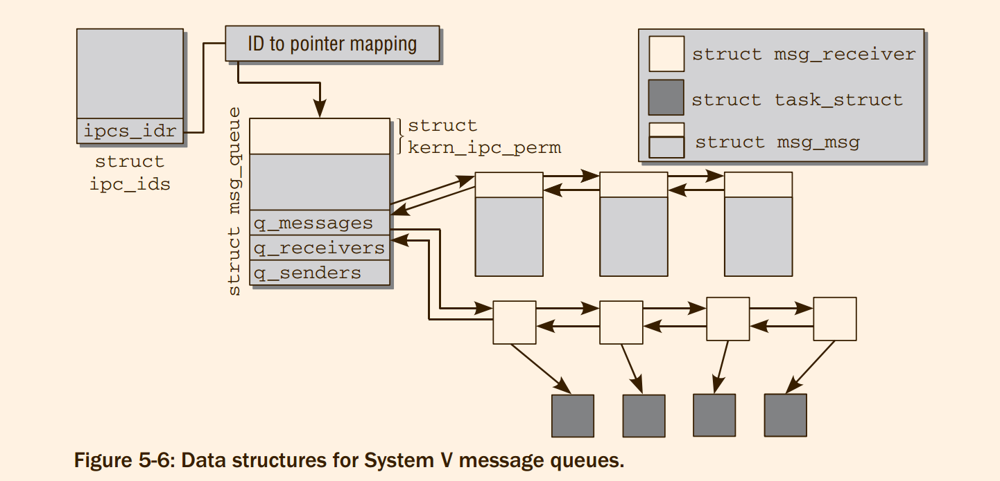
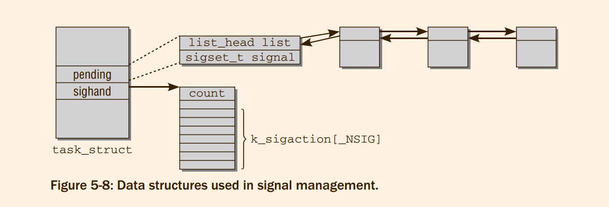

# Professional Linux Kernel Architecture : Locking and Interprocess Communication

## 5.1 Control Mechanism
On SMP systems, the **individual CPUs may be in kernel mode at the same time** and, theoretically,
may want to manipulate all existing data structures. To prevent the CPUs from getting into each
other’s way, it is necessary to protect some kernel areas by means of locks.
#### 5.1.1 Race Conditions


Situations leading to race conditions are few and far between
, thus begging the question as to whether
it’s worth making the — sometimes very considerable — effort to protect code against their occurrence.

#### 5.1.2 Critical Sections


## 5.2 Kernel Locking Mechanism
locking options :
1. Atomic Operations
2. Spinlocks
3. Semaphores
4. Reader/Writer Locks 

#### 5.2.1 Atomic Operations on Integers
The kernel defines the atomic_t data type (in `<asm-arch/atomic.h>`) as the basis for atomic operations with integer counters. 

As an understanding of operation implementation presupposes a deep knowledge of the assembler
facilities of the individual CPUs, I do not deal with this topic here (each processor architecture provides
special functions to implement operations).

Because the atomic data types are ultimately implemented with normal C types, the kernel
encapsulates standard variables in a structure that can no longer be processed with normal operators
such as ++.

在`/include/linux/types.h`中，含有如下定义,阻止了原有的int操作符
```
typedef struct {
	int counter;
} atomic_t;
```

**If the kernel was compiled without SMP support, the operations described are implemented in the same
way as for normal variables (only `atomic_t` encapsulation is observed) because there is no interference
from other processors**
> 似乎并没有实现volatile的功能啊。我觉得说法不对。
> 1. 当进程A : i ++;
> 2. 而进程B : i ++;
> 3. 但是进程A 切换到B 的时候，i 的数值没有写会，B写会之后，A再去写会，最后只有i 的数值为1 而不是 2


```c
#ifdef CONFIG_SMP
#define LOCK_PREFIX_HERE \
		".pushsection .smp_locks,\"a\"\n"	\
		".balign 4\n"				\
		".long 671f - .\n" /* offset */		\
		".popsection\n"				\
		"671:"

#define LOCK_PREFIX LOCK_PREFIX_HERE "\n\tlock; "

#else /* ! CONFIG_SMP */
#define LOCK_PREFIX_HERE ""
#define LOCK_PREFIX ""
#endif
```
> 实际上并不是非常的清楚arch 具体的是什么 TODO。

The kernel provides the `local_t` data type for SMP systems. This permits atomic operations on a single
CPU. To modify variables of this kind, the kernel basically makes the same functions available as for the
`atomic_t` data type, but it is then necessary to replace atomic with local.


`atomic_ops.txt`
`local_t` is very similar to `atomic_t`. If the counter is per CPU and only updated by one CPU, `local_t` is probably more appropriate.

Notice that atomic variables are well suited for integer operations, but not so for bit operations. Each
architecture therefore has to define a set of bit manipulation operations, and these also work atomically
to provide coherence across processors on SMP systems.
 The available operations are summarized in
Section *A.8*

#### 5.2.2 Spinlocks
Spinlocks are implemented by means of the `spinlock_t` data structure, which is manipulated essentially
using `spin_lock` and `spin_unlock`

Spinlocks are used as follows:
```
spinlock_t lock = SPIN_LOCK_UNLOCKED;
...
spin_lock(&lock);
/* Critical section */
spin_unlock(&lock)
```

Code that is protected by spinlocks must not go to sleep.
> 从原理上，spinlocks处理的事情应该是简单的业务，所以不应该睡眠，其次，当一个进程spinlock,之后的进程试图访问，那么只能等到该进程苏醒过来才可以。

This is prevented by a simple trick — kernel preemption is **disabled** when the kernel is in a critical
region protected by a spinlock

**On uniprocessor systems, spinlocks are defined as empty operations because critical sections cannot be
entered by several CPUs at the same time. However, this does not apply if kernel preemption is enabled**

#### 5.2.3 Semaphores

**Userspace semaphores are
implemented differently**, as described in Section 5.3.2
```
/* Please don't access any members of this structure directly */
struct semaphore {
	raw_spinlock_t		lock;
	unsigned int		count;
	struct list_head	wait_list;
};
```
In contrast to spinlocks, semaphores are **suitable** for protecting longer critical sections against parallel
access. However, they should **not** be used to protect shorter sections because it is very costly to put
processes to sleep and wake them up again — as happens when the semaphore is contended

When an attempt is made to acquire a reserved semaphore with down, the current process is put to sleep
and placed on the wait queue associated with the semaphore. At the same time, the process is placed
in the `TASK_UNINTERRUPTIBLE` state and *cannot receive signals while waiting to enter the critical region*
> 为什么需要屏蔽signals啊 ?


In addition to down, two other operations are used to reserve a semaphore (unlike spinlocks, only one up
function is available and is used to exit the section protected by a semaphore):
1. `down_interruptible` works in the same way as down but places the task in the
`TASK_INTERRUPTIBLE` state if the semaphore could not be acquired. As a result, the
process can be woken by signals while it is sleeping
2. `down_trylock` attempts to acquire a semaphore. If it fails, the process does not go to sleep to wait
for the semaphore but continues execution normally. If the semaphore is acquired, the function
returns a false value, otherwise a true value

#### 5.2.4 The Read-Copy-Update Mechanism
This is a good thing, but good
things are always accompanied by a number of not-so-good things. This time, it’s the **constraints** that
RCU places on potential users:
1. Accesses to the shared resource should be Read Only most of the time, and writes should be
correspondingly rare.
2. The kernel cannot go to sleep within a region protected by RCU.
3. The protected resource must be accessed via a pointer

The principle of RCU is simple: The mechanism keeps track of all users of the pointer to the shared
data structure. When the structure is supposed to change, a copy (or a new instance that is filled in
appropriately, this does not make any difference) is first created and the change is performed there. After
all previous readers have finished their reading work on the old copy, the pointer can be replaced by a
pointer to the new, modified copy. **Notice that this allows read access to happen concurrently with write
updates!**


一个典型的rcu使用方法:
```
static inline void cpu_crash_vmclear_loaded_vmcss(void)
{
	crash_vmclear_fn *do_vmclear_operation = NULL;

	rcu_read_lock();// 开始
	do_vmclear_operation = rcu_dereference(crash_vmclear_loaded_vmcss);// 获取指针
	if (do_vmclear_operation) //　判断是否获取成功
		do_vmclear_operation();
	rcu_read_unlock();// 结束
}
```

If the object pointed at by ptr has to be modified, this must be done with `rcu_assign_pointer`:


If updates can come from many places in the kernel, protection against concurrent
write operations must be provided using regular synchronization primitives, for
instance, spinlocks. While RCU protects readers from writers, it does not protect
**writers against writers**!

What happens to the old structure once the new value has been published? After all readers are gone,
the kernel can get rid of the memory — but it needs to know when this is safe to do. RCU provides two
more functions for this purpose:
1. `synchronize_rcu()` waits until all existing readers have finished their work. After the function
returns, it is safe to free the memory associated with the old pointer.
2. `call_rcu` can be used to register a function that is called after all existing readers to a shared
resource are gone. This requires that an instance of `rcu_head` is embedded — and not just accessible via a pointer — into the data stucture protected by RCU:
```
struct super_duper {
  struct rcu_head head;
  int meaning, of, life;
};
```
The callback gets the `rcu_head` of the object passed as parameter and can use the `container_of`
mechanism to access the object.

```
void fastcall call_rcu(struct rcu_head *head, void (*func)(struct rcu_head *rcu))
```

List Operations:
Generic pointers are not the only objects that can be protected by RCU. The kernel also provides standard functions that allow for protecting doubly linked lists by the RCU mechanism, and this is the most
prominent application within the kernel.


#### 5.2.5 Memory and Optimization Barriers
While locks are sufficient to ensure atomicity, they cannot always guarantee time ordering of code that is
subjected to optimizations by compilers and processors. And, in contrast to race conditions, this problem
not only affects SMP systems, but also **uniprocessor** machines.
The kernel provides several functions to prevent both the processor and the compiler from reordering
code:
1. mb(), rmb(), and wmb() insert hardware memory barriers into the code flow.
2. `barrier` inserts an `optimization` barrier. This instructs the compiler to assume that all memory
locations in RAM stored in CPU registers that were valid before the barrier are invalid
after the barrier. Essentially, this means **that the compiler does not process any read or write
requests following the barrier before read or write requests issued before the barrier have been
completed.**
3. `smb_mb()`, `smp_rmb()`, and `smp_wmb()` act as the hardware memory barriers described above,
but only when they are used on SMP systems. They generate a software barrier on uniprocessor
systems instead
4. `read_barrier_depends()` is a special form of a read barrier that takes dependencies among
read operations into account. If a read request after the barrier depends on data for which a read
request is performed before the barrier, then both compiler and hardware must not reorder these
requests.

> 后面举出一个　开关抢占　的函数的例子。


This is possible because locking instructions will on
many architectures also act as memory barriers. However, this needs to be checked for the specific cases
that require memory barriers, and general advice is hard to give

#### 5.2.6 Reader/Writer Locks
The kernel therefore provides additional semaphore and spinlock versions to cater for the above — these
are known accordingly as Reader/Writer semaphores and Reader/Writer spinlocks

The `rwlock_t` data type is defined for Reader/Writer spinlocks. Locks must be acquired in different ways
in order to differentiate between read and write access.
1. `read_lock` and `read_unlock` must be executed before and after a critical region to which a process requires read access. The kernel grants any number of read processes concurrent access to
the critical region.
2. `write_lock` and `write_unlock` are used for write access. The kernel ensures that only one writer
(and no readers) is in the region

An `_irq _irqsave` variant is also available and functions in the same way as normal spinlocks. Variants
ending in `_bh` are also available. *They disable software interrupts, but leave hardware interrupts still
enabled*
> ??? 这两个variant 什么时候见过吗?

Read/write semaphores are used in a similar way. The equivalent data structure is struct `rw_semaphore`,
and `down_read` and `up_read` are used to obtain read access to the critical region. Write access is performed with the help of `down_write` and `up_write`. The `_trylock` variants are also available for all
commands — they also function as described above

#### 5.2.7 The Big Kernel Lock
A relic of earlier days is the option of locking the entire kernel to ensure that no processors run in parallel in kernel mode. This lock is known as the big kernel lock but is most frequently referred to by its
abbreviation, BKL.

> 这个东西，现在应该是没有了吧!

#### 5.2.8 Mutexes
Although semaphores can be used to implement the functionality of mutexes, the overhead imposed
by the generality of semaphores is often not necessary. Because of this, the kernel contains a separate
implementation of special-purpose mutexes that are not based on semaphores.
> 原理上mutex 和 semaphore 相同，但是实际上实现不同

```
/*
 * Simple, straightforward mutexes with strict semantics:
 *
 * - only one task can hold the mutex at a time
 * - only the owner can unlock the mutex
 * - multiple unlocks are not permitted
 * - recursive locking is not permitted
 * - a mutex object must be initialized via the API
 * - a mutex object must not be initialized via memset or copying
 * - task may not exit with mutex held
 * - memory areas where held locks reside must not be freed
 * - held mutexes must not be reinitialized
 * - mutexes may not be used in hardware or software interrupt
 *   contexts such as tasklets and timers
 *
 * These semantics are fully enforced when DEBUG_MUTEXES is
 * enabled. Furthermore, besides enforcing the above rules, the mutex
 * debugging code also implements a number of additional features
 * that make lock debugging easier and faster:
 *
 * - uses symbolic names of mutexes, whenever they are printed in debug output
 * - point-of-acquire tracking, symbolic lookup of function names
 * - list of all locks held in the system, printout of them
 * - owner tracking
 * - detects self-recursing locks and prints out all relevant info
 * - detects multi-task circular deadlocks and prints out all affected
 *   locks and tasks (and only those tasks)
 */
struct mutex {
	/* 1: unlocked, 0: locked, negative: locked, possible waiters */
	atomic_t		count;
	spinlock_t		wait_lock;
	struct list_head	wait_list;
};
```
> 说实话，有点想不懂为什么mutex 需要借助 spinlock 来实现
> spinlock 又是如何实现 ?

There are two ways to define new mutexes:
1. Static mutexes can be generated at compile time by using `DEFINE_MUTEX` (be sure not to confuse this with DECLARE_MUTEX from the semaphore-based mutexes!).
2. `mutex_init` dynamically initializes a new mutex at run time.


Real-time mutexes (RT-mutexes) are another form of mutex supported by the kernel.


In contrast
to regular mutexes, they implement *priority inheritance*, which, in turn, allows for solving (or, at least,
attenuating) the effects of *priority inversion*. Both are well-known effects, respectively, methods and are
discussed in most operating systems textbooks
> 垃圾华科教材，操他妈


```
/**
 * The rt_mutex structure
 *
 * @wait_lock:	spinlock to protect the structure
 * @waiters:	rbtree root to enqueue waiters in priority order
 * @waiters_leftmost: top waiter
 * @owner:	the mutex owner
 */
struct rt_mutex {
	raw_spinlock_t		wait_lock;
	struct rb_root          waiters;
	struct rb_node          *waiters_leftmost;
	struct task_struct	*owner;
};
```


#### 5.2.9 Approximate Per-CPU Counters
1. 所有的 per-cpu 的内容在哪里，这只是 approximate per-cpu counter 而已

```c
struct percpu_counter {
	raw_spinlock_t lock;
	s64 count;
#ifdef CONFIG_HOTPLUG_CPU
	struct list_head list;	/* All percpu_counters are on a list */
#endif
	s32 __percpu *counters;
};
```

所有的定义内容都在`percpu_counter.h`，具体的实现似乎 lib/percpu_counter.c

```c
static inline void percpu_counter_add(struct percpu_counter *fbc, s64 amount)
{
	percpu_counter_add_batch(fbc, amount, percpu_counter_batch);
}
```

#### 5.2.10 Lock Contention and Fine-Grained Locking
> skip

## 5.3 System V Interprocess Communication

#### 5.3.1 System V Mechanisms
The three IPC mechanisms of System V Unix (**semaphores**, **message queues**, and **shared memory**) reflect
three very different concepts but have one thing in common. They all make use of system-wide resources
that can be shared by several processes at the same time
This would seem to be logical for IPC mechanisms **but nevertheless** should not be taken for granted

An alternative is to dynamically generate a magic
number that is guaranteed to be unique (statically assigned numbers cannot be guaranteed to be unique).
The standard library provides several functions to do this (see the relevant system programming
manuals for detailed information).

#### 5.3.2 Semaphores
System V semaphores are implemented using `sem/sem.c` in conjunction with the header file `<sem.h>`.
These semaphores are not related in any way to the kernel semaphores described above.

> 接下来有一个用户态的例子，没有仔细看，直接溜了

The kernel uses several data structures to describe the current status of all registered semaphores and
to build a kind of network. They are responsible not only for managing the semaphores and their
characteristics (value, read, and write permissions, etc.), but also for associating semaphores with waiting
processes by means of a waiting list.

```
struct ipc_namespace {
  ...
  struct ipc_ids *ids[3];
  /* Resource limits */
  ...
}
```
omitted a large number of elements devoted to observing resource consumption and setting
resource limits. The kernel, for instance, restricts the maximum number of shared memory pages, the
maximum size for a shared memory segment, the maximum number of message queues, and so on.

More interesting is the **array ids**. One array position per IPC mechanism — shared memory, semaphores,
and messages — exists, and each points to an instance of struct ipc_ids that is the basis to keep track
of the existing IPC objects per category. But just in case
you were wondering, semaphores live in position 0, followed by message queues and then by shared
memory

> ipc_namespace 哇，又一个namespace

```
struct ipc_ids {
	int in_use;
	unsigned short seq;
	struct rw_semaphore rwsem;
	struct idr ipcs_idr; // 通过这一个和kern_ipc_perm 相联系起来
	int next_id;
};
```
The first elements hold general information on the status of the IPC objects:
1. `in_use` holds the number of IPC objects currently in use
2. `seq` and `seq_id` allow generating userspace IPC identifiers sequentially(所以seq_id 在哪里?)

> The identifier visible to userland is given by `s*SEQ_MULTIPLIER+i` 这一段很迷，非常迷

3. `rw_mutex` is a kernel semaphore

Each
object has a kernel-internal ID, and `ipcs_idr` is **used to associate an ID with a pointer to the corresponding `kern_ipc_perm` instance**.
Since the number of used IPC objects can grow and shrink dynamically,
a static array would not serve well to manage the information, but the kernel provides a radix-tree-like
(see Appendix C) standard data structure in `lib/idr.c` for this purpose. How the entries are managed
in detail is not relevant for our purposes; **it suffices to know that each internal ID can be associated with
the respective `kern_ipc_perm` instance without problems**

```
/* used by in-kernel data structures */
struct kern_ipc_perm
{
	spinlock_t	lock;
	bool		deleted;
	int		id;
	key_t		key;
	kuid_t		uid;
	kgid_t		gid;
	kuid_t		cuid;
	kgid_t		cgid;
	umode_t		mode; 
	unsigned long	seq;
	void		*security;
};
```
The structure can be used not only for semaphores but also for other IPC mechanisms. You will come
across it frequently in this chapter.
1. `key` holds the magic number used by user programs to identify the semaphore, and id is the
kernel-internal identifier.
2. `uid` and `gid` specify the user and group ID of the owner. `cuid` and `cgid` hold the same data for
the process that generated the semaphore.
3. `seq` is a sequence number that was used when the object was reserved.
4. `mod`e holds the bitmask, which specifies access permissions in accordance with the owner, group,
others scheme.


The above data structures are not sufficient to keep all information required for semaphores. A special
per-task element is required:
```
struct task_struct {
...
#ifdef CONFIG_SYSVIPC
  /* ipc stuff */
    struct sysv_sem sysvsem;
    struct sysv_shm sysvshm;
#endif
...
}


struct sysv_sem {
	struct sem_undo_list *undo_list;
};
```
The only member, undo_list, is used to permit semaphore manipulations that can be undone


`sem_queue` is another data structure that is used to associate a semaphore with a sleeping process that
wants to perform a semaphore operation but is not allowed to do so at the moment. In other words, each
instance of the data structure is an entry in the list of pending operations


```
/* One queue for each sleeping process in the system. */
struct sem_queue {
	struct list_head	list;	 /* queue of pending operations */
	struct task_struct	*sleeper; /* this process */
	struct sem_undo		*undo;	 /* undo structure */
	int			pid;	 /* process id of requesting process */
	int			status;	 /* completion status of operation */
	struct sembuf		*sops;	 /* array of pending operations */
	struct sembuf		*blocking; /* the operation that blocked */
	int			nsops;	 /* number of operations */
	int			alter;	 /* does *sops alter the array? */
};
```
1. `sleeper` is a pointer to the task structure of the process waiting for permission to perform a
semaphore operation.(既然有pid, 为什么还需要sleeper指针指向的task_struct, 内核中间无法访问)
2. `pid` specifies the PID of the waiting process.
3. `id` holds the kernel-internal semaphore identifier.(为什么需要in-kernel semaphore identifier)
4. `sops` is a pointer to an array that holds the pending semaphore operations 
5. `alter` indicates whether the operations alter the value of the semaphore

> 实际上根本就找不到sem_queue 指向 sem_array 的指针，两者的联系也无从说起。
> 所以后面的图其实也是不准确的

> 最关键的问题是: 到底是一步步实现应用层的几个函数的


#### 5.3.3 Message Queues
Even if several processes are listening in on a channel, each message
can be read by one process only.

The starting point is the appropriate `ipc_ids` instance of the current namespace.
> fuck，namespace again 

Again, the internal ID numbers are formally associated with `kern_ipc_perm` instances, but as in the
semaphore case, a different data type (struct `msg_queue`) is obtained as a result of type conversion
> 好吧，并不知道两者到底是如何连接起来的，也不知道两者表达的是什么意思


```
/* one msq_queue structure for each present queue on the system */
struct msg_queue {
	struct kern_ipc_perm q_perm;
	time_t q_stime;			/* last msgsnd time */
	time_t q_rtime;			/* last msgrcv time */
	time_t q_ctime;			/* last change time */
	unsigned long q_cbytes;		/* current number of bytes on queue */
	unsigned long q_qnum;		/* number of messages in queue */
	unsigned long q_qbytes;		/* max number of bytes on queue */
	pid_t q_lspid;			/* pid of last msgsnd */
	pid_t q_lrpid;			/* last receive pid */

	struct list_head q_messages;
	struct list_head q_receivers;
	struct list_head q_senders;
};
```


Each message in `q_messages` is encapsulated in an instance of `msg_msg`.
```
/* one msg_msg structure for each message */
struct msg_msg {
	struct list_head m_list;
	long m_type;
	size_t m_ts;		/* message text size */
	struct msg_msgseg *next;
	void *security;
	/* the actual message follows immediately */
};
```


Sleeping senders are placed on the `q_senders` list of `msg_queue` using the following data structure:
```
/* one msg_sender for each sleeping sender */
struct msg_sender {
	struct list_head	list;
	struct task_struct	*tsk;
};
```

The data structure to hold the receiver process in the `q_receivers` list is a little longer.
```
/* one msg_receiver structure for each sleeping receiver */
struct msg_receiver {
	struct list_head	r_list;
	struct task_struct	*r_tsk;

	int			r_mode;
	long			r_msgtype;
	long			r_maxsize;

	/*
	 * Mark r_msg volatile so that the compiler
	 * does not try to get smart and optimize
	 * it. We rely on this for the lockless
	 * receive algorithm.
	 */
	struct msg_msg		*volatile r_msg;
};
```


> 中间的联系其实没有看懂，好伐
> 如何上层的接口也是不知道的
> 难道介绍几个数据结构我就知道你在说什么吗 ?


#### 5.3.4 Shared Memory
 Its essential aspects do not differ from those of semaphores and message queues.
1. Applications request an IPC object that can be accessed via a `common magic number` and a
`kernel-internal identifier` via the current namespace.
2. Access to memory can be restricted by means of a system of privileges.
3. System calls are used to allocate memory that is associated with the IPC object and that can be
accessed by all processes with the appropriate authorization.
> 这个J8 kernel-internal identifier 和 magic number 到底是什么关系 ?


A dummy
file linked with the corresponding instance of `shmid_kernel` via `shm_file` is created for each shared
memory object. The kernel uses the pointer `smh_file->f_mapping` to access the address space object
(struct address_space) used to create `anonymous mappings` as described in Chapter 4. The page tables
of the processes involved are set up so that each process is able to access the areas linked with the region.
> 听听，这是人说的话吗 ?


> 所以为什么要创建这么多的蛇皮IPC机制，直接都采用shared memory 不就完了 ?


## 5.4 Other IPC Mechanisms

#### 5.4.1 Signals
The underlying concept is very simple — the
kill command sends a signal to a process identified by its PID. The number of the signal is specified
using -s sig and is a positive integer whose maximum size varies depending on processor type. The two
most frequently used variants of the command are kill without a signal number, which politely requests
the process to terminate (the process is free to ignore the signal), and kill -9, which is the equivalent of
a signature on an execution warrant (and results in certain death).
> 总算知道 kill 的作用了

Processes must install handler routines to process signals. These are invoked when signals are sent to
the processes (but there are several signals such as SIGKILL whose behavior cannot be overridden). If no
explicit handler routine is installed, the kernel uses a default handler implementation

Signals introduce several special features that must always be kept in mind. A process can decide to block
specific signals (sometimes referred to as the masking of signals). If this happens, the signal is ignored
until the process decides to remove the block. There is therefore no guarantee that a process will be
aware that a signal has been sent to it. When a signal is blocked, the kernel places it on a pending list. If
the same signal is blocked more than once, only a single occurrence of the signal is placed on the pending
list. No matter how many identical signals are sent, the process receives just one occurrence of the signal
when it removes the block.
> 可以 block ，多个被 block 只有一个可以被识别

The `SIGKILL` signal cannot be blocked and cannot be handled by a process-specific handler function
It cannot be overridden because it is the last resort to remove an out-of-control process from the system.
This contrasts with the `SIGTERM` signal, which can be dealt with by a user-defined signal handler — after
all, the signal is just a polite request to the process to stop work as soon as possible. If a handler is installed
for this signal, the program is, for example, given the opportunity to save data or to ask users whether
they really want to exit the program. SIGKILL does not provide such opportunities because the kernel
brings the process to an immediate and abrupt end.
> SIGKILL 无法屏蔽和重新定义，但是 SIGTERM 可以。

The `init` process is granted a special status.
The kernel ignores any `SIGKILL` signals sent to it. Because
this process is of particular importance to the entire system, it may not be forced to terminate — not even
unintentionally.

* ***Implementing Signal Handlers***

The `sigaction` system call is used to install a new handler function.

```c
struct sigaction {
#ifndef __ARCH_HAS_IRIX_SIGACTION
	__sighandler_t	sa_handler;
	unsigned long	sa_flags;
#else
	unsigned int	sa_flags;
	__sighandler_t	sa_handler;
#endif
#ifdef __ARCH_HAS_SA_RESTORER
	__sigrestore_t sa_restorer;
#endif
	sigset_t	sa_mask;	/* mask last for extensibility */
};


typedef void __signalfn_t(int);
typedef __signalfn_t __user *__sighandler_t;
```
1. `sa_handler` is a pointer to the handler function invoked by the kernel when a signal arrives.
2. `sa_mask` contains a bitmask with exactly one bit for each signal available in the system. It is used
to **block** other signals during execution of the handler routine. On completion of the routine, the
kernel resets the list of blocked signals to its value prior to signal handling.
3. `sa_flags` contains additional flags to specify how the signal must be handled; 
these are documented in various system programming manuals.
> sa_mask 表示自己处理的时候，屏蔽其他信号
> @todo 是不是默认屏蔽自己的信号。
> @todo 信号之间存在优先级吗 ?

* **Implementing Signal Handling**
All signal-related data are managed with the help of a linked data structure consisting of several C
structures. Its entry point is the `task_struct` task structure, which includes various signal-relevant
fields.

```c
<sched.h>
struct task_struct {
  ...
  /* signal handlers */
	struct signal_struct		*signal;
	struct sighand_struct		*sighand;
	sigset_t			blocked;
	sigset_t			real_blocked;
	/* Restored if set_restore_sigmask() was used: */
	sigset_t			saved_sigmask;
	struct sigpending		pending;
	unsigned long			sas_ss_sp;
	size_t				sas_ss_size;
	unsigned int			sas_ss_flags;
  ...
};
```

Although signal handling takes place in the kernel, the installed signal handlers run in user
mode — otherwise, it would be very easy to introduce malicious or faulty code into the kernel and
undermine the system security mechanisms.

Generally, signal handlers use the user mode stack of
the process in question. However, POSIX mandates the option of running signal handlers on a stack
set up specifically for this purpose (using the `sigaltstack` system call). The address and size of this
additional stack (which must be explicitly allocated by the user application) are held in `sas_ss_sp` and
`sas_ss_size`, respectively
> handler 使用的stack 

The `sighand` element with the following structure is used to manage information on the signal handlers
**installed**. The underlying structure is essentially defined as follows:

```c
struct sighand_struct {
	atomic_t		count;
	struct k_sigaction	action[_NSIG];
	spinlock_t		siglock;
	wait_queue_head_t	signalfd_wqh;
};
```

Each element contains an instance of the `k_sigaction` structure to specify the **properties** of a signal
as **seen by the kernel**. 

```c
struct k_sigaction {
	struct sigaction sa;
#ifdef __ARCH_HAS_KA_RESTORER
	__sigrestore_t ka_restorer;
#endif
};
```

All blocked signals are defined by the blocked element of the task structure. The `sigset_t` data type
used is a bitmask that must contain (at least) as many positions as the number of signals supported

`pending` is the final task structure element of relevance for signal handling. 


```c
struct sigpending {
	struct list_head list;
	sigset_t signal;
};

struct sigqueue {
	struct list_head list;
	int flags;
	siginfo_t info;
	struct user_struct *user;
};

typedef struct siginfo {
  int si_signo;
  int si_errno;
  int si_code;
  union {
  /* Signal-specific information */
    struct { ... } _kill;
    struct { ... } _timer; /* POSIX.1b timers */
    struct { ... } _rt; /* POSIX.1b signals */
    struct { ... } _sigchld;
    struct { ... } _sigfault; /* SIGILL, SIGFPE, SIGSEGV, SIGBUS */
    struct { ... } _sigpoll;
  } _sifields;
} siginfo_t;
```
1. `si_signo` holds the signal number.
2. `si_errno` has a non-zero value if the signal was raised as a result of an error; otherwise, its
value is 0.
3. `si_code` returns detailed information on the origin of the signal; we are interested only in the
distinction between user signal (SI_USER) and kernel-generated signal (SI_KERNEL).
4. Additional information needed by the kernel to handle some signals is held in the `_sifield`
union. For example, `_sigfault` contains the userspace address of the instruction that raised the
signal.



* ***Implementing Signal Handling***


```c
/**
 *  sys_tkill - send signal to one specific task
 *  @pid: the PID of the task
 *  @sig: signal to be sent
 *
 *  Send a signal to only one task, even if it's a CLONE_THREAD task.
 */
SYSCALL_DEFINE2(tkill, pid_t, pid, int, sig)
{
	/* This is only valid for single tasks */
	if (pid <= 0)
		return -EINVAL;

	return do_tkill(0, pid, sig);
}


static int do_tkill(pid_t tgid, pid_t pid, int sig)
{
	struct siginfo info = {};

	info.si_signo = sig;
	info.si_errno = 0;
	info.si_code = SI_TKILL;
	info.si_pid = task_tgid_vnr(current);
	info.si_uid = from_kuid_munged(current_user_ns(), current_uid());

	return do_send_specific(tgid, pid, sig, &info);
}


static int
do_send_specific(pid_t tgid, pid_t pid, int sig, struct siginfo *info)
{
	struct task_struct *p;
	int error = -ESRCH;

	rcu_read_lock();
	p = find_task_by_vpid(pid);
	if (p && (tgid <= 0 || task_tgid_vnr(p) == tgid)) {
		error = check_kill_permission(sig, info, p); // 
		/*
		 * The null signal is a permissions and process existence
		 * probe.  No signal is actually delivered.
		 */
		if (!error && sig) {
			error = do_send_sig_info(sig, info, p, false);
			/*
			 * If lock_task_sighand() failed we pretend the task
			 * dies after receiving the signal. The window is tiny,
			 * and the signal is private anyway.
			 */
			if (unlikely(error == -ESRCH))
				error = 0;
		}
	}
	rcu_read_unlock();

	return error;
}


int do_send_sig_info(int sig, struct siginfo *info, struct task_struct *p,
			bool group)
{
	unsigned long flags;
	int ret = -ESRCH;

	if (lock_task_sighand(p, &flags)) {
		ret = send_signal(sig, info, p, group);
		unlock_task_sighand(p, &flags);
	}

	return ret;
}

```

The remaining signal handling work is passed on to `specific_send_sig_info`.
1. If the signal is blocked (this can be checked with `sig_ignored`), handling is aborted immediately
to prevent further waste of time.
2. send_signal generates a new sigqueue instance (using the cache sigqueue_cachep), which is
filled with the signal data and added to the sigpending list of the target process.
3. If the signal is delivered successfully and is not blocked, the process is woken with
`signal_wake_up` so that it is available for selection by the scheduler. The `TIF_SIGPENDING` flag is
also set to indicate to the kernel that it must deliver signals to the process.
> 实际上，重要的工作都被放到`_send_signal`，　以上的论断并没有仔细的分析过

Although the signal is sent after these actions, it does not trigger the signal handler. How this is done is
described below.


**Processing the Signal Queue**
> TO READ

#### 5.4.2 Pipes and Sockets
> TO READ


## 问题
1. 在 有无preemption 以及 SMP 中间，需要何种锁?


## 附录

1. 在 `rmap.c` 中间的锁的次序
```c
/*
 * Lock ordering in mm:
 *
 * inode->i_mutex	(while writing or truncating, not reading or faulting)
 *   mm->mmap_sem
 *     page->flags PG_locked (lock_page)
 *       hugetlbfs_i_mmap_rwsem_key (in huge_pmd_share)
 *         mapping->i_mmap_rwsem
 *           anon_vma->rwsem
 *             mm->page_table_lock or pte_lock
 *               pgdat->lru_lock (in mark_page_accessed, isolate_lru_page)
 *               swap_lock (in swap_duplicate, swap_info_get)
 *                 mmlist_lock (in mmput, drain_mmlist and others)
 *                 mapping->private_lock (in __set_page_dirty_buffers)
 *                   mem_cgroup_{begin,end}_page_stat (memcg->move_lock)
 *                     i_pages lock (widely used)
 *                 inode->i_lock (in set_page_dirty's __mark_inode_dirty)
 *                 bdi.wb->list_lock (in set_page_dirty's __mark_inode_dirty)
 *                   sb_lock (within inode_lock in fs/fs-writeback.c)
 *                   i_pages lock (widely used, in set_page_dirty,
 *                             in arch-dependent flush_dcache_mmap_lock,
 *                             within bdi.wb->list_lock in __sync_single_inode)
 *
 * anon_vma->rwsem,mapping->i_mutex      (memory_failure, collect_procs_anon)
 *   ->tasklist_lock
 *     pte map lock
 */
```
