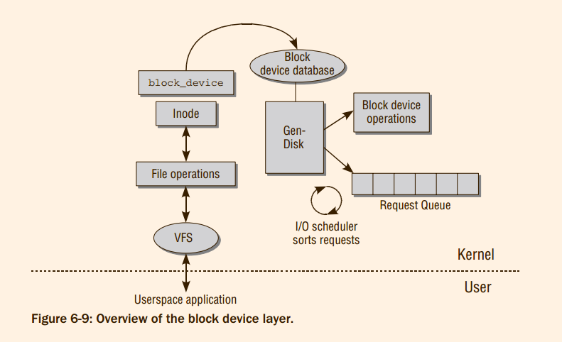
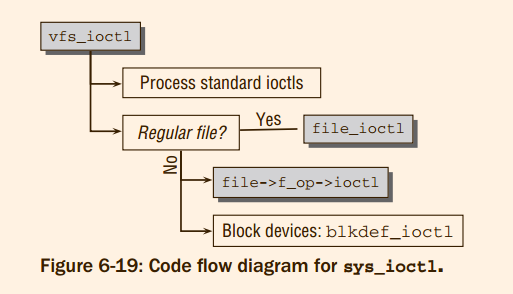

# Professional Linux Kernel Architecture : Device Drivers
The classic text in this area is **Linux Device Drivers** by Corbet et al. [CRKH05]. 
We can recommend it wholeheartedly to anyone interested in or charged with writing a device driver. 
A recent addition to kernel hackers’ bookshelves is **Essential Linux Device Drivers** by Venkateswaran [Ven08]. 

1. Here, we document how the kernel sets up and manages data structures and generic infrastructure for device drivers.
2. Also, we discuss routines that are provided to support device drivers

## 6.1 I/O Architecture
The kernel must deal with three problem areas when implementing I/O for peripherals.
1. Firstly, the hardware must be **addressed** using a variety of methods depending on the specific device type and model.
2. Secondly, the kernel must provide user applications and system tools with
ways of accessing the various devices. Wherever possible, a uniform scheme should be adopted
to keep programming effort within limits and to ensure that applications are able to interoperate
regardless of the particular hardware approach.
3. Thirdly, userspace needs to know which devices are available in the kernel.
> 1. 第三条规则莫名奇妙，如果可以addresss devices了，用户空间还不可以确定什么device 不在kernel 中间吗 ?
> 2. 分别的实现逻辑是什么 ?


#### 6.1.1 Expansion Hardware
There are numerous ways of implementing buses,most of which are supported by Linux. We list a representative selection below
1. Peripheral Component Interconnect(PCI)
2. Industrial Standard Architecture (ISA)
3. Universal Serial Bus (USB)
4. etc


**Bus Systems**
> @todo read it, maybe with the fucking ldd ! What read below is too simple without !

Some buses such as USB or FireWire cannot be operated as main buses but always require a further system bus via which data are passed to the processor

**Interaction with the Peripherals**
There are several ways of communicating with the hardware attached to the system.
1. I/O Ports

Commands such as outb (to write a byte), `outw` (to write a word), and `inb` (to read a byte) are implemented in asm-arch/io.h. 
> @todo 我想知道NEMU中间是如何实现在硬件和软件上实现outw 和 inw 的, 应该不是很麻烦

2. I/O Memory Mapping

Graphic cards typically use this type of operation because it is easier
to process extensive image data with normal processor commands than with specific port commands.
System buses such as PCI are also often addressed by means of mapped I/O addresses.

Because the methods used to do this differ greatly between the various
underlying architectures, the kernel once again provides a small abstraction layer consisting primarily of
the `ioremap` and `iounmap` commands to map and unmap I/O areas. 
> RTFSC

Expansion buses such as USB, IEEE1394, and SCSI exchange data and commands with attached devices
by means of a clearly defined *bus protocol*.
> What is the bus protocol

Communication with bus-attached devices need not be performed in kernel space in the form of a device
driver but in some cases may also be implemented from userspace.

**Device Control via Buses**
@todo

## 6.2 Access to Devices
Device special files (often referred to as device files) are used to access expansion devices. 
#### 6.2.1 Device Files
The device is identified not by means of its filename but
by means of the major and minor number of the file; these numbers are managed as special attributes in
the filesystem.

```sh
echo "ATZ" > /dev/ttyS0
```
sends an initialization string to a modem connected to the first serial interface
> 让我想起了被tty支配的恐惧

#### 6.2.2 Character, Block, and Other Devices
**Identifying Device Files**

The kernel employs the major and minor numbers to identify the matching driver. ***The reason*** why two
numbers are used is because of the **general** structure of a device driver.
1. Firstly, the system may include several devices of the same type that are managed by a single device driver (it wouldn’t make sense to load the same code into the kernel more than once).
2. Secondly, devices of the same category can be combined so that they can be inserted logically into the kernel’s data structure
> 多个设备可以被同一个驱动管理，多个设备属于一个类型

As you know, individual partitions of a disk can be addressed by means of device files /dev/sda1,
/dev/sda2, and so on, whereas /dev/sda refers to the entire disk.

A single driver
can reserve more than one major number. If two SATA buses are present in the system, the second SATA
channel gets a different major number from the first one.

Drivers that did not use the major numbers registered
in this list to identify their devices cannot and are not included in the standard distribution of kernel
sources.
> 为什么major number，不是动态分配的

Nearly all distributions have thus switched to managing the contents of `/dev` with `udevd`, a daemon that allows
dynamic device file creation from userland.
> Man udev(7)  
> udev - Dynamic device management

Whenever the kernel detects a device, a kernel object (kobject; see Chapter 1) is created. The object is
exported to userland with the help of the sysfs filesystem (see Section 10.3 for more details). Additionally,
the kernel sends a hotplug message to userspace, as is discussed in Section 7.4.
> @todo find the source code of the description above

Since the introduction of the udev mechanism, `/dev` is not contained on a disk-based filesystem anymore,
but uses tmpfs — a slight variation on the RAM-disk filesystem ramfs.

In addition to the task outlined above, the udev daemon also assumes some more responsibilities like
ensuring that device nodes for specific devices always have the same name irrespective of the device
topology.
For instance, users usually desire to have the same device node for USB sticks independent of
when and where they are plugged in. Refer to the manual page udevd(5) for more information on how
the udev daemon handles such cases — this is a pure userspace problem and nothing the kernel needs
to be concerned about.

**Dynamic Creation of Device Files**
> @todo

#### 6.2.3 Device Addressing Using Ioctls
A more appropriate solution goes by the name of IOCTL, which stands for input output
control interface and is a general interface for configuring and modifying specific device characteristics.

There’s also a third alternative available: `Sysfs`, a file system that hierarchically represents all devices of
the system, and also provides means to set parameters for these devices

How are ioctls employed from a user and programming point of view ?
The standard libraries provide the ioctl function to direct an ioctl command to an opened file by means of a specific code. The
implementation of this function is based on the ioctl system call that is handled by `sys_ioctl` in the
kernel (see Chapter 13 for information on the implementation of system calls).

```c
SYSCALL_DEFINE3(ioctl, unsigned int, fd, unsigned int, cmd, unsigned long, arg)
{
	int error;
	struct fd f = fdget(fd);

	if (!f.file)
		return -EBADF;
	error = security_file_ioctl(f.file, cmd, arg);
	if (!error)
		error = do_vfs_ioctl(f.file, fd, cmd, arg);
	fdput(f);
	return error;
}
```

Character and block devices are not the only device categories managed by the kernel. Network cards
occupy a special position in the kernel because they do not fit into this category scheme 

There are also other system devices that do not have device files; these are accessed either by specially
defined system calls or are simply not accessed from userspace

**Network Cards and Other Devices**
@todo 
During the development of 2.6, a 16-bit integer (typically unsigned short) was
used to represent major and minor numbers. The integer was split in a 1:1 ratio, that is, 8 bits for the
major number and 8 bits for the minor number. This meant that exactly 256 major numbers and 256
minor numbers were possible. This is not sufficient on today’s much bigger systems — one need only
consider the example of SCSI storage arrays comprising a very large number of hard disks.
> 曾经的16bit 不够用

As a result, 12 bits were reserved for the major and 20 for the minor numbers. This gave rise to
the following problems.
1. Many drivers make the incorrect assumption that only 16 bits are available to represent the numbers.
2. Device file numbers stored on old filesystems use only 16 bits but must still function correctly.
The problem of the now non-symmetrical division of bits between major and minor numbers
must therefore be resolved.


The kernel provides the functions/macros listed below (and defined in `<kdev_t.h>`) to extract information from the u32 representation and convert between u32 and dev_t

[](../img/6-4.png)

```c
/*
Some programs want their definitions of MAJOR and MINOR and MKDEV
from the kernel sources. These must be the externally visible ones.
*/
#define MAJOR(dev)	((dev)>>8)
#define MINOR(dev)	((dev) & 0xff)
#define MKDEV(ma,mi)	((ma)<<8 | (mi))


/* acceptable for old filesystems */
static inline bool old_valid_dev(dev_t dev)
{
	return MAJOR(dev) < 256 && MINOR(dev) < 256;
}

static inline u16 old_encode_dev(dev_t dev)
{
	return (MAJOR(dev) << 8) | MINOR(dev);
}

static inline dev_t old_decode_dev(u16 val)
{
	return MKDEV((val >> 8) & 255, val & 255);
}

static inline u32 new_encode_dev(dev_t dev)
{
	unsigned major = MAJOR(dev);
	unsigned minor = MINOR(dev);
	return (minor & 0xff) | (major << 8) | ((minor & ~0xff) << 12);
}

static inline dev_t new_decode_dev(u32 dev)
{
	unsigned major = (dev & 0xfff00) >> 8;
	unsigned minor = (dev & 0xff) | ((dev >> 12) & 0xfff00);
	return MKDEV(major, minor);
}
```
> 其实就是为了和16位兼容，所以二进制的分布做了一些移动而已.

#### 6.2.4 Representation of Major and Minor Numbers
For historical reasons, there are two ways of managing the major and minor numbers of a device in a
compound data type.

#### 6.2.5 Registration
*Although* block and character devices can and do behave very differently from each other, the databases
employed to keep track of all available devices are identical. This is natural since both block and character
devices are identified by a unique device number. *Nevertheless*, the database keeps track of different objects dependent on whether block or character devices are managed.
1. Each character device is represented by an instance of struct `cdev`.
2. `struct genhd` is used to manage partitions of block devices and plays a role similar to that of
cdev for character devices. This is reasonable since a block device without partitions can also be
seen as a block device with a single, large partition!
> `cdev` 和 `struct genhd` 是对等概念，而不是 `cdev` 和 `struct block_device` 是对等概念


`bdev_map` 和 `cdev_map` 数组用于实现 块 和 字符设备的散列表。两者都是`struct kobj_map`的实例。
```c
struct kobj_map {
	struct probe {
		struct probe *next;
		dev_t dev;
		unsigned long range;
		struct module *owner;
		kobj_probe_t *get;
		int (*lock)(dev_t, void *);
		void *data;
	} *probes[255];
	struct mutex *lock;
};

static struct kobj_map *cdev_map;
static struct kobj_map *bdev_map;
```
解释一下kobj_map的成员变量:
0. The `mutex` lock serializes access to the hash table. 
1. `data`: 当为字符设备的时候，data指向`struct cdev`, 当为块设备的时候，data 指向 `struct genhd`
2. `next` connects all hash elements in a singly linked list.
3.  `dev` denotes the device number. Recall that both major and minor numbers are contained in this
datum.
4. The consecutive range of minor numbers is stored in `range`. The minor numbers associated to
the device are thus given by MINORS(DEV) + range - 1.
5. `owner` points to the module (if any) providing the device driver.
6. get points to a function that returns the kobject instance associated with the device. Usually,
this task is rather straightforward, but it may become more involved if device mappers are in
use.
> @todo hash 在内核中间到底是如何使用的 ? hash 是如何运用于kobj_map的

===> Character Device Range Database
> @todo 


**Registration Procedures**
字符设备注册步骤:
1. 注册或者分配一个设备号， 本阶段并不需要`struct cdev`
```c
/**
 * register_chrdev_region() - register a range of device numbers
 * @from: the first in the desired range of device numbers; must include
 *        the major number.
 * @count: the number of consecutive device numbers required
 * @name: the name of the device or driver.
 *
 * Return value is zero on success, a negative error code on failure.
 */
int register_chrdev_region(dev_t from, unsigned count, const char *name)
```

```c
/**
 * alloc_chrdev_region() - register a range of char device numbers
 * @dev: output parameter for first assigned number
 * @baseminor: first of the requested range of minor numbers
 * @count: the number of minor numbers required
 * @name: the name of the associated device or driver
 *
 * Allocates a range of char device numbers.  The major number will be
 * chosen dynamically, and returned (along with the first minor number)
 * in @dev.  Returns zero or a negative error code.
 */
int alloc_chrdev_region(dev_t *dev, unsigned baseminor, unsigned count,
			const char *name)
{
```
> 两个函数都是调用 `__register_chrdev_region`

```c
/*
 * Register a single major with a specified minor range.
 *
 * If major == 0 this functions will dynamically allocate a major and return
 * its number.
 *
 * If major > 0 this function will attempt to reserve the passed range of
 * minors and will return zero on success.
 *
 * Returns a -ve errno on failure.
 */
static struct char_device_struct *
__register_chrdev_region(unsigned int major, unsigned int baseminor,
			   int minorct, const char *name)
{
```
> `__register_chrdev_region`调用，并且做出一些检查工作, 然后调用`find_dynamic_major`，后者的主要工作是扫描 chrdevs 数组.

```c
static int find_dynamic_major(void)
{
	int i;
	struct char_device_struct *cd;

	for (i = ARRAY_SIZE(chrdevs)-1; i >= CHRDEV_MAJOR_DYN_END; i--) {
		if (chrdevs[i] == NULL)
			return i;
	}

	for (i = CHRDEV_MAJOR_DYN_EXT_START;
	     i >= CHRDEV_MAJOR_DYN_EXT_END; i--) {
		for (cd = chrdevs[major_to_index(i)]; cd; cd = cd->next)
			if (cd->major == i)
				break;

		if (cd == NULL)
			return i;
	}

	return -EBUSY;
}


static struct char_device_struct {
	struct char_device_struct *next;
	unsigned int major;
	unsigned int baseminor;
	int minorct;
	char name[64];
	struct cdev *cdev;		/* will die */
} *chrdevs[CHRDEV_MAJOR_HASH_SIZE];
```


2. 将设备添加到字符设备数据库。调用`cdev_init`初始化`struct cdev`, 调用`cdev_add`将其添加到数据库中间
```c
void cdev_init(struct cdev *cdev, const struct file_operations *fops)
{
	memset(cdev, 0, sizeof *cdev);
	INIT_LIST_HEAD(&cdev->list);
	kobject_init(&cdev->kobj, &ktype_cdev_default);
	cdev->ops = fops;
}
```

```c
int cdev_add(struct cdev *p, dev_t dev, unsigned count)
{
	int error;

	p->dev = dev;
	p->count = count;

	error = kobj_map(cdev_map, dev, count, NULL,
			 exact_match, exact_lock, p);
	if (error)
		return error;

	kobject_get(p->kobj.parent);

	return 0;
}
```

> 直到此时，设备和路径是没有关联起来的
> 路径相关联是必须的，因为 至少块设备的查询 都是依赖于 路径查询，而不是使用设备号 实现的
> 所以，现在**设备和路径是如何关联**(设备的mount吗?)

**设备和inode 如何联系起来的**
1. 当调用init_special_inode 的时候，参数为设备号
2. ext_mknod 会调用init_special_inode
> ext_mknod 的含义

===>  Block Devices
Registering block devices requires only a single call to `add_disk`. To describe the device properties, an
instance of `struct genhd` is required as a parameter; 
Earlier kernel versions required block devices to be registered using register_blkdev, which has the
following prototype:
```c
/**
 * register_blkdev - register a new block device
 *
 * @major: the requested major device number [1..BLKDEV_MAJOR_MAX-1]. If
 *         @major = 0, try to allocate any unused major number.
 * @name: the name of the new block device as a zero terminated string
 *
 * The @name must be unique within the system.
 *
 * The return value depends on the @major input parameter:
 *
 *  - if a major device number was requested in range [1..BLKDEV_MAJOR_MAX-1]
 *    then the function returns zero on success, or a negative error code
 *  - if any unused major number was requested with @major = 0 parameter
 *    then the return value is the allocated major number in range
 *    [1..BLKDEV_MAJOR_MAX-1] or a negative error code otherwise
 *
 * See Documentation/admin-guide/devices.txt for the list of allocated
 * major numbers.
 */
int register_blkdev(unsigned int major, const char *name)
```
name is usually identical to the device filename, but can be any arbitrary valid string. Although it is not
necessary to call the function anymore today, it is still possible. The benefit is that the block device will
show up in `/proc/devices`.

```c
static inline void add_disk(struct gendisk *disk)
{
	device_add_disk(NULL, disk, NULL);
}

void device_add_disk(struct device *parent, struct gendisk *disk,
		     const struct attribute_group **groups)

{
	__device_add_disk(parent, disk, groups, true);
}
EXPORT_SYMBOL(device_add_disk);
```
> add_disk 和 register_blkdev 的细节并不清楚


## 6.3 Association with the Filesystem
##### 6.3.1 Device File Elements in Inodes
Each file in the virtual file system is associated with just one inode that manages the file properties. 

1. To uniquely identify that device associated with a device file, the kernel stores the file type
(block- or character-oriented) in `i_mode` and the major and minor numbers in `i_rdev`. *These two
items of information are combined in the kernel into a single variable of type `dev_t`*.
> @idea combined ? why ?　i_rdev 本来就是 dev_t 的类型
2. `i_fop` is a collection of file operations such as open, read, and write used by the virtual filesystem
to work with the block device

3. Depending on whether the inode represents a block or a character device, `i_bdev` or `i_cdev`
point to more specific information, which is discussed further below.

##### 6.3.2 Standard File Operations
When a device file is opened, the various filesystem implementations invoke the `init_special_inode`
function to create the inode for a block or character device file

inode.c 中间初始化设备节点:
```c
void init_special_inode(struct inode *inode, umode_t mode, dev_t rdev)
{
	inode->i_mode = mode;
	if (S_ISCHR(mode)) {
		inode->i_fop = &def_chr_fops;
		inode->i_rdev = rdev;
	} else if (S_ISBLK(mode)) {
		inode->i_fop = &def_blk_fops;
		inode->i_rdev = rdev;
	} else if (S_ISFIFO(mode))
		inode->i_fop = &pipefifo_fops;
	else if (S_ISSOCK(mode))
		;	/* leave it no_open_fops */
	else
		printk(KERN_DEBUG "init_special_inode: bogus i_mode (%o) for"
				  " inode %s:%lu\n", mode, inode->i_sb->s_id,
				  inode->i_ino);
}
EXPORT_SYMBOL(init_special_inode);
```

```c
const struct file_operations def_chr_fops = {
	.open = chrdev_open,
	.llseek = noop_llseek,
};
```


#### 6.3.3 Standard Operations for Character Devices
The situation with character devices is initially very unclear because only a single file operation is made
available.

```c
static int chrdev_open(struct inode *inode, struct file *filp){
// ...
	fops = fops_get(p->ops);
	if (!fops)
		goto out_cdev_put;

	replace_fops(filp, fops);
// ...
}
```

The main task of the
`chrdev_open` function is therefore to fill the structure with the missing function pointers appropriate to
the opened device so that meaningful operations can be performed on the device file and ultimately on
the device itself.
> @todo 为什么不直接注册，而是通过open的时候处理 ?

#### 6.3.4 Standard Operations for Block Devices
Although `file_operations` is used by the VFS layer to
communicate with userspace, the routines it contains invoke the functions in
`block_device_operations` to implement communication with the block device. The
`block_device_operations` must be implemented specifically for each block device
to abstract the device properties, but the same `file_operations` that build on these
can be used for all block devices.

```c
const struct file_operations def_blk_fops = {
	.open		= blkdev_open,
	.release	= blkdev_close,
	.llseek		= block_llseek,
	.read_iter	= blkdev_read_iter,
	.write_iter	= blkdev_write_iter,
	.mmap		= generic_file_mmap,
	.fsync		= blkdev_fsync,
	.unlocked_ioctl	= block_ioctl,
#ifdef CONFIG_COMPAT
	.compat_ioctl	= compat_blkdev_ioctl,
#endif
	.splice_read	= generic_file_splice_read,
	.splice_write	= iter_file_splice_write,
};
```

> 结合`init_special_inode`的内容，并且inode 中间的`file_operations` 是常量，如果所有的设备inode 都是通过本函数初始化，

```c
int bdev_read_page(struct block_device *bdev, sector_t sector,
			struct page *page)
{
	const struct block_device_operations *ops = bdev->bd_disk->fops;
```

那么block_device_operations 是挂载:

Character devices **differ** considerably. The kernel cannot therefore initially provide more than one
operation because each device file requires a separate, custom set of operations. The main task of the
`chrdev_open` function is therefore to fill the structure with the missing function pointers appropriate to
the opened device so that meaningful operations can be performed on the device file and ultimately on
the device itself。

检查chrdev_open:
> 为什么所有的打开函数原型都是`static int chrdev_open(struct inode *inode, struct file *filp)`, 如果没有分析
1. 检查inode的成员i_cdev, 如果不是空，通过i_rdev 和函数`kobject_lookup`
2. 将inode 添加到 `cdev->list` 中间
3. 如果cdev 的open 函数不是NULL, 那么调用cdev的专有open(其实也就说明了，既然inode 已经包含了file_operations, 那么为什么依旧将file_operations 放到cdev 中间)

> inode 和 cdev 并不是一一对应的，同一个cdev可以对应多个inode, 那么什么时候 需要多个inode关联同一个字符设备


## 6.4 Character Device Operations

#### 6.4.1 Representing Character Devices
```c
struct cdev {
	struct kobject kobj;
	struct module *owner;
	const struct file_operations *ops;
	struct list_head list;
	dev_t dev;
	unsigned int count;
};
```
1. `kobj` is a kernel object embedded in the structure. As usual, it is used for general management of the data
structure. 
2. `owner` points to the module (if any) that provides the driver, and ops is a list of file operations
that implement specific operations to communicate with the hardware. 
3. `dev` specifies the device number,
and 
4. `count` denotes how many minors are associated with the device. 
4. `list` allows for implementing a list of all inodes that represent device special files for the device.
> 1. cdev 中间含有 `struct file_operations *ops;`, 在`init_special_inode` 本身也会初始化cdev 的 `inode->i_fop = &def_chr_fops;`
> 2. `count` 再一次说明其中的

Initially, the file operations for character devices are limited to just a single method for opening the
associated device file (always the first action when using a driver).
#### 6.4.2 Opening Device Files
> 总结一下:
> 0. 实现注册一个 cdev(kobject hash set 之类东西)
> 1. init_special_node 将 inode 和 cdev 挂钩起来，但是只是告诉 设备号 和 def_chr_fops(chrdev_open)
> 2. 当真正打开文件，也就会调用inode中间的open 函数，也就是chrdev_open, 此时将struct cdev 和 inode 进一步关联起来，并且替换fops

A specific set of file operations is first installed
on the basis of the major number. These operations can then be replaced by other operations selected
according to the minor number.
> 含有三级 file_operations : inode , major , minor


> 书中间提到了一个非常有意思的例子，解释了minor 设备号的作用以及char_open的作用。
```c
static const struct memdev {
	const char *name;
	umode_t mode;
	const struct file_operations *fops;
	fmode_t fmode;
} devlist[] = {
#ifdef CONFIG_DEVMEM
	 [1] = { "mem", 0, &mem_fops, FMODE_UNSIGNED_OFFSET },
#endif
#ifdef CONFIG_DEVKMEM
	 [2] = { "kmem", 0, &kmem_fops, FMODE_UNSIGNED_OFFSET },
#endif
	 [3] = { "null", 0666, &null_fops, 0 },
#ifdef CONFIG_DEVPORT
	 [4] = { "port", 0, &port_fops, 0 },
#endif
	 [5] = { "zero", 0666, &zero_fops, 0 },
	 [7] = { "full", 0666, &full_fops, 0 },
	 [8] = { "random", 0666, &random_fops, 0 },
	 [9] = { "urandom", 0666, &urandom_fops, 0 },
#ifdef CONFIG_PRINTK
	[11] = { "kmsg", 0644, &kmsg_fops, 0 },
#endif
};

static int memory_open(struct inode *inode, struct file *filp)
{
	int minor;
	const struct memdev *dev;

	minor = iminor(inode);
	if (minor >= ARRAY_SIZE(devlist))
		return -ENXIO;

	dev = &devlist[minor];
	if (!dev->fops)
		return -ENXIO;

	filp->f_op = dev->fops;
	filp->f_mode |= dev->fmode;

	if (dev->fops->open)
		return dev->fops->open(inode, filp);

	return 0;
}

static const struct file_operations memory_fops = {
	.open = memory_open,
	.llseek = noop_llseek,
};
```
当打开设备的时候，memory_open 函数将会被调用，然后进一步根据从minor设备号确定是哪一个设备。

> **敲** 所以是怎么通过 "/dev/null" 访问到正确的设备的全部过程的。
> 没有确凿的证据，但是应该是ext4 的文件系统负责 最后调用 自己的mknod 函数实现: inode 路径 设备三者的关联
> **敲** 就算这一个想法是正确的，但是这些mknod的实现 是在什么时候 添加的
> 可以分析一下ext4的init 过程之类的。


#### 6.4.3 Reading and Writing
Calling the read and write operations of the standard library issues the system calls discussed in Chapter 8 to
ultimately invoke the relevant operations (primarily read and write) in the file_operations structure.

## 6.5 Block Device Operations
Block devices differ fundamentally from character devices in three principle areas.
1. Access can be performed at any point within the data. This can but need not be the case with character devices.
2. Data are always transferred in *fixed-size blocks*. Even if a single byte is requested, the device
driver must always fetch a complete block from the device. In contrast, character devices are
able to return individual bytes
3. Accesses to block devices are massively *cached*; that is, read data are kept in memory and are
accessed from there if they are needed again. Write operations are also delayed by using caches.

A **block** is a byte sequence of a specific size
used to hold data transferred between the kernel and a device; the size of the block can be modified by
software means. A **sector** is a fixed hardware unit and specifies the smallest amount of data that can be
transferred by a device.

The block device layer must provide *buffers* and *caches* to hold the readahead data if they are not
required immediately
> *buffers* and *caches* 有什么区别吗？

The list of tricks and optimizations performed by the kernel when addressing block devices is long and
beyond the scope of this chapter

#### 6.5.1 Representation of Block Devices
Block devices have a set of characteristic properties managed by the kernel. The kernel uses what is
known as `request queue management` to support communication with devices of this kind as effectively as
possible.


As Figure 6-9 shows, the individual array entries (in
simplified form) contain pointers to various structures and procedures whose most important elements
are as follows:
1. A wait queue to hold both read and write requests to the device.
2. Function pointers to the I/O scheduler implementation used to rearrange requests.
3. Characteristic data such as sector and block size or device capacity.
4. **The generic hard disk abstraction `genhd` that is available for each device and that stores both partitioning data and pointers to low-level operations**.

By convention, the kernel stores the `block_device` instance associated with a block device immediately
in front of the block device’s inode. This behavior is implemented by the following data structure:
```c
struct bdev_inode {
	struct block_device bdev;
	struct inode vfs_inode;
};
```

All inodes that represent block devices are kept on the bdev pseudo-filesystem (see Section 8.4.1), which
is not visible to userland. This allows for using standard VFS functions to work with the collection of
block device inodes.

In particular, this is exploited by the auxiliary function `bdget`. Given a device number represented by
a `dev_t`, the function searches through the pseudo-filesystem to see if a corresponding inode already
exists and returns a pointer to it.
> 1. 第一个问题，为什么非要使用文件系统而不是红黑树来管理设别inode 或者使用hash (inode 是用于建造文件的基础，并不是使用文件系统管理inode, 而且inode 是实现文件系统，而设备恰好利用这一个)
> 2. 之前 有一个小节专门注册了设备，将所有的设备注册到制定的　hash 中间，那么将inode 放入到　pseudo-filesystem　中间的操作，难道不是一个浪费的事情吗?(我反对，因为设备cdev bdev 注册和inode 的管理不是是回事，因为本来就是两个东西 )

```c
struct block_device *bdget(dev_t dev)
{
	struct block_device *bdev;
	struct inode *inode;

	inode = iget5_locked(blockdev_superblock, hash(dev),
			bdev_test, bdev_set, &dev);

	if (!inode)
		return NULL;

	bdev = &BDEV_I(inode)->bdev;

	if (inode->i_state & I_NEW) {
		bdev->bd_contains = NULL;
		bdev->bd_super = NULL;
		bdev->bd_inode = inode;
		bdev->bd_block_size = i_blocksize(inode);
		bdev->bd_part_count = 0;
		bdev->bd_invalidated = 0;
		inode->i_mode = S_IFBLK;
		inode->i_rdev = dev;
		inode->i_bdev = bdev;
		inode->i_data.a_ops = &def_blk_aops;
		mapping_set_gfp_mask(&inode->i_data, GFP_USER);
		spin_lock(&bdev_lock);
		list_add(&bdev->bd_list, &all_bdevs);
		spin_unlock(&bdev_lock);
		unlock_new_inode(inode);
	}
	return bdev;
}

EXPORT_SYMBOL(bdget);
```
> 现在的问题是，既然block 设备采用 inode 管理，char 设备对应的部分是如何处理的 ?

In contrast to the character device layer, 
the block device layer provides comprehensive `queueing functions` as demonstrated by the request queue associated with each device. Queues of this kind are the reason
for most of the complexity of the block device layer.

Each block device must provide a *probe* function that is registered with the kernel either directly by
means of `register_blkdev_range` or indirectly via the `gendisk` object discussed below using `add_disk`.
The function is invoked by the filesystem code to find the matching `gendisk` object.
> add_disk 和 register_blkdev_range 应该是上面提到过的东西，只是register_blkdev_range 被替换为 register_blkdev


Read and write requests to block devices do not immediately cause the corresponding operations
to be executed. Instead, they are collected and transferred to the device later in a kind of concerted
action. *For this reason*, no specific functions to perform the read and write operations are held in the
`file_operations` structure for the corresponding device files. Instead, they contain generic versions
such as `generic_read_file` and `generic_write_file`
>  generic_read_file generic_write_file 具体是指什么东西 ?

#### 6.5.2 Data Structures
The core properties of a block device are represented by — the name says it all — `struct block_device`.
> so `struct bdev_inode` and `struct block_device` 的关系是什么 ?(上面刚刚说明，以及和inode的关系)


```c
struct block_device {
	dev_t			bd_dev;  /* not a kdev_t - it's a search key */
	int			bd_openers;
	struct inode *		bd_inode;	/* will die */
	struct super_block *	bd_super;
	struct mutex		bd_mutex;	/* open/close mutex */
	struct list_head	bd_inodes;
	void *			bd_claiming;
	void *			bd_holder;
	int			bd_holders;
	bool			bd_write_holder;
#ifdef CONFIG_SYSFS
	struct list_head	bd_holder_disks;
#endif
	struct block_device *	bd_contains;
	unsigned		bd_block_size;
	struct hd_struct *	bd_part;
	/* number of times partitions within this device have been opened. */
	unsigned		bd_part_count;
	int			bd_invalidated;
	struct gendisk *	bd_disk;
	struct request_queue *  bd_queue;
	struct list_head	bd_list;
	/*
	 * Private data.  You must have bd_claim'ed the block_device
	 * to use this.  NOTE:  bd_claim allows an owner to claim
	 * the same device multiple times, the owner must take special
	 * care to not mess up bd_private for that case.
	 */
	unsigned long		bd_private;

	/* The counter of freeze processes */
	int			bd_fsfreeze_count;
	/* Mutex for freeze */
	struct mutex		bd_fsfreeze_mutex;
};
```
1. The device number for the block device is stored in `bd_dev`.
2. A link back to the inode that represents the block device in the bdev pseudo-filesystem is given
by `bd_inode` (basically, this could also be obtained using bdget, so the information is redundant,
and the field will be removed in a future kernel version).(都十几年了，还是没有取消掉)
3. `bd_inodes` heads a list of all inodes that represent device special files for the block device.
**These inodes represent regular files and must not be confused with the bdev inode,
which represents the block device itself!**
> 这就很奇怪了，难道对于一个block设备，其中需要 vfs 的inodes 的 bdev_inode 的inode 一起合作，之前一直以为bdev_inode 的inode 就是vfs 处理所需要的inode
4. `bd_openers` counts how often the block device has been opened with `do_open`.
5. `bd_part` points to a specialized data structure (`struct hd_struct`) that represents the partition
contained on the block device. I will come back to this representation in a moment.
> partition 我的一生之敌
6. `bd_part_count` does not count the number of partitions as could be assumed. Instead, it is a
usage count that states from how many places in the *kernel partitions* within the device have
been referenced.
This is necessary when partitions are rescanned with `rescan_partitions`: If `bd_part_count` is
greater than zero, rescanning is refused because the old partitions are still in use.
7. `bd_invalidated` is set to 1 if the partition information in the kernel is invalid because it has
changed on disk. Next time the device is opened, the partition tables will be rescanned.
8. `bd_disk` provides another abstraction layer that also allows for partitioning hard disks. This
mechanism is examined in the following section.
9. `bd_list` is a list element that allows for keeping track of all `block_device` instances available in
the system. The list is headed by the global variable `all_bdevs`. This allows for iterating over all
block devices without querying the block device database.
10. `bd_private` can be used to store holder-specific data with each block_device instance.

To become a holder, `bd_claim` needs to be successfully called on the block device.
A block device is released with `bd_release`
```c
int blkdev_get(struct block_device *bdev, fmode_t mode, void *holder)
```
> bd_claim 和 bd_release 的内容已经消失，替换的机制应该是 blkdev_get ，但是对应的释放版本没有找到。

`genhd.c` 中间包含如下了内容:

```c
struct gendisk {
	/* major, first_minor and minors are input parameters only,
	 * don't use directly.  Use disk_devt() and disk_max_parts().
	 */
	int major;			/* major number of driver */
	int first_minor;
	int minors;                     /* maximum number of minors, =1 for
                                         * disks that can't be partitioned. */

	char disk_name[DISK_NAME_LEN];	/* name of major driver */
	char *(*devnode)(struct gendisk *gd, umode_t *mode);

	unsigned int events;		/* supported events */
	unsigned int async_events;	/* async events, subset of all */

	/* Array of pointers to partitions indexed by partno.
	 * Protected with matching bdev lock but stat and other
	 * non-critical accesses use RCU.  Always access through
	 * helpers.
	 */
	struct disk_part_tbl __rcu *part_tbl;
	struct hd_struct part0;

	const struct block_device_operations *fops;
	struct request_queue *queue;
	void *private_data;

	int flags;
	struct device *driverfs_dev;  // FIXME: remove
	struct kobject *slave_dir;

	struct timer_rand_state *random;
	atomic_t sync_io;		/* RAID */
	struct disk_events *ev;
#ifdef  CONFIG_BLK_DEV_INTEGRITY
	struct kobject integrity_kobj;
#endif	/* CONFIG_BLK_DEV_INTEGRITY */
	int node_id;
};
```
1. `major` specifies the major number of the driver; `first_minor` and `minors` indicate the range
within which minor numbers may be located (we already know that each partition is allocated
its own minor number).
2. `disk_name` gives a name to the disk. It is used to represent the disk in sysfs and in
/proc/partitions.
3. `part` is an array consisting of pointers to `hd_struct`, whose definition is given below. There is
one entry for each disk partition.
4. If `part_uevent_suppress` is set to a positive value, no hotplug events are sent to userspace if
changes in the partition information of the device are detected. This is only used for the initial
partition scan that occurs before the disk is fully integrated into the system.
5. fops is a pointer to device-specific functions that perform various low-level tasks. I discuss these
below.(没有了)
6. `queue` is needed to manage request queues, which I discuss below.(没有了)
7. `private_data` is a pointer to private driver data not modified by the generic functions of the
block layer.
8. `capacity` specifies the disk capacity in sectors.(没有了!)
9. `driverfs_dev` identifies the hardware device to which the disk belongs. The destination is an
object of the driver model, which is discussed in Section 6.7.1.
10. `kobj` is an integrated kobject instance for the generic kernel object model

```c
struct disk_part_tbl {
	struct rcu_head rcu_head;
	int len;
	struct hd_struct __rcu *last_lookup;
	struct hd_struct __rcu *part[];
};
```
> gendisk 中间的 part 被替换为 disk_part_tbl 


For each partition, there is an instance of `hd_struct` to describe the key data of the partition within the device.
```c
struct hd_struct {
	sector_t start_sect;
	/*
	 * nr_sects is protected by sequence counter. One might extend a
	 * partition while IO is happening to it and update of nr_sects
	 * can be non-atomic on 32bit machines with 64bit sector_t.
	 */
	sector_t nr_sects;
	seqcount_t nr_sects_seq;
	sector_t alignment_offset;
	unsigned int discard_alignment;
	struct device __dev;
	struct kobject *holder_dir;
	int policy, partno;
	struct partition_meta_info *info;
#ifdef CONFIG_FAIL_MAKE_REQUEST
	int make_it_fail;
#endif
	unsigned long stamp;
#ifdef	CONFIG_SMP
	struct disk_stats __percpu *dkstats;
#else
	struct disk_stats dkstats;
#endif
	struct percpu_ref ref;
	struct rcu_work rcu_work;
};
```
The `parts`(in `block_device`) array is filled by various routines that examine the partition structure of the hard disk when
it is registered. The kernel supports a large number of partitioning methods to support coexistence with
most other systems on many architectures.

It is also important to note that instances of struct gendisk may not be individually allocated by drivers.
Instead, the auxiliary function `alloc_disk` must be used:
```c
#define alloc_disk_node(minors, node_id)				\
({									\
	static struct lock_class_key __key;				\
	const char *__name;						\
	struct gendisk *__disk;						\
									\
	__name = "(gendisk_completion)"#minors"("#node_id")";		\
									\
	__disk = __alloc_disk_node(minors, node_id);			\
									\
	if (__disk)							\
		lockdep_init_map(&__disk->lockdep_map, __name, &__key, 0); \
									\
	__disk;								\
})

#define alloc_disk(minors) alloc_disk_node(minors, NUMA_NO_NODE)
```
Given the number of minors for the device, calling this function automatically allocates the genhd instance
equipped with sufficient space for pointers to `hd_structs` of the individual partitions.

Only memory for the pointers is added; the partition instances are only allocated when an actual partition
is detected on the device and added with `add_partition`.

Additionally, `alloc_disk` integrates the new disk into the device model data structures.
Consequently, gendisks must not be destroyed by simply freeing them. Use `del_gendisk` instead

**Connecting the Pieces**

For each **partition** of a block device that has already been opened, there is an instance of `struct block_device`. 
The objects for partitions are connected with the object for the complete device via
`bd_contains`. All `block_device` instances contain a link to their generic disk data structure `gen_disk` via
`bd_disk`. Note that while there are multiple `block_device` instances for a partitioned disk, one gendisk
instance is sufficient.

The gendisk instance points to an array with pointers to `hd_structs`. *Each represents one partition. If
a block_device represents a partition, then it contains a pointer to the hd_struct in question — the
hd_struct instances are shared between struct gendisk and struct block_device.*

Additionally, generic hard disks are integrated into the kobject framework as shown in **Figure 6-11**. The
block subsystem is represented by the kset instance block_subsystem. The kset contains a linked list on
which the embedded kobjects of each gendisk instance are collected.

> struct block_device ----> gendisk ----> hd_structs


**Block Device Operations**
```c
struct block_device_operations {
	int (*open) (struct block_device *, fmode_t);
	void (*release) (struct gendisk *, fmode_t);
	int (*rw_page)(struct block_device *, sector_t, struct page *, int rw);
	int (*ioctl) (struct block_device *, fmode_t, unsigned, unsigned long);
	int (*compat_ioctl) (struct block_device *, fmode_t, unsigned, unsigned long);
	long (*direct_access)(struct block_device *, sector_t, void __pmem **,
			unsigned long *pfn);
	unsigned int (*check_events) (struct gendisk *disk,
				      unsigned int clearing);
	/* ->media_changed() is DEPRECATED, use ->check_events() instead */
	int (*media_changed) (struct gendisk *);
	void (*unlock_native_capacity) (struct gendisk *);
	int (*revalidate_disk) (struct gendisk *);
	int (*getgeo)(struct block_device *, struct hd_geometry *);
	/* this callback is with swap_lock and sometimes page table lock held */
	void (*swap_slot_free_notify) (struct block_device *, unsigned long);
	struct module *owner;
	const struct pr_ops *pr_ops;
};
```
The functions are not invoked directly by the `VFS code` but indirectly by the operations contained in the standard file operations for block devices,
`def_blk_fops`.
> 所以为什么包含这一个结构体的不是 struct block_device 而是 `struct gendisk`. 

**Request Queues**
Read and write requests to block devices are placed on a queue known as a request queue. The gendisk
structure includes a pointer to the device-specific queue, which is represented by the following data type
```c
struct request_queue {
	/*
	 * Together with queue_head for cacheline sharing
	 */
	struct list_head	queue_head;
	struct request		*last_merge;
	struct elevator_queue	*elevator;

	struct blk_queue_stats	*stats;
	struct rq_qos		*rq_qos;

	make_request_fn		*make_request_fn;
	dma_drain_needed_fn	*dma_drain_needed;

	const struct blk_mq_ops	*mq_ops;

	/* sw queues */
	struct blk_mq_ctx __percpu	*queue_ctx;
	unsigned int		nr_queues;

	unsigned int		queue_depth;

	/* hw dispatch queues */
	struct blk_mq_hw_ctx	**queue_hw_ctx;
	unsigned int		nr_hw_queues;

	struct backing_dev_info	*backing_dev_info;

	/*
	 * The queue owner gets to use this for whatever they like.
	 * ll_rw_blk doesn't touch it.
	 */
	void			*queuedata;

	/*
	 * various queue flags, see QUEUE_* below
	 */
	unsigned long		queue_flags;
	/*
	 * Number of contexts that have called blk_set_pm_only(). If this
	 * counter is above zero then only RQF_PM and RQF_PREEMPT requests are
	 * processed.
	 */
	atomic_t		pm_only;

	/*
	 * ida allocated id for this queue.  Used to index queues from
	 * ioctx.
	 */
	int			id;

	/*
	 * queue needs bounce pages for pages above this limit
	 */
	gfp_t			bounce_gfp;

	spinlock_t		queue_lock;

	/*
	 * queue kobject
	 */
	struct kobject kobj;

	/*
	 * mq queue kobject
	 */
	struct kobject *mq_kobj;

#ifdef  CONFIG_BLK_DEV_INTEGRITY
	struct blk_integrity integrity;
#endif	/* CONFIG_BLK_DEV_INTEGRITY */

#ifdef CONFIG_PM
	struct device		*dev;
	int			rpm_status;
	unsigned int		nr_pending;
#endif

	/*
	 * queue settings
	 */
	unsigned long		nr_requests;	/* Max # of requests */

	unsigned int		dma_drain_size;
	void			*dma_drain_buffer;
	unsigned int		dma_pad_mask;
	unsigned int		dma_alignment;

	unsigned int		rq_timeout;
	int			poll_nsec;

	struct blk_stat_callback	*poll_cb;
	struct blk_rq_stat	poll_stat[BLK_MQ_POLL_STATS_BKTS];

	struct timer_list	timeout;
	struct work_struct	timeout_work;

	struct list_head	icq_list;
#ifdef CONFIG_BLK_CGROUP
	DECLARE_BITMAP		(blkcg_pols, BLKCG_MAX_POLS);
	struct blkcg_gq		*root_blkg;
	struct list_head	blkg_list;
#endif

	struct queue_limits	limits;

#ifdef CONFIG_BLK_DEV_ZONED
	/*
	 * Zoned block device information for request dispatch control.
	 * nr_zones is the total number of zones of the device. This is always
	 * 0 for regular block devices. seq_zones_bitmap is a bitmap of nr_zones
	 * bits which indicates if a zone is conventional (bit clear) or
	 * sequential (bit set). seq_zones_wlock is a bitmap of nr_zones
	 * bits which indicates if a zone is write locked, that is, if a write
	 * request targeting the zone was dispatched. All three fields are
	 * initialized by the low level device driver (e.g. scsi/sd.c).
	 * Stacking drivers (device mappers) may or may not initialize
	 * these fields.
	 *
	 * Reads of this information must be protected with blk_queue_enter() /
	 * blk_queue_exit(). Modifying this information is only allowed while
	 * no requests are being processed. See also blk_mq_freeze_queue() and
	 * blk_mq_unfreeze_queue().
	 */
	unsigned int		nr_zones;
	unsigned long		*seq_zones_bitmap;
	unsigned long		*seq_zones_wlock;
#endif /* CONFIG_BLK_DEV_ZONED */

	/*
	 * sg stuff
	 */
	unsigned int		sg_timeout;
	unsigned int		sg_reserved_size;
	int			node;
#ifdef CONFIG_BLK_DEV_IO_TRACE
	struct blk_trace	*blk_trace;
	struct mutex		blk_trace_mutex;
#endif
	/*
	 * for flush operations
	 */
	struct blk_flush_queue	*fq;

	struct list_head	requeue_list;
	spinlock_t		requeue_lock;
	struct delayed_work	requeue_work;

	struct mutex		sysfs_lock;

	atomic_t		mq_freeze_depth;

#if defined(CONFIG_BLK_DEV_BSG)
	struct bsg_class_device bsg_dev;
#endif

#ifdef CONFIG_BLK_DEV_THROTTLING
	/* Throttle data */
	struct throtl_data *td;
#endif
	struct rcu_head		rcu_head;
	wait_queue_head_t	mq_freeze_wq;
	struct percpu_ref	q_usage_counter;

	struct blk_mq_tag_set	*tag_set;
	struct list_head	tag_set_list;
	struct bio_set		bio_split;

#ifdef CONFIG_BLK_DEBUG_FS
	struct dentry		*debugfs_dir;
	struct dentry		*sched_debugfs_dir;
	struct dentry		*rqos_debugfs_dir;
#endif

	bool			mq_sysfs_init_done;

	size_t			cmd_size;

	struct work_struct	release_work;

#define BLK_MAX_WRITE_HINTS	5
	u64			write_hints[BLK_MAX_WRITE_HINTS];
};
```

`queue_head` is the central list head used to construct a doubly linked list of requests — each element is
of the data type request discussed below and stands for a request to the block device to read or fetch
data.As there are various ways of resorting requests, the
`elevator` element groups the required functions together in the form of function pointers. 

`rq` serves as a cache for request instances. `struct request_list` is used as a data type; in addition to the
cache itself, it provides two counters to record the number of available free input and output requests.
> `rq`并不存在

The next block in the structure contains a whole series of function pointers and represents the central
request handling area. The parameter settings and return type of the function are defined by typedef
macros (struct bio manages the transferred data and is discussed below).
> 接一下部分介绍了已经不存在的函数指针

The kernel provides the standard function `blk_init_queue_node` to generate a standard request queue.
The only management function that must be provided by the driver itself in this case is `request_fn`.
Any other management issues are handled by standard functions. Drivers that implement request management this way are required to call blk_init_queue_node and attach the resulting request_queue
instance to their gendisk before add_disk is called to activate the disk.
> blk_init_queue_node 和 request_fn 都不存在

Request queues can be plugged when the system is overloaded. New requests then remain unprocessed
until the queue is unplugged (this is called queue plugging). The `unplug_` elements are used to implement a timer mechanism that automatically unplugs a queue after a certain period of time. unplug_fn is
responsible for actual unplugging.
> unplug 之类没有找到

`queue_flags` is used to control the internal state of the queue with the help of flags.
The last part of the `request_list` structure contains information that describes the managed block device
in more detail and reflects the hardware-specific device settings. This information is always in the form
of numeric values; the meaning of the individual elements is given in Table 6-2.
> 尴尬的一匹，Table 6-2 的东西一个都没有

`nr_requests` indicates the maximum number of requests that may be associated with a queue;
> 这一节中间东西几乎全部过时了，对应的功能也不知道转移到了什么地方去了，看一下LDD中间的内容吧!

#### 6.5.3 Adding Disks and Partitions to the System
> disk 是什么，partition 是什么， 和通常了解disk 和 partition 有出入吗 ?
> tlpi 上的东西怎么说

After having introduced ***numerous*** data structures that build up the ***block layer***, everything is set to
examine in more detail how generic hard disks are added to the system. As mentioned above, `add_disk` is
provided for this purpose. A discussion of the implementation follows an examination of how partitions
are added to the kernel’s data structures using `add_partition`.

**Adding Partitions**
```c
/*
 * Must be called either with bd_mutex held, before a disk can be opened or
 * after all disk users are gone.
 */
struct hd_struct *add_partition(struct gendisk *disk, int partno,
				sector_t start, sector_t len, int flags,
				struct partition_meta_info *info)
{
```
> add_disk 的参数是 struct gendisk , add_partition 返回 hd_struct

Adding Partitions `add_partition` is responsible for adding a new partitions into the generic hard disk data structures. I
shall discuss a slightly simplified version here. First of all, a new instance of `struct hd_struct` is allocated and filled with some basic information about the partition:

**Adding Disks**

> add_disk 马上调用此函数
```c
/**
 * __device_add_disk - add disk information to kernel list
 * @parent: parent device for the disk
 * @disk: per-device partitioning information
 * @groups: Additional per-device sysfs groups
 * @register_queue: register the queue if set to true
 *
 * This function registers the partitioning information in @disk
 * with the kernel.
 *
 * FIXME: error handling
 */
static void __device_add_disk(struct device *parent, struct gendisk *disk,
			      const struct attribute_group **groups,
			      bool register_queue)
{
```
> 书上对于此函数的描述及其简单

Until now, nothing is known about the partitions of the device. To remedy this situation, the kernel
calls several procedures that end up in `rescan_partitions` (see the discussion of the exact call chain in
the next section). The function tries to identify the partitions on the block device by trial and error. The
global array `check_part` contains pointers to functions that are able to identify one particular partition
type. 
> `check_part` 位于check.c 中间静态 函数指针数组

#### 6.5.4 Opening Block Device Files
When a user application opens the device file of a block device, the virtual filesystem invokes the open
function of the `file_operations` structure and arrives at `blkdev_open`.
> 从vfs 最后调用到 blkdev_open 的过程是: init_special_inode 会注册 def_blk_fops

```c
static int blkdev_open(struct inode * inode, struct file * filp) // 处理 filp 的flags 问题

/**
 * blkdev_get - open a block device
 * @bdev: block_device to open
 * @mode: FMODE_* mask
 * @holder: exclusive holder identifier
 *
 * Open @bdev with @mode.  If @mode includes %FMODE_EXCL, @bdev is
 * open with exclusive access.  Specifying %FMODE_EXCL with %NULL
 * @holder is invalid.  Exclusive opens may nest for the same @holder.
 *
 * On success, the reference count of @bdev is unchanged.  On failure,
 * @bdev is put.
 *
 * CONTEXT:
 * Might sleep.
 *
 * RETURNS:
 * 0 on success, -errno on failure.
 */
int blkdev_get(struct block_device *bdev, fmode_t mode, void *holder)  // 互斥 和 bd_start_claiming 的检查完成之后，开始调用 __blkdev_get, 之后对于也是完成 互斥相关的操作

/*
 * bd_mutex locking:
 *
 *  mutex_lock(part->bd_mutex)
 *    mutex_lock_nested(whole->bd_mutex, 1)
 */
static int __blkdev_get(struct block_device *bdev, fmode_t mode, int for_part) // 似乎替代了书中间的do_open 的操作
```

The first step of `__blkdev_get` is to call `bdev_get_gendisk`. This delivers the gendisk instance that belongs to the
block device. Recall that the **gendisk structure describes the partitions of the block device** as discussed in
Section 6.2.5. However, if the block device is opened for the first time, the information is not yet complete.
Nevertheless, the device-specific `block_device_operations` that are required to work with the device
can already be found in the generic hard disk structure.
> 1. gendisk 描述partitions，所以 hd_struct 描述什么 ?
> 2. 但是从bdev_get_gendisk 参数的描述上来说，似乎页的确是这一个关系
> 3. 但是实际上，参数bdev 的作用只是提供dev_t bd_dev 设备号而已
> 4. 所以问题是，dev_t 同时对应 block_device 和 gendisk

```c
static struct gendisk *bdev_get_gendisk(struct block_device *bdev, int *partno)
{
	struct gendisk *disk = get_gendisk(bdev->bd_dev, partno);

	if (!disk)
		return NULL;
	/*
	 * Now that we hold gendisk reference we make sure bdev we looked up is
	 * not stale. If it is, it means device got removed and created before
	 * we looked up gendisk and we fail open in such case. Associating
	 * unhashed bdev with newly created gendisk could lead to two bdevs
	 * (and thus two independent caches) being associated with one device
	 * which is bad.
	 */
	if (inode_unhashed(bdev->bd_inode)) {
		put_disk_and_module(disk);
		return NULL;
	}
	return disk;
}

/**
 * get_gendisk - get partitioning information for a given device
 * @devt: device to get partitioning information for
 * @partno: returned partition index
 *
 * This function gets the structure containing partitioning
 * information for the given device @devt.
 */
struct gendisk *get_gendisk(dev_t devt, int *partno) // 这一个函数值的研究
```

> 总的来说，本section last page 讲解了 `__blkdev_get`，分析了其中各种情况，但是其中为什么划分为这些情况，以及打开设备到底要完成什么工作，很迷!
#### 6.5.5 Request Structure 
The very nature of a request is to be kept on a request queue. Such queues are implemented using doubly
linked lists, and `queuelist` provides the required list element.`q` points back to the request queue to
which the request belongs, if any.


BIOs are used to transfer data between the system and a device. Their definition is examined below.
1. bio identifies the current BIO instance whose transfer has not yet been completed.
2. biotail points to the last request, since a list of BIOs may be used in a request.

The flags associated with a request are split into two parts. `cmd_flags` contains a set of generic flags for
the request.

#### 6.5.6 BIOs
```c
/*
 * main unit of I/O for the block layer and lower layers (ie drivers and
 * stacking drivers)
 */
struct bio {
	struct bio		*bi_next;	/* request queue link */
	struct gendisk		*bi_disk;
	unsigned int		bi_opf;		/* bottom bits req flags,
						 * top bits REQ_OP. Use
						 * accessors.
						 */
	unsigned short		bi_flags;	/* status, etc and bvec pool number */
	unsigned short		bi_ioprio;
	unsigned short		bi_write_hint;
	blk_status_t		bi_status;
	u8			bi_partno;

	/* Number of segments in this BIO after
	 * physical address coalescing is performed.
	 */
	unsigned int		bi_phys_segments;

	/*
	 * To keep track of the max segment size, we account for the
	 * sizes of the first and last mergeable segments in this bio.
	 */
	unsigned int		bi_seg_front_size;
	unsigned int		bi_seg_back_size;

	struct bvec_iter	bi_iter;

	atomic_t		__bi_remaining;
	bio_end_io_t		*bi_end_io;

	void			*bi_private;
#ifdef CONFIG_BLK_CGROUP
	/*
	 * Represents the association of the css and request_queue for the bio.
	 * If a bio goes direct to device, it will not have a blkg as it will
	 * not have a request_queue associated with it.  The reference is put
	 * on release of the bio.
	 */
	struct blkcg_gq		*bi_blkg;
	struct bio_issue	bi_issue;
#endif
	union {
#if defined(CONFIG_BLK_DEV_INTEGRITY)
		struct bio_integrity_payload *bi_integrity; /* data integrity */
#endif
	};

	unsigned short		bi_vcnt;	/* how many bio_vec's */

	/*
	 * Everything starting with bi_max_vecs will be preserved by bio_reset()
	 */

	unsigned short		bi_max_vecs;	/* max bvl_vecs we can hold */

	atomic_t		__bi_cnt;	/* pin count */

	struct bio_vec		*bi_io_vec;	/* the actual vec list */

	struct bio_set		*bi_pool;

	/*
	 * We can inline a number of vecs at the end of the bio, to avoid
	 * double allocations for a small number of bio_vecs. This member
	 * MUST obviously be kept at the very end of the bio.
	 */
	struct bio_vec		bi_inline_vecs[0];
};
```
```c
/*
 * was unsigned short, but we might as well be ready for > 64kB I/O pages
 */
struct bio_vec {
	struct page	*bv_page;
	unsigned int	bv_len;
	unsigned int	bv_offset;
};
```

```c
struct bio_set {
	struct kmem_cache *bio_slab;
	unsigned int front_pad;

	mempool_t bio_pool;
	mempool_t bvec_pool;
#if defined(CONFIG_BLK_DEV_INTEGRITY)
	mempool_t bio_integrity_pool;
	mempool_t bvec_integrity_pool;
#endif

	/*
	 * Deadlock avoidance for stacking block drivers: see comments in
	 * bio_alloc_bioset() for details
	 */
	spinlock_t		rescue_lock;
	struct bio_list		rescue_list;
	struct work_struct	rescue_work;
	struct workqueue_struct	*rescue_workqueue;
};
```

The central management structure (bio) is associated with a vector whose individual entries each point
to a memory page (caution: Not the address in memory but the page instance belonging to the page).
These pages are used to receive data from and send data to the device

The memory pages can but need not be organized contiguously; this facilitates the implementation of
scatter-gather operations.

#### 6.5.7 Submitting Requests
we will examine how the kernel goes about submitting a physical
request to a device to read or write data.

The kernel submits a request in two steps.
1. It creates a bio instance to describe the request and then embeds the instance in a request that is
placed on a request queue.
2. It processes the request queue and carries out the actions described by the bio.

Creating a new bio instance is not particularly interesting as all it involves is filling the desired locations
on a block device and providing page frames to hold and transfer the relevant data. I won’t bother with
the details.

Once a BIO has been created, `make_request_fn` is invoked to generate a new request for insertion on the
request queue. The requests are submitted by `request_fn`.
```c
typedef blk_qc_t (make_request_fn) (struct request_queue *q, struct bio *bio);

/**
 * blk_queue_make_request - define an alternate make_request function for a device
 * @q:  the request queue for the device to be affected
 * @mfn: the alternate make_request function
 *
 * Description:
 *    The normal way for &struct bios to be passed to a device
 *    driver is for them to be collected into requests on a request
 *    queue, and then to allow the device driver to select requests
 *    off that queue when it is ready.  This works well for many block
 *    devices. However some block devices (typically virtual devices
 *    such as md or lvm) do not benefit from the processing on the
 *    request queue, and are served best by having the requests passed
 *    directly to them.  This can be achieved by providing a function
 *    to blk_queue_make_request().
 *
 * Caveat:
 *    The driver that does this *must* be able to deal appropriately
 *    with buffers in "highmemory". This can be accomplished by either calling
 *    kmap_atomic() to get a temporary kernel mapping, or by calling
 *    blk_queue_bounce() to create a buffer in normal memory.
 **/
void blk_queue_make_request(struct request_queue *q, make_request_fn *mfn)
{
	/*
	 * set defaults
	 */
	q->nr_requests = BLKDEV_MAX_RQ;

	q->make_request_fn = mfn;
	blk_queue_dma_alignment(q, 511);

	blk_set_default_limits(&q->limits);
}
EXPORT_SYMBOL(blk_queue_make_request);
```

**Creating Requests**

```c
/**
 * submit_bio - submit a bio to the block device layer for I/O
 * @bio: The &struct bio which describes the I/O
 *
 * submit_bio() is very similar in purpose to generic_make_request(), and
 * uses that function to do most of the work. Both are fairly rough
 * interfaces; @bio must be presetup and ready for I/O.
 *
 */
blk_qc_t submit_bio(struct bio *bio) // 检查是否有数据，如果有，做一些统计信息，然后调用 generic_make_request


/**
 * generic_make_request - hand a buffer to its device driver for I/O
 * @bio:  The bio describing the location in memory and on the device.
 *
 * generic_make_request() is used to make I/O requests of block
 * devices. It is passed a &struct bio, which describes the I/O that needs
 * to be done.
 *
 * generic_make_request() does not return any status.  The
 * success/failure status of the request, along with notification of
 * completion, is delivered asynchronously through the bio->bi_end_io
 * function described (one day) else where.
 *
 * The caller of generic_make_request mus make sure that bi_io_vec
 * are set to describe the memory buffer, and that bi_dev and bi_sector are
 * set to describe the device address, and the
 * bi_end_io and optionally bi_private are set to describe how
 * completion notification should be signaled.
 *
 * generic_make_request and the drivers it calls may use bi_next if this
 * bio happens to be merged with someone else, and may resubmit the bio to
 * a lower device by calling into generic_make_request recursively, which
 * means the bio should NOT be touched after the call to ->make_request_fn.
 */
blk_qc_t generic_make_request(struct bio *bio)
```
> 1. generic_make_request 中间并没有进一步调用 `__generic_make_request`，问题就地解决，而且是处理bio_list 之类事情
> 2. bdev_get_queue 由于结构体的升级，直接替换为`struct request_queue *q = bio->bi_disk->queue;`
> 3. blk_partition_remap 没有对应的部分，但是其余的描述一致

> 接下来还讨论了因为内核stack有限，如何应对其中递归调用过深的问题

After having resolved the difficulties with recursive `generic_make_request` calls,
we can go on to examine the default `make_request_fn` implementation `__make_request`. 
Figure 6-18 shows the code flow diagram.
> 既然是函数指针，必定实现是可以含有多个版本的


`blk-mq.c`
```c
static blk_qc_t blk_mq_make_request(struct request_queue *q, struct bio *bio)
static blk_qc_t dm_make_request(struct request_queue *q, struct bio *bio)
static blk_qc_t md_make_request(struct request_queue *q, struct bio *bio)
```
> 三个描述，没有一个相似的，

**Queue Plugging**
The kernel uses queue plugging to intentionally prevent requests from being processed. 
A request queue may be in one of two states — **either free or plugged**. If it is free, the requests waiting in the queue are
processed. Otherwise, new requests are added to the list but not processed. The QUEUE_FLAG_PLUGGED
flag in the `queue_flags` element of request_queue is set when a queue is plugged; the kernel provides
the blk_queue_plugged helper function to check this flag
> `blkdev.h`中间定义了各种`QUEUE_FLAG_`，但是唯独没有定义QUEUE_FLAG_PLUGGED

```c
/**
 * blk_queue_flag_set - atomically set a queue flag
 * @flag: flag to be set
 * @q: request queue
 */
void blk_queue_flag_set(unsigned int flag, struct request_queue *q)
{
	set_bit(flag, &q->queue_flags);
}
EXPORT_SYMBOL(blk_queue_flag_set);
```
> 从原理上讲， 应该是得有这样的一个功能，但是实际上并没有


**Executing Requests**
The device-specific request_fn function is invoked when the requests in the request queue are ready to
be processed. This is a very hardware-specific task so the kernel does not provide a default implementation.
Instead, it always uses the method passed when the queue was registered with `blk_dev_init`.
> 1. 实际上，并不是在blk_dev_init 中间初始化， 其唯一调用者genhd_device_init 也没有进行初始化
> 2. 而且在5.2 的代码中间，request_fn 根本不存在，但是无法解释

#### 6.5.8 I/O Scheduling
The various algorithms employed in the kernel for scheduling and reordering I/O operations are known
as I/O schedulers (in contrast to normal process schedulers or packet schedulers for traffic shaping in
networks). Traditionally, I/O schedulers are also called *elevators*. They are represented by a collection of
functions grouped together in the following data structure

```c
struct elevator_mq_ops {
	int (*init_sched)(struct request_queue *, struct elevator_type *);
	void (*exit_sched)(struct elevator_queue *);
	int (*init_hctx)(struct blk_mq_hw_ctx *, unsigned int);
	void (*exit_hctx)(struct blk_mq_hw_ctx *, unsigned int);
	void (*depth_updated)(struct blk_mq_hw_ctx *);

	bool (*allow_merge)(struct request_queue *, struct request *, struct bio *);
	bool (*bio_merge)(struct blk_mq_hw_ctx *, struct bio *);
	int (*request_merge)(struct request_queue *q, struct request **, struct bio *);
	void (*request_merged)(struct request_queue *, struct request *, enum elv_merge);
	void (*requests_merged)(struct request_queue *, struct request *, struct request *);
	void (*limit_depth)(unsigned int, struct blk_mq_alloc_data *);
	void (*prepare_request)(struct request *, struct bio *bio);
	void (*finish_request)(struct request *);
	void (*insert_requests)(struct blk_mq_hw_ctx *, struct list_head *, bool);
	struct request *(*dispatch_request)(struct blk_mq_hw_ctx *);
	bool (*has_work)(struct blk_mq_hw_ctx *);
	void (*completed_request)(struct request *, u64);
	void (*started_request)(struct request *);
	void (*requeue_request)(struct request *);
	struct request *(*former_request)(struct request_queue *, struct request *);
	struct request *(*next_request)(struct request_queue *, struct request *);
	void (*init_icq)(struct io_cq *);
	void (*exit_icq)(struct io_cq *);
};
```

```c
/*
 * identifies an elevator type, such as AS or deadline
 */
struct elevator_type
{
	/* managed by elevator core */
	struct kmem_cache *icq_cache;

	/* fields provided by elevator implementation */
	struct elevator_mq_ops ops;

	size_t icq_size;	/* see iocontext.h */
	size_t icq_align;	/* ditto */
	struct elv_fs_entry *elevator_attrs;
	char elevator_name[ELV_NAME_MAX];
	const char *elevator_alias;
	struct module *elevator_owner;
#ifdef CONFIG_BLK_DEBUG_FS
	const struct blk_mq_debugfs_attr *queue_debugfs_attrs;
	const struct blk_mq_debugfs_attr *hctx_debugfs_attrs;
#endif

	/* managed by elevator core */
	char icq_cache_name[ELV_NAME_MAX + 6];	/* elvname + "_io_cq" */
	struct list_head list;
};
```
The deadline scheduler was the default scheduler almost up to the end of development of 2.5 but was
replaced with the anticipatory scheduler until 2.6.17. From 2.6.18 onward, the Completely Fair Queuing
scheduler is the default choice.
> elevator 可以动态的注册，多种实现方式

For reasons of space, I shall not deal with the implementation details of each scheduler. It should be
noted, however, that the deadline scheduler is much less complicated than the anticipatory scheduler but
delivers practically identical performance in most situations

> 本节的主要的内容是描述了两个结构体的个个成员的内容
> @todo 阅读其中描述

> 现在的问题，elevator 到底如何集成到前面的内容中间

#### 6.5.9 Implementation of Ioctls
The desired ioctl is specified by means of a passed constant; typically, symbolic pre-processor constants
are used for this purpose.
> ??? 和 pre-processor 有什么关系 ?

Two situations must be distinguished once the kernel has checked whether one of the standard ioctls has
been applied (these are available for all files in the system regardless of type); *for example, whether the
file descriptor is to be closed when `exec` is executed.*
1. If the file is a regular file, file_ioctl is invoked. The function first checks a number of standard ioctls that are always implemented for this file type (FIGETBSZ, for example, to query the
block size used by the file). do_ioctl is then used to invoke the file-specific ioctl function in the
file_operations (if it exists) to process the ioctl (regular files do not usually provide a ioctl
function so that the system call returns an error code).
2. If the file is not a regular file, do_ioctl and therefore the file-specific ioctl methods are invoked
immediately; the method for block device files is blkdev_ioctl.



`blkdev_ioctl` also implements some ioctls that must be available for all block devices; for instance,
a request to read the partitioning data or a method of determining the total size of the device. Thereafter the device-specific ioctls are processed by invoking the ioctl method in the file_operations of
the gendisk instance.

## 6.6 Resource Reservation
I/O ports and I/O memory are two conceptual ways of supporting communication between device drivers
and devices. So that the various drivers do not interfere with each other, it is essential to reserve ports and
I/O memory ranges prior to use by a driver. 
This ensures that several device drivers do not attempt to access the same resources.

> 一生之敌，IO映射

#### 6.6.1 Resource Management
**Tree Data Structures**

```c
struct resource {
	resource_size_t start;
	resource_size_t end;
	const char *name;
	unsigned long flags;
	struct resource *parent, *sibling, *child;
};
```

The rules for linking the parent, child, and sibling elements are simple.
1. Each child has just one parent.
2. A parent can have any number of children.
3. All children with the same parent are linked on the list of sibling

How can this hierarchical structure be used for device drivers? Let us look at the example of a *system bus* to which a *network card* is attached.
The card supports two outputs, each of which is assigned a specific memory area for data input and output.
The bus itself also has a I/O memory area, sections of which are used by the network card.

**Requesting and Releasing Resources**
Requesting and releasing a resource equates to nothing more than adding and removing entries from a
resource tree.


```c
/**
 * release_resource - release a previously reserved resource
 * @old: resource pointer
 */
int release_resource(struct resource *old)
{
	int retval;

	write_lock(&resource_lock);
	retval = __release_resource(old, true);
	write_unlock(&resource_lock);
	return retval;
}

EXPORT_SYMBOL(release_resource);


/**
 * request_resource - request and reserve an I/O or memory resource
 * @root: root resource descriptor
 * @new: resource descriptor desired by caller
 *
 * Returns 0 for success, negative error code on error.
 */
int request_resource(struct resource *root, struct resource *new)
{
	struct resource *conflict;

	conflict = request_resource_conflict(root, new);
	return conflict ? -EBUSY : 0;
}

EXPORT_SYMBOL(request_resource);

static int __release_resource(struct resource *old, bool release_child)
{
	struct resource *tmp, **p, *chd;

	p = &old->parent->child;
	for (;;) {
		tmp = *p;
		if (!tmp)
			break;
		if (tmp == old) {
			if (release_child || !(tmp->child)) {
				*p = tmp->sibling;
			} else {
				for (chd = tmp->child;; chd = chd->sibling) {
					chd->parent = tmp->parent;
					if (!(chd->sibling))
						break;
				}
				*p = tmp->child;
				chd->sibling = tmp->sibling;
			}
			old->parent = NULL;
			return 0;
		}
		p = &tmp->sibling;
	}
	return -EINVAL;
}
```
> 问题不大，只是简单的树而已

#### 6.6.2 I/O Memory
```
00000000-00000fff : Reserved
00001000-00057fff : System RAM
00058000-00058fff : Reserved
00059000-0009dfff : System RAM
....
00100000-6c2cefff : System RAM
6c2cf000-6c2cffff : ACPI Non-volatile Storage
6c2d0000-6c2d0fff : Reserved
6c2d1000-6e4b7fff : System RAM
6e4b8000-6edb7fff : Reserved
6edb8000-8a57dfff : System RAM
8a57e000-8a77dfff : Unknown E820 type
8a77e000-8af7dfff : Reserved
8af7e000-8cf7dfff : ACPI Non-volatile Storage
  8cf54000-8cf54fff : USBC000:00
8cf7e000-8cffdfff : ACPI Tables
8cffe000-8cffefff : System RAM
8cfff000-8fffffff : Reserved
  8e000000-8fffffff : Graphics Stolen Memory
....
  ffa00000-ffffffff : Reserved
100000000-46effffff : System RAM
  3b6a00000-3b7600e60 : Kernel code
  3b7600e61-3b7d4a23f : Kernel data
  3b825f000-3b85fffff : Kernel bss
46f000000-46fffffff : RAM buffer
```
> 1. 从上面的内容看，覆盖的内存似乎是要比16G更加大一点，而且多出来的部分内存似乎正好是用来映射其他的内存


All allocated I/O memory addresses are managed in a resource tree that uses the global kernel variablej
`iomem_resource` as its root.
```c
struct resource iomem_resource = {
	.name	= "PCI mem",
	.start	= 0,
	.end	= -1,
	.flags	= IORESOURCE_MEM,
};
EXPORT_SYMBOL(iomem_resource);
```


Depending on bus system and processor type, it may be necessary to *map the address space of an expansion device into kernel address space* before it can be accessed (this is known as software I/O mapping).
This is achieved by setting up the system page tables appropriately using the ioremap kernel function,
which is available at various points in the kernel sources and whose definition is architecture-specific.
The likewise architecture-specific iounmap function is provided to unmap mappings

Implementation requires, in part, long and complex manipulation of the process tables.
*I won’t therefore discuss it in detail*, particularly as it varies greatly from system to system and is not important for
an understanding of device drivers. What’s more important is that — in general terms — a physical
address is mapped into the virtual address space of the processor so that it can be used by the kernel.
As applied to device drivers, this means that **the address space of an expansion bus is mapped into the
address space of the CPU, where it can then be manipulated using normal memory access functions.**

Even after I/O areas have been mapped, it is necessary on some platforms to use
special methods rather than direct pointer de-referencing to access the individual
memory areas

| Function                      | Meaning                                                                      |
|-------------------------------|------------------------------------------------------------------------------|
| readb(addr)                   |                                                                              |
| readw(addr)                   |                                                                              |
| readl(addr)                   | Reads a byte, word, or long from the specified I/O address addr.             |
| writeb(val, addr)             |                                                                              |
| writew(val, addr)             |                                                                              |
| writel(val, addr)             | Writes a byte, word, or long value specified by val to the I/O address addr. |
| memcpy_fromio(dest, src, num) | Moves num bytes from the I/O addresss src to dest in normal  address space.  |
| memcpy_toio(dst, src, nun)    | Copies num bytes from dst in normal address space to src in the  I/O area.   |
| memset_io(addr, value, count) | Fills count bytes with value starting at position addr                       |


#### 6.6.3 I/O Ports
`ioport_resource` from kernel/resource.c acts as the root element of a resource tree

```c
struct resource ioport_resource = {
	.name	= "PCI IO",
	.start	= 0,
	.end	= IO_SPACE_LIMIT,
	.flags	= IORESOURCE_IO,
};
EXPORT_SYMBOL(ioport_resource);
```
> 原来io port 和 io memory 本来就是使用两套系统管理的


> 所以，现在经过这两章的学习，你知道了CPU 如何和外设相互沟通起来的吗 ?
## 6.7 Bus Systems
Whereas expansion devices are addressed by device drivers that communicate with the remaining code
only via a fixed set of interfaces and therefore have no effect on the core kernel sources, the kernel is
also responsible for a more basic issue — how devices are attached to the rest of the system by means of
buses.

#### 6.7.1 The Generic Driver Model

**Representation of Devices**
The driver model features a special data structure to represent the generic device properties of practically
all bus types. This structure is embedded directly in the bus-specific data structures and not by means of
a reference — as is the case with the kobjects introduced above.

```c
/**
 * struct device - The basic device structure
 * @parent:	The device's "parent" device, the device to which it is attached.
 * 		In most cases, a parent device is some sort of bus or host
 * 		controller. If parent is NULL, the device, is a top-level device,
 * 		which is not usually what you want.
 * @p:		Holds the private data of the driver core portions of the device.
 * 		See the comment of the struct device_private for detail.
 * @kobj:	A top-level, abstract class from which other classes are derived.
 * @init_name:	Initial name of the device.
 * @type:	The type of device.
 * 		This identifies the device type and carries type-specific
 * 		information.
 * @mutex:	Mutex to synchronize calls to its driver.
 * @bus:	Type of bus device is on.
 * @driver:	Which driver has allocated this
 * @platform_data: Platform data specific to the device.
 * 		Example: For devices on custom boards, as typical of embedded
 * 		and SOC based hardware, Linux often uses platform_data to point
 * 		to board-specific structures describing devices and how they
 * 		are wired.  That can include what ports are available, chip
 * 		variants, which GPIO pins act in what additional roles, and so
 * 		on.  This shrinks the "Board Support Packages" (BSPs) and
 * 		minimizes board-specific #ifdefs in drivers.
 * @driver_data: Private pointer for driver specific info.
 * @links:	Links to suppliers and consumers of this device.
 * @power:	For device power management.
 *		See Documentation/driver-api/pm/devices.rst for details.
 * @pm_domain:	Provide callbacks that are executed during system suspend,
 * 		hibernation, system resume and during runtime PM transitions
 * 		along with subsystem-level and driver-level callbacks.
 * @pins:	For device pin management.
 *		See Documentation/driver-api/pinctl.rst for details.
 * @msi_list:	Hosts MSI descriptors
 * @msi_domain: The generic MSI domain this device is using.
 * @numa_node:	NUMA node this device is close to.
 * @dma_ops:    DMA mapping operations for this device.
 * @dma_mask:	Dma mask (if dma'ble device).
 * @coherent_dma_mask: Like dma_mask, but for alloc_coherent mapping as not all
 * 		hardware supports 64-bit addresses for consistent allocations
 * 		such descriptors.
 * @bus_dma_mask: Mask of an upstream bridge or bus which imposes a smaller DMA
 *		limit than the device itself supports.
 * @dma_pfn_offset: offset of DMA memory range relatively of RAM
 * @dma_parms:	A low level driver may set these to teach IOMMU code about
 * 		segment limitations.
 * @dma_pools:	Dma pools (if dma'ble device).
 * @dma_mem:	Internal for coherent mem override.
 * @cma_area:	Contiguous memory area for dma allocations
 * @archdata:	For arch-specific additions.
 * @of_node:	Associated device tree node.
 * @fwnode:	Associated device node supplied by platform firmware.
 * @devt:	For creating the sysfs "dev".
 * @id:		device instance
 * @devres_lock: Spinlock to protect the resource of the device.
 * @devres_head: The resources list of the device.
 * @knode_class: The node used to add the device to the class list.
 * @class:	The class of the device.
 * @groups:	Optional attribute groups.
 * @release:	Callback to free the device after all references have
 * 		gone away. This should be set by the allocator of the
 * 		device (i.e. the bus driver that discovered the device).
 * @iommu_group: IOMMU group the device belongs to.
 * @iommu_fwspec: IOMMU-specific properties supplied by firmware.
 *
 * @offline_disabled: If set, the device is permanently online.
 * @offline:	Set after successful invocation of bus type's .offline().
 * @of_node_reused: Set if the device-tree node is shared with an ancestor
 *              device.
 * @dma_coherent: this particular device is dma coherent, even if the
 *		architecture supports non-coherent devices.
 *
 * At the lowest level, every device in a Linux system is represented by an
 * instance of struct device. The device structure contains the information
 * that the device model core needs to model the system. Most subsystems,
 * however, track additional information about the devices they host. As a
 * result, it is rare for devices to be represented by bare device structures;
 * instead, that structure, like kobject structures, is usually embedded within
 * a higher-level representation of the device.
 */
struct device {
```
> 比较关键的field: driver_data , platform_data , bus , release , kobject


The kernel provides the `device_register` standard function to add a new device to the kernel data
structures. The `device_get` and `device_put` function pair counts the
references.
```c
/**
 * device_initialize - init device structure.
 * @dev: device.
 *
 * This prepares the device for use by other layers by initializing
 * its fields.
 * It is the first half of device_register(), if called by
 * that function, though it can also be called separately, so one
 * may use @dev's fields. In particular, get_device()/put_device()
 * may be used for reference counting of @dev after calling this
 * function.
 *
 * All fields in @dev must be initialized by the caller to 0, except
 * for those explicitly set to some other value.  The simplest
 * approach is to use kzalloc() to allocate the structure containing
 * @dev.
 *
 * NOTE: Use put_device() to give up your reference instead of freeing
 * @dev directly once you have called this function.
 */
void device_initialize(struct device *dev)
{
	dev->kobj.kset = devices_kset;
	kobject_init(&dev->kobj, &device_ktype);
	INIT_LIST_HEAD(&dev->dma_pools);
	mutex_init(&dev->mutex);
	lockdep_set_novalidate_class(&dev->mutex);
	spin_lock_init(&dev->devres_lock);
	INIT_LIST_HEAD(&dev->devres_head);
	device_pm_init(dev);
	set_dev_node(dev, -1);
#ifdef CONFIG_GENERIC_MSI_IRQ
	INIT_LIST_HEAD(&dev->msi_list);
#endif
	INIT_LIST_HEAD(&dev->links.consumers);
	INIT_LIST_HEAD(&dev->links.suppliers);
	dev->links.status = DL_DEV_NO_DRIVER;
}
EXPORT_SYMBOL_GPL(device_initialize);


/**
 * device_register - register a device with the system.
 * @dev: pointer to the device structure
 *
 * This happens in two clean steps - initialize the device
 * and add it to the system. The two steps can be called
 * separately, but this is the easiest and most common.
 * I.e. you should only call the two helpers separately if
 * have a clearly defined need to use and refcount the device
 * before it is added to the hierarchy.
 *
 * For more information, see the kerneldoc for device_initialize()
 * and device_add().
 *
 * NOTE: _Never_ directly free @dev after calling this function, even
 * if it returned an error! Always use put_device() to give up the
 * reference initialized in this function instead.
 */
int device_register(struct device *dev)
{
	device_initialize(dev);
	return device_add(dev);
}
EXPORT_SYMBOL_GPL(device_register);


/**
 * device_add - add device to device hierarchy.
 * @dev: device.
 *
 * This is part 2 of device_register(), though may be called
 * separately _iff_ device_initialize() has been called separately.
 *
 * This adds @dev to the kobject hierarchy via kobject_add(), adds it
 * to the global and sibling lists for the device, then
 * adds it to the other relevant subsystems of the driver model.
 *
 * Do not call this routine or device_register() more than once for
 * any device structure.  The driver model core is not designed to work
 * with devices that get unregistered and then spring back to life.
 * (Among other things, it's very hard to guarantee that all references
 * to the previous incarnation of @dev have been dropped.)  Allocate
 * and register a fresh new struct device instead.
 *
 * NOTE: _Never_ directly free @dev after calling this function, even
 * if it returned an error! Always use put_device() to give up your
 * reference instead.
 */
int device_add(struct device *dev) // 可以检查一下其中的代码，代码非常的规整，一次性认识整个系统
```
1. First of all, the parent/child relationship specified via `device->parent` is brought over to the generic kernel object hierarchy.
2. Registering the device in the devices subsystem requires a simple call to kobject_add since subsystem
membership was already set in device_initialize
3. Afterward `bus_add_device` adds links within sysfs — one in the bus directory that points to the device,
and one in the device directory which points to the bus subsystem. 
4. `bus_attach_device` tries to autoprobe
the device. If a suitable driver can be found, the device is added to `bus->klist_devices`. The device is
also added to the child list of the parent (before that, the device knew its parent, but the parent did not
know the child). (这一个没有)


The generic driver model also makes a separate data structure available for device drivers.

```c
/**
 * struct device_driver - The basic device driver structure
 * @name:	Name of the device driver.
 * @bus:	The bus which the device of this driver belongs to.
 * @owner:	The module owner.
 * @mod_name:	Used for built-in modules.
 * @suppress_bind_attrs: Disables bind/unbind via sysfs.
 * @probe_type:	Type of the probe (synchronous or asynchronous) to use.
 * @of_match_table: The open firmware table.
 * @acpi_match_table: The ACPI match table.
 * @probe:	Called to query the existence of a specific device,
 *		whether this driver can work with it, and bind the driver
 *		to a specific device.
 * @remove:	Called when the device is removed from the system to
 *		unbind a device from this driver.
 * @shutdown:	Called at shut-down time to quiesce the device.
 * @suspend:	Called to put the device to sleep mode. Usually to a
 *		low power state.
 * @resume:	Called to bring a device from sleep mode.
 * @groups:	Default attributes that get created by the driver core
 *		automatically.
 * @pm:		Power management operations of the device which matched
 *		this driver.
 * @coredump:	Called when sysfs entry is written to. The device driver
 *		is expected to call the dev_coredump API resulting in a
 *		uevent.
 * @p:		Driver core's private data, no one other than the driver
 *		core can touch this.
 *
 * The device driver-model tracks all of the drivers known to the system.
 * The main reason for this tracking is to enable the driver core to match
 * up drivers with new devices. Once drivers are known objects within the
 * system, however, a number of other things become possible. Device drivers
 * can export information and configuration variables that are independent
 * of any specific device.
 */
struct device_driver {
```
> 较为关键的字段: name bus　等

> 1. 书上说的很多字段都已经消失，其中在device 和 device_driver 中间同时消失的是: klist 和 knode 相关的内容
> 2. klist 和 之前见过的一般的list 有什么区别需要查询一下

**Representation of Buses**
The generic driver model represents not only devices but also buses using a further data structure that is
defined as follows:
```c
/**
 * struct bus_type - The bus type of the device
 *
 * @name:	The name of the bus.
 * @dev_name:	Used for subsystems to enumerate devices like ("foo%u", dev->id).
 * @dev_root:	Default device to use as the parent.
 * @bus_groups:	Default attributes of the bus.
 * @dev_groups:	Default attributes of the devices on the bus.
 * @drv_groups: Default attributes of the device drivers on the bus.
 * @match:	Called, perhaps multiple times, whenever a new device or driver
 *		is added for this bus. It should return a positive value if the
 *		given device can be handled by the given driver and zero
 *		otherwise. It may also return error code if determining that
 *		the driver supports the device is not possible. In case of
 *		-EPROBE_DEFER it will queue the device for deferred probing.
 * @uevent:	Called when a device is added, removed, or a few other things
 *		that generate uevents to add the environment variables.
 * @probe:	Called when a new device or driver add to this bus, and callback
 *		the specific driver's probe to initial the matched device.
 * @remove:	Called when a device removed from this bus.
 * @shutdown:	Called at shut-down time to quiesce the device.
 *
 * @online:	Called to put the device back online (after offlining it).
 * @offline:	Called to put the device offline for hot-removal. May fail.
 *
 * @suspend:	Called when a device on this bus wants to go to sleep mode.
 * @resume:	Called to bring a device on this bus out of sleep mode.
 * @num_vf:	Called to find out how many virtual functions a device on this
 *		bus supports.
 * @dma_configure:	Called to setup DMA configuration on a device on
 *			this bus.
 * @pm:		Power management operations of this bus, callback the specific
 *		device driver's pm-ops.
 * @iommu_ops:  IOMMU specific operations for this bus, used to attach IOMMU
 *              driver implementations to a bus and allow the driver to do
 *              bus-specific setup
 * @p:		The private data of the driver core, only the driver core can
 *		touch this.
 * @lock_key:	Lock class key for use by the lock validator
 * @need_parent_lock:	When probing or removing a device on this bus, the
 *			device core should lock the device's parent.
 *
 * A bus is a channel between the processor and one or more devices. For the
 * purposes of the device model, all devices are connected via a bus, even if
 * it is an internal, virtual, "platform" bus. Buses can plug into each other.
 * A USB controller is usually a PCI device, for example. The device model
 * represents the actual connections between buses and the devices they control.
 * A bus is represented by the bus_type structure. It contains the name, the
 * default attributes, the bus' methods, PM operations, and the driver core's
 * private data.
 */
struct bus_type {
```
1. `shutdown`, `suspend`, and `resume` are power management functions.


> device 是主体，然后 bus_type 和 device_driver 作为扩展

**Registration Procedures**

To clarify how the data structures for buses, devices, and device drivers are connected with each other, it
is useful to examine the registration procedures for each type. Some technical details like error handling
are omitted in the following to highlight the essential points. Naturally, the functions make extensive use
of methods provided by the generic device model.


Before devices and their drivers can be registered, a bus is required. Thus we start with `bus_register`,
which adds a new bus to the system. First of all, the new bus is added to the bus subsystem via the
embedded subsys kset:

```c
/**
 * bus_register - register a driver-core subsystem
 * @bus: bus to register
 *
 * Once we have that, we register the bus with the kobject
 * infrastructure, then register the children subsystems it has:
 * the devices and drivers that belong to the subsystem.
 */
int bus_register(struct bus_type *bus)
```
1. First of all, the new bus is added to the bus subsystem via the embedded subsys kset:
2. The bus wants to know all about both its devices and their drivers, so the bus registers kernel sets for
them. Both have the bus as parent and drivers ksets:

**Registering Devices**
> 此处device_add介绍上面已经讲过了


**Registering Device Drivers**
After performing some sanity checks and initialization work, driver_register employs
`bus_add_driver` to add a new driver to a bus. Once more, the driver is first equipped with a
name and then registered in the generic data structure framework


#### 6.7.2 The PCI Bus
It was designed to combat one of the worst plagues ever to affect the (programming) world — the ISA bus

**Layout of a PCI System**
Each device on one of the PCI buses of the system is identified by a set of three numbers.

1. The _bus number_ is the number of the bus to which the device is assigned; numbering starts at 0 as
usual. The PCI specification permits a maximum of 255 buses per system.
2. The _device number_ is a unique identifying number within a bus. A maximum of 32 devices can be
attached to a bus. Devices on different buses may have the same device number.
3. The _function number_ is used to implement devices with more than one expansion device (in the
classical sense) on a single plug-in card. For example, two network cards can be housed on a
plug-in card for reasons of space, in which case the individual interfaces are designated by different function numbers. Much used in laptops are multifunction chipsets, which are attached
to the PCI and integrate a whole range of expansions (IDE controller, USB controller, modem,
network, etc.) in a minimum of space; these expansions must also be kept apart by means of the
function number. The PCI standard defines the maximum number of function units on a device
as eight.

Three address spaces support communication with PCI devices.
1. The I/O space is described by 32 bits and therefore provides a maximum of 4 GB for the port
addresses used to communicate with the device.
2. Depending on processor type, either 32 or 64 bytes are available for data space; of course, the
latter is supported only on CPUs with a corresponding word length. The devices present in the
system are split over the two memory areas and therefore have unique addresses.
3. The configuration space contains detailed information on the type and characteristics of the individual devices in order to dispense with the need for dangerous autoprobing.

In contrast to many of its predecessors, the PCI bus is a jumper-free system. In other words, expansion
devices can be fully configured by software means and without user intervention.22 To support such
configuration, each PCI device has a 256-byte-long configuration space with information on the special
characteristics and requirements of the device. Even though 256 bytes may at first appear to be a paltry
figure given current memory configuration levels, a large amount of information can be stored.
> @todo 配置信息，about page described the detasils

**Implementation in the Kernel**
The kernel provides an extensive framework for PCI drivers that can be roughly divided into two categories:
1. Initialization of the PCI system (and, depending on system, the assignment of resources)
together with the provision of corresponding data structures to reflect the contents and
capabilities of the individual buses and devices so that they can be manipulated easily
2. Standardized function interfaces to support access to all PCI options

PCI system initialization sometimes differs greatly between the individual system types


> 接下来，介绍几个结构体 pci_dev 和 pci_bus pci_driver, 最后介绍了 注册驱动的方法

#### 6.7.3 USB
A device is never connected directly to the host controller but always via a hub. To ensure that drivers
have a uniform view of the situation, the kernel replaces the root controller with a small emulation layer
so that the rest of the system sees the controller as a virtual hub; this simplifies the development of
drivers.

Because USB interfaces are also available as PCI plug-in cards (which, as standard, use a motherboard
chip connected to the PCI system bus via a bridge), all architectures that support PCI cards (in the main,
Sparc64, Alpha, etc.) are automatically able to support USB.

Due care should be exercised when using the term device in the context of USB because it splits into three
levels.
1. A device is anything that the user can connect to the USB bus — for example, a videocamera
with integrated microphone or the like. As this example shows, a device may consist of several
function units that can be controlled by different drivers.
2. Each device is made up of one or more configurations that govern the global characteristics of
the device. For instance, a device may feature two interfaces, one of which is used if power is
supplied from the bus, the other if an external power supply is used.
3. In turn, each configuration consists of one or more interfaces, each of which provides different
setting options. Three interfaces are conceivable for a videocamera — microphone only enabled,
camera only enabled, or both enabled. The bandwidth requirements of the device may differ
according to the interface selected.
4. And finally, each interface may have one or more end points that are controlled by a driver. There
are situations in which a driver controls all end points of a device but each end point may require
a different driver. In our example above, the end points are the imaging video unit and the
microphone. Another common example of a device with two different end points is a USB keyboard that integrates a USB hub to permit the connection of other devices (a hub is ultimately a
special kind of USB device)

All USB devices are classified in categories; this is reflected in the fact that the source code for the individual drivers is kept separate in the kernel sources. drivers/usb/ contains a number of subdirectories
with the following contents:
1. image for graphics and video devices such as digital cameras, scanners, and the like.
2. input for input and output devices for communication with computer users. Classic representatives of this category include not only keyboards and mice but also touch screens, data gloves,
and the like.
3. media for the numerous multimedia devices that have come to the fore in the last few years.
4. net for network cards that are attached to the computer by means of USB and are therefore often
referred to as adapters that bridge the gap between Ethernet and USB.
5. storage for all mass storage devices such as hard disks and the like.
6. class includes all drivers support devices of one of the standard classes defined for USB.
7. core contains drivers for host adapters to which a USB chain is attached.

The USB standard defines four different transfer modes, each of which must be explicitly catered for by
the kernel
1. Control transfer 
2. Bulk transfers
3. Interrupt transfers 
4. isochronous transfer
> @todo 上面几个类型的细节并不清楚，但是ldd 比这一个将的清楚多了

**Management of Drivers**
> @todo soemthing boring to read

**Representation of the Device Tree**
> @todo soemthing boring to read

## 6.8 Summary
This also included
a presentation of the generic device and driver model, which allows both kernel and userspace applications to enjoy a unified picture of the available resources.


## 总结
将chrdev 和 blkdev 对称的总结:
1. 结构体
2. 注册函数
3. 各级打开函数
4. and more 

## 参考资料
####  https://hyunyoung2.github.io/2016/09/08/Block_Device/
1. `gendis` has informations about a disk
2. `hd_struct` is information about partition on a disk.
3. each of disks is represented by struct block_deivce and struct gendisk.
4. When the device file of block device is opened for the first time, the kernel allocates the block_device structure and fills structures in block_device structure.
> 所以gendisk 和 block_device 的关系到底是什么，为什么感觉两者直接其实是可以相互替代的

