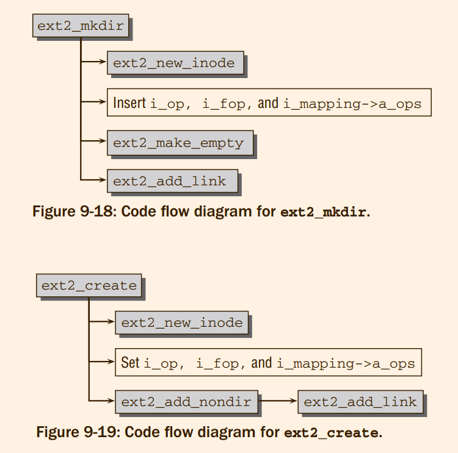
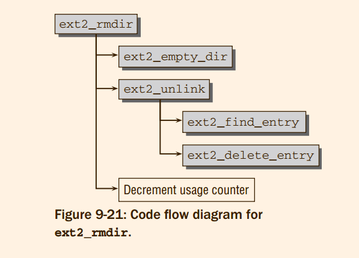

# Professional Linux Kernel Architecture : The Extented Filesystem Family

## 9.1 Introduction
Besides journaling,
both variants are otherwise nearly completely identical

1. One specific problem — **fragmentation** — is encountered in the management of storage space for diskbased filesystems. 
2. A second important requirement is to put storage space to efficient use, and here the filesystem must
make a compromise.
3. Maintaining the consistency of file contents is also a key issue that requires careful thought during the
planning and implementation of filesystems. 

## 9.2 Second Extended Filesystem
The Ext2 filesystem focused on high performance and on the goals summarized below and defined by
the filesystem authors in [CTT]:
1. Support for variable block sizes to enable the filesystem to cope with anticipated usage (many big files or many small files).
2. *Fast symbolic links*, whose link target is stored in the inode itself (and not in the data area) if the name of the target is short enough.
3. Integration of extensions into the design without having to reformat and reload the hard disk to migrate from the old to the new version.
4. Minimization of the effect of system crashes by means of a sophisticated strategy of data manipulation on the storage medium. The filesystem can normally be restored to a state in which auxiliary tools (fsck) are at least able to repair it so that it can be used again. (This does not exclude the possibility that data are lost.)
5. Use of special attributes (not found in classic Unix filesystems) to label files as unchangeable. These allow important configuration files, for example, to be protected from unintentional changes — even by the superuser

#### 9.2.1 Physical Structure
* **Structure Overview**

```
+--------+----------------+----------+-------------+------------+--------------------------+
|        |                |          |             |            |                          |
|  Super |  Group         | Data     | Inode       | Inode      |     Data Blocks          |
|  block |  Descriptor    | Bitmap   | Bitmap      | Table      |                          |
|        |                |          |             |            |                          |
+--------+----------------+----------+-------------+------------+--------------------------+
```

The kernel uses only the superblock of the first block group to read filesystem meta-information,
even if there are superblock objects in several block groups.
```
+----------------+------------------+------------------+------------------------+
|                |                  |                  |                        |
|  Boot Block    | Block            | Block            | ...                    |
|                | Group 0          | Group 0          |                        |
|                |                  |                  |                        |
|                |                  |                  |                        |
+----------------+------------------+------------------+------------------------+
```

1. The superblock is the central structure for storing meta-information on the filesystem itself. It
includes information on the number of free and used blocks, block size, current filesystem status
(needed when booting the system in order to detect a previous crash), and various time stamps
(e.g., time of last filesystem mount, time of last write operation). It also includes a magic number
so that the mount routine can establish whether the filesystem is of the correct type.
The kernel uses only the superblock of the first block group to read filesystem meta-information,
even if there are superblock objects in several block groups.
2. The group descriptors contain information that reflects the status of the individual block groups
of the filesystem, for instance, information on the number of free blocks and inodes of the group.
Each block group includes group descriptors for all block groups of the filesystem.
3. Data block and inode bitmaps are used to hold long bit strings. These structures contain exactly
1 bit for each data block and each inode to indicate whether the block or inode is free or
in use.
4. The inode table contains all block group inodes that hold all metadata associated with the individual files and directories of the filesystem.
5. As the name suggests, the data block section contains the useful data of the files in the filesystem.

* **Indirection**

* **Fragmentation**
> @todo about one page
#### 9.2.2 Data Structures
> 由于ext2 没有被ccls 跟踪，所以使用ext4 作为示范
> 书中间描述 `ext2_read_super`，并不存在.

* **Superblock**
1. `struct ext4_super_block`

* **Group Descriptor**

2. `struct ext4_group_desc` [ref](https://www.nongnu.org/ext2-doc/ext2.html#DEF-BLOCK-GROUPS)

Blocks are clustered into block groups in order to reduce *fragmentation* and minimise the amount of head seeking
when reading a large amount of consecutive data. Information about each block group is kept in a descriptor table stored in the block(s) immediately after the superblock.
Two blocks near the start of each group are reserved for the block usage bitmap and the inode usage bitmap which show which blocks and inodes are in use.
Since each bitmap is limited to a single block, this means that the maximum size of a block group is 8 times the size of a block.

The block(s) following the bitmaps in each block group are designated as the inode table for that block group and the remainder are the data blocks.
The block allocation algorithm attempts to allocate data blocks in the same block group as the inode which contains them. 

* **Inodes**

3. `struct ext4_inode`

**Directories and Files**
4. `struct ext4_dir_entry`


```c
/*
 * Ext4 directory file types.  Only the low 3 bits are used.  The
 * other bits are reserved for now.
 */
#define EXT4_FT_UNKNOWN		0
#define EXT4_FT_REG_FILE	1
#define EXT4_FT_DIR		2
#define EXT4_FT_CHRDEV		3
#define EXT4_FT_BLKDEV		4
#define EXT4_FT_FIFO		5
#define EXT4_FT_SOCK		6
#define EXT4_FT_SYMLINK		7

#define EXT4_FT_MAX		8
```
> 为什么文件系统还需要保存这些特殊文件，这难道不是在VFS层次的东西吗?

The virtual filesystem provides an element named `s_fs_info` or `i_private` in the `struct super_block` and `struct inode` structures. 

**Data Structures in Memory**

```
/*
 * fourth extended-fs super-block data in memory
 */
struct ext4_sb_info {
```

* **Pre-allocation**
@todo about two page, 这一个功能似乎ext4 中间用新的方法实现了.


#### 9.2.3 Creating a Filesystem
> 使用dd mke2fs 以及 img.1440 创建一个文件，并且在文件上创建了文件系统
> @todo 操作一下，并且Man 一下相关的工具

#### 9.2.4 Filesystem Actions
As demonstrated in Chapter 8, the association between the virtual filesystem and specific implementations is established in the main by three structures that include a series of function pointers; this
association must be implemented by all filesystems
1. Operations for manipulating the contents of a file are stored in `file_operations.`
2. Operations for processing the file objects themselves are held in `inode_operations`
3. Operations with generalized address spaces are stored in `address_space_operations`


在ext4/file.c 中间含有 ext4的定义:
```c
const struct file_operations ext4_file_operations = {
	.llseek		= ext4_llseek,
	.read_iter	= generic_file_read_iter,
	.write_iter	= ext4_file_write_iter,
	.unlocked_ioctl = ext4_ioctl,
#ifdef CONFIG_COMPAT
	.compat_ioctl	= ext4_compat_ioctl,
#endif
	.mmap		= ext4_file_mmap,
	.open		= ext4_file_open,
	.release	= ext4_release_file,
	.fsync		= ext4_sync_file,
	.splice_read	= generic_file_splice_read,
	.splice_write	= iter_file_splice_write,
	.fallocate	= ext4_fallocate,
};

const struct inode_operations ext4_file_inode_operations = {
	.setattr	= ext4_setattr,
	.getattr	= ext4_getattr,
	.setxattr	= generic_setxattr,
	.getxattr	= generic_getxattr,
	.listxattr	= ext4_listxattr,
	.removexattr	= generic_removexattr,
	.get_acl	= ext4_get_acl,
	.set_acl	= ext4_set_acl,
	.fiemap		= ext4_fiemap,
};

/*
 * directories can handle most operations...
 */
const struct inode_operations ext4_dir_inode_operations = {
	.create		= ext4_create,
	.lookup		= ext4_lookup,
	.link		= ext4_link,
	.unlink		= ext4_unlink,
	.symlink	= ext4_symlink,
	.mkdir		= ext4_mkdir,
	.rmdir		= ext4_rmdir,
	.mknod		= ext4_mknod,
	.tmpfile	= ext4_tmpfile,
	.rename		= ext4_rename2,
	.setattr	= ext4_setattr,
	.getattr	= ext4_getattr,
	.listxattr	= ext4_listxattr,
	.get_acl	= ext4_get_acl,
	.set_acl	= ext4_set_acl,
	.fiemap         = ext4_fiemap,
};


const struct file_operations ext4_dir_operations = {
	.llseek		= ext4_dir_llseek,
	.read		= generic_read_dir,
	.iterate_shared	= ext4_readdir,
	.unlocked_ioctl = ext4_ioctl,
#ifdef CONFIG_COMPAT
	.compat_ioctl	= ext4_compat_ioctl,
#endif
	.fsync		= ext4_sync_file,
	.open		= ext4_dir_open,
	.release	= ext4_release_dir,
};


static const struct address_space_operations ext4_aops = {
	.readpage		= ext4_readpage,
	.readpages		= ext4_readpages,
	.writepage		= ext4_writepage,
	.writepages		= ext4_writepages,
	.write_begin		= ext4_write_begin,
	.write_end		= ext4_write_end,
	.set_page_dirty		= ext4_set_page_dirty,
	.bmap			= ext4_bmap,
	.invalidatepage		= ext4_invalidatepage,
	.releasepage		= ext4_releasepage,
	.direct_IO		= ext4_direct_IO,
	.migratepage		= buffer_migrate_page,
	.is_partially_uptodate  = block_is_partially_uptodate,
	.error_remove_page	= generic_error_remove_page,
};


static const struct super_operations ext4_sops = {
	.alloc_inode	= ext4_alloc_inode,
	.destroy_inode	= ext4_destroy_inode,
	.write_inode	= ext4_write_inode,
	.dirty_inode	= ext4_dirty_inode,
	.drop_inode	= ext4_drop_inode,
	.evict_inode	= ext4_evict_inode,
	.put_super	= ext4_put_super,
	.sync_fs	= ext4_sync_fs,
	.freeze_fs	= ext4_freeze,
	.unfreeze_fs	= ext4_unfreeze,
	.statfs		= ext4_statfs,
	.remount_fs	= ext4_remount,
	.show_options	= ext4_show_options,
#ifdef CONFIG_QUOTA
	.quota_read	= ext4_quota_read,
	.quota_write	= ext4_quota_write,
	.get_dquots	= ext4_get_dquots,
#endif
	.bdev_try_to_free_page = bdev_try_to_free_page,
};
```
> 上面就是大概就是支持一个文件系统需要的基本内容吧!


```c
struct inode *ext4_iget(struct super_block *sb, unsigned long ino){
```
> 在此处动态的给inode 确定是file还是dir的确定正确的operation

* **Mounting and Unmounting**

> 正如其他的很多位置，其实fill_super 的功能被mount 重新封装了

```c
static struct file_system_type ext4_fs_type = {
	.owner		= THIS_MODULE,
	.name		= "ext4",
	.mount		= ext4_mount,
	.kill_sb	= kill_block_super,
	.fs_flags	= FS_REQUIRES_DEV,
};
MODULE_ALIAS_FS("ext4");
```

> `kill_block_super` 调用fs的通用函数，功能尚且不清楚。
> 书中间的名称只是发生了更改, 在ucore 中的`sfs_mount`完全相同。

```c
static struct dentry *ext4_mount(struct file_system_type *fs_type, int flags,
		       const char *dev_name, void *data)
{
	return mount_bdev(fs_type, flags, dev_name, data, ext4_fill_super);
}
```

> 开始分析mount_bdev {
```c
struct dentry *mount_bdev(struct file_system_type *fs_type,
	int flags, const char *dev_name, void *data,
	int (*fill_super)(struct super_block *, void *, int))
```
> 主要完成的任务:将super_block从指定的设备中间加载出来，并且和设备关联起来，同时检查文件系统.

`fill_super` 在ext4 中间的具体实现为对于磁盘中间的super_block的检查。

通过`sget` 从设备上获取`super_block`


```c
struct block_device *blkdev_get_by_path(const char *path, fmode_t mode, void *holder)
```
> `holder`的作用是什么

> **TODO** 设备和路径是通过什么函数，在什么时候关联起来(显然，是mount的时候，将设备和路径关联起来)

`blkdev_get_by_path`调用: `lookup_bdev` 和 `blkdev_get`
```c
struct block_device *lookup_bdev(const char *pathname)
int blkdev_get(struct block_device *bdev, fmode_t mode, void *holder)
```
`lookup_bdev`调用`kern_path`, 而`kern_path`就是调用之前的所分析的路径查询
`blkdev_get`是实现block device 的打开

```c
/**
 *	sget	-	find or create a superblock */
struct super_block *sget(struct file_system_type *type,
			int (*test)(struct super_block *,void *),
			int (*set)(struct super_block *,void *),
			int flags,
			void *data) {
```
> 结束分析mount_bdev }


> @todo 书中分析ext4_fill_super 的功能是非常正确的, 但是没有仔细分析


* **Reading and Generating Data and Indirection Blocks**
> @todo 应该算是主要的内容了吧!


From the VFS perspective, the purpose of a filesystem is to establish the link between
file contents and the corresponding blocks on the associated storage medium.

* Finding Data blocks
```c
int ext4_get_block(struct inode *inode, sector_t iblock,
		   struct buffer_head *bh, int create)
{
	return _ext4_get_block(inode, iblock, bh,
			       create ? EXT4_GET_BLOCKS_CREATE : 0);
}
```

* Requesting New Blocks

* Block Allocation

* Creating New Reservations


* **Creating and Deleting Inodes**

> @todo should be easy，如图所示




* **Registering Inodes**
When directories and files are created, the `ext2_new_inode` function is used to find a free inode for the
new filesystem entry. 

The search itself is not performance-critical, but it is very important for filesystem performance that the
inode be optimally positioned to permit rapid access to data. For this reason, this section is devoted to an
examination of the inode distribution strategy adopted by the kernel.
> 注册inode ,还要查找inode, 难道这讨论的是 disk 上的inode ?

The kernel applies three different strategies:
1. Orlov allocation for directory inodes.
2. Classic allocation for directory inodes. This is only used if the `oldalloc` option is passed to
the kernel, which disables Orlov allocation. Normally, Orlov allocation is the default strategy.
3. Inode allocation for regular files

* Orlov Allocation

A standard scheme proposed and implemented for the OpenBSD kernel by Grigoriv Orlov is used to
find a directory inode. The Linux version was developed later. The goal of the allocator is to ensure that
directory inodes of child directories are in the same block group as the parent directory so that they are
physically closer to each other and costly hard disk seek operations are minimized. Of course, not all
directory inodes should end up in the same block group because they would then be too far away from
their associated data.
> 为了将dir inode 放到相同的 partition group 中间去


```c
/*
 * Orlov's allocator for directories.
 *
 * We always try to spread first-level directories.
 *
 * If there are blockgroups with both free inodes and free blocks counts
 * not worse than average we return one with smallest directory count.
 * Otherwise we simply return a random group.
 *
 * For the rest rules look so:
 *
 * It's OK to put directory into a group unless
 * it has too many directories already (max_dirs) or
 * it has too few free inodes left (min_inodes) or
 * it has too few free blocks left (min_blocks) or
 * Parent's group is preferred, if it doesn't satisfy these
 * conditions we search cyclically through the rest. If none
 * of the groups look good we just look for a group with more
 * free inodes than average (starting at parent's group).
 */

static int find_group_orlov(struct super_block *sb, struct inode *parent,
			    ext4_group_t *group, umode_t mode,
			    const struct qstr *qstr)
{
```
> @todo 书上对于此函数的解释

* Classic Directory Allocation

How does the classic scheme work? The block groups of the system are scanned in a forward search, and
particular attention is paid to two conditions:
1. Free space should still be available in the block group.
2. The number of directory inodes should be as small as possible compared to other inodes in
the block group.

In this scheme, directory inodes are typically spread as uniformly as possible across the entire filesystem.
If none of the block groups satisfies requirements, the kernel restricts selection to groups with above
average amounts of free space and from these chooses those with the fewest directory inodes.

* Inode Allocation for Other Files

A simpler scheme known as quadratic hashing is applied when searching for an inode for regular files,
links, and all file types other than directories. 
It is based on a forward search starting at the block group
of the directory inode of the directory in which the new file is to be created. The first block group found
with a free inode is reserved.

Usually, this method quickly finds a free inode. However, if no free inode is returned on an (almost
hopelessly) overfilled filesystem, the kernel scans all block groups in succession to ensure that every
effort is made to find a free inode. Again, the first block group with a free inode is selected. If absolutely
no inodes are free, the action is aborted with a corresponding error code
> @question 如此设计的原因是什么 ?　为什么文件夹和文件采用不同机制


* **Deleting Inodes**

Two main actions are needed to delete a directory:
1. First, the entry in the directory inode of the parent directory is deleted.
2. Then the data blocks assigned on the hard disk (an inode and the associated data blocks with
the directory entries) are released.

To ensure that the directory to be deleted no longer contains any files, the contents of its data block are
checked using the `ext2_empty_dir` function. If the kernel finds only the entries for . and .., the directory
is released for deletion. Otherwise, the action is aborted, and an error code (-ENOTEMPTY) is returned.

> 删除过程很简单,如图所示




* **Removing Data Blocks**

Removal of data blocks is closely associated with the reference counting of inode objects
because two conditions must be satisfied before the data blocks can actually be deleted:
1. The link counter `nlink` must be zero to ensure that there are no references to the data in the
filesystem.
2. The usage counter (`i_count`) of the inode structure must be flushed from memory.

The kernel uses the iput function to decrement the reference counter for the memory object.
(iput also returns memory data structures and memory pages reserved
for data).

This is a standard function of the virtual filesystem not discussed in detail here because the only
aspect of interest is that the kernel invokes the ext2_delete_inode function to release the data associated
with the inode on the hard disk This function builds primarily on two other functions — ext2_truncate, which releases the
data blocks associated with the inode (regardless of whether the inode represents a directory or a regular
file); and ext2_free_inode, which releases the memory space occupied by the inode itself.
> nlink 和 i_count 分别交给iput 和 ext2_delete_inode


Since both functions reverse the technique used to create files, their implementation need not be discussed
here.

* **Address Space Operations**

```c
static int ext2_readpage(struct file *file, struct page *page)
{
	return mpage_readpage(page, ext2_get_block);
}

static int ext4_readpage(struct file *file, struct page *page)
{
	int ret = -EAGAIN;
	struct inode *inode = page->mapping->host;

	trace_ext4_readpage(page);

	if (ext4_has_inline_data(inode))
		ret = ext4_readpage_inline(inode, page);

	if (ret == -EAGAIN)
		return ext4_mpage_readpages(page->mapping, NULL, page, 1,
						false);

	return ret;
}
```
> @todo 对于ext2 中间的分析的确和书上相同: 都是借用先前分析函数的组合(mpage_readpage 在chapter16), 但是ext4_readpage 的内容就完全发生了变化。
