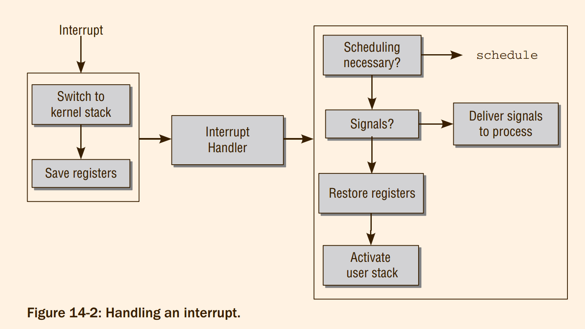
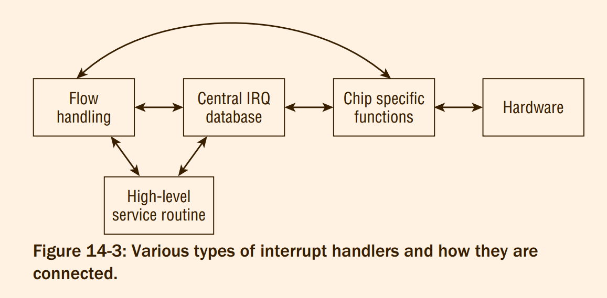
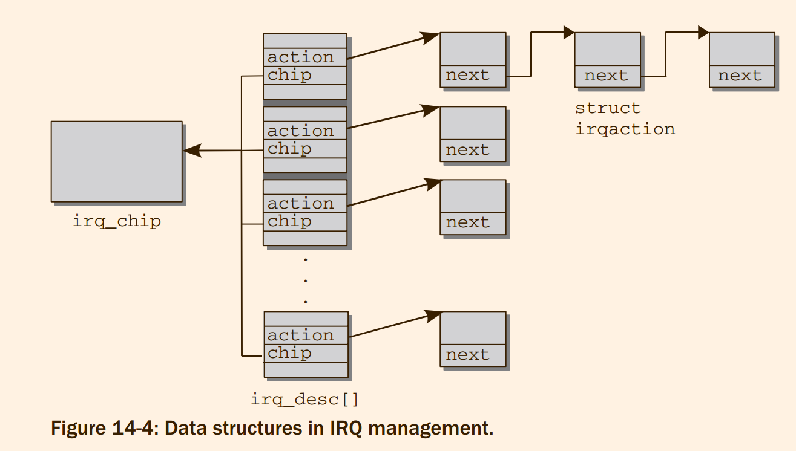

# Professional Linux Kernel Architecture : Kernel Activities

Two types of **interrupt** are distinguished:
1. `Hardware Interrupts` —
    * Are produced automatically by the system and connected peripherals. They support more efficient implementation of device drivers,
    * but are also needed by the processor itself to draw attention to exceptions or errors that require interaction with the kernel code.
2. `SoftIRQs` — Are used to effectively implement deferred activities in the kernel itself


Frequently, the kernel needs mechanisms to **defer** activities until a certain time in the future or to place them in a queue for later processing when time is available
> 1. 再一次重新定义interrupt
> 2. 本章主要关注的重点: 如何defer。问题是defer 和 IRQ 有什么关系，为什么被成为soft IRQ了
> 3. 本章完全没有分析exception 除以0 异常


## 14.1 Interrupts

#### 14.1.1 Interrupt Types
Generally, interrupt types can be grouped into two categories:
1. Synchronous Interrupts and Exceptions
2. Asynchronous interrupts

**What are the common features of the two types of interrupt? If the CPU is not already in kernel mode, it initiates a switch from user to kernel mode.**
> 什么? 首先切换到内核态，证据，为什么 ?

There it executes a special routine called an interrupt service routine (`ISR` for short) or an interrupt handler.
> 1. [ISR 和 interrupt handler 是同一个东西](https://stackoverflow.com/questions/29401426/is-there-a-difference-between-an-isr-and-an-interrupt-handler)
> 2. 但是interrupt 和 exception 的流程应该不同才对


#### 14.1.2 Hardware IRQs

Interrupts cannot be raised directly by processor-external peripherals but must be requested with the help of a
standard component known as an `interrupt controller` that is present in every system.
> 这我就不懂了，为什么需要中断控制器?

Because, in terms of software, the difference between IRQs and interrupts is not all that great, the two
terms are often used interchangeably. This is not a problem as long as it is clear what is meant.

Most CPUs make only a small extract from the whole range of
available interrupt numbers available for processing hardware interrupts. This range is usually in the
middle of the number sequence; for example, IA-32 CPUs provide a total of 16 numbers from 32 to 47.

As any reader who has configured an I/O card on an IA-32 system or has studied the contents of
`/proc/interrupts` knows, IRQ numbering of expansion cards starts at 0 and finishes at 15, provided the
classical interrupt controller 8256A is used. This means that there are also 16 different options but with
different numerical values. As well as being responsible for the electrical handling of the IRQ signals,
the interrupt controller also performs a ‘‘conversion‘‘ between IRQ number and interrupt number; with
the IA-32 system, this is the equivalent of simply adding 32. If a device issues IRQ 9, the CPU produces
interrupt 41; this must be taken into account when installing interrupt handlers. Other architectures use
other mappings between interrupt and IRQ numbers, but I will not deal with these in detail.
> emmmm, 为什么IRQ 和 interrupt 就是简单的对应关系

```
➜  Vn git:(master) ✗ cat /proc/interrupts
 132:          0          0          0          0          0          0          0      27866  IR-PCI-MSI 1572871-edge      nvme0q7
 NPI:          0          0          0          0          0          0          0          0   Nested posted-interrupt event
 PIW:          0          0          0          0          0          0          0          0   Posted-interrupt wakeup event
 ```
 > 所以在哪里查询一下这一个输出的文档的含义是什么?
 > 在`/proc/irq/` 下似乎和这些内容含有对应的部分.


#### 14.1.3 Processing Interrupts

**Entry and Exit Tasks**
> Interrupt 的关键不就是 中断进入和退出的过程吗!


As Figure 14-2 shows, interrupt handling is divided into three parts.

The parts that precede and follow invocation of the interrupt handler are known as the `entry` and `exit` path

The platform-specific data structure `pt_regs` that lists all
registers modified in kernel mode is defined to take account of the differences between the various CPUs
```
struct pt_regs {
/*
 * C ABI says these regs are callee-preserved. They aren't saved on kernel entry
 * unless syscall needs a complete, fully filled "struct pt_regs".
 */
	unsigned long r15;
	unsigned long r14;
	unsigned long r13;
	unsigned long r12;
	unsigned long bp;
	unsigned long bx;
/* These regs are callee-clobbered. Always saved on kernel entry. */
	unsigned long r11;
	unsigned long r10;
	unsigned long r9;
	unsigned long r8;
	unsigned long ax;
	unsigned long cx;
	unsigned long dx;
	unsigned long si;
	unsigned long di;
/*
 * On syscall entry, this is syscall#. On CPU exception, this is error code.
 * On hw interrupt, it's IRQ number:
 */
	unsigned long orig_ax;
/* Return frame for iretq */
	unsigned long ip;
	unsigned long cs;
	unsigned long flags;
	unsigned long sp;
	unsigned long ss;
/* top of stack page */
};
```
In the exit path the kernel checks whether
1. the scheduler should select a new process to replace the old process.
2. there are signals that must be delivered to the process
> 1. 难道不是从哪里来，回到哪里去吗 ? 为什么需要scheduler ?
> * 应该是被中断者首先睡眠，被加入到 scheduler 的队列中间，中断的事情处理结束之后，然后调用 scheduler 就可以了
> 2. entry 和 exit 具体的流程函数调用是什么


Only when these two questions have been answered can the kernel devote itself to completing its regular
tasks after returning from an interrupt; that is, restoring the register set, switching to the user mode
stack, switching to an appropriate processor mode for user applications, or switching to a different
protection ring.

`arch/x86/kernel/entry/entry_64.S`

The term interrupt handler is used ambiguously. It is used to designate invocation of an ISR call by
the CPU, and combines the `entry/exit` path and the ISR itself. Of course, it would be more correct
to refer only to the routine that is executed between the entry path and the exit path and that is
implemented in C.

**Interrupt Handlers**
ISRs must *therefore* satisfy two requirements:
1. Implementation (above all, when other interrupts are disabled) must consist of as little code
as possible to support rapid processing.
2. Interrupt handler routines that can be invoked during the processing of other ISRs must not
interfere with each other.
> therefore , 原因在哪里 ?


Generally, each handler routine can be divided into three parts of differing significance:
1. `Critical` actions must be executed immediately following an interrupt. Otherwise, system
stability or correct operation of the computer cannot be maintained. Other interrupts must
be disabled when such actions are performed.
2. `Noncritical` actions should also be performed as quickly as possible but with enabled interrupts (they may therefore be interrupted by other system events).
3. `Deferrable` actions are not particularly important and need not be implemented in the interrupt handler. The kernel can delay these actions and perform them when it has nothing better to do


#### 14.1.4 Data Structures
There are two facets to the technical implementation of interrupts — assembly language code, which
is highly processor-dependent and is used to process the relevant lower-level details on the particular
platform; and an abstracted interface, which is required by device drivers and other kernel code to install
and manage IRQ handlers.

The central point at which information on IRQs is managed is a **global array** with an entry for each IRQ
number. Because array position and interrupt number are identical, it is easy to locate the entry associated
with a specific IRQ: IRQ 0 is at position 0, IRQ 15 at position 15, and so on; to which processor interrupt
the IRQs are ultimately mapped is of no relevance here.


`include/linux/irqdesc.h`

```
/**
 * struct irq_desc - interrupt descriptor
 * @irq_common_data:	per irq and chip data passed down to chip functions
 * @kstat_irqs:		irq stats per cpu
 * @handle_irq:		highlevel irq-events handler
 * @preflow_handler:	handler called before the flow handler (currently used by sparc)
 * @action:		the irq action chain
 * @status:		status information
 * @core_internal_state__do_not_mess_with_it: core internal status information
 * @depth:		disable-depth, for nested irq_disable() calls
 * @wake_depth:		enable depth, for multiple irq_set_irq_wake() callers
 * @irq_count:		stats field to detect stalled irqs
 * @last_unhandled:	aging timer for unhandled count
 * @irqs_unhandled:	stats field for spurious unhandled interrupts
 * @threads_handled:	stats field for deferred spurious detection of threaded handlers
 * @threads_handled_last: comparator field for deferred spurious detection of theraded handlers
 * @lock:		locking for SMP
 * @affinity_hint:	hint to user space for preferred irq affinity
 * @affinity_notify:	context for notification of affinity changes
 * @pending_mask:	pending rebalanced interrupts
 * @threads_oneshot:	bitfield to handle shared oneshot threads
 * @threads_active:	number of irqaction threads currently running
 * @wait_for_threads:	wait queue for sync_irq to wait for threaded handlers
 * @nr_actions:		number of installed actions on this descriptor
 * @no_suspend_depth:	number of irqactions on a irq descriptor with
 *			IRQF_NO_SUSPEND set
 * @force_resume_depth:	number of irqactions on a irq descriptor with
 *			IRQF_FORCE_RESUME set
 * @dir:		/proc/irq/ procfs entry
 * @name:		flow handler name for /proc/interrupts output
 */
 struct irq_desc{
	struct irq_common_data	irq_common_data;
	struct irq_data		irq_data;
	unsigned int __percpu	*kstat_irqs;
	irq_flow_handler_t	handle_irq;
#ifdef CONFIG_IRQ_PREFLOW_FASTEOI
	irq_preflow_handler_t	preflow_handler;
#endif
	struct irqaction	*action;	/* IRQ action list */
	unsigned int		status_use_accessors;
	unsigned int		core_internal_state__do_not_mess_with_it;
	unsigned int		depth;		/* nested irq disables */
	unsigned int		wake_depth;	/* nested wake enables */
	unsigned int		irq_count;	/* For detecting broken IRQs */
	unsigned long		last_unhandled;	/* Aging timer for unhandled count */
	unsigned int		irqs_unhandled;
	atomic_t		threads_handled;
	int			threads_handled_last;
	raw_spinlock_t		lock;
	struct cpumask		*percpu_enabled;
#ifdef CONFIG_SMP
	const struct cpumask	*affinity_hint;
	struct irq_affinity_notify *affinity_notify;
#ifdef CONFIG_GENERIC_PENDING_IRQ
	cpumask_var_t		pending_mask;
#endif
#endif
	unsigned long		threads_oneshot;
	atomic_t		threads_active;
	wait_queue_head_t       wait_for_threads;
#ifdef CONFIG_PM_SLEEP
	unsigned int		nr_actions;
	unsigned int		no_suspend_depth;
	unsigned int		cond_suspend_depth;
	unsigned int		force_resume_depth;
#endif
#ifdef CONFIG_PROC_FS
	struct proc_dir_entry	*dir;
#endif
	int			parent_irq;
	struct module		*owner;
	const char		*name;
} ____cacheline_internodealigned_in_smp;
```
> 所以irq_desc在ucore 中间是对应什么结构体 ?

The three
abstraction layers introduced above are represented in the structure as follows:
1. The flow-level ISR is provided by `handle_irq`.
```c
typedef	void (*irq_flow_handler_t)(struct irq_desc *desc);
```
2. `handler_data` may point to some arbitrary, IRQ, and handler function-specific data.
```c
/**
 * struct irq_data - per irq chip data passed down to chip functions
 * @mask:		precomputed bitmask for accessing the chip registers
 * @irq:		interrupt number
 * @hwirq:		hardware interrupt number, local to the interrupt domain
 * @common:		point to data shared by all irqchips
 * @chip:		low level interrupt hardware access
 * @domain:		Interrupt translation domain; responsible for mapping
 *			between hwirq number and linux irq number.
 * @parent_data:	pointer to parent struct irq_data to support hierarchy
 *			irq_domain
 * @chip_data:		platform-specific per-chip private data for the chip
 *			methods, to allow shared chip implementations
 */
struct irq_data {
	u32			mask;
	unsigned int		irq;
	unsigned long		hwirq;
	struct irq_common_data	*common;
	struct irq_chip		*chip;
	struct irq_domain	*domain;
#ifdef	CONFIG_IRQ_DOMAIN_HIERARCHY
	struct irq_data		*parent_data;
#endif
	void			*chip_data;
};
```

3. `action` provides a chain of actions that need to be executed when the interrupt occurs.
4. An IRQ can change its status not only during handler installation but also at run time: `status` describes
the current status.


```
struct irq_desc irq_desc[NR_IRQS] __cacheline_aligned_in_smp = {
	[0 ... NR_IRQS-1] = {
		.handle_irq	= handle_bad_irq,
		.depth		= 1,
		.lock		= __RAW_SPIN_LOCK_UNLOCKED(irq_desc->lock),
	}
};
```


Thus, a new, generic IRQ subsystem was introduced during further development of kernel 2.6.
It is able to handle different interrupt controllers and different types of interrupts in a unified
way. Basically, it consists of three abstraction layers as visualized in Figure 14-3:


1. `High-Level Interrupt Service Routines (ISRs)` — Perform all necessary work caused by the
interrupt on the device driver’s (or some other kernel component’s) side. If, for instance, a
device uses an interrupt to signal that some data have arrived, then the job of the high-level
ISR could be to copy the data to an appropriate place.
2. `Interrupt Flow Handling` — Takes care of handling the various differences between different *interrupt flow types* like edge- and level triggering.
3. `Chip-Level Hardware Encapsulation` — Needs to communicate directly with the underlying hardware that is responsible to generate interrupts at the electronic level. This layer can
be seen as some sort of "device driver" for interrupt controllers.
> 1. 为什么需要让kernel 处理edge-triggering level-triggering 的问题，难道不是硬件提供的封装吗 ?
> 2. flow handling 到底是什么东西 ? 没有搜到，也许是自己发明的词汇吧!

Edge-triggering means that hardware detects an interrupt by sensing a **difference** in potential
on the line. In level-triggered systems, interrupts are detected when the potential has a **specific value** — the change in potential is not relevant.
From the kernel viewpoint, level-triggering is more complicated because, after each interrupt, the line must be explicitly set to the potential that indicates ‘‘no interrupt.’’

**IRQ Controller Abstraction**
> chip 在此处特指 终端控制器 代码

```
/**
 * struct irq_chip - hardware interrupt chip descriptor
 *
 * @name:		name for /proc/interrupts
 * @irq_startup:	start up the interrupt (defaults to ->enable if NULL)
 * @irq_shutdown:	shut down the interrupt (defaults to ->disable if NULL)
 * @irq_enable:		enable the interrupt (defaults to chip->unmask if NULL)
 * @irq_disable:	disable the interrupt
 * @irq_ack:		start of a new interrupt
 * @irq_mask:		mask an interrupt source
 * @irq_mask_ack:	ack and mask an interrupt source
 * @irq_unmask:		unmask an interrupt source
 * @irq_eoi:		end of interrupt
 * @irq_set_affinity:	set the CPU affinity on SMP machines
 * @irq_retrigger:	resend an IRQ to the CPU
 * @irq_set_type:	set the flow type (IRQ_TYPE_LEVEL/etc.) of an IRQ
 * @irq_set_wake:	enable/disable power-management wake-on of an IRQ
 * @irq_bus_lock:	function to lock access to slow bus (i2c) chips
 * @irq_bus_sync_unlock:function to sync and unlock slow bus (i2c) chips
 * @irq_cpu_online:	configure an interrupt source for a secondary CPU
 * @irq_cpu_offline:	un-configure an interrupt source for a secondary CPU
 * @irq_suspend:	function called from core code on suspend once per
 *			chip, when one or more interrupts are installed
 * @irq_resume:		function called from core code on resume once per chip,
 *			when one ore more interrupts are installed
 * @irq_pm_shutdown:	function called from core code on shutdown once per chip
 * @irq_calc_mask:	Optional function to set irq_data.mask for special cases
 * @irq_print_chip:	optional to print special chip info in show_interrupts
 * @irq_request_resources:	optional to request resources before calling
 *				any other callback related to this irq
 * @irq_release_resources:	optional to release resources acquired with
 *				irq_request_resources
 * @irq_compose_msi_msg:	optional to compose message content for MSI
 * @irq_write_msi_msg:	optional to write message content for MSI
 * @irq_get_irqchip_state:	return the internal state of an interrupt
 * @irq_set_irqchip_state:	set the internal state of a interrupt
 * @irq_set_vcpu_affinity:	optional to target a vCPU in a virtual machine
 * @flags:		chip specific flags
 */
struct irq_chip {
```
> Woooc, 几乎全部都是函数


The function pointers have the following meaning:
1. `startup` refers to a function for the first-time initialization of an IRQ. In most cases, initialization
is limited to enabling the IRQ. As a result, the startup function is just a means of forwarding to
enable.
2. `enable` activates an IRQ; in other words, it performs a transition from the disabled to the enabled
state. To this end, hardware-specific numbers must be written to hardware-specific points in I/O
memory or in the I/O ports.
3. `disable` is the counterpart to enable and is used to deactivate an IRQ. shutdown completely
closes down an interrupt source. If this is not explicitly possible, the function is an alias for
disable.
4. `ack` is closely linked with the hardware of the interrupt controller. In some models, the arrival
of an IRQ request (and therefore of the corresponding interrupt at the processor) must be explicitly acknowledged so that subsequent requests can be serviced. If a chipset does not issue this
request, the pointer can be supplied with a dummy function or a null pointer. ack_and_mask
acknowledges an interrupt, but masks it in addition afterward.
5. `end` is called to mark the end of interrupt processing at the flow level. If an interrupt was disabled during interrupt processing, it is the responsibility of this handler to re-enable it again.
6. Modern interrupt controllers do not need much flow control from the kernel, but manage nearly
everything themselves out of the box. A single callback to the hardware is required when interrupts are processed, and this callback is provided in `eoi` — end of interrupt.
7.  In multiprocessor systems, `set_affinity` can be used to declare the affinity of a CPU for specified IRQs. This allows IRQs to be distributed to certain CPUs (typically, IRQs on SMP systems
are spread evenly across all processors). This method has no relevance on single-processor systems and is therefore supplied with a null pointer.


One particular example for an interrupt controller chip implementation is the IO-APIC on AMD64 systems. It is given by the following definition:
```
static struct irq_chip ioapic_chip __read_mostly = {
	.name			= "IO-APIC",
	.irq_startup		= startup_ioapic_irq,
	.irq_mask		= mask_ioapic_irq,
	.irq_unmask		= unmask_ioapic_irq,
	.irq_ack		= irq_chip_ack_parent,
	.irq_eoi		= ioapic_ack_level,
	.irq_set_affinity	= ioapic_set_affinity,
	.irq_retrigger		= irq_chip_retrigger_hierarchy,
	.flags			= IRQCHIP_SKIP_SET_WAKE,
};
```
> [APIC](https://wiki.osdev.org/APIC) 只是其中一个显示方式
> 可以在mi pro上/proc/interrupts 显示其中


**Handler Function Representation**
An instance of the irqaction structure defined as follows exists for each handler function:
```
/**
 * struct irqaction - per interrupt action descriptor
 * @handler:	interrupt handler function
 * @name:	name of the device
 * @dev_id:	cookie to identify the device
 * @percpu_dev_id:	cookie to identify the device
 * @next:	pointer to the next irqaction for shared interrupts
 * @irq:	interrupt number
 * @flags:	flags (see IRQF_* above)
 * @thread_fn:	interrupt handler function for threaded interrupts
 * @thread:	thread pointer for threaded interrupts
 * @secondary:	pointer to secondary irqaction (force threading)
 * @thread_flags:	flags related to @thread
 * @thread_mask:	bitmask for keeping track of @thread activity
 * @dir:	pointer to the proc/irq/NN/name entry
 */
struct irqaction {
	irq_handler_t		handler;
	void			*dev_id;
	void __percpu		*percpu_dev_id;
	struct irqaction	*next;
	irq_handler_t		thread_fn;
	struct task_struct	*thread;
	struct irqaction	*secondary;
	unsigned int		irq;
	unsigned int		flags;
	unsigned long		thread_flags;
	unsigned long		thread_mask;
	const char		*name;
	struct proc_dir_entry	*dir;
} ____cacheline_internodealigned_in_smp;
```


The most important element in the structure is the `handler` function itself, which takes the form of the
handler pointer and is located at the beginning of the structure. The handler function is invoked by
the kernel when a device has *requested a system interrupt and the interrupt controller has forwarded
this to the processor by raising an interrupt*. We will look more closely at the meaning of the arguments
when we consider *how to register* handler function.

`name` and `dev_id` uniquely identify an interrupt handler. While name is a short string used to identify the
device (e.g., ‘‘e100,’’ ‘‘ncr53c8xx,’’ etc.), dev_id is a pointer to any data structure that uniquely identifies
the device among all kernel data structures — for example, the net_device instance of a network card.

`flags` is a flag variable that describes some features of the IRQ (and associated interrupt) with the help
of a bitmap whose individual elements can, as usual, be accessed via predefined constants. The following
constants are defined in `<interrupt.h>`:
1. `IRQF_SHARED` is set for shared IRQs and signals that more than one device is using an IRQ line.
1. `IRQF_SAMPLE_RANDOM` is set when the IRQ contributes to the kernel entropy pool
1. `IRQF_DISABLED` indicates that the IRQ handler must be executed with interrupts disabled.
1. `IRQF_TIMER` denotes a timer interrupt

`next` is used to implement shared IRQ handlers.
As discussed in Section 14.1.7, the kernel scans
the list when a shared interrupt is issued to find out for which device the interrupt is actually intended.
Particularly on laptops that integrate many different devices (network, USB, FireWire, sound card, etc.)
on a single chip (with just one interrupt), handler chains of this kind can consist of about five elements.
However, the desirable situation is that only a single device is registered for each IRQ.
> 相同的IRQ 上面持有多个IRQ action


Figure 14-4 shows an overview of the data structures described to illustrate how they interact. Because
one type of interrupt controller normally dominates on a system (there is nothing preventing the coexistence of multiple handlers, though), the handler elements of all `irq_desc` entries point to the same
instance of `irq_chip`.
```
static inline struct irq_chip *irq_desc_get_chip(struct irq_desc *desc)
{
	return desc->irq_data.chip;
}
```
> 1. 加上这一个函数，然后就可以可以解释`irq_chip` `irq_desc` `irqaction` 三者的关系
> 2. 可以推测`irq_chip`的就是表示某一个具体irq解析芯片的内容了


#### 14.1.5 Interrupt Flow Handling
**Setting Controller Hardware**
> 此处提到的四个函数都没有找到，而且不知道实现对应功能的函数在什么位置。


**Flow Handling**
Before discussing how flow handlers are implemented, we need to introduce the type used for them.
`irq_flow_handler_t` specifies the signature of IRQ flow handler functions:
```
typedef	void (*irq_flow_handler_t)(struct irq_desc *desc);
typedef	void (*irq_preflow_handler_t)(struct irq_data *data);
```
> 注意和`irq_action`相区分:


Flow handlers get both the IRQ number and a pointer to the `irq_handler` instance that is responsible for
the interrupt. This information can then be used to implement proper flow handling.

Recall that different hardware requires different approaches to flow handling — edge- and leveltriggering need to be dealt with differently, for instance. The kernel provides several default flow
handlers for various types. They have one thing in common: *Every flow handler is responsible to
call the high-level ISRs once its work is finished*. `handle_IRQ_event` is responsible to activate the
high-level handlers;
> 1. 妈个鸡，`handle_IRQ_event`又没有了。
> 2. 而且`irq_flow_handler_t`的定义类型和书上的不一样，第一个参数消失了


**Edge-Triggered Interrupts**
```
/**
 *	handle_edge_irq - edge type IRQ handler
 *	@desc:	the interrupt description structure for this irq
 *
 *	Interrupt occures on the falling and/or rising edge of a hardware
 *	signal. The occurrence is latched into the irq controller hardware
 *	and must be acked in order to be reenabled. After the ack another
 *	interrupt can happen on the same source even before the first one
 *	is handled by the associated event handler. If this happens it
 *	might be necessary to disable (mask) the interrupt depending on the
 *	controller hardware. This requires to reenable the interrupt inside
 *	of the loop which handles the interrupts which have arrived while
 *	the handler was running. If all pending interrupts are handled, the
 *	loop is left.
 */
void handle_edge_irq(struct irq_desc *desc)
{
```
flow handler will be called once more while it is still running on the CPU
that triggered the first IRQ.


**Level-Triggered Interrupts**


**Other Types of Interrupts**
Besides edge- and level-triggered IRQs, some more less common flow types are also possible. The kernel
also provides default handlers for them.
1. Modern IRQ hardware requires only very little flow handling. Only one chip-specific function
needs to be called after IRQ processing is finished: `chip->eoi`. The default handler for this type
is `handle_fasteoi_irq`. It is basically identical with `handle_level_irq`, except that interaction
with the controller chip is only required at the very end.
2. Really simple interrupts that require no flow control at all are managed by `handle_simple_irq`.
The function can also be used if a caller wants to handle the flow itself.
3. Per-CPU IRQs, that is, IRQs that can only happen on one specific CPU of a multiprocessor system, are handled by `handle_percpu_irq`. The function acknowledges the IRQ after reception
and calls the EOI routine after processing. The implementation is very simple because no locking
is required — the code can by definition only run on a single CPU.
> 必须首先理解 level 和 edge 的层次，作用和被调用者


#### 14.1.6 Initializing and Reserving IRQs
Dynamic registration of an ISR by a device driver can be performed very simply using the data structures described.
> 驱动需要注册


```c
static inline int __must_check
request_irq(unsigned int irq, irq_handler_t handler, unsigned long flags,
	    const char *name, void *dev)
{
	return request_threaded_irq(irq, handler, NULL, flags, name, dev);
}

/**
 *	request_threaded_irq - allocate an interrupt line
 *	@irq: Interrupt line to allocate
 *	@handler: Function to be called when the IRQ occurs.
 *		  Primary handler for threaded interrupts
 *		  If NULL and thread_fn != NULL the default
 *		  primary handler is installed
 *	@thread_fn: Function called from the irq handler thread
 *		    If NULL, no irq thread is created
 *	@irqflags: Interrupt type flags
 *	@devname: An ascii name for the claiming device
 *	@dev_id: A cookie passed back to the handler function
 *
 *	This call allocates interrupt resources and enables the
 *	interrupt line and IRQ handling. From the point this
 *	call is made your handler function may be invoked. Since
 *	your handler function must clear any interrupt the board
 *	raises, you must take care both to initialise your hardware
 *	and to set up the interrupt handler in the right order.
 *
 *	If you want to set up a threaded irq handler for your device
 *	then you need to supply @handler and @thread_fn. @handler is
 *	still called in hard interrupt context and has to check
 *	whether the interrupt originates from the device. If yes it
 *	needs to disable the interrupt on the device and return
 *	IRQ_WAKE_THREAD which will wake up the handler thread and run
 *	@thread_fn. This split handler design is necessary to support
 *	shared interrupts.
 *
 *	Dev_id must be globally unique. Normally the address of the
 *	device data structure is used as the cookie. Since the handler
 *	receives this value it makes sense to use it.
 *
 *	If your interrupt is shared you must pass a non NULL dev_id
 *	as this is required when freeing the interrupt.
 *
 *	Flags:
 *
 *	IRQF_SHARED		Interrupt is shared
 *	IRQF_TRIGGER_*		Specify active edge(s) or level
 *
 */
int request_threaded_irq(unsigned int irq, irq_handler_t handler,
			 irq_handler_t thread_fn, unsigned long irqflags,
			 const char *devname, void *dev_id)
{
```

The kernel first generates a new instance of irqaction that is then supplied with the function parameters.
Of special importance is, of course, the handler function handler. All further work is delegated to the
`setup_irq` function that performs the following steps:

`setup_irq` function performs the following steps:
> 书上的描述并不科学，可以检查一下注释中间的内容，注释非常的详细。
> 现在不用深入，只是request_irq 是用于注册就可以了


**Freeing IRQs**
The reverse scheme is adopted in order to free interrupts. First, the interrupt controller is informed
that the IRQ has been removed by means of a hardware-specific (`chip->shutdown`) function, and then
the relevant entries are removed from the general data structures of the kernel.
> 和 request_irq 对称的函数


**Registering Interrupts**
Registering of interrupts,
exceptions, and traps is performed at kernel initialization time, and their reservations do not change at
run time.

The greatest similarity between the various platforms is a filename. arch/arch/kernel/traps.c contains
the system-specific implementation for registering interrupt handlers
> 架构和架构之间 实现的区别非常的大

the interrupt action on each platform comprises three parts:
The entry
path switches from user mode to kernel mode, then the actual handler routine executes, and finally the
kernel switches back to user mode


#### 14.1.7 Servicing IRQs
Once an IRQ handler has been registered, the handler routine is executed each time an interrupt occurs.

**Switching to Kernel Mode**
The switch to kernel mode is based on assembly language code executed by the processor automatically after every interrupt.

The tasks of this code are described above. Its implementation can be found in `arch/x86/kernel/entry/entry_64.S`,
which usually defines various entry points at which the processor sets
the flow of control when an interrupt occurs.
> 所以对应的是那一段代码?

On most platforms, control flow is *then passed to* the C function `do_IRQ`(`arch/x86/kernel/irq.c`)

```
/*
 * do_IRQ handles all normal device IRQ's (the special
 * SMP cross-CPU interrupts have their own specific
 * handlers).
 */
__visible unsigned int __irq_entry do_IRQ(struct pt_regs *regs)
{
```
> 1. 在`entry_64.S` 中间跳转到达此处的汇编代码让人疑惑，不信，自己去看。
> 2. 所以并不是非常的清楚，是谁，从哪里，开始进入到`entry_64.S`中间的

**IRQ Stacks**
The situation described above is only valid if the kernel uses the kernel stack to process IRQs.

Unfortunately, 4 KiB might not always be enough for the regular kernel work and the space required by
IRQ processing routines, so two more stacks come into play:
1. A stack for hardware IRQ processing.
2. A stack for software IRQ processing.

In contrast to the regular kernel stack that is allocated per process, the two additional stacks are allocated
per CPU. Whenever a hardware interrupt occurs (or a softIRQ is processed), the kernel needs to switch to
the appropriate stack.

> 其中提到的变量 hardirq_ctx 只有少数两个架构上面有

**Calling the Flow Handler Routine**
> 分别描述在AMD64 和 IA-32 架构下do_IRQ的实现:
> 可以检查为什么非要搞两种实现，除了 stack 的原因还有什么原因

> 最后，do_IRQ 跳转到具体的 handler 哪里

**Calling the High-level ISR**
Recall from above that the various flow handler routines all have one thing in common: They employ
`handle_IRQ_event` to activate the high-level ISRs associated with a particular IRQ
> do_IRQ 最终到达 handle_IRQ_event 中间:

> 然后讲解了 handle_IRQ_event 的实现, 没看

**Implementing Handler Routines**
Some important points must be noted when implementing handler routines. These greatly influence not
only the speed but also the stability of the system.
> 说明 handler 实现的要求是什么


## 14.2 Software Interrupts
Software interrupts enable the kernel to defer tasks. Because they function in a similar way to the interrupts described above but are implemented fully in the software, they are logically enough known as
`software interrupts` or `softIRQs`
> 实现方法类似，完全基于软件，用于defer


As already noted, the kernel services all pending
software interrupts at the end of `do_IRQ` so that regular activation is ensured.
> 权限最低


The central component of the softIRQ mechanism is a table with 32 entries to hold elements of the
`softirq_action` type. This data type has a very simple structure and consists of **two** elements only:

```
/* softirq mask and active fields moved to irq_cpustat_t in
 * asm/hardirq.h to get better cache usage.  KAO
 */

struct softirq_action
{
	void	(*action)(struct softirq_action *);
};
```


Software interrupts must be registered before the kernel can execute them. The `open_softirq` function is
provided for this purpose. It writes the new `softIRQ` at the desired position in the `softirq_vec` table
```
void open_softirq(int nr, void (*action)(struct softirq_action *))
{
	softirq_vec[nr].action = action;
}
```
> 注册


The fact that each softIRQ has a unique number immediately suggests that softIRQs are relatively scarce
resources that may not be used randomly by all manner of device drivers and kernel parts but must be
used judiciously. By default, only 32 softIRQs may be used on a system. However, this limit is not too
restrictive because softIRQs act as a basis for implementing other mechanisms that also defer work and
are better adapted to the needs of device drivers. The corresponding techniques (tasklets, work queues,
and kernel timers) are discussed below
> 虽然只有32个，但是问题不大


Only the central kernel code uses software interrupts. SoftIRQs are used at a few points only, but these
are all the more important。
```
/* PLEASE, avoid to allocate new softirqs, if you need not _really_ high
   frequency threaded job scheduling. For almost all the purposes
   tasklets are more than enough. F.e. all serial device BHs et
   al. should be converted to tasklets, not to softirqs.
 */

enum
{
	HI_SOFTIRQ=0,
	TIMER_SOFTIRQ,
	NET_TX_SOFTIRQ,
	NET_RX_SOFTIRQ,
	BLOCK_SOFTIRQ,
	BLOCK_IOPOLL_SOFTIRQ,
	TASKLET_SOFTIRQ,
	SCHED_SOFTIRQ,
	HRTIMER_SOFTIRQ, /* Unused, but kept as tools rely on the
			    numbering. Sigh! */
	RCU_SOFTIRQ,    /* Preferable RCU should always be the last softirq */

	NR_SOFTIRQS
};
```
> 看注释，看来softirq 的确是一个重要的基础服务

1. Two serve to implement tasklets (`HI_SOFTIRQ` and `TASKLET_SOFTIRQ`),
2. two are used for send and receive operations in networks (`NET_TX_SOFTIRQ` and `NET_RX_SOFTIRQ`, the source of the softIRQ mechanism and its most important application),
3. one is used by the block layer to implement asynchronous request completions (`BLOCK_SOFTIRQ`), and
4. one is used by the scheduler (`SCHED_SOFTIRQ`) to implement periodic load balancing on SMP systems.
5. When high-resolution timers are enabled, they also require a softIRQ (`HRTIMER_SOFTIRQ`).


Numbering of the softIRQs produces a `priority` sequence, which does not affect the frequency of execution of individual handler routines or their priority with respect to other system activities, but does
define the sequence in which the routines are executed if several are marked as active or pending at the
same time.


```
void raise_softirq(unsigned int nr)
{
	unsigned long flags;

	local_irq_save(flags);
	raise_softirq_irqoff(nr);
	local_irq_restore(flags);
}
```

```
/*
   - No shared variables, all the data are CPU local.
   - If a softirq needs serialization, let it serialize itself
     by its own spinlocks.
   - Even if softirq is serialized, only local cpu is marked for
     execution. Hence, we get something sort of weak cpu binding.
     Though it is still not clear, will it result in better locality
     or will not.

   Examples:
   - NET RX softirq. It is multithreaded and does not require
     any global serialization.
   - NET TX softirq. It kicks software netdevice queues, hence
     it is logically serialized per device, but this serialization
     is invisible to common code.
   - Tasklets: serialized wrt itself.
 */

#ifndef __ARCH_IRQ_STAT
irq_cpustat_t irq_stat[NR_CPUS] ____cacheline_aligned;
EXPORT_SYMBOL(irq_stat);
#endif
```

`raise_softirq(int nr)` is used to raise a software interrupt (similarly to a normal interrupt). The number of the desired softIRQ is passed as a parameter.
This function sets the corresponding bit in the per-CPU variable `irq_stat[smp_processor_id].__softirq_pending`.
This marks the softIRQ for execution but defers execution. By using a processorspecific bitmap, the kernel ensures that several softIRQs — even identical ones — can be executed on
different CPUs at the same time.
> 所以，硬件的版本对应的函数是什么东西？


Providing `raise_softirq` was not called in the interrupt context, `wakeup_softirqd` is called to wake
the softIRQ daemon; this is one of the two alternative ways of launching the processing of softIRQs.

#### 14.2.1 Starting SoftIRQ Processing
There are several ways of starting softIRQ processing, but all come down to invoking the `do_softirq`
function.
> 接下俩描述 `do_softirq` 的实现

#### 14.2.2 The SoftIRQ Daemon
> skip


## 14.3 Tasklets
Tasklets and work queues are mechanisms for the deferred execution of work; their implementation is
based on `softIRQs`, but they are easier to use and therefore more suitable for device drivers (and also for
other general kernel code).
> softirq 都是大哥写的，就用tasklets 和 work queues 维持一下生活

Before going into the technical details, a word of caution on the terminology used: For historical reasons,
the term bottom half is often used to mean two different things; first, it refers to the lower half of the code
of an ISR that *performs no time-critical actions*. Unfortunately, *the mechanisms used in earlier kernel
versions to defer the execution of actions was also referred to as the bottom half*, with the result that the
term is often used ambiguously. In the meantime, bottom halves no longer exist as a kernel mechanism.
They were discarded during the development of 2.5 and replaced with tasklets, a far better substitute.
> 这一段描述，让人对于bottom half 的理解更加迷惑了，所以bottom half 的这一个词再也不要使用了吗?

#### 14.3.1 Generating Tasklets

```
/* Tasklets --- multithreaded analogue of BHs.

   Main feature differing them of generic softirqs: tasklet
   is running only on one CPU simultaneously.

   Main feature differing them of BHs: different tasklets
   may be run simultaneously on different CPUs.

   Properties:
   * If tasklet_schedule() is called, then tasklet is guaranteed
     to be executed on some cpu at least once after this.
   * If the tasklet is already scheduled, but its execution is still not
     started, it will be executed only once.
   * If this tasklet is already running on another CPU (or schedule is called
     from tasklet itself), it is rescheduled for later.
   * Tasklet is strictly serialized wrt itself, but not
     wrt another tasklets. If client needs some intertask synchronization,
     he makes it with spinlocks.
 */

struct tasklet_struct
{
	struct tasklet_struct *next;
	unsigned long state;
	atomic_t count;
	void (*func)(unsigned long);
	unsigned long data;
};
```
> 哇，完全相同的套路，提出结构体，解释其中的成员，然后如何注册，然后如何执行
>
> 似乎四个内容都是如此
> 后面没有看

#### 14.3.2 Registering Tasklets
> omit


#### 14.3.3 Executing Tasklets
> omit


## 14.4 Wait Queues and Completions
`Wait queues` are used to enable processes to wait for a particular event to occur without the need for
constant polling.

Processes sleep during wait time and are **woken up** automatically by the kernel when
the event takes place. **Completions** are mechanisms that build on wait queues and are used by the kernel
to wait for the end of an action. Both mechanisms are frequently used, primarily by **device drivers**

## 14.4.1 Wait Queues

```
struct __wait_queue_head {
	spinlock_t		lock;
	struct list_head	task_list;
};
typedef struct __wait_queue_head wait_queue_head_t;
```
Because `wait queues` can also be modified in *interrupts*, a spinlock named lock must be acquired before
the queue is manipulated
> 这有什么逻辑关系吗 ?


```
struct __wait_queue {
	unsigned int		flags;
	void			*private;
	wait_queue_func_t	func;
	struct list_head	task_list;
};


typedef struct __wait_queue wait_queue_t;

typedef int (*wait_queue_func_t)(wait_queue_t *wait, unsigned mode, int flags, void *key);

/* __wait_queue::flags */
#define WQ_FLAG_EXCLUSIVE	0x01
#define WQ_FLAG_WOKEN		0x02
```
1. `flags`(一共含有两个flag, 但是具体的作用并不是非常的清楚)
2. `private` is a pointer to the **task structure** of the waiting process. The variable can basically point
to some arbitrary private data, but this is only **seldom** used in the kernel, so I will not discuss
these cases any further.
3. `func` is invoked to wake the element.
4. `task_list` is used as a list element to position `wait_queue_t` instances in a wait queue

Wait queue use is divided into two parts:
1. To put the current process to sleep in a wait queue, it is necessary to invoke the wait_event
function (or one of its equivalents).
2. At another point in the kernel, the `wake_up` function (or one of its equivalents, discussed below) must be invoked
to wake the sleeping processes in the wait queue.
> 就是要做什么什么事情，首先让process　睡眠，做完之后，让process wake up


```
void add_wait_queue(wait_queue_head_t *q, wait_queue_t *wait)
{
	unsigned long flags;

	wait->flags &= ~WQ_FLAG_EXCLUSIVE;
	spin_lock_irqsave(&q->lock, flags);
	__add_wait_queue(q, wait);
	spin_unlock_irqrestore(&q->lock, flags);
}
EXPORT_SYMBOL(add_wait_queue);
```
> 我去，这两个spin 到底是什么回事啊 ?


```
static inline void __add_wait_queue(wait_queue_head_t *head, wait_queue_t *new)
{
	list_add(&new->task_list, &head->task_list);
}
```

`add_wait_queue_exclusive` is also available. It works in the same way as `add_wait_queue` but inserts
the process at the queue tail and also sets its flag to `WQ_EXCLUSIVE`

Another method to put a process to sleep on a wait queue is `prepare_to_wait`. In addition to the parameters required by `add_wait_queue`, a task state is required as well
After calling `__add_wait_queue` as discussed above, the kernel sets the current state of the process to the
state passed to `prepare_to_wait`.

Two standard methods are available to initialize a wait queue entry:
1. `init_waitqueue_entry` initializes a dynamically allocated instance of `wait_queue_t`:
2. `DEFINE_WAIT` allows for creating a static instance of `wait_queue_t` that is automatically initialized

`add_wait_queue` is normally not used directly. It is more common to use `wait_event`. This is a macro
that requires two parameters:
1. A wait queue to wait on.
2. A condition in the form of a C expression of the event to wait for.


```
/**
 * wait_event - sleep until a condition gets true
 * @wq: the waitqueue to wait on
 * @condition: a C expression for the event to wait for
 *
 * The process is put to sleep (TASK_UNINTERRUPTIBLE) until the
 * @condition evaluates to true. The @condition is checked each time
 * the waitqueue @wq is woken up.
 *
 * wake_up() has to be called after changing any variable that could
 * change the result of the wait condition.
 */
#define wait_event(wq, condition)					\
do {									\
	might_sleep();							\
	if (condition)							\
		break;							\
	__wait_event(wq, condition);					\
} while (0)

#define __wait_event(wq, condition)					\
	(void)___wait_event(wq, condition, TASK_UNINTERRUPTIBLE, 0, 0,	\
			    schedule())

#define ___wait_event(wq, condition, state, exclusive, ret, cmd)	\
({									\
	__label__ __out;						\
	wait_queue_t __wait;						\
	long __ret = ret;	/* explicit shadow */			\
									\
	INIT_LIST_HEAD(&__wait.task_list);				\
	if (exclusive)							\
		__wait.flags = WQ_FLAG_EXCLUSIVE;			\
	else								\
		__wait.flags = 0;					\
									\
	for (;;) {							\
		long __int = prepare_to_wait_event(&wq, &__wait, state);\
									\
		if (condition)						\
			break;						\
									\
		if (___wait_is_interruptible(state) && __int) {		\
			__ret = __int;					\
			if (exclusive) {				\
				abort_exclusive_wait(&wq, &__wait,	\
						     state, NULL);	\
				goto __out;				\
			}						\
			break;						\
		}							\
									\
		cmd;							\
	}								\
	finish_wait(&wq, &__wait);					\
__out:	__ret;								\
})
```
All the macro needs to do is to ensure that the condition is not yet already fulfilled; in this case, processing can be immediately stopped because there is nothing to wait for

It is essential that both `wait_event` and `__wait_event` are implemented as macros — this allows for
**specifying conditions given by standard C expressions**! Since C does not support any nifty features like
higher-order functions, this behavior would be impossible (or at least very clumsy) to achieve using
regular procedures.
> 这是什么功能，同时，为什么需要这样的功能啊 ?

When the condition if fulfilled, `finish_wait` sets the task state back to TASK_RUNNING and removes the
entry from the wait queue list.

In addition to `wait_event`, the kernel defines several other functions to place the current process in a
wait queue. Their implementation is practically identical to that of `sleep_on`:
> 不知道什么时候提到过sleep_on 的

```
<wait.h>
#define wait_event_interruptible(wq, condition)
#define wait_event_timeout(wq, condition, timeout) { ... }
#define wait_event_interruptible_timeout(wq, condition, timeout)
```
1. `wait_event_interruptible` uses the TASK_INTERRUPTIBLE task state. The sleeping process can
therefore be woken up by receiving a signal.
2. `wait_event_timeout` waits for the specified condition to be fulfilled, but stops waiting after a
time-out specified in jiffies. This prevents a process from sleeping for ever.
3. `wait_event_interruptible_timeout` puts the process to sleep so that it can be woken up by
receiving a signal. It also registers a time-out. Kernel nomenclature is usually not a place for
surprises!

**Waking Processes**
The kernel defines a series of macros that are used to wake the processes in a wait queue. They are all
based on the same function
`__wake_up` delegates work to `__wake_up_common` after acquiring the necessary lock of the wait queue
head.

```
/**
 * __wake_up - wake up threads blocked on a waitqueue.
 * @q: the waitqueue
 * @mode: which threads
 * @nr_exclusive: how many wake-one or wake-many threads to wake up
 * @key: is directly passed to the wakeup function
 *
 * It may be assumed that this function implies a write memory barrier before
 * changing the task state if and only if any tasks are woken up.
 */
void __wake_up(wait_queue_head_t *q, unsigned int mode,
			int nr_exclusive, void *key)
{
	unsigned long flags;

	spin_lock_irqsave(&q->lock, flags);
	__wake_up_common(q, mode, nr_exclusive, 0, key);
	spin_unlock_irqrestore(&q->lock, flags);
}
EXPORT_SYMBOL(__wake_up);


/*
 * The core wakeup function. Non-exclusive wakeups (nr_exclusive == 0) just
 * wake everything up. If it's an exclusive wakeup (nr_exclusive == small +ve
 * number) then we wake all the non-exclusive tasks and one exclusive task.
 *
 * There are circumstances in which we can try to wake a task which has already
 * started to run but is not in state TASK_RUNNING. try_to_wake_up() returns
 * zero in this (rare) case, and we handle it by continuing to scan the queue.
 */
static void __wake_up_common(wait_queue_head_t *q, unsigned int mode,
			int nr_exclusive, int wake_flags, void *key)
{
	wait_queue_t *curr, *next;

	list_for_each_entry_safe(curr, next, &q->task_list, task_list) {
		unsigned flags = curr->flags;

		if (curr->func(curr, mode, wake_flags, key) &&
				(flags & WQ_FLAG_EXCLUSIVE) && !--nr_exclusive)
			break;
	}
}
```
> 后面的进一步解释omit

> wait queue 感觉和中断这一类东西，似乎关系不打啊!

#### 14.4.2 Completions
Completions resemble the semaphores but are implemented on the basis of
wait queues(讲道理，根本没有搞清楚 semaphore 好吧)


```
/*
 * struct completion - structure used to maintain state for a "completion"
 *
 * This is the opaque structure used to maintain the state for a "completion".
 * Completions currently use a FIFO to queue threads that have to wait for
 * the "completion" event.
 *
 * See also:  complete(), wait_for_completion() (and friends _timeout,
 * _interruptible, _interruptible_timeout, and _killable), init_completion(),
 * reinit_completion(), and macros DECLARE_COMPLETION(),
 * DECLARE_COMPLETION_ONSTACK().
 */
struct completion {
	unsigned int done;
	wait_queue_head_t wait;
};
```
1. `done` allows for handling the situation in which *an event is completed before some other process waits for
its completion*.
2. `wait` is a standard wait queue on which waiting processes are
put to sleep.


`init_completion` initializes a completion instance that was dynamically allocated, while
`DECLARE_COMPLETION` is the macro of choice to set up a static instance of the data structure
> 又是两种初始化的方法


Processes can be added to the list using `wait_for_completion`, where they wait (in exclusive sleep state)
until their request is processed by some part of the kernel. The function requires a `completion` instance
as a parameter:
```
void wait_for_completion(struct completion *);
int wait_for_completion_interruptible(struct completion *x);
unsigned long wait_for_completion_timeout(struct completion *x, unsigned long timeout);
unsigned long wait_for_completion_interruptible_timeout(struct completion *x, unsigned long timeout);
```

Once the request has been processed by another part of the kernel, either `complete` or `complete_all`
must be invoked from there to wake the waiting processes.
complete_and_exit is a small wrapper that first applies complete and then calls do_exit to finish the
kernel thread.
```
void complete(struct completion *);
void complete_all(struct completion *);

NORET_TYPE void complete_and_exit(struct completion *comp, long code);
```
`complete`, `complete_all`, and `complete_and_exit` require a pointer to an instance of `struct completion`
as a parameter that identifies the completion in question.

Now what is the meaning of done in struct completion? Each time complete is called, the counter
is incremented by 1, and the wait_for functions only puts the caller to sleep if done is not equal to 0.
Effectively, this means that processes do not wait for events that are already completed. complete_all
works similarly, but sets the counter to the largest possible value (UINT_MAX/2 — half of the maximal
value of an unsigned integer because the counter can also assume negative values) such that processes
that call `wait_` after the event has completed will never go to sleep
> wait_for 什么时候介绍的，现在我非常的迷好伐

#### 14.4.3 Work Queues
Work queues are a further means of deferring actions until later.
> 前面的几个都是将工作进行延迟的机制

Because they are executed in the **user
context** by means of daemons, the functions can sleep as long as they like — it does not matter at all to
the kernel

Each work queue has an array with as many entries as there are processors in the system. Each entry lists
tasks to be performed at a later time

For each work queue, the kernel generates a new kernel daemon in whose context the deferred tasks are
performed using the wait queue mechanism just described.
> 原来, 使用wait queue机制实现 @todo 是吗 ?

A new wait queue is generated by invoking one of the functions `create_workqueue` or
`create_workqueue_singlethread`.
Both functions use `__create_workqueue_key`
internally
> 实际上，并没有找到 但是存在 `__alloc_workqueue_key`

All tasks pushed onto wait queues must be packed into instances of the `work_struct` structure in which
the following elements are important in the view of the work queue user:

```c
struct work_struct;
typedef void (*work_func_t)(struct work_struct *work);


struct work_struct {
	atomic_long_t data;
	struct list_head entry;
	work_func_t func;
#ifdef CONFIG_LOCKDEP
	struct lockdep_map lockdep_map;
#endif
};
```
Why does the kernel use `atomic_long_t` as the data type for a pointer to some arbitrary data, and not
`void *` as usual?
> 最后两位放置flags


There are two ways of adding a work_queue instance to a work queue — queue_work and
`queue_work_delayed`.


```
struct delayed_work {
	struct work_struct work;
	struct timer_list timer;

	/* target workqueue and CPU ->timer uses to queue ->work */
	struct workqueue_struct *wq;
	int cpu;
};
```
> 后面还有一小段的内容没有看。

## 补充资料
- https://en.wikipedia.org/wiki/Interrupt_request_(PC_architecture)
- https://en.wikipedia.org/wiki/Interrupt_handler

## 外部链接
insides 对于此问题重点讲解
