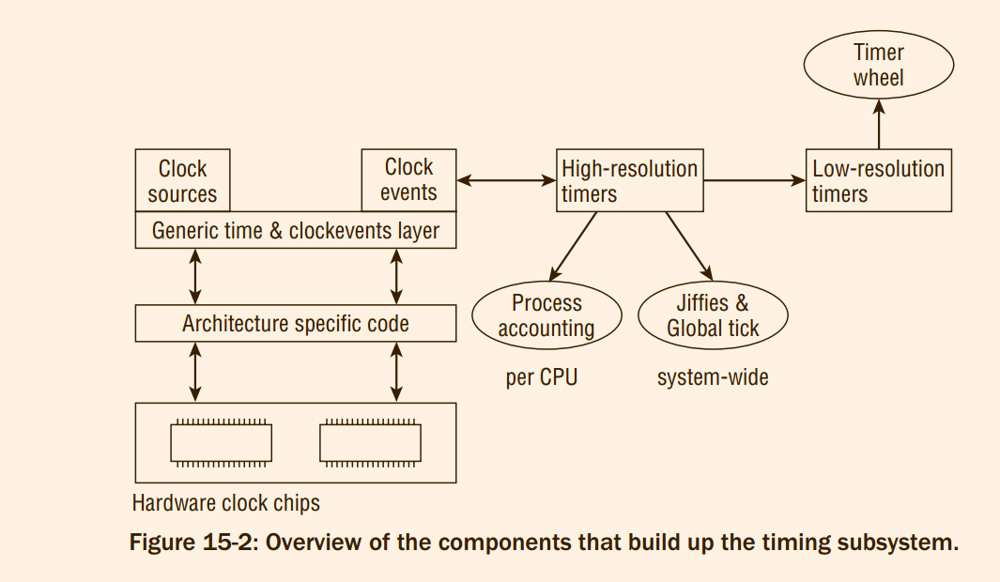
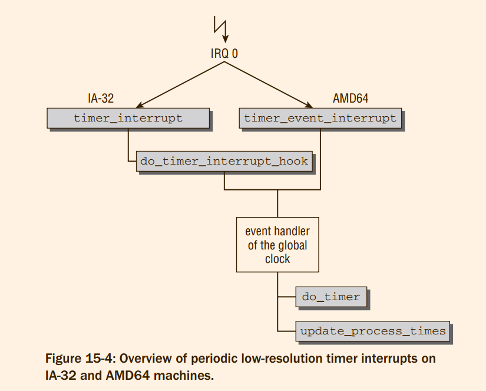
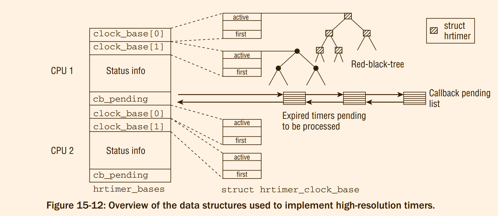
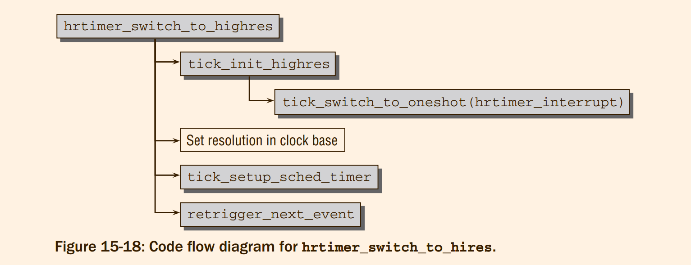

# Professional Linux Kernel Architecture : Time Management

<!-- vim-markdown-toc GFM -->

- [15.1 Overview](#151-overview)
    - [15.1.1 Types of Timers](#1511-types-of-timers)
    - [15.1.2 Configuration Options](#1512-configuration-options)
- [15.2 Implementation of Low-Resolution Timers](#152-implementation-of-low-resolution-timers)
    - [15.2.1 Timer Activation and Process Accounting](#1521-timer-activation-and-process-accounting)
    - [15.2.2 Working with Jiffies](#1522-working-with-jiffies)
    - [15.2.3 Data Structures](#1523-data-structures)
    - [15.2.4 Dynamic Timers](#1524-dynamic-timers)
- [15.3 Generic Time Subsystem](#153-generic-time-subsystem)
    - [15.3.1 Overview](#1531-overview)
    - [15.3.2 Configuration Options](#1532-configuration-options)
    - [15.3.3 Time Representation](#1533-time-representation)
    - [15.3.4 Objects for Time Management](#1534-objects-for-time-management)
- [15.4 High-Resolution Timers](#154-high-resolution-timers)
    - [15.4.1 Data Structures](#1541-data-structures)
    - [15.4.2 Setting Timers](#1542-setting-timers)
    - [15.4.3 Implementation](#1543-implementation)
    - [15.4.4 Periodic Tick Emulation](#1544-periodic-tick-emulation)
    - [15.4.5 Switching to High-Resolution Timers](#1545-switching-to-high-resolution-timers)
- [15.5 Dynamic Ticks](#155-dynamic-ticks)
    - [15.5.1 Data Structures](#1551-data-structures)
    - [15.5.2 Dynamic Ticks for Low-Resolution Systems](#1552-dynamic-ticks-for-low-resolution-systems)
    - [15.5.3 Dynamic Ticks for High-Resolution Systems](#1553-dynamic-ticks-for-high-resolution-systems)
    - [15.5.4 Stopping and Starting Periodic Ticks](#1554-stopping-and-starting-periodic-ticks)
- [15.6 Broadcast Mode](#156-broadcast-mode)
- [15.7 Implementing Timer-Related System Calls](#157-implementing-timer-related-system-calls)
    - [15.7.1 Time Bases](#1571-time-bases)
    - [15.7.2 The `alarm` and `setitimer` System Calls](#1572-the-alarm-and-setitimer-system-calls)
    - [15.7.3 Getting the Current Time](#1573-getting-the-current-time)
- [15.8 Managing Process Times](#158-managing-process-times)
- [Appendix](#appendix)

<!-- vim-markdown-toc -->

All the methods of deferring work to a future point in time discussed in this book so far do not cover
one specific area — the `time-based deferral of tasks`

The kernel itself also uses timers for various tasks, for example, *when devices communicate with
associated hardware, often using protocols with chronologically defined sequences*. A large number
of timers are used to specify wait timeouts in TCP implementation.

## 15.1 Overview

#### 15.1.1 Types of Timers
Pressure to
extend this comparatively simple framework came predominantly from two sources:
1. power consumption
2. precise timekeeping


two rather distinct types of timers are supported by the kernel:
1. low-resolution or timer wheel timers
2. high-resolution timers.

in fact, **low-resolution timers are implemented on top of the high-resolution mechanism**

**Classical timers are bound by a fixed raster, while high-resolution clock events can essentially happen at
arbitrary times;**
> high-resolution mechanism 机制不是将频率调整变高，而是 高精度 + dynamic 机制

Independent of the resolution, the kernel nomenclature distinguishes two types of timers:
1. Time-outs 
2. Timers : Are used to implement temporal sequences. For instance, a sound card driver could
want to issue some data to a sound card in small, periodic time intervals. Timers of this sort will
usually expire and require much better resolution than time-outs.
> Time-outs 要求只是要求在特定时间之后执行。




Every typical system has several devices, usually implemented
by **clock chips**, that provide timing functionality and can serve as clocks.

Which hardware is available
depends on the particular architecture. IA-32 and AMD64 systems, for instance, have a programmable
interrupt timer (**PIT**, implemented by the 8253 chip) as a classical clock source that has only a very modest resolution and stability

CPU-local **APICs** (advanced programmable interrupt controllers), which were
already mentioned in the context of IRQ handling, provide much better resolution and stability. They are
suitable as high-resolution time sources, whereas the PIT is only good enough for low-resolution timers.

Hardware naturally needs to be programmed by architecture-specific code, but the clock `source abstraction`
provides a generic interface to all hardware clock chips

Periodic events do not comply with a free running counter very well, thus another abstraction is required.
`Clock events` are the foundation of periodic events. 
`Clock events` can, however, be more powerful. Some
time devices can provide events at arbitrary, irregular points in time. In contrast to periodic event devices,
they are called one-shot devices.
> @todo clock event 是特指什么东西吗 ?

Two important tasks for which low-resolution timers assume responsibility are
1. Handle the global `jiffies` counter. The value is incremented periodically (or at least it looks
periodical to most parts of the kernel) and represents a particularly simple form of time
reference.1
2. Perform per-process accounting. This also includes handling classical low-resolution timers,
which can be associated with any process.

#### 15.1.2 Configuration Options
The kernel thus allows to configure `dynamic ticks`,
which do not require a periodic signal. Since this complicates timer handling, assume for now that this
feature is not enabled.

Four different timekeeping scenarios can be realized by the kernel. While the number may not sound too
large, understanding the time-related code is not exactly simplified when many tasks can be implemented
in four different ways depending on the chosen configuration. The table below summarizes the possible
choices.
```
High-res Dynamic ticks | High-res Periodic ticks
-------------------------------------------------
Low-res Dynamic ticks  | Low-res Periodic ticks
```
## 15.2 Implementation of Low-Resolution Timers

#### 15.2.1 Timer Activation and Process Accounting
```
#define CONFIG_HZ 1000
```
> @todo 那么，为什么时钟可以配置啊 ?

The HZ frequency is also defined (and used) when dynamic ticks are enabled
because it is the fundamental quantity for many timekeeping tasks. On a busy
system where something nontrivial (unlike the idle task) is always available to be
done, there is superficially **no difference** between dynamic and periodic ticks.
Differences only arise when there is little to do and some timer interrupts can be
skipped.
> 1. 已经彻底搞不清楚periodic 和 dynamic 之间的含义是什么了，为什么说当系统无事可做的时候，两者的区别才会产生出来

This makes large HZ values preferable for desktop and multimedia systems,
whereas lower HZ values are better for servers and batch machines where interactivity is not much of a
concern.

IA-32 registers `timer_interrupt` as the interrupt handler, whereas AMD64 uses `timer_event_interrupt`. Both
functions notify the generic, architecture-independent time processing layers of the kernel by calling the
event handler of the so-called global clock.
Different `handler` functions are employed depending on which timekeeping model is used. In any case, the handler will set the ball rolling for
periodic low-resolution timekeeping by calling the following two functions:
1. `do_time` is responsible for system-wide, global tasks
    * Update the jiffies value
    * handle process accounting. On a multiprocessor system, one particular CPU is selected to perform both tasks, and all other CPUs are not concerned with them.
2. `update_process_times` needs to be performed by every CPU on SMP systems.
    * Besides process accounting, 
    * it activates and expires all registered classical low-resolution timers and provides the scheduler with a sense of time.



> @todo 实际上，IRQ 的 handler 并不是图片上的两个，但是我有信心找到其中的内容。

Here we are only concerned with timer activation and expiration, which is triggered by calling
`run_local_timers`. The function, in turn, raises the softIRQ `TIMER_SOFTIRQ`, and the handler
function is responsible to run the low-resolution timers.

The global variable `jiffies_64` (an integer variable with 64 bits on all architectures)4 is incremented by:
1. All that this means is that `jiffies_64` specifies the exact number of timer interrupts since the system
started. Its value is increased with constant regularity when dynamic ticks are disabled. If *dynamic ticks*
are active, more than one tick period can have passed since the last update.

To achieve this, the two variables are declared separately, but the linker
script used to bind the final kernel binary specifies that `jiffies` equates to the 4 less significant bytes
of `jiffies_64`, where either the first or last 4 bytes must be used depending on the endianness of the
underlying architecture.
> 接受 jiffies_64 和 jiffies 的关系

The remaining actions that must be performed at each timer interrupt are delegated by update_times:
1. `update_wall_time` updates the wall time that specifies how long the system has already been
up and running. While this information is also roughly provided by the jiffies mechanism, the
wall clock reads the time from the current time source and updates the wall clock accordingly. In
contrast to the jiffies mechanism, the wall clock uses a human readable format (nanoseconds) to
represent the current time.
2. `calc_load` updates the system load statistics that specify how many tasks have on average been
waiting on the run queue in a ready-to-run state during the last 1, 5, and, 15 minutes. This status
can be output using, for example, the w command


> 以上内容分析了 tick_period 执行过程

#### 15.2.2 Working with Jiffies
> 为使用 Jiffies 提供两个基本的内容，

Jiffies provide a simple form of **low-resolution** time management in the kernel. Although the concept
is simple, some caveats apply when the variable is read or when times specified in jiffies need to be
compared.

* ***Comparing Times***

* ***Time Conversion***

#### 15.2.3 Data Structures
Let us now turn our attention to how low-resolution timers are implemented. You have already seen that
processing is initiated by `run_local_timers`, but before this function is discussed, some prerequisites in
the form of data structures must be introduced.

Timers are organized on lists, and the following data structure represents a timer on a list:

```c
struct timer_list {
	/*
	 * All fields that change during normal runtime grouped to the
	 * same cacheline
	 */
	struct hlist_node	entry;
	unsigned long		expires;
	void			(*function)(unsigned long);
	unsigned long		data;
	u32			flags;
	int			slack;

#ifdef CONFIG_TIMER_STATS
	int			start_pid;
	void			*start_site;
	char			start_comm[16];
#endif
#ifdef CONFIG_LOCKDEP
	struct lockdep_map	lockdep_map;
#endif
};
```
1. `function` saves a pointer to the callback function invoked upon time-out.
2. `data` is an argument for the callback function.
3. `expires` specifies the time, in jiffies, at which the timer expires.


```c
struct timeval {
	__kernel_time_t		tv_sec;		/* seconds */
	__kernel_suseconds_t	tv_usec;	/* microseconds */
};

/*
 * We could use a similar algorithm to timespec_to_jiffies (with a
 * different multiplier for usec instead of nsec). But this has a
 * problem with rounding: we can't exactly add TICK_NSEC - 1 to the
 * usec value, since it's not necessarily integral.
 *
 * We could instead round in the intermediate scaled representation
 * (i.e. in units of 1/2^(large scale) jiffies) but that's also
 * perilous: the scaling introduces a small positive error, which
 * combined with a division-rounding-upward (i.e. adding 2^(scale) - 1
 * units to the intermediate before shifting) leads to accidental
 * overflow and overestimates.
 *
 * At the cost of one additional multiplication by a constant, just
 * use the timespec implementation.
 */
unsigned long
timeval_to_jiffies(const struct timeval *value)
{
	return __timespec_to_jiffies(value->tv_sec,
				     value->tv_usec * NSEC_PER_USEC);
}
EXPORT_SYMBOL(timeval_to_jiffies);

void jiffies_to_timeval(const unsigned long jiffies, struct timeval *value)
{
	/*
	 * Convert jiffies to nanoseconds and separate with
	 * one divide.
	 */
	u32 rem;

	value->tv_sec = div_u64_rem((u64)jiffies * TICK_NSEC,
				    NSEC_PER_SEC, &rem);
	value->tv_usec = rem / NSEC_PER_USEC;
}
EXPORT_SYMBOL(jiffies_to_timeval);
```
> timeval 和 jiffies 之间相互装换的函数:

```c
struct timespec {
	__kernel_time_t	tv_sec;			/* seconds */
	long		tv_nsec;		/* nanoseconds */
};
```
Again auxiliary functions convert back and forth between jiffies and timespecs: `timespec_to_jiffies`
and `jiffies_to_timespec`.

#### 15.2.4 Dynamic Timers
The kernel needs data structures to manage all timers registered in the system (these may be assigned
to a process or to the kernel itself). The structures must permit rapid and efficient checking for expired
timers so as not to consume too much CPU time. After all, such checks must be performed at each timer
interrupt.
> 收集所有的timer, 每次时钟中断的时候加以检查

The first group is a collection of all timers
whose expiry time is between 0 and 255 (or 28) ticks. The second group includes all timers with an expiry
time between 256 and 2^8+6 − 1 = 2^14 − 1 ticks. The range for the third group is from 214 to 2^(8+2×6) − 1,
and so on. The entries in the main table are known as groups and are sometimes referred to as buckets.

> @skip 下面分析的内容都在 timer.c 中间，分析的就是 timer 
> 但是，问题就是，@todo 是否存在基于高精度的 timer 

* ***Mode of Operation***

* ***Data Structures***

* ***Implementing Timer Handling***

* ***Activating Timers***

## 15.3 Generic Time Subsystem
While low-resolution timers are based on jiffies as fundamental units of time, high-resolution timers
use human time units, namely, **nanoseconds**. **This is reasonable because high precision timers are mostly
required for userland applications**, and the natural way for programmers to think about time is in human
units. And, most important, 1 nanosecond is a precisely defined time interval, whereas the length of one
jiffy tick depends on the kernel configuration.

High-resolution timers place **more requirements** on the architecture-specific code of the individual architectures than classical timers.
The generic time framework provides the foundations for high-resolution timers.
Before getting into the details of high-resolution timers, let’s take a look into *how high-precision timekeeping* is achieved in the kernel.

The core of the second timer subsystem of the kernel can be found in `kernel/time/hrtimer.c`. The
generic timekeeping code that forms the basis for high-resolution timers is located in several files in
kernel/time. After providing an overview of the mechanisms used, the new API that comes with highresolution timers is introduced, and then their implementation is examined in detail.
#### 15.3.1 Overview

First, let’s discuss the available components and data structures, the details of which will be covered
in the course of this chapter. Three mechanisms form the foundation of any time-related task in the
kernel:

- **Clock Sources** (defined by struct clocksource) — Form the backbone of time management. Essentially each clock source provides a monotonically increasing counter with Read
Only access for the generic kernel parts. The accurateness of different clock sources varies
depending on the capabilities of the underlying hardware.
- **Clock event devices** (defined by struct clock_event_device) — Add the possibility of
equipping clocks with events that occur at a certain time in the future. Note that it is also
common to refer to such devices as clock event sources for historical reasons.
- **Tick Devices** (defined struct tick_device) — *Extend* clock event sources to provide a
continuous stream of tick events that happen at regular time intervals. The dynamic tick
mechanism allows for stopping the periodic tick during certain time intervals, though.

The kernel distinguishes between two types of clocks:
1. A **global** clock is responsible to provide the periodic tick that is mainly used to update
the jiffies values. In former versions of the kernel, this type of clock was realized by
the programmable interrupt timer (PIT) on IA-32 systems, and on similar chips on other
architectures.
2. One **local** clock per CPU allows for performing process accounting, profiling, and last but
not least, high-resolution timers.

The role of the global clock is assumed by one specifically selected local clock. Note that high-resolution
timers only work on systems that provide per-CPU clock sources. The extensive communication required
between processors would otherwise degrade system performance too much as compared to the benefit
of having high-resolution timers
> 高精度必须 local, 不然片上互联网络就会耗尽时间

A system-global clock that still works at this power management state is then used to periodically activate signals that look as if they would originate from the
original clock sources. The workaround is known as the broadcasting mechanism; more about this follow
in Section 15.6.
> 高精度时钟在power saving mode 时候是不可用的，此时信号来自于低精度的广播

#### 15.3.2 Configuration Options
Timer implementation is influenced by several configuration symbols. Two choices are possible at compile time:
1. The kernel can be built with or without support for dynamic ticks. If dynamic ticks are
enabled, the pre-processor constant `CONFIG_NO_HZ` is set.
2. High-resolution support can be enabled or disabled. The pre-processor symbol
`CONFIG_HIGH_RES_TIMERS` is enabled if support for them is compiled in.

Both are important in the following discussion of timer implementation. Recall that both choices are
independent of each other; this leads to four different configurations of the time and timer subsystems.
> 两个选项对应之前的表格，@todo 所以，high resolution 和 dynamic 其实没有关系 ?

Additionally, each architecture is required to make some configuration choices. They cannot be influenced by the user.
- `GENERIC_TIME` signals that the architecture supports the *generic time framework*.
`GENERIC_CLOCKEVENTS` states that the same holds for generic clock events. Since both are
necessary requirements for dynamic ticks and high-resolution timers, only architectures that
provide both are considered. Actually most widespread architectures have been updated to
support both options, even if some (for instance SuperH) do this only for certain time models.
> @question 表示 GENERIC_CLOCKEVENTS 表示在 GENERIC_TIME 的基础上增加功能 ?

- `CONFIG_TICK_ONESHOT` builds support for the one-shot mode of clock event devices. This is automatically selected if high-resolution timers or dynamic ticks are enabled.

- `GENERIC_CLOCKEVENTS_BROADCAST` must be defined if the architecture suffers from problems that
require broadcasting. Currently only IA-32, AMD64, and MIPS are affected.

#### 15.3.3 Time Representation
> ktime_t : 普普通通的 u64

Several auxiliary functions to handle `ktime_t` objects are defined by the kernel. Among them are the
following:

```c
/* Subtract two ktime_t variables. rem = lhs -rhs: */
#define ktime_sub(lhs, rhs)	((lhs) - (rhs))

/* Add two ktime_t variables. res = lhs + rhs: */
#define ktime_add(lhs, rhs)	((lhs) + (rhs))

/*
 * Same as ktime_add(), but avoids undefined behaviour on overflow; however,
 * this means that you must check the result for overflow yourself.
 */
#define ktime_add_unsafe(lhs, rhs)	((u64) (lhs) + (rhs))

/*
 * Add a ktime_t variable and a scalar nanosecond value.
 * res = kt + nsval:
 */
#define ktime_add_ns(kt, nsval)		((kt) + (nsval))

/*
 * Subtract a scalar nanosecod from a ktime_t variable
 * res = kt - nsval:
 */
#define ktime_sub_ns(kt, nsval)		((kt) - (nsval))


ktime_t timespec_to_ktime(const struct timespec ts)
ktime_t timeval_to_ktime(const struct timeval tv)
struct timespec ktime_to_timespec(const ktime_t kt)
struct timeval ktime_to_timeval(const ktime_t kt)
s64 ktime_to_ns(const ktime_t kt)
s64 ktime_to_us(const ktime_t kt)
```
> @question 是不是说: timespec 和 timeval 是 低精度的接口，还是用户态的接口，但是 ktime_t 是 hrtime 的接口

#### 15.3.4 Objects for Time Management
Recall from the overview that three objects manage timekeeping in the kernel: **clock sources**, **clock
event devices**, and **tick devices**. Each of them is represented by a special data structure discussed in the
following

* ***Clock Sources***

First of all, consider how time values are acquired from the **various sources present** in a machine. The
kernel defines the abstraction of a clock source for this purpose:

```c
/**
 * struct clocksource - hardware abstraction for a free running counter
 *	Provides mostly state-free accessors to the underlying hardware.
 *	This is the structure used for system time.
 *
 * @name:		ptr to clocksource name
 * @list:		list head for registration
 * @rating:		rating value for selection (higher is better)
 *			To avoid rating inflation the following
 *			list should give you a guide as to how
 *			to assign your clocksource a rating
 *			1-99: Unfit for real use
 *				Only available for bootup and testing purposes.
 *			100-199: Base level usability.
 *				Functional for real use, but not desired.
 *			200-299: Good.
 *				A correct and usable clocksource.
 *			300-399: Desired.
 *				A reasonably fast and accurate clocksource.
 *			400-499: Perfect
 *				The ideal clocksource. A must-use where
 *				available.
 * @read:		returns a cycle value, passes clocksource as argument
 * @enable:		optional function to enable the clocksource
 * @disable:		optional function to disable the clocksource
 * @mask:		bitmask for two's complement
 *			subtraction of non 64 bit counters
 * @mult:		cycle to nanosecond multiplier
 * @shift:		cycle to nanosecond divisor (power of two)
 * @max_idle_ns:	max idle time permitted by the clocksource (nsecs)
 * @maxadj:		maximum adjustment value to mult (~11%)
 * @max_cycles:		maximum safe cycle value which won't overflow on multiplication
 * @flags:		flags describing special properties
 * @archdata:		arch-specific data
 * @suspend:		suspend function for the clocksource, if necessary
 * @resume:		resume function for the clocksource, if necessary
 * @mark_unstable:	Optional function to inform the clocksource driver that
 *			the watchdog marked the clocksource unstable
 * @owner:		module reference, must be set by clocksource in modules
 *
 * Note: This struct is not used in hotpathes of the timekeeping code
 * because the timekeeper caches the hot path fields in its own data
 * structure, so no line cache alignment is required,
 *
 * The pointer to the clocksource itself is handed to the read
 * callback. If you need extra information there you can wrap struct
 * clocksource into your own struct. Depending on the amount of
 * information you need you should consider to cache line align that
 * structure.
 */
struct clocksource {
	u64 (*read)(struct clocksource *cs);
	u64 mask;
	u32 mult;
	u32 shift;
	u64 max_idle_ns;
	u32 maxadj;
#ifdef CONFIG_ARCH_CLOCKSOURCE_DATA
	struct arch_clocksource_data archdata;
#endif
	u64 max_cycles;
	const char *name;
	struct list_head list;
	int rating;
	int (*enable)(struct clocksource *cs);
	void (*disable)(struct clocksource *cs);
	unsigned long flags;
	void (*suspend)(struct clocksource *cs);
	void (*resume)(struct clocksource *cs);
	void (*mark_unstable)(struct clocksource *cs);
	void (*tick_stable)(struct clocksource *cs);

	/* private: */
#ifdef CONFIG_CLOCKSOURCE_WATCHDOG
	/* Watchdog related data, used by the framework */
	struct list_head wd_list;
	u64 cs_last;
	u64 wd_last;
#endif
	struct module *owner;
};
```


Finally, the field `flags` of struct clocksource specifies — you will have guessed it — a number of flags.
Only one flag is relevant for our purposes. CLOCK_SOURCE_CONTINUOUS represents a continuous clock,
although the meaning is not quite the mathematical sense of of ‘‘continuous.’’ Instead, it describes that
the clock is free-running if set to 1 and thus cannot skip. If it is set to 0, then some cycles might be lost;
that is, if the last cycle value was n, then the next value does not necessarily need to be n + 1 even if it was
read at the next possible moment. A clock must exhibit this flag to be usable for high-resolution timers.

> 两个例子 : jiffies.c 中间创建的 和 x86 tsc :  time-stamp counter

```c
/*
 * The Jiffies based clocksource is the lowest common
 * denominator clock source which should function on
 * all systems. It has the same coarse resolution as
 * the timer interrupt frequency HZ and it suffers
 * inaccuracies caused by missed or lost timer
 * interrupts and the inability for the timer
 * interrupt hardware to accuratly tick at the
 * requested HZ value. It is also not recommended
 * for "tick-less" systems.
 */
static struct clocksource clocksource_jiffies = {
	.name		= "jiffies",
	.rating		= 1, /* lowest valid rating*/
	.read		= jiffies_read,
	.mask		= CLOCKSOURCE_MASK(32),
	.mult		= TICK_NSEC << JIFFIES_SHIFT, /* details above */
	.shift		= JIFFIES_SHIFT,
	.max_cycles	= 10,
};

static u64 jiffies_read(struct clocksource *cs)
{
	return (u64) jiffies;
}


/*
 * Must mark VALID_FOR_HRES early such that when we unregister tsc_early
 * this one will immediately take over. We will only register if TSC has
 * been found good.
 */
static struct clocksource clocksource_tsc = {  // 当其中的时间
	.name                   = "tsc",
	.rating                 = 300,
	.read                   = read_tsc,
	.mask                   = CLOCKSOURCE_MASK(64),
	.flags                  = CLOCK_SOURCE_IS_CONTINUOUS |
				  CLOCK_SOURCE_VALID_FOR_HRES |
				  CLOCK_SOURCE_MUST_VERIFY,
	.archdata               = { .vclock_mode = VCLOCK_TSC },
	.resume			= tsc_resume,
	.mark_unstable		= tsc_cs_mark_unstable,
	.tick_stable		= tsc_cs_tick_stable,
	.list			= LIST_HEAD_INIT(clocksource_tsc.list),
};

static struct clocksource clocksource_hpet = {
	.name		= "hpet",
	.rating		= 250,
	.read		= read_hpet,
	.mask		= HPET_MASK,
	.flags		= CLOCK_SOURCE_IS_CONTINUOUS,
	.resume		= hpet_resume_counter,
};

/*
 * We used to compare the TSC to the cycle_last value in the clocksource
 * structure to avoid a nasty time-warp. This can be observed in a
 * very small window right after one CPU updated cycle_last under
 * xtime/vsyscall_gtod lock and the other CPU reads a TSC value which
 * is smaller than the cycle_last reference value due to a TSC which
 * is slighty behind. This delta is nowhere else observable, but in
 * that case it results in a forward time jump in the range of hours
 * due to the unsigned delta calculation of the time keeping core
 * code, which is necessary to support wrapping clocksources like pm
 * timer.
 *
 * This sanity check is now done in the core timekeeping code.
 * checking the result of read_tsc() - cycle_last for being negative.
 * That works because CLOCKSOURCE_MASK(64) does not mask out any bit.
 */
static u64 read_tsc(struct clocksource *cs)
{
	return (u64)rdtsc_ordered();
}

/**
 * rdtsc_ordered() - read the current TSC in program order
 *
 * rdtsc_ordered() returns the result of RDTSC as a 64-bit integer.
 * It is ordered like a load to a global in-memory counter.  It should
 * be impossible to observe non-monotonic rdtsc_unordered() behavior
 * across multiple CPUs as long as the TSC is synced.
 */
static __always_inline unsigned long long rdtsc_ordered(void)
{
	DECLARE_ARGS(val, low, high);

	/*
	 * The RDTSC instruction is not ordered relative to memory
	 * access.  The Intel SDM and the AMD APM are both vague on this
	 * point, but empirically an RDTSC instruction can be
	 * speculatively executed before prior loads.  An RDTSC
	 * immediately after an appropriate barrier appears to be
	 * ordered as a normal load, that is, it provides the same
	 * ordering guarantees as reading from a global memory location
	 * that some other imaginary CPU is updating continuously with a
	 * time stamp.
	 *
	 * Thus, use the preferred barrier on the respective CPU, aiming for
	 * RDTSCP as the default.
	 */
	asm volatile(ALTERNATIVE_2("rdtsc",
				   "lfence; rdtsc", X86_FEATURE_LFENCE_RDTSC,
				   "rdtscp", X86_FEATURE_RDTSCP)
			: EAX_EDX_RET(val, low, high)
			/* RDTSCP clobbers ECX with MSR_TSC_AUX. */
			:: "ecx");

	return EAX_EDX_VAL(val, low, high);
}
```
> clocksource::rate 各种数值说了半天，这个数值到底是什么含义 ?

> @todo 我想知道，到底 clocksource 对应的设备是什么 j8 玩意儿啊 ？

* ***Working with Clock Sources***

How can a clock be used? First of all, it must be registered with the kernel. The function
`clocksource_register` is responsible for this. The source is only added to the global `clocksource_list`
(defined in `kernel/time/clocksource.c`), which sorts all available clock sources by their rating. 

`select_clocksource` is called to select the best clock source. Normally this will pick the
clock with the best rating, but it is also possible to specify a preference from userland via
`/sys/devices/system/clocksource/clocksource0/current_clocksource`, which is used by the kernel
instead. Two global variables are provided for this purpose:
1. `current_clocksource` points to the clock source that is currently the best one.
2. `next_clocksource` points to an instance of struct clocksource that is better than the one
used at the moment. The kernel automatically switches to the best clock source when a new
best clock source is registered.

To read the clock, the kernel provides the following functions:
1. `__get_realtime_clock_ts` takes a pointer to an instance of struct timespec as argument, reads
the current clock, converts the result, and stores in the timespec instance.
2. `getnstimeofday` is a front-end for `__get_realtime_clock_ts`, but also works if no highresolution clocks are available in the system.
In this case, getnstimeofday as defined in `kernel/time.c` (instead of `kernel/time/timekeeping.c`) is
used to provide a timespec that fulfills only low-resolution requirements.
> @todo holy shit ! 所以这两个函数的作用到底是什么 ?

* ***Clock Event Devices***

Recall that clock event devices allow for registering an event that is going to happen at a defined point
of time in the future. In comparison to a full-blown timer implementation, however, only a single event
can be stored. The key elements of every `clock_event_device` are `set_next_event` because it allows for
setting the time at which the event is going to take place, and `event_handler`, which is called when the
event actually happens.

Recall that clock event devices allow for registering an event that is going to happen at a defined point
of time in the future. In comparison to a full-blown timer implementation, however, only a single event
can be stored. The key elements of every `clock_event_device` are `set_next_event` because it allows for
setting the time at which the event is going to take place, and `event_handler`, which is called when the
event actually happens.
```c
/**
 * struct clock_event_device - clock event device descriptor
 * @event_handler:	Assigned by the framework to be called by the low
 *			level handler of the event source
 * @set_next_event:	set next event function using a clocksource delta
 * @set_next_ktime:	set next event function using a direct ktime value
 * @next_event:		local storage for the next event in oneshot mode
 * @max_delta_ns:	maximum delta value in ns
 * @min_delta_ns:	minimum delta value in ns
 * @mult:		nanosecond to cycles multiplier
 * @shift:		nanoseconds to cycles divisor (power of two)
 * @state_use_accessors:current state of the device, assigned by the core code
 * @features:		features
 * @retries:		number of forced programming retries
 * @set_state_periodic:	switch state to periodic
 * @set_state_oneshot:	switch state to oneshot
 * @set_state_oneshot_stopped: switch state to oneshot_stopped
 * @set_state_shutdown:	switch state to shutdown
 * @tick_resume:	resume clkevt device
 * @broadcast:		function to broadcast events
 * @min_delta_ticks:	minimum delta value in ticks stored for reconfiguration
 * @max_delta_ticks:	maximum delta value in ticks stored for reconfiguration
 * @name:		ptr to clock event name
 * @rating:		variable to rate clock event devices
 * @irq:		IRQ number (only for non CPU local devices)
 * @bound_on:		Bound on CPU
 * @cpumask:		cpumask to indicate for which CPUs this device works
 * @list:		list head for the management code
 * @owner:		module reference
 */
struct clock_event_device {
	void			(*event_handler)(struct clock_event_device *);
	int			(*set_next_event)(unsigned long evt, struct clock_event_device *);
	int			(*set_next_ktime)(ktime_t expires, struct clock_event_device *);
	ktime_t			next_event;
	u64			max_delta_ns;
	u64			min_delta_ns;
	u32			mult;
	u32			shift;
	enum clock_event_state	state_use_accessors;
	unsigned int		features;
	unsigned long		retries;

	int			(*set_state_periodic)(struct clock_event_device *);
	int			(*set_state_oneshot)(struct clock_event_device *);
	int			(*set_state_oneshot_stopped)(struct clock_event_device *);
	int			(*set_state_shutdown)(struct clock_event_device *);
	int			(*tick_resume)(struct clock_event_device *);

	void			(*broadcast)(const struct cpumask *mask);
	void			(*suspend)(struct clock_event_device *);
	void			(*resume)(struct clock_event_device *);
	unsigned long		min_delta_ticks;
	unsigned long		max_delta_ticks;

	const char		*name;
	int			rating;
	int			irq;
	int			bound_on;
	const struct cpumask	*cpumask;
	struct list_head	list;
	struct module		*owner;
} ____cacheline_aligned;

/*
 * The local apic timer can be used for any function which is CPU local.
 */
static struct clock_event_device lapic_clockevent = { // arch 定义的 instance， 定义在 arch/x86/kernel/apic/apic.c 中间，类似还有好几个
	.name				= "lapic",
	.features			= CLOCK_EVT_FEAT_PERIODIC |
					  CLOCK_EVT_FEAT_ONESHOT | CLOCK_EVT_FEAT_C3STOP
					  | CLOCK_EVT_FEAT_DUMMY,
	.shift				= 32,
	.set_state_shutdown		= lapic_timer_shutdown,
	.set_state_periodic		= lapic_timer_set_periodic,
	.set_state_oneshot		= lapic_timer_set_oneshot,
	.set_state_oneshot_stopped	= lapic_timer_shutdown,
	.set_next_event			= lapic_next_event,
	.broadcast			= lapic_timer_broadcast,
	.rating				= 100,
	.irq				= -1,
};
```
❑ name is a human-readable representation for the event device. It shows up in /proc/timerlist.
❑ max_delta_ns and min_delta_ns specify the maximum or minimum, respectively, difference
between the current time and the time for the next event. Clocks work with individual frequencies at which device cycles occur, but the generic time subsystem expects a nanosecond value
when the event shall take place. The auxiliary function clockevent_delta2ns helps to convert
one representation into the other.
Consider, for instance, that the current time is 20, min_delta_ns is 2, and max_delta_ns is 40 (of
course, the exemplary values do not represent any situation possible in reality). Then the next
event can take place during the time interval [22, 60] where the boundaries are included.
❑ mult and shift are a multiplier and a divider, respectively, used to convert between clock cycles
and nanosecond values.
❑ The function pointed to by event_handler is called by the hardware interface code (which usually is architecture-specific) to pass clock events on to the generic layers.
❑ irq specifies the number of the IRQ that is used by the event device. Note that this is only
required for global devices. Per-CPU local devices use different hardware mechanisms to emit
signals and set irq to −1.
❑ cpumask specifies for which CPUs the event device works. A simple bitmask is employed for this
purpose. Local devices are usually only responsible for a single CPU.
❑ broadcast is required for the broadcasting implementation that provides a workaround for nonfunctional local APICs on IA-32 and AMD64 in power-saving mode. See Section 15.6 for more
details.
❑ rating allows — in analogy to the mechanism described for clock devices — comparison of
clock event devices by explicitly rating their accuracy.
❑ All instances of struct clock_event_device are kept on the global list clockevent_devices,
and list is the list head required for this purpose.
The auxiliary function clockevents_register_device is used to register a new clock event
device. This places the device on the global list.
❑ ktime_t stores the absolute time of the next event.

Each event device is characterized by several features stored as a bit string in features. A number of
constants in <clockchips.h> define possible features. For our purposes, two are of interest12:
❑ Clock event devices that support periodic events (i.e., events that are repeated over and over
again without the need to explicitly activate them by reprogramming the device) are identified
by CLOCK_EVT_FEAT_PERIODIC.
❑ CLOCK_EVT_FEAT_ONESHOT marks a clock capable of issuing one-shot events that happen exactly
once. Basically, this is the opposite of periodic events.

`set_mode` points to a function that allows for toggling the desired mode of operation between periodic
and one-shot mode. `mode` designates the current mode of operation. A clock can only be in either periodic
or one-shot mode at a time, but it can nevertheless provide the ability to work in both modes — actually,
most clocks allow both possibilities.
> set_mode 被替换为了，但是应该 periodic 和 one-shot mode 不可以重叠是确定的

> skip 本 section 的几行，我疯了

* ***Tick Devices***

One particular important use of clock event devices is to provide periodic ticks — recall from Section 15.2
that ticks are, for instance, required to operate the classical timer wheel. A tick device is an extension of a
clock event device:

A `tick_device` is just a wrapper around struct `clock_event_device` with an additional field that
specifies which mode the device is in. This can either be periodic or one-shot.

```c
enum tick_device_mode {
	TICKDEV_MODE_PERIODIC,
	TICKDEV_MODE_ONESHOT,
};

struct tick_device {
	struct clock_event_device *evtdev;
	enum tick_device_mode mode;
};
```

Again, **the kernel distinguishes global and local (per-CPU) tick devices.** The local devices are collected
in tick_cpu_device (defined in kernel/time/tick-internal.h). Note that the kernel automatically
creates a tick device when a new clock event device is registered.
Several global variables are additionally defined in `include/time/tick-internal.h`:
- `tick_cpu_device` is a per-CPU list containing one instance of struct tick_device for each CPU in the system.
- `tick_next_period` specifies the time (in nanoseconds) when the next global tick event will happen.
- `tick_do_timer_cpu` contains the CPU number whose tick device assumes the role of the global tick device.
- `tick_period` stores the interval between ticks in nanoseconds. It is the counterpart to HZ that denotes the frequency at which ticks occur.

To set up a tick device, the kernel provides the function tick_setup_device. The prototype is as follows,
and the code flow diagram is depicted in Figure 15-8


> skip 受不了了

## 15.4 High-Resolution Timers
> @question high-resolution 支持靠什么，运行时检测 ?

After having discussed the generic time framework, we are now ready to take the next step and dive
into the implementation of **high-resolution timers**. Two fundamental differences distinguish these timers
from low-resolution timers:
1. High-resolution (high-res) timers are time-ordered on a *red-black tree*.
2. They are independent of periodic ticks. They do not use a time specification based on jiffies,
but employ nanosecond time stamps.
> @question 为什么 high resolution timer 就可以使用 rb tree, low resolution 就不可以

Components of the high-resolution timer framework that are not universally applicable, but
do really provide actual high-resolution capabilites are bracketed by the pre-processor symbol
`CONFIG_HIGH_RES_TIMERS`, and are only compiled in if high-resolution support is selected at compile
time. The generic part of the framework is always added to the kernel.

#### 15.4.1 Data Structures

High-resolution timers can be based on two different types of clocks (which are referred to as clock
bases). The monotonic clock starts at 0 when the system is booted (`CLOCK_MONOTONIC`). The other clock
(`CLOCK_REALTIME`) represents the real time of the system. *The latter clock may exhibit skips if, for instance,
the system time is changed, but the monotonic clock runs, well, monotonously all the time.*



```c
/**
 * struct hrtimer_clock_base - the timer base for a specific clock
 * @cpu_base:		per cpu clock base
 * @index:		clock type index for per_cpu support when moving a
 *			timer to a base on another cpu.
 * @clockid:		clock id for per_cpu support
 * @seq:		seqcount around __run_hrtimer
 * @running:		pointer to the currently running hrtimer
 * @active:		red black tree root node for the active timers
 * @get_time:		function to retrieve the current time of the clock
 * @offset:		offset of this clock to the monotonic base
 */
struct hrtimer_clock_base {
	struct hrtimer_cpu_base	*cpu_base;
	unsigned int		index;
	clockid_t		clockid;
	seqcount_t		seq;
	struct hrtimer		*running;
	struct timerqueue_head	active;
	ktime_t			(*get_time)(void);
	ktime_t			offset;
} __hrtimer_clock_base_align;
```
The meaning of the fields is as follows:
- hrtimer_cpu_base points to the per-CPU basis to which the clock base belongs.
- index distinguishes between CLOCK_MONOTONIC and CLOCK_REALTIME.
- rb_root is the root of a red-black tree on which all active timers are sorted.
- first points to the timer that will expire first.
- Processing high-res timers is initiated from the high-resolution timer softIRQ HRTIMER_SOFTIRQ
as described in the next section. softirq_time stores the time at which the softIRQ was issued,
and get_softirq_time is a function to obtain this time. If high-resolution mode is not active,
then the stored time will be coarse-grained.
- get_time reads the fine-grained time. This is simple for the monotonic clock (the value delivered
by the current clock source can be directly used), but some straightforward arithmetic is required
to convert the value into the real system time.
- resolution denotes the resolution of the timer in nanoseconds.
- When the real-time clock is adjusted, a discrepancy between the expiration values of timers
stored on the CLOCK_REALTIME clock base and the current real time will arise. The offset field
helps to fix the situation by denoting an offset by which the timers needs to be corrected. Since
this is only a temporary effect that happens only seldomly, the complications need not be discussed in more detail.
- reprogram is a function that allows for reprogramming a given timer event, that is, changing the
expiration time.

> hrtimer_cpu_base : rb tree 的根部

Two clock bases are established for each CPU using the following data structure:

```c
/**
 * struct hrtimer_cpu_base - the per cpu clock bases
 * @lock:		lock protecting the base and associated clock bases
 *			and timers
 * @cpu:		cpu number
 * @active_bases:	Bitfield to mark bases with active timers
 * @clock_was_set_seq:	Sequence counter of clock was set events
 * @hres_active:	State of high resolution mode
 * @in_hrtirq:		hrtimer_interrupt() is currently executing
 * @hang_detected:	The last hrtimer interrupt detected a hang
 * @softirq_activated:	displays, if the softirq is raised - update of softirq
 *			related settings is not required then.
 * @nr_events:		Total number of hrtimer interrupt events
 * @nr_retries:		Total number of hrtimer interrupt retries
 * @nr_hangs:		Total number of hrtimer interrupt hangs
 * @max_hang_time:	Maximum time spent in hrtimer_interrupt
 * @softirq_expiry_lock: Lock which is taken while softirq based hrtimer are
 *			 expired
 * @timer_waiters:	A hrtimer_cancel() invocation waits for the timer
 *			callback to finish.
 * @expires_next:	absolute time of the next event, is required for remote
 *			hrtimer enqueue; it is the total first expiry time (hard
 *			and soft hrtimer are taken into account)
 * @next_timer:		Pointer to the first expiring timer
 * @softirq_expires_next: Time to check, if soft queues needs also to be expired
 * @softirq_next_timer: Pointer to the first expiring softirq based timer
 * @clock_base:		array of clock bases for this cpu
 *
 * Note: next_timer is just an optimization for __remove_hrtimer().
 *	 Do not dereference the pointer because it is not reliable on
 *	 cross cpu removals.
 */
struct hrtimer_cpu_base {
	raw_spinlock_t			lock;
	unsigned int			cpu;
	unsigned int			active_bases;
	unsigned int			clock_was_set_seq;
	unsigned int			hres_active		: 1,
					in_hrtirq		: 1,
					hang_detected		: 1,
					softirq_activated       : 1;
#ifdef CONFIG_HIGH_RES_TIMERS
	unsigned int			nr_events;
	unsigned short			nr_retries;
	unsigned short			nr_hangs;
	unsigned int			max_hang_time;
#endif
#ifdef CONFIG_PREEMPT_RT
	spinlock_t			softirq_expiry_lock;
	atomic_t			timer_waiters;
#endif
	ktime_t				expires_next;
	struct hrtimer			*next_timer;
	ktime_t				softirq_expires_next;
	struct hrtimer			*softirq_next_timer;
	struct hrtimer_clock_base	clock_base[HRTIMER_MAX_CLOCK_BASES];
} ____cacheline_aligned;
```

```c
/*
 * The timer bases:
 *
 * There are more clockids than hrtimer bases. Thus, we index
 * into the timer bases by the hrtimer_base_type enum. When trying
 * to reach a base using a clockid, hrtimer_clockid_to_base()
 * is used to convert from clockid to the proper hrtimer_base_type.
 */
DEFINE_PER_CPU(struct hrtimer_cpu_base, hrtimer_bases) =
{
	.lock = __RAW_SPIN_LOCK_UNLOCKED(hrtimer_bases.lock),
	.clock_base =
	{
		{
			.index = HRTIMER_BASE_MONOTONIC,
			.clockid = CLOCK_MONOTONIC,
			.get_time = &ktime_get,
		},
		{
			.index = HRTIMER_BASE_REALTIME,
			.clockid = CLOCK_REALTIME,
			.get_time = &ktime_get_real,
		},
		{
			.index = HRTIMER_BASE_BOOTTIME,
			.clockid = CLOCK_BOOTTIME,
			.get_time = &ktime_get_boottime,
		},
		{
			.index = HRTIMER_BASE_TAI,
			.clockid = CLOCK_TAI,
			.get_time = &ktime_get_clocktai,
		},
		{
			.index = HRTIMER_BASE_MONOTONIC_SOFT,
			.clockid = CLOCK_MONOTONIC,
			.get_time = &ktime_get,
		},
		{
			.index = HRTIMER_BASE_REALTIME_SOFT,
			.clockid = CLOCK_REALTIME,
			.get_time = &ktime_get_real,
		},
		{
			.index = HRTIMER_BASE_BOOTTIME_SOFT,
			.clockid = CLOCK_BOOTTIME,
			.get_time = &ktime_get_boottime,
		},
		{
			.index = HRTIMER_BASE_TAI_SOFT,
			.clockid = CLOCK_TAI,
			.get_time = &ktime_get_clocktai,
		},
	}
};
```

> skip 下面，下面大致分析的内容为： struct hrtimer  hrtimer_sleeper

#### 15.4.2 Setting Timers
> skip easy

#### 15.4.3 Implementation

**High-Resolution Timers in High-Resolution Mode**
> skip something we don't need yet


**High-Resolution Timers in Low-Resolution Mode**
> skip wired

#### 15.4.4 Periodic Tick Emulation
> skip should be easy !

#### 15.4.5 Switching to High-Resolution Timers
High-resolution timers are not enabled from the very beginning, but can only be activated when suitable
high-resolution clock sources have been initialized and added to the generic clock framework. Lowresolution ticks, however, are provided (nearly) from the very beginning. In the following, I discuss how
the kernel switches from low- to high-resolution mode.

The high-resolution queue is processed by `hrtimer_run_queue` when low-resolution timers are active.
Before the queues are run, the function provides checks if a clock event device suitable for high resolution
timers is present in the system. In this case, the switch to high resolution mode is performed:

```c
	/*
	 * This _is_ ugly: We have to check periodically, whether we
	 * can switch to highres and / or nohz mode. The clocksource
	 * switch happens with xtime_lock held. Notification from
	 * there only sets the check bit in the tick_oneshot code,
	 * otherwise we might deadlock vs. xtime_lock.
	 */
	if (tick_check_oneshot_change(!hrtimer_is_hres_enabled())) {
		hrtimer_switch_to_hres();
		return;
	}
```



> @todo 本小节没有细品，等到架构大致搞清楚再看吧 !

## 15.5 Dynamic Ticks
The approach is simple and effective,
but shows one particular deficiency on systems where **power consumption** does
matter: The periodic tick requires that the system is in an active state at a certain frequency. Longer
periods of rest are impossible because of this. **Dynamic ticks mend this problem**.

Dynamic ticks mend this problem. The periodic tick is only activated when some tasks actually do need
to be performed. Otherwise, it is temporarily disabled. Support for this technique can be selected at
compile time, and the resulting system is also referred to as a tickless system. *However, this name is not
entirely accurate because the fundamental frequency HZ at which the periodic tick operates when it is
functional still provides a raster for time flow.*

How can the kernel decide if the system has nothing to do? if no active tasks
are on the run queue, the kernel picks a special task — the idle task — to run. At this point, the dynamic
tick mechanism enters the game. 

**Before discussing the dynamic tick implementation, let us note that one-shot clocks are a prerequisite for
them. Since a key feature of dynamic ticks is that the tick mechanism can be stopped and restarted as
necessary, purely periodic timers will fundamentally not suit the mechanism**
> 区分 hrtimer,  high resolution clock 以及 one-shot clock 

#### 15.5.1 Data Structures

```c
/**
 * struct tick_sched - sched tick emulation and no idle tick control/stats
 * @sched_timer:	hrtimer to schedule the periodic tick in high
 *			resolution mode
 * @last_tick:		Store the last tick expiry time when the tick
 *			timer is modified for nohz sleeps. This is necessary
 *			to resume the tick timer operation in the timeline
 *			when the CPU returns from nohz sleep.
 * @tick_stopped:	Indicator that the idle tick has been stopped
 * @idle_jiffies:	jiffies at the entry to idle for idle time accounting
 * @idle_calls:		Total number of idle calls
 * @idle_sleeps:	Number of idle calls, where the sched tick was stopped
 * @idle_entrytime:	Time when the idle call was entered
 * @idle_waketime:	Time when the idle was interrupted
 * @idle_exittime:	Time when the idle state was left
 * @idle_sleeptime:	Sum of the time slept in idle with sched tick stopped
 * @iowait_sleeptime:	Sum of the time slept in idle with sched tick stopped, with IO outstanding
 * @sleep_length:	Duration of the current idle sleep
 * @do_timer_lst:	CPU was the last one doing do_timer before going idle
 */
struct tick_sched {
	struct hrtimer			sched_timer;
	unsigned long			check_clocks;
	enum tick_nohz_mode		nohz_mode;
	ktime_t				last_tick;
	int				inidle;
	int				tick_stopped;
	unsigned long			idle_jiffies;
	unsigned long			idle_calls;
	unsigned long			idle_sleeps;
	int				idle_active;
	ktime_t				idle_entrytime;
	ktime_t				idle_waketime;
	ktime_t				idle_exittime;
enum tick_nohz_mode {
	NOHZ_MODE_INACTIVE,
	NOHZ_MODE_LOWRES,
	NOHZ_MODE_HIGHRES,
};
	ktime_t				idle_sleeptime;
	ktime_t				iowait_sleeptime;
	ktime_t				sleep_length;
	unsigned long			last_jiffies;
	u64				next_timer;
	ktime_t				idle_expires;
	int				do_timer_last;
};

enum tick_nohz_mode {
	NOHZ_MODE_INACTIVE,
	NOHZ_MODE_LOWRES,
	NOHZ_MODE_HIGHRES,
};
```
> @todo 接下来，描述结构体成员的具体的内容
> 所以这一个结构体是如何支撑起来high resolution 的，硬件支持在哪里? 也许是利用 sched_timer 吧

#### 15.5.2 Dynamic Ticks for Low-Resolution Systems

#### 15.5.3 Dynamic Ticks for High-Resolution Systems


#### 15.5.4 Stopping and Starting Periodic Ticks
**Dynamic ticks provide the framework to defer periodic ticks for a while**. What the kernel still needs to decide is when ticks are supposed to be stopped and restarted.

A natural possibility to stop ticks is when the idle task is scheduled: This proves that a processor really
does not have anything better to do. tick_nohz_stop_sched_tick is provided by the dynamic tick
framework to stop ticks. Note that the same function is used independent of low and high resolution.
If dynamic ticks are disabled at compile time, the function is replaced by an empty dummy.
> 只有 dynamic tick 只可以被停止，那么 periodic tick 永远都不可以停止?

```c
void cpu_idle(){
  while (1) {
    ...
    tick_nohz_stop_sched_tick();
    while (!need_resched())
    idle();
    ...
    tick_nohz_restart_sched_tick();
    ...
  }
}
```
> `cpu_idle`在x86 上面实现真的麻烦的让人怀疑人生。arm 上面的实现也是一言难尽啊!


Other architectures differ in some details, but the general principle is the same. After calling
`tick_nohz_stop_sched_tick` to turn off ticks, the system goes into an endless loop that ends when a
process is available to be scheduled on the processor. Ticks are then necessary again, and are reactivated
by `tick_nohz_restart_sched_tick`.

**Stopping Ticks**
> skip 
> 讲解如何关闭 dynamic tick


**Restarting Ticks**
`tick_nohz_restart_sched_tick` is used to restart ticks. 

```
static void tick_nohz_restart_sched_tick(struct tick_sched *ts, ktime_t now)
{
	/* Update jiffies first */
	tick_do_update_jiffies64(now);
	update_cpu_load_nohz();

	calc_load_exit_idle();
	touch_softlockup_watchdog();
	/*
	 * Cancel the scheduled timer and restore the tick
	 */
	ts->tick_stopped  = 0;
	ts->idle_exittime = now;

	tick_nohz_restart(ts, now);
}
```
> 接下来，分析该函数
> 问题:
> 1. restart tick 实现何种操作
> 2. 为什么需要 restart tick.


## 15.6 Broadcast Mode
On some architectures, clock event devices will go to sleep when certain power-saving modes are
active. Thankfully, systems do not have only a single clock event device, so another device that
still works can replace the stopped devices. 
> 讲解设备之间的沟通问题.

## 15.7 Implementing Timer-Related System Calls


#### 15.7.1 Time Bases
When timers are used, there are **three** options to distinguish how elapsed time is counted or in which time base the timer resides.
1. `ITIMER_REAL` measures the actual elapsed time between activation of the timer and time-out
in order to trigger the signal. In this case, the timer continues to tick regardless of whether the
system is in kernel mode or user mode or whether the application using the timer is currently
running or not. A signal of the `SIGALRM` type is sent when the timer times out.
2. `ITIMER_VIRTUAL` runs only during the time spent by the owner process of the timer in user mode.
In this case, time spent in kernel mode (or when the processor is busy with another application)
is ignored. Time-out is indicated by the `SIGVTALRM` signal.
3. `ITIMER_PROF` calculates the time spent by the process both in user and kernel mode — time
continues to elapse when a system call is executed on behalf of the task. Other processes of the
system are ignored. The signal sent at time-out is `SIGPROF`.
> 三种计算时间的方法,第三种最常用的.
> 1. 第一种方法 莫名奇妙啊!

The timer type — and the periodic interval length — must be specified when an interval timer is
installed. In our example, `TTIMER_REAL` is used for a real-time timer.

The behavior of alarm timers can be simulated with interval timers by selecting `ITIMER_REAL` as the timer
type and deinstalling the timer after the first time-out. Interval timers are therefore a generalized form of
alarm timers.
> that's good, more confusing now !

> 所以，最后内容和标题(time base)有什么关系吗? 
> * base 表示预备内容，然后以此为基础讲解


#### 15.7.2 The `alarm` and `setitimer` System Calls
alarm installs timers of the `ITIMER_REAL` type (real-time timers), while setitimer is used to install not
only real-time, but also virtual and profiling timers. The system calls all end up in `do_setitimer`.
```c
struct itimerval {
	struct timeval it_interval;	/* timer interval */
	struct timeval it_value;	/* current value */
};

int do_setitimer(int which, struct itimerval *value, struct itimerval *ovalue)
{
	struct task_struct *tsk = current;
	struct hrtimer *timer;
	ktime_t expires;

	/*
	 * Validate the timevals in value.
	 */
	if (!timeval_valid(&value->it_value) ||
	    !timeval_valid(&value->it_interval))
		return -EINVAL;

	switch (which) {
	case ITIMER_REAL:
again:
		spin_lock_irq(&tsk->sighand->siglock);
		timer = &tsk->signal->real_timer;
		if (ovalue) {
			ovalue->it_value = itimer_get_remtime(timer);
			ovalue->it_interval
				= ktime_to_timeval(tsk->signal->it_real_incr);
		}
		/* We are sharing ->siglock with it_real_fn() */
		if (hrtimer_try_to_cancel(timer) < 0) {
			spin_unlock_irq(&tsk->sighand->siglock);
			goto again;
		}
		expires = timeval_to_ktime(value->it_value);
		if (expires.tv64 != 0) {
			tsk->signal->it_real_incr =
				timeval_to_ktime(value->it_interval);
			hrtimer_start(timer, expires, HRTIMER_MODE_REL);
		} else
			tsk->signal->it_real_incr.tv64 = 0;

		trace_itimer_state(ITIMER_REAL, value, 0);
		spin_unlock_irq(&tsk->sighand->siglock);
		break;
	case ITIMER_VIRTUAL:
		set_cpu_itimer(tsk, CPUCLOCK_VIRT, value, ovalue);
		break;
	case ITIMER_PROF:
		set_cpu_itimer(tsk, CPUCLOCK_PROF, value, ovalue);
		break;
	default:
		return -EINVAL;
	}
	return 0;
}
```
> 的确，三个case 分别对应

All details are documented in the manual page setitimer(2).

**Extensions to the Task Structure**
The task structure of each process contains a pointer to an instance of `struct signal_struct` that
includes several elements to accommodate information required for timers:
> `struct signal_struct` 是一个长的不得了的结构体

Two fields are reserved for profiling and virtual timer type:
1. The time at which the next time-out is to occur (`it_prof_expires` and `it_virt_expires`).
2. The interval after which the timer is called (`it_prof_incr` and `it_virt_incr`).
> 再一次，这些变量并没有找到。

**Real-Time Timers**
> skip


#### 15.7.3 Getting the Current Time
Hardware clocks are **notorious** for being either fast, slow, or a random combination of both.
There are various methods to solve this problem, with the most common one in the age of networked
computers being synchronization with a reliable time source (e.g., an atomic clock) via NTP. Since this is
purely a userland issue, I won’t discuss it any further.
> 看来自己的硬件维持粗略时间，用于管理大概就差不多了

Two means are provided to obtain timing information:
1. The system call `adjtimex`. A small utility program of the same name can be used to quickly
display the exported information. The system call allows for reading the current kernel internal time. Other possibilities are documented in the associated manual page 2(adjtimex).
2. The device special file `/dev/rtc`. This source can be operated in various modes, but one of
them delivers the current date and time to the caller.
> 实际上，并没有 /dev/rtc 这个东西

```
/**
 * do_adjtimex() - Accessor function to NTP __do_adjtimex function
 */
int do_adjtimex(struct timex *txc)
{
```
> 可以一路追踪到硬件层上.


## 15.8 Managing Process Times
```c
struct task_struct{
...
	cputime_t utime, stime, utimescaled, stimescaled;
	cputime_t gtime;
	struct prev_cputime prev_cputime;
...
}

/*
 * Called from the timer interrupt handler to charge one tick to the current
 * process.  user_tick is 1 if the tick is user time, 0 for system.
 */
void update_process_times(int user_tick)
{
	struct task_struct *p = current;

	/* Note: this timer irq context must be accounted for as well. */
	account_process_tick(p, user_tick);
	run_local_timers();
	rcu_check_callbacks(user_tick);
#ifdef CONFIG_IRQ_WORK
	if (in_irq())
		irq_work_tick();
#endif
	scheduler_tick();
	run_posix_cpu_timers(p);
}
```

`update_process_times` is used to manage process-specific time elements and is invoked from the *local tick*.
> local tick ??? when global tick mentioned ?

four things need to be done:
1. `account_process_tick` uses either `account_user_time` or `account_sys_time` to update the
values for user or system CPU time consumed in the task structure (utime or stime, respectively). The SIGXCPU signal is also sent at intervals of 1 second if the process has exceeded its
CPU limits specified by Rlimit.
2. `run_local_timers` activates and expires low-resolution timers.
3. `scheduler_tick` is a helper for the CPU scheduler;
4. `run_posix_cpu_timers` initiates that the currently registered POSIX timers are run. This
includes running the abovementioned interval timers since their implementation is based on
POSIX CPU timers. Since these timers are otherwise not very interesting, their implementation is not covered in detail.
> need deeper understanding of above words !

## Appendix
> use time, instead of anxiety
```
☁️☁️🌞       ☁
     ☁  ✈     ☁    🚁
  🏬🏨🏫🏢🏤🏥🏦🏪
👬🌲 /  🚶 |🚍   \🌳👫👫
  🌳/  🚘  |🏃    \🌴🐈
🌴 /       |🚔     \🌲👯👯
🌲/🚖      |   🚘   \🌳👭
```

1. 什么是 timekeeping ?

/home/shen/Core/linux-5.5.2/Documentation/timers/timekeeping.rst


To provide timekeeping for your platform, the **clock source** provides
the basic timeline, whereas clock events shoot interrupts on certain points
on this timeline, providing facilities such as high-resolution timers.
sched_clock() is used for scheduling and timestamping, and delay timers
provide an accurate delay source using hardware counters.
> 是不是 clock source 提供类似于 wall time 的功能，当系统需要访问时间的时候，
> 那么，主动访问机制。
> clock event 则是用于实现 tiemr ，在某一个时机提供中断

> 而且，感觉 clock source 的精度可能会非常成问题。

      ns ~= (clocksource * mult) >> shift

这是干啥的呀 ?
