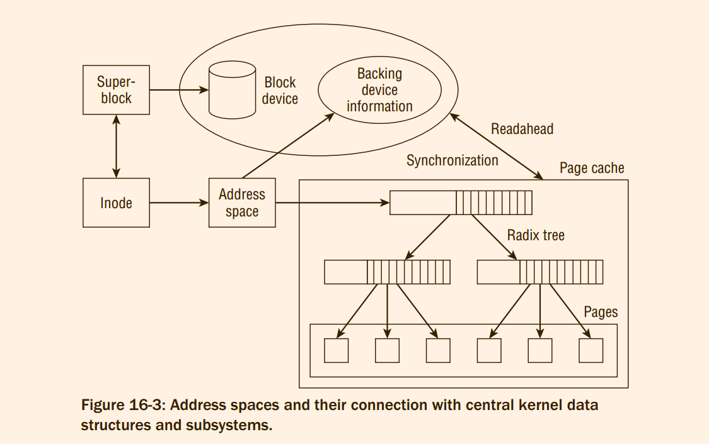
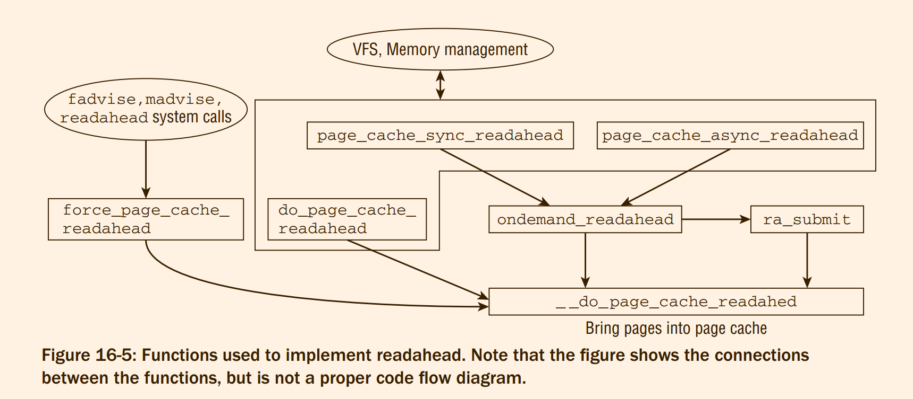

# Professional Linux Kernel Architecture : Page and Buffer Cache
However, caching has its downside and must be employed judiciously by the kernel:
1. Usually there is far less RAM capacity than block device capacity so that only carefully
selected data may be cached.
2. The memory areas used for caching are not exclusively reserved for ‘‘normal‘‘ application
data. This reduces the RAM capacity that is effectively available.
> 如何区分，通过`GFP_`的flag位吗?
3. If the system crashes (owing to a power outage, e.g.), the caches may contain data that have
not been written back to the underlying block device. Such data are irretrievably lost.

The **slab cache** is a *memory-to-memory cache* whose purpose is not to accelerate operations on slower
devices but to make simpler and more effective use of existing resources.

The **dentry cache** is also used to
dispense with the need to access slow block devices but cannot be put to general use since it is specialized
to handle a single data type.
> 以上是两种前面章节中间提到使用cache机制的结构，而且都是缓存特殊数据结构


The kernel features two general caching options for block devices:
1. page cache
2. block cache

In many scenarios, page and buffer caches are used in **combination**. For example, a cached page is divided
into various buffers during write operations so that the modified parts of the page can be more finely
grained. This has **advantages** when the data are written back because only the modified part of the page
and not the whole page need be transferred back to the underlying block device


## 16.1 Structure of the Page Cache
As its name suggests, the page cache deals with memory pages that divide virtual memory and RAM
memory into small segments. This not only makes it easier for the kernel to manipulate the large address
space, but also supports a whole series of functions such as ***paging***, ***demand loading***, ***memory mapping***,
and the like. The **task of the page cache** is to obtain some of the available physical page frames to speed
up the operations performed on block devices on a page basis
> @todo 将page cache 和 page fault 之间的联系找到


#### 16.1.1 Managing and Finding Cached Pages

The tree itself consists of **two different data structures** and **a further data structure** to
represent the leaves and hold the useful data. Because memory pages must be organized, the leaves are
instances of the page structure in this case, a fact that is of no further importance in the implementation
of the tree.
> radix_tree 的value 是page
> so what are the three data structure ?

(The kernel sources do not define a particular data type but use a void pointer; this means
that radix trees could also be used for other purposes, although this is not done at present.)
> radix tree 目前不仅限于使用 page cache


It is important that the tags are not only set
in the leaf elements, but also all the way up to the root element. If at least one pointer in level n + 1 has a
tag set, then the pointer on level n will also acquire the tag.
> tag 向下具有压制性。


Recall from Chapter 3 that each page as represented by an instance of struct page is equipped with a
set of flags. These also include dirty and writeback flags. The information in the radix tree tags therefore
only augments kernel knowledge. Page cache tags are useful to quickly determine if at least one page in
a region is dirty or under writeback without scanning all pages in the whole region. They are, however,
no replacement for the direct page flags
> 为了加快操作，所以在其中添加tag

#### 16.1.2 Writing Back Modified Data
Here we are interested
only in the situation as seen by the page cache, which is primarily concerned with one specific question:
at which point in time should the data be written back? This automatically includes the question as to how
often should writeback take place

> 所以使用radix tree 到底存放何种类型的page.

the kernel provides several parallel synchronization alternatives:
1. Several special kernel daemons called `pdflush` run in the background and are activated
periodically — regardless of the current situation in the page cache. They scan the pages in the
cache and write back the data that have not been synchronized with the underlying block device
for a specific period.
Earlier kernel versions employed a userspace daemon named `kudpated` for this purpose, and
this name is still commonly used to describe this mechanism.
2. A second operating mode of `pdflush` is activated by the kernel if the number of modified data
items in a cache has increased substantially within a short period.
3. `System calls` are available to users and applications to instruct the kernel to write back all nonsynchronized data. The best known is the sync call because there is also a userspace tool of the
same name that builds on it.
> 周期性，被动触发，用户层

To manage the various target objects that can be processed and cached in whole pages, the kernel uses
an abstraction of the ‘‘**address space**‘‘that associates the pages in memory with a specific block device (or
any other system unit or part of a system unit)


## 16.2 Structure of the Buffer Cache
As a result of the ever increasing trend toward generic file access methods implemented by means of
page-based operations, the buffer cache has lost much of its importance as a central system cache, and the
main caching burden is now **placed firmly on the page cache**. Additionally, the standard data structure
for block-based I/O is **not a buffer anymore**, but `struct bio` as discussed in Chapter 6

Buffers are kept for small I/O transfers with block size granularity. This is often required by filesystems
to handle their metadata. Transfer of raw data is done in a page-centric fashion, and **the implementation
of buffers is also on top of the page cache**.
The buffer cache consists of two structural units:
1. A `buffer head` holds all management data relating to the state of the buffer
including information on block number, block size, access counter, and so on, discussed below. These data are
not stored directly after the buffer head but in a separate area of RAM memory indicated by
a corresponding pointer in the buffer head structure.
2. The useful data are held in specially reserved pages that **may also reside in the page cache**.

**The buffer cache operates independently of the page cache, not in addition to it**.
To this end,
buffer heads — the data structure is the same in buffer caches and page caches — are grouped together
in an array of constant size whose individual entries are managed on a least recently used basis.

## 16.3 Address Spaces
Whereas in the early
days of Linux and other Unix derivatives, inodes were the **only** objects that acted as the starting point
for obtaining data from cache contents, the kernel now uses **much more general** address spaces that establish the **link**
between cached data and the objects and devices required to obtain the data.
> address_space 是建立 cached data 和 设备之间的关系的

How do address spaces fit into the structures of the page cache? They implement a translation mechanism
between two units:
1. Pages in main memory are allocated to each address space. The contents of these pages can
be manipulated by user processes or by the kernel itself using a variety of methods.
These data represent the contents of the cache.
2. The **backing store** specifies the sources from which the address space pages are filled. Address
spaces relate to the virtual address space of the processor and are a **mapping** of the segment
managed by the processor in virtual memory and the corresponding positions on a source
device (using a block device).
**If a position in virtual memory that is not associated with a physical page in memory is
accessed, the kernel can refer to the address space structure to discover from where the data
must be read.**

Address spaces are one of the most crucial data structures in the kernel. Their management has evolved
to one of the central issues faced by the kernel. Numerous subsystems (**filesystems**, **swapping**, **synchronization**, **caching**) are centered around the concept of an address space.
They can therefore be regarded
as one of the fundamental abstraction mechanisms of the kernel, and range in importance among the
traditional abstractions like processes and files


#### 16.3.1 Data Structures
```c
struct address_space {
	struct inode		*host;		/* owner: inode, block_device */
	struct radix_tree_root	page_tree;	/* radix tree of all pages */
	spinlock_t		tree_lock;	/* and lock protecting it */
	atomic_t		i_mmap_writable;/* count VM_SHARED mappings */
	struct rb_root		i_mmap;		/* tree of private and shared mappings */
	struct rw_semaphore	i_mmap_rwsem;	/* protect tree, count, list */
	/* Protected by tree_lock together with the radix tree */
	unsigned long		nrpages;	/* number of total pages */
	unsigned long		nrshadows;	/* number of shadow entries */
	pgoff_t			writeback_index;/* writeback starts here */
	const struct address_space_operations *a_ops;	/* methods */
	unsigned long		flags;		/* error bits/gfp mask */
	spinlock_t		private_lock;	/* for use by the address_space */
	struct list_head	private_list;	/* ditto */
	void			*private_data;	/* ditto */
} __attribute__((aligned(sizeof(long))));
```
1. The link with the areas managed by an address space is established by means of a pointer to
an inode instance (of type `struct inode`) to specify the backing store and a root radix tree
(`page_tree`) with a list of all physical memory pages in the address space.
> 一个inode对应一个tree的page
2. The total number of cached pages is held in the `nrpages` counter variable
3. `address_space_operations` is a pointer to a structure that contains a list of function pointers to
specific operations for handling address spaces. Its definition is discussed below.
4. `i_mmap` is the root element of a tree that holds all normal memory mappings of the inode (normal
in the sense that they were not created using the nonlinear mapping mechanism). The task of the
tree is to support finding all memory regions that include at least one page in a given interval,
and the auxiliary macro `vma_prio_tree_foreach` is provided for this purpose. *Recall that the
purpose of the tree is discussed in Section 4.4.3*. The details of tree implementation are of no
relevance to us at the moment — **it is sufficient to know that all pages of the mapping can be
found on the tree and that the structure can be manipulated easily.**
> 用于查找 all memory regions 来实现

5. Two further elements are concerned with the management of memory mappings:
`i_mmap_writeable` counts all mappings created with a set `VM_SHARED` attribute so that
they can be shared by several users at the same time. `i_mmap_nonlinear` is used to set up a list
of all pages included in nonlinear mappings (reminder: nonlinear mappings are generated by
skillful manipulation of the page tables under the control of the `remap_file_pages` system call).
6. `backing_dev_info` is a pointer to a further structure that holds information on the associated backing store.
Backing store is the name used for the peripheral device that serves as a ‘‘backbone‘‘ for the information present in the address space.
> 实际上，`i_mmap_nonlinear`,`i_mmap_writeable` ,`backing_dev_info`都是没有的东西。

7. `private_list` is used to interlink `buffer_head` instances which hold filesystem metadata (usually indirection blocks). `assoc_mapping` is a pointer to the associated address space.
8. The flag set in `flags` is used primarily to hold information on the GFP memory area from
which the mapped pages originate. It can also hold errors that occur during asynchronous
input/output and that cannot therefore be propagated directly. `AS_EIO` stands for a general I/O
error, and `AS_ENOSPC` indicates that there is no longer sufficient space for an asynchronous write
operation.




#### 16.3.2 Page Trees
The kernel uses radix trees to manage all pages associated with an address space at least possible cost.
```c
struct radix_tree_node {
	unsigned int	path;	/* Offset in parent & height from the bottom */
	unsigned int	count;
	union {
		struct {
			/* Used when ascending tree */
			struct radix_tree_node *parent;
			/* For tree user */
			void *private_data;
		};
		/* Used when freeing node */
		struct rcu_head	rcu_head;
	};
	/* For tree user */
	struct list_head private_list;
	void __rcu	*slots[RADIX_TREE_MAP_SIZE];
	unsigned long	tags[RADIX_TREE_MAX_TAGS][RADIX_TREE_TAG_LONGS];
};
```

```c
/* root tags are stored in gfp_mask, shifted by __GFP_BITS_SHIFT */
struct radix_tree_root {
	unsigned int		height;
	gfp_t			gfp_mask;
	struct radix_tree_node	__rcu *rnode;
};

```

This approach is a compromise between simple,
unified data structures (no explicit lists are needed to hold pages with different states) and the option of
performing a quick search for pages with specific properties. Currently, two tags are supported:
1. `PAGECACHE_TAG_DIRTY` specifies whether a page is dirty.
2. `PAGECACHE_TAG_WRITEBACK` indicates that the page is being written back at the moment

The tagging information is stored in a two-dimensional array (tags) that is a part of radix_tree_node.
The first array dimension distinguishes between the possible tags, and the second contains a sufficient
number of elements of unsigned longs so that there is a bit for each page that can be organized in the
node.
> 因为含有多个tag, 所以使用二维数组。


```c
/**
 *	radix_tree_tag_set - set a tag on a radix tree node
 *	@root:		radix tree root
 *	@index:		index key
 *	@tag: 		tag index
 *
 *	Set the search tag (which must be < RADIX_TREE_MAX_TAGS)
 *	corresponding to @index in the radix tree.  From
 *	the root all the way down to the leaf node.
 *
 *	Returns the address of the tagged item.   Setting a tag on a not-present
 *	item is a bug.
 */
void *radix_tree_tag_set(struct radix_tree_root *root,
			unsigned long index, unsigned int tag)
```
In order to find all pages with a certain tag, the kernel still has to scan the entire tree, but this operation
can be accelerated by first filtering out all subtrees that contain at least one page for which the flag is set.
Again, this can be speeded up because the kernel does not check each bit one after the other but simply
checks whether at least one of the unsigned long variables in which the bits are stored is greater than 1:
> 非常的迷，这些加速实现的原因是什么。
> 根本不关心到底怎么实现，只是关心持有什么东西，查询什么东西 ?

#### 16.3.3 Operations on Address Spaces
Address spaces connect backing stores with memory segments.
```c
struct address_space_operations {
	int (*writepage)(struct page *page, struct writeback_control *wbc);
	int (*readpage)(struct file *, struct page *);

	/* Write back some dirty pages from this mapping. */
	int (*writepages)(struct address_space *, struct writeback_control *);

	/* Set a page dirty.  Return true if this dirtied it */
	int (*set_page_dirty)(struct page *page);

	int (*readpages)(struct file *filp, struct address_space *mapping,
			struct list_head *pages, unsigned nr_pages);

	int (*write_begin)(struct file *, struct address_space *mapping,
				loff_t pos, unsigned len, unsigned flags,
				struct page **pagep, void **fsdata);
	int (*write_end)(struct file *, struct address_space *mapping,
				loff_t pos, unsigned len, unsigned copied,
				struct page *page, void *fsdata);

	/* Unfortunately this kludge is needed for FIBMAP. Don't use it */
	sector_t (*bmap)(struct address_space *, sector_t);
	void (*invalidatepage) (struct page *, unsigned int, unsigned int);
	int (*releasepage) (struct page *, gfp_t);
	void (*freepage)(struct page *);
	ssize_t (*direct_IO)(struct kiocb *, struct iov_iter *iter, loff_t offset);
	/*
	 * migrate the contents of a page to the specified target. If
	 * migrate_mode is MIGRATE_ASYNC, it must not block.
	 */
	int (*migratepage) (struct address_space *,
			struct page *, struct page *, enum migrate_mode);
	int (*launder_page) (struct page *);
	int (*is_partially_uptodate) (struct page *, unsigned long,
					unsigned long);
	void (*is_dirty_writeback) (struct page *, bool *, bool *);
	int (*error_remove_page)(struct address_space *, struct page *);

	/* swapfile support */
	int (*swap_activate)(struct swap_info_struct *sis, struct file *file,
				sector_t *span);
	void (*swap_deactivate)(struct file *file);
};
```
1. `writepage` and `writepages` write one or more pages of the address space back to the underlying
block device. This is done by delegating a corresponding request to the block layer.
The kernel makes a number of standard functions available for this purpose [`block_write_full_page` and `mpage_readpage(s)`];
these are typically used instead of a manual implementation. Section 16.4.4 discusses the functions of the `mpage_` family.
2. `readpage` and `readpages` read one or more consecutive pages from the backing store into a
page frame. `readpage` and `readpages` are likewise not usually implemented manually but are
executed by standard functions of the kernel (`mpage_readpage` and `mpage_readpages`) that can
be used for most purposes.
Notice that the `file` argument of `readpage` is not required if the standard functions are used to
implement the desired functionality because the inode associated with the desired page can be
determined via `page->mapping->host`
3. `sync_page` performs synchronization of data that have not yet been written back to the backing store.
Unlike `writepage`, the function operates on block layer level and attempts to perform
pending write requests still held in buffers in this layer. In contrast, `writepage` operates on the
address space layer and simply forwards the data to the block layer without bothering about
active buffering there.
The kernel provides the standard function `block_sync_page`, which obtains the address space
mapping that belongs to the page in question and unplugs the block device queue to start I/O.
4. `set_page_dirty` allows an address space to provide a specific method of marking a page as
dirty. However, this option is rarely used. In this case, the kernel automatically uses `ccode__set_page_dirty_buffers`
to simultaneously mark the page as dirty on the buffer level and to add it to
the `dirty_pages` list of the current mapping.
5. `prepare_write` and `commit_write` perform write operations triggered by the write system call.
To cater to the special features of journaling filesystems, this operation must be split into two
parts: `prepare_write` stores the transaction data in the journal, and `commit_write` performs the
actual write operation by sending the appropriate commands to the block layer.
When data are written, the kernel must ensure that the two functions are always invoked in pairs
and in the correct sequence as otherwise the journal mechanism serves no purpose.
It has by now become common practice that even non-journaling filesystems (like Ext2) split
writing into two parts.
6. `write_begin` and `write_end` are replacements for `prepare_write` and `commit_write`.
While the intention of the functions is identical, the required parameters and especially the way in which locking of involved objects is handled have changed. Since
Documentation/filesystems/vfs.txt provides a detailed description of how the functions
operate, nothing more needs to be added here.
7. `bmap` maps a logical block offset within an address space to a physical block number. This is usually straightforward for block devices, but since files are in general not represented by a linear
number of blocks on a device, the required information cannot be determined otherwise.
bmap is required by the swap code (see Section 18.3.3), the FIBMAP file ioctl, and internally by
some filesystems.
8. releasepage prepares page release in journaling filesystems.
9. `invalidatepage` is called if a page is going to be removed from the address space and buffers
are associated with it as signalized by the PG_Private flag.
10. `direct_IO` is used to implement direct read and write access. This bypasses buffering in the
block layer and allows an application to communicate very directly with a block device. Large
databases make frequent use of this feature as they are better able to forecast future input and
output than the generic mechanisms of the kernel and can therefore achieve better results by
implementing their own caching mechanisms.
11. `get_xip_page` is used for the execute-in-place mechanism that can launch executable code without having to first load it into the page cache. This is useful on, for example, memory-based
filesystems such as a RAM disk or on small systems with little memory that can address ROM
areas containing filesystems directly via the CPU. As this mechanism is seldom used, it need not
be discussed at length.
12. `migrate_page` is used if the kernel wants to relocate a page, that is, move contents of one page
onto another page. Since pages are often equipped with private data, it is not just sufficient to
copy the raw information from the old to the new page. Moving pages is, for instance, required
to support memory hotplugging.
13. `launder_page` offers a last chance to write back a dirty page before it is freed.


 Many functions consist of few lines and delegate work to the generic helper functions of
the kernel

The structure of the `address_space_operations` instance of the shared-memory filesystem is particularly
simple since only two fields need to be filled with non-NULL pointers:
With which backing store does the kernel operate in this case?
Memory from the shared-memory filesystem is totally independent of a specific
block device because all files of the filesystem are generated dynamically
and do not reside on any
original block device.

```c
static const struct address_space_operations shmem_aops = {
	.writepage	= shmem_writepage,
	.set_page_dirty	= __set_page_dirty_no_writeback,
#ifdef CONFIG_TMPFS
	.write_begin	= shmem_write_begin,
	.write_end	= shmem_write_end,
#endif
#ifdef CONFIG_MIGRATION
	.migratepage	= migrate_page,
#endif
	.error_remove_page = generic_error_remove_page,
};
```
> shmem 的addresss_space的特殊性


Since access to block devices need not always be made by way of filesystems but may also apply to raw
devices, there are address space operations to support the direct manipulation of the contents of block
devices (this kind of access is required, e.g., when creating filesystems from within userspace)

```c
static const struct address_space_operations def_blk_aops = {
	.readpage	= blkdev_readpage,
	.readpages	= blkdev_readpages,
	.writepage	= blkdev_writepage,
	.write_begin	= blkdev_write_begin,
	.write_end	= blkdev_write_end,
	.writepages	= blkdev_writepages,
	.releasepage	= blkdev_releasepage,
	.direct_IO	= blkdev_direct_IO,
	.is_dirty_writeback = buffer_check_dirty_writeback,
};
```
> 不经过filesystem,而是直接在设备上操作

> 同时也说明了其中的关于ext2/3/4 的 address_space_operations 的操作。

## 16.4 Implementation of the Page Cache

#### 16.4.1 Allocating Pages
> 一共划分为两个步骤，从buddy system中间获取pages,然后将pages注入到address_space 中间
> 也就是 page_cache_alloc 和 add_to_page_cache 两个函数

Adding the new page to the page cache is a little more complicated and falls under the responsibility of
`add_to_page_cache`. Here, `radix_tree_insert` inserts the page instance associated with the page into
the radix tree of the address space involved:

An alternative function named `add_to_page_cache_lru` with identical prototype is also available. This
first invokes `add_to_page_cache` to add a page to the address space-specific page cache before also
adding the page to the system’s LRU cache using the `lru_cache_add` function.
```c
static int __add_to_page_cache_locked(struct page *page,
				      struct address_space *mapping,
				      pgoff_t offset, gfp_t gfp_mask,
				      void **shadowp)
{
	int huge = PageHuge(page);
	struct mem_cgroup *memcg;
	int error;

	VM_BUG_ON_PAGE(!PageLocked(page), page);
	VM_BUG_ON_PAGE(PageSwapBacked(page), page);

	if (!huge) {
		error = mem_cgroup_try_charge(page, current->mm,
					      gfp_mask, &memcg, false);
		if (error)
			return error;
	}

	error = radix_tree_maybe_preload(gfp_mask & GFP_RECLAIM_MASK); // 关键位置A
	if (error) {
		if (!huge)
			mem_cgroup_cancel_charge(page, memcg, false);
		return error;
	}

	get_page(page);
	page->mapping = mapping; // 关键位置
	page->index = offset;

	xa_lock_irq(&mapping->i_pages);
	error = page_cache_tree_insert(mapping, page, shadowp); // 关键位置B
	radix_tree_preload_end();
	if (unlikely(error))
		goto err_insert;

	/* hugetlb pages do not participate in page cache accounting. */
	if (!huge)
		__inc_node_page_state(page, NR_FILE_PAGES);
	xa_unlock_irq(&mapping->i_pages);
	if (!huge)
		mem_cgroup_commit_charge(page, memcg, false, false);
	trace_mm_filemap_add_to_page_cache(page);
	return 0;
err_insert:
	page->mapping = NULL;
	/* Leave page->index set: truncation relies upon it */
	xa_unlock_irq(&mapping->i_pages);
	if (!huge)
		mem_cgroup_cancel_charge(page, memcg, false);
	put_page(page);
	return error;
}
```
> 经过简单的上锁等包装之后，最后到达实际处理的函数


#### 16.4.2 Finding Pages
```c
/**
 * pagecache_get_page - find and get a page reference
 * @mapping: the address_space to search
 * @offset: the page index
 * @fgp_flags: PCG flags
 * @gfp_mask: gfp mask to use for the page cache data page allocation
 *
 * Looks up the page cache slot at @mapping & @offset.
 *
 * PCG flags modify how the page is returned.
 *
 * FGP_ACCESSED: the page will be marked accessed
 * FGP_LOCK: Page is return locked
 * FGP_CREAT: If page is not present then a new page is allocated using
 *		@gfp_mask and added to the page cache and the VM's LRU
 *		list. The page is returned locked and with an increased
 *		refcount. Otherwise, %NULL is returned.
 *
 * If FGP_LOCK or FGP_CREAT are specified then the function may sleep even
 * if the GFP flags specified for FGP_CREAT are atomic.
 *
 * If there is a page cache page, it is returned with an increased refcount.
 */
struct page *pagecache_get_page(struct address_space *mapping, pgoff_t offset,
	int fgp_flags, gfp_t gfp_mask)
{
	struct page *page;

repeat:
	page = find_get_entry(mapping, offset);
	if (radix_tree_exceptional_entry(page))
		page = NULL;
	if (!page)
		goto no_page;

	if (fgp_flags & FGP_LOCK) {
		if (fgp_flags & FGP_NOWAIT) {
			if (!trylock_page(page)) {
				page_cache_release(page);
				return NULL;
			}
		} else {
			lock_page(page);
		}

		/* Has the page been truncated? */
		if (unlikely(page->mapping != mapping)) {
			unlock_page(page);
			page_cache_release(page);
			goto repeat;
		}
		VM_BUG_ON_PAGE(page->index != offset, page);
	}

	if (page && (fgp_flags & FGP_ACCESSED))
		mark_page_accessed(page);

no_page:
	if (!page && (fgp_flags & FGP_CREAT)) {
		int err;
		if ((fgp_flags & FGP_WRITE) && mapping_cap_account_dirty(mapping))
			gfp_mask |= __GFP_WRITE;
		if (fgp_flags & FGP_NOFS)
			gfp_mask &= ~__GFP_FS;

		page = __page_cache_alloc(gfp_mask);
		if (!page)
			return NULL;

		if (WARN_ON_ONCE(!(fgp_flags & FGP_LOCK)))
			fgp_flags |= FGP_LOCK;

		/* Init accessed so avoid atomic mark_page_accessed later */
		if (fgp_flags & FGP_ACCESSED)
			__SetPageReferenced(page);

		err = add_to_page_cache_lru(page, mapping, offset, gfp_mask);
		if (unlikely(err)) {
			page_cache_release(page);
			page = NULL;
			if (err == -EEXIST)
				goto repeat;
		}
	}

	return page;
}
EXPORT_SYMBOL(pagecache_get_page);


/**
 * find_get_page - find and get a page reference
 * @mapping: the address_space to search
 * @offset: the page index
 *
 * Looks up the page cache slot at @mapping & @offset.  If there is a
 * page cache page, it is returned with an increased refcount.
 *
 * Otherwise, %NULL is returned.
 */
static inline struct page *find_get_page(struct address_space *mapping,
					pgoff_t offset)
{
	return pagecache_get_page(mapping, offset, 0, 0);
}


/**
 * find_or_create_page - locate or add a pagecache page
 * @mapping: the page's address_space
 * @index: the page's index into the mapping
 * @gfp_mask: page allocation mode
 *
 * Looks up the page cache slot at @mapping & @offset.  If there is a
 * page cache page, it is returned locked and with an increased
 * refcount.
 *
 * If the page is not present, a new page is allocated using @gfp_mask
 * and added to the page cache and the VM's LRU list.  The page is
 * returned locked and with an increased refcount.
 *
 * On memory exhaustion, %NULL is returned.
 *
 * find_or_create_page() may sleep, even if @gfp_flags specifies an
 * atomic allocation!
 */
static inline struct page *find_or_create_page(struct address_space *mapping,
					pgoff_t offset, gfp_t gfp_mask)
{
	return pagecache_get_page(mapping, offset,
					FGP_LOCK|FGP_ACCESSED|FGP_CREAT,
					gfp_mask);
}


/**
 * find_lock_page - locate, pin and lock a pagecache page
 * @mapping: the address_space to search
 * @offset: the page index
 *
 * Looks up the page cache slot at @mapping & @offset.  If there is a
 * page cache page, it is returned locked and with an increased
 * refcount.
 *
 * Otherwise, %NULL is returned.
 *
 * find_lock_page() may sleep.
 */
static inline struct page *find_lock_page(struct address_space *mapping,
					pgoff_t offset)
{
	return pagecache_get_page(mapping, offset, FGP_LOCK, 0);
}
```

Life is easy for the page cache because all the hard work is done by the radix tree implementation:
`radix_tree_lookup` finds the desired page at a given offset, and `page_cache_get` increments the page’s
reference count if one was found.

Two auxiliary functions are provided for convenience,
`find_or_create_page` does what the name promises — it looks up a page in the page cache and
allocates a fresh one if it is not there. The page is inserted into the cache and the LRU list by calling
`add_to_page_cache_lru`.

It is also possible to search for more than one page. Here are the prototypes of the responsible auxiliary
functions:
```c
unsigned find_get_pages(struct address_space *mapping, pgoff_t start,
unsigned int nr_pages, struct page **pages);
unsigned find_get_pages_contig(struct address_space *mapping, pgoff_t start,
unsigned int nr_pages, struct page **pages);
unsigned find_get_pages_tag(struct address_space *mapping, pgoff_t *index,
int tag, unsigned int nr_pages, struct page **pages);
```
1. `find_get_pages` returns up to nr_pages pages in the mapping starting from the page cache offset start. Pointers to the pages are placed on the array pages. The function does not guarantee
to return a continuous range of pages — there can be holes for non-present pages. The return
value is the number of pages that were found.
2. `find_get_pages_contig` works similarly to `find_get_pages`, but the selected page range is
guaranteed to be continuous. The function stops to add pages to the page array when the first
hole is discovered.
3. `find_get_pages_tag` operates like `find_pages`, but only selects pages that have a specific tag
set. Additionally, the index parameter points to the page cache index of the page that immediately follows the last page in the resulting page array.


> 总之就是介绍了各种各样的，对于 pagecache_get_page　的封装函数。

#### 16.4.3 Waiting on Pages

The kernel often needs to wait on pages until their status has changed to some desired value. The synchronization implementation, for instance, sometimes wants to ensure that writing back a page has been
finished and the contents in memory are identical with the data on the underlying block device. Pages
under writeback have the `PG_writeback` bit set.
```c
/*
 * Wait for a page to complete writeback
 */
static inline void wait_on_page_writeback(struct page *page)
{
	if (PageWriteback(page))
		wait_on_page_bit(page, PG_writeback);
}

void wait_on_page_bit(struct page *page, int bit_nr)
{
	wait_queue_head_t *q = page_waitqueue(page);
	wait_on_page_bit_common(q, page, bit_nr, TASK_UNINTERRUPTIBLE, false);
}
EXPORT_SYMBOL(wait_on_page_bit);


/*
 * In order to wait for pages to become available there must be
 * waitqueues associated with pages. By using a hash table of
 * waitqueues where the bucket discipline is to maintain all
 * waiters on the same queue and wake all when any of the pages
 * become available, and for the woken contexts to check to be
 * sure the appropriate page became available, this saves space
 * at a cost of "thundering herd" phenomena during rare hash
 * collisions.
 */
#define PAGE_WAIT_TABLE_BITS 8
#define PAGE_WAIT_TABLE_SIZE (1 << PAGE_WAIT_TABLE_BITS)
static wait_queue_head_t page_wait_table[PAGE_WAIT_TABLE_SIZE] __cacheline_aligned;

static wait_queue_head_t *page_waitqueue(struct page *page)
{
	return &page_wait_table[hash_ptr(page, PAGE_WAIT_TABLE_BITS)];
}
```
> @todo wait queue 之类的东西现在的内容尚且没有摸清楚:
> 1. wait queue 和 在关键的数据上面上锁，然后由于遇到锁了，然后被加入到队列中间的过程有什么区别

`wait_on_page_bit` installs a wait queue on which the process can sleep until the `PG_writeback` bit is
removed from the page flags.

#### 16.4.4 Operations with Whole Pages
Modern block devices can — despite their name — transfer not just individual blocks but much larger
units of data in a single operation, thus boosting system performance.
This is reflected by a strong kernel focus on algorithms and structures that use pages as the elementary units of transfer between block
devices and memory.*Buffer-by-buffer transfer acts as a substantial brake on performance when handling
complete pages*.
> what's buffer-by-buffer transfer

Four new functions were
added to the kernel to support the reading and writing of one or more pages:
```c
int mpage_readpages(struct address_space *mapping, struct list_head *pages, unsigned nr_pages, get_block_t get_block)
int mpage_writepages(struct address_space *mapping, struct writeback_control *wbc, get_block_t get_block)
```


```c
/**
 * mpage_readpages - populate an address space with some pages & start reads against them
 * @mapping: the address_space
 * @pages: The address of a list_head which contains the target pages.  These
 *   pages have their ->index populated and are otherwise uninitialised.
 *   The page at @pages->prev has the lowest file offset, and reads should be
 *   issued in @pages->prev to @pages->next order.
 * @nr_pages: The number of pages at *@pages
 * @get_block: The filesystem's block mapper function.
 *
 * This function walks the pages and the blocks within each page, building and
 * emitting large BIOs.
 *
 * If anything unusual happens, such as:
 *
 * - encountering a page which has buffers
 * - encountering a page which has a non-hole after a hole
 * - encountering a page with non-contiguous blocks
 *
 * then this code just gives up and calls the buffer_head-based read function.
 * It does handle a page which has holes at the end - that is a common case:
 * the end-of-file on blocksize < PAGE_SIZE setups.
 *
 * BH_Boundary explanation:
 *
 * There is a problem.  The mpage read code assembles several pages, gets all
 * their disk mappings, and then submits them all.  That's fine, but obtaining
 * the disk mappings may require I/O.  Reads of indirect blocks, for example.
 *
 * So an mpage read of the first 16 blocks of an ext2 file will cause I/O to be
 * submitted in the following order:
 *
 * 	12 0 1 2 3 4 5 6 7 8 9 10 11 13 14 15 16
 *
 * because the indirect block has to be read to get the mappings of blocks
 * 13,14,15,16.  Obviously, this impacts performance.
 *
 * So what we do it to allow the filesystem's get_block() function to set
 * BH_Boundary when it maps block 11.  BH_Boundary says: mapping of the block
 * after this one will require I/O against a block which is probably close to
 * this one.  So you should push what I/O you have currently accumulated.
 *
 * This all causes the disk requests to be issued in the correct order.
 */
int
mpage_readpages(struct address_space *mapping, struct list_head *pages,
				unsigned nr_pages, get_block_t get_block)
{
	struct mpage_readpage_args args = {
		.get_block = get_block,
		.is_readahead = true,
	};
	unsigned page_idx;

	for (page_idx = 0; page_idx < nr_pages; page_idx++) {
		struct page *page = lru_to_page(pages);

		prefetchw(&page->flags);
		list_del(&page->lru);
		if (!add_to_page_cache_lru(page, mapping,
					page->index,
					readahead_gfp_mask(mapping))) {
			args.page = page;
			args.nr_pages = nr_pages - page_idx;
			args.bio = do_mpage_readpage(&args);
		}
		put_page(page);
	}
	BUG_ON(!list_empty(pages));
	if (args.bio)
		mpage_bio_submit(REQ_OP_READ, REQ_RAHEAD, args.bio);
	return 0;
}
EXPORT_SYMBOL(mpage_readpages);

/*
 * This isn't called much at all
 */
int mpage_readpage(struct page *page, get_block_t get_block)
{
	struct mpage_readpage_args args = {
		.page = page,
		.nr_pages = 1,
		.get_block = get_block,
	};

	args.bio = do_mpage_readpage(&args);
	if (args.bio)
		mpage_bio_submit(REQ_OP_READ, 0, args.bio);
	return 0;
}
EXPORT_SYMBOL(mpage_readpage);


/**
 * mpage_writepages - walk the list of dirty pages of the given address space & writepage() all of them
 * @mapping: address space structure to write
 * @wbc: subtract the number of written pages from *@wbc->nr_to_write
 * @get_block: the filesystem's block mapper function.
 *             If this is NULL then use a_ops->writepage.  Otherwise, go
 *             direct-to-BIO.
 *
 * This is a library function, which implements the writepages()
 * address_space_operation.
 *
 * If a page is already under I/O, generic_writepages() skips it, even
 * if it's dirty.  This is desirable behaviour for memory-cleaning writeback,
 * but it is INCORRECT for data-integrity system calls such as fsync().  fsync()
 * and msync() need to guarantee that all the data which was dirty at the time
 * the call was made get new I/O started against them.  If wbc->sync_mode is
 * WB_SYNC_ALL then we were called for data integrity and we must wait for
 * existing IO to complete.
 */
int
mpage_writepages(struct address_space *mapping,
		struct writeback_control *wbc, get_block_t get_block)
{
	struct blk_plug plug;
	int ret;

	blk_start_plug(&plug);

	if (!get_block)
		ret = generic_writepages(mapping, wbc);
	else {
		struct mpage_data mpd = {
			.bio = NULL,
			.last_block_in_bio = 0,
			.get_block = get_block,
			.use_writepage = 1,
		};

		ret = write_cache_pages(mapping, wbc, __mpage_writepage, &mpd);
		if (mpd.bio) {
			int op_flags = (wbc->sync_mode == WB_SYNC_ALL ?
				  REQ_SYNC : 0);
			mpage_bio_submit(REQ_OP_WRITE, op_flags, mpd.bio);
		}
	}
	blk_finish_plug(&plug);
	return ret;
}
EXPORT_SYMBOL(mpage_writepages);

int mpage_writepage(struct page *page, get_block_t get_block,
	struct writeback_control *wbc)
{
	struct mpage_data mpd = {
		.bio = NULL,
		.last_block_in_bio = 0,
		.get_block = get_block,
		.use_writepage = 0,
	};
	int ret = __mpage_writepage(page, wbc, &mpd);
	if (mpd.bio) {
		int op_flags = (wbc->sync_mode == WB_SYNC_ALL ?
			  REQ_SYNC : 0);
		mpage_bio_submit(REQ_OP_WRITE, op_flags, mpd.bio); // 提交过程
	}
	return ret;
}
EXPORT_SYMBOL(mpage_writepage);
```

When `do_mpage_readpage` builds the bio request, the BIO data of the preceding pages are also included
so that a combined request can be constructed. If several successive pages are to be read from the block
device, this can be done in a single request rather than submitting an individual request for each page.
Notice that the `buffer_head` passed to `do_mpage_readpage` is usually not required. However, if an
unusual situation is encountered (e.g., a page that contains buffers),
then it falls back to using the oldfashioned, blockwise read routines.
If, at the end of the loop, a BIO request is left unprocessed by `do_mpage_readpage`, it is now submitted.

```c
/*
 * This is the worker routine which does all the work of mapping the disk
 * blocks and constructs largest possible bios, submits them for IO if the
 * blocks are not contiguous on the disk.
 *
 * We pass a buffer_head back and forth and use its buffer_mapped() flag to
 * represent the validity of its disk mapping and to decide when to do the next
 * get_block() call.
 */
static struct bio *do_mpage_readpage(struct mpage_readpage_args *args)
```

#### 16.4.5 Page Cache Readahead
Naturally readahead cannot be tackled by the page cache alone,
but support by the **VFS** and **memory management** layers is required.
***In fact, the read-ahead mechanism was discussed in Sections 8.5.2
and 8.5.1***. Recall that readahead is controlled from three places as far as the kernel is directly concerned.
1. `do_generic_mapping_read`, a generic read routine in which most filesystems that rely on the
standard routines of the kernel to read data end up at some point.
2. The page fault handler `filemap_fault`, which is responsible to read missing pages for memory mappings.
3. `__generic_file_splice_read`, a routine invoked to support the **splice** system call that
allows for passing data between two file descriptors directly in kernel space, without the
need to involve userspace.


Several functions are used to implement the readahead mechanism. Figure 16-5 shows how they are
connected with each other



```c
/*
 * Track a single file's readahead state
 */
struct file_ra_state {
	pgoff_t start;			/* where readahead started */
	unsigned int size;		/* # of readahead pages */
	unsigned int async_size;	/* do asynchronous readahead when
					   there are only # of pages ahead */

	unsigned int ra_pages;		/* Maximum readahead window */
	unsigned int mmap_miss;		/* Cache miss stat for mmap accesses */
	loff_t prev_pos;		/* Cache last read() position */
};
```
> 后面的完全暂时不看，首先有必要好好总结一下前面的内容, 暂时没有兴趣。


> 说明了 page 的添加，查找， 异步操作，多个同时操作，readahead

> 但是，我们的关键问题，这个东西到底是如何被使用的 ?
## 16.5 Implementation of the Buffer Cache
The buffer cache is used not only as an add-on to the page cache but also as an **independent** cache for
objects that are not handled in pages but in blocks.


#### 16.5.1 Data Structures
Fortunately, the data structures for both types of cache — the independent buffer cache and the elements
**used to support the page cache** — are identical, and this greatly simplifies implementation.
> wooo! buffer cache 实现了 page cache !

```c
/*
 * Historically, a buffer_head was used to map a single block
 * within a page, and of course as the unit of I/O through the
 * filesystem and block layers.  Nowadays the basic I/O unit
 * is the bio, and buffer_heads are used for extracting block
 * mappings (via a get_block_t call), for tracking state within
 * a page (via a page_mapping) and for wrapping bio submission
 * for backward compatibility reasons (e.g. submit_bh).
 */
struct buffer_head {
	unsigned long b_state;		/* buffer state bitmap (see above) */
	struct buffer_head *b_this_page;/* circular list of page's buffers */
	struct page *b_page;		/* the page this bh is mapped to */

	sector_t b_blocknr;		/* start block number */
	size_t b_size;			/* size of mapping */
	char *b_data;			/* pointer to data within the page */

	struct block_device *b_bdev;
	bh_end_io_t *b_end_io;		/* I/O completion */
 	void *b_private;		/* reserved for b_end_io */
	struct list_head b_assoc_buffers; /* associated with another mapping */
	struct address_space *b_assoc_map;	/* mapping this buffer is
						   associated with */
	atomic_t b_count;		/* users using this buffer_head */
};
```
`BH_Mapped` means that there is a mapping of the buffer contents on a secondary storage device, as
is the case with all buffers that originate from filesystems or from direct accesses to block devices
> b_state 中一个state 的说明，也许看一下对应的中文吧!

The `buffer_head` structure also includes further elements whose meanings are given below:

#### 16.5.2 Operations
provide functions that can be used as front ends to create and destroy
buffer heads. `alloc_buffer_head` generates a new buffer head, and `free_buffer_head` destroys an
existing head. Both functions are defined in `fs/buffer.c`.

```c
/*
 * Create the appropriate buffers when given a page for data area and
 * the size of each buffer.. Use the bh->b_this_page linked list to
 * follow the buffers created.  Return NULL if unable to create more
 * buffers.
 *
 * The retry flag is used to differentiate async IO (paging, swapping)
 * which may not fail from ordinary buffer allocations.
 */
struct buffer_head *alloc_page_buffers(struct page *page, unsigned long size,
```
> 实际上，alloc_buffer_head 只是 alloc_page_buffers 的辅助函数，而后者继续在buffer.c 中间被调用而已。
> free_buffer_head 调用者很多。

#### 16.5.3 Interaction of Page and Buffer Cache

* **Linking of Pages and Buffer Heads**

The page contents are not modified by the interaction with buffers, as the latter simply provide a new view of the page data.

In this
case, `private`(struct page) points to the first buffer head used to split the page into smaller units. The various buffer
heads are linked in a cyclic list by means of `b_this_page`.

How is the association between the page and the `buffer_head` structures established ?
The kernel provides the `create_empty_buffers` and `link_dev_buffers` functions for this purpose, both of which
are implemented in fs/buffer.c. The latter serves to associate an existing set of buffer heads with a
page, whereas `create_empty_buffers` generates a completely new set of buffers for association with the
page. For example, create_empty_buffers is invoked when reading and writing complete pages with
`block_read_full_page` and `__block_write_full_page`.

> then, 分析了 create_empty_buffers 中间的内容，说明，buffer_head 和 被buffer的数据放在两个地方，page 中间可以buffer 多个数据block, 这些block 的 buffer_head 是链表cycle 的

* **Interaction**

As already noted, some transfer operations to and from block devices may need to be
performed in units whose size depends on the block size of the underlying devices, whereas many
parts of the kernel prefer to carry out I/O operations with page granularity as this makes things much
easier — especially in terms of memory management.11 In this scenario, buffers act as intermediaries
between the two worlds

> 分析重头戏 block_read_full_page 和 block_write_full_page

`block_read_full_page` reads a full page in three steps:
1. The buffers are set up and their state is checked.
2. The buffers are locked to rule out interference by other kernel threads in the next step.
3. The data are transferred to the buffers.
> 创建，上锁，读取。
> 创建包括的内容 : buffer 和 get_block

> skip 一些详细的分析

#### 16.5.4 Independent Buffers
Buffers are used not only in the context of pages.
However, there are still
situations in which access to block device data is performed on the block level and not on the page level
in the view of higher-level code. **To help speed up such operations**, the kernel provides yet another cache
known as an ***LRU buffer*** cache discussed below.

This cache for independent buffers is not totally divorced from the page cache. Since RAM memory
is always managed in pages, buffered blocks must also be held in pages, with the result that there are
some points of contact with the page cache. These cannot and should not be ignored — after all, **access
to individual blocks is still possible via the buffer cache without having to worry about the organization
of the blocks into pages.**

* **Mode of Operation**

* **Implementation**

`__getblk` and `__bread` 类似，区分在于 guarantee 上面。

When is it necessary to read individual blocks? There are not too many points in the kernel where this
must be done, but these are nevertheless of great importance. Filesystems in particular make use of the
routines described above when reading superblocks or management blocks.

The kernel defines two functions to simplify the work of filesystems with individual blocks:
```c
static inline struct buffer_head *
sb_bread(struct super_block *sb, sector_t block)
{
	return __bread_gfp(sb->s_bdev, block, sb->s_blocksize, __GFP_MOVABLE);
}
```
> 好像，就是只有super block 使用了这一个东西

## Reference
#### [thomas krenn](https://www.thomas-krenn.com/en/wiki/Linux_Page_Cache_Basics)

## 问题
1. 到底是谁在使用这些page cache 功能 ?　是不是驱动需要采用这些函数，还是这些东西对于驱动是透明的 ?
2. page cache 不仅仅缓存dentry,加速访问，而且是系统读写文件的根基，所有读写文件的数据都会经过read page


## 参考

#### https://www.thomas-krenn.com/en/wiki/Linux_Page_Cache_Basics
在如下链接中间说 buffer cache已经被取消了:
The Buffer Cache (Section 15.3) page 348, Linux-Kernel Manual: Guidelines for the Design and Implementation of Kernel 2.6, Robert Love, Addison-Wesley, 2005

#### https://en.wikipedia.org/wiki/Page_cache
Executable binaries, such as applications and libraries, are also typically accessed through page cache and mapped to individual process spaces using virtual memory
> 现在搞得好，看来page cache 是访问backing store 的唯一入口

#### https://lwn.net/Articles/712467/
Initially, the page and buffer caches were entirely separate, but Ingo Molnar unified them in 1999. Now, the buffer cache still exists, but its entries point into the page cache.
> 看来，buffer cache 并没有消失。

The page cache has a great deal of functionality built into it.
There are some obvious functions,
1. like finding a page at a given index;
2. if the page doesn't exist, it can be created and optionally filled from disk.
3. Dirty pages can be pushed back to disk.
4. Pages can be locked, unlocked, and removed from the cache.
Threads can wait for changes in a page's state,
and there are interfaces to search for pages in a given state.
The page cache is also able to keep track of errors associated with persistent storage.
> page cache 的作用

#### http://lastweek.io/notes/rmap/
> 正如猜测的那样，page fault 也会进入到page fault

All pages within a single VMA share just one anon_vma. `vma->anon_vma` indicates if a VMA has attached or note. Related function is `anon_vma_prepare()` within `do_anonymous_fault()`.

#### https://landley.net/kdocs/ols/2004/ols2004v2-pages-71-74.pdf
While pte chains do
work, they add significant spaceoverhead and
significant time overhead during page mapping/unmapping and fork/exit
> 和rmap 相关的位置

Rik van Riel implemented an rmap mechanism that added a chain of pointers to each
page back to all its mappings, commonly called
`pte_chains.`

The vma contains the virtual address of the mapping and the base offset
within the file. It is then added to a linked list
of all vmas in the address_space for that
file.
