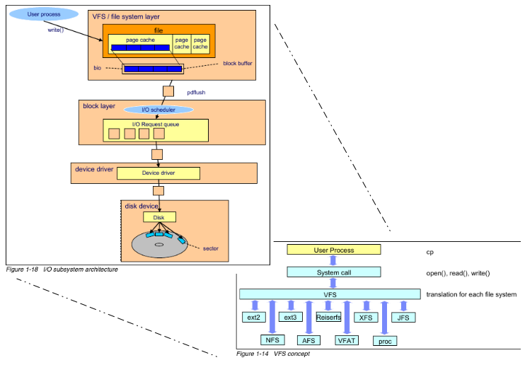

# Professional Linux Kernel Architecture :  Data Synchronization
> 1. swap 机制处理的是将内存不足，将page frame 换出的问题
> 2. page cache 是所有的block IO 需要经过的层次，用于缓存 block dev
> 3. data sync 的定位是:
>     1. 控制dirty block 的数目，是实现sync 的基础
>     2. data sync 是在page cache 的基础上

Linux provides a variety of caching methods as discussed extensively in Chapter 16. However,
what was not discussed in that chapter is how data are written back from cache. Again, the kernel provides several options that are grouped into two categories:
1. Background threads repeatedly check the state of system memory and write data back at periodic intervals.
2. Explicit flushing is performed when there are too many **dirty pages** in system caches and the kernel needs clean pages.
> 1. 16章节处理将block 的中间的数据放到内存中间
> 2. 本章的数据指的是把内存中间数据放到block 设备中间
> 3. Chapter 18 也划分为 backgound 和 explicit , 那是当内存的数量不足，此时可以让swap daemon 处理，或者用户手动处理，将page frame 的内容刷入到disk中间, 而此处是将dirty 同步到backing store 中间

## 17.1 Overview
There is a clear relationship between `flushing`, `swapping`, and `releasing` pages.

In the case of *dynamically generated pages*, the system *swap areas* act as the backing stores. The swap areas for pages mapped
from files are the corresponding sections in the underlying filesystems. If there is an acute scarcity
of memory, flushing of dirty data must be enforced in order to obtain clean pages.

Synchronization between memory/cache and backing store is split into two conceptually different parts:
1. Policy routines control when data are exchanged. System administrators can set various parameters to help the kernel decide when to exchange data as a function of system load.
2. The technical implementation deals with the hardware-related details of synchronization
between cache and backing store and ensures that the instructions issued by the policy routines
are carried out.
> 一个是策略，一个是写入的技术

Synchronization and swapping must not be confused with each other. Whereas
synchronization simply aligns the data held in RAM and in the backing store,
swapping results in the flushing of data from RAM to free space for higher-priority
items. Before data are cleared from RAM, they are synchronized with the data in the
associated backing store.
> sync 保持数据相同
> swap 释放空间

The mechanisms for flushing data are triggered for different reasons and at different times:
1. Periodic kernel threads scan the lists of dirty pages and pick some to be written back based on
the time at which they became dirty. If the system is not too busy with write operations, there is
an acceptable ratio between the number of dirty pages and the load imposed on the system by
the hard disk access operations needed to flush the pages.
2. If there are too many dirty pages in the system as a result, for example, of a massive write operation, the kernel triggers further mechanisms to synchronize pages with the backing store until
the number of dirty pages returns to an acceptable level. What is meant by ‘‘too many dirty
pages‘‘ and ‘‘acceptable level‘‘ is a moot point, discussed below.
3. Various components of the kernel require that data must be synchronized when a special event
has happened, for instance, when a filesystem is re-mounted.
> 还是这三个原因: 周期性，被动触发，用户层

The diagram concentrates on synchronization operations
originating from the `pdflush` thread, system calls, and explicit requests from filesystem-related kernel
components.

The kernel can start to synchronize data from various different places, but all paths save one end
up in `sync_sb_inodes`
The function is responsible to synchronize all dirty inodes belonging to a
given superblock, and `writeback_single_inode` is used for each inode. Both the sync system call
and numerous generic kernel layers (like the partition code or the block layer) make use of this
possibility.
> 并没有`sync_sb_inodes` 只有`sync_inodes_sb`

**Even if the synchronization implementation is centered around inodes**, this does not imply that the
mechanisms just work for data contained in mounted filesystems. Recall that raw block devices are
represented by inodes via the bdev pseudo-filesystem as discussed in Section 10.2.4. The synchronization
methods therefore also affect raw block devices in the same way as regular filesystem objects — good
news for everyone who wants to access data directly
> bdev pseudo-filesystem, raw block device 是怎样的存在

One remark on terminology: **When I talk about inode synchronization in the following, I always mean
synchronization of both the inode metadata and the raw data managed by the inode.** For regular files,
this means that the synchronization code’s aim is to both transfer time stamps, attributes, and the like, as
well as the contents of the file to the underlying block device.

## 17.2 The pdflush Mechanism
```
What:		/proc/sys/vm/nr_pdflush_threads
Date:		June 2012
Contact:	Wanpeng Li <liwp@linux.vnet.ibm.com>
Description: Since pdflush is replaced by per-BDI flusher, the interface of old pdflush
             exported in /proc/sys/vm/ should be removed.
```
> 真实情况是: 只有pdflush 的内容被删除，其他的内容还在

https://forum.kernelnewbies.org/read.php?14,1747
https://lwn.net/Articles/508212/

Instead of having a few flusher threads (pdflush), Linux now starts up per-block-device (bdi) flusher threads as required.

## 17.3 Starting a New Thread
> skip pdflush

## 17.4 Thread Initialization
> skip pdflush

## 17.5 Performing Actual Work
> skip pdflush

## 17.6 Periodic Flushing
Now that you are familiar with the framework in which the `pdflush` mechanism operates, let’s move on
to describe the **routines responsible for the actual synchronization of cache contents with the associated
backing store**. Recall that two alternatives are available, one periodic and one enforced. First, let’s discuss
the periodic writeback mechanism.

In earlier kernel versions, a user mode application was used to perform periodic write operations. This
application was started at kernel initialization time and invoked a system call at regular intervals to
write back dirty pages. In the meantime, this not particularly elegant procedure was replaced with a
more modern alternative that does not take the long route via user mode and is therefore not only more
efficient but also more ***aesthetic***.

What’s left of the earlier method is the name `kupdate`. The name appears as a component of some functions
and is often used to describe the flushing mechanism.
Two things are needed to periodically flush dirty cache data:
1. the worker function that is executed with the help of the pdflush mechanism, and
2. code to regularly activate the mechanism.

## 17.7 Associated Data Structures

#### 17.7.1 Page Status
`wb_kupdate` is based on two data structures that control how it functions. One of these structures is the
global array `vm_stat`, which enables the status of all system memory pages to be queried:
> 1. `wb_kupdate` 并不知道这一个东西被谁替换了

```c
/*
 * Manage combined zone based / global counters
 *
 * vm_stat contains the global counters
 */
atomic_long_t vm_stat[NR_VM_ZONE_STAT_ITEMS] __cacheline_aligned_in_smp;
EXPORT_SYMBOL(vm_stat);
```
The array holds a comprehensive collection of statistical information to describe the status of the memory
pages of *each CPU*; consequently, there is an instance of the structure for each CPU in the system. The
individual instances are grouped together in an array to simplify access.
> 从哪里可以说明是each CPU的?


The following statistics are collected in vm_stat:
```c
enum zone_stat_item {
	/* First 128 byte cacheline (assuming 64 bit words) */
	NR_FREE_PAGES,
	NR_ALLOC_BATCH,
	NR_LRU_BASE,
	NR_INACTIVE_ANON = NR_LRU_BASE, /* must match order of LRU_[IN]ACTIVE */
	NR_ACTIVE_ANON,		/*  "     "     "   "       "         */
	NR_INACTIVE_FILE,	/*  "     "     "   "       "         */
	NR_ACTIVE_FILE,		/*  "     "     "   "       "         */
	NR_UNEVICTABLE,		/*  "     "     "   "       "         */
	NR_MLOCK,		/* mlock()ed pages found and moved off LRU */
	NR_ANON_PAGES,	/* Mapped anonymous pages */
	NR_FILE_MAPPED,	/* pagecache pages mapped into pagetables.
			   only modified from process context */
	NR_FILE_PAGES,
	NR_FILE_DIRTY,
	NR_WRITEBACK,
	NR_SLAB_RECLAIMABLE,
	NR_SLAB_UNRECLAIMABLE,
	NR_PAGETABLE,		/* used for pagetables */
	/* Second 128 byte cacheline */
	NR_KERNEL_STACK,
	NR_KAISERTABLE,
	NR_UNSTABLE_NFS,	/* NFS unstable pages */
	NR_BOUNCE,
	NR_VMSCAN_WRITE,
	NR_VMSCAN_IMMEDIATE,	/* Prioritise for reclaim when writeback ends */
	NR_WRITEBACK_TEMP,	/* Writeback using temporary buffers */
	NR_ISOLATED_ANON,	/* Temporary isolated pages from anon lru */
	NR_ISOLATED_FILE,	/* Temporary isolated pages from file lru */
	NR_SHMEM,		/* shmem pages (included tmpfs/GEM pages) */
	NR_DIRTIED,		/* page dirtyings since bootup */
	NR_WRITTEN,		/* page writings since bootup */
	NR_PAGES_SCANNED,	/* pages scanned since last reclaim */
#ifdef CONFIG_NUMA
	NUMA_HIT,		/* allocated in intended node */
	NUMA_MISS,		/* allocated in non intended node */
	NUMA_FOREIGN,		/* was intended here, hit elsewhere */
	NUMA_INTERLEAVE_HIT,	/* interleaver preferred this zone */
	NUMA_LOCAL,		/* allocation from local node */
	NUMA_OTHER,		/* allocation from other node */
#endif
	WORKINGSET_REFAULT,
	WORKINGSET_ACTIVATE,
	WORKINGSET_NODERECLAIM,
	NR_ANON_TRANSPARENT_HUGEPAGES,
	NR_FREE_CMA_PAGES,
	NR_VM_ZONE_STAT_ITEMS // 注意: 这一个数值正好是vm_stat的大小
};
```

Note that the kernel not only keeps a global array to collect page statistics, but also provides the same
information resolved by memory zone:
```c
struct zone {
  ...
  /* Zone statistics */
  atomic_long_t vm_stat[NR_VM_ZONE_STAT_ITEMS];
  ...
}
```

The kernel provides the auxiliary function `global_page_state`, which
delivers the current value of a particular field of `vm_stat`:
```c
static inline unsigned long global_page_state(enum zone_stat_item item)
{
	long x = atomic_long_read(&vm_stat[item]);
#ifdef CONFIG_SMP
	if (x < 0)
		x = 0;
#endif
	return x;
}
```
> @todo zone 和 global 的统计数据各自作用是什么，两者之间的联系是什么 ?

#### 17.7.2 Writeback Control
A second data structure holds the various parameters that control writeback of dirty pages. Upper layers
use it to **pass information about how writeback is to be performed to the lower layers** (top to bottom
in Figure 17-1). However, the structure also allows for propagating status information in the reverse
direction (bottom to top):

```c
/*
 * A control structure which tells the writeback code what to do.  These are
 * always on the stack, and hence need no locking.  They are always initialised
 * in a manner such that unspecified fields are set to zero.
 */
struct writeback_control {
	long nr_to_write;		/* Write this many pages, and decrement
					   this for each page written */
	long pages_skipped;		/* Pages which were not written */

	/*
	 * For a_ops->writepages(): if start or end are non-zero then this is
	 * a hint that the filesystem need only write out the pages inside that
	 * byterange.  The byte at `end' is included in the writeout request.
	 */
	loff_t range_start;
	loff_t range_end;

	enum writeback_sync_modes sync_mode;

	unsigned for_kupdate:1;		/* A kupdate writeback */
	unsigned for_background:1;	/* A background writeback */
	unsigned tagged_writepages:1;	/* tag-and-write to avoid livelock */
	unsigned for_reclaim:1;		/* Invoked from the page allocator */
	unsigned range_cyclic:1;	/* range_start is cyclic */
	unsigned for_sync:1;		/* sync(2) WB_SYNC_ALL writeback */
#ifdef CONFIG_CGROUP_WRITEBACK
	struct bdi_writeback *wb;	/* wb this writeback is issued under */
	struct inode *inode;		/* inode being written out */

	/* foreign inode detection, see wbc_detach_inode() */
	int wb_id;			/* current wb id */
	int wb_lcand_id;		/* last foreign candidate wb id */
	int wb_tcand_id;		/* this foreign candidate wb id */
	size_t wb_bytes;		/* bytes written by current wb */
	size_t wb_lcand_bytes;		/* bytes written by last candidate */
	size_t wb_tcand_bytes;		/* bytes written by this candidate */
#endif
};

/*
 * Each wb (bdi_writeback) can perform writeback operations, is measured
 * and throttled, independently.  Without cgroup writeback, each bdi
 * (bdi_writeback) is served by its embedded bdi->wb.
 *
 * On the default hierarchy, blkcg implicitly enables memcg.  This allows
 * using memcg's page ownership for attributing writeback IOs, and every
 * memcg - blkcg combination can be served by its own wb by assigning a
 * dedicated wb to each memcg, which enables isolation across different
 * cgroups and propagation of IO back pressure down from the IO layer upto
 * the tasks which are generating the dirty pages to be written back.
 *
 * A cgroup wb is indexed on its bdi by the ID of the associated memcg,
 * refcounted with the number of inodes attached to it, and pins the memcg
 * and the corresponding blkcg.  As the corresponding blkcg for a memcg may
 * change as blkcg is disabled and enabled higher up in the hierarchy, a wb
 * is tested for blkcg after lookup and removed from index on mismatch so
 * that a new wb for the combination can be created.
 */
struct bdi_writeback {
	struct backing_dev_info *bdi;	/* our parent bdi */

	unsigned long state;		/* Always use atomic bitops on this */
	unsigned long last_old_flush;	/* last old data flush */

	struct list_head b_dirty;	/* dirty inodes */
	struct list_head b_io;		/* parked for writeback */
	struct list_head b_more_io;	/* parked for more writeback */
	struct list_head b_dirty_time;	/* time stamps are dirty */
	spinlock_t list_lock;		/* protects the b_* lists */

	struct percpu_counter stat[NR_WB_STAT_ITEMS];

	struct bdi_writeback_congested *congested;

	unsigned long bw_time_stamp;	/* last time write bw is updated */
	unsigned long dirtied_stamp;
	unsigned long written_stamp;	/* pages written at bw_time_stamp */
	unsigned long write_bandwidth;	/* the estimated write bandwidth */
	unsigned long avg_write_bandwidth; /* further smoothed write bw, > 0 */

	/*
	 * The base dirty throttle rate, re-calculated on every 200ms.
	 * All the bdi tasks' dirty rate will be curbed under it.
	 * @dirty_ratelimit tracks the estimated @balanced_dirty_ratelimit
	 * in small steps and is much more smooth/stable than the latter.
	 */
	unsigned long dirty_ratelimit;
	unsigned long balanced_dirty_ratelimit;

	struct fprop_local_percpu completions;
	int dirty_exceeded;
	enum wb_reason start_all_reason;

	spinlock_t work_lock;		/* protects work_list & dwork scheduling */
	struct list_head work_list;
	struct delayed_work dwork;	/* work item used for writeback */

	unsigned long dirty_sleep;	/* last wait */

	struct list_head bdi_node;	/* anchored at bdi->wb_list */

#ifdef CONFIG_CGROUP_WRITEBACK
	struct percpu_ref refcnt;	/* used only for !root wb's */
	struct fprop_local_percpu memcg_completions;
	struct cgroup_subsys_state *memcg_css; /* the associated memcg */
	struct cgroup_subsys_state *blkcg_css; /* and blkcg */
	struct list_head memcg_node;	/* anchored at memcg->cgwb_list */
	struct list_head blkcg_node;	/* anchored at blkcg->cgwb_list */

	union {
		struct work_struct release_work;
		struct rcu_head rcu;
	};
#endif
};
```
1. `wb->bdi` points to a structure of type `backing_dev_info`, which summarizes information on
the underlying storage medium. *This structure is discussed briefly in Chapter 16*(似乎chapter 16 中间没有详细说明，这也是一个复杂的内容). Two
things interest us here. First, the structure provides a variable to hold the status of the
writeback queue (this means, e.g., that congestion can be signaled if there are too many
write requests), and second, it allows RAM-based filesystems that do not have a (block
device) backing store to be labeled — writeback operations to systems of this kind make
no sense.

2. `sync_mode` distinguishes between three different synchronization modes:
```c
/*
 * fs/fs-writeback.c
 */
enum writeback_sync_modes {
	WB_SYNC_NONE,	/* Don't wait on anything */
	WB_SYNC_ALL,	/* Wait on every mapping */
};
```


3. When the kernel performs writeback, it must decide which dirty cache data need to be
synchronized with the backing store. It uses the `older_than_this` and `nr_to_write` elements
for this purpose. Data are written back if they have been dirty for longer than specified by
`older_than_this`. (@todo 似乎被替换为 last_old_flush 的功能了)

4. `nr_to_write` can restrict the maximal number of pages that should be written back. The upper
bound for this is given by MAX_WRITEBACK_PAGES, which is usually set to 1,024

5. If pages were selected to be written back, functions from lower layers perform the required operations. However, they can fail for various reasons, for instance, because the page is locked from
some other part of the kernel. The number of skipped pages can be reported to higher layers via
the counter `pages_skipped`.

6. The `nonblocking` flag specifies whether writeback queues block or not in the event of congestion
(more pending write operations than can be effectively satisfied). If they are blocked, the kernel
waits until the queue is free. If not, it relinquishes control. The write operation is then resumed
later.
7. `encountered_congestion` is also a flag to signal to higher layers that congestion has occurred
during data writeback. It is a Boolean variable and accepts the values 1 or 0.

8. If `range_cyclic` is set to 0, the writeback mechanism is restricted to operate on the range given
by range_start and range_end. The limits refer to the mapping for which the writeback was
initiated.
If `range_cyclic` is set to 1, the kernel may iterate many times over the pages associated with a
mapping, thus the name of the element.
> @todo 有必要总结一下这一个结构体作为函数的参数的主要的位置在哪里 ?
> 感觉这一个结构体出现的位置圆圆不限于sync data

#### 17.7.3 Adjustable Parameters
The kernel supports the fine-tuning of synchronization by means of parameters. These can be set by
the administrator to help the kernel assess system usage and loading. The `sysctl` is used for this purpose, which means that the `proc` filesystem is the natural interface to
manipulate the parameters — they are located in `/proc/sys/vm/`. Four parameters can be set, all of which
are defined in `mm/page-writeback.c`:
> 通过`/proc/sys/vm/`实现操作参数调节

1. `dirty_background_ratio` specifies the percentage of dirty pages at which pdflush starts periodic flushing in the background. The default value is 10 so that the update mechanism kicks in
when more than 10 percent of the pages have changed as compared to the backing store.
2. `vm_dirty_ratio` (the corresponding sysctl is dirty_ratio) specifies the percentage of dirty
pages (with respect to non-HIGHMEM memory) at which data flushing will be started. The default
value is 40.
Why is high memory excluded from the percentage? Older kernel versions before 2.6.20 did
not, in fact, distinguish between high and normal memory. However, if the ratio between high
memory and low memory is too large (i.e., if main memory is much more than 4 GiB on 32-bit
processors), the default settings for dirty_background_ratio and dirty_ratio were required
to be scaled back slightly when the writeback mechanism was initialized.
Retaining the default values would have necessitated an excessively large number of
buffer_head instances, and these would have had to be held in valuable low memory. By
excluding high memory from the calculation, the kernel does not deal with scaling anymore,
which simplifies matters somewhat.
3. The interval between two invocations of the periodic flushing routine is defined in
dirty_writeback_interval (the corresponding sysctl is dirty_writeback_centisecs). The
interval is specified in hundredths of a second (also called centiseconds in the sources). The
default is 500, which equates to an interval of 5 seconds between invocations.
On systems where a very large number of write operations are performed, lowering this value
can have a positive effect, but increasing the value on systems with very few write operations
delivers only small performance gains.
4. The maximum period during which a page may remain dirty is specified in `dirty_expire_interval`
(the sysctl is dirty_expire_centisecs). Again, the period is expressed is hundredths of a second.
The default value is 3,000, which means that a page may remain dirty for a
maximum of 30 seconds before it is written back at the next opportunity.


```c
/*
 * After a CPU has dirtied this many pages, balance_dirty_pages_ratelimited
 * will look to see if it needs to force writeback or throttling.
 */
static long ratelimit_pages = 32;

/* The following parameters are exported via /proc/sys/vm */

/*
 * Start background writeback (via writeback threads) at this percentage
 */
int dirty_background_ratio = 10;

/*
 * dirty_background_bytes starts at 0 (disabled) so that it is a function of
 * dirty_background_ratio * the amount of dirtyable memory
 */
unsigned long dirty_background_bytes;

/*
 * free highmem will not be subtracted from the total free memory
 * for calculating free ratios if vm_highmem_is_dirtyable is true
 */
int vm_highmem_is_dirtyable;

/*
 * The generator of dirty data starts writeback at this percentage
 */
int vm_dirty_ratio = 20;

/*
 * vm_dirty_bytes starts at 0 (disabled) so that it is a function of
 * vm_dirty_ratio * the amount of dirtyable memory
 */
unsigned long vm_dirty_bytes;

/*
 * The interval between `kupdate'-style writebacks
 */
unsigned int dirty_writeback_interval = 5 * 100; /* centiseconds */

EXPORT_SYMBOL_GPL(dirty_writeback_interval);

/*
 * The longest time for which data is allowed to remain dirty
 */
unsigned int dirty_expire_interval = 30 * 100; /* centiseconds */

/*
 * Flag that makes the machine dump writes/reads and block dirtyings.
 */
int block_dump;

/*
 * Flag that puts the machine in "laptop mode". Doubles as a timeout in jiffies:
 * a full sync is triggered after this time elapses without any disk activity.
 */
int laptop_mode;
```


## 17.8 Central Control
The key periodic flushing component is the `wb_kupdate` procedure defined in `mm/page-writeback.c`.
> 对应的替代品是什么

## 17.9 Superblock Synchronization
> 对应的替代品是什么

## 17.10 Inode Synchronization
> 实际讲解的函数是: `writeback_inodes`

The function shoulders the main burden of synchronization because most system data
are provided in the form of address space mappings that make use of inodes.
```c
/**
 * writeback_inodes_sb	-	writeback dirty inodes from given super_block
 * @sb: the superblock
 * @reason: reason why some writeback work was initiated
 *
 * Start writeback on some inodes on this super_block. No guarantees are made
 * on how many (if any) will be written, and this function does not wait
 * for IO completion of submitted IO.
 */
void writeback_inodes_sb(struct super_block *sb, enum wb_reason reason)
{
	return writeback_inodes_sb_nr(sb, get_nr_dirty_pages(), reason);
}
EXPORT_SYMBOL(writeback_inodes_sb);


/**
 * writeback_inodes_sb_nr -	writeback dirty inodes from given super_block
 * @sb: the superblock
 * @nr: the number of pages to write
 * @reason: reason why some writeback work initiated
 *
 * Start writeback on some inodes on this super_block. No guarantees are made
 * on how many (if any) will be written, and this function does not wait
 * for IO completion of submitted IO.
 */
void writeback_inodes_sb_nr(struct super_block *sb,
			    unsigned long nr,
			    enum wb_reason reason)
{
	__writeback_inodes_sb_nr(sb, nr, reason, false);
}
EXPORT_SYMBOL(writeback_inodes_sb_nr);


/*
 * why some writeback work was initiated
 */
enum wb_reason {
	WB_REASON_BACKGROUND,
	WB_REASON_VMSCAN,
	WB_REASON_SYNC,
	WB_REASON_PERIODIC,
	WB_REASON_LAPTOP_TIMER,
	WB_REASON_FREE_MORE_MEM,
	WB_REASON_FS_FREE_SPACE,
	/*
	 * There is no bdi forker thread any more and works are done
	 * by emergency worker, however, this is TPs userland visible
	 * and we'll be exposing exactly the same information,
	 * so it has a mismatch name.
	 */
	WB_REASON_FORKER_THREAD,

	WB_REASON_MAX,
};


static void __writeback_inodes_sb_nr(struct super_block *sb, unsigned long nr,
				     enum wb_reason reason, bool skip_if_busy)
{
	DEFINE_WB_COMPLETION_ONSTACK(done);
	struct wb_writeback_work work = {
		.sb			= sb,
		.sync_mode		= WB_SYNC_NONE,
		.tagged_writepages	= 1,
		.done			= &done,
		.nr_pages		= nr,
		.reason			= reason,
	};
	struct backing_dev_info *bdi = sb->s_bdi;

	if (!bdi_has_dirty_io(bdi) || bdi == &noop_backing_dev_info)
		return;
	WARN_ON(!rwsem_is_locked(&sb->s_umount));

	bdi_split_work_to_wbs(sb->s_bdi, &work, skip_if_busy); // 关键位置
	wb_wait_for_completion(bdi, &done);  // 关键位置 @todo 暂时忽视
}


/**
 * wb_wait_for_completion - wait for completion of bdi_writeback_works
 * @bdi: bdi work items were issued to
 * @done: target wb_completion
 *
 * Wait for one or more work items issued to @bdi with their ->done field
 * set to @done, which should have been defined with
 * DEFINE_WB_COMPLETION_ONSTACK().  This function returns after all such
 * work items are completed.  Work items which are waited upon aren't freed
 * automatically on completion.
 */
static void wb_wait_for_completion(struct backing_dev_info *bdi,
				   struct wb_completion *done)
{
	atomic_dec(&done->cnt);		/* put down the initial count */
	wait_event(bdi->wb_waitq, !atomic_read(&done->cnt));
}


static void bdi_split_work_to_wbs(struct backing_dev_info *bdi,
				  struct wb_writeback_work *base_work,
				  bool skip_if_busy)
{
	might_sleep();

	if (!skip_if_busy || !writeback_in_progress(&bdi->wb)) {
		base_work->auto_free = 0;
		wb_queue_work(&bdi->wb, base_work); // 关键位置，但是加入到队列中间之后，然后事情就结束了一样
                                        // 上面讨论的内容都是 enqueue, wait queue 之类的事情
	}
}
```

#### 17.10.1 Walking the Superblocks

#### 17.10.2 Examining Superblock Inodes

#### 17.10.3 Writing Back Single Inodes


## 17.11 Congestion


#### 17.11.1 Data Structures
A double wait queue is needed to implement the congestion method. The definition is as follows:
```c
static wait_queue_head_t congestion_wqh[2] = {
		__WAIT_QUEUE_HEAD_INITIALIZER(congestion_wqh[0]),
		__WAIT_QUEUE_HEAD_INITIALIZER(congestion_wqh[1])
	};
```

The kernel provides two queues, one for input and one for output. Two pre-processor constants (`READ`
and `WRITE`) are defined in `<fs.h>` to allow access to the array elements and to clearly differentiate between
the two queues *without the direct use of numbers*.
> READ 和　WRITE 应该就是定义

#### 17.11.2 Thresholds
The congestion thresholds are computed by `blk_congestion_threshold`:
> no such function, skip

#### 17.11.3 Setting and Clearing the Congested State


```c
static void blk_clear_congested(struct request_list *rl, int sync)
{
#ifdef CONFIG_CGROUP_WRITEBACK
	clear_wb_congested(rl->blkg->wb_congested, sync);
#else
	/*
	 * If !CGROUP_WRITEBACK, all blkg's map to bdi->wb and we shouldn't
	 * flip its congestion state for events on other blkcgs.
	 */
	if (rl == &rl->q->root_rl)
		clear_wb_congested(rl->q->backing_dev_info.wb.congested, sync);
#endif
}

static void blk_set_congested(struct request_list *rl, int sync)
{
#ifdef CONFIG_CGROUP_WRITEBACK
	set_wb_congested(rl->blkg->wb_congested, sync);
#else
	/* see blk_clear_congested() */
	if (rl == &rl->q->root_rl)
		set_wb_congested(rl->q->backing_dev_info.wb.congested, sync);
#endif
}
```

Both obtain the `backing_dev_info` for the queue under consideration and hand over the real work to
`set_bdi_congested` or `clear_bdi_congested`.

> 实际上并不是,  `set_bdi_congested` or `clear_bdi_congested` 还有其他的作用.

#### 17.11.4 Waiting on Congested Queues
he kernel uses the `congestion_wait` function for this purpose. It adds a process to the congestion_wqh
wait queue when congestion occurs.
```c
/**
 * congestion_wait - wait for a backing_dev to become uncongested
 * @sync: SYNC or ASYNC IO
 * @timeout: timeout in jiffies
 *
 * Waits for up to @timeout jiffies for a backing_dev (any backing_dev) to exit
 * write congestion.  If no backing_devs are congested then just wait for the
 * next write to be completed.
 */
long congestion_wait(int sync, long timeout)
{
	long ret;
	unsigned long start = jiffies;
	DEFINE_WAIT(wait);
	wait_queue_head_t *wqh = &congestion_wqh[sync];

	prepare_to_wait(wqh, &wait, TASK_UNINTERRUPTIBLE);
	ret = io_schedule_timeout(timeout);
	finish_wait(wqh, &wait);

	trace_writeback_congestion_wait(jiffies_to_usecs(timeout),
					jiffies_to_usecs(jiffies - start));

	return ret;
}
EXPORT_SYMBOL(congestion_wait);
```

## 17.12 Forced Writeback
When the kernel receives an urgent request for memory and cannot satisfy it because of the very large
number of dirty pages, it must try to transfer the page contents to the block device as quickly as possible
to free RAM for other purposes. The same methods are used as for flushing data in the background,
but in this case, synchronization is not initiated by periodic processes but is triggered explicitly by the
kernel — in other words, writeback is ‘‘forced.’’
> 说明为什么需要 force writeback

> where is the `wakeup_pdflush` ?
> skip


## 17.13 Laptop Mode
> skip

## 17.14 System Calls for Synchronization Control
The kernel synchronization mechanisms can be enabled from within userspace by various system calls to
ensure full or partial data integrity between memory and block devices. Three basic options are available:

1. The entire cache contents can be flushed using the `sync` system call; in certain circumstances,
this can be very time-consuming.
2. The contents of individual files (as well as the associated metadata of the inode) can be transferred to the underlying block device. The kernel provides the `fsync` and `fdatasync` system
calls for this purpose. Whereas `sync` is normally used in conjunction with the `sync` system
tool mentioned above, `fsync` and `fdatasync` are reserved for particular applications because
the files to be flushed are selected by means of the process-specific file descriptors introduced
in Chapter 8. There are therefore no generic userspace tools for writing back specific files.
3. `msync` is used to synchronize memory mappings

```
SYNOPSIS
       #include <sys/mman.h>

       int msync(void *addr, size_t length, int flags);

DESCRIPTION
       msync() flushes changes made to the in-core copy of a file that was mapped into memory using mmap(2) back to the filesystem.  Without use of this call, there is no guarantee that changes are written back before munmap(2) is called.  To be more precise, the part of the file that corresponds to the memory area starting at addr and having length length is updated.
```
> mmap 和 普通的打开 文件有什么不同之处吗 ? 为什么采用两种 sync 的方式


## 17.15 Full Synchronization
> 描述do_sync 的实现
> skip

#### 17.15.1 Synchronization of Inodes
> skip   难道不是在附近的位置讲解过inode 的刷新的吗 ?


#### 17.15.2 Synchronization of Individual Files


## 参考资料
#### [](https://unix.stackexchange.com/questions/76970/how-do-pdflush-kjournald-swapd-etc-interoperate)

My assumption is that `pdflush` (being more generic to mass storage I/O) would sit at a lower level and trigger the SCSI/ATA/whatever commands necessary to actually perform the writes, and

`kjournald` handles higher level filesystem data structures before writing. I could see it the other way around as well, though, with kjournald directly interfacing with the filesystem data structures and pdflush waking up every now and then to write dirty pagecache pages to the device through kjournald. It's also possible that the two don't interact at all for some other reason.



Overview of `write()` steps. To provide a simple overview of the I/O sybsystem operations, we'll use an example where the function `write()` is called by a User Space application.

1. A process requests to write a file through the `write()` system call.
1. The kernel updates the page cache mapped to the file.
1. A pdflush kernel thread takes care of flushing the page cache to disk.
1. The file system layer puts each block buffer together to a `struct bio` and submits a write request to the block device layer.
1. The block device layer gets requests from upper layers and performs an I/O **elevator** operation and puts the requests into the I/O request queue.
1. A device driver such as SCSI or other device specific drivers will take care of write operation.
1. A disk device **firmware** performs hardware operations like seek head, rotation, and data transfer to the sector on the platter.
> 似乎此处的 elevator 和华科垃圾的教材中间的内容不同
> firmware 和 驱动的关系是什么，如何处理其中的内容

The primary mechanism for maintaining consistency is `bdflush`. As pages of memory are deemed dirty they need to be synchronized with the data that's on the storage medium. `bdflush` will coordinate with `pdflush` daemons to synchronize this data with the storage medium.

When system memory becomes scarce or the kernel swap timer expires, the `kswapd` daemon will attempt to free up pages. So long as the number of free pages remains above `free_pages_high`, `kswapd` will do nothing. However, if the number of free pages drops below, then `kswapd` will start the page reclaming process. After `kswapd` has marked pages for relocation, `bdflush` will take care to synchronize any outstanding changes to the storage medium, through the `pdflush` daemons.
> 一举解释了 `kswapd` `bdflush` `pdflush` 三者的关系
> 但是我不信啊!

Description: Since pdflush is replaced by per-BDI flusher, the interface of old pdflush
exported in `/proc/sys/vm/` should be removed.

## Let's BB
1. 所以和swap 分区的刷新回去有什么区别吗 ?
2. 有办法和 page cache 和 block cache 的内容相互对应的部分吗 ?
3. 虚拟文件文件系统中间的 dentry 的缓存靠什么刷新 ?


重启this chapter 的方法:
```c
/*
 * Wakeup the flusher threads to start writeback of all currently dirty pages
 */
void wakeup_flusher_threads(enum wb_reason reason)
{
	struct backing_dev_info *bdi;

	/*
	 * If we are expecting writeback progress we must submit plugged IO.
	 */
	if (blk_needs_flush_plug(current))
		blk_schedule_flush_plug(current);

	rcu_read_lock();
	list_for_each_entry_rcu(bdi, &bdi_list, bdi_list)
		__wakeup_flusher_threads_bdi(bdi, reason);
	rcu_read_unlock();
}
```

ldd 的内容
