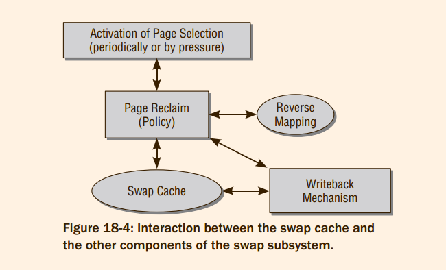
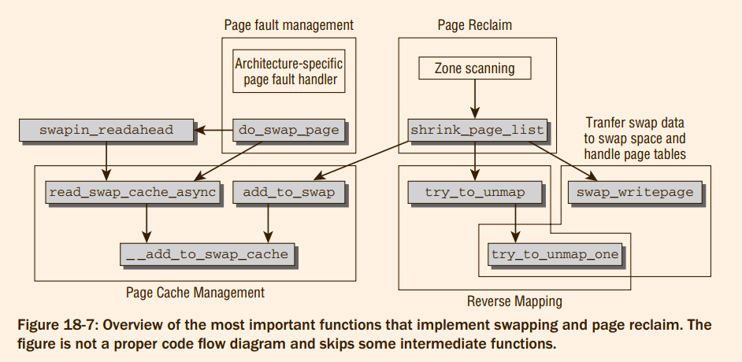
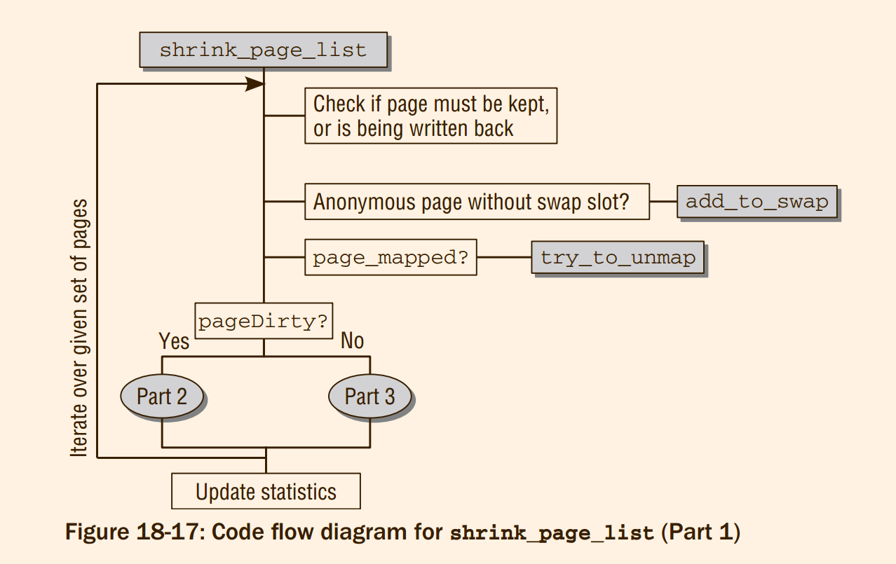

#### 18.1.1 Swappable Pages


Memory pages used by the kernel itself are never swapped out. The reasons are obvious. **The complexity
of the kernel code would increase dramatically**. **Since the kernel does not require very much memory as
compared to other user applications**, the potential gain is too low to justify the additional effort
> 两个原因
> 1. 但是将内核换入到磁盘上到底有什么困难的 ? 所以内核中间的page fault 到底是什么 ?

Naturally, pages used to map peripherals to memory space cannot be swapped out either. This
would make no sense, especially as the pages are used only as a means of communication between the
application and the device and not for actually storing data persistently

Even though it is not possible to swap out all page types, the kernel’s swapping
page reclaim must still cater to page types that are based on other backing stores.
The most frequent page types of this kind relate to data from files that are mapped
into memory
> 两句话，说实话，有点没有逻辑。
#### 18.1.2 Page Thrashing
swap token
> @todo 找到不存在的证据

#### 18.1.3 Page-Swapping Algorithms
Below, two techniques on which the Linux swapping
implementation is based are described.
1. Second Chance
2. LRU Algorithm
> 说实话，second chance 没有看懂，等到能上网的查一下。
> @todo second chance 是不是已经消失了

Hardly any part of the kernel entails as many technical difficulties as the
virtual memory subsystem, of which the implementation of swapping is a part.

Not without reason is memory management one of the
hottest kernel development topics, which has given rise to countless discussions, flame wars, and rival
implementations.
> 看这倒装句，写的多好啊。

## 18.2 Page Reclaim and Swapping in the Linux Kernel
When discussing the design of the swap subsystem, certain aspects come to mind as characterized by the
following questions:
1. How should swap areas on block storage media be organized to ensure not only that pages
swapped out can be **uniquely identified**, but also that memory space is used as effectively as
possible to permit read and write operations at **maximum speed**?
2. Which methods are available to enable the kernel to check when and how many pages
need to be swapped out in order to achieve the best **possible balance** between the provision of
free page frames for upcoming needs and minimization of the time needed to perform swap
operations?
3. According to which criteria should the pages be selected for swapping? In other words, which
page **replacement algorithm** should be used?
4. How are page faults handled as effectively and quickly as possible, and how are pages **returned**
from a swap area to system RAM?
5. Which data can be removed from the various system caches (from the inode or dentry cache,
e.g.) without a backing store because it can be reconstructed indirectly? This question is not, in
fact, directly related to the execution of swapping operations but concerns both the cache and
swap subsystems. However, as cache shrinking is initiated by the swap subsystem, this question
is addressed below in this chapter


#### 18.2.1 Organization of the Swap Area
> 描述有点过于简单，缺乏必要的背景知识。

cluster

priorities

slot


Two userspace tools are available to create and enable swap areas; these are mkswap (for ‘‘formatting’’ a
swap partition/file) and swapon (for enabling a swap area). As these programs are crucial to a functioning
swap subsystem, they are described (and the system call for swapon) below.

#### 18.2.2 Checking Memory Utilization
Prior to swapping out pages, the kernel checks memory utilization to identify whether capacity is low.
As when synchronizing pages, the kernel uses a combination of two mechanisms:
1. A periodic daemon (kswapd) runs in the background and repeatedly checks current memory
utilization in order to initiate page swap-out when a particular threshold value is reached.
This method ensures that no swap storms occur in which a very large number of pages suddenly need to be swapped out; this would result in long wait times and must be prevented
on all accounts.
2. Nevertheless, the kernel must expect acute memory shortage whenever, for example, a large
memory area is allocated by the buddy system or when buffers are generated. If insufficient
RAM is available to satisfy the request for memory, the kernel must attempt to free space by
swapping out pages as quickly as possible. Swap-out in the event of an acute emergency is
part of direct reclaim.
> 慢性分配和急性分配

#### 18.2.3 Selecting Pages to Be Swapped Out
The kernel uses a mixture of the ideas
discussed earlier and implements a rough-grained LRU method that makes use of only one hardware
feature — the setting of an accessed bit following a page access — because this function is available on
all supported architectures and can be **emulated with little effort.**
> 蛇皮，如何模拟 ? 而且似乎根本 architecture 的支持


In contrast to the general algorithms, the LRU implementation of the kernel is based on two linked
lists that are referred to as the active and the inactive list (**separate lists exist for each memory zone in the system**).
> @todo 所以如何维持各个 page 之间的关系 ?

#### 18.2.4 Handling Page Faults
Page fault handling is in two parts.
1. First, strongly processor-dependent (assembler) code must be used
to intercept the page fault and query the associated data.
2. Second, a system-independent part of code is
responsible for the further handling of the situation. Because of optimizations used by the kernel when
managing processes, it is not sufficient to simply search for the relevant page in the backing store and
load it into the RAM memory because the page fault may have been triggered for other reasons (see
Chapter 4). For example, copy-on-write pages may be involved; these are copied only when a write
access is executed after a process has forked. Page faults also occur with *demand paging*, where the
pages of a mapping are loaded only when actually needed. I ignore these problems here, however, and
focus on the situation in which a swapped-out page must be reloaded into memory

#### 18.2.5 Shrinking Kernel Caches
Swapping out pages that belong to userspace applications is not the kernel’s only way of freeing memory
space. Shrinking numerous caches often results in good gains

As kernel
caches are generally not particularly huge, the kernel begins to shrink them only as a last resort

Functions written to shrink caches are referred to as shrinkers in the kernel and can be registered dynamically. When memory is scarce, the kernel invokes all registered shrinkers to obtain fresh memory
> 不到万不得已，不要释放cache，似乎利用的是 struct shrinker

## 18.3 Managing Swap Areas
Linux is relatively flexible in its support for swap areas
As we have already explained,
1. it is possible to manage several areas with **different priorities**, and
2. these may be located both on local partitions and in files of a predefined size.
3. Swap partitions can also be added and removed dynamically in an active system without the need for rebooting


#### 18.3.1 Data Structures
The cornerstone of swap
area management is the `swap_info` array defined in `mm/swapfile.c`; its entries store information on the
individual swap areas in the system

```c
struct swap_info_struct *swap_info[MAX_SWAPFILES];

#define MAX_SWAPFILES \
	((1 << MAX_SWAPFILES_SHIFT) - SWP_MIGRATION_NUM - SWP_HWPOISON_NUM)

// @todo 为什么需要定义数组，数组大小的依据是什么
```

The kernel uses the term swap file to refer not only to **swap files** but also to **swap
partitions**; the array therefore includes both types. As normally only one swap file is
used, the limitation to a specific number is of no relevance. Neither does this
number impose any kind of restriction on numerical calculations or other
memory-intensive programs because, depending on architecture, swap areas may
now have sizes in the gigabyte range. The restriction to 128 MiB in older versions
no longer applies.

How it can nevertheless occur that there are data in the swap files although the
swap partition is not completely full, as indicated by the proc output, is explained below
> 所以优先级到底是什么作用的 ?

* **Characterization of Swap Areas**
```c
/*
 * The in-memory structure used to track swap areas.
 */
struct swap_info_struct {
	unsigned long	flags;		/* SWP_USED etc: see above */
	signed short	prio;		/* swap priority of this type */
	struct plist_node list;		/* entry in swap_active_head */
	struct plist_node avail_lists[MAX_NUMNODES];/* entry in swap_avail_heads */
	signed char	type;		/* strange name for an index */
	unsigned int	max;		/* extent of the swap_map */
	unsigned char *swap_map;	/* vmalloc'ed array of usage counts */
	struct swap_cluster_info *cluster_info; /* cluster info. Only for SSD */
	struct swap_cluster_list free_clusters; /* free clusters list */
	unsigned int lowest_bit;	/* index of first free in swap_map */
	unsigned int highest_bit;	/* index of last free in swap_map */
	unsigned int pages;		/* total of usable pages of swap */
	unsigned int inuse_pages;	/* number of those currently in use */
	unsigned int cluster_next;	/* likely index for next allocation */
	unsigned int cluster_nr;	/* countdown to next cluster search */
	struct percpu_cluster __percpu *percpu_cluster; /* per cpu's swap location */
	struct swap_extent *curr_swap_extent;
	struct swap_extent first_swap_extent;
	struct block_device *bdev;	/* swap device or bdev of swap file */
	struct file *swap_file;		/* seldom referenced */
	unsigned int old_block_size;	/* seldom referenced */
#ifdef CONFIG_FRONTSWAP
	unsigned long *frontswap_map;	/* frontswap in-use, one bit per page */
	atomic_t frontswap_pages;	/* frontswap pages in-use counter */
#endif
	spinlock_t lock;		/*
					 * protect map scan related fields like
					 * swap_map, lowest_bit, highest_bit,
					 * inuse_pages, cluster_next,
					 * cluster_nr, lowest_alloc,
					 * highest_alloc, free/discard cluster
					 * list. other fields are only changed
					 * at swapon/swapoff, so are protected
					 * by swap_lock. changing flags need
					 * hold this lock and swap_lock. If
					 * both locks need hold, hold swap_lock
					 * first.
					 */
	spinlock_t cont_lock;		/*
					 * protect swap count continuation page
					 * list.
					 */
	struct work_struct discard_work; /* discard worker */
	struct swap_cluster_list discard_clusters; /* discard clusters list */
};
```
1. The state of the swap area can be described with various flags stored in the flags element.
`SWP_USED` specifies that the entry in the swap array is used. Since the array is otherwise filled
with zeros, a distinction can easily be made between used and unused elements. `SWP_WRITEOK`
specifies that the swap area may be written to. Both flags are set after a swap area has been
inserted into the kernel; the abbreviation for this state is `SWP_ACTIVE`.
2. `swap_file` points to the file structure associated with the swap area. With swap partitions, there is a pointer to the device
file of the partition on the block device (in our example, /dev/hda5). With swap files, this pointer
is to the file instance of the relevant file, that is, /mnt/swap1 or /tmp/swap2 in our example.
3. `bdev` points to the `block_device` structure of the underlying block device.
4. The total number of usable page slots, **each of which can store a complete memory page**, is held
in `pages`.
4. The kernel uses a somewhat unusual method to link the various elements in the swap list
according to priority. Since the data of the various areas are arranged in the elements of a linear
array, the next variable is defined to create a relative order between the areas despite the fixed
array positions. `next` is used as an index for `swap_info[]`. This enables the kernel to track the
individual entries according to their priority.
But how is it possible to determine which swap area is to be used first? Since this area is not necessarily located at the first array position, the kernel also defines the global variable `swap_list`
in mm/swapfile.c. It is an instance of the `swap_list_t` data type defined specifically for the purpose of finding the first swap area
```c
static struct plist_head *swap_avail_heads;
// 应该就是这一个就是用来实现查找优先级最高的 swap_info_struct 的成员吧!

static int __init swapfile_init(void)
{
  int nid;

	swap_avail_heads = kmalloc_array(nr_node_ids, sizeof(struct plist_head),
					 GFP_KERNEL);
	if (!swap_avail_heads) {
		pr_emerg("Not enough memory for swap heads, swap is disabled\n");
		return -ENOMEM;
	}

	for_each_node(nid)
		plist_head_init(&swap_avail_heads[nid]);

	return 0;
}
// 龟龟，实际上初始化了一个数组!
```

6. In order to reduce search times when the complete swap area is scanned for a free slot, the kernel manages the upper and lower limits of the search zone with the aid of the `lowest_bit` and
`highest_bit` elements. There are no free pages above or below these positions so it would be
pointless to search this area.
7. The kernel also provides two elements — `cluster_next` and `cluster_nr` — to implement the
cluster technique mentioned briefly above. The former specifies which slot of an existing cluster
in the swap area is to be used next, and `cluster_nr` indicates how many pages are still available
for use in the current cluster before it is necessary to start a new cluster, or (if not enough free
pages are available for a new cluster) that recourse is made to fine-grained allocation.
8. `swap_map` is a pointer to an array of short integers (which is unsurprisingly referred to as swap
map in the following) that contains as many elements as there are page slots in the swap area.
It is used as an access counter for the individual slots to indicate the number of processes that
share the swapped-out page.(@todo 很奇怪，为什么再一次需要知道一个slot 被多少个进程同时使用)


> What is the meaning of the various elements in the `swap_info_struct` structure ?
> 1. `bdev` : points to the `block_device` structure of the underlying block device.
> 2. `max` : 和`pages`比，几乎总是多一
> 3. `pages`: 可用的slot 的数目
> 4. `swap_map`: vmalloc'ed array of usage counts
> 5. `lowest_bit` 和 `highest_bit` : 加快搜索,  在下文中 scan_swap_map 中间使用的成员。
> 6. `cluster_next` and `cluster_nr` : 实现cluster

> `next` 成员应该是被替换为:
> `struct plist_node list;		/* entry in swap_active_head */`
> `struct plist_node avail_list;	/* entry in swap_avail_head */`

> @todo page slot 是什么 ?


> next 和两个cluster 的功能分别是 ?
> 原则上:priority 和 实现cluster 技术


```c
struct plist_node {
	int			prio;
	struct list_head	prio_list;
	struct list_head	node_list;
};
```


* **Extents for Implementing Non-Contiguous Swap Areas**

The kernel uses the `extent_list` and `curr_swap_extent` elements to implement extents, which create
mappings between the *swap slots* that are assumed to be contiguous and *the disk blocks* of the swap file.

This is not necessary if partitions are used as the basis for swap space because the kernel can then rely
on the fact that the blocks on the disk are arranged linearly. Mapping between page slots and disk blocks
is therefore very simple. Starting from the position of the first block, it is only necessary to multiply a
constant offset by the required page number in order to obtain the required address, as illustrated in
Figure 18-1. In this case, just one `swap_extent` instance is needed. (Actually, this could also be dispensed
with, but its existence makes things easier for the kernel as it narrows the differences between partition
swap areas and file swap areas.)

The situation is more complicated when files are used as the basis for swap memory because there is then
no guarantee that all blocks of the file are located sequentially on disk
> 既然使用file作为basis for swap memory , 那是不是当没有安装swap分区的时候，就是在使用ext4 在作为swap 分区的功能。

```c
struct swap_extent *curr_swap_extent;
struct swap_extent first_swap_extent;

/*
 * A swap extent maps a range of a swapfile's PAGE_SIZE pages onto a range of
 * disk blocks.  A list of swap extents maps the entire swapfile.  (Where the
 * term `swapfile' refers to either a blockdevice or an IS_REG file.  Apart
 * from setup, they're handled identically.
 *
 * We always assume that blocks are of size PAGE_SIZE.
 */
struct swap_extent {
	struct list_head list;
	pgoff_t start_page;
	pgoff_t nr_pages;
	sector_t start_block;
};
```
> 针对于file类型，实现非连续交换区，以及加速访问。


#### 18.3.2 Creating a Swap Area

The existing call variants for direct communication with block devices (or, in the case of a swap
file, with a file on a block device) are quite sufficient to organize the swap area in accordance with kernel
requirements.

`mkswap` requires just one argument — the name of the device file of the partition or file in which the swap
area is to be created. The following actions are performed:
1. The size of the required swap area is divided by the page size of the machine concerned in order
to determine how many page frames can be accommodated.
2. The blocks of the swap area are checked individually for read or write errors in order to find
defective areas. As the machine’s page size is used as the block size for swap areas, a defective
block always means that the swap area’s capacity is reduced by one page.
3. A list with the addresses of all defective blocks is written to the first page of the swap area.
4. To identify the swap area as such to the kernel (after all, it could simply be a normal partition
with filesystem data which, of course, may not be inadvertently overwritten if the administrator
uses an invalid swap area), the `SWAPSPACE2` label is set to the end of the first page.
5. The number of available pages is also stored in the header of the swap area.
This figure is calculated by subtracting the number of defective pages from the total number of available pages. 1 must also be subtracted from this number since the first page is used for state information and
for the list of defective blocks.

> @todo 找到mkswap 对应的源代码的地方

```c
static int setup_swap_map_and_extents(struct swap_info_struct *p,
					union swap_header *swap_header,
					unsigned char *swap_map,
					struct swap_cluster_info *cluster_info,
					unsigned long maxpages,
					sector_t *span)
```
> context free，初始化swapon调用的函数

#### 18.3.3 Activating a Swap Area
Although `sys_swapon` is one of the kernel’s longer functions, it is not particularly complex. It performs
the following actions.
1. In a first step, the kernel searches for a free element in the `swap_info` array. Initial values are
then assigned to the entry. If a block device partition provides the swap area, the associated
`block_device` instance is claimed with `bd_claim`.

```c
static struct swap_info_struct *alloc_swap_info(void) // 查找工作
// 找到一个空挡位置就停止，由于系统中间将多个设备和文件设置为swap，所以就含有数组的实现

	INIT_LIST_HEAD(&p->first_swap_extent.list);
	plist_node_init(&p->list, 0);
	for_each_node(i)
		plist_node_init(&p->avail_lists[i], 0);
// @todo 最后一段的初始化代码还是难以理解
```

2. After the swap file (or swap partition) has been opened, the first page containing information on
bad blocks and the area size is read in.
3. `setup_swap_extents` initializes the extent list. We examine this function in more detail below.
4. As the last step, the new area is added to the swap list according to its priority. As described
above, the swap list is defined using the next elements of the `swap_info_struct` entries. Two
global variables are also updated:
    1. `nr_swap_pages` specifies the total number of swap pages currently available; it is incremented by the relevant number of pages provided by the newly activated swap area since
the new pages are still completely unused.
    2. `total_swap_pages` yields the total number of swap pages, regardless of how many are used
and how many are still free. This value is also incremented by the number of swap pages in
the new swap area。

```c
static unsigned int nr_swapfiles;
// 显示当前多少设备或者文件被使用作为swap
```

* **Reading the Swap Area Characteristics**
> 就是对于 swap_header 的简单描述，但是没有回答 @todo bitmap 在什么地方的问题

* **Creating the Extent List**
> @todo about one page 不是关键东西，为file 作为swap 提供支持


## 18.4 The Swap Cache
The kernel makes use of a further cache, known as a `swap cache`,
that acts as a liaison(联系) between the operation to select the pages to be swapped out and the mechanism that actually performs swapping. At first
sight, this seems a little peculiar. What’s the use of another swapping cache and what exactly needs to be
cached? The answers are given below.

The swap cache is an agent between the **page selection policy** and **the mechanism for transferring data
between memory and swap areas**. These **two parts** interact via the swap cache. *Input in one part triggers
corresponding actions in the other. Notice that the policy routines can, nevertheless, directly interact with
the writeback routines for pages that need not be swapped out, but can be synchronized*
> 两次使用radix tree的原因: ramp -> swap in , swap cache -> swap out
> @todo 能不能将清晰化上图中间的各个部分清晰表示出来
> @todo 对于不需要 swap out 的页面，为什么还是需要swap out 机制管理 ?




**Which data are kept in the swap cache ?** *As the swap cache is simply another page cache built using
the structures discussed in Chapter 3*, the answer is simple — **memory pages**.
Instead, the swap cache is used for the following, depending
on the ‘‘direction’’ of the swapping request (read or write):
1. When pages are swapped out, the selection logic first selects a suitable seldom-used page frame.
This is buffered in the **page cache**, from where it is transferred to the **page cache**(应该是笔误，swap cache 才对).
2. **Without the aid of the swap cache, the kernel is not able to determine whether or not a shared
memory page has already been swapped back in, and this would inevitably result in redundant
reading of data.**

> 1. @todo 如果数据被swap in 的时候，在page 中间必定含有标记，以后的访问显然没有必要在swap cache 中间重新读取啊!
> 2. swap cache 的作用, 让swap page fault 的时候，从 swp_entry_t 获取 page 如果page 已经在内存中间
>
> 一个page 被换出，显然然后马上需要被作为其他的用途的，如果处理其中的文档，所以，就是应该让pte 中间存储 swap_entry_t


> 所以到swap cache 是　如何实现第二种机制的 ? 而且下文说明的reverse map 机制难道不可以解决　这个问题吗 ? 为什么还是需要swap cache ?


#### 18.4.1 Identifying Swapped-Out Pages
Common to all CPUs is that the following information is stored in the page table entry of a
swapped-out page:
1. An indicator that the page has been swapped out.
2. The number of the swap area in which the page is located.
3. An offset that specifies the relevant page slot is also required to enable the page to be found within the swap area.
> pte 中间存储 swp_entry_t , 从中可以解析出来上面的三个信息

在`mm-type.h`中间定义的:
```c
 /*
  * A swap entry has to fit into a "unsigned long", as the entry is hidden
  * in the "index" field of the swapper address space.
  */
typedef struct {
	unsigned long val;
} swp_entry_t;
```

> 接下来分析为什么定义这一个类型，以及如何实现将 `pte_t` 和　`swp_entry_t` 之间进行转化的，
> 并没有什么兴趣

#### 18.4.2 Structure of the Cache
*In terms of its data structures, the swap cache is nothing more than a page cache, as described in
Chapter 3*. At the heart of its implementation is the `swapper_space` object, which groups together the
internal functions and list structures associated with the cache

```c
/*
 * swapper_space is a fiction, retained to simplify the path through
 * vmscan's shrink_page_list.
 */
static const struct address_space_operations swap_aops = {
	.writepage	= swap_writepage,
	.set_page_dirty	= swap_set_page_dirty,
#ifdef CONFIG_MIGRATION
	.migratepage	= migrate_page,
#endif
};


struct address_space *swapper_spaces[MAX_SWAPFILES] __read_mostly;

int init_swap_address_space(unsigned int type, unsigned long nr_pages) // 被函数被swapon系统调用唯一调用使用
{
	struct address_space *spaces, *space;
	unsigned int i, nr;

	nr = DIV_ROUND_UP(nr_pages, SWAP_ADDRESS_SPACE_PAGES);
	spaces = kvcalloc(nr, sizeof(struct address_space), GFP_KERNEL);
	if (!spaces)
		return -ENOMEM;
	for (i = 0; i < nr; i++) {
		space = spaces + i;
		INIT_RADIX_TREE(&space->i_pages, GFP_ATOMIC|__GFP_NOWARN);
		atomic_set(&space->i_mmap_writable, 0);
		space->a_ops = &swap_aops;
		/* swap cache doesn't use writeback related tags */
		mapping_set_no_writeback_tags(space);
	}
	nr_swapper_spaces[type] = nr;
	rcu_assign_pointer(swapper_spaces[type], spaces);

	return 0;
}
```

We will look at the significance and implementation of these functions more closely later on. Initially, it
is sufficient to outline what they do:
* Pages must be marked as ‘‘dirty’’ in the swap cache without having to allocate new
memory — a resource that is scarce enough anyway when swap-out mechanisms are used.
As discussed in Chapter 16, one possible procedure to mark pages as dirty is to create
buffers that enable the data to be written back chunk-by-chunk. However, additional
memory is needed to hold the buffer_head instances that store the required management
data. This is pointless as only complete pages in the swap cache are written back anyway.
The `swap_set_page_dirty` function is therefore used to mark pages as dirty; it sets
the PG_dirty flag but does not create buffers.
> @todo `swap_set_page_dirty` 的实现依赖于 swap_file 对应的 set dirty 的实现，具体 set dirty 的机制尚且不清楚的!
> 从 `address_space_operations->set_page_dirty` 就没有分析清楚:

```c
int swap_set_page_dirty(struct page *page)
{
	struct swap_info_struct *sis = page_swap_info(page);

	if (sis->flags & SWP_FILE) {
		struct address_space *mapping = sis->swap_file->f_mapping;

		VM_BUG_ON_PAGE(!PageSwapCache(page), page);
		return mapping->a_ops->set_page_dirty(page);
	} else {
		return __set_page_dirty_no_writeback(page);
	}
}
```


Figure 18-7 shows the most important ones and how they are connected.

The figure resembles the rough overview from Figure 18-4, but provides many more details. The general
structure introduced there can be immediately recognized. The individual functions that realize this
structure are discussed in the remainder of this chapter.



> 1. try_to_unmap + try_to_unmap_one :  和 rmap_walk 组合，
> 2. shrink_page_list 为什么会调用 add_to_swap ? 因为 add_to_swap 不是 add_to_swap_cache , 它只是向 swap address 申请一个空间而已。


```c
/*
 * shrink_page_list() returns the number of reclaimed pages
 */
static unsigned long shrink_page_list(struct list_head *page_list, ...)
		/*
		 * The page is mapped into the page tables of one or more
		 * processes. Try to unmap it here.
		 */
		if (page_mapped(page)) { // 判断 page->_mapcount 数值
			enum ttu_flags flags = ttu_flags | TTU_BATCH_FLUSH;

			if (unlikely(PageTransHuge(page)))
				flags |= TTU_SPLIT_HUGE_PMD;
			if (!try_to_unmap(page, flags)) {
				nr_unmap_fail++;
				goto activate_locked;
			}
		}

/*
* Return true if this page is mapped into pagetables.
* For compound page it returns true if any subpage of compound page is mapped.
*/
bool page_mapped(struct page *page) // 检查方法很简单，判断 page->_mapcount > 0

// 1. 如果 map 过，那么清除的时候需要走一个 rmap_walk，否则似乎可以直接删除
// 2. 如果 page 在 page cache 中间，那么需要在 radix_tree 中间删除。


// 对于一个 page，其 page->mapping 上可以解释为 address_space 和 anon_vam ，对于 address_space->i_mmap 不为 NULL 的，也是可以走一个 rmap 的。
```


#### 18.4.3 Adding New Pages
Adding new pages to the swap cache is a very **simple** matter because the appropriate page cache mechanisms are used.
The standard methods reduce the requisite effort to invoking the `add_to_page_cache`
function described in *Chapter 16*.
This function inserts the data structure of a given page into the corresponding *lists* and *trees* of the `swapper_space` address space.
> 通过`add_to_page_cache` 完成了 `add_to_swap` 的大多数工作.

However, this does not constitute the whole of the task. The page is not only added to the swap cache,
**but also** requires space in one of the swap areas. Even though the data are not yet copied to hard disk at
this point, the kernel must nevertheless consider which area it wants to select for the page and into which
slot it will be inserted. This decision must then be saved in the data structures of the swap cache.


Two kernel methods add pages to the swap cache but serve different purposes:
1. `add_to_swap` is invoked when the kernel wants to swap out a page *actively*; that is, when the
policy algorithm has determined that insufficient memory is available. The routine not only
adds the page to the swap cache (where it remains until its data are written to disk), but also
**reserves** a slot in one of the swap areas.
2. When a page shared by **several** processes (this can be determined by referring to the usage
counter in the swap area) is read in from the swap area, the page is retained in both the
swap area and the swap cache until it is either swapped out again or until it is swapped
in by all the processes that share it. The kernel implements this behavior by means of the
`add_to_swap_cache` function, which adds a page to the swap cache without performing operations on the swap areas themselves.


* **Reserving Page Slots**

Before dealing with the implementation details of these two functions, we should examine how page
slots are reserved in swap areas. The kernel delegates this task to `get_swap_page`, which — when called
without parameters — returns the number of the page slot to be used next.

> `get_swap_page` 首先做一些检查，然后调用`scan_swap_map`进行扫描。

How are the slot bitmaps of the individual swap areas scanned?
Empty entries are recognized because
their usage counters equal 0. `scan_swap_map` therefore scans the `swap_map` array of the relevant swap
partition for such entries, but this is made a little more **difficult by swap clustering**. A cluster consists of
`SWAPFILE_CLUSTER` contiguous entries into which pages are written sequentially. **The kernel first deals
with the situation in which there is no free entry in the cluster**. Since this is rarely the case, I postpone a
discussion of the appropriate code until later.


> 接下来分析了　scan_swap_map 的过程.
```c
swp_entry_t get_swap_page(struct page *page)  // 分析的入口位置


/* called with swap slot cache's alloc lock held */
static int refill_swap_slots_cache(struct swap_slots_cache *cache) // 在新版本的内核中间，添加slot cache 的操作，只有当cache 中的entry 使用完全之后才会调用get_swap_pages
{
	if (!use_swap_slot_cache || cache->nr)
		return 0;

	cache->cur = 0;
	if (swap_slot_cache_active)
		cache->nr = get_swap_pages(SWAP_SLOTS_CACHE_SIZE,
					   cache->slots, 1);

	return cache->nr;
}


int get_swap_pages(int n_goal,
  swp_entry_t swp_entries[], int entry_size) // 本函数的分析和书上的 scan_swap_map 类似，主要调用下面两个函数


static int swap_alloc_cluster(struct swap_info_struct *si, swp_entry_t *slot)

static int scan_swap_map_slots(struct swap_info_struct *si, // 此函数就是书中描述的 scan_swap_map
			       unsigned char usage, int nr,
			       swp_entry_t slots[])
```


* **Allocating Swap Space**
After the policy routine has decided that a particular page needs to be swapped out, `add_to_swap` from
`mm/swap_state.c` comes into play. This function accepts a struct page instance as parameter and forwards
the swap-out request to the technical part of swapping implementation.

After the `get_swap_page` routine mentioned above has reserved a page slot in one of the
swap areas, all that needs to be done is move the page into the swap area. This is the responsibility of
the `__add_to_swap_cache` function, which is very similar to the standard `add_to_page_cache` function
described in Chapter 16. The primary difference is that the `PG_swapcache` flag is set and the swap identifier `swp_entry_t` is stored in the private element of the page — it will be required to construct an
architecture-dependent page table entry when the page is actually swapped out. Additionally, the global
variable `total_swapcache_pages` is incremented to update the statistics. Nevertheless, as we would
expect of `add_to_page_cache`, the page is inserted in the radix tree set up by `swapper_space`.


```c
/**
 * add_to_swap - allocate swap space for a page
 * @page: page we want to move to swap
 *
 * Allocate swap space for the page and add the page to the
 * swap cache.  Caller needs to hold the page lock.
 */
int add_to_swap(struct page *page, struct list_head *list)
```


* **Caching Swap Pages**

In contrast to `add_to_swap`, `add_to_swap_cache` adds a page to the swap cache, but requires that a page
slot has already been allocated for the page.

#### 18.4.4 Searching for a Page
`lookup_swap_cache` checks whether a page is located in the swap cache. Its implementation requires
only a few lines
```c
/*
 * Lookup a swap entry in the swap cache. A found page will be returned
 * unlocked and with its refcount incremented - we rely on the kernel
 * lock getting page table operations atomic even if we drop the page
 * lock before returning.
 */
struct page * lookup_swap_cache(swp_entry_t entry)
{
	struct page *page;

	page = find_get_page(swap_address_space(entry), entry.val);

	if (page) {
		INC_CACHE_INFO(find_success);
		if (TestClearPageReadahead(page))
			atomic_inc(&swapin_readahead_hits);
	}

	INC_CACHE_INFO(find_total);
	return page;
}
```
This function yields the required page by reference to a `swp_entry_t` instance by scanning the
swapper_space address space using the familiar find_get_page function discussed in Chapter 16. As
for many other address space related tasks, all the hard work is done by the radix tree implementation!
Note that if the page is not found, the code returns a null pointer. The kernel must then fetch the data
from the hard disk.

#### 18.5 Writing Data Back
Another part of the swapping implementation is the ‘‘**downward**’’ interface that is used to **write page
data to a selected reserved position in the swap area** (or, to be precise, that issues the appropriate request
to the block layer). As you have seen, this is done from the swap cache using the `writepage address space
operation`, which points to `swap_writepage`. Figure 18-10 shows the code flow diagram of the function
defined in `mm/page_io.c`

```c
/*
 * We may have stale swap cache pages in memory: notice
 * them here and get rid of the unnecessary final write.
 */
int swap_writepage(struct page *page, struct writeback_control *wbc)
{
	int ret = 0;

	if (try_to_free_swap(page)) { // 确认内核中间当前的page无人使用
		unlock_page(page);
		goto out;
	}
	if (frontswap_store(page) == 0) {
		set_page_writeback(page);
		unlock_page(page);
		end_page_writeback(page);
		goto out;
	}
	ret = __swap_writepage(page, wbc, end_swap_bio_write);
out:
	return ret;
}


static struct bio *get_swap_bio(gfp_t gfp_flags,
				struct page *page, bio_end_io_t end_io)  // 对于bio 填充参数
```

> @todo 书上讨论关于

Once the bio instance has been filled with the appropriate data, the PG_writeback flag must be set for
the page using SetPageWriteback before the write request is forwarded to the block layer by means of
`bio_submit`.

Notice that writing the contents of a page to the page slot in the swap area is not sufficient to fully swap
out a page! Before a page can be considered to be completely removed from RAM, the page tables need
to be updated. The page table entry needs, on the one hand, to specify that the page is not in memory and
must, on the other hand, point to the location in the swap space. Since the change must be performed for
all current users of the page, this is an involved task discussed in Section 18.6.7.

#### 18.6.4 Shrinking Zones
The routines for shrinking zones are (among others) supplied with the following information by the other
parts of the kernel:
* The NUMA section and the memory zones it contains that are to be processed.
* The number of pages to be swapped out.
* The maximum number of pages that may be examined to find out if they are suitable for swapping out before the operation is aborted.
* The priority assigned to the attempt to free pages.

* ***Controlling Scanning***

A special data structure that holds the parameters is used to control the scan operation.

`vmscan.h`
```c
struct scan_control {
	/* How many pages shrink_list() should reclaim */
	unsigned long nr_to_reclaim;

	/*
	 * Nodemask of nodes allowed by the caller. If NULL, all nodes
	 * are scanned.
	 */
	nodemask_t	*nodemask;

	/*
	 * The memory cgroup that hit its limit and as a result is the
	 * primary target of this reclaim invocation.
	 */
	struct mem_cgroup *target_mem_cgroup;

	/* Writepage batching in laptop mode; RECLAIM_WRITE */
	unsigned int may_writepage:1;

	/* Can mapped pages be reclaimed? */
	unsigned int may_unmap:1;

	/* Can pages be swapped as part of reclaim? */
	unsigned int may_swap:1;

	/*
	 * Cgroups are not reclaimed below their configured memory.low,
	 * unless we threaten to OOM. If any cgroups are skipped due to
	 * memory.low and nothing was reclaimed, go back for memory.low.
	 */
	unsigned int memcg_low_reclaim:1;
	unsigned int memcg_low_skipped:1;

	unsigned int hibernation_mode:1;

	/* One of the zones is ready for compaction */
	unsigned int compaction_ready:1;

	/* Allocation order */
	s8 order;

	/* Scan (total_size >> priority) pages at once */
	s8 priority;

	/* The highest zone to isolate pages for reclaim from */
	s8 reclaim_idx;

	/* This context's GFP mask */
	gfp_t gfp_mask;

	/* Incremented by the number of inactive pages that were scanned */
	unsigned long nr_scanned;

	/* Number of pages freed so far during a call to shrink_zones() */
	unsigned long nr_reclaimed;

	struct {
		unsigned int dirty;
		unsigned int unqueued_dirty;
		unsigned int congested;
		unsigned int writeback;
		unsigned int immediate;
		unsigned int file_taken;
		unsigned int taken;
	} nr;
};
```
The meanings of the elements are closely reflected in their variable names:
1. `nr_scanned` reports to the caller how many inactive pages have been scanned and is used to
communicate between the various kernel functions involved in page reclaim.
2. `gfp_mask` specifies allocation flags that are valid for the context in which the reclaim function is
invoked. This is important because it is sometimes necessary to allocate fresh memory during
page reclaim. If the context from which reclaim is initiated is not allowed to sleep, this constraint must, of course, be forwarded to all functions called; this is precisely what gfp_mask is
designed to do.(释放过程中间申请内存使用gfp flag)
3. `may_writepage` selects whether the kernel is allowed to write out pages to the backing store. Disabling this opportunity is required sometimes when the kernel runs in laptop mode, as discussed
in Chapter 17.13.
4. `may_swap` decides if swapping is allowed as part of the page reclaim endeavors. Swapping is
only forbidden in two cases: if page reclaim runs on behalf of the software suspend mechanism,
and if a NUMA zone explicitly disables swapping. These possibilities are not considered any
further in this book.
5. `swap_cluster_max` is not actually related to swapping, but gives a threshold for the number
of pages per LRU list that are at least scanned in one page reclaim step. Usually, this is set to
SWAP_CLUSTER_MAX, defined to 32 per default.
6. `swappiness` controls how aggressively the kernel tries to swap out pages; the value can range
between 0 and 100. Per default, vm_swappiness is used. The standard setting is 60, but this can
be tuned via /proc/sys/vm/swappiness. See the discussion in Section 18.6.6 for more details on
how this parameter is used.
7. `all_unreclaimable` is used to report the unfortunate situation in which memory in all zones is
currently completely unreclaimable. This can happen, for example, if all pages are pinned by the
`mlock` system call.
8. The kernel can actively try to reclaim page clusters of a given page order. The order denotes that
`2^order` contiguous pages are supposed to be reclaimed.
Higher-order allocations consisting of more than a single page are complicated to reclaim especially when the system has been up and running for some time. The kernel uses the lumpy reclaim
trick — which could also well be called a dirty trick — to nevertheless satisfy such requests, as
discussed below.
> 传递参数, 返回值的结构体，VFS中间含有类似的一个结构体

The kernel needs to scan the active and inactive lists to find pages that can be moved between the lists, or
that can be reclaimed from the inactive list. However, the complete lists are not scanned in each pass, but
only `nr_scan_active` elements on the active, and `nr_scan_inactive` on the inactive list. Since the kernel
uses an LRU scheme, the number is counted from the tail of the list. `pages_scanned` remembers how
many pages were scanned in the previous reclaim pass, and `vm_stat` provides statistical information
about the zone, for instance, the number of currently active and inactive pages. Recall that the statistical
elements can be accessed with the auxiliary function zone_page_state.
> 以上描述的结构体都是在zone中间的，应该被替换为如下内容了:
```c
struct zone_reclaim_stat {
	/*
	 * The pageout code in vmscan.c keeps track of how many of the
	 * mem/swap backed and file backed pages are referenced.
	 * The higher the rotated/scanned ratio, the more valuable
	 * that cache is.
	 *
	 * The anon LRU stats live in [0], file LRU stats in [1]
	 */
	unsigned long		recent_rotated[2];
	unsigned long		recent_scanned[2];
};
```

* ***Implementation***

After having introduced the required auxiliary data structures,
let’s discuss how zone shrinking is initiated. `shrink_zone` expects an instance of scan_control as a parameter. This instance must be filled
with the appropriate values by the caller.

Initially, the function is concerned with determining how many
active and inactive pages are to be scanned; it does this by referring to the current state of the processed
zone and to the passed `scan_control` instance.

> 描述的 shrink_zone 函数，但是该函数不存在，只是大约知道其作用是调用存在阈值，shrink_active_list 和 shrink_inactive_list 会在完成任务之后就结束。

#### 18.6.5 Isolating LRU Pages and Lumpy Reclaim
> 内核是如何优化热点数据的lock 的

```c
static inline spinlock_t *zone_lru_lock(struct zone *zone)
{
	return &zone->zone_pgdat->lru_lock;
}
```
> 对于这个 lock 的 contention

One optimization is to place all pages that are about to be analyzed in shrink_active_list and
`shrink_inactive_list` on a local list, drop the lock, and proceed with the pages on the local list. Since
they are not present on any global zone-specific list anymore, no other part of the kernel except the
owner of the local list can touch them — the pages will not be affected by subsequent operations on the
zone lists. Taking the zone list lock to work with the local list of pages is therefore not required.

The function `isolate_lru_pages` is responsible for selecting a given number of pages from either the
active, or the inactive list. This is not very difficult: Starting from the end of the list — which is very
important because the oldest pages must be scanned first in an LRU algorithm! — a loop iterates over
the list, takes off one page in each step, and moves it to the local list until the desired number of pages is
reached. For each page, the `PG_lru` bit is removed because the page is now not on an LRU list anymore.

> Lumpy Reclaim 相关的内容并没有找到代码，书上的描述也是模模糊糊的感觉，而且内核中间的 compaction 显然需要利用 reclaim 的机会将连续的空间制造出来，对应的实现 @todo 可以找一下。

#### 18.6.6 Shrinking the List of Active Pages
Moving pages from the inactive list to the active list is one of the key actions in the implementation
of the policy algorithm for page reclaim because this is where the importance of the various pages
in the system (or, to be more precise, in the zone) is assessed.

Ultimately, the task of `shrink_active_list` is to move a specific number of pages in the list of active
pages in a zone back to the list of active or inactive pages in a zone. Three local lists, on which page
instances can be buffered, are created to enable the pages to be scanned:
- `l_active` and `l_inactive` hold pages that are to be put back on the list of active or inactive pages of the zone at the end of the function.
- `l_hold` stores pages still to be scanned before it is decided to which list they are returned.


**If there is no mapping, the page is immediately placed on the list of inactive pages.**
> 当 page 没有被映射到 page table 中间，也就是 `page->_mapcount` == -1 的时候

If `page_mapped` returns a true value indicating that the page is associated with at least one process,
it is a little more difficult to decide whether the page is important for the system. One of the
following three conditions must apply before the page can be moved back to the start of the list of
active pages:
1. As discussed in Chapter 4.8.3, the reverse mapping mechanism provides the
`page_referenced` function to check the number of processes that have used a page since
the last check. This is done by referring to corresponding status bits of the hardware that are
held in the individual page table entries. Although the function returns the number of processes, it is only necessary to know whether at least one process has accessed the page, that
is, whether the value returned is greater than 0. The condition is satisfied if this is the case.
2. `reclaim_mapped` is equal to 0; that is, mapped pages are not to be reclaimed.
3. The system has no swap area and the page just examined is registered as an anonymous
page (in this case, there is nowhere to swap the page out).
> 1. 为什么 `reclaim_mapped` 需要表示 mapped pages are not to be reclaimed!
> 2. 所以当 swap area 没有的时候，anonymous 的 page 如何处理 ?


To do this, the kernel iterates sequentially over all the pages that have accumulated in the local l_active
and l_inactive lists. It handles all the individual pages in the same way:
1. Pages taken from the tail of the local lists `zone->active_list` or `inactive_list` are added to
the head of the zone-specific active or inactive LRU lists, respectively.
2. The page instance is added to a page vector. When this is full, all its pages are transferred collectively to `__pagevec_release`, which first decrements the usage counter by 1 and then returns
the memory space to the buddy system when the counter reaches 0.
> 将 page 重新搬到队列的开始位置，page 居然在此处就是可以释放的

#### 18.6.7 Reclaiming Inactive Pages

Up to now, the pages in a zone have been redistributed on LRU lists to find good candidates
for reclaim. However, their memory space has not been released. This final step is performed
by the shrink_inactive_list and shrink_page_list functions, which work hand-in-hand.
`shrink_inactive_lists` groups pages from `zone->inactive_list` into chunks, which **benefits swap
clustering**, while `shrink_page_list` passes the members on the resulting list downward and sends the
page to the associated backing store (which means the page is **synchronized**, **swapped out**, or **discarded**)

Besides a list of pages and the usual shrink control parameter, `shrink_page_list` accepts another parameter that allows two modes of operations: `PAGEOUT_IO_ASYNC` for asynchronous and `PAGEOUT_IO_SYNC`
In the first case, writeout requests are handed to the block layer without further ado, while in the second case, the kernel waits for the write operations to complete after issuing a
corresponding request.
> 实际上并没有这两个选项

* **Shrinking the Inactive List**

```c
/*
 * shrink_inactive_list() is a helper for shrink_node().  It returns the number
 * of reclaimed pages
 */
static noinline_for_stack unsigned long
shrink_inactive_list(unsigned long nr_to_scan, struct lruvec *lruvec,
		     struct scan_control *sc, enum lru_list lru)
{
	while (unlikely(too_many_isolated(pgdat, file, sc))) { // 似乎是为了防止 isolate 过快
		if (stalled)
			return 0;

		/* wait a bit for the reclaimer. */
		msleep(100);
		stalled = true;

		/* We are about to die and free our memory. Return now. */
		if (fatal_signal_pending(current))
			return SWAP_CLUSTER_MAX;
	}

	lru_add_drain(); // pagevec 的刷新工作

	nr_taken = isolate_lru_pages(nr_to_scan, lruvec, &page_list,
				     &nr_scanned, sc, isolate_mode, lru); // ioslate

	nr_reclaimed = shrink_page_list(&page_list, pgdat, sc, 0,
				&stat, false); // 目前唯一调用者

	putback_inactive_pages(lruvec, &page_list);  // 将无法释放的 page 放回去 todo 放回到哪里 ? 如果将 inactive page 放回去了，后面的 free_unref_page_list 还能做什么 ?

	free_unref_page_list(&page_list);
  // todo 在 shrink_page_list 中间不是已经释放过一次吗 ? 为什么又来释放一下 ? 所以 shrink_page_list 中间其实不是释放，而是在干其他事情
  // free_unref_page_list 完成了实现 swap 的组织

	/*
	 * If dirty pages are scanned that are not queued for IO, it
	 * implies that flushers are not doing their job. This can
	 * happen when memory pressure pushes dirty pages to the end of
	 * the LRU before the dirty limits are breached and the dirty
	 * data has expired. It can also happen when the proportion of
	 * dirty pages grows not through writes but through memory
	 * pressure reclaiming all the clean cache. And in some cases,
	 * the flushers simply cannot keep up with the allocation
	 * rate. Nudge the flusher threads in case they are asleep.
	 */
	if (stat.nr_unqueued_dirty == nr_taken)
		wakeup_flusher_threads(WB_REASON_VMSCAN); // 调用的居然是 fs-writeback.c 中间的函数，我他妈哭了! 还以为 fs-writeback 是用来实现 inode decache 的写会呀!

	sc->nr.dirty += stat.nr_dirty;
	sc->nr.congested += stat.nr_congested;
	sc->nr.unqueued_dirty += stat.nr_unqueued_dirty;
	sc->nr.writeback += stat.nr_writeback;
	sc->nr.immediate += stat.nr_immediate;
	sc->nr.taken += nr_taken;
	if (file)
		sc->nr.file_taken += nr_taken;
}
```

> 所以哪里完成了将 `zone->inactive_list` 的 page group 起来的 ? @todo 此功能消失


A loop is then repeatedly executed until either the maximum permissible number of pages has been
scanned or the required number of pages has been written back. Both numbers are passed to the procedure as a parameter.
> 实际上，根本就没有loop，shrink_inactive_list 是一马平川的走下来的。

Within the loop, the `isolate_lru_pages` function, as discussed in Section 18.6.5, is invoked to remove a
bundle of pages from the back of the list of inactive pages so that the most inactive pages are swapped
out by preference. The kernel essentially passes the finished list to shrink_page_list, which initiates
writing back the pages on the list.
> isolate_lru_pages


* **Performing Page Reclaim**

`shrink_page_list` takes a list of pages selected for reclaim and attempts to write back to the appropriate backing store.
This is the last step performed by the policy algorithm — everything else is the
responsibility of the technical part of swapping. The shrink_page_list function forms the interface
between the kernel’s two subsystems. The associated code flow diagram is shown in Figure 18-17. Some
of the many corner cases this function has to deal with are ignored so that inessential details do not
obstruct the view on the essential principles of operation.



In each loop iteration, a page is selected from the page list (the list is processed from head to tail again).
First of all, the kernel must decide if the page must be kept. This can happen for the following reasons:
- The page is locked by some other part of the kernel. If this is the case, the page is not reclaimed;
otherwise, it is locked by the current path and will be reclaimed.
- The second condition is more complicated. The following code snippet shows the conditions
under which a page is not reclaimed, but returned to the active LRU list:

> @todo 还是看不下去啊!
## 18.7 The Swap Token
The benefit of having the swap token is that pages of the holder
will not be reclaimed — or will, at least, be exempted from reclaim as well as possible.

http://lkml.iu.edu/hypermail/linux/kernel/1204.1/00359.html
> @todo 虽然没有使用swap token 了，而是采用cgroup，在默认的情况下，我们并不会打开MEMCG参数，所以该才是并不使用

https://www.kernel.org/doc/Documentation/cgroup-v1/memcg_test.txt
https://lwn.net/Articles/432224/


## 18.8 Handling Swap-Page Faults
> 这一部分和第四章中间的page fault 相关的内容完美承接在一起

Although the kernel reclaims all pages in the same way regardless of their backing
store, this does not apply for the opposite direction. ***The method described here is
only for anonymously mapped data that are read from one of the system’s swap
areas***. When a page belonging to a file mapping is not present, the mechanisms
discussed in Chapter 8 are responsible for providing the data.
> 释放page 的方法相同，但是从backing store 读取的方法不同，此处仅仅分析 anonymous mem
> @question 此处reclaim 的方法相同的含义是什么
> 1. 都刷入到swap中间
> 2. ??

#### 18.8.1 Swapping Pages in
> 具体的描述已经不一致了，重点关注要求实现的功能

As the associated code flow diagram in Figure 18-19 shows,
it is much easier to swap a page in than to swap it out, but it still involves more than just a simple read
operation.

the swap area and slot of a swapped-out page are held in the page
table entry (the actual representation differs from machine to machine). To obtain general values, the
kernel first invokes the familiar `pte_to_swp_entry`function to a `swp_entry_t` instance with machineindependent values that uniquely identify the page.
```c
/*
 * Convert the arch-dependent pte representation of a swp_entry_t into an
 * arch-independent swp_entry_t.
 */
static inline swp_entry_t pte_to_swp_entry(pte_t pte)
{
	swp_entry_t arch_entry;

	if (pte_swp_soft_dirty(pte))
		pte = pte_swp_clear_soft_dirty(pte);
	arch_entry = __pte_to_swp_entry(pte);
	return swp_entry(__swp_type(arch_entry), __swp_offset(arch_entry));
}
```

`lookup_swap_cache` checks whether the required page is in the swap cache.
This applies if either the data have not yet been written or the data are shared and have already been
read earlier by another process.

Once the page has been swapped in (if necessary), the following points must be addressed regardless of
whether the page came from the page cache or had to be read from a block device.
> @todo 读入工作交给谁，谁负责下一个阶段的工作


The page is first marked with `mark_page_accessed` so that the kernel regards it as accessed — recall the
state diagram in Figure 18-13 in this context. It is then inserted in the page tables of the process, and the
corresponding caches are flushed if necessary. Thereafter, page_add_anon_rmap is invoked to include
the page in the reverse mapping mechanism discussed in Chapter 4. The familiar swap_free function
then checks whether the slot in the swap area can be freed. This also ensures that the usage counter in
the swap data structure is decremented by 1. If the slot is no longer needed, the routine modifies the
lowest_bit or highest_bit fields of the swap_info instance provided the swap page is at one of its
two ends.
> 1116
> @todo 先让跳转到18.6.3


If the page is accessed in Read/Write mode, the kernel must conclude the operation by invoking
`do_wp_page`. This creates a copy of the page, adds it to the page tables of the process that caused the
fault, and decrements the usage counter on the original page by 1. These are the same steps performed
by the copy-on-write mechanism discussed in Chapter 4.


```c
vm_fault_t do_swap_page(struct vm_fault *vmf)
```


#### 18.8.2 Reading the Data
Two functions read data from swap space into system RAM.  `read_swap_cache_async` creates the necessary preconditions and performs additional management tasks, and `swap_readpage` is responsible
for submitting the actual read request to the block layer.

`swap_state.c`
```c
/*
 * Locate a page of swap in physical memory, reserving swap cache space
 * and reading the disk if it is not already cached.
 * A failure return means that either the page allocation failed or that
 * the swap entry is no longer in use.
 */
struct page *read_swap_cache_async(swp_entry_t entry, gfp_t gfp_mask,
		struct vm_area_struct *vma, unsigned long addr, bool do_poll)
{
	bool page_was_allocated;
	struct page *retpage = __read_swap_cache_async(entry, gfp_mask,
			vma, addr, &page_was_allocated);

	if (page_was_allocated)
		swap_readpage(retpage, do_poll);

	return retpage;
}
```

swap_readpage initiates data transfer from hard disk to RAM memory once the necessary preconditions
have been satisfied. This is done in two short steps. `get_swap_bio` generates an appropriate BIO request
to the block layer, and `submit_bio` sends the request.
> the description is easy and clear, but these two function call some complicated functions we haven't understood yet.


#### 18.8.3 Swap Readahead

```c
/**
 * swapin_readahead - swap in pages in hope we need them soon
 * @entry: swap entry of this memory
 * @gfp_mask: memory allocation flags
 * @vmf: fault information
 *
 * Returns the struct page for entry and addr, after queueing swapin.
 *
 * It's a main entry function for swap readahead. By the configuration,
 * it will read ahead blocks by cluster-based(ie, physical disk based)
 * or vma-based(ie, virtual address based on faulty address) readahead.
 */
struct page *swapin_readahead(swp_entry_t entry, gfp_t gfp_mask,
				struct vm_fault *vmf)
{
```
> not interesting, give up

## 18.9 Initiating Memory Reclaim
#### 18.9.1 Periodic Reclaim with kswapd
`kswapd` is a kernel daemon that is activated by `kswap_init` each time the system is started and continues
to execute for as long as the machine is running.

```c
/*
 * This kswapd start function will be called by init and node-hot-add.
 * On node-hot-add, kswapd will moved to proper cpus if cpus are hot-added.
 */
int kswapd_run(int nid)
{
	pg_data_t *pgdat = NODE_DATA(nid);
	int ret = 0;

	if (pgdat->kswapd)
		return 0;

	pgdat->kswapd = kthread_run(kswapd, pgdat, "kswapd%d", nid);
	if (IS_ERR(pgdat->kswapd)) {
		/* failure at boot is fatal */
		BUG_ON(system_state < SYSTEM_RUNNING);
		pr_err("Failed to start kswapd on node %d\n", nid);
		ret = PTR_ERR(pgdat->kswapd);
		pgdat->kswapd = NULL;
	}
	return ret;
}


static int __init kswapd_init(void)
{
	int nid, ret;

	swap_setup();
	for_each_node_state(nid, N_MEMORY) // 对于非NUMA系统，仅仅调用一次
 		kswapd_run(nid);
	ret = cpuhp_setup_state_nocalls(CPUHP_AP_ONLINE_DYN,
					"mm/vmscan:online", kswapd_cpu_online,
					NULL);
	WARN_ON(ret < 0);
	return 0;
}
```
The code shows that a separate instance of kswapd is activated for each NUMA zone. On some machines,
this serves to enhance system performance as different speeds of access to various memory areas are
compensated. Non-NUMA systems use only a single `kswapd`, though.


```c
/*
 * The background pageout daemon, started as a kernel thread
 * from the init process.
 *
 * This basically trickles out pages so that we have _some_
 * free memory available even if there is no other activity
 * that frees anything up. This is needed for things like routing
 * etc, where we otherwise might have all activity going on in
 * asynchronous contexts that cannot page things out.
 *
 * If there are applications that are active memory-allocators
 * (most normal use), this basically shouldn't matter.
 */
static int kswapd(void *p)
```

> 结构简单，全部内容都在for(;;)中间, 主要调用`kswapd_try_to_sleep` 和 `balance_pgdat`, 而自身处理 reclaim_order 和 alloc_order 比较。
> `kswapd_try_to_sleep`： 当没有什么可以shrink 的时候睡眠
> `balance_pgdat` ：进行 shrink 操作

> @todo order，是描述什么 ?

Figure 18-21 shows the code flow diagram for the balance_pgdat function defined in mm/vmscan.c. In
this function, the kernel decides how many memory pages are to be freed and forwards this information
to the shrink_zone function discussed above.


```c
/*
 * For kswapd, balance_pgdat() will reclaim pages across a node from zones
 * that are eligible for use by the caller until at least one zone is
 * balanced.
 *
 * Returns the order kswapd finished reclaiming at.
 *
 * kswapd scans the zones in the highmem->normal->dma direction.  It skips
 * zones which have free_pages > high_wmark_pages(zone), but once a zone is
 * found to have free_pages <= high_wmark_pages(zone), any page in that zone
 * or lower is eligible for reclaim until at least one usable zone is
 * balanced.
 */
static int balance_pgdat(pg_data_t *pgdat, int order, int classzone_idx)
```
Once the kernel has finished all the required management work at the beginning of balance_pgdat (the
prime task is to create a swap_control instance), two nested loops are executed. The outer loop runs
backward through the integer variable priority starting at DEF_PRIORITY (typically declared as 12 in
mm/vmscan.c). This generates a priority for shrink_zone. A higher number corresponds to a lower priority;
this has a corresponding impact on calculation of page selection behavior in refill_inactive_zone.
By applying descending priorities, the kernel attempts to achieve its goal with the minimum of effort
and therefore with the minimum of system disruption. The inner loop iterates over all zones of the
NUMA node.

Before the inner loop is entered, the kernel must determine the zone (starting at ZONE_DMA) up to which
scanning is to be performed. To this end, the zones are traversed in descending order and their state
is checked using `zone_watermark_ok` (this function is discussed in detail in Chapter 3). If scanning
is performed with highest priority (i.e., priority 0), the swap token is disabled because preventing
pages from being swapped out to accelerate tasks is not desirable in situations that are desperate for
memory
> 总体描述一致

> balance_pgdat 主要处理: priority ，determine the zone , 调用

```c
/*
 * kswapd shrinks a node of pages that are at or below the highest usable
 * zone that is currently unbalanced.
 *
 * Returns true if kswapd scanned at least the requested number of pages to
 * reclaim or if the lack of progress was due to pages under writeback.
 * This is used to determine if the scanning priority needs to be raised.
 */
static bool kswapd_shrink_node(pg_data_t *pgdat,
			       struct scan_control *sc)
{
	struct zone *zone;
	int z;

	/* Reclaim a number of pages proportional to the number of zones */
	sc->nr_to_reclaim = 0;
	for (z = 0; z <= sc->reclaim_idx; z++) {
		zone = pgdat->node_zones + z;
		if (!managed_zone(zone))
			continue;

		sc->nr_to_reclaim += max(high_wmark_pages(zone), SWAP_CLUSTER_MAX);
	}

	/*
	 * Historically care was taken to put equal pressure on all zones but
	 * now pressure is applied based on node LRU order.
	 */
	shrink_node(pgdat, sc);  // 终于回到了我们最爱的地方

	/*
	 * Fragmentation may mean that the system cannot be rebalanced for
	 * high-order allocations. If twice the allocation size has been
	 * reclaimed then recheck watermarks only at order-0 to prevent
	 * excessive reclaim. Assume that a process requested a high-order
	 * can direct reclaim/compact.
	 */
	if (sc->order && sc->nr_reclaimed >= compact_gap(sc->order))
		sc->order = 0;

	return sc->nr_scanned >= sc->nr_to_reclaim;
}
```

#### 18.9.2 Swap-out in the Event of Acute Memory Shortage
The `try_to_free_pages` routine is invoked for rapid, unscheduled memory reclaim.

```c
/*
 * This is the main entry point to direct page reclaim.
 *
 * If a full scan of the inactive list fails to free enough memory then we
 * are "out of memory" and something needs to be killed.
 *
 * If the caller is !__GFP_FS then the probability of a failure is reasonably
 * high - the zone may be full of dirty or under-writeback pages, which this
 * caller can't do much about.  We kick the writeback threads and take explicit
 * naps in the hope that some of these pages can be written.  But if the
 * allocating task holds filesystem locks which prevent writeout this might not
 * work, and the allocation attempt will fail.
 *
 * returns:	0, if no pages reclaimed
 * 		else, the number of pages reclaimed
 */
static unsigned long do_try_to_free_pages(struct zonelist *zonelist,
					  struct scan_control *sc)
{


unsigned long try_to_free_pages(struct zonelist *zonelist, int order,
				gfp_t gfp_mask, nodemask_t *nodemask)
{
```
> @todo 没有查看其中描述，虽然整体的函数调用关系清楚了，但是每一层函数调用中间处理的内不清楚


## 18.10 Shrinking Other Caches
In addition to the page cache, the kernel manages other caches that are generally based on the slab.

Kernel subsystems that use their own caches of this type are able to register shrinker functions dynamically with the kernel;
these are called when memory is low to free some memory space already in use.

> @todo 难道前面说的东西都是处理page cache 的 ?
#### 18.10.1 Data Structures
```c
/*
 * A callback you can register to apply pressure to ageable caches.
 *
 * @count_objects should return the number of freeable items in the cache. If
 * there are no objects to free, it should return SHRINK_EMPTY, while 0 is
 * returned in cases of the number of freeable items cannot be determined
 * or shrinker should skip this cache for this time (e.g., their number
 * is below shrinkable limit). No deadlock checks should be done during the
 * count callback - the shrinker relies on aggregating scan counts that couldn't
 * be executed due to potential deadlocks to be run at a later call when the
 * deadlock condition is no longer pending.
 *
 * @scan_objects will only be called if @count_objects returned a non-zero
 * value for the number of freeable objects. The callout should scan the cache
 * and attempt to free items from the cache. It should then return the number
 * of objects freed during the scan, or SHRINK_STOP if progress cannot be made
 * due to potential deadlocks. If SHRINK_STOP is returned, then no further
 * attempts to call the @scan_objects will be made from the current reclaim
 * context.
 *
 * @flags determine the shrinker abilities, like numa awareness
 */
struct shrinker {
	unsigned long (*count_objects)(struct shrinker *,
				       struct shrink_control *sc);
	unsigned long (*scan_objects)(struct shrinker *,
				      struct shrink_control *sc);

	long batch;	/* reclaim batch size, 0 = default */
	int seeks;	/* seeks to recreate an obj */
	unsigned flags;

	/* These are for internal use */
	struct list_head list;
#ifdef CONFIG_MEMCG_KMEM
	/* ID in shrinker_idr */
	int id;
#endif
	/* objs pending delete, per node */
	atomic_long_t *nr_deferred;
};
```
1. `shrink` is a pointer to the function invoked to shrink a cache. Every shrinker function must
accept two parameters — the number of memory pages to be examined and the memory
type — and return an integer number that indicates how many objects are still in the cache.
This differs from the kernel’s normal practice of returning the number of released
objects/pages.
If −1 is returned, the function could not perform any shrinking.
When the kernel wants to query the size of the cache, it passes 0 as `nr_to_scan` argument.
2. `seeks` is a factor to adjust the cache weight in relation to the page cache. I examine this in more
detail when I discuss how caches are shrunk.
3. All registered shrinkers are kept in a doubly linked standard list. `list` serves as the list element.
4. `nr` is the number of elements to be freed by the shrinker function. The kernel uses this value to
enable the batch processing of objects for performance reasons.
> 描述并不一致, 下面重点关注一下super.c

```c
struct super_operations {
...
	long (*nr_cached_objects)(struct super_block *,
				  struct shrink_control *);
	long (*free_cached_objects)(struct super_block *,
				    struct shrink_control *);
}
// @todo 这两个函数 和 shrinker 中间的两个函数很类似, 通过符号查找发现，在当前的配置中间，这两个函数指针根本没有初始化
// @question nr_cached_objects 在调用的时候尚且检查过，但是 free_cached_objects 调用之前没有检查，难道不会造成deref 空指针异常吗 ?
// 我们需要使用qemu 调试了，也许是浪费时间

static unsigned long super_cache_scan(struct shrinker *shrink, // 赋值给scan object，其中完成的内容是
				      struct shrink_control *sc)


	inodes = list_lru_shrink_count(&sb->s_inode_lru, sc); // 一些看似神奇的操作，其实完全看不懂的内容
	dentries = list_lru_shrink_count(&sb->s_dentry_lru, sc);

	sc->nr_to_scan = dentries + 1;
	freed = prune_dcache_sb(sb, sc);
	sc->nr_to_scan = inodes + 1;
	freed += prune_icache_sb(sb, sc);
```


#### 18.10.2 Registering and Removing Shrinkers
```c
int register_shrinker(struct shrinker *shrinker)  // 貌似总体操作是: 将shrinker 放到list 上
{
	int err = prealloc_shrinker(shrinker);

	if (err)
		return err;
	register_shrinker_prepared(shrinker);
	return 0;
}
EXPORT_SYMBOL(register_shrinker);


/*
 * Add a shrinker callback to be called from the vm.
 */
int prealloc_shrinker(struct shrinker *shrinker)
{
	size_t size = sizeof(*shrinker->nr_deferred);

	if (shrinker->flags & SHRINKER_NUMA_AWARE)
		size *= nr_node_ids;

	shrinker->nr_deferred = kzalloc(size, GFP_KERNEL);
	if (!shrinker->nr_deferred)
		return -ENOMEM;

	if (shrinker->flags & SHRINKER_MEMCG_AWARE) {
		if (prealloc_memcg_shrinker(shrinker))
			goto free_deferred;
	}

	return 0;

free_deferred:
	kfree(shrinker->nr_deferred);
	shrinker->nr_deferred = NULL;
	return -ENOMEM;
}


void register_shrinker_prepared(struct shrinker *shrinker)
{
	down_write(&shrinker_rwsem);
	list_add_tail(&shrinker->list, &shrinker_list);
#ifdef CONFIG_MEMCG_KMEM
	if (shrinker->flags & SHRINKER_MEMCG_AWARE)
		idr_replace(&shrinker_idr, shrinker, shrinker->id);
#endif
	up_write(&shrinker_rwsem);
}
```


#### 18.10.3 Shrinking Caches
> 1. 为什么 shrink_slab 叫做 shrink_slab 而不是 shrink_cache

`shrink_slab` is invoked to shrink **all** caches registered as shrinkable. The allocation mask that specifies the
required memory type and the number of pages scanned during page reclaim are passed to the function.
Essentially, it iterates over all shrinkers in `shrinker_list`:

```c
/**
 * shrink_slab - shrink slab caches
 * @gfp_mask: allocation context
 * @nid: node whose slab caches to target
 * @memcg: memory cgroup whose slab caches to target
 * @priority: the reclaim priority
 *
 * Call the shrink functions to age shrinkable caches.
 *
 * @nid is passed along to shrinkers with SHRINKER_NUMA_AWARE set,
 * unaware shrinkers will receive a node id of 0 instead.
 *
 * @memcg specifies the memory cgroup to target. Unaware shrinkers
 * are called only if it is the root cgroup.
 *
 * @priority is sc->priority, we take the number of objects and >> by priority
 * in order to get the scan target.
 *
 * Returns the number of reclaimed slab objects.
 */
static unsigned long shrink_slab(gfp_t gfp_mask, int nid,
				 struct mem_cgroup *memcg,
				 int priority)
{
	unsigned long ret, freed = 0;
	struct shrinker *shrinker;

	if (!mem_cgroup_is_root(memcg))
		return shrink_slab_memcg(gfp_mask, nid, memcg, priority);

	if (!down_read_trylock(&shrinker_rwsem))
		goto out;

	list_for_each_entry(shrinker, &shrinker_list, list) {
		struct shrink_control sc = {
			.gfp_mask = gfp_mask,
			.nid = nid,
			.memcg = memcg,
		};

		ret = do_shrink_slab(&sc, shrinker, priority);
		if (ret == SHRINK_EMPTY)
			ret = 0;
		freed += ret;
		/*
		 * Bail out if someone want to register a new shrinker to
		 * prevent the regsitration from being stalled for long periods
		 * by parallel ongoing shrinking.
		 */
		if (rwsem_is_contended(&shrinker_rwsem)) {
			freed = freed ? : 1;
			break;
		}
	}

	up_read(&shrinker_rwsem);
out:
	cond_resched();
	return freed;
}


static unsigned long do_shrink_slab(struct shrink_control *shrinkctl,
				    struct shrinker *shrinker, int priority)
```

To achieve an even balance between *page cache* and *shrinker cache* shrinking, the number of cache
elements to be removed is calculated on the basis of the scanned value, which, in turn, is weighted with
the `seek` factor of the cache and the maximum number of elements that can be freed by the current
shrinker.

```c
static LIST_HEAD(shrinker_list); // 一共两个地方使用，注册和shrink_slab
static DECLARE_RWSEM(shrinker_rwsem);
```
> 书上的描述和 shrink_slab + do_shrink_slab 的描述一致

## 问题
1. 是如何和设备关联起来的 : mkswap 的时候　？
2. swap 分区到底是什么样子的 ?　我怀疑其中的所谓的bitmap根本不会放到disk 上面，而是就是在内容中间的管理，具体的管理的数据结构尚且不清楚，block layer 处理的事情仅仅是提供page 和 sector_t 即可
3. ucore 中间的swap 机制如何　实现内存和磁盘之间的映射的 ?
5. swap 将数据刷会到内存中间，各种数据如何分流，如果一个数据是file based 的，那么是刷新到swap 中间还是　ext4 中间，如果是usb 中间的数据，刷新的位置在什么地方

## 参考
1. https://www.cnblogs.com/276815076/p/5564085.html

## 需要解决的问题
1. 整理整个调用路径，并且说明每一个函数的作用
2. priority
3. 对于zone list 和 node list 的扫描过程

4. 当一个进程将page 替换出去，之后的进程实现读入的，显然是利用page cache 共同使用的rmap 机制
5. radix_tree 不使用字母，而是一个数字，如何实现，0 1 替换字母吗 ? wirte a radix tree by yourself in leetcode ?
6. height 的作用是什么 ?

```c
int __radix_tree_create(struct radix_tree_root *root, unsigned long index,
```

7. 想知道cluster 实现的机制吗 ?
```c
  // @todo
	entry = get_swap_page(page);
```
8. add_to_swap 为什么是 page 被swap out 的时候调用而不是 swap in 的时候调用 ?
9. page fault 和现有的调用流程图没有merge 进来
10. 触发在 active_list 和 inactive_list 切换的动作来源的追踪
11. 再一次，file 和 anon 的对待有什么不同的
12. 能不能找到确凿的证据说明，file 和 anon 的swap 位置都是在 swap parition 中间
13. 使用file 替代 parition 带来了那些问题，又是如何解决的
14.  In the case of dynamically
generated pages, the system swap areas act as the backing stores. The swap areas for pages mapped
from files are the corresponding sections in the underlying filesystems 找到这一个东西的证据在哪里 ?
