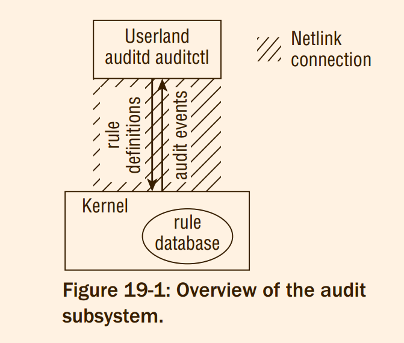
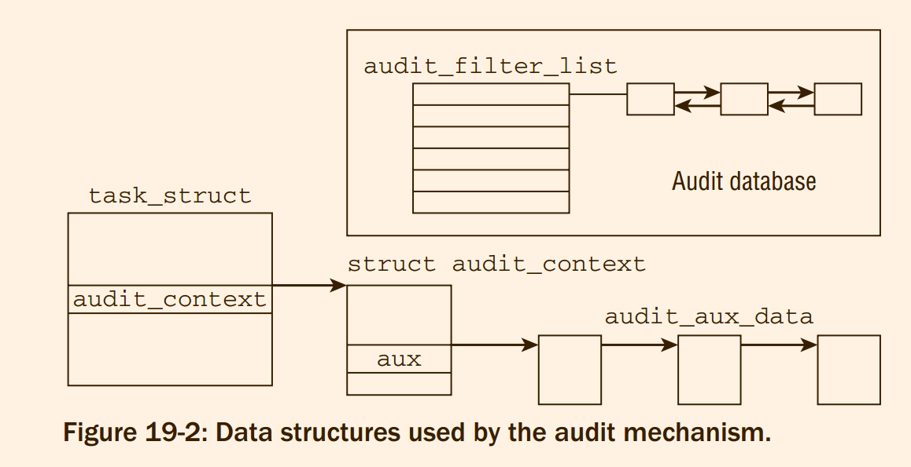

# Professional Linux Kernel Architecture : Auditing
A sketch of the overall design of the audit subsystem is depicted in Figure 19-1. The kernel contains a
database with rules to specify the events that must be recorded. The database is filled from userland by
means of the auditctl tool. If a certain event happens and the kernel decides per the database that it
must be audited, a message is sent to the auditd daemon. The daemon can store the message in a log file
for further inspection. Communication between userland and the kernel (rule manipulation and message
transmission) is performed with the aid of a netlink socket (this connection mechanism was discussed
in Chapter 12). The kernel and userland parts of the audit mechanism are mutually dependent on each
other. Because the impact of audit on the kernel is minimal if only events are logged that appear with
comparatively low frequency, the implementation is also referred to as the lightweight auditing framework.


> 1. database 中间持有 rules, 来表示需要被执行的内容。
> 2. user auditctl 如何访问到 database, 通过什么 syscall 的，
> 3. aduitd 的生命周期和工作内容 ?
> 4. netlink ?
> 5. 一个检测，怎么，他怎么知道应该被放到哪里 ?


To further decrease the impact on system performance, the audit mechanism distinguishes between two
types of audit events, as follows:
1. **System call** auditing allows recording whenever the kernel enters or leaves a system call.
Although additional constraints can be specified to limit the number of logged events (for
example, a restriction to a certain UID), system calls still happen with a rather high frequency,
so a certain impact on system performance is unavoidable if system call auditing is employed.
2. All other types of events that are not directly connected with system calls are handled separately.
It is possible to disable auditing of system calls and to record only events of this type. This will
affect the system load only very little
> 由于syscall 的数量众多，所以 audit 类型被划分为两个种类。

In general, the audit
mechanism allows (trusted) applications to be traced in a more task-oriented manner (i.e., from a higherlevel point of view) than pure system call tracing (as implemented by ptrace) would allow

## 19.2 Audit Rules
> 介绍了 audit 在用户层的使用方法
> sudo systemctl start audit.service 在进行试验之前

In general, an audit rule consists of the following components:
1. The basic information is given by a filter/value pair. The filter denotes the kind of event to which
the rule belongs. Examples for possible values are entry for system call entrance or task for task
creation auditing.
2. The value can either be NEVER or ALWAYS. Although the latter choice enables a rule, the first one
is used to suppress generation of audit events. This is meaningful because all rules for a given
filter type are stored in a list, and the first rule that matches is applied. By placing a NEVER rule in
front, this allows you to (temporarily) disable processing of rules that would normally generate
audit events.

## 19.3 Implementation
The audit mechanism uses data structures that fall into three main categories. 
- processes need to be instrumented with a per-task data structure that is especially important for system call auditing. 
- audit events, filtering rules and so on need to be represented within the kernel. 
- a communication mechanism with the userland utilities needs to be established.

The code is basically distributed across three files:
1. `kernel/audit.c` provides the core audit mechanism.
2. `kernel/auditsc.c` implements system call auditing.
3. `kernel/auditfilter.c` contains means to **filter audit events**.
4. Another file, `kernel/audit_tree.c`, contains data structures and routines that allow auditing of complete directory trees. Since a rather large amount of code is required to implement this comparatively
small benefit, for simplicity’s sake this chapter does not discuss this possibility any further.

Figure 19-2 illustrates the connection of the different data structures that form the core of the auditing
mechanism

As is the case for most parts of the kernel, understanding the data structures of the audit framework is a
big step toward understanding the implementation.
> 的确如此，是时候搞一个关键的结构体总结了



#### 19.3.1 Data Structures


* ***Extensions to task_struct***

```c
strutc task_struct{
...
	struct audit_context *audit_context;
#ifdef CONFIG_AUDITSYSCALL
	kuid_t loginuid;
	unsigned int sessionid;
#endif
...
}
```

```c
/* The per-task audit context. */
struct audit_context {
	int		    dummy;	/* must be the first element */
	int		    in_syscall;	/* 1 if task is in a syscall */
	enum audit_state    state, current_state;
	unsigned int	    serial;     /* serial number for record */
	int		    major;      /* syscall number */
	struct timespec64   ctime;      /* time of syscall entry */
	unsigned long	    argv[4];    /* syscall arguments */
	long		    return_code;/* syscall return code */
	u64		    prio;
	int		    return_valid; /* return code is valid */
	/*
	 * The names_list is the list of all audit_names collected during this
	 * syscall.  The first AUDIT_NAMES entries in the names_list will
	 * actually be from the preallocated_names array for performance
	 * reasons.  Except during allocation they should never be referenced
	 * through the preallocated_names array and should only be found/used
	 * by running the names_list.
	 */
	struct audit_names  preallocated_names[AUDIT_NAMES];
	int		    name_count; /* total records in names_list */
	struct list_head    names_list;	/* struct audit_names->list anchor */
	char		    *filterkey;	/* key for rule that triggered record */
	struct audit_aux_data *aux;
	struct audit_aux_data *aux_pids;
	struct sockaddr_storage *sockaddr;
	size_t sockaddr_len;
				/* Save things to print about task_struct */
	pid_t		    pid, ppid;
	kuid_t		    uid, euid, suid, fsuid;
	kgid_t		    gid, egid, sgid, fsgid;
	unsigned long	    personality;
	int		    arch;

	pid_t		    target_pid;
	kuid_t		    target_auid;
	kuid_t		    target_uid;
	unsigned int	    target_sessionid;
	u32		    target_sid;
	char		    target_comm[TASK_COMM_LEN];

	struct audit_tree_refs *trees, *first_trees;
	struct list_head killed_trees;
	int tree_count;

	int type;
	union {
		struct {
			int nargs;
			long args[6];
		} socketcall;
		struct {
			kuid_t			uid;
			kgid_t			gid;
			umode_t			mode;
			u32			osid;
			int			has_perm;
			uid_t			perm_uid;
			gid_t			perm_gid;
			umode_t			perm_mode;
			unsigned long		qbytes;
		} ipc;
		struct {
			mqd_t			mqdes;
			struct mq_attr		mqstat;
		} mq_getsetattr;
		struct {
			mqd_t			mqdes;
			int			sigev_signo;
		} mq_notify;
		struct {
			mqd_t			mqdes;
			size_t			msg_len;
			unsigned int		msg_prio;
			struct timespec64	abs_timeout;
		} mq_sendrecv;
		struct {
			int			oflag;
			umode_t			mode;
			struct mq_attr		attr;
		} mq_open;
		struct {
			pid_t			pid;
			struct audit_cap_data	cap;
		} capset;
		struct {
			int			fd;
			int			flags;
		} mmap;
		struct {
			int			argc;
		} execve;
		struct {
			char			*name;
		} module;
	};
	int fds[2];
	struct audit_proctitle proctitle;
};
```
Most elements of the data structure are concisely described by their accompanying comments, and the
undocumented entries are as follows:
1. `state` denotes the activity level of auditing. 
2. `names` enables you to store the data of up to `AUDIT_NAMES` (usually set to 20) filesystem objects
(the precise contents of this structure will be defined in a moment). `name_count` records how
many of the available slots are presently in use.
> `preallocated_names` 
3. `audit_aux_data` allows for storing auxiliary data in addition to the audit context

```c
/* At task start time, the audit_state is set in the audit_context using
   a per-task filter.  At syscall entry, the audit_state is augmented by
   the syscall filter. */
enum audit_state {
	AUDIT_DISABLED,		/* Do not create per-task audit_context.
				 * No syscall-specific audit records can
				 * be generated. */
	AUDIT_BUILD_CONTEXT,	/* Create the per-task audit_context,
				 * and fill it in at syscall
				 * entry time.  This makes a full
				 * syscall record available if some
				 * other part of the kernel decides it
				 * should be recorded. */
	AUDIT_RECORD_CONTEXT	/* Create the per-task audit_context,
				 * always fill it in at syscall entry
				 * time, and always write out the audit
				 * record at syscall exit time.  */
};
```

The need to store information about filesystem objects arises when system calls are being audited. The
following data structure provides a means to store this information:


```c
/* When fs/namei.c:getname() is called, we store the pointer in name and bump
 * the refcnt in the associated filename struct.
 *
 * Further, in fs/namei.c:path_lookup() we store the inode and device.
 */
struct audit_names {
	struct list_head	list;		/* audit_context->names_list */

	struct filename		*name;
	int			name_len;	/* number of chars to log */
	bool			hidden;		/* don't log this record */

	unsigned long		ino;
	dev_t			dev;
	umode_t			mode;
	kuid_t			uid;
	kgid_t			gid;
	dev_t			rdev;
	u32			osid;
	struct audit_cap_data	fcap;
	unsigned int		fcap_ver;
	unsigned char		type;		/* record type */
	/*
	 * This was an allocated audit_names and not from the array of
	 * names allocated in the task audit context.  Thus this name
	 * should be freed on syscall exit.
	 */
	bool			should_free;
};
```


```c
struct audit_aux_data {
	struct audit_aux_data	*next;
	int			type;
};


struct audit_aux_data_pids {
	struct audit_aux_data	d;
	pid_t			target_pid[AUDIT_AUX_PIDS];
	kuid_t			target_auid[AUDIT_AUX_PIDS];
	kuid_t			target_uid[AUDIT_AUX_PIDS];
	unsigned int		target_sessionid[AUDIT_AUX_PIDS];
	u32			target_sid[AUDIT_AUX_PIDS];
	char 			target_comm[AUDIT_AUX_PIDS][TASK_COMM_LEN];
	int			pid_count;
};
```
Note that a struct `audit_aux_data` is located at the very beginning of `audit_aux_data_pids`; the real
payload follows afterward. This allows for using generic methods for list traversal and manipulation.

Currently, the kernel defines auxiliary data structures for numerous object types:
- audit_aux_data_ipcctl (for auxiliary objects of type AUDIT_IPC and AUDIT_IPC_SET_PERM)
- audit_aux_data_socketcall (type AUDIT_SOCKETCALL)
- audit_aux_data_sockaddr (type AUDIT_SOCKADDR)
- audit_aux_data_datapath (type AUDIT_AVC_PATH)
- audit_aux_data_data_execve (type AUDIT_EXECVE)
- `audit_aux_data_mq_`{open,sendrewcv,notify,getsetattr} (types `AUDIT_MQ_`{OPEN,SENDRECV,NOTIFY,GETSETATTR})
- audit_aux_data_fd_pair (type AUDIT_FD_PAIR)
> @todo 被取代了，这些东西

Since the general structure of all other auxiliary audit data structures is similar, this section doesn’t bother
with showing them explicitly. You can refer to kernel/auditsc.c for their definitions.

* ***Records, Rules and Filtering***

> 上面讲解了 : task_struct 中间扩展 audit_context 实现对于 task 的 audit 跟踪
> 此处分析如何记录 audit 事件 以及 以及对于规则
> @todo 为什么感觉规则像是每次碰到可以 audit 的位置，然后就对于规则链全部走一遍一样。

```c
/* The audit_buffer is used when formatting an audit record.  The caller
 * locks briefly to get the record off the freelist or to allocate the
 * buffer, and locks briefly to send the buffer to the netlink layer or
 * to place it on a transmit queue.  Multiple audit_buffers can be in
 * use simultaneously. */
struct audit_buffer {
	struct sk_buff       *skb;	/* formatted skb ready to send */
	struct audit_context *ctx;	/* NULL or associated context */
	gfp_t		     gfp_mask;
};
```
`list` is a list element that allows for storing the buffer on various lists. Since netlink sockets are used
to communicate between kernel and userland, a socket buffer of type sk_buff is used to encapsulate
messages. The connection with the audit context is realized by `ctx` (which may also be a NULL pointer if
no context exists because system call auditing is disabled), and `gfp_mask` finally determines from which
memory pool allocations are supposed to be satisfied.

Since audit buffers are frequently used, the kernel keeps a number of pre-allocated instances of
audit_buffer ready for use. `audit_buffer_alloc` and `audit_buffer_free` are responsible for
allocating and initializing new buffers respectively freeing them — handling the audit buffer cache
is implicitly performed by these functions. Their implementation is straightforward, so they are not
discussed any further here.

An audit rule that is transferred from userspace into the kernel is represented by the following data
structure:
```c
/* audit_rule_data supports filter rules with both integer and string
 * fields.  It corresponds with AUDIT_ADD_RULE, AUDIT_DEL_RULE and
 * AUDIT_LIST_RULES requests.
 */
struct audit_rule_data {
	__u32		flags;	/* AUDIT_PER_{TASK,CALL}, AUDIT_PREPEND */
	__u32		action;	/* AUDIT_NEVER, AUDIT_POSSIBLE, AUDIT_ALWAYS */
	__u32		field_count;
	__u32		mask[AUDIT_BITMASK_SIZE]; /* syscall(s) affected */
	__u32		fields[AUDIT_MAX_FIELDS];
	__u32		values[AUDIT_MAX_FIELDS];
	__u32		fieldflags[AUDIT_MAX_FIELDS];
	__u32		buflen;	/* total length of string fields */
	char		buf[0];	/* string fields buffer */
};
```

When a rule matches, two actions (as denoted by action) can be performed. `AUDIT_NEVER` simply does
nothing, and `AUDIT_ALWAYS` generates an audit record.

While `struct audit_rule_data` is employed to transmit rules from userspace to the kernel, two more
data structures are used to represent rules within the kernel itself. They are defined as follows:
```c
struct audit_field {
	u32				type;
	union {
		u32			val;
		kuid_t			uid;
		kgid_t			gid;
		struct {
			char		*lsm_str;
			void		*lsm_rule;
		};
	};
	u32				op;
};

struct audit_krule {
	u32			pflags;
	u32			flags;
	u32			listnr;
	u32			action;
	u32			mask[AUDIT_BITMASK_SIZE];
	u32			buflen; /* for data alloc on list rules */
	u32			field_count;
	char			*filterkey; /* ties events to rules */
	struct audit_field	*fields;
	struct audit_field	*arch_f; /* quick access to arch field */
	struct audit_field	*inode_f; /* quick access to an inode field */
	struct audit_watch	*watch;	/* associated watch */
	struct audit_tree	*tree;	/* associated watched tree */
	struct audit_fsnotify_mark	*exe;
	struct list_head	rlist;	/* entry in audit_{watch,tree}.rules list */
	struct list_head	list;	/* for AUDIT_LIST* purposes only */
	u64			prio;
};
```

To convert between both audit rule representations, the kernel provides the auxiliary function
`audit_rule_to_entry`

Note that new rules are added with `audit_add_rule` that is called when an appropriate request is sent
from the auditd daemon to the kernel. Since this routine is likewise rather technical and mostly uninteresting, this section does not cover it in detail.
> 所以，rule 是用户定义的监听规则，但是auditfilter 是什么 ?

#### 19.3.2 Initialization

There is also a kernel thread for the audit mechanism. Instead of starting the thread during subsystem
initialization, a slightly unconventional way has been chosen: As soon as the userspace daemon `auditd`
sends the first message, the kernel thread `kaudit_task` is started. The function executed by the thread
is `kauditd_thread`, which is responsible for sending already prepared messages from the kernel to the
userspace daemon. **Note that this daemon is necessary because an audit event may end within an interrupt handler, 
and since the netlink functions cannot be called from here, the finished audit records are
put on a queue and processed later by the kernel daemon that sends them back to userspace.** *Sending
and receiving is performed with a simple netlink operation and standard queue processing, as discussed
in Chapter 12.*
> 实际上，kauditd_thread 就是在 audit_init 中间
> 需要使用 audit 的原因 : @todo audit event may end within an interrupt handler (什么叫做 end within ), since the netlink cannot be called from here (netlink 为什么不可以在 interrupt handler 的地方使用)
> @todo chapter 12 了解一下


`audit_receive_message` first uses
`audit_netlink_ok` to verify that the sender is allowed to perform the request. If the request was
authorized, the function verifies that the kernel daemon is already running. Should this not be the case
because no request has been sent before, kauditd is launched.

#### 19.3.3 Processing Requests

#### 19.3.4 Logging Events
> 介绍 audit.c 中间的几个 log 函数

#### 19.3.5 System Call Auditing
> @todo skip 

> 本section  分析 auditsc.c 中间的内容，但是我需要理解 audit_tree.c 和 audit_watch.c 中间的内容。

#### 19.4 Summary

## Summary


> 哇，这简直是什么东西啊 !
> 这样的阅读简直是如同嚼蜡一样

