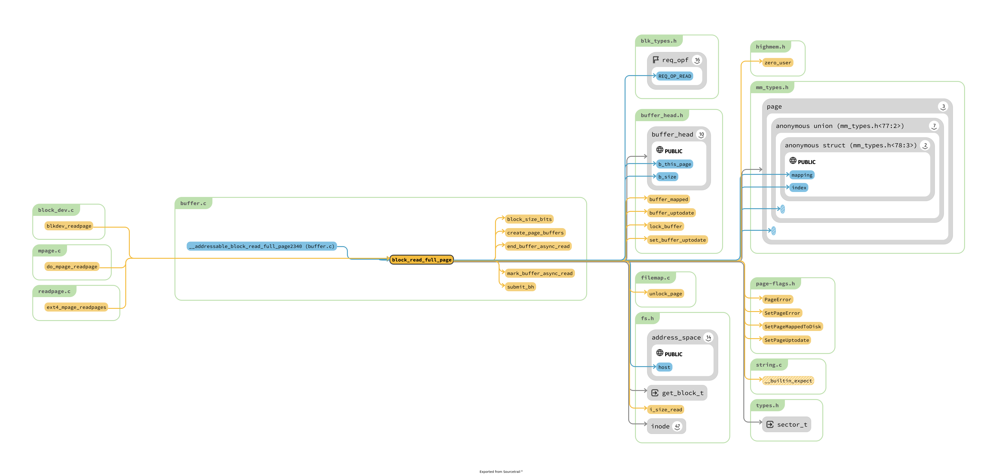

# fs/buffer.c


## 总结一下
1. bh_lru 是如何管理的 ? bh_lru_install

## questions && todo
1. 找到 dev 的 address_spaces 是怎么注册上的
    1. bdget 吗 ? : def_blk_aops : 不会吧!

```c
static struct buffer_head *
__find_get_block_slow(struct block_device *bdev, sector_t block) {
	struct inode *bd_inode = bdev->bd_inode;
	struct address_space *bd_mapping = bd_inode->i_mapping; // 利用此处的 address_space 搜索

struct block_device *bdget(dev_t dev)  // 此处初始化 dev  // todo 但是并不知道如何初始化inode 的 i_data
{
	struct block_device *bdev;
	struct inode *inode;

	inode = iget5_locked(blockdev_superblock, hash(dev),
			bdev_test, bdev_set, &dev);

	if (!inode)
		return NULL;

	bdev = &BDEV_I(inode)->bdev;

	if (inode->i_state & I_NEW) {
		bdev->bd_contains = NULL;
		bdev->bd_super = NULL;
		bdev->bd_inode = inode;
		bdev->bd_block_size = i_blocksize(inode);
		bdev->bd_part_count = 0;
		bdev->bd_invalidated = 0;
		inode->i_mode = S_IFBLK;
		inode->i_rdev = dev;
		inode->i_bdev = bdev;
		inode->i_data.a_ops = &def_blk_aops; // 只是知道此处处理了 aops 而已
		mapping_set_gfp_mask(&inode->i_data, GFP_USER);
		spin_lock(&bdev_lock);
		list_add(&bdev->bd_list, &all_bdevs);
		spin_unlock(&bdev_lock);
		unlock_new_inode(inode);
	}
	return bdev;
}
```

2. 到底到底怎样的 page 和 buffer head 不会发生关联, 只要是利用了　block_read_full_page 的函数，都是会观念上的 

3. get_block_t 的作用到底是什么 ?
    1. 从 block_read_full_page 中间分析 : get_block_t 是提供inode, page 在inode 中间的偏移量，以及 bh 指针，最后提交了 bh 所需要的内容。

4. buffer.c 是唯一和 bio 打交道的地方吗 ? page-writeback.c page-io.c 中间存在吗 ?

## DOC

- [difference](https://stackoverflow.com/questions/6345020/what-is-the-difference-between-buffer-vs-cache-memory-in-linux)


## block_read_full_page && block_write_full_page
1. 两个函数具有对称性
2. 最后的工作都是交给 bio 完成的

```c
/*
 * Generic "read page" function for block devices that have the normal
 * get_block functionality. This is most of the block device filesystems.
 * Reads the page asynchronously --- the unlock_buffer() and
 * set/clear_buffer_uptodate() functions propagate buffer state into the
 * page struct once IO has completed.
 */
int block_read_full_page(struct page *page, get_block_t *get_block) 

/*
 * The generic ->writepage function for buffer-backed address_spaces
 */
int block_write_full_page(struct page *page, get_block_t *get_block, // 需要处理边界问题，实际工作交 __block_write_full_page
```



1. @todo block_read_full_page 的三个调用来源真的非常奇怪啊 ?
2. @todo block_write_full_page 的调用为什么和 block_read_full_page 的调用来源不同呀 ?


block_write_full_page 的调用位置: 这就是文件系统提供向 block layer 实现 io 的部分，所以 TM 的非常奇怪了，这怎么
```c
const struct address_space_operations ext2_aops = {
	.readpage		= ext2_readpage,
	.readpages		= ext2_readpages,
	.writepage		= ext2_writepage,
	.write_begin		= ext2_write_begin,
	.write_end		= ext2_write_end,
	.bmap			= ext2_bmap,
	.direct_IO		= ext2_direct_IO,
	.writepages		= ext2_writepages,
	.migratepage		= buffer_migrate_page,
	.is_partially_uptodate	= block_is_partially_uptodate,
	.error_remove_page	= generic_error_remove_page,
};


static int ext2_writepage(struct page *page, struct writeback_control *wbc)
{
	return block_write_full_page(page, ext2_get_block, wbc);
}

static int ext2_readpage(struct file *file, struct page *page)
{
	return mpage_readpage(page, ext2_get_block); // XXX 注意 mpage 最后还是访问到内核中间
}
```
## get_block_t
1. 既然所有的函数都是使用这一个东西。
2. @todo 等到 2.20 之后，进入到 ucore 之后，再返回过来分析。


```c
int ext2_get_block(struct inode *inode, sector_t iblock,
		struct buffer_head *bh_result, int create)
{
	unsigned max_blocks = bh_result->b_size >> inode->i_blkbits;
	bool new = false, boundary = false;
	u32 bno;
	int ret;

	ret = ext2_get_blocks(inode, iblock, max_blocks, &bno, &new, &boundary,
			create);
	if (ret <= 0)
		return ret;

	map_bh(bh_result, inode->i_sb, bno);
	bh_result->b_size = (ret << inode->i_blkbits);
	if (new)
		set_buffer_new(bh_result);
	if (boundary)
		set_buffer_boundary(bh_result);
	return 0;

}
```

## buffer_head
1. 似乎注释说: buffer 和 cache 功能没有任何蛇皮关系 ? 其功能曾经是 bio 功能，位于 fs 和 blocklayer 之间的
2. @todo buffer_head 新的三个功能逐个分析一下 !
    1. get_block_t : 感觉功能其实是 : 
    2. 

```c
/*
 * Historically, a buffer_head was used to map a single block
 * within a page, and of course as the unit of I/O through the
 * filesystem and block layers.  Nowadays the basic I/O unit
 * is the bio, and buffer_heads are used for extracting block
 * mappings (via a get_block_t call), for tracking state within
 * a page (via a page_mapping) and for wrapping bio submission
 * for backward compatibility reasons (e.g. submit_bh).
 */
struct buffer_head {
	unsigned long b_state;		/* buffer state bitmap (see above) */
	struct buffer_head *b_this_page;/* circular list of page's buffers */
	struct page *b_page;		/* the page this bh is mapped to */

	sector_t b_blocknr;		/* start block number */
	size_t b_size;			/* size of mapping */
	char *b_data;			/* pointer to data within the page */

	struct block_device *b_bdev;
	bh_end_io_t *b_end_io;		/* I/O completion */
 	void *b_private;		/* reserved for b_end_io */
	struct list_head b_assoc_buffers; /* associated with another mapping */
	struct address_space *b_assoc_map;	/* mapping this buffer is
						   associated with */
	atomic_t b_count;		/* users using this buffer_head */
};

enum bh_state_bits {
	BH_Uptodate,	/* Contains valid data */
	BH_Dirty,	/* Is dirty */
	BH_Lock,	/* Is locked */
	BH_Req,		/* Has been submitted for I/O */
	BH_Uptodate_Lock,/* Used by the first bh in a page, to serialise
			  * IO completion of other buffers in the page
			  */

	BH_Mapped,	/* Has a disk mapping */
	BH_New,		/* Disk mapping was newly created by get_block */
	BH_Async_Read,	/* Is under end_buffer_async_read I/O */
	BH_Async_Write,	/* Is under end_buffer_async_write I/O */
	BH_Delay,	/* Buffer is not yet allocated on disk */
	BH_Boundary,	/* Block is followed by a discontiguity */
	BH_Write_EIO,	/* I/O error on write */
	BH_Unwritten,	/* Buffer is allocated on disk but not written */
	BH_Quiet,	/* Buffer Error Prinks to be quiet */
	BH_Meta,	/* Buffer contains metadata */
	BH_Prio,	/* Buffer should be submitted with REQ_PRIO */
	BH_Defer_Completion, /* Defer AIO completion to workqueue */

	BH_PrivateStart,/* not a state bit, but the first bit available
			 * for private allocation by other entities
			 */
};
```

> @todo
1. BH_Dirty 和 page cache 中间 page 的 dirty 的功能是不是出现了重复了
2. BH_Mapped 此处的 map 的含义是什么 ?
3. 


当一个结构体存在引用计数的时候，意味着:
1. 被共享 @todo 为什么一个 block 需要被共享 ?
2. 何时创建和释放 ?

```c
static inline void get_bh(struct buffer_head *bh)
{
        atomic_inc(&bh->b_count);
}

static inline void put_bh(struct buffer_head *bh)
{
        smp_mb__before_atomic();
        atomic_dec(&bh->b_count);
}
```

## 2
> 分析和 independent buffer 的内容:

```c


/*
 * Create the page-cache page that contains the requested block.
 *
 * This is used purely for blockdev mappings.
 */
static int
grow_dev_page(struct block_device *bdev, sector_t block,
	      pgoff_t index, int size, int sizebits, gfp_t gfp)
```

## 3
> 各种同步函数


## `__set_page_dirty_buffers`
1. 其主要调用者为 : set_page_dirty
2. 具体工作分为两个部分 : dirty page : 在radix tree 上插入 tag ，第二个是 dirty inode ，将 inode 加入到 sb 的 dirty node 的链表上去
3. 这些维护的内容最终是在 : `__writeback_single_inode` 中间使用


## create_empty_buffers : 为 page 创建与其对应的 buffer

```c
/*
 * We attach and possibly dirty the buffers atomically wrt
 * __set_page_dirty_buffers() via private_lock.  try_to_free_buffers
 * is already excluded via the page lock.
 */
void create_empty_buffers(struct page *page,
			unsigned long blocksize, unsigned long b_state) // map_buffer_to_page 调用此函数，可以追踪到此处的 page 就是page cache 的 page 
{
	struct buffer_head *bh, *head, *tail;

	head = alloc_page_buffers(page, blocksize, true); // 使用 kmalloc 创建正好和 page blocksize 挂钩的 buffer head ，并且将各种关系初始化
	bh = head;
	do {
		bh->b_state |= b_state;
		tail = bh;
		bh = bh->b_this_page;
	} while (bh);
	tail->b_this_page = head;

	spin_lock(&page->mapping->private_lock);
	if (PageUptodate(page) || PageDirty(page)) { // 根据 Page uptodate 和 dirty 设置 buffer 的对应属性，但是 todo 为什么 buffer 需要这个属性，表示的含义有什么不同吗 ?
		bh = head;
		do {
			if (PageDirty(page))
				set_buffer_dirty(bh);
			if (PageUptodate(page))
				set_buffer_uptodate(bh);
			bh = bh->b_this_page;
		} while (bh != head);
	}
	attach_page_buffers(page, head); // 设置 priavate 项目
	spin_unlock(&page->mapping->private_lock);
}
EXPORT_SYMBOL(create_empty_buffers);

```

## `__getblk_gfp` : getblk 

```c
/*
 * __getblk_gfp() will locate (and, if necessary, create) the buffer_head
 * which corresponds to the passed block_device, block and size. The
 * returned buffer has its reference count incremented.
 *
 * __getblk_gfp() will lock up the machine if grow_dev_page's
 * try_to_free_buffers() attempt is failing.  FIXME, perhaps?
 */
struct buffer_head *
__getblk_gfp(struct block_device *bdev, sector_t block,
	     unsigned size, gfp_t gfp) // 这个 size 就是 blocksize，应该不会出现蛇皮的状况
{
	struct buffer_head *bh = __find_get_block(bdev, block, size); // XXX 查询

	might_sleep();
	if (bh == NULL)
		bh = __getblk_slow(bdev, block, size, gfp);  // 进行读取，调用 grow_buffers
	return bh;
}
EXPORT_SYMBOL(__getblk_gfp);

/*
 * Perform a pagecache lookup for the matching buffer.  If it's there, refresh
 * it in the LRU and mark it as accessed.  If it is not present then return
 * NULL
 */
struct buffer_head *
__find_get_block(struct block_device *bdev, sector_t block, unsigned size)
{
	struct buffer_head *bh = lookup_bh_lru(bdev, block, size); // 一个大小为 16 percpu bh 的缓冲区，// todo 为什么我们需要这个 buffer

	if (bh == NULL) {
		/* __find_get_block_slow will mark the page accessed */
		bh = __find_get_block_slow(bdev, block); // 利用 bdev 上的 radix tree 进行查询到 page ，然后对于 page 中间 buffer head 询问是否存在
		if (bh)
			bh_lru_install(bh); // lru，老的自动被替换
	} else
		touch_buffer(bh); // XXX 将 buffer 所在的 page mark_page_accessed()

	return bh;
}
EXPORT_SYMBOL(__find_get_block);


/*
 * Create buffers for the specified block device block's page.  If
 * that page was dirty, the buffers are set dirty also.
 */
static int
grow_buffers(struct block_device *bdev, sector_t block, int size, gfp_t gfp)
{
	pgoff_t index;
	int sizebits;

	sizebits = -1;
	do {
		sizebits++;
	} while ((size << sizebits) < PAGE_SIZE);

	index = block >> sizebits;

	/*
	 * Check for a block which wants to lie outside our maximum possible
	 * pagecache index.  (this comparison is done using sector_t types).
	 */
	if (unlikely(index != block >> sizebits)) { // XXX 对于当前配置 sector_t 和 pgoff_t 的长度，这个检查对于当前的配置并无必要，其实修改成为 macro
		printk(KERN_ERR "%s: requested out-of-range block %llu for "
			"device %pg\n",
			__func__, (unsigned long long)block,
			bdev);
		return -EIO;
	}

	/* Create a page with the proper size buffers.. */
	return grow_dev_page(bdev, block, index, size, sizebits, gfp);
}

/*
 * Create the page-cache page that contains the requested block.
 *
 * This is used purely for blockdev mappings.
 */
static int
grow_dev_page(struct block_device *bdev, sector_t block,
	      pgoff_t index, int size, int sizebits, gfp_t gfp)
{
	struct inode *inode = bdev->bd_inode;
	struct page *page;
	struct buffer_head *bh;
	sector_t end_block;
	int ret = 0;		/* Will call free_more_memory() */
	gfp_t gfp_mask;

	gfp_mask = mapping_gfp_constraint(inode->i_mapping, ~__GFP_FS) | gfp;

	/*
	 * XXX: __getblk_slow() can not really deal with failure and
	 * will endlessly loop on improvised global reclaim.  Prefer
	 * looping in the allocator rather than here, at least that
	 * code knows what it's doing.
	 */
	gfp_mask |= __GFP_NOFAIL;

	page = find_or_create_page(inode->i_mapping, index, gfp_mask);

	BUG_ON(!PageLocked(page));

	if (page_has_buffers(page)) {
		bh = page_buffers(page);
		if (bh->b_size == size) { // 如果正好的，那就利用一下
			end_block = init_page_buffers(page, bdev,
						(sector_t)index << sizebits,
						size);
			goto done;
		}
		if (!try_to_free_buffers(page)) // 应该是由于 ref 的存在，此处的只会清理掉 buffer 而不会释放 page 出去
			goto failed;
	}

  // 下面就是各种初始化的工作了 !
	/*
	 * Allocate some buffers for this page
	 */
	bh = alloc_page_buffers(page, size, true);

	/*
	 * Link the page to the buffers and initialise them.  Take the
	 * lock to be atomic wrt __find_get_block(), which does not
	 * run under the page lock.
	 */
	spin_lock(&inode->i_mapping->private_lock);
	link_dev_buffers(page, bh);
	end_block = init_page_buffers(page, bdev, (sector_t)index << sizebits,
			size);
	spin_unlock(&inode->i_mapping->private_lock);
done:
	ret = (block < end_block) ? 1 : -ENXIO;
failed:
	unlock_page(page);
	put_page(page);
	return ret;
}
```


## try_to_free_buffers : 释放 page 及其关联的 buffer head 等

```c
int try_to_free_buffers(struct page *page)
{
	struct address_space * const mapping = page->mapping;
	struct buffer_head *buffers_to_free = NULL;
	int ret = 0;

	BUG_ON(!PageLocked(page));
	if (PageWriteback(page))
		return 0;

	if (mapping == NULL) {		/* can this still happen? */
		ret = drop_buffers(page, &buffers_to_free);
		goto out;
	}

	spin_lock(&mapping->private_lock);
	ret = drop_buffers(page, &buffers_to_free);

	/*
	 * If the filesystem writes its buffers by hand (eg ext3)
	 * then we can have clean buffers against a dirty page.  We
	 * clean the page here; otherwise the VM will never notice
	 * that the filesystem did any IO at all.
	 *
	 * Also, during truncate, discard_buffer will have marked all
	 * the page's buffers clean.  We discover that here and clean
	 * the page also.
	 *
	 * private_lock must be held over this entire operation in order
	 * to synchronise against __set_page_dirty_buffers and prevent the
	 * dirty bit from being lost.
	 */
   // todo 注释读
	if (ret)
		cancel_dirty_page(page); // todo 没看这个
	spin_unlock(&mapping->private_lock);
out:
	if (buffers_to_free) {
		struct buffer_head *bh = buffers_to_free;

		do {
			struct buffer_head *next = bh->b_this_page;
			free_buffer_head(bh);
			bh = next;
		} while (bh != buffers_to_free);
	}
	return ret;
}
```

