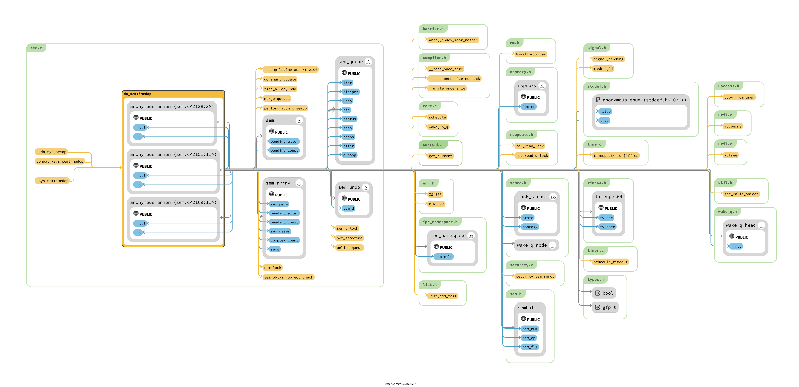

# ipc/sem.c

## todo
1. 最后如何到达 architecture 的 ?
2. 注意，这种 sem 是实现进程之间进行同步的，显然在一个进程中间没有必要如此 ? (现在对于同一个进程的含义已经非常的迷惑了，当考虑内核是 thread process 的概念，只有task 的时候)
3. 为什么 namespace 的感觉只是简单的重新创建了一个空间，parent 对于 children 根本没有控制力可言 ?


## question
1. 为什么需要创建出来一个 sem_array 来 ?
    1. 因为完成工作往往需要多个 sem 协作，这些 sem 属性相同
2.

## doc && ref

Man semop(2)
> If sem_op is less than zero, the process must have alter permission on the semaphore set.  If semval is greater than or equal to the absolute value of sem_op, the operation can proceed immediately: the absolute value of sem_op is subtracted from semval, and, if SEM_UNDO is specified for this operation, the system adds the absolute value of sem_op to the semaphore adjustment (semadj) value for this semaphore.  If the absolute value of sem_op is greater than semval, and IPC_NOWAIT is specified in sem_flg, semop() fails, with errno set to EAGAIN (and none of the operations in sops is performed).  Otherwise, semncnt (the counter of threads waiting for this semaphore's value to increase) is incremented by one and the thread sleeps until one of the following occurs:

## semop
1. 似乎支持多个操作，如何保证这些操作的原子性 ?
2. 支持 SEM_UNDO 需要反向的给 semaphore adjustment 中间操作，然后呢 ?
3. 当 operation 的数量是一个的时候，那么如何使用 ?

```c
SYSCALL_DEFINE3(semop, int, semid, struct sembuf __user *, tsops,
		unsigned, nsops)
{
	return do_semtimedop(semid, tsops, nsops, NULL);
}

long ksys_semtimedop(int semid, struct sembuf __user *tsops,
		     unsigned int nsops, const struct __kernel_timespec __user *timeout)
{
	if (timeout) {
		struct timespec64 ts;
		if (get_timespec64(&ts, timeout))
			return -EFAULT;
		return do_semtimedop(semid, tsops, nsops, &ts);
	}
	return do_semtimedop(semid, tsops, nsops, NULL);
}
```


```c
/* One queue for each sleeping process in the system. */
struct sem_queue {
	struct list_head	list;	 /* queue of pending operations */
	struct task_struct	*sleeper; /* this process */
	struct sem_undo		*undo;	 /* undo structure */
	struct pid		*pid;	 /* process id of requesting process */
	int			status;	 /* completion status of operation */
	struct sembuf		*sops;	 /* array of pending operations */
	struct sembuf		*blocking; /* the operation that blocked */
	int			nsops;	 /* number of operations */
	bool			alter;	 /* does *sops alter the array? */
	bool                    dupsop;	 /* sops on more than one sem_num */
};
```




1. 利用 sem_lock 对于一个组上锁
2. perform_atomic_semop 将每一个操作和 sem array 中间的内容操作
3. 

> 根据 perform_atomic_semop 的操作结果 : error == 0 表示 non-blocking succesfull path 
> error > 0 表示 blocking succesfull path 将队列挂到其中
```c
	if (error == 0) { /* non-blocking succesfull path */
		DEFINE_WAKE_Q(wake_q);

		/*
		 * If the operation was successful, then do
		 * the required updates.
		 */
		if (alter)
			do_smart_update(sma, sops, nsops, 1, &wake_q);
		else
			set_semotime(sma, sops);

		sem_unlock(sma, locknum);
		rcu_read_unlock();
		wake_up_q(&wake_q);

		goto out_free;
	}
	if (error < 0) /* non-blocking error path */
		goto out_unlock_free;

	/*
	 * We need to sleep on this operation, so we put the current
	 * task into the pending queue and go to sleep.
	 */
	if (nsops == 1) {
		struct sem *curr;
		int idx = array_index_nospec(sops->sem_num, sma->sem_nsems);
		curr = &sma->sems[idx];

		if (alter) {
			if (sma->complex_count) {
				list_add_tail(&queue.list,
						&sma->pending_alter);
			} else {

				list_add_tail(&queue.list,
						&curr->pending_alter);
			}
		} else {
			list_add_tail(&queue.list, &curr->pending_const);
		}
	} else {
		if (!sma->complex_count)
			merge_queues(sma);

		if (alter)
			list_add_tail(&queue.list, &sma->pending_alter);
		else
			list_add_tail(&queue.list, &sma->pending_const);

		sma->complex_count++;
	}
  // 上面的部分将 queue 初始化了


	do {
  // non-blocking 的等待
	} while (error == -EINTR && !signal_pending(current)); /* spurious */

	unlink_queue(sma, &queue);

  // 各种释放
```


流程是什么: 混乱
1. sem_unlock sem_lock
2. merge_queues  unlink_queue


```c
do_semtimedop
update_queue
wake_const_ops
  perform_atomic_semop
    perform_atomic_semop_slow

update_queue
  unlink_queue
  do_smart_wake_zero
```
> @todo 上面的调用关系理清楚吧 !
> 但是现在我已经对于，sysv sem 没有什么兴趣了
> 至于其中到底如何优雅的实现 update_queue wake smart 之类的，以后存在疑惑的时候再说


## semget

```c
/**
 * newary - Create a new semaphore set
 * @ns: namespace
 * @params: ptr to the structure that contains key, semflg and nsems
 *
 * Called with sem_ids.rwsem held (as a writer)
 */
static int newary(struct ipc_namespace *ns, struct ipc_params *params)
{
	int retval;
	struct sem_array *sma;
	key_t key = params->key;
	int nsems = params->u.nsems;
	int semflg = params->flg;
	int i;

	if (!nsems)
		return -EINVAL;
	if (ns->used_sems + nsems > ns->sc_semmns)
		return -ENOSPC;

	sma = sem_alloc(nsems);
	if (!sma)
		return -ENOMEM;

	sma->sem_perm.mode = (semflg & S_IRWXUGO);
	sma->sem_perm.key = key;

	sma->sem_perm.security = NULL;
	retval = security_sem_alloc(&sma->sem_perm);
	if (retval) {
		kvfree(sma);
		return retval;
	}

	for (i = 0; i < nsems; i++) {
		INIT_LIST_HEAD(&sma->sems[i].pending_alter);
		INIT_LIST_HEAD(&sma->sems[i].pending_const);
		spin_lock_init(&sma->sems[i].lock);
	}

	sma->complex_count = 0;
	sma->use_global_lock = USE_GLOBAL_LOCK_HYSTERESIS;
	INIT_LIST_HEAD(&sma->pending_alter);
	INIT_LIST_HEAD(&sma->pending_const);
	INIT_LIST_HEAD(&sma->list_id);
	sma->sem_nsems = nsems;
	sma->sem_ctime = ktime_get_real_seconds();

	/* ipc_addid() locks sma upon success. */
	retval = ipc_addid(&sem_ids(ns), &sma->sem_perm, ns->sc_semmni);
	if (retval < 0) {
		ipc_rcu_putref(&sma->sem_perm, sem_rcu_free);
		return retval;
	}
	ns->used_sems += nsems;

	sem_unlock(sma, -1);
	rcu_read_unlock();

	return sma->sem_perm.id;
}
```
1. @todo struct sem_array 和其持有的数组成员 struct sem ，为什么都持有 pending_const 和 pending_alter ?

2. 


## semctl semtiemop
