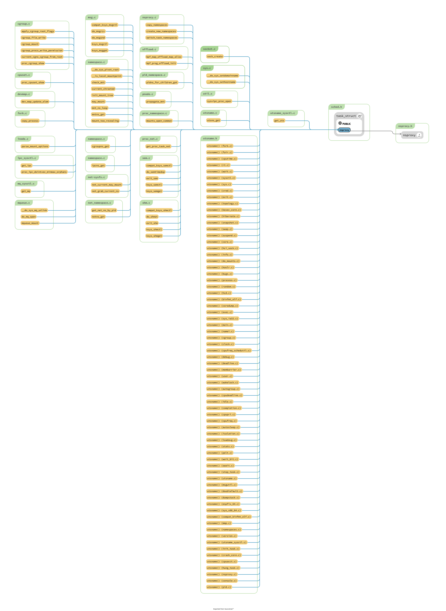

# kernel/nsproxy.c
1. 和 process 关联紧密
2. 在 fork clone unshare 以及 exit 中间调用
3. 当 cgroup 的 namespace 的含义是什么 ?

## TODO
1. CLONE_NEWUSER 的 ref 

## 问题
1. user_namespace 的实现位置在哪里 ?
2. parent 到底可不可以看到我的存在 ? child 层次创建了 msg queue ，那么 parent 可以感知吗 ?


## 学习目标
1. 感觉 namespace 的作用就是实现一个资源标签的重新映射
2. 为什么又要搞出一堆文件出来 在 /proc/1/ns/ 下面呀 ?
3. 和 global resource 的关系是什么 ?
4. 和 control group 的关系是什么 : namespace 控制的都是数值 pid user id port number 等等东西，这些资源感觉都是无穷分配的，或者说不是资源，只是试图创建出来一个干净的感觉!
但是 control group 的感觉完全不同，就是对于 io cpu memory 等资源的控制。所以，ns 想要实现的效果是隔离，我这里搞的事情，在另一个 ns 看不出区别的


## core struct

```c
struct ns_common {
	atomic_long_t stashed;
	const struct proc_ns_operations *ops;
	unsigned int inum;
};
```

```c
/*
 * A structure to contain pointers to all per-process
 * namespaces - fs (mount), uts, network, sysvipc, etc.
 *
 * The pid namespace is an exception -- it's accessed using
 * task_active_pid_ns.  The pid namespace here is the
 * namespace that children will use.
 *
 * 'count' is the number of tasks holding a reference.
 * The count for each namespace, then, will be the number
 * of nsproxies pointing to it, not the number of tasks.
 *
 * The nsproxy is shared by tasks which share all namespaces.
 * As soon as a single namespace is cloned or unshared, the
 * nsproxy is copied.
 */
struct nsproxy {
	atomic_t count;
	struct uts_namespace *uts_ns;
	struct ipc_namespace *ipc_ns;
	struct mnt_namespace *mnt_ns;
	struct pid_namespace *pid_ns_for_children;
	struct net 	     *net_ns;
	struct cgroup_namespace *cgroup_ns;
};
```


```c
struct proc_ns_operations {
	const char *name;
	const char *real_ns_name;
	int type;
	struct ns_common *(*get)(struct task_struct *task);
	void (*put)(struct ns_common *ns);
	int (*install)(struct nsproxy *nsproxy, struct ns_common *ns);
	struct user_namespace *(*owner)(struct ns_common *ns);
	struct ns_common *(*get_parent)(struct ns_common *ns);
} __randomize_layout;

extern const struct proc_ns_operations netns_operations;
extern const struct proc_ns_operations utsns_operations;
extern const struct proc_ns_operations ipcns_operations;
extern const struct proc_ns_operations pidns_operations;
extern const struct proc_ns_operations pidns_for_children_operations;
extern const struct proc_ns_operations userns_operations;
extern const struct proc_ns_operations mntns_operations;
extern const struct proc_ns_operations cgroupns_operations;
// 这大概就是所有的 proc_ns_operations 了吧!
```

5. 如何创建出来的虚拟空间 ?

## ref && doc

Man setns(2)

- Man ipc_namespace(7)

> IPC namespaces isolate certain IPC resources, namely, System V IPC objects (see sysvipc(7)) and (since Linux 2.6.30) POSIX message queues (see mq_overview(7)).  The common characteristic of these IPC mechanisms is that IPC objects are identified by mechanisms other than filesystem pathnames.

> Each IPC namespace has its own set of System V IPC identifiers and its own POSIX message queue filesystem.  Objects created in an IPC namespace are visible to all other processes that are members of that namespace, but are not visible to processes in other IPC namespaces.

IPC 需要在该空间中间使用 identifiers 来确定，当切换到一个新的空间之后，原来的 identifiers 就消失了。

- Man pid_namespace(7)

> PID namespaces isolate the process ID number space, meaning that processes in different PID namespaces can have the same PID.  PID namespaces allow containers to provide functionality such as suspending/resuming the set of processes in the container and migrating the container to a new host while the processes inside the container maintain the same PIDs.

> If the "init" process of a PID namespace terminates, the kernel terminates all of the processes in the namespace via a SIGKILL signal.

- Man user_namespace(7)

太他妈长了


## include/linux/nsproxy.h
```c
struct mnt_namespace;
struct uts_namespace;
struct ipc_namespace;
struct pid_namespace;
struct cgroup_namespace;
// 为什么没有 net_ns，user 


/*
 * A structure to contain pointers to all per-process
 * namespaces - fs (mount), uts, network, sysvipc, etc.
 *
 * The pid namespace is an exception -- it's accessed using
 * task_active_pid_ns.  The pid namespace here is the
 * namespace that children will use.
 *
 * 'count' is the number of tasks holding a reference.
 * The count for each namespace, then, will be the number
 * of nsproxies pointing to it, not the number of tasks.
 *
 * The nsproxy is shared by tasks which share all namespaces.
 * As soon as a single namespace is cloned or unshared, the
 * nsproxy is copied.
 */
struct nsproxy {
	atomic_t count;
	struct uts_namespace *uts_ns;
	struct ipc_namespace *ipc_ns;
	struct mnt_namespace *mnt_ns;
	struct pid_namespace *pid_ns_for_children;
	struct net 	     *net_ns;
	struct cgroup_namespace *cgroup_ns;
  // todo 为什么没有 user 的 : Man namespace(7) 可以找到 7 个
};
extern struct nsproxy init_nsproxy;

/*
 * the namespaces access rules are:
 *
 *  1. only current task is allowed to change tsk->nsproxy pointer or
 *     any pointer on the nsproxy itself.  Current must hold the task_lock
 *     when changing tsk->nsproxy.
 *
 *  2. when accessing (i.e. reading) current task's namespaces - no
 *     precautions should be taken - just dereference the pointers
 *
 *  3. the access to other task namespaces is performed like this
 *     task_lock(task);
 *     nsproxy = task->nsproxy;
 *     if (nsproxy != NULL) {
 *             / *
 *               * work with the namespaces here
 *               * e.g. get the reference on one of them
 *               * /
 *     } / *
 *         * NULL task->nsproxy means that this task is
 *         * almost dead (zombie)
 *         * /
 *     task_unlock(task);
 *
 */

int copy_namespaces(unsigned long flags, struct task_struct *tsk);
void exit_task_namespaces(struct task_struct *tsk);
void switch_task_namespaces(struct task_struct *tsk, struct nsproxy *new);
void free_nsproxy(struct nsproxy *ns);
int unshare_nsproxy_namespaces(unsigned long, struct nsproxy **,
	struct cred *, struct fs_struct *);
int __init nsproxy_cache_init(void);

static inline void put_nsproxy(struct nsproxy *ns)
{
	if (atomic_dec_and_test(&ns->count)) {
		free_nsproxy(ns);
	}
}

static inline void get_nsproxy(struct nsproxy *ns)
{
	atomic_inc(&ns->count);
}
```

## create_new_namespaces

```c
/*
 * Create new nsproxy and all of its the associated namespaces.
 * Return the newly created nsproxy.  Do not attach this to the task,
 * leave it to the caller to do proper locking and attach it to task.
 */
static struct nsproxy *create_new_namespaces(unsigned long flags,
	struct task_struct *tsk, struct user_namespace *user_ns,
	struct fs_struct *new_fs)
```

## copy_namespaces
```c
/*
 * called from clone.  This now handles copy for nsproxy and all
 * namespaces therein.
 */
int copy_namespaces(unsigned long flags, struct task_struct *tsk)
```

```c
void switch_task_namespaces(struct task_struct *p, struct nsproxy *new)
{
	struct nsproxy *ns;

	might_sleep();

	task_lock(p);
	ns = p->nsproxy;
	p->nsproxy = new;
	task_unlock(p);

	if (ns && atomic_dec_and_test(&ns->count))
		free_nsproxy(ns);
}

void exit_task_namespaces(struct task_struct *p)
{
	switch_task_namespaces(p, NULL);
}
```

## 各种 nsproxy 成员 `*_namespace` 来观察一下
1. 以 uts_namespace 为例，存在几个基本要素，其作用是什么 ?
2. parent 为什么不是必须的 ?

```c
struct ipc_namespace {
	refcount_t	count;
	struct ipc_ids	ids[3];

	int		sem_ctls[4];
	int		used_sems;

	unsigned int	msg_ctlmax;
	unsigned int	msg_ctlmnb;
	unsigned int	msg_ctlmni;
	atomic_t	msg_bytes;
	atomic_t	msg_hdrs;

	size_t		shm_ctlmax;
	size_t		shm_ctlall;
	unsigned long	shm_tot;
	int		shm_ctlmni;
	/*
	 * Defines whether IPC_RMID is forced for _all_ shm segments regardless
	 * of shmctl()
	 */
	int		shm_rmid_forced;

	struct notifier_block ipcns_nb;

	/* The kern_mount of the mqueuefs sb.  We take a ref on it */
	struct vfsmount	*mq_mnt;

	/* # queues in this ns, protected by mq_lock */
	unsigned int    mq_queues_count;

	/* next fields are set through sysctl */
	unsigned int    mq_queues_max;   /* initialized to DFLT_QUEUESMAX */
	unsigned int    mq_msg_max;      /* initialized to DFLT_MSGMAX */
	unsigned int    mq_msgsize_max;  /* initialized to DFLT_MSGSIZEMAX */
	unsigned int    mq_msg_default;
	unsigned int    mq_msgsize_default;

	/* user_ns which owns the ipc ns */
	struct user_namespace *user_ns;
	struct ucounts *ucounts;

	struct ns_common ns;
} __randomize_layout;
```

```c
struct pid_namespace {
	struct kref kref;
	struct idr idr;  // 这就是用于分配 pid 的吧 ? 
	struct rcu_head rcu;
	unsigned int pid_allocated;
	struct task_struct *child_reaper;
	struct kmem_cache *pid_cachep;
	unsigned int level;
	struct pid_namespace *parent;
#ifdef CONFIG_PROC_FS
	struct vfsmount *proc_mnt;
	struct dentry *proc_self;
	struct dentry *proc_thread_self;
#endif
#ifdef CONFIG_BSD_PROCESS_ACCT
	struct fs_pin *bacct;
#endif
	struct user_namespace *user_ns;
	struct ucounts *ucounts;
	struct work_struct proc_work;
	kgid_t pid_gid;
	int hide_pid;
	int reboot;	/* group exit code if this pidns was rebooted */
	struct ns_common ns;
} __randomize_layout;
```

```c
struct uts_namespace {
	struct kref kref;
	struct new_utsname name; // 不需要进行分配id 之类的，@todo 谁来设置 ?
	struct user_namespace *user_ns;
	struct ucounts *ucounts;
	struct ns_common ns;
} __randomize_layout;
// 这几乎就是最简单的内容了
```

```c
struct net {
// 1. 复杂，但是必备要素(uts_namespace 中间的)都在
// 2. net 的 namespace 似乎进一步划分为更小的部分了
```


```c
struct mnt_namespace {
	atomic_t		count;
	struct ns_common	ns;
	struct mount *	root; // todo 这就是实现的关键
	struct list_head	list;
	struct user_namespace	*user_ns;
	struct ucounts		*ucounts;
	u64			seq;	/* Sequence number to prevent loops */
	wait_queue_head_t poll;
	u64 event;
	unsigned int		mounts; /* # of mounts in the namespace */
	unsigned int		pending_mounts;
} __randomize_layout;
```

```c
struct cgroup_namespace {
	refcount_t		count;
	struct ns_common	ns;
	struct user_namespace	*user_ns;
	struct ucounts		*ucounts;
	struct css_set          *root_cset;
};
```

## task_struct::nsproxy
> @todo 跟踪所有相关的 ref
> 现在进行和 ipc 相关的 


