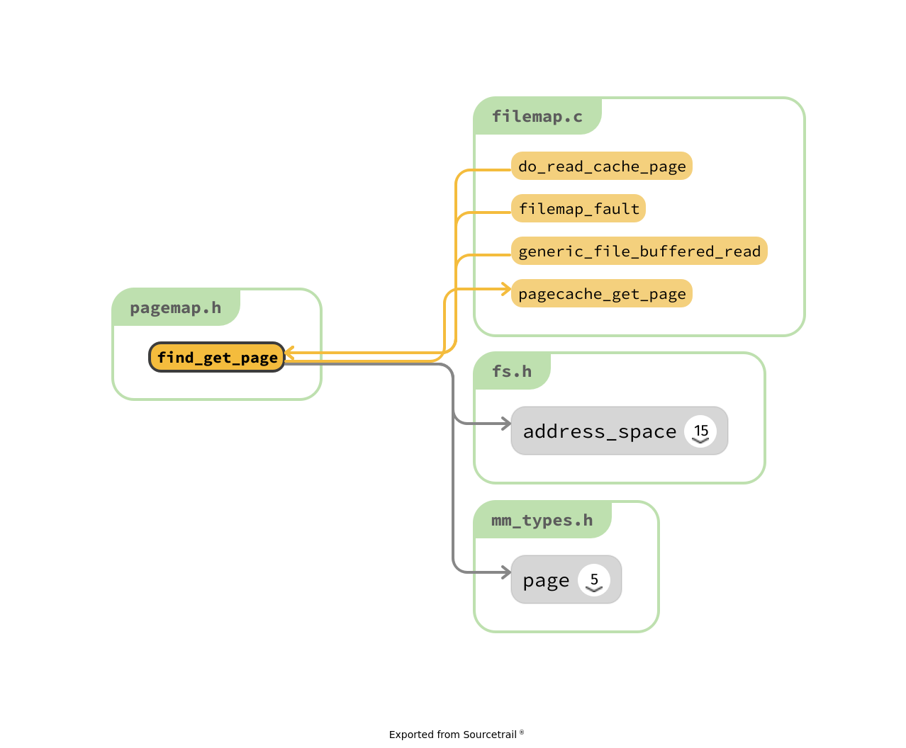
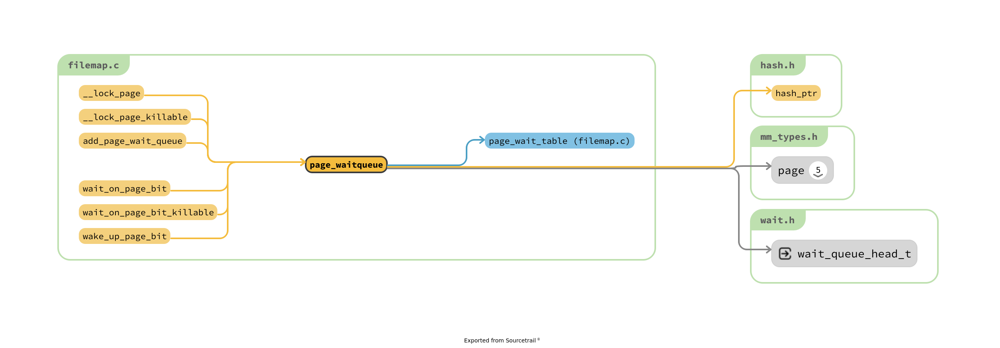

# 分析mm/filemap.c 

## 牢记
1. 感觉filemap.c 实现了 page cache.
2. page cache 的含义是 : 当访问文件某一部分的时候，首先在page cache 中间查找，如果没有找到，那么就走到文件系统中间去。
3. 所有的inode中间持有 address_space，描述一个inode 对应的 disk 的内容被映射在　多个page 中间
4. address_space 的key value 是什么? 文件的偏移量 : page

5. swap cache 的作用: 换出页面如果加载到了新的page中间，pte 中间保存 swap_entry 首先在 swap cache 中间查找，如果没有，才会去disk 中间查找
这个效果和 page cache 类似，但是机制不同。

6. 反向映射 和 page cache 不是同一个东西:
    1. page cache : 给定一个函数，然后找到具体的内容，
    2. 给定 page : 找到那些 vma 映射过，根据 rmap 的内容，将其划分为两个部分 !

## todo
1. generic_file_buffered_read
2. 连个都是 filemap_fault 的独家函数 do_async_mmap_readahead do_sync_mmap_readahead
    1. readahead 机制为什么需要为 filemap_fault 单独写
    2. 其他的 readahead 机制在什么地方
    3. readahead 和 mpage 的关系是什么 ?

3. filemap.c 的内容似乎比想象的多很多啊 !

## 思考
1. page cache 的处理问题:
    1. 查询 & 增加 : 
    3. 绕过
    4. 删除 : page cache 的数量，dirty page 的比例. 和 swap 的机制如何交互 ?
    3. readahead 机制 和 page_writeback 来辅助工作

## 问题
1. 所以为什么其可以实现页面共享 ?
如果仅仅考虑 file-based 的情况，这他妈就非常奇怪了，为什么其中page 中间持有一个 address_space 然后 inode 中间也持有一个 address_space ?
我觉得vma 中间也会持有一个 address_space ? 他们之间的关系是什么 ? 屮艸芔茻!
2. buffer cache 是干嘛的，为什么在 fs/ 下面
3. page cache 仅仅用于支持 filemap 还是也可以支持 普通的文件的IO 
4. address_space_operations 的部分成员，也就是函数指针，为什么参数会有 file * 类型。从原理上说，file * 是 vfs 上层的东西，address_space 是 vfs 下层的东西，为什么不是替代成为 inode. 比如 `address_space_operations->readpage` 函数
5. 一个page cache 可能被多个用户进程使用 ?

http://www.ilinuxkernel.com/files/Linux.Kernel.Cache.pdf　之处设备文件中间 address_space 的 i_mapping 指针都是指向root


## 分析

```c
// 下面关系似乎是在说 : address_space_operations 提供的函数只是一个读写函数，但是查询工作还是由 filemap.c 中间的内容完成。
// 推测该函数的作用 : 提供inode给的mapping以及需要的数据所在的在其中(inode对应的文件)的偏移量，返回其数据所在的page

// @todo 和 do_generic_file_read 的关系是什么 ?
static inline struct page *read_mapping_page(struct address_space *mapping,
				pgoff_t index, void *data)
{
  // 填充函数
	filler_t *filler = (filler_t *)mapping->a_ops->readpage;
  // 由此进入到 filemap.c 中间
	return read_cache_page(mapping, index, filler, data);
}

// 下层的 interface ，那么上层的interface 是什么
const struct address_space_operations ext2_nobh_aops = {
	.readpage		= ext2_readpage,
	.readpages		= ext2_readpages,
	.writepage		= ext2_nobh_writepage,
	.write_begin		= ext2_nobh_write_begin,
	.write_end		= nobh_write_end,
	.bmap			= ext2_bmap,
	.direct_IO		= ext2_direct_IO,
	.writepages		= ext2_writepages,
	.migratepage		= buffer_migrate_page,
	.error_remove_page	= generic_error_remove_page,
};

static int ext2_readpage(struct file *file, struct page *page)
{
	return mpage_readpage(page, ext2_get_block);
}
```

谁在使用: read_mapping_page

```c
/* ext2/dir.c */

static struct page * ext2_get_page(struct inode *dir, unsigned long n,
				   int quiet)
{
	struct address_space *mapping = dir->i_mapping;
	struct page *page = read_mapping_page(mapping, n, NULL);
	if (!IS_ERR(page)) {
		kmap(page);
		if (unlikely(!PageChecked(page))) {
			if (PageError(page) || !ext2_check_page(page, quiet))
				goto fail;
		}
	}
	return page;

fail:
	ext2_put_page(page);
	return ERR_PTR(-EIO);
}
```

## Allocating pages
1. 谁调用 page_cache_alloc 和 add_to_page_cache 两个函数

```c
/**
 * page_cache_read - adds requested page to the page cache if not already there
 * @file:	file to read
 * @offset:	page index
 * @gfp_mask:	memory allocation flags
 *
 * This adds the requested page to the page cache if it isn't already there,
 * and schedules an I/O to read in its contents from disk.
 */
static int page_cache_read(struct file *file, pgoff_t offset, gfp_t gfp_mask)
// 连续调用 page_cache_alloc 和 add_to_page_cache 两个内容
// 被 filemap_fault 唯一调用
```


```c
// 应该是几乎所有的file based 的page fault 都是走到这一个位置上，具体的注册流程

/* This is used for a general mmap of a disk file */
int generic_file_mmap(struct file * file, struct vm_area_struct * vma)
{
	struct address_space *mapping = file->f_mapping;

	if (!mapping->a_ops->readpage)
		return -ENOEXEC;
	file_accessed(file);
	vma->vm_ops = &generic_file_vm_ops;
	return 0;
}

/**
 * filemap_fault - read in file data for page fault handling
 * @vmf:	struct vm_fault containing details of the fault
 *
 * filemap_fault() is invoked via the vma operations vector for a
 * mapped memory region to read in file data during a page fault.
 *
 * The goto's are kind of ugly, but this streamlines the normal case of having
 * it in the page cache, and handles the special cases reasonably without
 * having a lot of duplicated code.
 *
 * vma->vm_mm->mmap_sem must be held on entry.
 *
 * If our return value has VM_FAULT_RETRY set, it's because
 * lock_page_or_retry() returned 0.
 * The mmap_sem has usually been released in this case.
 * See __lock_page_or_retry() for the exception.
 *
 * If our return value does not have VM_FAULT_RETRY set, the mmap_sem
 * has not been released.
 *
 * We never return with VM_FAULT_RETRY and a bit from VM_FAULT_ERROR set.
 */
vm_fault_t filemap_fault(struct vm_fault *vmf)
```
> 让我们处理一下 swap 实现的实现。


## find_get_page 的内容



三个结构类似，找得到直接返回，找不到从磁盘中间读取
1. generic_file_buffered_read 被唯一调用 generic_file_read_iter 
2. read_mapping_page => read_cache_page => do_read_cache_page
3. filemap_fault


提供了一堆利用radix_tree实现查找的函数

```c
/**
 * find_get_entry - find and get a page cache entry
 * @mapping: the address_space to search
 * @offset: the page cache index
 *
 * Looks up the page cache slot at @mapping & @offset.  If there is a
 * page cache page, it is returned with an increased refcount.
 *
 * If the slot holds a shadow entry of a previously evicted page, or a
 * swap entry from shmem/tmpfs, it is returned.
 *
 * Otherwise, %NULL is returned.
 */
 // 绝对核心
struct page *find_get_entry(struct address_space *mapping, pgoff_t offset)
```

> 是对称的函数吗 ?
```c
/**
 * find_get_pages_range_tag - find and return pages in given range matching @tag
 * @mapping:	the address_space to search
 * @index:	the starting page index
 * @end:	The final page index (inclusive)
 * @tag:	the tag index
 * @nr_pages:	the maximum number of pages
 * @pages:	where the resulting pages are placed
 *
 * Like find_get_pages, except we only return pages which are tagged with
 * @tag.   We update @index to index the next page for the traversal.
 */
unsigned find_get_pages_range_tag(struct address_space *mapping, pgoff_t *index,
					pgoff_t offset, int fgp_flags)
/**
 * find_get_entries_tag - find and return entries that match @tag
 * @mapping:	the address_space to search
 * @start:	the starting page cache index
 * @tag:	the tag index

 * @nr_entries:	the maximum number of entries
 * @entries:	where the resulting entries are placed
 * @indices:	the cache indices corresponding to the entries in @entries
 *
 * Like find_get_entries, except we only return entries which are tagged with
 * @tag.
 */
unsigned find_get_entries_tag(struct address_space *mapping, pgoff_t start,
					pgoff_t offset, int fgp_flags)

/**
 * find_get_page - find and get a page reference
 * @mapping: the address_space to search
 * @offset: the page index
 *
 * Looks up the page cache slot at @mapping & @offset.  If there is a
 * page cache page, it is returned with an increased refcount.
 *
 * Otherwise, %NULL is returned.
 */
static inline struct page *find_get_page(struct address_space *mapping,
					pgoff_t offset)
{
	return pagecache_get_page(mapping, offset, 0, 0);
}
```

## 乱七八糟的一堆东西

在 do_generic_file_read() 函数读取文件的时候，需要搜索 address_space 来确定数据是否在 page_cache 中间，
2. 基于page fault 的机制 : page fault 依靠于what读取文件 ?  TODO
3. 文件映射会被映射到vma 中间和不会的分别处理方法是什么 ?
4. fopen 被多个进程打开，然后都在读写，此时在两个物理吗 ? 用户进程各自一份，内核page cache 存储一份! ( 一个文件为什么会被反复 read : 因为该文件每次读取一部分)

def_blk 和 shmem 也可以定义　address_space 的功能 ?

@todo ext2_file_operations 中间居然没有 read 和 write 的实现


## read 的实现和对应的函数指针注册时间点

理清楚读写过程:
```c
// file 的 f_ops 什么时候注册的 ?
// 似乎 file_operations 
ssize_t __vfs_read(struct file *file, char __user *buf, size_t count,
		   loff_t *pos)
{
	if (file->f_op->read)
		return file->f_op->read(file, buf, count, pos);
	else if (file->f_op->read_iter)
		return new_sync_read(file, buf, count, pos);
	else
		return -EINVAL;
}

// inode 和 file 中间都含有 file_operations，两者直接关系是什么 ? 就是简单的赋值关系
// 是不是由于 file 都打开了，所以inode 注册好了，找到创建 file 的位置查看即可。
// 为什么 read write 依赖于具体的文件系统啊 ?
// 感觉 : 是为了绕过 page cache，也就是有的拒绝的使用，比如 ext2 和 ext4 中间:
#ifdef CONFIG_FS_DAX
	if (IS_DAX(file_inode(iocb->ki_filp)))
		return ext4_dax_read_iter(iocb, to);
#endif
// 怀疑还有其他的机制不需要page cache
```


```c
// 按照如下调用
static struct file *path_openat(struct nameidata *nd,
			const struct open_flags *op, unsigned flags)

// do_last

// finish_open

// do_dentry_open
	f->f_op = fops_get(inode->i_fop);
```


## generic_file_read_iter 和 generic_file_write_iter

```c
/**
 * generic_file_read_iter - generic filesystem read routine
 * @iocb:	kernel I/O control block
 * @iter:	destination for the data read
 *
 * This is the "read_iter()" routine for all filesystems
 * that can use the page cache directly.
 */
ssize_t
generic_file_read_iter(struct kiocb *iocb, struct iov_iter *iter)

	if (iocb->ki_flags & IOCB_DIRECT) { // 如果不是这一个选项，那么理解进入到 generic_file_buffered_read
```

```c
// 下面分析的例子使用 : generic_file_read_iter

/**
 * generic_file_buffered_read - generic file read routine
 * @iocb:	the iocb to read
 * @iter:	data destination
 * @written:	already copied
 *
 * This is a generic file read routine, and uses the
 * mapping->a_ops->readpage() function for the actual low-level stuff.
 *
 * This is really ugly. But the goto's actually try to clarify some
 * of the logic when it comes to error handling etc.
 */
 // 由于不是DAX，所以直接进入到此处!
 // XXX 使用 find_get_page 来查找
static ssize_t generic_file_buffered_read(struct kiocb *iocb,
		struct iov_iter *iter, ssize_t written)
    // todo 
{
	struct file *filp = iocb->ki_filp;
	struct address_space *mapping = filp->f_mapping;
	struct inode *inode = mapping->host;
	struct file_ra_state *ra = &filp->f_ra;
	loff_t *ppos = &iocb->ki_pos;
	pgoff_t index;
	pgoff_t last_index;
	pgoff_t prev_index;
	unsigned long offset;      /* offset into pagecache page */
	unsigned int prev_offset;
	int error = 0;

	if (unlikely(*ppos >= inode->i_sb->s_maxbytes))
		return 0;
	iov_iter_truncate(iter, inode->i_sb->s_maxbytes);

	index = *ppos >> PAGE_SHIFT;
	prev_index = ra->prev_pos >> PAGE_SHIFT;
	prev_offset = ra->prev_pos & (PAGE_SIZE-1);
	last_index = (*ppos + iter->count + PAGE_SIZE-1) >> PAGE_SHIFT;
	offset = *ppos & ~PAGE_MASK;

	for (;;) {
		struct page *page;
		pgoff_t end_index;
		loff_t isize;
		unsigned long nr, ret;

		cond_resched();
find_page:
		if (fatal_signal_pending(current)) {
			error = -EINTR;
			goto out;
		}

		page = find_get_page(mapping, index);
		if (!page) {
			if (iocb->ki_flags & IOCB_NOWAIT)
				goto would_block;
			page_cache_sync_readahead(mapping,
					ra, filp,
					index, last_index - index);
			page = find_get_page(mapping, index);
			if (unlikely(page == NULL))
				goto no_cached_page;
		}
		if (PageReadahead(page)) {
			page_cache_async_readahead(mapping,
					ra, filp, page,
					index, last_index - index);
		}
		if (!PageUptodate(page)) {
			if (iocb->ki_flags & IOCB_NOWAIT) {
				put_page(page);
				goto would_block;
			}

			/*
			 * See comment in do_read_cache_page on why
			 * wait_on_page_locked is used to avoid unnecessarily
			 * serialisations and why it's safe.
			 */
			error = wait_on_page_locked_killable(page);
			if (unlikely(error))
				goto readpage_error;
			if (PageUptodate(page))
				goto page_ok;

			if (inode->i_blkbits == PAGE_SHIFT ||
					!mapping->a_ops->is_partially_uptodate)
				goto page_not_up_to_date;
			/* pipes can't handle partially uptodate pages */
			if (unlikely(iter->type & ITER_PIPE))
				goto page_not_up_to_date;
			if (!trylock_page(page))
				goto page_not_up_to_date;
			/* Did it get truncated before we got the lock? */
			if (!page->mapping)
				goto page_not_up_to_date_locked;
			if (!mapping->a_ops->is_partially_uptodate(page,
							offset, iter->count))
				goto page_not_up_to_date_locked;
			unlock_page(page);
		}
page_ok:
		/*
		 * i_size must be checked after we know the page is Uptodate.
		 *
		 * Checking i_size after the check allows us to calculate
		 * the correct value for "nr", which means the zero-filled
		 * part of the page is not copied back to userspace (unless
		 * another truncate extends the file - this is desired though).
		 */

		isize = i_size_read(inode);
		end_index = (isize - 1) >> PAGE_SHIFT;
		if (unlikely(!isize || index > end_index)) {
			put_page(page);
			goto out;
		}

		/* nr is the maximum number of bytes to copy from this page */
		nr = PAGE_SIZE;
		if (index == end_index) {
			nr = ((isize - 1) & ~PAGE_MASK) + 1;
			if (nr <= offset) {
				put_page(page);
				goto out;
			}
		}
		nr = nr - offset;

		/* If users can be writing to this page using arbitrary
		 * virtual addresses, take care about potential aliasing
		 * before reading the page on the kernel side.
		 */
		if (mapping_writably_mapped(mapping))
			flush_dcache_page(page);

		/*
		 * When a sequential read accesses a page several times,
		 * only mark it as accessed the first time.
		 */
		if (prev_index != index || offset != prev_offset)
			mark_page_accessed(page);
		prev_index = index;

		/*
		 * Ok, we have the page, and it's up-to-date, so
		 * now we can copy it to user space...
		 */

		ret = copy_page_to_iter(page, offset, nr, iter);
		offset += ret;
		index += offset >> PAGE_SHIFT;
		offset &= ~PAGE_MASK;
		prev_offset = offset;

		put_page(page);
		written += ret;
		if (!iov_iter_count(iter))
			goto out;
		if (ret < nr) {
			error = -EFAULT;
			goto out;
		}
		continue;

page_not_up_to_date:
		/* Get exclusive access to the page ... */
		error = lock_page_killable(page);
		if (unlikely(error))
			goto readpage_error;

page_not_up_to_date_locked:
		/* Did it get truncated before we got the lock? */
		if (!page->mapping) {
			unlock_page(page);
			put_page(page);
			continue;
		}

		/* Did somebody else fill it already? */
		if (PageUptodate(page)) {
			unlock_page(page);
			goto page_ok;
		}

readpage:
		/*
		 * A previous I/O error may have been due to temporary
		 * failures, eg. multipath errors.
		 * PG_error will be set again if readpage fails.
		 */
		ClearPageError(page);
		/* Start the actual read. The read will unlock the page. */
		error = mapping->a_ops->readpage(filp, page);

		if (unlikely(error)) {
			if (error == AOP_TRUNCATED_PAGE) {
				put_page(page);
				error = 0;
				goto find_page;
			}
			goto readpage_error;
		}

		if (!PageUptodate(page)) {
			error = lock_page_killable(page);
			if (unlikely(error))
				goto readpage_error;
			if (!PageUptodate(page)) {
				if (page->mapping == NULL) {
					/*
					 * invalidate_mapping_pages got it
					 */
					unlock_page(page);
					put_page(page);
					goto find_page;
				}
				unlock_page(page);
				shrink_readahead_size_eio(filp, ra);
				error = -EIO;
				goto readpage_error;
			}
			unlock_page(page);
		}

		goto page_ok;

readpage_error:
		/* UHHUH! A synchronous read error occurred. Report it */
		put_page(page);
		goto out;

no_cached_page:
		/*
		 * Ok, it wasn't cached, so we need to create a new
		 * page..
		 */
		page = page_cache_alloc(mapping);
		if (!page) {
			error = -ENOMEM;
			goto out;
		}
		error = add_to_page_cache_lru(page, mapping, index,
				mapping_gfp_constraint(mapping, GFP_KERNEL));
		if (error) {
			put_page(page);
			if (error == -EEXIST) {
				error = 0;
				goto find_page;
			}

			goto out;
		}
		goto readpage;
	}

would_block:
	error = -EAGAIN;
out:
	ra->prev_pos = prev_index;
	ra->prev_pos <<= PAGE_SHIFT;
	ra->prev_pos |= prev_offset;

	*ppos = ((loff_t)index << PAGE_SHIFT) + offset;
	file_accessed(filp);
	return written ? written : error;
}

```


## add_to_page_cache_lru
```c
__add_to_page_cache_locked // 插入到 radix tree 中间
lru_cache_add // 添加到队列中间
```

## lru_cache_add

1. ClearPageActive SetPageActive  一共含有哪几种 flags 影响 lru
> linux/include/linux/page-flags.h
2. VM_BUG_ON_PAGE
> 从代码分析上说，是静态分析的，但是实际上根本不是。

```c
/**
 * lru_cache_add - add a page to a page list
 * @page: the page to be added to the LRU.
 *
 * Queue the page for addition to the LRU via pagevec. The decision on whether
 * to add the page to the [in]active [file|anon] list is deferred until the
 * pagevec is drained. This gives a chance for the caller of lru_cache_add()
 * have the page added to the active list using mark_page_accessed().
 */
void lru_cache_add(struct page *page)
{
	VM_BUG_ON_PAGE(PageActive(page) && PageUnevictable(page), page);
	VM_BUG_ON_PAGE(PageLRU(page), page);
	__lru_cache_add(page);
}
```

## read_mapping_page
find_get_page 的第三个入口

```c
/**
 * read_cache_page - read into page cache, fill it if needed * @mapping:	the page's address_space
 * @index:	the page index
 * @filler:	function to perform the read
 * @data:	first arg to filler(data, page) function, often left as NULL
 *
 * Read into the page cache. If a page already exists, and PageUptodate() is
 * not set, try to fill the page and wait for it to become unlocked.
 *
 * If the page does not get brought uptodate, return -EIO.
 */
struct page *read_cache_page(struct address_space *mapping,
				pgoff_t index,
				int (*filler)(void *, struct page *),
				void *data)
{
	return do_read_cache_page(mapping, index, filler, data, mapping_gfp_mask(mapping));
}
```

> 预加载 ?

谁来调用这一个函数啊 ? 

## generic_file_write_iter

```c
/**
 * generic_file_write_iter - write data to a file
 * @iocb:	IO state structure
 * @from:	iov_iter with data to write
 *
 * This is a wrapper around __generic_file_write_iter() to be used by most
 * filesystems. It takes care of syncing the file in case of O_SYNC file
 * and acquires i_mutex as needed.
 */
ssize_t generic_file_write_iter(struct kiocb *iocb, struct iov_iter *from)
{
	struct file *file = iocb->ki_filp;
	struct inode *inode = file->f_mapping->host;
	ssize_t ret;

	inode_lock(inode);
	ret = generic_write_checks(iocb, from);
	if (ret > 0)
		ret = __generic_file_write_iter(iocb, from);
	inode_unlock(inode);

	if (ret > 0)
		ret = generic_write_sync(iocb, ret);
	return ret;
}
EXPORT_SYMBOL(generic_file_write_iter);
```

## wait 机制

```c
/*
 * In order to wait for pages to become available there must be
 * waitqueues associated with pages. By using a hash table of
 * waitqueues where the bucket discipline is to maintain all
 * waiters on the same queue and wake all when any of the pages
 * become available, and for the woken contexts to check to be
 * sure the appropriate page became available, this saves space
 * at a cost of "thundering herd" phenomena during rare hash
 * collisions.
 */
#define PAGE_WAIT_TABLE_BITS 8
#define PAGE_WAIT_TABLE_SIZE (1 << PAGE_WAIT_TABLE_BITS)
static wait_queue_head_t page_wait_table[PAGE_WAIT_TABLE_SIZE] __cacheline_aligned;

static wait_queue_head_t *page_waitqueue(struct page *page)
{
	return &page_wait_table[hash_ptr(page, PAGE_WAIT_TABLE_BITS)];
}


void __init pagecache_init(void)
{
	int i;

	for (i = 0; i < PAGE_WAIT_TABLE_SIZE; i++)
		init_waitqueue_head(&page_wait_table[i]); // todo waitqueue 机制，值得关注

	page_writeback_init(); // 果然，两者就是有关系的
}
```



@todo wait 机制值的分析，但是不会很复杂

## fdata

1. 这难道不是 page_writeback 的工作吗 ?


```c
static inline int __filemap_fdatawrite(struct address_space *mapping,
	int sync_mode)
{
	return __filemap_fdatawrite_range(mapping, 0, LLONG_MAX, sync_mode);
}

/**
 * __filemap_fdatawrite_range - start writeback on mapping dirty pages in range
 * @mapping:	address space structure to write
 * @start:	offset in bytes where the range starts
 * @end:	offset in bytes where the range ends (inclusive)
 * @sync_mode:	enable synchronous operation
 *
 * Start writeback against all of a mapping's dirty pages that lie
 * within the byte offsets <start, end> inclusive.
 *
 * If sync_mode is WB_SYNC_ALL then this is a "data integrity" operation, as
 * opposed to a regular memory cleansing writeback.  The difference between
 * these two operations is that if a dirty page/buffer is encountered, it must
 * be waited upon, and not just skipped over.
 */
int __filemap_fdatawrite_range(struct address_space *mapping, loff_t start,
				loff_t end, int sync_mode)
{
	int ret;
	struct writeback_control wbc = {
		.sync_mode = sync_mode,
		.nr_to_write = LONG_MAX,
		.range_start = start,
		.range_end = end,
	};

	if (!mapping_cap_writeback_dirty(mapping))
		return 0;

	wbc_attach_fdatawrite_inode(&wbc, mapping->host); 
	ret = do_writepages(mapping, &wbc);  // 调用 page-writeback.c 的函数完成写回操作
	wbc_detach_inode(&wbc);
	return ret;
}
```


## end_page_writeback : todo
1. test_clear_page_writeback 唯一是 `__xa_clear_mark`, 而 `__xa_set_mark` 是 set_page_dirty 使用的操作
    1. 似乎总是和 set_page_writeback 对称使用的
    2. 

```c
/**
 * end_page_writeback - end writeback against a page
 * @page: the page
 */
void end_page_writeback(struct page *page)
{
	/*
	 * TestClearPageReclaim could be used here but it is an atomic
	 * operation and overkill in this particular case. Failing to
	 * shuffle a page marked for immediate reclaim is too mild to
	 * justify taking an atomic operation penalty at the end of
	 * ever page writeback.
	 */
	if (PageReclaim(page)) {
		ClearPageReclaim(page);
		rotate_reclaimable_page(page);
	}

	if (!test_clear_page_writeback(page))
		BUG();

	smp_mb__after_atomic();
	wake_up_page(page, PG_writeback);
}
EXPORT_SYMBOL(end_page_writeback);


static inline void set_page_writeback(struct page *page)
{
	test_set_page_writeback(page);
}

#define test_set_page_writeback(page)			\
	__test_set_page_writeback(page, false)

// 到 page-wirteback.c 中间查看 test_clear_page_writeback && `__test_set_page_writeback`
```

2. 其调用者是非常神奇的:

```c
int __swap_writepage(struct page *page, struct writeback_control *wbc, bio_end_io_t end_write_func)

```


## delete_from_page_cache

```c
/**
 * delete_from_page_cache - delete page from page cache
 * @page: the page which the kernel is trying to remove from page cache
 *
 * This must be called only on pages that have been verified to be in the page
 * cache and locked.  It will never put the page into the free list, the caller
 * has a reference on the page.
 */
void delete_from_page_cache(struct page *page)
{
	struct address_space *mapping = page_mapping(page);
	unsigned long flags;

	BUG_ON(!PageLocked(page));
	xa_lock_irqsave(&mapping->i_pages, flags);
	__delete_from_page_cache(page, NULL);
	xa_unlock_irqrestore(&mapping->i_pages, flags);

	page_cache_free_page(mapping, page);
}
EXPORT_SYMBOL(delete_from_page_cache);


/*
 * Delete a page from the page cache and free it. Caller has to make
 * sure the page is locked and that nobody else uses it - or that usage
 * is safe.  The caller must hold the i_pages lock.
 */
void __delete_from_page_cache(struct page *page, void *shadow)
{
	struct address_space *mapping = page->mapping;

	trace_mm_filemap_delete_from_page_cache(page);

	unaccount_page_cache_page(mapping, page);
	page_cache_delete(mapping, page, shadow); // todo 不知道这是干嘛的，非常类似于统计数据
}


static void page_cache_free_page(struct address_space *mapping,
				struct page *page)
{
	void (*freepage)(struct page *);

	freepage = mapping->a_ops->freepage;
	if (freepage)　// a_ops->freepage 几乎没有人注册，除了 nfs
		freepage(page);

	if (PageTransHuge(page) && !PageHuge(page)) { // todo 所以，PageTransHuge 和 PageHuge 的关系是什么 ?
		page_ref_sub(page, HPAGE_PMD_NR);
		VM_BUG_ON_PAGE(page_count(page) <= 0, page);
	} else {
		put_page(page);
	}
}
```

## filemap_fault : 只有文件IO 就会到达此处，pgfault 也不例外
1. 总体来说，没有什么神奇的: 向 page cache 中间查找，如果找不到就 do_async_mmap_readahead 
  
```c
/**
 * filemap_fault - read in file data for page fault handling
 * @vmf:	struct vm_fault containing details of the fault
 *
 * filemap_fault() is invoked via the vma operations vector for a
 * mapped memory region to read in file data during a page fault.
 *
 * The goto's are kind of ugly, but this streamlines the normal case of having
 * it in the page cache, and handles the special cases reasonably without
 * having a lot of duplicated code.
 *
 * vma->vm_mm->mmap_sem must be held on entry.
 *
 * If our return value has VM_FAULT_RETRY set, it's because the mmap_sem
 * may be dropped before doing I/O or by lock_page_maybe_drop_mmap().
 *
 * If our return value does not have VM_FAULT_RETRY set, the mmap_sem
 * has not been released.
 *
 * We never return with VM_FAULT_RETRY and a bit from VM_FAULT_ERROR set.
 *
 * Return: bitwise-OR of %VM_FAULT_ codes.
 */
vm_fault_t filemap_fault(struct vm_fault *vmf)
{
	int error;
	struct file *file = vmf->vma->vm_file;
	struct file *fpin = NULL;
	struct address_space *mapping = file->f_mapping;
	struct file_ra_state *ra = &file->f_ra;
	struct inode *inode = mapping->host;
	pgoff_t offset = vmf->pgoff;
	pgoff_t max_off;
	struct page *page;
	vm_fault_t ret = 0;

	max_off = DIV_ROUND_UP(i_size_read(inode), PAGE_SIZE);
	if (unlikely(offset >= max_off)) // pgfault 的位置是否越界
		return VM_FAULT_SIGBUS;

	/*
	 * Do we have something in the page cache already?
	 */
	page = find_get_page(mapping, offset);
	if (likely(page) && !(vmf->flags & FAULT_FLAG_TRIED)) {
		/*
		 * We found the page, so try async readahead before
		 * waiting for the lock.
		 */
		fpin = do_async_mmap_readahead(vmf, page);
	} else if (!page) {
		/* No page in the page cache at all */
		count_vm_event(PGMAJFAULT);
		count_memcg_event_mm(vmf->vma->vm_mm, PGMAJFAULT);
		ret = VM_FAULT_MAJOR;
		fpin = do_sync_mmap_readahead(vmf);
retry_find:
		page = pagecache_get_page(mapping, offset,
					  FGP_CREAT|FGP_FOR_MMAP,
					  vmf->gfp_mask);
		if (!page) {
			if (fpin)
				goto out_retry;
			return vmf_error(-ENOMEM);
		}
	}

	if (!lock_page_maybe_drop_mmap(vmf, page, &fpin))
		goto out_retry;

	/* Did it get truncated? */
	if (unlikely(compound_head(page)->mapping != mapping)) { // todo 不能理解 truncated 的含义是什么 ?
		unlock_page(page);
		put_page(page);
		goto retry_find;
	}
	VM_BUG_ON_PAGE(page_to_pgoff(page) != offset, page);

	/*
	 * We have a locked page in the page cache, now we need to check
	 * that it's up-to-date. If not, it is going to be due to an error.
	 */
	if (unlikely(!PageUptodate(page)))
		goto page_not_uptodate;

	/*
	 * We've made it this far and we had to drop our mmap_sem, now is the
	 * time to return to the upper layer and have it re-find the vma and
	 * redo the fault.
	 */
	if (fpin) {
		unlock_page(page);
		goto out_retry;
	}

	/*
	 * Found the page and have a reference on it.
	 * We must recheck i_size under page lock.
	 */
	max_off = DIV_ROUND_UP(i_size_read(inode), PAGE_SIZE);
	if (unlikely(offset >= max_off)) {
		unlock_page(page);
		put_page(page);
		return VM_FAULT_SIGBUS;
	}

	vmf->page = page;
	return ret | VM_FAULT_LOCKED;

page_not_uptodate:
	/*
	 * Umm, take care of errors if the page isn't up-to-date.
	 * Try to re-read it _once_. We do this synchronously,
	 * because there really aren't any performance issues here
	 * and we need to check for errors.
	 */
	ClearPageError(page);
	fpin = maybe_unlock_mmap_for_io(vmf, fpin);
	error = mapping->a_ops->readpage(file, page);
	if (!error) {
		wait_on_page_locked(page);
		if (!PageUptodate(page))
			error = -EIO;
	}
	if (fpin)
		goto out_retry;
	put_page(page);

	if (!error || error == AOP_TRUNCATED_PAGE)
		goto retry_find;

	/* Things didn't work out. Return zero to tell the mm layer so. */
	shrink_readahead_size_eio(file, ra);
	return VM_FAULT_SIGBUS;

out_retry:
	/*
	 * We dropped the mmap_sem, we need to return to the fault handler to
	 * re-find the vma and come back and find our hopefully still populated
	 * page.
	 */
	if (page)
		put_page(page);
	if (fpin)
		fput(fpin);
	return ret | VM_FAULT_RETRY;
}
EXPORT_SYMBOL(filemap_fault);
```

## generic_file_vm_ops

```c
const struct vm_operations_struct generic_file_vm_ops = {
	.fault		= filemap_fault,
	.map_pages	= filemap_map_pages,
	.page_mkwrite	= filemap_page_mkwrite, // todo 
};
```

## try_to_release_page
1. 其实几乎都是最后调用一下 try_to_free_buffers，完成的工作应该就是释放 page 以及关联的 buffer header 之类的东西

```c
/**
 * try_to_release_page() - release old fs-specific metadata on a page
 *
 * @page: the page which the kernel is trying to free
 * @gfp_mask: memory allocation flags (and I/O mode)
 *
 * The address_space is to try to release any data against the page
 * (presumably at page->private).
 *
 * This may also be called if PG_fscache is set on a page, indicating that the
 * page is known to the local caching routines.
 *
 * The @gfp_mask argument specifies whether I/O may be performed to release
 * this page (__GFP_IO), and whether the call may block (__GFP_RECLAIM & __GFP_FS).
 *
 * Return: %1 if the release was successful, otherwise return zero.
 */
int try_to_release_page(struct page *page, gfp_t gfp_mask)
{
	struct address_space * const mapping = page->mapping;

	BUG_ON(!PageLocked(page));
	if (PageWriteback(page))
		return 0;

	if (mapping && mapping->a_ops->releasepage)
		return mapping->a_ops->releasepage(page, gfp_mask);
	return try_to_free_buffers(page);
}

EXPORT_SYMBOL(try_to_release_page);

/*
 * Try to release a page associated with block device when the system
 * is under memory pressure.
 */
static int blkdev_releasepage(struct page *page, gfp_t wait) // 使用 blkdev 作为例子
{
	struct super_block *super = BDEV_I(page->mapping->host)->bdev.bd_super;

	if (super && super->s_op->bdev_try_to_free_page)
		return super->s_op->bdev_try_to_free_page(super, page, wait);

	return try_to_free_buffers(page);
}

/*
 * Try to release metadata pages (indirect blocks, directories) which are
 * mapped via the block device.  Since these pages could have journal heads
 * which would prevent try_to_free_buffers() from freeing them, we must use
 * jbd2 layer's try_to_free_buffers() function to release them.
 */
static int bdev_try_to_free_page(struct super_block *sb, struct page *page, // 使用 ext4 注册的 bdev_try_to_free_page 作为例子
				 gfp_t wait)
{
	journal_t *journal = EXT4_SB(sb)->s_journal;

	WARN_ON(PageChecked(page));
	if (!page_has_buffers(page))
		return 0;
	if (journal)
		return jbd2_journal_try_to_free_buffers(journal, page,
						wait & ~__GFP_DIRECT_RECLAIM);
	return try_to_free_buffers(page);
}
```

##  filemap_write_and_wait_range : todo swapon 调用的，值得分析

```c
/**
 * filemap_write_and_wait_range - write out & wait on a file range
 * @mapping:	the address_space for the pages
 * @lstart:	offset in bytes where the range starts
 * @lend:	offset in bytes where the range ends (inclusive)
 *
 * Write out and wait upon file offsets lstart->lend, inclusive.
 *
 * Note that @lend is inclusive (describes the last byte to be written) so
 * that this function can be used to write to the very end-of-file (end = -1).
 *
 * Return: error status of the address space.
 */
int filemap_write_and_wait_range(struct address_space *mapping,
				 loff_t lstart, loff_t lend)
{
	int err = 0;

	if (mapping_needs_writeback(mapping)) {
		err = __filemap_fdatawrite_range(mapping, lstart, lend,
						 WB_SYNC_ALL);
		/*
		 * Even if the above returned error, the pages may be
		 * written partially (e.g. -ENOSPC), so we wait for it.
		 * But the -EIO is special case, it may indicate the worst
		 * thing (e.g. bug) happened, so we avoid waiting for it.
		 */
		if (err != -EIO) {
			int err2 = filemap_fdatawait_range(mapping,
						lstart, lend);
			if (!err)
				err = err2;
		} else {
			/* Clear any previously stored errors */
			filemap_check_errors(mapping);
		}
	} else {
		err = filemap_check_errors(mapping);
	}
	return err;
}
```

