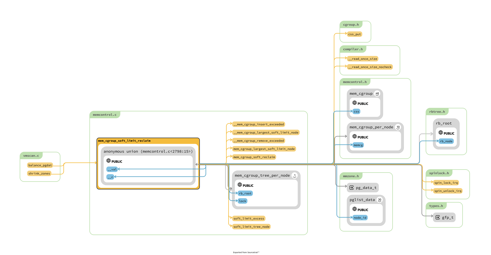

# mm/memcontrol.c

1. memcontrol 到底控制了什么东西 ? swap 内存使用数量 ?
2. 从哪里读取limitation ?

3. softlimit 查找其 ref

## function for outside



似乎完全是和其他业务隔离开来，完全简单的调用。

```c
static int balance_pgdat(pg_data_t *pgdat, int order, int classzone_idx)

static void shrink_zones(struct zonelist *zonelist, struct scan_control *sc)
			/*
			 * This steals pages from memory cgroups over softlimit
			 * and returns the number of reclaimed pages and
			 * scanned pages. This works for global memory pressure
			 * and balancing, not for a memcg's limit.
			 */
			nr_soft_scanned = 0;
			nr_soft_reclaimed = mem_cgroup_soft_limit_reclaim(zone->zone_pgdat,
						sc->order, sc->gfp_mask,
						&nr_soft_scanned);
			sc->nr_reclaimed += nr_soft_reclaimed;
			sc->nr_scanned += nr_soft_scanned;
```

## events

```c
memcg_check_events : 似乎像是，当事件累积到一定的程度的时候，然后进行处理的机制 mem_cgroup_update_tree 就是为了 soft_limit 而处理的
// todo 找到其 ref，为什么是那些地方 ?
```


## threshold
```c
mem_cgroup_threshold
```


## tree
> tree 机制似乎还是为了 mem_cgroup_soft_limit_reclaim 的机制
> 其实感觉被处理的不是非常的优雅 : 那就是对于所有 mem_cgroup 都是持有 mem_cgroup_per_node 信息按照 usage_in_excess 排序，然后
> 需要 reclaim 的时候从中抽出来


```c
// usage_in_excess 到底是什么是靠什么维持的 ?

mem_cgroup_soft_limit_reclaim : 利用 soft_limit_excess 计算的 memcg->soft_list 和 memcg->memory 的差值
mem_cgroup_update_tree : memcg_check_events : 但是不知道 events 的具体含义是什么
```


```c
// 每一个node 上的，这只是一个根节点，上面用于挂 mem_cgroup_per_node
/*
 * Cgroups above their limits are maintained in a RB-Tree, independent of
 * their hierarchy representation
 */
struct mem_cgroup_tree_per_node {
	struct rb_root rb_root;
	struct rb_node *rb_rightmost;
	spinlock_t lock;
};

struct mem_cgroup_tree {
	struct mem_cgroup_tree_per_node *rb_tree_per_node[MAX_NUMNODES];
};

// 整个计算机上的 tree
static struct mem_cgroup_tree soft_limit_tree __read_mostly;


/*
 * per-zone information in memory controller.
 */
struct mem_cgroup_per_node {
	struct lruvec		lruvec;

	struct lruvec_stat __percpu *lruvec_stat_cpu;
	atomic_long_t		lruvec_stat[NR_VM_NODE_STAT_ITEMS];

	unsigned long		lru_zone_size[MAX_NR_ZONES][NR_LRU_LISTS];

	struct mem_cgroup_reclaim_iter	iter[DEF_PRIORITY + 1];

#ifdef CONFIG_MEMCG_KMEM
	struct memcg_shrinker_map __rcu	*shrinker_map;
#endif
	struct rb_node		tree_node;	/* RB tree node */
	unsigned long		usage_in_excess;/* Set to the value by which */
						/* the soft limit is exceeded*/
	bool			on_tree;
	bool			congested;	/* memcg has many dirty pages */
						/* backed by a congested BDI */

	struct mem_cgroup	*memcg;		/* Back pointer, we cannot */
						/* use container_of	   */
};
```

> 分析一下如何遍历整个 tree 结构 :

```c
static void mem_cgroup_remove_from_trees(struct mem_cgroup *memcg)
{
	struct mem_cgroup_tree_per_node *mctz;
	struct mem_cgroup_per_node *mz;
	int nid;

	for_each_node(nid) {
		mz = mem_cgroup_nodeinfo(memcg, nid); // 获取 关键信息
		mctz = soft_limit_tree_node(nid); // 获取 tree
		if (mctz)
			mem_cgroup_remove_exceeded(mz, mctz);
	}
}

// mem_cgroup 会持有所有的node 的 mem_cgroup_per_node 信息
static struct mem_cgroup_per_node *
mem_cgroup_nodeinfo(struct mem_cgroup *memcg, int nid)
{
	return memcg->nodeinfo[nid];
}

static struct mem_cgroup_tree_per_node *
soft_limit_tree_node(int nid)
{
	return soft_limit_tree.rb_tree_per_node[nid];
}

// 首先锁住整个树
// 其实核心逻辑就是将 mz 从 mctz 中间删除而已 : 合乎 mem_cgroup_remove_from_trees 中间的逻辑
static void __mem_cgroup_remove_exceeded(struct mem_cgroup_per_node *mz,
					 struct mem_cgroup_tree_per_node *mctz)
{
	if (!mz->on_tree)
		return;

	if (&mz->tree_node == mctz->rb_rightmost)
		mctz->rb_rightmost = rb_prev(&mz->tree_node);

	rb_erase(&mz->tree_node, &mctz->rb_root);
	mz->on_tree = false;
}


// 这样，他就为什么需要建立一个RB tree 每一个 mem_cgroup 对应的 mem_cgroup_per_node
// mem_cgroup 的关于每一个 node 的信息附加在 mem_cgroup_per_node 中间
static int alloc_mem_cgroup_per_node_info(struct mem_cgroup *memcg, int node)
{
	struct mem_cgroup_per_node *pn;
	int tmp = node;
	/*
	 * This routine is called against possible nodes.
	 * But it's BUG to call kmalloc() against offline node.
	 *
	 * TODO: this routine can waste much memory for nodes which will
	 *       never be onlined. It's better to use memory hotplug callback
	 *       function.
	 */
	if (!node_state(node, N_NORMAL_MEMORY))
		tmp = -1;
	pn = kzalloc_node(sizeof(*pn), GFP_KERNEL, tmp);
	if (!pn)
		return 1;

	pn->lruvec_stat_cpu = alloc_percpu(struct lruvec_stat);
	if (!pn->lruvec_stat_cpu) {
		kfree(pn);
		return 1;
	}

	lruvec_init(&pn->lruvec);
	pn->usage_in_excess = 0;
	pn->on_tree = false;
	pn->memcg = memcg;

	memcg->nodeinfo[node] = pn;
	return 0;
}

// 从此处似乎就是简单 binary tree 的插入，关于 rb tree 的不是很懂
// 比较的依据是 mem_cgroup_per_node->usage_in_excess
static void __mem_cgroup_insert_exceeded(struct mem_cgroup_per_node *mz,
					 struct mem_cgroup_tree_per_node *mctz,
					 unsigned long new_usage_in_excess)
```

## mem_cgroup_remove_from_trees
```c
static void mem_cgroup_css_free(struct cgroup_subsys_state *css)
{
	struct mem_cgroup *memcg = mem_cgroup_from_css(css);

	if (cgroup_subsys_on_dfl(memory_cgrp_subsys) && !cgroup_memory_nosocket)
		static_branch_dec(&memcg_sockets_enabled_key);

	if (!cgroup_subsys_on_dfl(memory_cgrp_subsys) && memcg->tcpmem_active)
		static_branch_dec(&memcg_sockets_enabled_key);

	vmpressure_cleanup(&memcg->vmpressure); // 
	cancel_work_sync(&memcg->high_work);
	mem_cgroup_remove_from_trees(memcg);
	memcg_free_shrinker_maps(memcg);
	memcg_free_kmem(memcg);
	mem_cgroup_free(memcg);
}


static void mem_cgroup_remove_from_trees(struct mem_cgroup *memcg)
{
	struct mem_cgroup_tree_per_node *mctz;
	struct mem_cgroup_per_node *mz;
	int nid;

	for_each_node(nid) {
		mz = mem_cgroup_nodeinfo(memcg, nid);
		mctz = soft_limit_tree_node(nid);
		if (mctz)
			mem_cgroup_remove_exceeded(mz, mctz);
	}
}
```


## What does it control
1. CONFIG_MEMCG_KMEM 连 kernel 的内存也需要控制
2. CONFIG_CGROUP_WRITEBACK


mem_cgroup 的成员已经说明的很清晰:
Accounted resources
1. 	struct page_counter memory;  // @todo 似乎只是这一个是核心，其余就是各种 charge
2. 	struct page_counter swap;

Legacy consumer-oriented counters
1. 	struct page_counter memsw;
2. 	struct page_counter kmem;
3. 	struct page_counter tcpmem;


## migration
5000 ~ 5300


## soft limit


```c
soft_limit_excess : 简单的比较两个数值


```

## events


```c
/*
 * Per memcg event counter is incremented at every pagein/pageout. With THP,
 * it will be incremated by the number of pages. This counter is used for
 * for trigger some periodic events. This is straightforward and better
 * than using jiffies etc. to handle periodic memcg event.
 */
enum mem_cgroup_events_target {
	MEM_CGROUP_TARGET_THRESH,
	MEM_CGROUP_TARGET_SOFTLIMIT,
	MEM_CGROUP_TARGET_NUMAINFO,
	MEM_CGROUP_NTARGETS,
};

struct mem_cgroup_stat_cpu {
	long count[MEMCG_NR_STAT];
	unsigned long events[NR_VM_EVENT_ITEMS];
	unsigned long nr_page_events;
	unsigned long targets[MEM_CGROUP_NTARGETS];
};
```

## oom


## charge

```c
/**
 * mem_cgroup_commit_charge - commit a page charge
 * @page: page to charge
 * @memcg: memcg to charge the page to
 * @lrucare: page might be on LRU already
 * @compound: charge the page as compound or small page
 *
 * Finalize a charge transaction started by mem_cgroup_try_charge(),
 * after page->mapping has been set up.  This must happen atomically
 * as part of the page instantiation, i.e. under the page table lock
 * for anonymous pages, under the page lock for page and swap cache.
 *
 * In addition, the page must not be on the LRU during the commit, to
 * prevent racing with task migration.  If it might be, use @lrucare.
 *
 * Use mem_cgroup_cancel_charge() to cancel the transaction instead.
 */
mem_cgroup_commit_charge : 这也是一个完全外部的函数
    commit_charge : page->mem_cgroup = memcg;
    mem_cgroup_uncharge_swap : // todo 不知道要干什么的

mem_cgroup_try_charge_delay

/**
 * mem_cgroup_try_charge - try charging a page
 * @page: page to charge
 * @mm: mm context of the victim
 * @gfp_mask: reclaim mode
 * @memcgp: charged memcg return
 * @compound: charge the page as compound or small page
 *
 * try to charge @page to the memcg that @mm belongs to, reclaiming
 * pages according to @gfp_mask if necessary.
 *
 * returns 0 on success, with *@memcgp pointing to the charged memcg.
 * otherwise, an error code is returned.
 *
 * after page->mapping has been set up, the caller must finalize the
 * charge with mem_cgroup_commit_charge().  or abort the transaction
 * with mem_cgroup_cancel_charge() in case page instantiation fails.
 */
mem_cgroup_try_charge : after page->mapping has been set up, 其核心调用 try_charge
```

## stock


## memcg_write_event_control
```c
/*
 * DO NOT USE IN NEW FILES.
 *
 * Parse input and register new cgroup event handler.
 *
 * Input must be in format '<event_fd> <control_fd> <args>'.
 * Interpretation of args is defined by control file implementation.
 */
static ssize_t memcg_write_event_control(struct kernfs_open_file *of,
					 char *buf, size_t nbytes, loff_t off)
```


## relation with swap 

```c
enum mem_cgroup_protection mem_cgroup_protected(struct mem_cgroup *root,
						struct mem_cgroup *memcg)
```


## subsys_initcall

## kmem_cache
这是 slab 的内容 :


## mem_cgroup

```c
/*
 * The memory controller data structure. The memory controller controls both
 * page cache and RSS per cgroup. We would eventually like to provide
 * statistics based on the statistics developed by Rik Van Riel for clock-pro,
 * to help the administrator determine what knobs to tune.
 */
struct mem_cgroup {
	struct cgroup_subsys_state css;

	/* Private memcg ID. Used to ID objects that outlive the cgroup */
	struct mem_cgroup_id id;

	/* Accounted resources */
	struct page_counter memory;
	struct page_counter swap;

	/* Legacy consumer-oriented counters */
	struct page_counter memsw;
	struct page_counter kmem;
	struct page_counter tcpmem;


	/* Upper bound of normal memory consumption range */
	unsigned long high;

	/* Range enforcement for interrupt charges */
	struct work_struct high_work;

	unsigned long soft_limit;

	/* vmpressure notifications */
	struct vmpressure vmpressure;

	/*
	 * Should the accounting and control be hierarchical, per subtree?
	 */
	bool use_hierarchy;

	/*
	 * Should the OOM killer kill all belonging tasks, had it kill one?
	 */
	bool oom_group;

	/* protected by memcg_oom_lock */
	bool		oom_lock;
	int		under_oom;

	int	swappiness;
	/* OOM-Killer disable */
	int		oom_kill_disable;

	/* memory.events */
	struct cgroup_file events_file;

	/* handle for "memory.swap.events" */
	struct cgroup_file swap_events_file;

	/* protect arrays of thresholds */
	struct mutex thresholds_lock;

	/* thresholds for memory usage. RCU-protected */
	struct mem_cgroup_thresholds thresholds;

	/* thresholds for mem+swap usage. RCU-protected */
	struct mem_cgroup_thresholds memsw_thresholds;

	/* For oom notifier event fd */
	struct list_head oom_notify;

	/*
	 * Should we move charges of a task when a task is moved into this
	 * mem_cgroup ? And what type of charges should we move ?
	 */
	unsigned long move_charge_at_immigrate;
	/* taken only while moving_account > 0 */
	spinlock_t		move_lock;
	unsigned long		move_lock_flags;

	MEMCG_PADDING(_pad1_);

	/*
	 * set > 0 if pages under this cgroup are moving to other cgroup.
	 */
	atomic_t		moving_account;
	struct task_struct	*move_lock_task;

	/* memory.stat */
	struct mem_cgroup_stat_cpu __percpu *stat_cpu;

	MEMCG_PADDING(_pad2_);

	atomic_long_t		stat[MEMCG_NR_STAT];
	atomic_long_t		events[NR_VM_EVENT_ITEMS];
	atomic_long_t memory_events[MEMCG_NR_MEMORY_EVENTS];

	unsigned long		socket_pressure;

	/* Legacy tcp memory accounting */
	bool			tcpmem_active;
	int			tcpmem_pressure;

#ifdef CONFIG_MEMCG_KMEM
        /* Index in the kmem_cache->memcg_params.memcg_caches array */
	int kmemcg_id;
	enum memcg_kmem_state kmem_state;
	struct list_head kmem_caches;
#endif

	int last_scanned_node;
#if MAX_NUMNODES > 1
	nodemask_t	scan_nodes;
	atomic_t	numainfo_events;
	atomic_t	numainfo_updating;
#endif

#ifdef CONFIG_CGROUP_WRITEBACK
	struct list_head cgwb_list;
	struct wb_domain cgwb_domain;
#endif

	/* List of events which userspace want to receive */
	struct list_head event_list;
	spinlock_t event_list_lock;

	struct mem_cgroup_per_node *nodeinfo[0];
	/* WARNING: nodeinfo must be the last member here */
};
```

## page_counter

```c
struct page_counter {
	atomic_long_t usage;
	unsigned long min;
	unsigned long low;
	unsigned long max;
	struct page_counter *parent;

	/* effective memory.min and memory.min usage tracking */
	unsigned long emin;
	atomic_long_t min_usage;
	atomic_long_t children_min_usage;

	/* effective memory.low and memory.low usage tracking */
	unsigned long elow;
	atomic_long_t low_usage;
	atomic_long_t children_low_usage;

	/* legacy */
	unsigned long watermark;
	unsigned long failcnt;
};
```


## core struct instance
1. 一共四个 cftype，但是其中只有两个被注册到 memory_cgrp_subsys 中间，另外两个 subsys_initcall(mem_cgroup_swap_init);
2. subsys_initcall(mem_cgroup_init);

```c
struct cgroup_subsys memory_cgrp_subsys = {
	.css_alloc = mem_cgroup_css_alloc,
	.css_online = mem_cgroup_css_online,
	.css_offline = mem_cgroup_css_offline,
	.css_released = mem_cgroup_css_released,
	.css_free = mem_cgroup_css_free,
	.css_reset = mem_cgroup_css_reset,
	.can_attach = mem_cgroup_can_attach,
	.cancel_attach = mem_cgroup_cancel_attach,
	.post_attach = mem_cgroup_move_task,
	.bind = mem_cgroup_bind,
	.dfl_cftypes = memory_files,
	.legacy_cftypes = mem_cgroup_legacy_files,
	.early_init = 0,
};

static struct cftype memory_files[] = {
	{
		.name = "current",
		.flags = CFTYPE_NOT_ON_ROOT,
		.read_u64 = memory_current_read,
	},
	{
		.name = "min",
		.flags = CFTYPE_NOT_ON_ROOT,
		.seq_show = memory_min_show,
		.write = memory_min_write,
	},
	{
		.name = "low",
		.flags = CFTYPE_NOT_ON_ROOT,
		.seq_show = memory_low_show,
		.write = memory_low_write,
	},
	{
		.name = "high",
		.flags = CFTYPE_NOT_ON_ROOT,
		.seq_show = memory_high_show,
		.write = memory_high_write,
	},
	{
		.name = "max",
		.flags = CFTYPE_NOT_ON_ROOT,
		.seq_show = memory_max_show,
		.write = memory_max_write,
	},
	{
		.name = "events",
		.flags = CFTYPE_NOT_ON_ROOT,
		.file_offset = offsetof(struct mem_cgroup, events_file),
		.seq_show = memory_events_show,
	},
	{
		.name = "stat",
		.flags = CFTYPE_NOT_ON_ROOT,
		.seq_show = memory_stat_show,
	},
	{
		.name = "oom.group",
		.flags = CFTYPE_NOT_ON_ROOT | CFTYPE_NS_DELEGATABLE,
		.seq_show = memory_oom_group_show,
		.write = memory_oom_group_write,
	},
	{ }	/* terminate */
};

static struct cftype mem_cgroup_legacy_files[] = {
	{
		.name = "usage_in_bytes",
		.private = MEMFILE_PRIVATE(_MEM, RES_USAGE),
		.read_u64 = mem_cgroup_read_u64,
	},
	{
		.name = "max_usage_in_bytes",
		.private = MEMFILE_PRIVATE(_MEM, RES_MAX_USAGE),
		.write = mem_cgroup_reset,
		.read_u64 = mem_cgroup_read_u64,
	},
	{
		.name = "limit_in_bytes",
		.private = MEMFILE_PRIVATE(_MEM, RES_LIMIT),
		.write = mem_cgroup_write,
		.read_u64 = mem_cgroup_read_u64,
	},
	{
		.name = "soft_limit_in_bytes",
		.private = MEMFILE_PRIVATE(_MEM, RES_SOFT_LIMIT),
		.write = mem_cgroup_write,
		.read_u64 = mem_cgroup_read_u64,
	},
	{
		.name = "failcnt",
		.private = MEMFILE_PRIVATE(_MEM, RES_FAILCNT),
		.write = mem_cgroup_reset,
		.read_u64 = mem_cgroup_read_u64,
	},
	{
		.name = "stat",
		.seq_show = memcg_stat_show,
	},
	{
		.name = "force_empty",
		.write = mem_cgroup_force_empty_write,
	},
	{
		.name = "use_hierarchy",
		.write_u64 = mem_cgroup_hierarchy_write,
		.read_u64 = mem_cgroup_hierarchy_read,
	},
	{
		.name = "cgroup.event_control",		/* XXX: for compat */
		.write = memcg_write_event_control,
		.flags = CFTYPE_NO_PREFIX | CFTYPE_WORLD_WRITABLE,
	},
	{
		.name = "swappiness",
		.read_u64 = mem_cgroup_swappiness_read,
		.write_u64 = mem_cgroup_swappiness_write,
	},
	{
		.name = "move_charge_at_immigrate",
		.read_u64 = mem_cgroup_move_charge_read,
		.write_u64 = mem_cgroup_move_charge_write,
	},
	{
		.name = "oom_control",
		.seq_show = mem_cgroup_oom_control_read,
		.write_u64 = mem_cgroup_oom_control_write,
		.private = MEMFILE_PRIVATE(_OOM_TYPE, OOM_CONTROL),
	},
	{
		.name = "pressure_level",
	},
#ifdef CONFIG_NUMA
	{
		.name = "numa_stat",
		.seq_show = memcg_numa_stat_show,
	},
#endif
	{
		.name = "kmem.limit_in_bytes",
		.private = MEMFILE_PRIVATE(_KMEM, RES_LIMIT),
		.write = mem_cgroup_write,
		.read_u64 = mem_cgroup_read_u64,
	},
	{
		.name = "kmem.usage_in_bytes",
		.private = MEMFILE_PRIVATE(_KMEM, RES_USAGE),
		.read_u64 = mem_cgroup_read_u64,
	},
	{
		.name = "kmem.failcnt",
		.private = MEMFILE_PRIVATE(_KMEM, RES_FAILCNT),
		.write = mem_cgroup_reset,
		.read_u64 = mem_cgroup_read_u64,
	},
	{
		.name = "kmem.max_usage_in_bytes",
		.private = MEMFILE_PRIVATE(_KMEM, RES_MAX_USAGE),
		.write = mem_cgroup_reset,
		.read_u64 = mem_cgroup_read_u64,
	},
#if defined(CONFIG_SLAB) || defined(CONFIG_SLUB_DEBUG)
	{
		.name = "kmem.slabinfo",
		.seq_start = memcg_slab_start,
		.seq_next = memcg_slab_next,
		.seq_stop = memcg_slab_stop,
		.seq_show = memcg_slab_show,
	},
#endif
	{
		.name = "kmem.tcp.limit_in_bytes",
		.private = MEMFILE_PRIVATE(_TCP, RES_LIMIT),
		.write = mem_cgroup_write,
		.read_u64 = mem_cgroup_read_u64,
	},
	{
		.name = "kmem.tcp.usage_in_bytes",
		.private = MEMFILE_PRIVATE(_TCP, RES_USAGE),
		.read_u64 = mem_cgroup_read_u64,
	},
	{
		.name = "kmem.tcp.failcnt",
		.private = MEMFILE_PRIVATE(_TCP, RES_FAILCNT),
		.write = mem_cgroup_reset,
		.read_u64 = mem_cgroup_read_u64,
	},
	{
		.name = "kmem.tcp.max_usage_in_bytes",
		.private = MEMFILE_PRIVATE(_TCP, RES_MAX_USAGE),
		.write = mem_cgroup_reset,
		.read_u64 = mem_cgroup_read_u64,
	},
	{ },	/* terminate */
};

static struct cftype swap_files[] = {
	{
		.name = "swap.current",
		.flags = CFTYPE_NOT_ON_ROOT,
		.read_u64 = swap_current_read,
	},
	{
		.name = "swap.max",
		.flags = CFTYPE_NOT_ON_ROOT,
		.seq_show = swap_max_show,
		.write = swap_max_write,
	},
	{
		.name = "swap.events",
		.flags = CFTYPE_NOT_ON_ROOT,
		.file_offset = offsetof(struct mem_cgroup, swap_events_file),
		.seq_show = swap_events_show,
	},
	{ }	/* terminate */
};

static struct cftype memsw_cgroup_files[] = {
	{
		.name = "memsw.usage_in_bytes",
		.private = MEMFILE_PRIVATE(_MEMSWAP, RES_USAGE),
		.read_u64 = mem_cgroup_read_u64,
	},
	{
		.name = "memsw.max_usage_in_bytes",
		.private = MEMFILE_PRIVATE(_MEMSWAP, RES_MAX_USAGE),
		.write = mem_cgroup_reset,
		.read_u64 = mem_cgroup_read_u64,
	},
	{
		.name = "memsw.limit_in_bytes",
		.private = MEMFILE_PRIVATE(_MEMSWAP, RES_LIMIT),
		.write = mem_cgroup_write,
		.read_u64 = mem_cgroup_read_u64,
	},
	{
		.name = "memsw.failcnt",
		.private = MEMFILE_PRIVATE(_MEMSWAP, RES_FAILCNT),
		.write = mem_cgroup_reset,
		.read_u64 = mem_cgroup_read_u64,
	},
	{ },	/* terminate */
};
```


