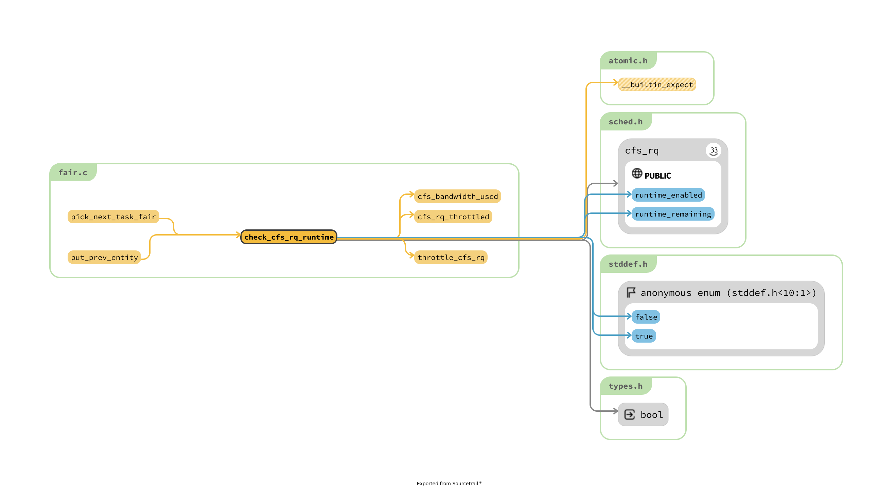
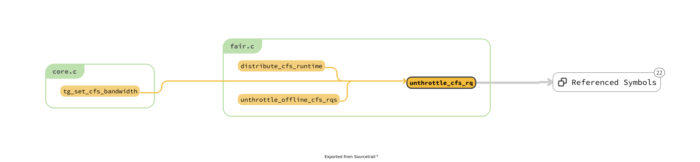

# kernel/sched/core.c

## TODO
cgroup 在 7000 line 注册的函数无人使用呀!

rq 内嵌的 cfs_rq 的作用到底是什么 ? 为什么pick_next_task_fair 总是从其中 pick 但是依旧可以到 root_task_group 上，
`__sched_init` 中间说明了其结果!

task_group 的 share 的计算方法是什么 ?


## analyze

struct task_group 中的: parent sibling 以及 chilren 的关联

- walk_tg_tree_from
- tg_cfs_scheduable_down　// 放到 walk_tg_tree_from 的参数吧!
- sched_online_group
- sched_offline_group

```c
// 其作用是 : make the tg online with the parent 
void sched_online_group(struct task_group *tg, struct task_group *parent)
{
	unsigned long flags;

	spin_lock_irqsave(&task_group_lock, flags);
	list_add_rcu(&tg->list, &task_groups);

	/* Root should already exist: */
	WARN_ON(!parent);

	tg->parent = parent;
	INIT_LIST_HEAD(&tg->children); // 将自己 children 清空
	list_add_rcu(&tg->siblings, &parent->children);
	spin_unlock_irqrestore(&task_group_lock, flags);

	online_fair_sched_group(tg);
}

// 并没有什么作用的东西呀!
void sched_offline_group(struct task_group *tg)
{
	unsigned long flags;

	/* End participation in shares distribution: */
	unregister_fair_sched_group(tg);

	spin_lock_irqsave(&task_group_lock, flags);
	list_del_rcu(&tg->list);
	list_del_rcu(&tg->siblings);
	spin_unlock_irqrestore(&task_group_lock, flags);
}
```


```c
/*
 * Iterate task_group tree rooted at *from, calling @down when first entering a
 * node and @up when leaving it for the final time.
 *
 * Caller must hold rcu_lock or sufficient equivalent.
 */
int walk_tg_tree_from(struct task_group *from,
			     tg_visitor down, tg_visitor up, void *data)
{
	struct task_group *parent, *child;
	int ret;

	parent = from;

down:
	ret = (*down)(parent, data);
	if (ret)
		goto out;
	list_for_each_entry_rcu(child, &parent->children, siblings) {
		parent = child;
		goto down;

up:
		continue;
	}
	ret = (*up)(parent, data);
	if (ret || parent == from)
		goto out;

	child = parent;
	parent = parent->parent;
	if (parent)
		goto up;
out:
	return ret;
}
```
> 就是一个简单的遍历，但是感觉 down 和 up 两个 hook 函数，诡异


```c
static void throttle_cfs_rq(struct cfs_rq *cfs_rq)
void unthrottle_cfs_rq(struct cfs_rq *cfs_rq)
// 原来，throttle 需要遍历整个tree 一样的，但是为什么对于 cfs_rq，
// 而不是对于 task_group 进行的


/*
 * Iterate the full tree, calling @down when first entering a node and @up when
 * leaving it for the final time.
 *
 * Caller must hold rcu_lock or sufficient equivalent.
 */
static inline int walk_tg_tree(tg_visitor down, tg_visitor up, void *data)
{
	return walk_tg_tree_from(&root_task_group, down, up, data);
}
// 一个从上到下的封装函数，其唯一的调用者为 __cfs_schedulable
```

```c
static int __cfs_schedulable(struct task_group *tg, u64 period, u64 quota)
{
	int ret;
	struct cfs_schedulable_data data = {
		.tg = tg,
		.period = period,
		.quota = quota,
	};

	if (quota != RUNTIME_INF) {
		do_div(data.period, NSEC_PER_USEC);
		do_div(data.quota, NSEC_PER_USEC);
	}

	rcu_read_lock();
  // 注意其中放入的两个函数是什么 ?
	ret = walk_tg_tree(tg_cfs_schedulable_down, tg_nop, &data);
	rcu_read_unlock();

	return ret;
}

// __cfs_schedulable 的唯一调用位置
static int tg_set_cfs_bandwidth(struct task_group *tg, u64 period, u64 quota)
// TODO 为什么这么复杂的函数，但是终于知道 bandwidth 和 tg 之间的关系是什么 ?
```


## 才注意到 : cfs_rq 中间持有 tg


```c
static inline void list_add_leaf_cfs_rq(struct cfs_rq *cfs_rq)
// 添加比较复杂了，但是 leaf_cfs_rq_list
//  list_add_leaf_cfs_rq 被 enqueue_entity 使用

	/*
	 * leaf cfs_rqs are those that hold tasks (lowest schedulable entity in
	 * a hierarchy). Non-leaf lrqs hold other higher schedulable entities
	 * (like users, containers etc.)
	 *
	 * leaf_cfs_rq_list ties together list of leaf cfs_rq's in a CPU.
	 * This list is used during load balance.
	 */

static inline void list_del_leaf_cfs_rq(struct cfs_rq *cfs_rq)
/* void unregister_fair_sched_group(struct task_group *tg) */
/* static void update_blocked_averages(int cpu) */

```

> 分析 `cfs_rq->tg` 其赋值位置仅仅在 init_tg_cfs_entry 中间
> 那么cfs 和 tg 总是同时创建的，并且匹配的
> 但是 rq 中间可能持有不同的 cfs rq 的内容 ? 并不是呀!
> rq 持有的不是指针啊! 所以现在malloc 出来的一堆 cfs_rq 以及配套的tg 到底是如何使用的呀!


```c
void init_tg_cfs_entry(struct task_group *tg, struct cfs_rq *cfs_rq,
			struct sched_entity *se, int cpu,
			struct sched_entity *parent)
```


## rq 中间的 cfs_rq 的地位
rq 中间的似乎是根基，然后利用这个实现 group 找到其他的之类的 ?

cfs_rq entity 以及 task_group 初始化的时候，都是一套的，猜测此时创建的
entity 就是一个 group 的代表

所以通过这种方法就用 rq owned by entity/group 的效果。

现在的问题 : 其他的entitiy 如何添加上来的 ?

> attach_entity_cfs_rq

> set_task_rq
> task_set_group_fair

> 好像也不是


> 1. malloc 出来的如何关联上去 ?
> 2. 和rq 中间的关系是什么 ?

task_group  CONFIG_FAIR_GROUP_SCHED 以及 CONFIG_CFS_BANDWIDTH 三者逐渐递进的


2. autogroup 机制的原理

setsid

group scheduling 表示 CONFIG_FAIR_GROUP_SCHED

**A new autogroup is created when a new session is created via setsid(2);
this happens, for example, when a new terminal window is started.**
A new process created by fork(2) inherits its parent's autogroup membership.
Thus, all of the processes in a session are members of the same autogroup.
An autogroup is automatically destroyed when the last process in the group terminates.
> process group 和 task group 混为一团


```c
// 在配置了 autogroup 的 setsid 被调用
/* Allocates GFP_KERNEL, cannot be called under any spinlock: */
void sched_autogroup_create_attach(struct task_struct *p)
{
	struct autogroup *ag = autogroup_create();

	autogroup_move_group(p, ag);

	/* Drop extra reference added by autogroup_create(): */
	autogroup_kref_put(ag);
}
EXPORT_SYMBOL(sched_autogroup_create_attach);

static inline struct autogroup *autogroup_create(void)
	/* tg = sched_create_group(&root_task_group); */
  // 所有的总是默认使用的为 sched_create_group 中间的内容
```

CONFIG_FAIR_GROUP_SCHED 中间的 FAIR 是和 RT 对应的，所以其作用就是为了 group 的效果。


The use of the cgroups(7) CPU controller to place processes in cgroups other than the root CPU cgroup overrides the effect of autogrouping.
> 当 cgroup 没有被配置的时候，depth 没有任何意义，所有的group 都是放在root 下面
> 其中，代码分析也可以的出来该结果。

       cpu (since Linux 2.6.24; CONFIG_CGROUP_SCHED)
              Cgroups can be guaranteed a minimum number of "CPU shares"
              when a system is busy.  This does not limit a cgroup's CPU
              usage if the CPUs are not busy.  For further information, see
              Documentation/scheduler/sched-design-CFS.txt.

              In Linux 3.2, this controller was extended to provide CPU
              "bandwidth" control.  If the kernel is configured with CON‐
              FIG_CFS_BANDWIDTH, then within each scheduling period (defined
              via a file in the cgroup directory), it is possible to define
              an upper limit on the CPU time allocated to the processes in a
              cgroup.  This upper limit applies even if there is no other
              competition for the CPU.  Further information can be found in
              the kernel source file Documentation/scheduler/sched-bwc.txt.

> 两个文档读一下，结果发现都是垃圾

1. 目前的问题，cgroup 形成的多级结构现在无法理解 ?
> 其实并不难，因为cgroup 可以利用文件的方法构建关系，
> 那么entity 有的是文件夹，有的是文件一样，文件就是对应正常的process
> 区分的标准就是 my_q 变量了


## group 之间如何均衡

```c
int alloc_fair_sched_group(struct task_group *tg, struct task_group *parent)

	tg->shares = NICE_0_LOAD;
```

1. tg->shares 相关的计算
    1. 赋值永远都是 NICE_0_LOAD

```c

/*
 * Increase resolution of nice-level calculations for 64-bit architectures.
 * The extra resolution improves shares distribution and load balancing of
 * low-weight task groups (eg. nice +19 on an autogroup), deeper taskgroup
 * hierarchies, especially on larger systems. This is not a user-visible change
 * and does not change the user-interface for setting shares/weights.
 *
 * We increase resolution only if we have enough bits to allow this increased
 * resolution (i.e. 64-bit). The costs for increasing resolution when 32-bit
 * are pretty high and the returns do not justify the increased costs.
 *
 * Really only required when CONFIG_FAIR_GROUP_SCHED=y is also set, but to
 * increase coverage and consistency always enable it on 64-bit platforms.
 */
#ifdef CONFIG_64BIT
# define NICE_0_LOAD_SHIFT	(SCHED_FIXEDPOINT_SHIFT + SCHED_FIXEDPOINT_SHIFT)
# define scale_load(w)		((w) << SCHED_FIXEDPOINT_SHIFT)
# define scale_load_down(w)	((w) >> SCHED_FIXEDPOINT_SHIFT)
#else
# define NICE_0_LOAD_SHIFT	(SCHED_FIXEDPOINT_SHIFT)
# define scale_load(w)		(w)
# define scale_load_down(w)	(w)
#endif

/*
 * Task weight (visible to users) and its load (invisible to users) have
 * independent resolution, but they should be well calibrated. We use
 * scale_load() and scale_load_down(w) to convert between them. The
 * following must be true:
 *
 *  scale_load(sched_prio_to_weight[USER_PRIO(NICE_TO_PRIO(0))]) == NICE_0_LOAD
 *
 */
#define NICE_0_LOAD		(1L << NICE_0_LOAD_SHIFT)


/*
 * Integer metrics need fixed point arithmetic, e.g., sched/fair
 * has a few: load, load_avg, util_avg, freq, and capacity.
 *
 * We define a basic fixed point arithmetic range, and then formalize
 * all these metrics based on that basic range.
 */
# define SCHED_FIXEDPOINT_SHIFT		10
# define SCHED_FIXEDPOINT_SCALE		(1L << SCHED_FIXEDPOINT_SHIFT)
```
> @todo 还有 freq capacity load_avg 等

## https://lwn.net/Articles/639543/


```c
config SCHED_AUTOGROUP
	bool "Automatic process group scheduling"
	select CGROUPS
	select CGROUP_SCHED
	select FAIR_GROUP_SCHED
	help
	  This option optimizes the scheduler for common desktop workloads by
	  automatically creating and populating task groups.  This separation
	  of workloads isolates aggressive CPU burners (like build jobs) from
	  desktop applications.  Task group autogeneration is currently based
	  upon task session.
```
> @todo 所以为什么通过 autogroup 将 CPU burner 和 desktop 之间划分开 ?

对于 cgroup 的文件夹的内容， task_group，entity 以及 cfs_rq 三者一组。

> So when a task belonging to tg migrates from CPUx to CPUy, it will be dequeued from tg->cfs_rq[x] and enqueued on tg->cfs_rq[y].


But the priority value by itself is not helpful to the scheduler,
which also needs to know the *load of the task* to estimate its *time slice*.
As mentioned above, the load must be the multiple of the capacity of a standard CPU that is required to make satisfactory progress on the task.
Hence this priority number must be mapped to such a value; this is done in the array `prio_to_weight[]`.

> 1. load of the taks 估计 time slice
> 2. time slice 是 The concept of a time slice was introduced above as the amount of time that a task is allowed to run on a CPU within a scheduling period.
> 3. @todo 既然存在 struct load_weight , load 和 weight 就是一个东西吗 ?


A priority number of 120, which is the priority of a normal task, is mapped to a load of 1024, which is the value that the kernel uses to represent the capacity of a single standard CPU. 
> @todo 为什么会映射到 1024 上，利用 prio_to_weight 吗 ?

A run queue (`struct cfs_rq`) is also characterized by a "weight" value that is the accumulation of weights of all tasks on its run queue.

```c
struct sched_entity {
	/* For load-balancing: */
	struct load_weight		load;
	unsigned long			runnable_weight; // 难道 bandwidth 使用的 ?
	struct rb_node			run_node;
	struct list_head		group_node; // task group ?
	unsigned int			on_rq; // why not boolean ?

  // @todo how runtime works ?
	u64				exec_start;
	u64				sum_exec_runtime;
	u64				vruntime;
	u64				prev_sum_exec_runtime;

	u64				nr_migrations;
```
> 1. load 和 runnable_weight 之间的关系是什么 ?
> 2. 

The time slice can now be calculated as:
    time_slice = (sched_period() * se.load.weight) / cfs_rq.load.weight;
where `sched_period()` returns the scheduling period as a factor of the number of running tasks on the CPU.
We see that the higher the load, the higher the fraction of the scheduling period that the task gets to run on the CPU.
> 下面的两个函数似乎说明了 : time_slice 的效果，但是由于group 的存在，其计算过程变成了递归的过程。
> 所以 time_slice 相当于一个 taks 允许运行的时间吗 ?

```c
/*
 * We calculate the wall-time slice from the period by taking a part
 * proportional to the weight.
 *
 * s = p*P[w/rw]
 */
static u64 sched_slice(struct cfs_rq *cfs_rq, struct sched_entity *se)
{
	u64 slice = __sched_period(cfs_rq->nr_running + !se->on_rq);

	for_each_sched_entity(se) {
		struct load_weight *load;
		struct load_weight lw;

		cfs_rq = cfs_rq_of(se);
		load = &cfs_rq->load;

		if (unlikely(!se->on_rq)) {
			lw = cfs_rq->load;

			update_load_add(&lw, se->load.weight);
			load = &lw;
		}
		slice = __calc_delta(slice, se->load.weight, load);
	}
	return slice;
}

/*
 * The idea is to set a period in which each task runs once.
 *
 * When there are too many tasks (sched_nr_latency) we have to stretch
 * this period because otherwise the slices get too small.
 *
 * p = (nr <= nl) ? l : l*nr/nl
 */
static u64 __sched_period(unsigned long nr_running)
{
	if (unlikely(nr_running > sched_nr_latency))
		return nr_running * sysctl_sched_min_granularity;
	else
		return sysctl_sched_latency;
}
```

Each time a new task forks or a task wakes up, its vruntime is assigned to a value that is the maximum of its last updated value and `cfs_rq.min_vruntime`.
If not for this, its vruntime would be very small as an effect of not having run for a long time (or at all)
and would take an unacceptably long time to catch up to the vruntime of its sibling tasks and hence starve them of CPU time.
> 不是很懂，对于 `cfs_rq.min_vruntime` 的更新其实也是不清楚的

Every periodic tick, the vruntime of the currently-running task is updated as follows:
    vruntime += delta_exec * (NICE_0_LOAD/curr->load.weight);
where delta_exec is the time spent by the task since the last time vruntime was updated, NICE_0_LOAD is the load of a task with normal priority, and curr is the currently-running task. We see that vruntime progresses slowly for tasks of higher priority. It has to, because the time slice for these tasks is large and they cannot be preempted until the time slice is exhausted.


>  找到了 vruntime 中间的 delta_exec 位置在于何处 ?

```c
// update_curr 中间的内容:
	curr->vruntime += calc_delta_fair(delta_exec, curr);

/*
 * delta /= w
 */
static inline u64 calc_delta_fair(u64 delta, struct sched_entity *se)
{
	if (unlikely(se->load.weight != NICE_0_LOAD))
		delta = __calc_delta(delta, NICE_0_LOAD, &se->load);

	return delta;
}

/*
 * delta_exec * weight / lw.weight
 *   OR
 * (delta_exec * (weight * lw->inv_weight)) >> WMULT_SHIFT
 *
 * Either weight := NICE_0_LOAD and lw \e sched_prio_to_wmult[], in which case
 * we're guaranteed shift stays positive because inv_weight is guaranteed to
 * fit 32 bits, and NICE_0_LOAD gives another 10 bits; therefore shift >= 22.
 *
 * Or, weight =< lw.weight (because lw.weight is the runqueue weight), thus
 * weight/lw.weight <= 1, and therefore our shift will also be positive.
 */
static u64 __calc_delta(u64 delta_exec, unsigned long weight, struct load_weight *lw)
// 这个函数虽然恶心，但是内容就是根据实际的运行时间片段，然后得到 vruntime 得到的片段，并且和 vruntime 无关。
```

**Per-entity load-tracking metrics**

```c
// sched entity 中间保证的变量。
#ifdef CONFIG_SMP
	/*
	 * Per entity load average tracking.
	 *
	 * Put into separate cache line so it does not
	 * collide with read-mostly values above.
	 */
	struct sched_avg		avg;
#endif
```
> pelt 还是和其含有关系的 ?

https://lwn.net/Articles/531853/

放到SMP 中间，就是为了处理其中的 pelt ?

pelt.c 中间是什么个情况 ?

> 问一下蜗壳科技 ?

## sched_entity.avg 是什么情况 ?

> 说了这么多，到底和SMP 有什么蛇皮关系呀 ?

```c
/*
 * sched_entity:
 *
 *   task:
 *     se_runnable() == se_weight()
 *
 *   group: [ see update_cfs_group() ]
 *     se_weight()   = tg->weight * grq->load_avg / tg->load_avg
 *     se_runnable() = se_weight(se) * grq->runnable_load_avg / grq->load_avg
 *
 *   load_sum := runnable_sum
 *   load_avg = se_weight(se) * runnable_avg
 *
 *   runnable_load_sum := runnable_sum
 *   runnable_load_avg = se_runnable(se) * runnable_avg
 *
 * XXX collapse load_sum and runnable_load_sum
 *
 * cfq_rq:
 *
 *   load_sum = \Sum se_weight(se) * se->avg.load_sum
 *   load_avg = \Sum se->avg.load_avg
 *
 *   runnable_load_sum = \Sum se_runnable(se) * se->avg.runnable_load_sum
 *   runnable_load_avg = \Sum se->avg.runable_load_avg
 */

int __update_load_avg_blocked_se(u64 now, int cpu, struct sched_entity *se)
{
	if (entity_is_task(se))
		se->runnable_weight = se->load.weight;

	if (___update_load_sum(now, cpu, &se->avg, 0, 0, 0)) {
		___update_load_avg(&se->avg, se_weight(se), se_runnable(se));
		return 1;
	}

	return 0;
}

int __update_load_avg_se(u64 now, int cpu, struct cfs_rq *cfs_rq, struct sched_entity *se)
{
	if (entity_is_task(se))
		se->runnable_weight = se->load.weight;

	if (___update_load_sum(now, cpu, &se->avg, !!se->on_rq, !!se->on_rq,
				cfs_rq->curr == se)) {

		___update_load_avg(&se->avg, se_weight(se), se_runnable(se));
		cfs_se_util_change(&se->avg);
		return 1;
	}

	return 0;
}
```
> 1. se_runnable 和 se_weight 的关系是什么 ?
> 2. update_cfs_group 的作用是什么 ?


> update_cfs_group 中间的内容和注释中间描述的一致吗 ?
```c
/*
 * Recomputes the group entity based on the current state of its group
 * runqueue.
 */
static void update_cfs_group(struct sched_entity *se)
{
	struct cfs_rq *gcfs_rq = group_cfs_rq(se);
	long shares, runnable;

  // 似乎仅仅分析 group 的 owner 的
	if (!gcfs_rq)
		return;

  // 如果 bandwidth 没有通过 ?
	if (throttled_hierarchy(gcfs_rq))
		return;

    // 似乎分别计算出来 group 的 weight 和 runnable 的内容
    // TODO 所以啥几把是 grq 呀!
  /**
   *   group: [ see update_cfs_group() ]
   *     se_weight()   = tg->weight * grq->load_avg / tg->load_avg
   *     se_runnable() = se_weight(se) * grq->runnable_load_avg / grq->load_avg
   */
	shares   = calc_group_shares(gcfs_rq);
	runnable = calc_group_runnable(gcfs_rq, shares);

	reweight_entity(cfs_rq_of(se), se, shares, runnable);
}

// 调用位置 : enqueue_entity enqueue_task_fair entity_tick 以及 sched_group_set_shares
// 其中 : int sched_group_set_shares(struct task_group *tg, unsigned long shares) 设置位置在 core.c 中间
// update_curr 算是 group 发生变化然后更新的方法了
```

> 0. 但是我怀疑，其中只有在 涉及到什么的时候 
> 1. grq 到底是什么 ? group runqueue ? sched:776 并不是rq 中的，就是 task_group 中间的
> 2. 不如直接搜索 pelt 的内容 ?
> 3. 如果知道其中的 

## 分析一下 : `static long calc_group_shares(struct cfs_rq *cfs_rq)` 上的注释

```c
/*
 * All this does is approximate the hierarchical proportion which includes that
 * global sum we all love to hate.
 *
 * That is, the weight of a group entity, is the proportional share of the
 * group weight based on the group runqueue weights. That is:
 * 
 *                     tg->weight * grq->load.weight
 *   ge->load.weight = -----------------------------               (1)
 *			  \Sum grq->load.weight
 *
 * Now, because computing that sum is prohibitively expensive to compute (been
 * there, done that) we approximate it with this average stuff. The average
 * moves slower and therefore the approximation is cheaper and more stable.
 *
 * So instead of the above, we substitute:
 *
 *   grq->load.weight -> grq->avg.load_avg                         (2)
 *
 * which yields the following:
 *
 *                     tg->weight * grq->avg.load_avg
 *   ge->load.weight = ------------------------------              (3)
 *				tg->load_avg
 *
 * // 也就是说 : tg->load_avg 其实就是 share ?
 * Where: tg->load_avg ~= \Sum grq->avg.load_avg
 *
 * That is shares_avg, and it is right (given the approximation (2)).
 *
 * The problem with it is that because the average is slow -- it was designed
 * to be exactly that of course -- this leads to transients in boundary
 * conditions. In specific, the case where the group was idle and we start the
 * one task. It takes time for our CPU's grq->avg.load_avg to build up,
 * yielding bad latency etc..
 *
 * Now, in that special case (1) reduces to:
 *
 *                     tg->weight * grq->load.weight
 *   ge->load.weight = ----------------------------- = tg->weight   (4)
 *			    grp->load.weight
 *
 * That is, the sum collapses because all other CPUs are idle; the UP scenario.
 *
 * So what we do is modify our approximation (3) to approach (4) in the (near)
 * UP case, like:
 *
 *   ge->load.weight =
 *
 *              tg->weight * grq->load.weight
 *     ---------------------------------------------------         (5)
 *     tg->load_avg - grq->avg.load_avg + grq->load.weight
 *
 * But because grq->load.weight can drop to 0, resulting in a divide by zero,
 * we need to use grq->avg.load_avg as its lower bound, which then gives:
 *
 *
 *                     tg->weight * grq->load.weight
 *   ge->load.weight = -----------------------------		   (6)
 *				tg_load_avg'
 *
 * Where:
 *
 *   tg_load_avg' = tg->load_avg - grq->avg.load_avg +
 *                  max(grq->load.weight, grq->avg.load_avg)
 *
 * And that is shares_weight and is icky. In the (near) UP case it approaches
 * (4) while in the normal case it approaches (3). It consistently
 * overestimates the ge->load.weight and therefore:
 *
 *   \Sum ge->load.weight >= tg->weight
 *
 * hence icky!
 */
```
1. task_group 和 cfs_rq 都有 weight 吗 ? 并不是，所以 weight 在什么地方 ?
2. 观察一下　calc_group_shares 中间的内容吧!
3. 


```c
/* Task group related information */
struct task_group {
	unsigned long		shares;

#ifdef	CONFIG_SMP
	/*
	 * load_avg can be heavily contended at clock tick time, so put
	 * it in its own cacheline separated from the fields above which
	 * will also be accessed at each tick.
	 */
	atomic_long_t		load_avg ____cacheline_aligned;
#endif


/* CFS-related fields in a runqueue */
struct cfs_rq {
	struct load_weight	load;
	unsigned long		runnable_weight;
	unsigned int		nr_running;
	unsigned int		h_nr_running;


#ifdef CONFIG_SMP
	/*
	 * CFS load tracking
	 */
	struct sched_avg	avg;


struct sched_entity {
	/* For load-balancing: */
	struct load_weight		load;
	unsigned long			runnable_weight;
#ifdef CONFIG_SMP
	/*
	 * Per entity load average tracking.
	 *
	 * Put into separate cache line so it does not
	 * collide with read-mostly values above.
	 */
	struct sched_avg		avg;
#endif
};
```
> 所以，所有的疑惑都在 tg 中间 : share 和 load_avg　　


```c
/**
 * update_tg_load_avg - update the tg's load avg
 * @cfs_rq: the cfs_rq whose avg changed
 * @force: update regardless of how small the difference
 *
 * this function 'ensures': tg->load_avg := \sum tg->cfs_rq[]->avg.load.
 * However, because tg->load_avg is a global value there are performance
 * considerations.
 *
 * In order to avoid having to look at the other cfs_rq's, we use a
 * differential update where we store the last value we propagated. This in
 * turn allows skipping updates if the differential is 'small'.
 *
 * Updating tg's load_avg is necessary before update_cfs_share().
 */
static inline void update_tg_load_avg(struct cfs_rq *cfs_rq, int force)
{
	long delta = cfs_rq->avg.load_avg - cfs_rq->tg_load_avg_contrib;
  // 其实，所以这些 tg_load_avg_contrib 的使用真的是过于简单呀!

	/*
	 * No need to update load_avg for root_task_group as it is not used.
	 */
	if (cfs_rq->tg == &root_task_group)
		return;

	if (force || abs(delta) > cfs_rq->tg_load_avg_contrib / 64) {
		atomic_long_add(delta, &cfs_rq->tg->load_avg);
		cfs_rq->tg_load_avg_contrib = cfs_rq->avg.load_avg;
	}
}
```

> 忽然，意识到，其实，tg 其实所有的cpu 的 rq 的总和
> this function 'ensures': `tg->load_avg := \sum tg->cfs_rq[]->avg.load`.

This metric calculates task load as the amount of time that the task was runnable during the time that it was alive.
This is kept track of in the sched_avg data structure (stored in the sched_entity structure):


## per-entity load tracking : https://lwn.net/Articles/531853/
1. 不使用 per-entity load tracking 的问题是什么 ?
2. 

```c
/*
 * // 1. 为什么计算方法是几何级数 ?
 * // 2. __update_load_avg() 中间的具体的内容是什么 ?
 * 
 * The load_avg/util_avg accumulates an infinite geometric series
 * (see __update_load_avg() in kernel/sched/fair.c).
 *
 * [load_avg definition]
 *
 *   load_avg = runnable% * scale_load_down(load)
 *
 * where runnable% is the time ratio that a sched_entity is runnable.
 * For cfs_rq, it is the aggregated load_avg of all runnable and
 * blocked sched_entities.
 *
 * load_avg may also take frequency scaling into account:
 *
 *   load_avg = runnable% * scale_load_down(load) * freq%
 *
 * where freq% is the CPU frequency normalized to the highest frequency.
 *
 * [util_avg definition]
 *
 *   util_avg = running% * SCHED_CAPACITY_SCALE
 *
 * where running% is the time ratio that a sched_entity is running on
 * a CPU. For cfs_rq, it is the aggregated util_avg of all runnable
 * and blocked sched_entities.
 *
 * util_avg may also factor frequency scaling and CPU capacity scaling:
 *
 *   util_avg = running% * SCHED_CAPACITY_SCALE * freq% * capacity%
 *
 * where freq% is the same as above, and capacity% is the CPU capacity
 * normalized to the greatest capacity (due to uarch differences, etc).
 *
 * N.B., the above ratios (runnable%, running%, freq%, and capacity%)
 * themselves are in the range of [0, 1]. To do fixed point arithmetics,
 * we therefore scale them to as large a range as necessary. This is for
 * example reflected by util_avg's SCHED_CAPACITY_SCALE.
 *
 * [Overflow issue]
 *
 * The 64-bit load_sum can have 4353082796 (=2^64/47742/88761) entities
 * with the highest load (=88761), always runnable on a single cfs_rq,
 * and should not overflow as the number already hits PID_MAX_LIMIT.
 *
 * For all other cases (including 32-bit kernels), struct load_weight's
 * weight will overflow first before we do, because:
 *
 *    Max(load_avg) <= Max(load.weight)
 *
 * Then it is the load_weight's responsibility to consider overflow
 * issues.
 */

struct sched_avg {
	u64				last_update_time;
	u64				load_sum;
	u64				runnable_load_sum;
	u32				util_sum;
	u32				period_contrib;
	unsigned long			load_avg;
	unsigned long			runnable_load_avg;
	unsigned long			util_avg;
	struct util_est			util_est;
} ____cacheline_aligned;
```

##  resched_curr 分析 todo
考虑 `static void entity_tick(struct cfs_rq *cfs_rq, struct sched_entity *curr, int queued)` 中间的调用
内容，为什么是 se 不断查找其 parent 的过程呀，所以到时候还可以知道谁需要被调用离开吗 ?

```c
/*
 * resched_curr - mark rq's current task 'to be rescheduled now'.
 *
 * On UP this means the setting of the need_resched flag, on SMP it
 * might also involve a cross-CPU call to trigger the scheduler on
 * the target CPU.
 */
void resched_curr(struct rq *rq)
{
	struct task_struct *curr = rq->curr;
	int cpu;

	lockdep_assert_held(&rq->lock);

	if (test_tsk_need_resched(curr))
		return;

	cpu = cpu_of(rq);

	if (cpu == smp_processor_id()) {
		set_tsk_need_resched(curr);
		set_preempt_need_resched();
		return;
	}

	if (set_nr_and_not_polling(curr))
		smp_send_reschedule(cpu);
	else
		trace_sched_wake_idle_without_ipi(cpu);
}
```


## reweight_entity 内容分析
1. runnable_avg 和 avg 的关系是什么 ?
2. reweight_entity 其实就是直接对于 se 的 runnable_weight 和 load.weight 进行赋值。

```c
static void reweight_entity(struct cfs_rq *cfs_rq, struct sched_entity *se,
			    unsigned long weight, unsigned long runnable)
{
	if (se->on_rq) {
		/* commit outstanding execution time */
		if (cfs_rq->curr == se)
			update_curr(cfs_rq);
		account_entity_dequeue(cfs_rq, se);
		dequeue_runnable_load_avg(cfs_rq, se);
	}
	dequeue_load_avg(cfs_rq, se);

	se->runnable_weight = runnable;
	update_load_set(&se->load, weight);

#ifdef CONFIG_SMP
	do {
		u32 divider = LOAD_AVG_MAX - 1024 + se->avg.period_contrib;

		se->avg.load_avg = div_u64(se_weight(se) * se->avg.load_sum, divider);
		se->avg.runnable_load_avg =
			div_u64(se_runnable(se) * se->avg.runnable_load_sum, divider);
	} while (0);
#endif

	enqueue_load_avg(cfs_rq, se);
	if (se->on_rq) {
		account_entity_enqueue(cfs_rq, se);
		enqueue_runnable_load_avg(cfs_rq, se);
	}
}
```


```c
static inline void
enqueue_runnable_load_avg(struct cfs_rq *cfs_rq, struct sched_entity *se)
{
	cfs_rq->runnable_weight += se->runnable_weight;

	cfs_rq->avg.runnable_load_avg += se->avg.runnable_load_avg;
	cfs_rq->avg.runnable_load_sum += se_runnable(se) * se->avg.runnable_load_sum;
}

static inline void
dequeue_runnable_load_avg(struct cfs_rq *cfs_rq, struct sched_entity *se)
{
	cfs_rq->runnable_weight -= se->runnable_weight;

	sub_positive(&cfs_rq->avg.runnable_load_avg, se->avg.runnable_load_avg);
	sub_positive(&cfs_rq->avg.runnable_load_sum,
		     se_runnable(se) * se->avg.runnable_load_sum);
}

static inline void
enqueue_load_avg(struct cfs_rq *cfs_rq, struct sched_entity *se)
{
	cfs_rq->avg.load_avg += se->avg.load_avg;
	cfs_rq->avg.load_sum += se_weight(se) * se->avg.load_sum;
}

static inline void
dequeue_load_avg(struct cfs_rq *cfs_rq, struct sched_entity *se)
{
	sub_positive(&cfs_rq->avg.load_avg, se->avg.load_avg);
	sub_positive(&cfs_rq->avg.load_sum, se_weight(se) * se->avg.load_sum);
}
```

## propagate 传播机制
cfs_rq::propagate_runnable_sum 的访问位置:


> @todo 配合研究一下两个函数
```c
static inline void
update_tg_cfs_runnable(struct cfs_rq *cfs_rq, struct sched_entity *se, struct cfs_rq *gcfs_rq)


/* Update task and its cfs_rq load average */
static inline int propagate_entity_load_avg(struct sched_entity *se)
{
	struct cfs_rq *cfs_rq, *gcfs_rq;

	if (entity_is_task(se))
		return 0;

	gcfs_rq = group_cfs_rq(se);
	if (!gcfs_rq->propagate)
		return 0;

	gcfs_rq->propagate = 0;

	cfs_rq = cfs_rq_of(se);

	add_tg_cfs_propagate(cfs_rq, gcfs_rq->prop_runnable_sum);

	update_tg_cfs_util(cfs_rq, se, gcfs_rq);
	update_tg_cfs_runnable(cfs_rq, se, gcfs_rq);

	return 1;
}
```

propagate_entity_load_avg 被 update_load_avg 唯一调用，其实并没有

## 触发 rebalance 的方法和位置是什么 ?
1. domain 的概念是什么 ?
2. 

```
idle_balance : schedule() 调用，应该是最容易分析了
rebalance_domains:
  load_balance : 核心业务 ?

_nohz_idle_balance()
run_rebalance_domains : 被注册到 softirq 中间了 
  rebalance_domains

nohz_idle_balance(): 被run_rebalance_domains 唯一调用
nohz_newidle_balance(): 被 idle_balance 唯一调用
  __nohz_idle_balance():


scheduler_tick()
  tigger_load_balance
    nohz_balance_kick() : 值的关注一下，好像和之前的所有的东西都不是一个东西呀!
```

> 好像就是 softirq 触发的，然后进行整个流程走一下
> 以及从 timer 中间触发!


## Nohz 的影响是什么 ?

## load_balance 的实现 ?
kernel/sched/fair.c:6798 的注释

> 了解一下其中的函数

```c

```


## attach 和 detach 三个函数

```c
static void attach_entity_cfs_rq(struct sched_entity *se)

/*
 * attach_tasks() -- attaches all tasks detached by detach_tasks() to their
 * new rq.
 */
static void attach_tasks(struct lb_env *env)

/**
 * attach_entity_load_avg - attach this entity to its cfs_rq load avg
 * @cfs_rq: cfs_rq to attach to
 * @se: sched_entity to attach
 * @flags: migration hints
 *
 * Must call update_cfs_rq_load_avg() before this, since we rely on
 * cfs_rq->avg.last_update_time being current.
 */
static void attach_entity_load_avg(struct cfs_rq *cfs_rq, struct sched_entity *se, int flags)
```


1. `static void attach_tasks(struct lb_env *env)` 

利用 lb_env (load_balance environment ?) 将 task 一个一个的从 链表中间迁移。

```c
void activate_task(struct rq *rq, struct task_struct *p, int flags)
{
	if (task_contributes_to_load(p)) // 这两行看不懂啊!
		rq->nr_uninterruptible--;

	enqueue_task(rq, p, flags);
}
```

detach_tasks 和 attach_tasks 对称，但是其中存在部分检查 `env->loop` 和 `can_migrate_task`

2. `attach_entity_cfs_rq` 和 `attach_task_cfs_rq`

```c
static void attach_entity_cfs_rq(struct sched_entity *se)
{
	struct cfs_rq *cfs_rq = cfs_rq_of(se);

#ifdef CONFIG_FAIR_GROUP_SCHED
	/*
	 * Since the real-depth could have been changed (only FAIR
	 * class maintain depth value), reset depth properly.
	 */
	se->depth = se->parent ? se->parent->depth + 1 : 0;
#endif

	/* Synchronize entity with its cfs_rq */
	update_load_avg(cfs_rq, se, sched_feat(ATTACH_AGE_LOAD) ? 0 : SKIP_AGE_LOAD);
	attach_entity_load_avg(cfs_rq, se, 0);
	update_tg_load_avg(cfs_rq, false);
	propagate_entity_cfs_rq(se);
}

static void attach_task_cfs_rq(struct task_struct *p)
{
	struct sched_entity *se = &p->se;
	struct cfs_rq *cfs_rq = cfs_rq_of(se);

	attach_entity_cfs_rq(se);

	if (!vruntime_normalized(p))
		se->vruntime += cfs_rq->min_vruntime;
}
```
3. `attach_entity_load_avg` 因为切换 rq 之类需要更新 load_avg

attach_task_cfs_rq 最后 switch_to_fair 以及 task_move_group_fair (task_change_group_fair)调用。
都是 sched_class 中间的标准的函数。

其实 attach_tasks 和 其他的各种蛇皮是两个体系

## lb 的关键内容 : find_busiest_group 和 find_busiest_queue
被 load_balance 唯一调用

```c
/*
 * find_busiest_queue - find the busiest runqueue among the CPUs in the group.
 */
static struct rq *find_busiest_queue(struct lb_env *env,
				     struct sched_group *group)
```

在 group 中间的找到 cfs_rq，因为迁移都是在文件夹中间进行迁移的。

task_group 是描述，

```c
/**
 * find_busiest_group - Returns the busiest group within the sched_domain
 * if there is an imbalance.
 *
 * Also calculates the amount of weighted load which should be moved
 * to restore balance.
 *
 * @env: The load balancing environment.
 *
 * Return:	- The busiest group if imbalance exists.
 */
static struct sched_group *find_busiest_group(struct lb_env *env)
```

find_busiest_group 的 helper 函数 7000 ~ 8200 。

find_idlest_cpu 和 find_idlest_group : select_task_rq_fair 相关的
@todo 为什么 lb 只需要 busiest 而不需要 idlest 的

## `select_idle_*` 的作用是什么

* ***select_idle_sibling***

```c
/*
 * Try and locate an idle core/thread in the LLC cache domain.
 */
static int select_idle_sibling(struct task_struct *p, int prev, int target)
```
调用位置

1. 
```c
/*
 * select_task_rq_fair: Select target runqueue for the waking task in domains
 * that have the 'sd_flag' flag set. In practice, this is SD_BALANCE_WAKE,
 * SD_BALANCE_FORK, or SD_BALANCE_EXEC.
 *
 * Balances load by selecting the idlest CPU in the idlest group, or under
 * certain conditions an idle sibling CPU if the domain has SD_WAKE_AFFINE set.
 *
 * Returns the target CPU number.
 *
 * preempt must be disabled.
 */
static int
select_task_rq_fair(struct task_struct *p, int prev_cpu, int sd_flag, int wake_flags)
```

2. task_numa_compare
    - task_numa_find_cpu
        - task_numa_migrate
            - numa_migrate_perfer
              - task_numa_fault : 这个函数调用位置来自于 memory.c huge_memory.c 中的 do_numa_page 之类的函数

select_idle_sibling 中间的部分片段:

```c
	i = select_idle_core(p, sd, target);
	if ((unsigned)i < nr_cpumask_bits)
		return i;

	i = select_idle_cpu(p, sd, target);
	if ((unsigned)i < nr_cpumask_bits)
		return i;

	i = select_idle_smt(p, sd, target);
	if ((unsigned)i < nr_cpumask_bits)
		return i;
```


## affine
都是 select_task_rq_fair 的辅助函数，task 开始执行需要选择最佳的rq

wake_affine
    - wake_affine_idle
    - wake_affine_weight

wake_wide :

## bandwidth 机制
1. 基本机制是什么 ?
    1. 和 time_period time_slice 之间的关系是什么 ?

2. 问题:
    1. 我怎么知道我的时间超过了 ?
    2. 超过之后的措施是什么 ?

cfs_bandwith_used() 简单的辅助函数，用于开关 bandwidth 机制。
和 `void cfs_bandwidth_usage_inc(void)` 和 `void cfs_bandwidth_usage_dec(void)` 配合使用。

struct cfs_rq 中间的支持 :

```c
#ifdef CONFIG_CFS_BANDWIDTH
	int			runtime_enabled;
	int			expires_seq;
	u64			runtime_expires; // 和 sched_avg 的 runtime 相区分
	s64			runtime_remaining;

	u64			throttled_clock;
	u64			throttled_clock_task;
	u64			throttled_clock_task_time;
	int			throttled;
	int			throttle_count;
	struct list_head	throttled_list;
#endif /* CONFIG_CFS_BANDWIDTH */
```

## `tg_set_cfs_*`

调用者 : 都是来自于 cgroup 机制的
- tg_set_cfs_cpu
- tg_set_cfs_period
- cpu_max_write

## unthrottle_cfs_rq 和 throttle_cfs_rq

```c
// 这就是两个检查是否超过 bandwidth 的时机:
check_enqueue_throttle : 被 enqueue_entity 唯一处理
check_cfs_rq_runtime
  static void throttle_cfs_rq(struct cfs_rq *cfs_rq) // todo 观察其中，就可以知道到底如何实现控制 bandwidth


void unthrottle_cfs_rq(struct cfs_rq *cfs_rq)
```



> put_prev_entity 为什么需要 check_cfs_rq_runtime ? 都已经离开队列了，为什么还是需要处理 ?




分析一下:
```c
/*
 * Responsible for refilling a task_group's bandwidth and unthrottling its
 * cfs_rqs as appropriate. If there has been no activity within the last
 * period the timer is deactivated until scheduling resumes; cfs_b->idle is
 * used to track this state.
 */
static int do_sched_cfs_period_timer(struct cfs_bandwidth *cfs_b, int overrun)


/*
 * This is done with a timer (instead of inline with bandwidth return) since
 * it's necessary to juggle rq->locks to unthrottle their respective cfs_rqs.
 */
static void do_sched_cfs_slack_timer(struct cfs_bandwidth *cfs_b)


static enum hrtimer_restart sched_cfs_period_timer(struct hrtimer *timer)
static enum hrtimer_restart sched_cfs_slack_timer(struct hrtimer *timer)

void init_cfs_bandwidth(struct cfs_bandwidth *cfs_b) // 上述函数注册的位置
```

## rq_offline_fair 和 rq_online_fair 的作用是什么 ?

online 和 offline 表示 cpu 的添加和去除。

```c
static void rq_online_fair(struct rq *rq)
{
	update_sysctl();

	update_runtime_enabled(rq);
}
```

利用 此处的 git blame 可以找到当时添加此函数的原因是什么东西 ?

## cfs_bandwidth::period_timer 和 cfs_bandwidth::slack_timer

start_cfs_bandwidth : 似乎是开始计时的函数。

slack_timer 的作用似乎是: 用于计算没有用完的时间的。
```c
static void dequeue_entity(struct cfs_rq *cfs_rq, struct sched_entity *se, int flags)
    static __always_inline void return_cfs_rq_runtime(struct cfs_rq *cfs_rq)
        /* we know any runtime found here is valid as update_curr() precedes return */
        static void __return_cfs_rq_runtime(struct cfs_rq *cfs_rq)
            static void start_cfs_slack_bandwidth(struct cfs_bandwidth *cfs_b)
```
