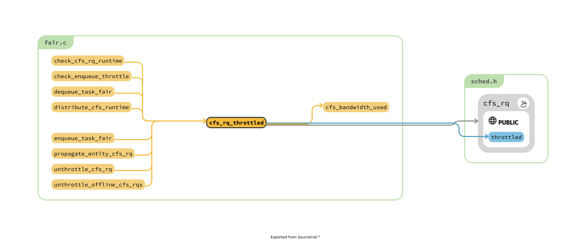

# linux/kernel/sched/fair.c 源码分析


> 1. 从 1000 ~ 2700 config_numa_balancing
> 2. 3700 计算load avg 以及处理 tg 等东西
> 3. 4000 dequeue_entity 各种 entity_tick 之类的
> 4. 5000 作用的位置，处理bandwidth
> 5. 后面也许都是在处理 cpu attach 的吧


update_cfs_group : shares runable 然后利用 reweight_entity 分析

## taks group
> 1. root_task_group 在 sched_init 中间被初始化 ?


```c
// init_tg_cfs_entry 的两个调用者
int alloc_fair_sched_group(struct task_group *tg, struct task_group *parent)
void __init sched_init(void)

    void init_tg_cfs_entry(struct task_group *tg, struct cfs_rq *cfs_rq,
          struct sched_entity *se, int cpu,
          struct sched_entity *parent)


// todo 和我想象的不同，缺少加入 task_group 离开 task_group 之类的操作
// 调用的地方太少了

```

```c
int alloc_fair_sched_group(struct task_group *tg, struct task_group *parent)

struct task_group {
// 部分字段被省略

#ifdef CONFIG_FAIR_GROUP_SCHED
	/* schedulable entities of this group on each CPU */
	struct sched_entity	**se;
	/* runqueue "owned" by this group on each CPU */
	struct cfs_rq		**cfs_rq;
	unsigned long		shares;
#endif

	struct rcu_head		rcu;
	struct list_head	list;

	struct task_group	*parent;
	struct list_head	siblings;
	struct list_head	children;

	struct cfs_bandwidth	cfs_bandwidth;
};
```

1. task_group 也是划分为含有 parent 机制的
2. tg 是参数，外部malloc 将其各个部分初始化
3. task_group 通过 parent siblings 以及 chilren 将其中的各个部分形成网状结构
4. CONFIG_CFS_BANDWIDTH 中间的部分:
  1. task_group 不依赖于 fair_group_sched ，而是总是存在的，用于形成
  2. cfs_bandwidth 为什么和 fair_group_sched 的关系到底是什么 ?　本以为其子集呀，现在bandwidth 似乎用于保证 task_group 中间保证最多使用，fair_group_sched 保证内部的公平
  3. 居然还有 percpu 机制
  4. alloc_fair_sched_group 就是对于 se cfs_rq  cfs_bandwidth 的初始化而已


> 还是 init_tg_cfs_entry 含有一些有意思的东西。

```c
void init_tg_cfs_entry(struct task_group *tg, struct cfs_rq *cfs_rq,
			struct sched_entity *se, int cpu,
			struct sched_entity *parent)
{
	struct rq *rq = cpu_rq(cpu);

  // 对于每一个cpu　创建的cfs 和 sched_entity 初始化
	cfs_rq->tg = tg;
	cfs_rq->rq = rq;
	init_cfs_rq_runtime(cfs_rq);

	tg->cfs_rq[cpu] = cfs_rq;
	tg->se[cpu] = se;

	/* se could be NULL for root_task_group */
	if (!se)
		return;


  // 神奇的地方 : 这一个 parent 其实是 task_group 的 parent 的父类的位置
	if (!parent) {
		se->cfs_rq = &rq->cfs;
		se->depth = 0;
	} else {
		se->cfs_rq = parent->my_q;
		se->depth = parent->depth + 1;
	}

	se->my_q = cfs_rq; // TODO 这么来说，那么my_q 不可以为null
	/* guarantee group entities always have weight */
	update_load_set(&se->load, NICE_0_LOAD);
	se->parent = parent;
}

// 通过 此 无法修改 my_q 这一个变量
// FIXME 必然 se 还有初始化的方法，其他的entity 是如何加入到 ?
/* runqueue "owned" by this group */
static inline struct cfs_rq *group_cfs_rq(struct sched_entity *grp)
{
	return grp->my_q;
}
```

> 分析一下 taks_group 的 tree 是如何构建出来的

```c
/* allocate runqueue etc for a new task group */
struct task_group *sched_create_group(struct task_group *parent)
{
	struct task_group *tg;

	tg = kmem_cache_alloc(task_group_cache, GFP_KERNEL | __GFP_ZERO);
	if (!tg)
		return ERR_PTR(-ENOMEM);

	if (!alloc_fair_sched_group(tg, parent)) // alloc_fair_sched_group 的唯一的调用位置
		goto err;

	if (!alloc_rt_sched_group(tg, parent))
		goto err;

	return tg;

err:
	sched_free_group(tg);
	return ERR_PTR(-ENOMEM);
}

// 进一步的两个调用位置，

static struct cgroup_subsys_state *
cpu_cgroup_css_alloc(struct cgroup_subsys_state *parent_css)
{
	struct task_group *parent = css_tg(parent_css);
	struct task_group *tg;

	if (!parent) {
		/* This is early initialization for the top cgroup */
		return &root_task_group.css;
	}

	tg = sched_create_group(parent);
	if (IS_ERR(tg))
		return ERR_PTR(-ENOMEM);

	return &tg->css;
}

static inline struct autogroup *autogroup_create(void)
{
	struct autogroup *ag = kzalloc(sizeof(*ag), GFP_KERNEL);
	struct task_group *tg;

	if (!ag)
		goto out_fail;

	tg = sched_create_group(&root_task_group);
	if (IS_ERR(tg))
		goto out_free;

	kref_init(&ag->kref);
	init_rwsem(&ag->lock);
	ag->id = atomic_inc_return(&autogroup_seq_nr);
	ag->tg = tg;
#ifdef CONFIG_RT_GROUP_SCHED
	/*
	 * Autogroup RT tasks are redirected to the root task group
	 * so we don't have to move tasks around upon policy change,
	 * or flail around trying to allocate bandwidth on the fly.
	 * A bandwidth exception in __sched_setscheduler() allows
	 * the policy change to proceed.
	 */
	free_rt_sched_group(tg);
	tg->rt_se = root_task_group.rt_se;
	tg->rt_rq = root_task_group.rt_rq;
#endif
	tg->autogroup = ag;

	sched_online_group(tg, &root_task_group);
	return ag;

out_free:
	kfree(ag);
out_fail:
	if (printk_ratelimit()) {
		printk(KERN_WARNING "autogroup_create: %s failure.\n",
			ag ? "sched_create_group()" : "kzalloc()");
	}

	return autogroup_kref_get(&autogroup_default);
}
```


## CONFIG_CFS_BANDWIDTH
https://www.kernel.org/doc/Documentation/scheduler/sched-bwc.txt

CFS bandwidth control is a `CONFIG_FAIR_GROUP_SCHED` extension which allows the
specification of the maximum CPU bandwidth available to a group or hierarchy.

The bandwidth allowed for a group is specified using a quota and period. Within
each given "period" (microseconds), a group is allowed to consume only up to
"quota" microseconds of CPU time.  When the CPU bandwidth consumption of a
group exceeds this limit (for that period), the tasks belonging to its
hierarchy will be throttled and are not allowed to run again until the next
period.
> 所以，如何确定 quota 又是如何检测其中的是否超过设置的数值的


## CONFIG_NUMA_BALANCING

This option adds support for automatic NUMA aware memory/task placement. The mechanism is quite primitive and is based on migrating memory when it has references to the node the task is running on.

This system will be inactive on UMA systems.

> 似乎是为了处理当其中的NUMA 远程访问，然后直接将CPU 迁移过去的操作。


```c
// 请问 numa
void init_numa_balancing(unsigned long clone_flags, struct task_struct *p)

struct numa_group{
```


##


## 详细内容

```c
static inline void update_load_add(struct load_weight *lw, unsigned long inc)
static inline void update_load_sub(struct load_weight *lw, unsigned long dec)
static inline void update_load_set(struct load_weight *lw, unsigned long w)
// 辅助函数，@todo load_weight 中间 inv_weight 到底如何使用 ?


// 利用load weight 计算 @todo 计算什么来着 ?
static void __update_inv_weight(struct load_weight *lw)
static u64 __calc_delta(u64 delta_exec, unsigned long weight, struct load_weight *lw)

// 为 CONFIG_FAIR_GROUP_SCHED 而配置的各种辅助函数
static inline struct rq *rq_of(struct cfs_rq *cfs_rq)
static inline struct task_struct *task_of(struct sched_entity *se)
static inline struct rq *rq_of(struct cfs_rq *cfs_rq)
static inline struct cfs_rq *task_cfs_rq(struct task_struct *p)
static inline struct cfs_rq *cfs_rq_of(struct sched_entity *se)
static inline struct cfs_rq *group_cfs_rq(struct sched_entity *grp)
static inline void list_add_leaf_cfs_rq(struct cfs_rq *cfs_rq)
static inline void list_del_leaf_cfs_rq(struct cfs_rq *cfs_rq)
static inline struct sched_entity *parent_entity(struct sched_entity *se)
static inline void find_matching_se(struct sched_entity **se, struct sched_entity **pse)


// Scheduling class tree data structure manipulation methods:
// @todo 但是 min_vruntime 的含义还是不动呀!
static inline u64 max_vruntime(u64 max_vruntime, u64 vruntime)
static inline u64 min_vruntime(u64 min_vruntime, u64 vruntime)
static void update_min_vruntime(struct cfs_rq *cfs_rq)
// 还有一堆 __fun 的函数

// Scheduling class statistics methods:
// 700 line

// 6000 - 10000 用于迁移
```


```c
sched_group
sched_domain
```

### CONFIG_SMP 带来的挑战

```c
// 6296
/*
 * select_task_rq_fair: Select target runqueue for the waking task in domains
 * that have the 'sd_flag' flag set. In practice, this is SD_BALANCE_WAKE,
 * SD_BALANCE_FORK, or SD_BALANCE_EXEC.
 *
 * Balances load by selecting the idlest CPU in the idlest group, or under
 * certain conditions an idle sibling CPU if the domain has SD_WAKE_AFFINE set.
 *
 * Returns the target CPU number.
 *
 * preempt must be disabled.
 */
static int select_task_rq_fair(struct task_struct *p, int prev_cpu, int sd_flag, int wake_flags)
// selecting the idlest CPU in the idlest group
  // 文章中间提到的 group 以及 domain 的概念来处理

// 6365
/*
 * Called immediately before a task is migrated to a new CPU; task_cpu(p) and
 * cfs_rq_of(p) references at time of call are still valid and identify the
 * previous CPU. The caller guarantees p->pi_lock or task_rq(p)->lock is held.
 */
static void migrate_task_rq_fair(struct task_struct *p, int new_cpu)


// 不知道是做什么的，四个辅助的小函数
static void rq_online_fair(struct rq *rq)
{
	update_sysctl();

	update_runtime_enabled(rq);
}

static void rq_offline_fair(struct rq *rq)
{
	update_sysctl();

	/* Ensure any throttled groups are reachable by pick_next_task */
	unthrottle_offline_cfs_rqs(rq);
}

static void task_dead_fair(struct task_struct *p)
{
	remove_entity_load_avg(&p->se);
}

/*
 * sched_class::set_cpus_allowed must do the below, but is not required to
 * actually call this function.
 */
void set_cpus_allowed_common(struct task_struct *p, const struct cpumask *new_mask)
{
	cpumask_copy(&p->cpus_allowed, new_mask);
	p->nr_cpus_allowed = cpumask_weight(new_mask);
}
```

## dequeue_task_fair
> 总体来说， dequeue_task_fair 在于和 bandwidth group 相关的更新
> enqueue_task_fair 和其效果非常的相似





```c
//  各种update

// check_buddies 就是为了处理 cfs_rq 中间的四个变量，将其设置为NULL

/* CFS-related fields in a runqueue */
struct cfs_rq {
	/*
	 * 'curr' points to currently running entity on this cfs_rq.
	 * It is set to NULL otherwise (i.e when none are currently running).
	 */
	struct sched_entity	*curr;
	struct sched_entity	*next;
	struct sched_entity	*last;
	struct sched_entity	*skip;


// account_entity_dequeue : 另一个调用位置 reweight_entity

static void
account_entity_dequeue(struct cfs_rq *cfs_rq, struct sched_entity *se)
{
  // 本函数，处理 nr_running 和 load.weight 机制
	update_load_sub(&cfs_rq->load, se->load.weight);
	if (!parent_entity(se))
		update_load_sub(&rq_of(cfs_rq)->load, se->load.weight);
#ifdef CONFIG_SMP
	if (entity_is_task(se)) {
		account_numa_dequeue(rq_of(cfs_rq), task_of(se)); 
		list_del_init(&se->group_node);
	}
#endif
	cfs_rq->nr_running--;
}

// dequeue_runable_load_avg
```

#### update_load_avg
> 这个函数感觉仅仅像是一个搭桥的函数

```c
/*
 * The load_avg/util_avg accumulates an infinite geometric series
 * (see __update_load_avg() in kernel/sched/fair.c).
 *
 * [load_avg definition]
 *
 *   load_avg = runnable% * scale_load_down(load)
 *
 * where runnable% is the time ratio that a sched_entity is runnable.
 * For cfs_rq, it is the aggregated load_avg of all runnable and
 * blocked sched_entities.
 *
 * load_avg may also take frequency scaling into account:
 *
 *   load_avg = runnable% * scale_load_down(load) * freq%
 *
 * where freq% is the CPU frequency normalized to the highest frequency.
 *
 * [util_avg definition]
 *
 *   util_avg = running% * SCHED_CAPACITY_SCALE
 *
 * where running% is the time ratio that a sched_entity is running on
 * a CPU. For cfs_rq, it is the aggregated util_avg of all runnable
 * and blocked sched_entities.
 *
 * util_avg may also factor frequency scaling and CPU capacity scaling:
 *
 *   util_avg = running% * SCHED_CAPACITY_SCALE * freq% * capacity%
 *
 * where freq% is the same as above, and capacity% is the CPU capacity
 * normalized to the greatest capacity (due to uarch differences, etc).
 *
 * N.B., the above ratios (runnable%, running%, freq%, and capacity%)
 * themselves are in the range of [0, 1]. To do fixed point arithmetics,
 * we therefore scale them to as large a range as necessary. This is for
 * example reflected by util_avg's SCHED_CAPACITY_SCALE.
 *
 * [Overflow issue]
 *
 * The 64-bit load_sum can have 4353082796 (=2^64/47742/88761) entities
 * with the highest load (=88761), always runnable on a single cfs_rq,
 * and should not overflow as the number already hits PID_MAX_LIMIT.
 *
 * For all other cases (including 32-bit kernels), struct load_weight's
 * weight will overflow first before we do, because:
 *
 *    Max(load_avg) <= Max(load.weight)
 *
 * Then it is the load_weight's responsibility to consider overflow
 * issues.
 */
struct sched_avg {
```

## yield_task_fair
> @todo update_rq_clock 相关的内容有点复杂了
> yield_to_task_fair 简单的利用了 yield_task_fair ，首先设置接下来运行的 task
> 其实按道理来说，yield_task_fair 这种的，应该就是当前进程直接 schedule 就可以了

```c
static bool yield_to_task_fair(struct rq *rq, struct task_struct *p, bool preempt)
{
	struct sched_entity *se = &p->se;

	/* throttled hierarchies are not runnable */
	if (!se->on_rq || throttled_hierarchy(cfs_rq_of(se)))
		return false;

	/* Tell the scheduler that we'd really like pse to run next. */
	set_next_buddy(se);　// 现在才感觉到，buddy 的作用是什么，rq 的特殊关注对象

	yield_task_fair(rq);

	return true;
}
```
```c
// 唯一调用地点
/**
 * sys_sched_yield - yield the current processor to other threads.
 *
 * This function yields the current CPU to other tasks. If there are no
 * other threads running on this CPU then this function will return.
 *
 * Return: 0.
 */
static void do_sched_yield(void)
{
	struct rq_flags rf;
	struct rq *rq;

	local_irq_disable();
	rq = this_rq();
	rq_lock(rq, &rf);

	schedstat_inc(rq->yld_count);
	current->sched_class->yield_task(rq); // 所以其中的工作到底是什么 ?

	/*
	 * Since we are going to call schedule() anyway, there's
	 * no need to preempt or enable interrupts:
	 */
	preempt_disable();
	rq_unlock(rq, &rf);
	sched_preempt_enable_no_resched();

	schedule();　// 切换上下文吗 ?
}
```

```c
/*
 * sched_yield() is very simple
 *
 * The magic of dealing with the ->skip buddy is in pick_next_entity.
 */
// todo 分析一下 pick_next_entity 中间如何处理 skip 的 ?
static void yield_task_fair(struct rq *rq)
{
	struct task_struct *curr = rq->curr;
	struct cfs_rq *cfs_rq = task_cfs_rq(curr);
	struct sched_entity *se = &curr->se;

	/*
	 * Are we the only task in the tree?
	 */
	if (unlikely(rq->nr_running == 1))
		return;

	clear_buddies(cfs_rq, se);

  // todo SCHED_BATCH 的作用到底是什么 ?
	if (curr->policy != SCHED_BATCH) {
		update_rq_clock(rq);
		/*
		 * Update run-time statistics of the 'current'.
		 */
		update_curr(cfs_rq);
		/*
		 * Tell update_rq_clock() that we've just updated,
		 * so we don't do microscopic update in schedule()
		 * and double the fastpath cost.
		 */
		rq_clock_skip_update(rq);
	}

	set_skip_buddy(se); // 实际上，这就是全部的工作
}
```

```c
/*
 * Update the current task's runtime statistics.
 */
static void update_curr(struct cfs_rq *cfs_rq)
{
	struct sched_entity *curr = cfs_rq->curr;
	u64 now = rq_clock_task(rq_of(cfs_rq));
	u64 delta_exec;

	if (unlikely(!curr))
		return;

	delta_exec = now - curr->exec_start;
	if (unlikely((s64)delta_exec <= 0))
		return;

	curr->exec_start = now;

	schedstat_set(curr->statistics.exec_max,
		      max(delta_exec, curr->statistics.exec_max));

	curr->sum_exec_runtime += delta_exec;
	schedstat_add(cfs_rq->exec_clock, delta_exec);

	curr->vruntime += calc_delta_fair(delta_exec, curr);
	update_min_vruntime(cfs_rq);

	if (entity_is_task(curr)) {
		struct task_struct *curtask = task_of(curr);

		trace_sched_stat_runtime(curtask, delta_exec, curr->vruntime);
		cgroup_account_cputime(curtask, delta_exec);
		account_group_exec_runtime(curtask, delta_exec);
	}

	account_cfs_rq_runtime(cfs_rq, delta_exec);
}

static void update_curr_fair(struct rq *rq)
{
	update_curr(cfs_rq_of(&rq->curr->se));
}
```
> update_curr 其实调用各种 account 函数


## pick_next_task_fair


> put_prev_task_fair 希望也是对称的分析的内容呀!

```c
/* conditionally throttle active cfs_rq's from put_prev_entity() */
static bool check_cfs_rq_runtime(struct cfs_rq *cfs_rq)
{
	if (!cfs_bandwidth_used())
		return false;

  // 含义很明显，检查剩余时间 runtime 够不够
	if (likely(!cfs_rq->runtime_enabled || cfs_rq->runtime_remaining > 0))
		return false;

	/*
	 * it's possible for a throttled entity to be forced into a running
	 * state (e.g. set_curr_task), in this case we're finished.
	 */
	if (cfs_rq_throttled(cfs_rq))
		return true;

	throttle_cfs_rq(cfs_rq);
	return true;
}

// TODO runqueue 为什么会被一个具体的 cfs_rq 确定呀!
/* runqueue "owned" by this group */
static inline struct cfs_rq *group_cfs_rq(struct sched_entity *grp)
{
	return grp->my_q;
}

// 这个名称真的是过于误导人，其实是判断是不是在同一个rq 中间
/* Do the two (enqueued) entities belong to the same group ? */
static inline struct cfs_rq *
is_same_group(struct sched_entity *se, struct sched_entity *pse)
{
	if (se->cfs_rq == pse->cfs_rq)
		return se->cfs_rq;

	return NULL;
}
```


> 可能比较窒息的几个函数

- pick_next_entity_fair
- put_prev_entity
- set_next_entity

```c
// pick_next_task_fair 和 set_curr_task_fair 两个
static void
set_next_entity(struct cfs_rq *cfs_rq, struct sched_entity *se)
{
	/* 'current' is not kept within the tree. */
	if (se->on_rq) {
		/*
		 * Any task has to be enqueued before it get to execute on
		 * a CPU. So account for the time it spent waiting on the
		 * runqueue.
		 */
		update_stats_wait_end(cfs_rq, se);
		__dequeue_entity(cfs_rq, se);
		update_load_avg(cfs_rq, se, UPDATE_TG);
	}

	update_stats_curr_start(cfs_rq, se);
	cfs_rq->curr = se;
  // todo 难道这就是全部的核心的内容吗 ?
  // 如果在队列中间，首先离开一下队列，然后开始统计
  // todo 猜测，之后的 schedule 函数就是利用 cfs_rq->curr 来切换的

	/*
	 * Track our maximum slice length, if the CPU's load is at
	 * least twice that of our own weight (i.e. dont track it
	 * when there are only lesser-weight tasks around):
	 */
	if (schedstat_enabled() && rq_of(cfs_rq)->load.weight >= 2*se->load.weight) {
		schedstat_set(se->statistics.slice_max,
			max((u64)schedstat_val(se->statistics.slice_max),
			    se->sum_exec_runtime - se->prev_sum_exec_runtime));
	}

	se->prev_sum_exec_runtime = se->sum_exec_runtime;
}

// 进行迁移的时候，调用此函数
/* Account for a task changing its policy or group.
 *
 * This routine is mostly called to set cfs_rq->curr field when a task
 * migrates between groups/classes.
 */
static void set_curr_task_fair(struct rq *rq)
{
	struct sched_entity *se = &rq->curr->se;

	for_each_sched_entity(se) {
		struct cfs_rq *cfs_rq = cfs_rq_of(se);

		set_next_entity(cfs_rq, se);
		/* ensure bandwidth has been allocated on our new cfs_rq */
		account_cfs_rq_runtime(cfs_rq, 0);
	}
}

/*
 * Pick the next process, keeping these things in mind, in this order:
 * 1) keep things fair between processes/task groups
 * 2) pick the "next" process, since someone really wants that to run
 * 3) pick the "last" process, for cache locality
 * 4) do not run the "skip" process, if something else is available
 */
static struct sched_entity *
pick_next_entity(struct cfs_rq *cfs_rq, struct sched_entity *curr)
```

> pick_next_task_fair 当去掉各种　CONFIG_FAIR_GROUP_SCHED 的时候的逻辑很简单

```c
again:
	if (!cfs_rq->nr_running) // 没有事情做，那么切换一下
		goto idle;


	put_prev_task(rq, prev); // 释放当前的

  // 我猜测其实并不是 rq owned by this group
  // 
	do {
		se = pick_next_entity(cfs_rq, NULL);
		set_next_entity(cfs_rq, se);
		cfs_rq = group_cfs_rq(se);
	} while (cfs_rq);

	p = task_of(se);

done: __maybe_unused;
#ifdef CONFIG_SMP
	/*
	 * Move the next running task to the front of
	 * the list, so our cfs_tasks list becomes MRU
	 * one.
	 */
	list_move(&p->se.group_node, &rq->cfs_tasks);
#endif

	if (hrtick_enabled(rq))
		hrtick_start_fair(rq, p);

	return p;
```


```c
#ifdef CONFIG_FAIR_GROUP_SCHED
/* An entity is a task if it doesn't "own" a runqueue */
#define entity_is_task(se)	(!se->my_q)
#else
#define entity_is_task(se)	1
#endif
// 有的 entity 是用于对应的用于管理的，而有的才是真的对应于process 的
```

