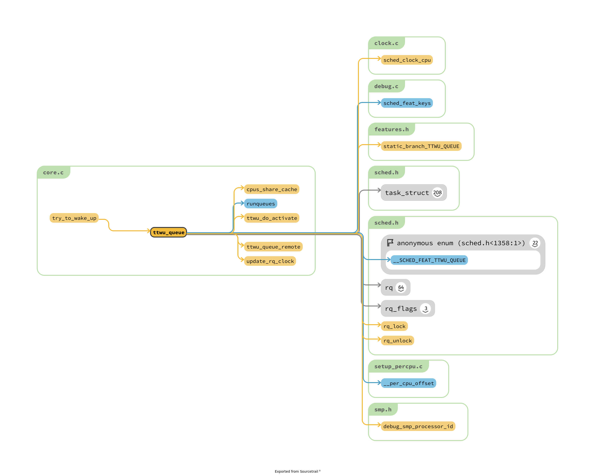
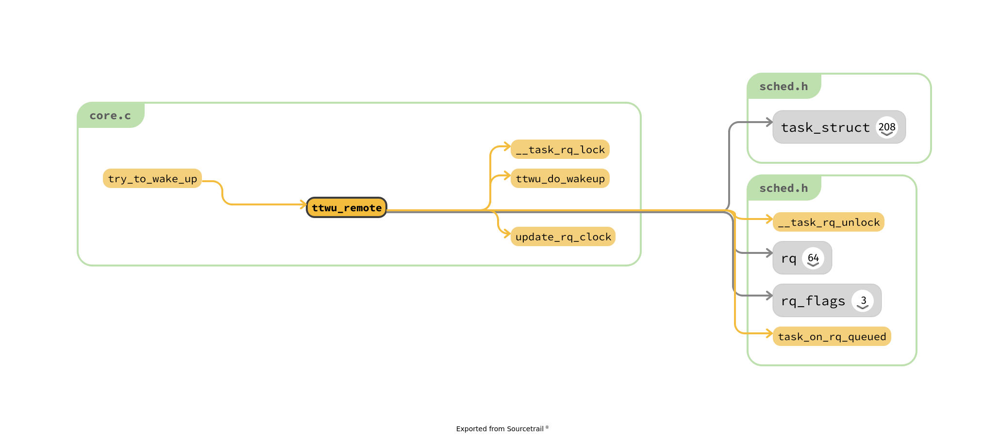
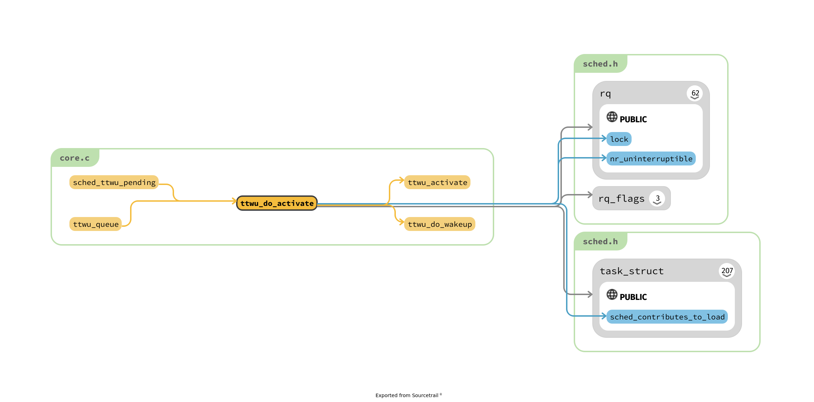
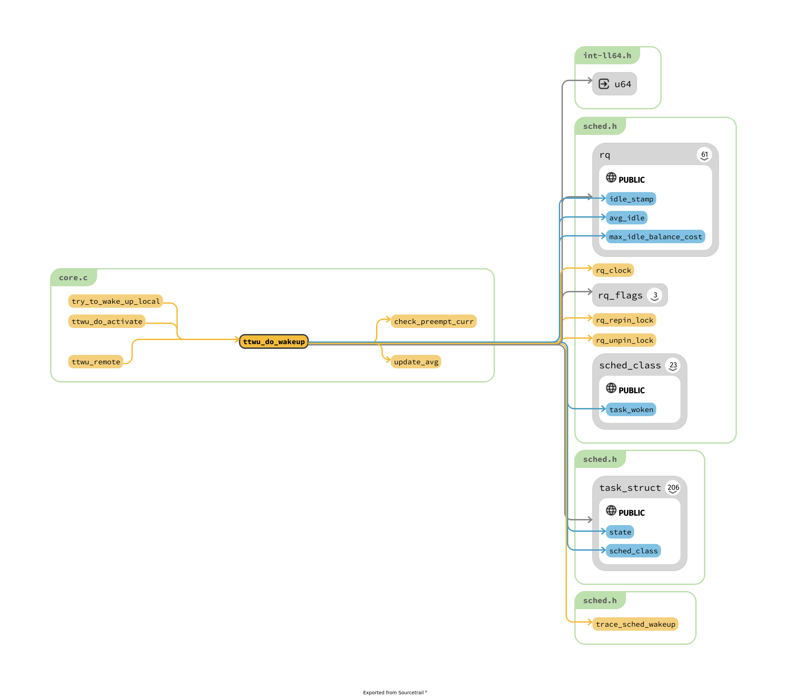
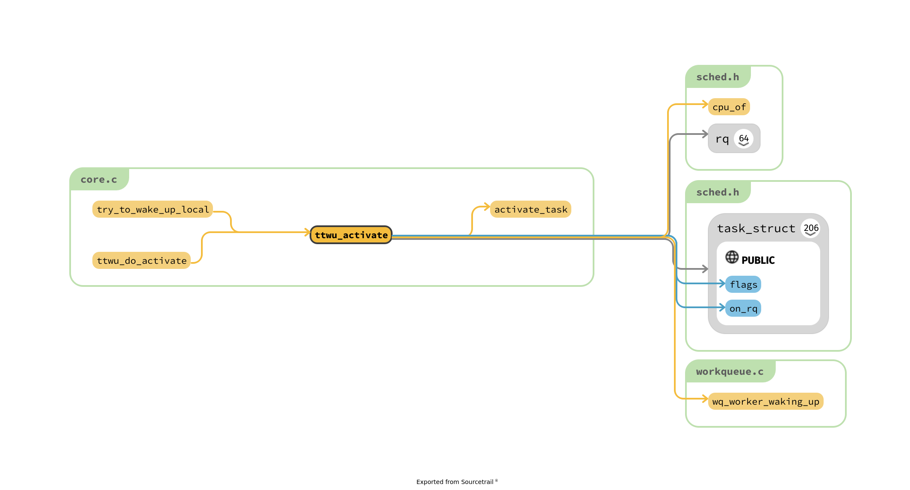
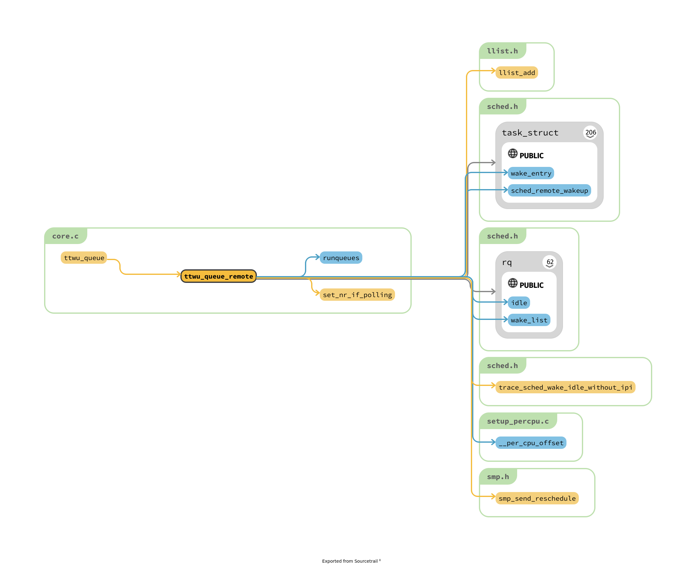
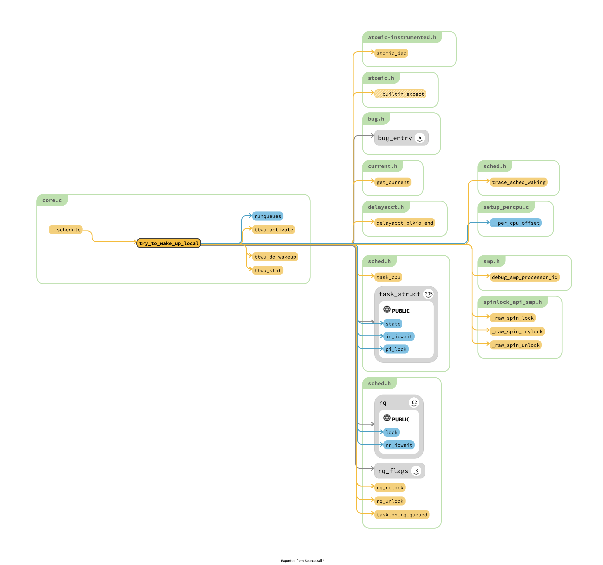
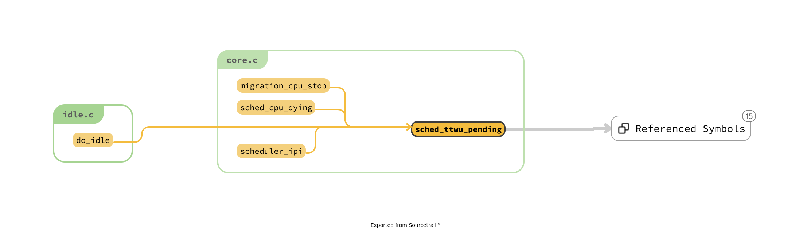

# more analyze on the kernel/sched/core.c

## preempt 实现的原理到底是什么 ?

## cgroup 机制

## hrtimer

## schedule() 实现的原理
```c
// TODO 这个有文档可以阅读呀!
asmlinkage __visible void __sched schedule(void)
{
	struct task_struct *tsk = current;

	sched_submit_work(tsk);
	do {
		preempt_disable();
		__schedule(false);
		sched_preempt_enable_no_resched();
	} while (need_resched());
}
EXPORT_SYMBOL(schedule);
```
1. 为什么关掉 preempt
2. 为什么可以使用 preempt_disable 关掉 ?
3. 为什么需要 sched_submit_work 将 blk 中间的工作进行缓冲一下 ?

## `__schedule` 函数的作用

```c
/*
 * __schedule() is the main scheduler function.
 *
 * The main means of driving the scheduler and thus entering this function are:
 *
 *   1. Explicit blocking: mutex, semaphore, waitqueue, etc.
 *
 *   2. TIF_NEED_RESCHED flag is checked on interrupt and userspace return
 *      paths. For example, see arch/x86/entry_64.S.
 *
 *      To drive preemption between tasks, the scheduler sets the flag in timer
 *      interrupt handler scheduler_tick().
 *
 *   3. Wakeups don't really cause entry into schedule(). They add a
 *      task to the run-queue and that's it.
 *
 *      Now, if the new task added to the run-queue preempts the current
 *      task, then the wakeup sets TIF_NEED_RESCHED and schedule() gets
 *      called on the nearest possible occasion:
 *
 *       - If the kernel is preemptible (CONFIG_PREEMPT=y):
 *
 *         - in syscall or exception context, at the next outmost
 *           preempt_enable(). (this might be as soon as the wake_up()'s
 *           spin_unlock()!)
 *
 *         - in IRQ context, return from interrupt-handler to
 *           preemptible context
 *
 *       - If the kernel is not preemptible (CONFIG_PREEMPT is not set)
 *         then at the next:
 *
 *          - cond_resched() call
 *          - explicit schedule() call
 *          - return from syscall or exception to user-space
 *          - return from interrupt-handler to user-space
 *
 * WARNING: must be called with preemption disabled!
 */
static void __sched notrace __schedule(bool preempt)
```
1. 不能理解为什么会有 preemptible 的配置 ? 参数 preempt 的影响是什么 ?
2. 设计到 PF_WQ_WORKER 的部分细节
3. balance_callback


## `sched_tick_*` 

为了处理一下 nohz 导致的问题

## context_switch() 实现的原理

```c
/*
 * context_switch - switch to the new MM and the new thread's register state.
 */
static __always_inline struct rq *
context_switch(struct rq *rq, struct task_struct *prev,
	       struct task_struct *next, struct rq_flags *rf)
```
1. 首先进行 MM 的切换，其中含有涉及到 tlb 之类的切换
> 不是很懂，为什么mm 相等的情况，没有单独分析
2. switch_to 进行真正的切换
  1. `__switch_to_asm` 利用汇编切换 stack 和 thread's register


## ttwu

wake_up_process

```c
/**
 * wake_up_process - Wake up a specific process
 * @p: The process to be woken up.
 *
 * Attempt to wake up the nominated process and move it to the set of runnable
 * processes.
 *
 * Return: 1 if the process was woken up, 0 if it was already running.
 *
 * This function executes a full memory barrier before accessing the task state.
 */
int wake_up_process(struct task_struct *p)
{
	return try_to_wake_up(p, TASK_NORMAL, 0);
}
EXPORT_SYMBOL(wake_up_process);

int wake_up_state(struct task_struct *p, unsigned int state)
{
	return try_to_wake_up(p, state, 0);
}

int default_wake_function(wait_queue_entry_t *curr, unsigned mode, int wake_flags,
			  void *key)
{
	return try_to_wake_up(curr->private, mode, wake_flags);
}
EXPORT_SYMBOL(default_wake_function);
```

三个简单的封装函数

```c
/*
 * Notes on Program-Order guarantees on SMP systems.
 *
 *  MIGRATION
 *
 * The basic program-order guarantee on SMP systems is that when a task [t]
 * migrates, all its activity on its old CPU [c0] happens-before any subsequent
 * execution on its new CPU [c1].
 *
 * For migration (of runnable tasks) this is provided by the following means:
 *
 *  A) UNLOCK of the rq(c0)->lock scheduling out task t
 *  B) migration for t is required to synchronize *both* rq(c0)->lock and
 *     rq(c1)->lock (if not at the same time, then in that order).
 *  C) LOCK of the rq(c1)->lock scheduling in task
 *
 * Release/acquire chaining guarantees that B happens after A and C after B.
 * Note: the CPU doing B need not be c0 or c1
 *
 * Example:
 *
 *   CPU0            CPU1            CPU2
 *
 *   LOCK rq(0)->lock
 *   sched-out X
 *   sched-in Y
 *   UNLOCK rq(0)->lock
 *
 *                                   LOCK rq(0)->lock // orders against CPU0
 *                                   dequeue X
 *                                   UNLOCK rq(0)->lock
 *
 *                                   LOCK rq(1)->lock
 *                                   enqueue X
 *                                   UNLOCK rq(1)->lock
 *
 *                   LOCK rq(1)->lock // orders against CPU2
 *                   sched-out Z
 *                   sched-in X
 *                   UNLOCK rq(1)->lock
 *
 *
 *  BLOCKING -- aka. SLEEP + WAKEUP
 *
 * For blocking we (obviously) need to provide the same guarantee as for
 * migration. However the means are completely different as there is no lock
 * chain to provide order. Instead we do:
 *
 *   1) smp_store_release(X->on_cpu, 0)
 *   2) smp_cond_load_acquire(!X->on_cpu)
 *
 * Example:
 *
 *   CPU0 (schedule)  CPU1 (try_to_wake_up) CPU2 (schedule)
 *
 *   LOCK rq(0)->lock LOCK X->pi_lock
 *   dequeue X
 *   sched-out X
 *   smp_store_release(X->on_cpu, 0);
 *
 *                    smp_cond_load_acquire(&X->on_cpu, !VAL);
 *                    X->state = WAKING
 *                    set_task_cpu(X,2)
 *
 *                    LOCK rq(2)->lock
 *                    enqueue X
 *                    X->state = RUNNING
 *                    UNLOCK rq(2)->lock
 *
 *                                          LOCK rq(2)->lock // orders against CPU1
 *                                          sched-out Z
 *                                          sched-in X
 *                                          UNLOCK rq(2)->lock
 *
 *                    UNLOCK X->pi_lock
 *   UNLOCK rq(0)->lock
 *
 *
 * However, for wakeups there is a second guarantee we must provide, namely we
 * must ensure that CONDITION=1 done by the caller can not be reordered with
 * accesses to the task state; see try_to_wake_up() and set_current_state().
 */

```
似乎，就上锁而言，wake up 需要保证的内容似乎稍微简单一点

1. set_current_state
2. 


```c
/**
 * try_to_wake_up - wake up a thread
 * @p: the thread to be awakened
 * @state: the mask of task states that can be woken
 * @wake_flags: wake modifier flags (WF_*)
 *
 * If (@state & @p->state) @p->state = TASK_RUNNING.
 *
 * If the task was not queued/runnable, also place it back on a runqueue.
 *
 * Atomic against schedule() which would dequeue a task, also see
 * set_current_state().
 *
 * This function executes a full memory barrier before accessing the task
 * state; see set_current_state().
 *
 * Return: %true if @p->state changes (an actual wakeup was done),
 *	   %false otherwise.
 */
static int
try_to_wake_up(struct task_struct *p, unsigned int state, int wake_flags)
{
	unsigned long flags;
	int cpu, success = 0;

	/*
	 * If we are going to wake up a thread waiting for CONDITION we
	 * need to ensure that CONDITION=1 done by the caller can not be
	 * reordered with p->state check below. This pairs with mb() in
	 * set_current_state() the waiting thread does.
	 */
	raw_spin_lock_irqsave(&p->pi_lock, flags);
	smp_mb__after_spinlock();
	if (!(p->state & state))
		goto out;

	trace_sched_waking(p);

	/* We're going to change ->state: */
	success = 1;
	cpu = task_cpu(p);

	/*
	 * Ensure we load p->on_rq _after_ p->state, otherwise it would
	 * be possible to, falsely, observe p->on_rq == 0 and get stuck
	 * in smp_cond_load_acquire() below.
	 *
	 * sched_ttwu_pending()			try_to_wake_up()
	 *   STORE p->on_rq = 1			  LOAD p->state
	 *   UNLOCK rq->lock
	 *
	 * __schedule() (switch to task 'p')
	 *   LOCK rq->lock			  smp_rmb();
	 *   smp_mb__after_spinlock();
	 *   UNLOCK rq->lock
	 *
	 * [task p]
	 *   STORE p->state = UNINTERRUPTIBLE	  LOAD p->on_rq
	 *
	 * Pairs with the LOCK+smp_mb__after_spinlock() on rq->lock in
	 * __schedule().  See the comment for smp_mb__after_spinlock().
	 */
	smp_rmb();
	if (p->on_rq && ttwu_remote(p, wake_flags))
		goto stat;

#ifdef CONFIG_SMP
	/*
	 * Ensure we load p->on_cpu _after_ p->on_rq, otherwise it would be
	 * possible to, falsely, observe p->on_cpu == 0.
	 *
	 * One must be running (->on_cpu == 1) in order to remove oneself
	 * from the runqueue.
	 *
	 * __schedule() (switch to task 'p')	try_to_wake_up()
	 *   STORE p->on_cpu = 1		  LOAD p->on_rq
	 *   UNLOCK rq->lock
	 *
	 * __schedule() (put 'p' to sleep)
	 *   LOCK rq->lock			  smp_rmb();
	 *   smp_mb__after_spinlock();
	 *   STORE p->on_rq = 0			  LOAD p->on_cpu
	 *
	 * Pairs with the LOCK+smp_mb__after_spinlock() on rq->lock in
	 * __schedule().  See the comment for smp_mb__after_spinlock().
	 */
	smp_rmb();

	/*
	 * If the owning (remote) CPU is still in the middle of schedule() with
	 * this task as prev, wait until its done referencing the task.
	 *
	 * Pairs with the smp_store_release() in finish_task().
	 *
	 * This ensures that tasks getting woken will be fully ordered against
	 * their previous state and preserve Program Order.
	 */
	smp_cond_load_acquire(&p->on_cpu, !VAL);

	p->sched_contributes_to_load = !!task_contributes_to_load(p);
	p->state = TASK_WAKING;

	if (p->in_iowait) {
		delayacct_blkio_end(p);
		atomic_dec(&task_rq(p)->nr_iowait);
	}

	cpu = select_task_rq(p, p->wake_cpu, SD_BALANCE_WAKE, wake_flags);
	if (task_cpu(p) != cpu) {
		wake_flags |= WF_MIGRATED;
		set_task_cpu(p, cpu);
	}

#else /* CONFIG_SMP */

	if (p->in_iowait) {
		delayacct_blkio_end(p);
		atomic_dec(&task_rq(p)->nr_iowait);
	}

#endif /* CONFIG_SMP */

	ttwu_queue(p, cpu, wake_flags);
stat:
	ttwu_stat(p, cpu, wake_flags);
out:
	raw_spin_unlock_irqrestore(&p->pi_lock, flags);

	return success;
}
```


## select_task_rq 和 set_task_cpu 看上去很简单呀！

两者都是调用了 `sched_class->select_task_rq` 维持生活的

set_task_cpu 会调用 set_task_rq进行一些设置的工作。

rq 和 cpu 在此处的含义有不同 ?
```c
/*
 * The caller (fork, wakeup) owns p->pi_lock, ->cpus_allowed is stable.
 */
static inline
int select_task_rq(struct task_struct *p, int cpu, int sd_flags, int wake_flags)
{
	lockdep_assert_held(&p->pi_lock);

	if (p->nr_cpus_allowed > 1)
		cpu = p->sched_class->select_task_rq(p, cpu, sd_flags, wake_flags);
	else
		cpu = cpumask_any(&p->cpus_allowed);

	/*
	 * In order not to call set_task_cpu() on a blocking task we need
	 * to rely on ttwu() to place the task on a valid ->cpus_allowed
	 * CPU.
	 *
	 * Since this is common to all placement strategies, this lives here.
	 *
	 * [ this allows ->select_task() to simply return task_cpu(p) and
	 *   not worry about this generic constraint ]
	 */
	if (unlikely(!is_cpu_allowed(p, cpu)))
		cpu = select_fallback_rq(task_cpu(p), p); // 稍微有点复杂

	return cpu;
}
```

> 核心业务交给了 sched_class 了

## smp_wmb() 是什么东西


## upadte_rq_clock

函数简单，但是 为什么是这种更新机制 ?

## try_to_wake_up 的辅助函数 `ttwu_*`
1. remote 的概念 ?

```c
static void ttwu_queue(struct task_struct *p, int cpu, int wake_flags)
{
	struct rq *rq = cpu_rq(cpu);
	struct rq_flags rf;

#if defined(CONFIG_SMP)
	if (sched_feat(TTWU_QUEUE) && !cpus_share_cache(smp_processor_id(), cpu)) {
		sched_clock_cpu(cpu); /* Sync clocks across CPUs */
		ttwu_queue_remote(p, cpu, wake_flags);
		return;
	}
#endif

	rq_lock(rq, &rf);
	update_rq_clock(rq);
	ttwu_do_activate(rq, p, wake_flags, &rf);
	rq_unlock(rq, &rf);
}
```

```c
/*
 * Called in case the task @p isn't fully descheduled from its runqueue,
 * in this case we must do a remote wakeup. Its a 'light' wakeup though,
 * since all we need to do is flip p->state to TASK_RUNNING, since
 * the task is still ->on_rq.
 */
static int ttwu_remote(struct task_struct *p, int wake_flags)
{
	struct rq_flags rf;
	struct rq *rq;
	int ret = 0;

	rq = __task_rq_lock(p, &rf);
	if (task_on_rq_queued(p)) {
		/* check_preempt_curr() may use rq clock */
		update_rq_clock(rq);
		ttwu_do_wakeup(rq, p, wake_flags, &rf);
		ret = 1;
	}
	__task_rq_unlock(rq, &rf);

	return ret;
}
```

activate_task : 既然就是一个加入到队列中间 ?
```c
void activate_task(struct rq *rq, struct task_struct *p, int flags)
{
	if (task_contributes_to_load(p))
		rq->nr_uninterruptible--;

	enqueue_task(rq, p, flags);
}
```

> 下面两个顶层函数





> 我们的核心函数 ?







1. try_to_wake_up 和 try_to_wake_up_local 的关系是什么 ?
2. remote wakeup 的含义是什么 ?

## sched_ttwu_pending

该函数似乎是将所有rq 中的所有的，wake_list

```c
void sched_ttwu_pending(void)
{
	struct rq *rq = this_rq();
	struct llist_node *llist = llist_del_all(&rq->wake_list);
	struct task_struct *p, *t;
	struct rq_flags rf;

	if (!llist)
		return;

	rq_lock_irqsave(rq, &rf);
	update_rq_clock(rq);

	llist_for_each_entry_safe(p, t, llist, wake_entry)
		ttwu_do_activate(rq, p, p->sched_remote_wakeup ? WF_MIGRATED : 0, &rf);

	rq_unlock_irqrestore(rq, &rf);
}
```



> @todo 分析其中的调用位置是什么 ?
