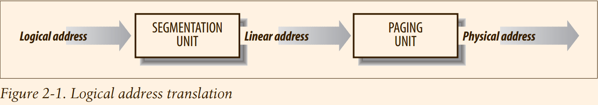
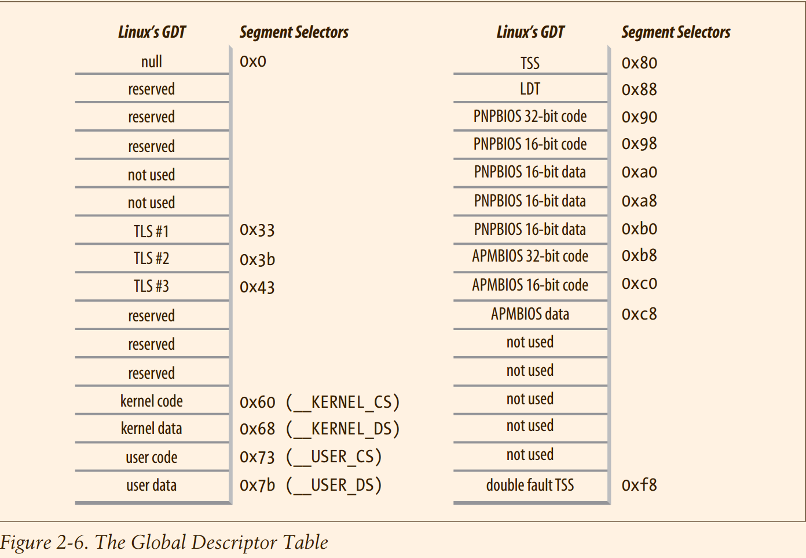
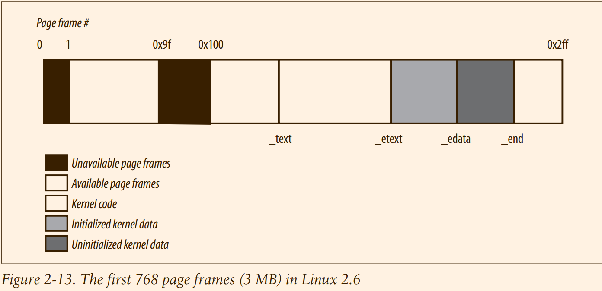

# Understand Linux Kernel : Memory Addressing


## keynote
1. page frame 可以自定义 cache management policy
2. kernel 被加载 0x00100000 的位置
3. 896MB 的原因 : 128M 用于 FixMapped Linear Addresses 以及 Linear Addresses of Noncontiguous Memory Areas(已经就是vmalloc吧!)

## 1 Memory Addresses

The Memory Management Unit (MMU) transforms a **logical address** into a **linear
address** by means of a hardware circuit called a segmentation unit; subsequently, a
second hardware circuit called a paging unit transforms the **linear address** into a
**physical address** (see Figure 2-1).



Because read or
write operations on a RAM chip must be performed serially, a hardware circuit called
a memory arbiter is inserted between the bus and every RAM chip. 
## 2 Segmentation in Hardware

#### 2.1 Segment Selectors and Segmentation Registers

> segment selector : cs ss ds

#### 2.2 Segment Descriptors
Usually only one GDT is defined, while each process is permitted to have its own LDT if
it needs to create additional segments besides those stored in the GDT. The address and
size of the GDT in main memory are contained in the gdtr control register, while the
address and size of the currently used LDT are contained in the ldtr control register.
> 一般只有一个gdt

There are several types of segments, and thus several types of Segment Descriptors.
The following list shows the types that are widely used in Linux.
- Code Segment Descriptor
- Data Segment Descriptor
- Task State Segment Descriptor (TSSD)

  Indicates that the Segment Descriptor refers to a Task State Segment (TSS)—
  that is, a segment used to save the contents of the processor registers (see the
  section “Task State Segment” in Chapter 3); it can appear only in the GDT. The
  corresponding Type field has the value 11 or 9, depending on whether the corresponding process is currently executing on a CPU. The S flag of such descriptors
  is set to 0.

- Local Descriptor Table Descriptor (LDTD)

  Indicates that the Segment Descriptor refers to a segment containing an LDT; it
  can appear only in the GDT. The corresponding Type field has the value 2. The S
  flag of such descriptors is set to 0. The next section shows how 80 × 86 processors are able to decide whether a segment descriptor is stored in the GDT or in
  the LDT of the process.

> 也就是 gdt 的 descriptor 不仅仅可以指向真正使用的代码段，数据段，也是可以指向表格的

#### 2.3 Fast Access to Segment Descriptors

> 就是将 segment descriptor 放到寄存器中间

#### 2.4 Segmentation Unit

> 说明基于 segment 的地址变换过程

## 3 Segmentation in Linux

However, Linux uses segmentation in a very limited way.
In fact, segmentation and paging are somewhat redundant, because both can be used
to separate the physical address spaces of processes:
**Segmentation can assign a differ ent linear address space to each process, while paging can map the same linear
address space into different physical address spaces.**

Linux prefers paging to segmentation for the following reasons:
1. Memory management is simpler when all processes use the same segment register values—that is, when they share the same set of linear addresses.
2. One of the design objectives of Linux is portability to a wide range of architectures; **RISC** architectures in particular have limited support for segmentation

**All Linux processes running in User Mode use the same pair of segments to address
instructions and data. These segments are called user code segment and user data segment, respectively. Similarly, all Linux processes running in Kernel Mode use the
same pair of segments to address instructions and data: they are called kernel code
segment and kernel data segment, respectively.**
> 这是内核唯一的使用方法

The corresponding Segment Selectors are defined by the macros `__USER_CS`, `__USER_DS`,
`__KERNEL_CS`, and `__KERNEL_DS`, respectively. To address the kernel code segment, for
instance, the kernel just loads the value yielded by the `__KERNEL_CS` macro into the `cs`
segmentation register.

arch/x86/include/asm/segment.h
```c
/*
 * Segment selector values corresponding to the above entries:
 *
 * Note, selectors also need to have a correct RPL,
 * expressed with the +3 value for user-space selectors:
 */
#define __KERNEL32_CS			(GDT_ENTRY_KERNEL32_CS*8)
#define __KERNEL_CS			(GDT_ENTRY_KERNEL_CS*8)
#define __KERNEL_DS			(GDT_ENTRY_KERNEL_DS*8)
#define __USER32_CS			(GDT_ENTRY_DEFAULT_USER32_CS*8 + 3)
#define __USER_DS			(GDT_ENTRY_DEFAULT_USER_DS*8 + 3)
#define __USER32_DS			__USER_DS
#define __USER_CS			(GDT_ENTRY_DEFAULT_USER_CS*8 + 3)
#define __CPUNODE_SEG			(GDT_ENTRY_CPUNODE*8 + 3)
```

> `__USER_CS` 之类 `+3` 的操作只是表示其发特权级，所有的都`*8` 表示，TI + RPL 被清空


| Segment      | Base       | G | Limit   | S | Type | DPL | D/B | P |
|--------------|------------|---|---------|---|------|-----|-----|---|
| user    code | 0x00000000 | 1 | 0xfffff | 1 | 10   | 3   | 1   | 1 |
| user    data | 0x00000000 | 1 | 0xfffff | 1 | 2    | 3   | 1   | 1 |
| kernel  code | 0x00000000 | 1 | 0xfffff | 1 | 10   | 0   | 1   | 1 |
| kernel  data | 0x00000000 | 1 | 0xfffff | 1 | 2    | 0   | 1   | 1 |

Notice that the linear addresses associated with such segments all start at 0 and reach
the addressing limit of 232 –1. This means that all processes, either in User Mode or
in Kernel Mode, may use the same logical addresses.

Another important consequence of having all segments start at 0x00000000 is that in
Linux, logical addresses coincide with linear addresses; that is, the value of the Offset field of a logical address always coincides with the value of the corresponding linear address.
> 从上面的表格得出结论: kernel user 映射地址相同，logical 和 linear address 的地址相同

#### 3.1 The Linux GDT

In uniprocessor systems there is only one GDT, while in multiprocessor systems
there is one GDT for every CPU in the system. All GDTs are stored in the `cpu_gdt_table` array,
while the addresses and sizes of the GDTs (used when initializing the
gdtr registers) are stored in the `cpu_gdt_descr` array. 
> 实际上的操作增加一个 page 的封装

arch/x86/kernel/cpu/common.c
```c
/* Provide the original GDT */
static inline struct desc_struct *get_cpu_gdt_rw(unsigned int cpu)
{
	return per_cpu(gdt_page, cpu).gdt;
}

/* Provide the current original GDT */
static inline struct desc_struct *get_current_gdt_rw(void)
{
	return this_cpu_ptr(&gdt_page)->gdt;
}

struct gdt_page {
	struct desc_struct gdt[GDT_ENTRIES];
} __attribute__((aligned(PAGE_SIZE)));

DEFINE_PER_CPU_PAGE_ALIGNED(struct gdt_page, gdt_page) = { .gdt = {
#ifdef CONFIG_X86_64
	/*
	 * We need valid kernel segments for data and code in long mode too
	 * IRET will check the segment types  kkeil 2000/10/28
	 * Also sysret mandates a special GDT layout
	 *
	 * TLS descriptors are currently at a different place compared to i386.
	 * Hopefully nobody expects them at a fixed place (Wine?)
	 */
	[GDT_ENTRY_KERNEL32_CS]		= GDT_ENTRY_INIT(0xc09b, 0, 0xfffff),
	[GDT_ENTRY_KERNEL_CS]		= GDT_ENTRY_INIT(0xa09b, 0, 0xfffff),
	[GDT_ENTRY_KERNEL_DS]		= GDT_ENTRY_INIT(0xc093, 0, 0xfffff),
	[GDT_ENTRY_DEFAULT_USER32_CS]	= GDT_ENTRY_INIT(0xc0fb, 0, 0xfffff),
	[GDT_ENTRY_DEFAULT_USER_DS]	= GDT_ENTRY_INIT(0xc0f3, 0, 0xfffff),
	[GDT_ENTRY_DEFAULT_USER_CS]	= GDT_ENTRY_INIT(0xa0fb, 0, 0xfffff),
#else
```
> @todo 没有看到 TSS

As stated earlier, there is a copy of the GDT for each processor in the system. All
copies of the GDT store identical entries, except for a few cases.



The 18 segment descriptors included in each GDT point to the following segments:
- Four user and kernel code and data segments (see previous section).
- A Task State Segment (TSS), **different for each processor in the system**. The linear address space corresponding to a TSS is a small subset of the linear address
space corresponding to the kernel data segment. The Task State Segments are
sequentially stored in the `init_tss` array; in particular, the Base field of the TSS
descriptor for the nth CPU points to the nth component of the init_tss array.
The G (granularity) flag is cleared, while the Limit field is set to 0xeb, because the
TSS segment is 236 bytes long. The Type field is set to 9 or 11 (available 32-bit
TSS), and the DPL is set to 0, because processes in User Mode are not allowed to
access TSS segments. You will find details on how Linux uses TSSs in the section “Task State Segment” in Chapter 3.
- A segment including the default Local Descriptor Table (LDT), usually shared by
all processes (see the next section).
- Three **Thread-Local Storage** (TLS) segments: this is a mechanism that allows
multithreaded applications to make use of up to three segments containing data
local to each thread. The `set_thread_area()` and `get_thread_area()` system calls,
respectively, create and release a TLS segment for the executing process.
- Three segments related to Advanced Power Management (APM): the BIOS code
makes use of segments, so when the Linux APM driver invokes BIOS functions to
get or set the status of APM devices, it may use custom code and data segments.
- Five segments related to Plug and Play (PnP) BIOS services. As in the previous
case, the BIOS code makes use of segments, so when the Linux PnP driver
invokes BIOS functions to detect the resources used by PnP devices, it may use
custom code and data segments.
- A special TSS segment used by the kernel to handle “Double fault” exceptions
(see “Exceptions” in Chapter 4).


#### 3.2 The Linux LDTs
Most Linux User Mode applications do not make use of a Local Descriptor Table,
thus the kernel defines a default LDT to be shared by most processes. The default
Local Descriptor Table is stored in the `default_ldt` array.
> @todo default LDT 如今是什么样子的，反正 default_ldt array 是没有了的 ? 

It includes five entries, but
only two of them are effectively used by the kernel: a call gate for iBCS executables,
and a call gate for Solaris/x86 executables (see the section “Execution Domains” in
Chapter 20). Call gates are a mechanism provided by 80x86 microprocessors to
*change the privilege level of the CPU while invoking a predefined function*; as we
won’t discuss them further, you should consult the Intel documentation for more
details.
> @todo call gate 只是一个 segment descriptor，通过调用 predefine function, 也就是
> call gate 上实现操作的方法

In some cases, however, processes may require to set up their own LDT. This turns
out to be useful to applications (such as Wine) that execute segment-oriented
Microsoft Windows applications. The modify_ldt() system call allows a process to
do this.

Any custom LDT created by modify_ldt() also requires its own segment. When a
processor starts executing a process having a custom LDT, the LDT entry in the
CPU-specific copy of the GDT is changed accordingly.
> @todo Man modify_ldt(2) 很有意思的


## 4 Paging in Hardware

#### 4.1 Regular Paging

The entries of Page Directories and Page Tables have the same structure. Each entry
includes the following fields:
- Present flag

  If it is set, the referred-to page (or Page Table) is contained in main memory; if
  the flag is 0, the page is not contained in main memory and the remaining entry
  bits may be used by the operating system for its own purposes. If the entry of a
  Page Table or Page Directory needed to perform an address translation has the
  Present flag cleared, the paging unit stores the linear address in a control register
  named cr2 and generates exception 14: the Page Fault exception. (We will see in
  Chapter 17 how Linux uses this field.)
  Field containing the 20 most significant bits of a page frame physical address
  Because each page frame has a 4-KB capacity, its physical address must be a multiple of 4096, so the 12 least significant bits of the physical address are always
  equal to 0. If the field refers to a Page Directory, the page frame contains a Page
  Table; if it refers to a Page Table, the page frame contains a page of data.

- Accessed flag

  **Set each time the paging unit addresses the corresponding page frame. This flag
  may be used by the operating system when selecting pages to be swapped out.**
  The paging unit never resets this flag; this must be done by the operating system.

- Dirty flag

  Applies only to the Page Table entries. **It is set each time a write operation is performed on the page frame. As with the Accessed flag, Dirty may be used by the
  operating system when selecting pages to be swapped out.** The paging unit never
  resets this flag; this must be done by the operating system.

- Read/Write flag

  Contains the access right (Read/Write or Read) of the page or of the Page Table
  (see the section “Hardware Protection Scheme” later in this chapter).

- **User/Supervisor flag**

  Contains the privilege level required to access the page or Page Table (see the
  later section “Hardware Protection Scheme”).

- **PCD and PWT flags**

  Controls the way the page or Page Table is handled by the hardware cache (see
  the section “Hardware Cache” later in this chapter).

- **Page Size flag**

  Applies only to Page Directory entries. If it is set, the entry refers to a 2 MB– or 4
  MB–long page frame (see the following sections).

- **Global flag**

  Applies only to Page Table entries. This flag was introduced in the Pentium Pro
  to prevent frequently used pages from being flushed from the TLB cache (see the
  section “Translation Lookaside Buffers (TLB)” later in this chapter). It works
  only if the Page Global Enable (PGE) flag of register cr4 is set.

> @todo 其实除了 present flag 可以理解(毕竟ucore 中间处理过)，其余的都非常的迷惑呀 !

#### 4.2 Extended Paging

As mentioned in the previous section, extended paging is enabled by setting the Page
Size flag of a Page Directory entry. In this case, the paging unit divides the 32 bits of
a linear address into two fields:
- Directory : The most significant 10 bits
- Offset : The remaining 22 bits

Page Directory entries for extended paging are the same as for normal paging, except
that:
- The Page Size flag must be set.
- Only the 10 most significant bits of the 20-bit physical address field are significant. This is because each physical address is aligned on a 4-MB boundary, so
the 22 least significant bits of the address are 0.

Extended paging coexists with regular paging; it is enabled by setting the `PSE` flag of
the cr4 processor register.

> @todo 我想知道这是不是 huge page 的内容啊

#### 4.3 Hardware Protection Scheme

The paging unit uses a different protection scheme from the segmentation unit.
While 80 × 86 processors allow four possible privilege levels to a segment, only two
privilege levels are associated with pages and Page Tables, because privileges are controlled by the User/Supervisor flag mentioned in the earlier section “Regular Paging.”
When this flag is 0, the page can be addressed only when the CPL is less than 3 (this
means, for Linux, when the processor is in Kernel Mode). When the flag is 1, the
page can always be addressed.

**Furthermore**, instead of the three types of access rights (Read, Write, and Execute)
associated with segments, only two types of access rights (Read and Write) are associated with pages. If the Read/Write flag of a Page Directory or Page Table entry is
equal to 0, the corresponding Page Table or page can only be read; otherwise it can
be read and written
> @question 所以其实安全检查双重的 segment 和 page 都使用 ?


#### 4.4 An Example of Regular Paging
> skip 我需要的是 memory adderss layout 呀 !

#### 4.5 The Physical Address Extension (PAE) Paging Mechanism
In theory, up to 4 GB of RAM could be installed
on such systems; **in practice, due to the linear address space requirements of User
Mode processes, the kernel cannot directly address more than 1 GB of RAM**, as we
will see in the later section “Paging in Linux.”

With the Pentium Pro processor, Intel introduced a mechanism called **Physical Address Extension** (PAE).

PAE is activated by setting the Physical Address Extension (PAE) flag in the **cr4** control register.
The Page Size (PS) flag in the page directory entry enables large page
sizes (2 MB when PAE is enabled).

Intel has changed the paging mechanism in order to support PAE.
- The 64 GB of RAM are split into 224 distinct page frames, and the physical
address field of Page Table entries has been expanded from 20 to 24 bits.
Because a PAE Page Table entry must include the 12 flag bits (described in the
earlier section “Regular Paging”) and the 24 physical address bits, for a grand
total of 36, the Page Table entry size has been doubled from 32 bits to 64 bits. As
a result, a 4-KB PAE Page Table includes 512 entries instead of 1,024.
- A new level of Page Table called the Page Directory Pointer Table (PDPT) consisting of four 64-bit entries has been introduced.
- The `cr3` control register contains a 27-bit Page Directory Pointer Table base
address field. Because PDPTs are stored in the first 4 GB of RAM and aligned to
a multiple of 32 bytes (25), 27 bits are sufficient to represent the base address of
such tables.
- When mapping linear addresses to 4 KB pages (PS flag cleared in Page Directory
entry), the 32 bits of a linear address are interpreted in the following way:
  * cr3 : Points to a PDPT
  * bits 31–30 : Point to 1 of 4 possible entries in PDPT
  * bits 29–21 : Point to 1 of 512 possible entries in Page Directory
  * bits 20–12 : Point to 1 of 512 possible entries in Page Table
  * bits 11–0  : Offset of 4-KB page

- When mapping linear addresses to 2-MB pages (PS flag set in Page Directory
entry), the 32 bits of a linear address are interpreted in the following way:
  * cr3        : Points to a PDPT
  * bits 31–30 : Point to 1 of 4 possible entries in PDPT
  * bits 29–21 : Point to 1 of 512 possible entries in Page Directory
  * bits 20–0  : Offset of 2-MB page

Furthermore, only the kernel can modify the page tables of the processes, thus a process running in User Mode cannot use
a physical address space larger than 4 GB. On the other hand, PAE allows the kernel
to exploit up to 64 GB of RAM, and thus to increase significantly the number of processes in the system.
> 虽然 32bit 系统上指针不能访问超过 32bit 的虚拟地址空间，但是完全不妨碍将更加高的物理内存映射到用户的地址空间中间。
> 所以，用户 process 的数量可以增加很多。


#### 4.6 Paging for 64-bit Architectures
As we will see in the section “Paging in Linux” later in this chapter, Linux succeeds
in providing a common paging model that fits most of the supported hardware paging systems.
> 就是说明了一下为什么 64bit 需要更多级别

#### 4.7 Hardware Cache
The `CD` flag of the `cr0` processor register is used to enable or disable the cache circuitry.
The `NW` flag, in the same register, specifies whether the write-through or the
write-back strategy is used for the caches.

Another interesting feature of the Pentium cache is that **it lets an operating system
associate a different cache management policy with each page frame.**
For this purpose, each Page Directory and each Page Table entry includes two flags: PCD (**Page Cache Disable**),
which specifies whether the cache must be enabled or disabled while
accessing data included in the page frame; and PWT (**Page Write-Through**), which
specifies whether the write-back or the write-through strategy must be applied while
writing data into the page frame. Linux clears the PCD and PWT flags of all Page Directory and Page Table entries; as a result, caching is enabled for all page frames, and
the write-back strategy is always adopted for writing.

#### 4.8 Translation Lookaside Buffers (TLB)
In a multiprocessor system, each CPU has its own TLB, called the local TLB of the
CPU.
When the cr3 control register of a CPU is modified, the hardware automatically

invalidates all entries of the local TLB, because a new set of page tables is in use and
the TLBs are pointing to old data.
> 非常科学，当切换 mm_struct之后，那么所有的映射都会被切换。
> @todo 切换进程之后，cache 需要被切换吗 ?

## 5 Paging in Linux
> skip easy

#### 5.1 The Linear Address Fields
> skip easy

#### 5.2 Page Table Handling
> skip easy : 这么多的函数最后估计都是在 memory.c 中间使用吧，或者 ioremap.c

#### 5.3 Physical Memory Layout
During the initialization phase the kernel must build a physical addresses map that
specifies which physical address ranges are usable by the kernel and which are
unavailable (either because they map hardware devices’ I/O shared memory or
because the corresponding page frames contain BIOS data).
> @todo numa 会导致空洞吗 ?

The kernel considers the following page frames as reserved:
- Those falling in the unavailable physical address ranges
- Those containing the kernel’s code and initialized data structures

As a general rule, the Linux kernel is installed in RAM starting from the physical
address `0x00100000`—i.e., from the second megabyte. The total number of page
rames required depends on how the kernel is configured. A typical configuration
yields a kernel that can be loaded in less than 3 MB of RAM.

Why isn’t the kernel loaded starting with the first available megabyte of RAM? Well,
the PC architecture has several peculiarities that must be taken into account. For
example:
- Page frame 0 is used by BIOS to store the system hardware configuration
detected during the Power-On Self-Test (POST); the BIOS of many laptops,
moreover, writes data on this page frame even after the system is initialized.
- Physical addresses ranging from 0x000a0000 to 0x000fffff are usually reserved to
BIOS routines and to map the internal memory of ISA graphics cards. This area
is the well-known hole from **640 KB** to **1 MB** in all IBM-compatible PCs: the
physical addresses exist but they are reserved, and the corresponding page
frames cannot be used by the operating system.
- Additional page frames within the first megabyte may be reserved by specific
computer models. For example, the IBM ThinkPad maps the 0xa0 page frame
into the 0x9f one.
> 640KB to 1 MB 就是 a0000 到 100000
> 也就是 0x9f 到 0x100 的 page frame

> 其实我关心的问题 :
>  1. ram memory 也是被 resources.c 管理的吗 ?
>  2. io 映射的各种挖洞都是如何规定的，如何处理 ?
>  3. config spare memory
> 
> 
> 而且这是只是说明了 0 ~ 1M 的空间不可使用

In the early stage of the boot sequence (see Appendix A), the kernel queries the BIOS
and learns the size of the physical memory. In recent computers, the kernel also
invokes a BIOS procedure to build a list of physical address ranges and their corresponding memory types.
> @todo 探测内存是不是和 创建 resource.c 放在一起的 ?

Later, the kernel executes the `machine_specific_memory_setup()` function, which
builds the physical addresses map (see Table 2-9 for an example). Of course, the kernel builds this table on the basis of the BIOS list, if this is available;
otherwise the kernel builds the table following the conservative default setup: all page frames with
numbers from **0x9f** (`LOWMEMSIZE()`) to **0x100** (`HIGH_MEMORY`) are marked as reserved.

Table 2-9. Example of BIOS-provided physical addresses map

| Start      | End        | Type      |
|------------|------------|-----------|
| 0x00000000 | 0x0009ffff | Usable
| 0x000f0000 | 0x000fffff | Reserved // 这就是所说的 0x9f 到 0x100 被 reserved
| 0x00100000 | 0x07feffff | Usable
| 0x07ff0000 | 0x07ff2fff | ACPI data
| 0x07ff3000 | 0x07ffffff | ACPI NVS
| 0xffff0000 | 0xffffffff | Reserved


```c
/*
 * The platform setup functions are preset with the default functions
 * for standard PC hardware.
 */
struct x86_init_ops x86_init __initdata = {

	.resources = {
		.probe_roms		= probe_roms,
		.reserve_resources	= reserve_standard_io_resources,
		.memory_setup		= e820__memory_setup_default,
	},
```

The kernel might not see all physical memory reported by the BIOS: for instance, the
kernel can address only 4 GB of RAM if it has not been compiled with PAE support,
even if a larger amount of physical memory is actually available. The setup_memory( )
function is invoked right after machine_specific_memory_setup(): it analyzes the table
of physical memory regions and initializes a few variables that describe the kernel’s
physical memory layout. These variables are shown in Table 2-10.

Table 2-10. Variables describing the kernel’s physical memory layout
| Variable name   | Description                                                                           | 
|-----------------|---------------------------------------------------------------------------------------|
| num_physpages   | Page frame number of the highest usable page frame
| totalram_pages  | Total number of usable page frames
| min_low_pfn     | Page frame number of the first usable page frame after the kernel image in RAM
| max_pfn Page    | frame number of the last usable page frame
| max_low_pfn     | Page frame number of the last page frame directly mapped by the kernel (low memory)
| totalhigh_pages | Total number of page frames not directly mapped by the kernel (high memory)
| highstart_pfn   | Page frame number of the first page frame not directly mapped by the kernel
| highend_pfn     | Page frame number of the last page frame not directly mapped by the kernel


> @question 总体来说，上面所有的内容并不是很难理解，就是挖了一个洞用于iomap
> 但是，这个图中间 `_text` 难道不是应该正好放在 0x100 的后面 

#### 5.4 Process Page Tables
The linear address space of a process is divided into two parts:
- Linear addresses from 0x00000000 to 0xbfffffff can be addressed when the process runs in either User or Kernel Mode.
- Linear addresses from 0xc0000000 to 0xffffffff can be addressed only when the process runs in Kernel Mode.

> 即使是虚拟地址，内核态和用户态也是区分开来的

#### 5.5 Kernel Page Tables

We explain how the kernel ensures that changes to the master kernel Page Global
Directory are **propagated** to the Page Global Directories that are actually used by
processes in the section “Linear Addresses of Noncontiguous Memory Areas” in
Chapter 8.
> @todo 对的啊，当内核为了 ioremap 或者 vmalloc 改变内核映射的时候，那么那些 process 如何处理 ?

* ***Provisional kernel Page Tables***

A provisional Page Global Directory is initialized statically during kernel compilation,
while the provisional Page Tables are initialized by the `startup_32()` assembly
language function defined in `arch/i386/kernel/head.S`. We won’t bother mentioning
the Page Upper Directories and Page Middle Directories anymore, because they are
equated to Page Global Directory entries. **PAE support is not enabled at this stage.**
The provisional Page Global Directory is contained in the `swapper_pg_dir` variable.
The provisional Page Tables are stored starting from `pg0`, right after the end of the
kernel’s uninitialized data segments (symbol `_end` in Figure 2-13). For the sake of
simplicity, let’s assume that the kernel’s segments, the provisional Page Tables, and
the 128 KB memory area fit in the first 8 MB of RAM. In order to map 8 MB of RAM,
two Page Tables are required.

The Kernel creates the desired mapping by filling all the `swapper_pg_dir` entries with
zeroes, except for entries 0, 1, 0x300 (decimal 768), and 0x301 (decimal 769); the latter two entries span all linear addresses between 0xc0000000 and 0xc07fffff. The 0,
1, 0x300, and 0x301 entries are initialized as follows:
- The address field of entries 0 and 0x300 is set to the physical address of pg0,
while the address field of entries 1 and 0x301 is set to the physical address of the
page frame following pg0.
- The Present, Read/Write, and User/Supervisor flags are set in all four entries.
- The Accessed, Dirty, PCD, PWD, and Page Size flags are cleared in all four entries.

The `startup_32()` assembly language function also enables the paging unit. This is
achieved by loading the physical address of swapper_pg_dir into the cr3 control register and by setting the PG flag of the cr0 control register, as shown in the following
equivalent code fragment:
    movl $swapper_pg_dir-0xc0000000,%eax
    movl %eax,%cr3 /* set the page table pointer.. */
    movl %cr0,%eax
    orl $0x80000000,%eax
    movl %eax,%cr0 /* ..and set paging (PG) bit */

arch/x86/kernel/head_64.S

> swapper_pg_dir 的内容应该就是下面这一段，但是似乎我已经看不懂了!
```c
#if defined(CONFIG_XEN_PV) || defined(CONFIG_PVH)
SYM_DATA_START_PTI_ALIGNED(init_top_pgt)
	.quad   level3_ident_pgt - __START_KERNEL_map + _KERNPG_TABLE_NOENC
	.org    init_top_pgt + L4_PAGE_OFFSET*8, 0
	.quad   level3_ident_pgt - __START_KERNEL_map + _KERNPG_TABLE_NOENC
	.org    init_top_pgt + L4_START_KERNEL*8, 0
	/* (2^48-(2*1024*1024*1024))/(2^39) = 511 */
	.quad   level3_kernel_pgt - __START_KERNEL_map + _PAGE_TABLE_NOENC
	.fill	PTI_USER_PGD_FILL,8,0
SYM_DATA_END(init_top_pgt)

SYM_DATA_START_PAGE_ALIGNED(level3_ident_pgt)
	.quad	level2_ident_pgt - __START_KERNEL_map + _KERNPG_TABLE_NOENC
	.fill	511, 8, 0
SYM_DATA_END(level3_ident_pgt)
SYM_DATA_START_PAGE_ALIGNED(level2_ident_pgt)
	/*
	 * Since I easily can, map the first 1G.
	 * Don't set NX because code runs from these pages.
	 *
	 * Note: This sets _PAGE_GLOBAL despite whether
	 * the CPU supports it or it is enabled.  But,
	 * the CPU should ignore the bit.
	 */
	PMDS(0, __PAGE_KERNEL_IDENT_LARGE_EXEC, PTRS_PER_PMD)
SYM_DATA_END(level2_ident_pgt)
#else
SYM_DATA_START_PTI_ALIGNED(init_top_pgt)
	.fill	512,8,0
	.fill	PTI_USER_PGD_FILL,8,0
SYM_DATA_END(init_top_pgt)
#endif
```
> @todo 这些描述的内容真的是无比简单，但是 amd64 到底是如何工作的 ?

* ***Final kernel Page Table when RAM size is less than 896 MB***

The highest 128 MB of linear addresses are left available for several kinds of mappings
(see sections “FixMapped Linear Addresses” later in this chapter and “Linear Addresses of Noncontiguous Memory Areas” in
Chapter 8). The kernel address space left for mapping the RAM is thus 1 GB – 128 MB = 896 MB.
> 原来如此 !

The final mapping provided by the kernel page tables must transform linear
addresses starting from `0xc0000000` into physical addresses starting from 0.
The `_pa` macro is used to convert a linear address starting from `PAGE_OFFSET` to the
corresponding physical address, while the `_va` macro does the reverse.

The master kernel Page Global Directory is still stored in `swapper_pg_dir`.
It is initialized by the `paging_init()` function, which does the following:
1. Invokes `pagetable_init()` to set up the Page Table entries properly.
2. Writes the physical address of `swapper_pg_dir` in the cr3 control register.
3. If the CPU supports PAE and if the kernel is compiled with PAE support, sets the PAE flag in the cr4 control register.
4. Invokes `_flush_tlb_all()` to invalidate all TLB entries.
> @todo 好吧，这一部分我还是没有见过的

The swapper_pg_dir Page Global Directory is reinitialized by a cycle equivalent to the
following:
```c
  pgd = swapper_pg_dir + pgd_index(PAGE_OFFSET); /* 768 */
  phys_addr = 0x00000000;
  while (phys_addr < (max_low_pfn * PAGE_SIZE)) {
    pmd = one_md_table_init(pgd); /* returns pgd itself */
    set_pmd(pmd, _ _pmd(phys_addr | pgprot_val(_ _pgprot(0x1e3))));
    /* 0x1e3 == Present, Accessed, Dirty, Read/Write,
    Page Size, Global */
    phys_addr += PTRS_PER_PTE * PAGE_SIZE; /* 0x400000 */
    ++pgd;
  }
```
We assume that the CPU is a recent 80 × 86 microprocessor supporting 4 MB pages
and “global” TLB entries. Notice that the User/Supervisor flags in all Page Global
Directory entries referencing linear addresses above 0xc0000000 are cleared, thus
denying processes in User Mode access to the kernel address space. Notice also that
the Page Size flag is set so that the kernel can address the RAM by making use of
large pages (see the section “Extended Paging” earlier in this chapter).

The identity mapping of the first megabytes of physical memory (8 MB in our example) built by the startup_32() function is required to complete the initialization phase
of the kernel. When this mapping is no longer necessary, the kernel clears the corresponding page table entries by invoking the zap_low_mappings() function.

Actually, this description does not state the whole truth. As we’ll see in the later section “Fix-Mapped Linear Addresses,” the kernel also adjusts the entries of Page
Tables corresponding to the “fix-mapped linear addresses.”
> 都很有道理，但是实际上只对于 x64 有兴趣


* ***Final kernel Page Table when RAM size is between 896 MB and 4096 MB***

* ***Final kernel Page Table when RAM size is more than 4096 MB***

Let’s now consider kernel Page Table initialization for computers with more than
4 GB; more precisely, we deal with cases in which the following happens:
- The CPU model supports Physical Address Extension (PAE).
- The amount of RAM is larger than 4 GB.
- The kernel is compiled with PAE support.

Although PAE handles 36-bit physical addresses, linear addresses are still 32-bit
addresses. As in the previous case, Linux maps a 896-MB RAM window into the kernel linear address space; the remaining RAM is left unmapped and handled by
dynamic remapping, as described in Chapter 8. The main difference with the previ-
ous case is that a three-level paging model is used, so the Page Global Directory is
initialized by a cycle equivalent to the following:

> skip about half a page : 应该没有什么神奇的

#### 5.6 Fix-Mapped Linear Addresses

Basically, a fix-mapped linear address is a constant linear address like `0xffffc000`
whose corresponding physical address does not have to be the linear address minus
`0xc000000`, but rather a physical address set in an arbitrary way.
Thus, each fixmapped linear address maps one page frame of the physical memory. As we’ll see in later chapters,
**the kernel uses fix-mapped linear addresses instead of pointer variables that never change their value.**


Each fix-mapped linear address is represented by a small integer index defined in the
`enum fixed_addresses` data structure:
```c
/*
 * Here we define all the compile-time 'special' virtual
 * addresses. The point is to have a constant address at
 * compile time, but to set the physical address only
 * in the boot process.
 * for x86_32: We allocate these special addresses
 * from the end of virtual memory (0xfffff000) backwards.
 * Also this lets us do fail-safe vmalloc(), we
 * can guarantee that these special addresses and
 * vmalloc()-ed addresses never overlap.
 *
 * These 'compile-time allocated' memory buffers are
 * fixed-size 4k pages (or larger if used with an increment
 * higher than 1). Use set_fixmap(idx,phys) to associate
 * physical memory with fixmap indices.
 *
 * TLB entries of such buffers will not be flushed across
 * task switches.
 */
enum fixed_addresses {
#ifdef CONFIG_X86_32
	FIX_HOLE,
#else
#ifdef CONFIG_X86_VSYSCALL_EMULATION
	VSYSCALL_PAGE = (FIXADDR_TOP - VSYSCALL_ADDR) >> PAGE_SHIFT,
#endif
#endif
	FIX_DBGP_BASE,
	FIX_EARLYCON_MEM_BASE,
#ifdef CONFIG_PROVIDE_OHCI1394_DMA_INIT
	FIX_OHCI1394_BASE,
#endif
#ifdef CONFIG_X86_LOCAL_APIC
	FIX_APIC_BASE,	/* local (CPU) APIC) -- required for SMP or not */
#endif
#ifdef CONFIG_X86_IO_APIC
	FIX_IO_APIC_BASE_0,
	FIX_IO_APIC_BASE_END = FIX_IO_APIC_BASE_0 + MAX_IO_APICS - 1,
#endif
#ifdef CONFIG_X86_32
	FIX_KMAP_BEGIN,	/* reserved pte's for temporary kernel mappings */
	FIX_KMAP_END = FIX_KMAP_BEGIN+(KM_TYPE_NR*NR_CPUS)-1,
#ifdef CONFIG_PCI_MMCONFIG
	FIX_PCIE_MCFG,
#endif
#endif
#ifdef CONFIG_PARAVIRT
	FIX_PARAVIRT_BOOTMAP,
#endif
#ifdef	CONFIG_X86_INTEL_MID
	FIX_LNW_VRTC,
#endif

#ifdef CONFIG_ACPI_APEI_GHES
	/* Used for GHES mapping from assorted contexts */
	FIX_APEI_GHES_IRQ,
	FIX_APEI_GHES_NMI,
#endif

	__end_of_permanent_fixed_addresses,

	/*
	 * 512 temporary boot-time mappings, used by early_ioremap(),
	 * before ioremap() is functional.
	 *
	 * If necessary we round it up to the next 512 pages boundary so
	 * that we can have a single pmd entry and a single pte table:
	 */
#define NR_FIX_BTMAPS		64
#define FIX_BTMAPS_SLOTS	8
#define TOTAL_FIX_BTMAPS	(NR_FIX_BTMAPS * FIX_BTMAPS_SLOTS)
	FIX_BTMAP_END =
	 (__end_of_permanent_fixed_addresses ^
	  (__end_of_permanent_fixed_addresses + TOTAL_FIX_BTMAPS - 1)) &
	 -PTRS_PER_PTE
	 ? __end_of_permanent_fixed_addresses + TOTAL_FIX_BTMAPS -
	   (__end_of_permanent_fixed_addresses & (TOTAL_FIX_BTMAPS - 1))
	 : __end_of_permanent_fixed_addresses,
	FIX_BTMAP_BEGIN = FIX_BTMAP_END + TOTAL_FIX_BTMAPS - 1,
#ifdef CONFIG_X86_32
	FIX_WP_TEST,
#endif
#ifdef CONFIG_INTEL_TXT
	FIX_TBOOT_BASE,
#endif
	__end_of_fixed_addresses
};


/*
 * 'index to address' translation. If anyone tries to use the idx
 * directly without translation, we catch the bug with a NULL-deference
 * kernel oops. Illegal ranges of incoming indices are caught too.
 */
static __always_inline unsigned long fix_to_virt(const unsigned int idx)
{
	BUILD_BUG_ON(idx >= __end_of_fixed_addresses);
	return __fix_to_virt(idx);
}

static inline unsigned long virt_to_fix(const unsigned long vaddr)
{
	BUG_ON(vaddr >= FIXADDR_TOP || vaddr < FIXADDR_START);
	return __virt_to_fix(vaddr);
}
```

To associate a physical address with a fix-mapped linear address, the kernel uses the
`set_fixmap(idx,phys)` and `set_fixmap_nocache(idx,phys)` macros. Both of them initialize the Page Table entry corresponding to the fix_to_virt(idx) linear address
with the physical address phys; however, the second function also sets the PCD flag of
the Page Table entry, thus disabling the hardware cache when accessing the data in
the page frame (see the section “Hardware Cache” earlier in this chapter). Conversely, clear_fixmap(idx) removes the linking between a fix-mapped linear address
idx and the physical address.

```c
void native_set_fixmap(unsigned /* enum fixed_addresses */ idx,
		       phys_addr_t phys, pgprot_t flags)
{
	/* Sanitize 'prot' against any unsupported bits: */
	pgprot_val(flags) &= __default_kernel_pte_mask;

	__native_set_fixmap(idx, pfn_pte(phys >> PAGE_SHIFT, flags));
}
```
> @todo 
> 1. 为什么建立 fixmap
> 2. set_fixmap 的作用是什么
> 3. 使用 enum
> 4. 具体物理地址是什么 ?

#### 5.7 Handling the Hardware Cache and the TLB
> skip now

## 问题
1. gdt 表格中间每一项的内容是不是确定的 ? x86 和 x64 的gdt 表格内容是不是相同的。
