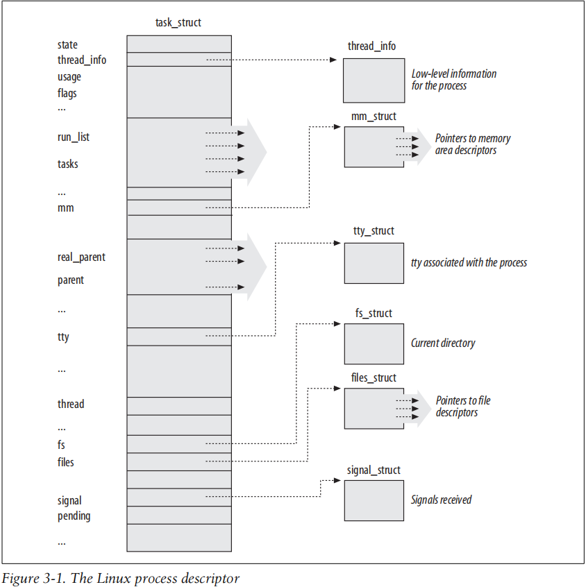

# Understand Linux Kernel : Processes


<!-- vim-markdown-toc GitLab -->

* [KeyNote](#keynote)
* [1 Processes, Lightweight Processes, and Threads](#1-processes-lightweight-processes-and-threads)
* [2 Process Descriptor](#2-process-descriptor)
    * [2.1 Process State](#21-process-state)
    * [2.2 Identifying a Process](#22-identifying-a-process)
    * [2.3 Relationships Among Processes](#23-relationships-among-processes)
    * [2.4 How Processes Are Organized](#24-how-processes-are-organized)
    * [2.5 Process Resource Limits](#25-process-resource-limits)
* [3 Process Switch](#3-process-switch)
* [4 Creating Processes](#4-creating-processes)
* [5 Destroying Processes](#5-destroying-processes)

<!-- vim-markdown-toc -->

## KeyNote
- TASK_INTERRUPTIBLE : **The process is suspended (sleeping) until some condition becomes true.**

## 1 Processes, Lightweight Processes, and Threads

POSIX-compliant multithreaded applications are best handled by kernels that support “thread groups.”
In Linux a thread group is basically a set of lightweight processes that implement a multithreaded application and act as a whole with regards to
some system calls such as `getpid()`, `kill()`, and `_exit()`. We are going to describe them at length later in this chapter.
> @todo 有意思，跟踪对应的代码

## 2 Process Descriptor

Figure 3-1 describes the Linux process descriptor schematically.



- [ ] 可以跟踪一下上面的图中间 task_struct 包含的内容

The six data structures on the right side of the figure refer to specific resources
owned by the process. Most of these resources will be covered in future chapters.
This chapter focuses on two types of fields that refer to the process state and to process parent/child relationships.

#### 2.1 Process State
As its name implies, the state field of the process descriptor describes what is currently happening to the process. It consists of an array of flags, each of which
describes a possible process state. In the current Linux version, these states are mutually exclusive, and **hence exactly one flag of state always is set**; the remaining flags
are cleared. The following are the possible process states:

- TASK_RUNNING

The process is either executing on a CPU or waiting to be executed.

- TASK_INTERRUPTIBLE

**The process is suspended (sleeping) until some condition becomes true.** Raising
a hardware interrupt, releasing a system resource the process is waiting for, or
delivering a signal are examples of conditions that might wake up the process
(put its state back to TASK_RUNNING).

- TASK_UNINTERRUPTIBLE

Like TASK_INTERRUPTIBLE, except that delivering a signal to the sleeping process
leaves its state unchanged. This process state is seldom used. It is valuable, however, under certain specific conditions in which a process must wait until a given
event occurs without being interrupted. For instance, this state may be used
when a process opens a device file and the corresponding device driver starts
probing for a corresponding hardware device. The device driver must not be
interrupted until the probing is complete, or the hardware device could be left in
an unpredictable state.

- TASK_STOPPED

Process execution has been stopped; the process enters this state after receiving a
SIGSTOP, SIGTSTP, SIGTTIN, or SIGTTOU signal.

- TASK_TRACED

Process execution has been stopped by a debugger. When a process is being monitored by another (such as when a debugger executes a ptrace() system call to
monitor a test program), each signal may put the process in the TASK_TRACED state.

Two additional states of the process can be stored both in the state field and in the
`exit_state` field of the process descriptor; as the field name suggests, a process
reaches one of these two states only when its execution is terminated:

- EXIT_ZOMBIE

Process execution is terminated, but the parent process has not yet issued a
`wait4()` or `waitpid()` system call to return information about the dead process.
Before the `wait()`-like call is issued, the kernel cannot discard the data contained in the dead process descriptor because the parent might need it. (See the
section “Process Removal” near the end of this chapter.)

- EXIT_DEAD

The final state: the process is being removed by the system because the parent
process has just issued a `wait4()` or `waitpid()` system call for it. Changing its
state from `EXIT_ZOMBIE` to `EXIT_DEAD` avoids race conditions due to other threads
of execution that execute `wait()`-like calls on the same process (see Chapter 5).

> @todo 似乎的确是这个 flag, 但是实际上存在更多的 flags

```c
/* Used in tsk->state: */
#define TASK_RUNNING			0x0000
#define TASK_INTERRUPTIBLE		0x0001
#define TASK_UNINTERRUPTIBLE		0x0002
#define __TASK_STOPPED			0x0004
#define __TASK_TRACED			0x0008
/* Used in tsk->exit_state: */
#define EXIT_DEAD			0x0010
#define EXIT_ZOMBIE			0x0020
#define EXIT_TRACE			(EXIT_ZOMBIE | EXIT_DEAD)
/* Used in tsk->state again: */
#define TASK_PARKED			0x0040
#define TASK_DEAD			0x0080
#define TASK_WAKEKILL			0x0100
#define TASK_WAKING			0x0200
#define TASK_NOLOAD			0x0400
#define TASK_NEW			0x0800
#define TASK_STATE_MAX			0x1000
```

#### 2.2 Identifying a Process

When recycling PID numbers, the kernel must manage a `pidmap_array` bitmap that
denotes which are the PIDs currently assigned and which are the free ones. Because a
page frame contains 32,768 bits, in 32-bit architectures the pidmap_array bitmap is
stored in a single page. In 64-bit architectures, however, additional pages can be
added to the bitmap when the kernel assigns a PID number too large for the current
bitmap size. These pages are never released.
> @todo 这个机制显然取消掉，更加优秀的机制是什么 ?

To comply with this standard, Linux makes use of thread groups. The identifier
shared by the threads is the PID of the thread group leader, that is, the PID of the first
lightweight process in the group; it is stored in the tgid field of the process descriptors.
The getpid() system call returns the value of tgid relative to the current process instead of the value of pid, so all the threads of a multithreaded application
share the same identifier. Most processes belong to a thread group consisting of a
single member; as thread group leaders, they have the tgid field equal to the pid
field, thus the `getpid()` system call works as usual for this kind of process.

Later, we’ll show you how it is possible to derive a true process descriptor pointer
efficiently from its respective PID. Efficiency is important because many system calls
such as `kill()` use the PID to denote the affected process.

* ***Process descriptors handling***

For each process, Linux packs two different
data structures in a single per-process memory area: a small data structure linked to
the process descriptor, namely the `thread_info` structure, and the Kernel Mode process stack.

Right after switching from User Mode to Kernel Mode, the kernel
stack of a process is always empty, and therefore the `esp` register points to the byte
immediately following the stack.

> @todo 此处说明的是 thread_info 在 stack 中间的情况

* ***Identifying the current process***


To get the process descriptor pointer of the
process currently running on a CPU, the kernel makes use of the current macro,
which is essentially equivalent to `current_thread_info()->task` and produces assembly language instructions like the following:
```
movl $0xffffe000,%ecx /* or 0xfffff000 for 4KB stacks */
andl %esp,%ecx
movl (%ecx),p
```
Because the task field is at offset 0 in the thread_info structure, after executing these
three instructions p contains the process descriptor pointer of the process running on the CPU.

> 当内核 stack 和 thread_info 在一起的时候，如果 thread_info 持有 task_struct 指针，以及 pid 等等，那么就可以通过 esp 以及简单的操作，就可以得到
> 但是实际上，如今 thread_info 被配置到 task_struct 中间，获取 current_task 的方法如下。

```c
DECLARE_PER_CPU(struct task_struct *, current_task);

static __always_inline struct task_struct *get_current(void)
{
	return this_cpu_read_stable(current_task);
}

#define current get_current()
```

* ***Doubly linked lists***
> 介绍了 kernel list 和 hlist 的实现，@todo 虽然 hlist 的作用还是不懂

* ***The process list***

The head of the process list is the init_task task_struct descriptor; it is the process
descriptor of the so-called process 0 or swapper (see the section “Kernel Threads”
later in this chapter). The `tasks->prev` field of `init_task` points to the tasks field of
the process descriptor inserted last in the list.
> @todo 为什么需要 task_struct::tasks 的存在，现有的代码，对其只有维护，没有使用。

* ***The lists of TASK_RUNNING processes***
> 似乎完全不是这么回事，没有 prio_array_t , run_list 等， enqueue_task 和 dequeue_task 也不可能这么简单

#### 2.3 Relationships Among Processes

Processes 0 and 1 are created by the kernel; as we’ll see later in the chapter, process 1 (init) is the ancestor of all other processes.
> @todo process 0 是谁 ?


```c
	/*
	 * 'ptraced' is the list of tasks this task is using ptrace() on.
	 *
	 * This includes both natural children and PTRACE_ATTACH targets.
	 * 'ptrace_entry' is this task's link on the p->parent->ptraced list.
	 */
	struct list_head		ptraced;
	struct list_head		ptrace_entry;
```
> 其他的几个成员都是老生常态，ptrace 机制其实是可以让一个 process 跟踪好多个

* ***The pidhash table and chained lists***

Linux uses chaining to handle colliding PIDs; each table entry is the head of a doubly linked list of colliding process descriptors.

> @todo 哦，原来 pid struct 一直都是存在的，但是 Figure 3-6 描述的 hash table 相关的有点奇怪啊!

#### 2.4 How Processes Are Organized


The runqueue lists group all processes in a TASK_RUNNING state. When it comes to
grouping processes in other states, the various states call for different types of treatment, with Linux opting for one of the choices shown in the following list.
- Processes in a `TASK_STOPPED`, `EXIT_ZOMBIE`, or `EXIT_DEAD` state are not linked in
specific lists. There is no need to group processes in any of these three states,
because stopped, zombie, and dead processes are accessed only via PID or via
linked lists of the child processes for a particular parent.
- Processes in a `TASK_INTERRUPTIBLE` or `TASK_UNINTERRUPTIBLE` state are subdivided
into many classes, each of which corresponds to a specific event. In this case, the
process state does not provide enough information to retrieve the process
quickly, so it is necessary to introduce additional lists of processes. These are
called wait queues and are discussed next.


* ***Wait queues***

Wait queues have several uses in the kernel, particularly for interrupt handling, process synchronization, and timing.


```c
/*
 * A single wait-queue entry structure:
 */
struct wait_queue_entry {
	unsigned int		flags;
	void			*private;
	wait_queue_func_t	func;
	struct list_head	entry;
};

struct wait_queue_head {
	spinlock_t		lock;
	struct list_head	head;
};
typedef struct wait_queue_head wait_queue_head_t;
```

Thus, there are two kinds of sleeping processes: exclusive processes (denoted by the
value 1 in the flags field of the corresponding wait queue element) are selectively
woken up by the kernel, while nonexclusive processes (denoted by the value 0 in the
flags field) are always woken up by the kernel when the event occurs. A process
waiting for a resource that can be granted to just one process at a time is a typical
exclusive process.
Processes waiting for an event that may concern any of them are
nonexclusive. Consider, for instance, a group of processes that are waiting for the
termination of a group of disk block transfers: as soon as the transfers complete, all
waiting processes must be woken up.
> wait_queue_entry::flags 的作用之一 : exclusive 和 nonexclusive 的区分

As we’ll see next, the func field of a wait queue
element is used to specify how the processes sleeping in the wait queue should be
woken up.
> wait_queue_entry::func 的作用

* ***Handling wait queues***

Once an element is **defined**, it must be **inserted** into a wait queue.
> 有几个 macro 初始化 queue 和 其中的 entry

Once an element is defined, it must be inserted into a wait queue.
The `add_wait_queue()` function inserts a nonexclusive process in the first position of a wait queue
list. The `add_wait_queue_exclusive()` function inserts an exclusive process in the last
position of a wait queue list. The `remove_wait_queue()` function removes a process
from a wait queue list. The `waitqueue_active()` function checks whether a given wait
queue list is empty.

A process wishing to wait for a specific condition can invoke any of the functions shown in the following list.

> 下面提供了好一个 wait 和 wake up 的调用，以及各种封装函数。

#### 2.5 Process Resource Limits
The `rlim_max` field is the maximum allowed value for the resource limit. By using the
`getrlimit()` and `setrlimit()` system calls, a user can always increase the `rlim_cur`
limit of some resource up to `rlim_max`.
However, only the superuser (or, more precisely, a user who has the `CAP_SYS_RESOURCE` capability) can increase the `rlim_max` field
or set the `rlim_cur` field to a value greater than the corresponding `rlim_max` field.
> @todo
> 1. 既然存在 cgroup, 为什么这个东西不是被 disable 掉的 ?

Whenever a user logs into the system, the kernel creates a process owned
by the superuser, which can invoke `setrlimit()` to decrease the `rlim_max` and `rlim_cur` fields for a resource.
The same process later executes a login shell and becomes
owned by the user. Each new process created by the user inherits the content of the
rlim array from its parent, and therefore the user cannot override the limits enforced
by the administrator.
> @todo 这个描述的过程也太棒了吧! 可以找到代码上的证据吗 ?

## 3 Process Switch
Modern Unix kernels solve this problem by introducing three different mechanisms:
- The Copy On Write technique allows both the parent and the child to read the
same physical pages. Whenever either one tries to write on a physical page, the
kernel copies its contents into a new physical page that is assigned to the writing
process. The implementation of this technique in Linux is fully explained in
Chapter 9.
- Lightweight processes allow both the parent and the child to share many perprocess kernel data structures, such as the paging tables (and therefore the entire
User Mode address space), the open file tables, and the signal dispositions.
- The `vfork()` system call creates a process that shares the memory address space
of its parent. To prevent the parent from overwriting data needed by the child,
the parent’s execution is blocked until the child exits or executes a new program. We’ll learn more about the `vfork()` system call in the following section.

## 4 Creating Processes

## 5 Destroying Processes
