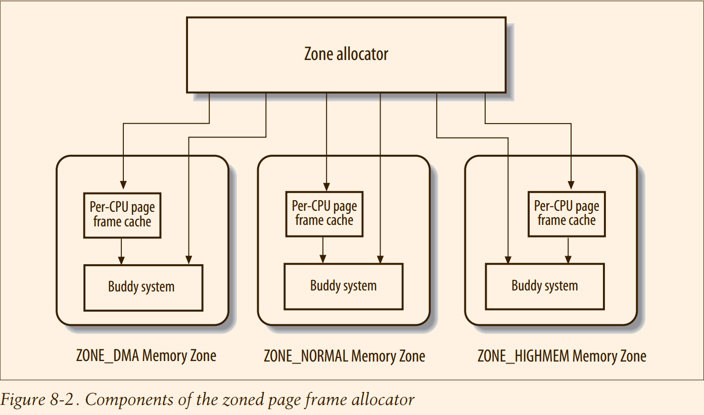

# Understand Linux Kernel : Memory Management

## Keynote
1. sparse memory 到底怎么回事 ?


We saw in Chapter 2 how Linux takes advantage of 80x86’s segmentation and paging circuits to translate logical addresses into physical ones. We also mentioned that
some portion of RAM is permanently assigned to the kernel and used to store both
the kernel code and the static kernel data structures.

The remaining part of the RAM is called **dynamic memory**.

> 本章分析的三个内容 : page_alloc.c slob.c vmaloc.c

## 1 Page Frame Management

#### 1.1 Page Descriptors

All page descriptors are stored in the `mem_map` array.

Let’s describe in greater detail two of the fields:
- `_count`

  A usage reference counter for the page. If it is set to -1, the corresponding page
  frame is free and can be assigned to any process or to the kernel itself. If it is set
  to a value greater than or equal to 0, the page frame is assigned to one or more
  processes or is used to store some kernel data structures. The page_count() function returns the value of the `_count` field increased by one, that is, the number of
  users of the page.

- flags

  Includes up to 32 flags (see Table 8-2) that describe the status of the page frame.
  For each PG_xyz flag, the kernel defines some macros that manipulate its value.
  Usually, the PageXyz macro returns the value of the flag, while the SetPageXyz
  and ClearPageXyz macro set and clear the corresponding bit, respectively.

#### 1.2 Non-Uniform Memory Access (NUMA)
> 年代久远，还什么 x86 不支持 NUMA，不过很高兴现在对于 pg_data_t 中间几乎所有的成员的作用是什么都有理解了

#### 1.3 Memory Zones
In an ideal computer architecture, a page frame is a memory storage unit that can be
used for anything: storing kernel and user data, buffering disk data, and so on. Every
kind of page of data can be stored in a page frame, without limitations.

However, real computer architectures have hardware constraints that may limit the
way page frames can be used. In particular, the Linux kernel must deal with two
hardware constraints of the 80x86 architecture:

- The Direct Memory Access (DMA) processors for old ISA buses have a strong limitation: they are able to address only the first 16 MB of RAM.
- In modern 32-bit computers with lots of RAM, the CPU cannot directly access all physical memory because the linear address space is too small.

> @todo 这两个原因，我笑了，x64 都不是这么处理的好吧!

To cope with these two limitations, Linux 2.6 partitions the physical memory of
every memory node into three zones. In the 80x86 UMA architecture the zones are:

- ZONE_DMA

  Contains page frames of memory below 16 MB

- ZONE_NORMAL

  Contains page frames of memory at and above 16 MB and below 896 MB

- ZONE_HIGHMEM

  Contains page frames of memory at and above 896 MB

```c
enum zone_type {
	/*
	 * ZONE_DMA and ZONE_DMA32 are used when there are peripherals not able
	 * to DMA to all of the addressable memory (ZONE_NORMAL).
	 * On architectures where this area covers the whole 32 bit address
	 * space ZONE_DMA32 is used. ZONE_DMA is left for the ones with smaller
	 * DMA addressing constraints. This distinction is important as a 32bit
	 * DMA mask is assumed when ZONE_DMA32 is defined. Some 64-bit
	 * platforms may need both zones as they support peripherals with
	 * different DMA addressing limitations.
	 *
	 * Some examples:
	 *
	 *  - i386 and x86_64 have a fixed 16M ZONE_DMA and ZONE_DMA32 for the
	 *    rest of the lower 4G.
	 *
	 *  - arm only uses ZONE_DMA, the size, up to 4G, may vary depending on
	 *    the specific device.
	 *
	 *  - arm64 has a fixed 1G ZONE_DMA and ZONE_DMA32 for the rest of the
	 *    lower 4G.
	 *
	 *  - powerpc only uses ZONE_DMA, the size, up to 2G, may vary
	 *    depending on the specific device.
	 *
	 *  - s390 uses ZONE_DMA fixed to the lower 2G.
	 *
	 *  - ia64 and riscv only use ZONE_DMA32.
	 *
	 *  - parisc uses neither.
	 */
#ifdef CONFIG_ZONE_DMA
	ZONE_DMA,
#endif
#ifdef CONFIG_ZONE_DMA32
	ZONE_DMA32,
#endif
	/*
	 * Normal addressable memory is in ZONE_NORMAL. DMA operations can be
	 * performed on pages in ZONE_NORMAL if the DMA devices support
	 * transfers to all addressable memory.
	 */
	ZONE_NORMAL,
#ifdef CONFIG_HIGHMEM
	/*
	 * A memory area that is only addressable by the kernel through
	 * mapping portions into its own address space. This is for example
	 * used by i386 to allow the kernel to address the memory beyond
	 * 900MB. The kernel will set up special mappings (page
	 * table entries on i386) for each page that the kernel needs to
	 * access.
	 */
	ZONE_HIGHMEM,
#endif
	ZONE_MOVABLE,
#ifdef CONFIG_ZONE_DEVICE
	ZONE_DEVICE,
#endif
	__MAX_NR_ZONES
};
```
> @todo
> 1. high memory, vmalloc 以及 FIX map 的关系是什么 ?
> 2. 当使用 DMA32 同时所有内存只有 4G 的时候，那岂不是就没有 ZONE_MOVABLE 和 ZONE_NORMAL ?

```c
enum migratetype {
	MIGRATE_UNMOVABLE,
	MIGRATE_MOVABLE,
	MIGRATE_RECLAIMABLE,
	MIGRATE_PCPTYPES,	/* the number of types on the pcp lists */
	MIGRATE_HIGHATOMIC = MIGRATE_PCPTYPES,
#ifdef CONFIG_CMA
	/*
	 * MIGRATE_CMA migration type is designed to mimic the way
	 * ZONE_MOVABLE works.  Only movable pages can be allocated
	 * from MIGRATE_CMA pageblocks and page allocator never
	 * implicitly change migration type of MIGRATE_CMA pageblock.
	 *
	 * The way to use it is to change migratetype of a range of
	 * pageblocks to MIGRATE_CMA which can be done by
	 * __free_pageblock_cma() function.  What is important though
	 * is that a range of pageblocks must be aligned to
	 * MAX_ORDER_NR_PAGES should biggest page be bigger then
	 * a single pageblock.
	 */
	MIGRATE_CMA,
#endif
#ifdef CONFIG_MEMORY_ISOLATION
	MIGRATE_ISOLATE,	/* can't allocate from here */
#endif
	MIGRATE_TYPES
};
```

> @todo 原来 zone 和 migrate 不是一个东西 ？

#### 1.4 The Pool of Reserved Page Frames

The amount of the reserved memory (in kilobytes) is stored in the min_free_kbytes
variable. Its initial value is set during kernel initialization and depends on the
amount of physical memory that is directly mapped in the kernel’s fourth gigabyte of
linear addresses—that is, it depends on the number of page frames included in the
ZONE_DMA and ZONE_NORMAL memory zones:

However, initially `min_free_kbytes` cannot be lower than 128 and greater than 65,536.

The `pages_min` field of the zone descriptor stores the number of reserved page frames
inside the zone. As we’ll see in Chapter 17, this field plays also a role for the page
frame reclaiming algorithm, together with the `pages_low` and `pages_high` fields. The
pages_low field is always set to 5/4 of the value of `pages_min`, and `pages_high` is
always set to 3/2 of the value of pages_min.
> 这些 field 都没有了 ! 这些内容被整理成为 watermark，所以　watermark 是个如此简单的东西，无非是初始化处理一下，在 page reclaim 的地方利用一下。
> 至于 reclaim 的细节，和 watermark 没有关系了。

#### 1.5 The Zoned Page Frame Allocator
To get better system performance, a small number of page frames are kept in cache to quickly satisfy the allocation requests for single page frames.



* ***Requesting and releasing page frames***
> 介绍了 free_pages 以及 alloc_pages 之类的各种 interface
> 并且说明各种 flags 的使用

#### 1.6 Kernel Mappings of High-Memory Page Frames
> skip 对于 32bit 没有兴趣

#### 1.7 The Buddy System Algorithm
> 本 section 介绍了智障版本的 buddy system 的设计，没有考虑 pcp compaction 以及和各种子系统的交互问题。

* ***Data structures***
* ***Allocating a block***
* ***Freeing a block***

#### 1.8 The Per-CPU Page Frame Cache
> @todo pcp 中间存储的是最近访问过的page，还是最近访问过，并且 free 的page ?

As we will see later in this chapter, the kernel often requests and releases single page
frames. To boost system performance, each memory zone defines a per-CPU page
frame cache. Each per-CPU cache includes some pre-allocated page frames to be
used for single memory requests issued by the local CPU.

Actually, there are two caches for each memory zone and for each CPU: a **hot** cache,
which stores page frames whose contents are likely to be included in the CPU’s hardware cache, and a **cold** cache.

**Taking a page frame from the hot cache** is beneficial for system performance if either
the kernel or a User Mode process will write into the page frame right after the allocation. In fact, every access to a memory cell of the page frame will result in a line of the
hardware cache being “stolen” from another page frame—unless, of course, the hardware cache already includes a line that maps the cell of the “hot” page frame just
accessed.

Conversely, **taking a page frame from the cold cache** is convenient if the page frame is
going to be filled with a DMA operation. In this case, the CPU is not involved and no
line of the hardware cache will be modified. Taking the page frame from the cold
cache preserves the reserve of hot page frames for the other kinds of memory allocation requests.
> @todo taking a page from，也就是这就是pcp 就是 free page cache，那么我怎么知道从哪里补充 page 到 pcp ? 以及补充到哪一个 buffer 中间 ?


Table 8-7. The fields of the per_cpu_pages descriptor
| Type Name             | Description                                                      |
|-----------------------|------------------------------------------------------------------|
| int count             | Number of pages frame in the cache
| int low               | Low watermark for cache replenishing
| int high              | High watermark for cache depletion
| int batch             | Number of page frames to be added or subtracted from the cache
| struct list_head list | List of descriptors of the page frames included in the cache

* ***Allocating page frames through the per-CPU page frame caches***
> skip 变化有点大

* ***Releasing page frames to the per-CPU page frame caches***
> skip

#### 1.9 The Zone Allocator
The **zone allocator** is the frontend of the kernel page frame allocator. This component must locate a memory zone that includes a number of free page frames large
enough to satisfy the memory request. This task is not as simple as it could appear at
a first glance, because the zone allocator must satisfy several goals:

## 2 Memory Area Management 
> skip : we will reference the wowotech first.

## 3 Noncontiguous Memory Area Management
> skip : something we believe we have understand.
