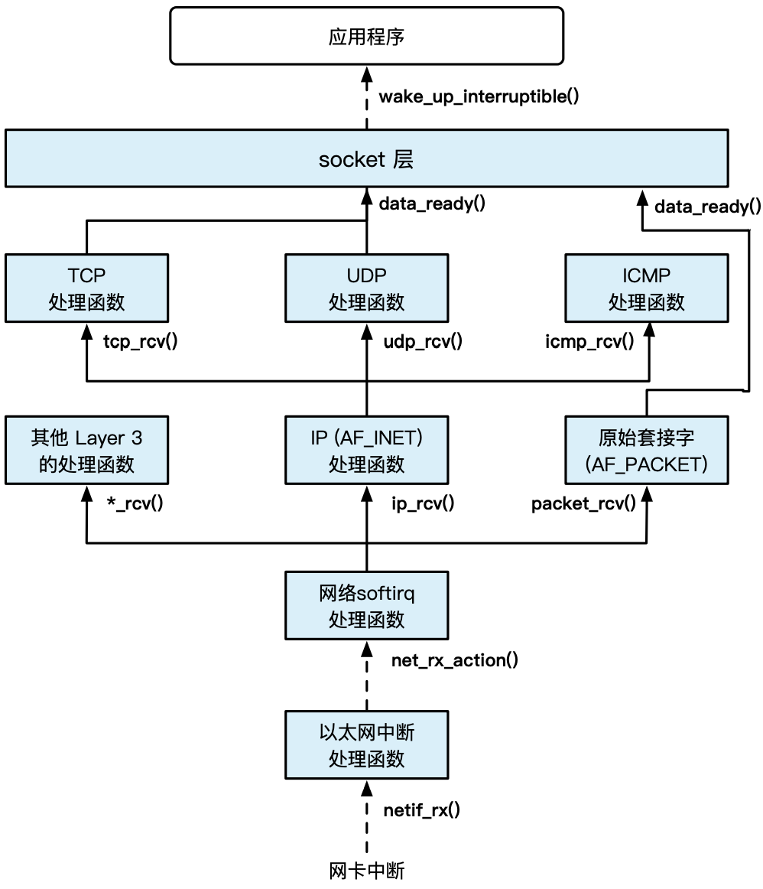

# Network Route

## KeyNotes
| OSI        | TCP/IP | 作用                     | 主要协议                 |
|------------|--------|--------------------------|--------------------------|
| 应用层     | 应用层 | 文件服务、电子邮件等应用 | DNS、HTTP、FTP 等        |
| 表示层     | 应用层 | 格式、压缩、加密         | 无对应                   |
| 会话层     | 应用层 | 建立或解除通信           | 无对应                   |
| 传输层     | 传输层 | 进程到进程的通信         | TCP、UDP                 |
| 网络层     | 网络层 | 主机到主机的通信         | IP、ICMP、IGMP、BGP 等   |
| 数据链路层 | 链路层 | 构建数据帧传输的链路     | ARP、PPP、MTU、SLIP 等   |
| 物理层     | 物理层 | 提供信息传输的物理介质   | IEEE802.2、IEEE802.11 等 |

- https://switch-router.gitee.io/categories/ ：阅读其中的每一篇文章；
- https://zorrozou.github.io/docs/tcp/handshake/tcp_three_way_handshake.html : 关于 TCP 的文章可以分析一下。

## todo
- https://plantegg.github.io/2020/05/24/%E7%A8%8B%E5%BA%8F%E5%91%98%E5%A6%82%E4%BD%95%E5%AD%A6%E4%B9%A0%E5%92%8C%E6%9E%84%E5%BB%BA%E7%BD%91%E7%BB%9C%E7%9F%A5%E8%AF%86%E4%BD%93%E7%B3%BB/
  - 程序员如何构建网络知识体系
- https://cs144.github.io/ : tcp 实验
- [ ] openwrt 到底是什么?
  - 教别人编译的 : https://github.com/coolsnowwolf/lede
- [ ] 好吧，并不能找到 routing table 相关的代码 ! (netfilter ?)
- [ ] ceph
- 无论如何，将 Linux kernel Labs 中的实验做一下
- [ ] Where is ebpf hooks for packet filter ?
- 为什么 QEMU 可以让 Guest 可以有某一个 ip 到 host 的网络中
- [ ] 测试一下 bpf filter 的功能
- http://www.mattkeeter.com/projects/pont/ : 一个小游戏，涉及到前端后端，websoctet
- https://www.learncloudnative.com/blog/2020-04-25-beginners-guide-to-gateways-proxies/ : 讲解网关
- https://news.ycombinator.com/item?id=23241934 : ssh-agent 的工作原理是什么 ?
- https://www2.tkn.tu-berlin.de/teaching/rn/animations/gbn_sr/ : 拥塞网络图形化演示
- everything is file 和 socket 接口的差别是什么，为什么如果是 socket 最好是使用 socket 的

- 仅仅是看一看
```txt
       -nic [tap|bridge|user|l2tpv3|vde|netmap|vhost-user|socket][,...][,mac=macaddr][,model=mn]
           This option is a shortcut for configuring both the on-board (default) guest NIC hardware and the host network backend in one go. The host backend options are the same as with the corresponding -netdev options below.  The guest NIC model can be set with
           model=modelname.  Use model=help to list the available device types.  The hardware MAC address can be set with mac=macaddr.

           The following two example do exactly the same, to show how -nic can be used to shorten the command line length (note that the e1000 is the default on i386, so the model=e1000 parameter could even be omitted here, too):

                   qemu-system-i386 -netdev user,id=n1,ipv6=off -device e1000,netdev=n1,mac=52:54:98:76:54:32
                   qemu-system-i386 -nic user,ipv6=off,model=e1000,mac=52:54:98:76:54:32
```
- 所以 -nic 和 -netdev 都是做啥的?
- -nic 后面跟着的这么多的设备是做啥的

- [ ] 使用 ip 来分析一下内核是如何实现路由的

## checksheet
- [CyC2018/CS-Notes : TCP 总结的真的到位](https://github.com/CyC2018/CS-Notes/blob/master/notes/%E8%AE%A1%E7%AE%97%E6%9C%BA%E7%BD%91%E7%BB%9C%20-%20%E4%BC%A0%E8%BE%93%E5%B1%82.md)

## [ ] 必看文件
- [ ] net/core/dev.c

## Unix domain socket
[Introduction](https://stackoverflow.com/questions/21032562/example-to-explain-unix-domain-socket-af-inet-vs-af-unix)


## network flow[^2]
- [ ] watch dog

```txt
- send
  - `__sys_sendto`
    - sock_sendmsg
      - sock_sendmsg_nosec
        - `INDIRECT_CALL_INET(sock->ops->sendmsg, inet6_sendmsg, inet_sendmsg, sock, msg, msg_data_left(msg));`
          - inet_sendmsg
            - `INDIRECT_CALL_2(sk->sk_prot->sendmsg, tcp_sendmsg, udp_sendmsg, sk, msg, size);`
              - tcp_sendmsg
                - tcp_sendmsg_locked
                  - `__tcp_push_pending_frames`
                  - tcp_push_one
                    - tcp_write_xmit
                      - tcp_transmit_skb
                        - `__tcp_transmit_skb`
                          - `INDIRECT_CALL_INET(icsk->icsk_af_ops->queue_xmit, inet6_csk_xmit, ip_queue_xmit, sk, skb, &inet->cork.fl);`=
                            - inet_connection_sock::inet_connection_sock_af_ops::queue_xmit
                              - ip_queue_xmit
                                - `__ip_queue_xmit`
                                  - ip_local_out
                                    - `__ip_local_out`
                                      - dst_output
                                        - `skb_dst(skb)->output(net, sk, skb);`
                                          - ip_output
                                            - ip_finish_output
                                              - `__ip_finish_output`
                                                - ip_finish_output2
                                                  - neigh_output
                                                    - neigh_hh_output
                                                    - neighbour::output
                                                      - dev_queue_xmit
                                                        - `__dev_queue_xmit`
                                                          - `__dev_xmit_skb`
                                                            - `__qdisc_run`
                                                              - qdisc_restart
                                                                - sch_direct_xmit
                                                                  - dev_hard_start_xmit
                                                                    - xmit_one
                                                                      - netdev_start_xmit
                                                                        - `__netdev_start_xmit`
                                                                          - net_device_ops::ndo_start_xmit
                                                                            - e1000_xmit_frame
```
- dir : net/tcp4
- file : `ip_output.c` `tcp_output.c` tcp.c route.c

- [ ] 应该将 recv 的路径也跟着看一遍的

- 物理设备接受一个 package [^10]
  - core/dev.c:`netif_rx`: 将 skb 放到 CPU 的队列中 : receives a packet from a device driver and queues it for the upper (protocol)
  - core/dev.c:`net_rx_action`: 将 skb 从 CPU 队列中移除: 数据包申请sk_buff缓冲区对象，同时将数据从接收队列拷贝至sk_buff对象
- ip 层接受
  - `ip_input.c:ip_rcv`
    - `ip_rcv_finish`
      - `route.c:ip_route_input`
        - `ip_input.c:ip_local_deliver()` : 如果 ip 等于就是自己，将 packet 向上提交
        - `ipv4/route.c:ip_route_input_slow()`
          - 如果不 forward，或者不知道如何 forward ，那么 send ICMP
          - `ipv4/ip_forward.c:ip_forward()`
            - `core/dev.c:dev_queue_xmit()`
              - `sched/sch_generic.c:pfifo_fast_enqueue()`

<p align="center">
  
</p>
<p align="center">
from https://ipads.se.sjtu.edu.cn/mospi/
</p>


## 有趣
- [ping localhost 不会和网卡打交道，那是 loopback devices](https://superuser.com/questions/565742/localhost-pinging-when-there-is-no-network-card)

使用这个代码可以用于测试网卡的 ip
https://stackoverflow.com/questions/2283494/get-ip-address-of-an-interface-on-linux
> 注意: eth0 -> enxd43a650739d8

用这个代码可以来测试获取所有的网卡:
https://www.cyberithub.com/list-network-interfaces/

- [网卡的工作模式](https://zdyxry.github.io/2020/03/18/%E7%90%86%E8%A7%A3%E7%BD%91%E5%8D%A1%E6%B7%B7%E6%9D%82%E6%A8%A1%E5%BC%8F/)
- [什么是 NAPI](https://stackoverflow.com/questions/28090086/what-are-the-advantages-napi-before-the-irq-coalesce)
  - interrupt 聚合
- [什么是 GRO](https://stackoverflow.com/questions/47332232/why-is-gro-more-efficient)
  - [ ] [gro 详解](https://abcdxyzk.github.io/blog/2015/04/18/kernel-net-gro/)
  - `napi_gro_receive` 在 NAPI 层次做 GRO
- [当 read/write 的 flags 为 0 的时候，其等价于 read / write](https://stackoverflow.com/questions/19971858/c-socket-send-recv-vs-write-read)
- [sendmsg vs send 和 writev vs write 有点类似](https://stackoverflow.com/questions/4258834/how-sendmsg-works)
- [socketpair](https://stackoverflow.com/questions/64214231/why-do-i-need-socketpair-when-i-have-socket-with-af-unix)
  - 相比于 pipe 可以是双向的
  - 相比于 unix domain 可以用于暴露出来路径
- getsockname / getpeername: 详细内容参考 tlpi 61.5 Retrieving Socket Addresses
  - 存在好几种情况，可以让内核分配 port ，例如在 bind 之前 connect 或者 listen，可以通过 getsockname 来获取
- [Why does DHCP use UDP and not TCP?](https://networkengineering.stackexchange.com/questions/64401/why-does-dhcp-use-udp-and-not-tcp)
  - 因为 TCP 是 connection-oriented 的，负责两个 Host 之间的联系，无法进行 broadcast 的操作
- [ICMP vs IGMP](https://www.jianshu.com/p/4bd8758f9fbd)
- [Wireshark 的工作原理](https://stackoverflow.com/questions/29620590/where-does-the-wireshark-capture-the-packets)
  - [How does the `AF_PACKET` socket work in Linux?](https://stackoverflow.com/questions/62866943/how-does-the-af-packet-socket-work-in-linux)
- [flow control vs congestion control](https://stackoverflow.com/questions/16473038/whats-the-difference-between-flow-control-and-congestion-control-in-tcp)
  - Congestion control is a global issue – involves every router and host within the subnet
  - Flow control, that is scoped from point to point, involves just sender and receiver.
- [What's ndisc_cache?](https://unix.stackexchange.com/questions/228469/whats-ndisc-cache)
  - arp_cache 给 ipv4 用的，ndisc_cache 给 ipv6 ，对应 ndp 协议

## packet
- [ ] wireshark 使用 `AF_PACKET` ，那么 bpf filter 发生在什么位置啊?

## [ ] linux network interfaces
https://developers.redhat.com/blog/2018/10/22/introduction-to-linux-interfaces-for-virtual-networking

## [ ] linux network virtual interfaces
https://developers.redhat.com/blog/2019/05/17/an-introduction-to-linux-virtual-interfaces-tunnels#

## dhcp
```sh
sudo ip addr flush en0
sudo dhclient -r 
sudo dhclient en0
```

sudo dhclient -r  && dhclient 如果 ifup 没用

## [ ] tls
- https://tls13.xargs.org/

## LVS
- liexusong 和 sdn book 都分析过

## sdn
- https://github.com/sdnds-tw/awesome-sdn

## filter
- [ ] https://devarea.com/introduction-to-network-filters-linux/
  - 似乎还行，但是给出来的用户态和内核态中的代码都不可以运行

## 802
[wiki](https://en.wikipedia.org/wiki/IEEE_802)
主要是处理这两个层次的规划:
- Data link layer
  - LLC sublayer
  - MAC sublayer
- Physical layer

## [ ] vsock
- [ ] https://man7.org/linux/man-pages/man7/vsock.7.html

## [ ] vlan
- [ ] vlan/[802.1q](https://en.wikipedia.org/wiki/IEEE_802.1Q)

## ipoe
- [ ] [IPOE到底是什么？](https://www.zhihu.com/question/35749997/answer/83459499)

## [ ] tun & tap
- https://jvns.ca/blog/2022/09/06/send-network-packets-python-tun-tap/
- https://zu1k.com/posts/coding/tun-mode/ : 不明绝厉

## [ ] bridge

https://github.com/liexusong/linux-source-code-analyze/blob/master/net_bridge.md

最终想要挑战的内容:
- https://www.ibm.com/docs/en/linux-on-systems?topic=choices-using-open-vswitch

- [ ] 将 bridge 使用 docker 和 qemu 测试一下

## [ ] veth
- [ ]  https://tonydeng.github.io/sdn-handbook/linux/virtual-device.html


首先参考[这里](https://blog.scottlowe.org/2013/09/04/introducing-linux-network-namespaces/) 构建另一个 namespaces，并且从一个 network ns ping 到另一个 network ns 中。

从其中可以注意到:
- `dev_hard_start_xmit`
  - `veth_xmit`
    - `veth_forward_skb`

然后可以找到这个:
```c
static const struct net_device_ops veth_netdev_ops = {
```

## network namespace
- [ ] network namespace 中到底隔离了什么东西 ?
- https://www.cnblogs.com/bakari/p/10613710.html
  - 这个文章从直接相连，bridge 和 ovs 三个方面说明 network namespaces 的连接

> Network  namespaces  provide  isolation of the system resources associated with networking: network devices, IPv4 and IPv6 protocol
> stacks, IP routing tables, firewall rules, the /proc/net directory (which is a symbolic link to /proc/PID/net), the  /sys/class/net
> directory,  various files under /proc/sys/net, port numbers (sockets), and so on.  In addition, network namespaces isolate the UNIX
> domain abstract socket namespace (see unix(7)).
>
> from `man(2) network_namespaces`

- [ ] 虽然可以找到 `struct netns_ipv4`，但是暂时不能理解 namespace 可以隔离 IPv4

> Linux 的实现中，网络命名空间结构体定义如代码片段 15.3所示。如果
当一个子进程被创建时需要将其放入一个新的网络命名空间内，内核首先会调
用net_alloc创建一个新的net实例，然后调用setup_net初始化该实例中
的字段，包括遍历所有的网络模块进行初始化，比如对 loopback 设备进行初
始化、配置默认路由表等。新分配的网络命名空间中默认只包含一个 loopback
设备，而内核会将后续新分配的网络设备绑定到当前网络命名空间，使得不同
网络命名空间中的进程无法互相访问对方的网络设备。如果一个进程想要改
变自己所在的网络命名空间，需要修改自己所绑定的字段，主要流程与上文一
致。


## arp
https://github.com/liexusong/linux-source-code-analyze/blob/master/arp-neighbour.md

## tc

- https://tldp.org/HOWTO/Traffic-Control-HOWTO/

### 源码分布位置
- `linux/net/sched/cls_*.c`
  - `struct tcf_proto_ops`
- `linux/net/sched/sch_*.c`
  - `struct Qdisc_ops`
  - `struct Qdisc_class_ops`
- `linux/net/sched/act_*.c`
  - `struct tc_action_ops`

## quic

> But it's still just a layer on top of UDP, and still implemented at the application, like in the past.
> from https://news.ycombinator.com/item?id=27310349

emmmmmmm, 只是 DUP 上的封装

## netlink
似乎并不是很难实现，如果有时间，可以先看看如何实现吧:
- [Instructions for running netlink example code in c](https://gist.github.com/arunk-s/c897bb9d75a6c98733d6)
- [stackoverflow : How to use netlink socket to communicate with a kernel module?](https://stackoverflow.com/questions/3299386/how-to-use-netlink-socket-to-communicate-with-a-kernel-module)

## bgp
- [CloudFlare](https://www.cloudflare.com/learning/security/glossary/what-is-bgp/)

> - Each AS wishing to exchange routing information must have a registered autonomous system number (ASN).
> - Internet Assigned Numbers Authority (IANA) assigns ASNs to Regional Internet Registries (RIRs), which then assigns them to ISPs and networks.
> - Routes are exchanged and traffic is transmitted over the Internet using external BGP (eBGP). Autonomous systems can also use an internal version of BGP to route through their internal networks, which is known as internal BGP (iBGP). It should be noted that using internal BGP is NOT a requirement for using external BGP. Autonomous systems can choose from a number of internal protocols to connect the routers on their internal network.

## 9p
- [Plan 9 的历史](https://www.zhihu.com/question/19706063/answer/763200196)

## icmp
位置:
- net/ipv6/icmp.c
- net/ipv4/icmp.c


注意一下其中的:
- `ip_send_skb`
  - `ip_local_out`
    - `__ip_local_out`
      - `nf_hook`  : 调用 netfilter
    - `dst_output` : 发送位置

## 奇怪的项目
- [A framework that aids in creation of self-spreading software](https://github.com/redcode-labs/Neurax)


## 关键参考
- [使用 wireshark 分析网络](https://gaia.cs.umass.edu/kurose_ross/wireshark.php)
  - [ ] tls 和 wireless 没有深入分析
- [liexusong](https://github.com/liexusong/linux-source-code-analyze)
- [sdn book](https://tonydeng.github.io/sdn-handbook/)
  - [ ] vpn
  - [ ] 以及后面的 sdn 的所有内容


## 资源
- [Computer Networks: A Systems Approach](https://book.systemsapproach.org/index.html) : 教科书
- [cloudflare](https://www.cloudflare.com/learning/) 的教程
- https://rfc.fyi/ : rfc 搜索

## nfs
看 fs.md 中内容

- https://unix.stackexchange.com/questions/234154/exactly-what-does-rpcbind-do

## [ ]  Understanding Host Network Stack Overheads
> 去 zotero 上看看，其引用

## 一些 backtrace 的内容
在启动 dhcp 的时候，可以检测到两次 `irq_msi_compose_msg` 和写入网络的操作。

```txt
#0  irq_msi_compose_msg (data=0xc71af010, msg=0xc7337d14) at arch/x86/kernel/apic/msi.c:29
#1  0xc1097bd7 in irq_chip_compose_msi_msg (data=<optimized out>, msg=<optimized out>) at kernel/irq/chip.c:1087
#2  0xc109a7c7 in msi_domain_activate (domain=<optimized out>, irq_data=0xc71af010) at kernel/irq/msi.c:88
#3  0xc1099525 in irq_domain_activate_irq (irq_data=0xc71af010) at kernel/irq/irqdomain.c:1303
#4  0xc1097358 in irq_startup (desc=0xc71af000, resend=true) at kernel/irq/chip.c:196
#5  0xc109616c in __setup_irq (irq=<optimized out>, desc=0xc71af000, new=0xc7326900) at kernel/irq/manage.c:1309
#6  0xc1096329 in request_threaded_irq (irq=24, handler=0xc155b7d0 <e1000_intr_msix_rx>, thread_fn=<optimized out>, irqflags=0, devname=<optimized out>, dev_id=0xc72a4000) at kernel/irq/manage.c:1653
#7  0xc155fd2b in request_irq (dev=<optimized out>, name=<optimized out>, flags=<optimized out>, handler=<optimized out>, irq=<optimized out>) at include/linux/interrupt.h:137
#8  e1000_request_msix (adapter=<optimized out>) at drivers/net/ethernet/intel/e1000e/netdev.c:2137
#9  e1000_request_irq (adapter=0xc72a4500) at drivers/net/ethernet/intel/e1000e/netdev.c:2185
#10 0xc1564877 in e1000_open (netdev=0xc72a4000) at drivers/net/ethernet/intel/e1000e/netdev.c:4578
#11 0xc16ba31e in __dev_open (dev=0xc72a4000) at net/core/dev.c:1335
#12 0xc16ba5af in __dev_change_flags (dev=0xc72a4000, flags=4099) at net/core/dev.c:6021
#13 0xc16ba687 in dev_change_flags (dev=0xc72a4000, flags=<optimized out>) at net/core/dev.c:6086
#14 0xc17372fb in devinet_ioctl (net=<optimized out>, cmd=<optimized out>, arg=<optimized out>) at net/ipv4/devinet.c:1052
#15 0xc17385ea in inet_ioctl (sock=<optimized out>, cmd=<optimized out>, arg=<optimized out>) at net/ipv4/af_inet.c:874
#16 0xc169d6dd in sock_do_ioctl (arg=<optimized out>, cmd=<optimized out>, sock=<optimized out>, net=<optimized out>) at net/socket.c:955
#17 sock_ioctl (file=<optimized out>, cmd=35092, arg=<optimized out>) at net/socket.c:955
#18 0xc1169a20 in vfs_ioctl (arg=<optimized out>, cmd=<optimized out>, filp=<optimized out>) at fs/ioctl.c:43
#19 file_ioctl (arg=<optimized out>, cmd=<optimized out>, filp=<optimized out>) at fs/ioctl.c:470
#20 do_vfs_ioctl (filp=0xc71afc00, fd=<optimized out>, cmd=<optimized out>, arg=3214201468) at fs/ioctl.c:605
#21 0xc1169ccf in SYSC_ioctl (arg=<optimized out>, cmd=<optimized out>, fd=<optimized out>) at fs/ioctl.c:622
#22 SyS_ioctl (fd=3, cmd=35092, arg=-1080765828) at fs/ioctl.c:613
#23 0xc1001aa1 in do_syscall_32_irqs_on (regs=<optimized out>) at arch/x86/entry/common.c:393
#24 do_fast_syscall_32 (regs=0xc7337fb4) at arch/x86/entry/common.c:460
#25 0xc18796a1 in entry_SYSENTER_32 () at arch/x86/entry/entry_32.S:312
#26 0x00000003 in ?? ()
#27 0x00008914 in ?? ()
#28 0xbf94d27c in ?? ()
Backtrace stopped: previous frame inner to this frame (corrupt stack?)
```

```txt
#0  irq_msi_compose_msg (data=0xc71af010, msg=0xc7337d0c) at arch/x86/kernel/apic/msi.c:29
#1  0xc1097bd7 in irq_chip_compose_msi_msg (data=<optimized out>, msg=<optimized out>) at kernel/irq/chip.c:1087
#2  0xc109a782 in msi_domain_set_affinity (irq_data=0xc71af010, mask=<optimized out>, force=<optimized out>) at kernel/irq/msi.c:76
#3  0xc10957bf in irq_do_set_affinity (data=<optimized out>, mask=0xc7337d78, force=<optimized out>) at kernel/irq/manage.c:191
#4  0xc109585f in setup_affinity (desc=<optimized out>, mask=<optimized out>) at kernel/irq/manage.c:362
#5  0xc1095f1d in __setup_irq (irq=<optimized out>, desc=0xc71af000, new=0xc7326900) at kernel/irq/manage.c:1321
#6  0xc1096329 in request_threaded_irq (irq=24, handler=0xc155b7d0 <e1000_intr_msix_rx>, thread_fn=<optimized out>, irqflags=0, devname=<optimized out>, dev_id=0xc72a4000) at kernel/irq/manage.c:1653
#7  0xc155fd2b in request_irq (dev=<optimized out>, name=<optimized out>, flags=<optimized out>, handler=<optimized out>, irq=<optimized out>) at include/linux/interrupt.h:137
#8  e1000_request_msix (adapter=<optimized out>) at drivers/net/ethernet/intel/e1000e/netdev.c:2137
#9  e1000_request_irq (adapter=0xc72a4500) at drivers/net/ethernet/intel/e1000e/netdev.c:2185
#10 0xc1564877 in e1000_open (netdev=0xc72a4000) at drivers/net/ethernet/intel/e1000e/netdev.c:4578
#11 0xc16ba31e in __dev_open (dev=0xc72a4000) at net/core/dev.c:1335
#12 0xc16ba5af in __dev_change_flags (dev=0xc72a4000, flags=4099) at net/core/dev.c:6021
#13 0xc16ba687 in dev_change_flags (dev=0xc72a4000, flags=<optimized out>) at net/core/dev.c:6086
#14 0xc17372fb in devinet_ioctl (net=<optimized out>, cmd=<optimized out>, arg=<optimized out>) at net/ipv4/devinet.c:1052
#15 0xc17385ea in inet_ioctl (sock=<optimized out>, cmd=<optimized out>, arg=<optimized out>) at net/ipv4/af_inet.c:874
#16 0xc169d6dd in sock_do_ioctl (arg=<optimized out>, cmd=<optimized out>, sock=<optimized out>, net=<optimized out>) at net/socket.c:955
#17 sock_ioctl (file=<optimized out>, cmd=35092, arg=<optimized out>) at net/socket.c:955
#18 0xc1169a20 in vfs_ioctl (arg=<optimized out>, cmd=<optimized out>, filp=<optimized out>) at fs/ioctl.c:43
#19 file_ioctl (arg=<optimized out>, cmd=<optimized out>, filp=<optimized out>) at fs/ioctl.c:470
#20 do_vfs_ioctl (filp=0xc71afc00, fd=<optimized out>, cmd=<optimized out>, arg=3214201468) at fs/ioctl.c:605
#21 0xc1169ccf in SYSC_ioctl (arg=<optimized out>, cmd=<optimized out>, fd=<optimized out>) at fs/ioctl.c:622
#22 SyS_ioctl (fd=3, cmd=35092, arg=-1080765828) at fs/ioctl.c:613
#23 0xc1001aa1 in do_syscall_32_irqs_on (regs=<optimized out>) at arch/x86/entry/common.c:393
#24 do_fast_syscall_32 (regs=0xc7337fb4) at arch/x86/entry/common.c:460
#25 0xc18796a1 in entry_SYSENTER_32 () at arch/x86/entry/entry_32.S:312
#26 0x00000003 in ?? ()
#27 0x00008914 in ?? ()
#28 0xbf94d27c in ?? ()
Backtrace stopped: previous frame inner to this frame (corrupt stack?)
```

## [ ] 分析一下这些 flags，比如 `SOCK_ZEROCOPY`

```c
/* Sock flags */
enum sock_flags {
    SOCK_DEAD,
    SOCK_DONE,
    SOCK_URGINLINE,
    SOCK_KEEPOPEN,
    SOCK_LINGER,
    SOCK_DESTROY,
    SOCK_BROADCAST,
    SOCK_TIMESTAMP,
    SOCK_ZAPPED,
    SOCK_USE_WRITE_QUEUE, /* whether to call sk->sk_write_space in sock_wfree */
    SOCK_DBG, /* %SO_DEBUG setting */
    SOCK_RCVTSTAMP, /* %SO_TIMESTAMP setting */
    SOCK_RCVTSTAMPNS, /* %SO_TIMESTAMPNS setting */
    SOCK_LOCALROUTE, /* route locally only, %SO_DONTROUTE setting */
    SOCK_MEMALLOC, /* VM depends on this socket for swapping */
    SOCK_TIMESTAMPING_RX_SOFTWARE,  /* %SOF_TIMESTAMPING_RX_SOFTWARE */
    SOCK_FASYNC, /* fasync() active */
    SOCK_RXQ_OVFL,
    SOCK_ZEROCOPY, /* buffers from userspace */
    SOCK_WIFI_STATUS, /* push wifi status to userspace */
    SOCK_NOFCS, /* Tell NIC not to do the Ethernet FCS.
             * Will use last 4 bytes of packet sent from
             * user-space instead.
             */
    SOCK_FILTER_LOCKED, /* Filter cannot be changed anymore */
    SOCK_SELECT_ERR_QUEUE, /* Wake select on error queue */
    SOCK_RCU_FREE, /* wait rcu grace period in sk_destruct() */
    SOCK_TXTIME,
    SOCK_XDP, /* XDP is attached */
    SOCK_TSTAMP_NEW, /* Indicates 64 bit timestamps always */
    SOCK_RCVMARK, /* Receive SO_MARK  ancillary data with packet */
};
```

## [ ] 分析一下 /proc/net
## [ ] 分析目录 /proc/sys/net

## firewall

nixos 默认是打开防火墙的：
- https://nixos.org/manual/nixos/unstable/options.html#opt-networking.firewall.enable

这导致了机器可以 ping，但是 iperf 或者 python -m http.server 无法链接。

## [ ] bonding
- https://docs.rackspace.com/blog/lacp-bonding-and-linux-configuration/

## SLB
- SLB : Server Load Balancing ： https://answers.uillinois.edu/illinois/page.php?id=49949
    - 可以基于OpenResty构建

## [ ] tunneling 是个什么东西，如何实现的
https://github.com/anderspitman/awesome-tunneling
- https://news.ycombinator.com/item?id=32225532

## tcp metrics
记录 tcp 参数:
- https://segmentfault.com/a/1190000020473127

## 网络代码记录
- net/core/gen_stats.c ：提供给 net//sched，用于统计的

## rds
- [What are RDS or reliable datagram sockets](https://stackoverflow.com/questions/27980309/what-are-rds-or-reliable-datagram-sockets) 对应 net/rds 目录

## RxRPC

应该用的不多:
- [kernel doc](https://www.kernel.org/doc/html/latest/networking/rxrpc.html)
- [ubuntu man](https://manpages.ubuntu.com/manpages/kinetic/man7/rxrpc.7.html)

## lldp
- [wiki](https://en.wikipedia.org/wiki/Link_Layer_Discovery_Protocol)
- [官网](https://lldpd.github.io/)

## netmark
255.255.255.0 和 255.255.240.0 的差别是什么，为什么对于网卡需要配置这个。

```txt
ens4: flags=4163<UP,BROADCAST,RUNNING,MULTICAST>  mtu 1500
        inet 192.168.23.126  netmask 255.255.240.0  broadcast 192.168.31.255
        inet6 fe80::5054:ff:fe04:23e2  prefixlen 64  scopeid 0x20<link>
        ether 52:54:00:04:23:e2  txqueuelen 1000  (Ethernet)
        RX packets 116441215  bytes 37452802900 (34.8 GiB)
        RX errors 0  dropped 15  overruns 0  frame 0
        TX packets 2361776  bytes 1007505754 (960.8 MiB)
        TX errors 0  dropped 0 overruns 0  carrier 0  collisions 0
```

## nic
- https://github.com/corundum/corundum

## netfilter
- https://randorisec.fr/crack-linux-firewall/

## https://linux.die.net/man/7/socket

可以看看 socket 的所有的 option 都有啥 ?

- SO_BINDTODEVICE

## scheduler

- linux/net/sched/ : 例如 RED ，主要是队列的管理

## wireguard
- https://news.ycombinator.com/item?id=36040803

## net/core/flow_dissector 是干啥的

## 可以用 gns3 来理解一下网络的 topo

- https://docs.gns3.com/docs/

## rtnl_link_ops 是做什么的 ?

## mptcp
> MultiPath TCP (MPTCP) is an effort towards enabling the simultaneous use of several IP-addresses/interfaces by a modification of TCP that presents a regular TCP interface to applications, while in fact spreading data across several subflows.

5.4 合并进入的:

- https://www.multipath-tcp.org/

## 数据中心的网络
- [Moving past TCP in the data center, part 1](https://mp.weixin.qq.com/s/yz47AT-ySvzZYCgd-AsQww)

- kernel network 的会议:
  - https://www.youtube.com/watch?v=DAN-7sWFxLw&list=PLrninrcyMo3L-hsJv23hFyDGRaeBY1EJO&index=2


## netem
https://wiki.linuxfoundation.org/networking/netem

tc qdisc add dev eth0 root netem delay 100ms

## traceroute
https://cv6.poinsignon.org/ : 使用 traceroute 来展示自己的简历

## cs 144

## ssh
- [ ] https://iximiuz.com/en/posts/ssh-tunnels/ : 这个哥们写过不少内容，这只是其一
- [ ] https://plantegg.github.io/2019/06/02/%E5%8F%B2%E4%B8%8A%E6%9C%80%E5%85%A8_SSH_%E6%9A%97%E9%BB%91%E6%8A%80%E5%B7%A7%E8%AF%A6%E8%A7%A3--%E6%94%B6%E8%97%8F%E4%BF%9D%E5%B9%B3%E5%AE%89/

## how to connect two network with ip a

需要在图形界面中设置:
13900K :
- 10.0.0.1
- 255.255.255.0
- 网关 192.168.8.1 : 确认下，非要使用这个吗

M2
- 10.0.0.1
- netmask: 255.255.255
- 网关 10.0.0.2

也可以直接使用命令行配置:
```txt
sudo ifconfig eth0 10.0.0.2/24
sudo ip route add default via 10.0.0.1 dev eth0
```

但是这样操作完成之后，就无法 13900K 的浏览器就无法上网了，因为当时是这种状态的:
```txt
default via 192.168.8.1 dev enp5s0 proto static metric 100
default via 192.168.8.1 dev wlo1 proto dhcp src 192.168.11.3 metric 600
10.0.0.0/24 dev enp5s0 proto kernel scope link src 10.0.0.1 metric 100
172.17.0.0/16 dev docker0 proto kernel scope link src 172.17.0.1 linkdown
192.168.8.0/22 dev wlo1 proto kernel scope link src 192.168.11.3 metric 600
192.168.8.1 dev enp5s0 proto static scope link metric 100
```

```txt
🧀  route -n
Kernel IP routing table
Destination     Gateway         Genmask         Flags Metric Ref    Use Iface
0.0.0.0         192.168.8.1     0.0.0.0         UG    100    0        0 enp5s0
0.0.0.0         192.168.8.1     0.0.0.0         UG    600    0        0 wlo1
10.0.0.0        0.0.0.0         255.255.255.0   U     100    0        0 enp5s0
172.17.0.0      0.0.0.0         255.255.0.0     U     0      0        0 docker0
192.168.8.0     0.0.0.0         255.255.252.0   U     600    0        0 wlo1
192.168.8.1     0.0.0.0         255.255.255.255 UH    100    0        0 enp5s0
```

```txt
sudo route del -net 0.0.0.0 gw         192.168.8.1   netmask   0.0.0.0 dev enp5s0
sudo route del -net 192.168.8.1 gw         0.0.0.0   netmask   255.255.255.255 dev enp5s0
```
- [ ] 不知道为什么，127.0.0.1 的那个代理现在没有办法使用了

在 M2 中需要类似的设置:
```txt
sudo route del -net 0.0.0.0 gw   10.0.0.1   netmask   0.0.0.0 dev eth0
```

### [ ] 如何删除其他的 profile

### [ ] 总是自带默认路由的

增加了之后的:
```
default via 192.168.8.1 dev enp4s0 proto static metric 100
default via 192.168.8.1 dev wlo1 proto dhcp src 192.168.11.3 metric 600
10.0.0.0/24 dev enp4s0 proto kernel scope link src 10.0.0.1 metric 100
172.17.0.0/16 dev docker0 proto kernel scope link src 172.17.0.1 linkdown
192.168.8.0/22 dev wlo1 proto kernel scope link src 192.168.11.3 metric 600
192.168.8.1 dev enp4s0 proto static scope link metric 100
```

没有增加的
```txt
default via 192.168.8.1 dev enp4s0 proto static metric 100
default via 192.168.8.1 dev wlo1 proto dhcp src 192.168.11.3 metric 600
10.0.0.0/24 dev enp4s0 proto kernel scope link src 10.0.0.1 metric 100
172.17.0.0/16 dev docker0 proto kernel scope link src 172.17.0.1 linkdown
192.168.8.0/22 dev wlo1 proto kernel scope link src 192.168.11.3 metric 600
192.168.8.1 dev enp4s0 proto static scope link metric 100
~
🧀  ip r
default via 192.168.8.1 dev wlo1 proto dhcp src 192.168.11.3 metric 600
172.17.0.0/16 dev docker0 proto kernel scope link src 172.17.0.1 linkdown
192.168.8.0/22 dev wlo1 proto kernel scope link src 192.168.11.3 metric 600
```

参考这个答案，将这个默认项目删除就可以了
https://serverfault.com/questions/181094/how-do-i-delete-a-route-from-linux-routing-table

🧀  sudo route del -net 0.0.0.0 gw 10.0.0.1 netmask 0.0.0.0 dev enp4s0

### virsh 创建的网关还是不能使用


> mac

sudo ifconfig eth0 10.0.0.2/24
sudo ip route add default via 10.0.0.1 dev eth0

> 13900K
sudo ip ad add 10.0.0.1/24 dev enp5s0

这样配置实际上有问题的。

- [ ] 非要设置 gateway192.168.8.1 吗？

```txt
× NetworkManager-wait-online.service - Network Manager Wait Online
     Loaded: loaded (/etc/systemd/system/NetworkManager-wait-online.service; enabled; preset: enabled)
    Drop-In: /nix/store/hpvakps2qbzk4y06jgwkrwfhl77zrf3j-system-units/NetworkManager-wait-online.service.d
             └─overrides.conf
     Active: failed (Result: exit-code) since Fri 2023-01-13 10:24:33 CST; 30s ago
   Duration: 1d 23h 2min 45.146s
       Docs: man:nm-online(1)
    Process: 1599312 ExecStart=/nix/store/v60qxy59png2dfp6zryjw54xii8vp58m-networkmanager-1.40.6/bin/nm-online -s -q (code=exited, status=1/FAILURE)
   Main PID: 1599312 (code=exited, status=1/FAILURE)
         IP: 0B in, 0B out
        CPU: 18ms

Jan 13 10:23:33 nixos systemd[1]: Starting Network Manager Wait Online...
Jan 13 10:24:33 nixos systemd[1]: NetworkManager-wait-online.service: Main process exited, code=exited, status=1/FAILURE
Jan 13 10:24:33 nixos systemd[1]: NetworkManager-wait-online.service: Failed with result 'exit-code'.
Jan 13 10:24:33 nixos systemd[1]: Failed to start Network Manager Wait Online.
warning: error(s) occurred while switching to the new configuration
```
- 了解下其中的原理：
- https://askubuntu.com/questions/1018576/what-does-networkmanager-wait-online-service-do

## Gateway API

## dnsmasq

## tcp 重传
通过 /proc/sys/net/ipv4/tcp_retries2 可以实现
- https://stackoverflow.com/questions/5907527/application-control-of-tcp-retransmission-on-linux

## fwmask
- https://utcc.utoronto.ca/~cks/space/blog/linux/LinuxIpFwmarkMasks

## [ ] big tcp
- [Going big with TCP packets](https://lwn.net/Articles/884104/)
  - https://netdevconf.info/0x15/session.html?BIG-TCP


## 8.8.8.8
https://developers.google.com/speed/public-dns?hl=zh-cn
https://stackoverflow.com/questions/24821521/wget-unable-to-resolve-host-address-http

[^2]: 用芯探核:基于龙芯的 Linux 内核探索解析
[^4]: http://yuba.stanford.edu/rcp/
[^6]: [An Introduction to Computer Networks](http://intronetworks.cs.luc.edu/current2/html/)
[^7]: [The TCP/IP Guide](http://www.tcpipguide.com/index.htm)
[^8]: [TUN/TAP设备浅析(一) -- 原理浅析](https://www.jianshu.com/p/09f9375b7fa7)
[^9]: https://en.wikipedia.org/wiki/Transparent_Inter-process_Communication
[^10]: https://www.cs.dartmouth.edu/~sergey/me/netreads/path-of-packet/Lab9_modified.pdf
