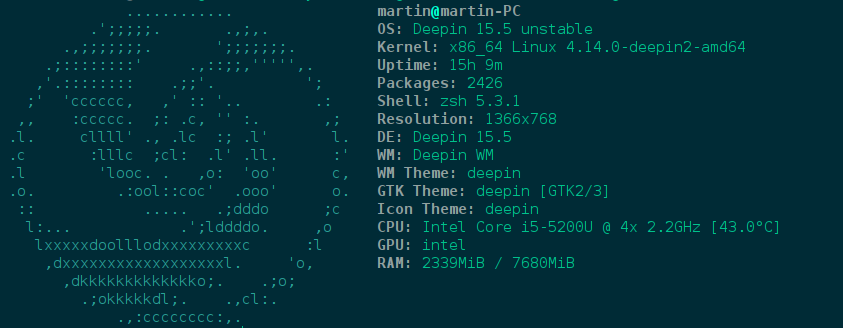
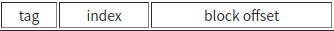
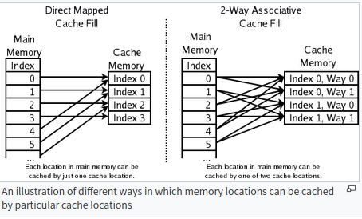
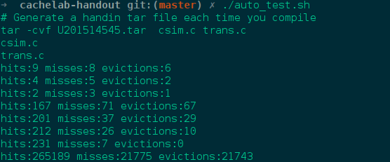
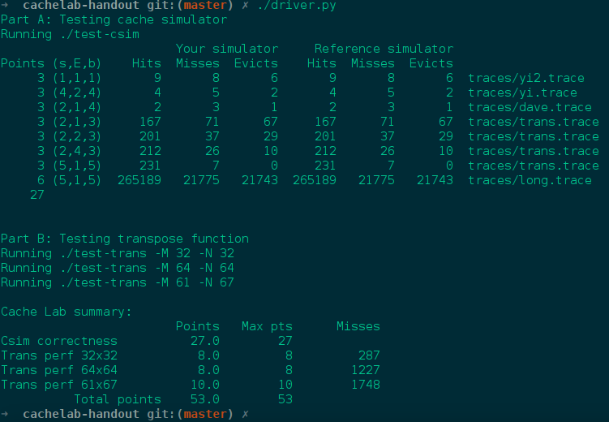
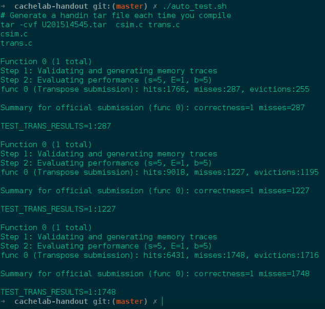

> 本文是华中科技大学**计算机体系结构**课程配套的全部试验，本实验节选CSAPP试验，
> 为其中第6个，同时为大家提供华中科技大学计算机学院的报告成风的恐怖一面

# 1 实验概述

## 1.1 实验目的

1. 理解cache工作原理
2. 加深Cache缓存组成结构对C程序性能的影响的理解

## 1.2 具体内容

1. 模拟cache缓存的行为

# 2 实验内容一

## 2.1实验任务

在csim.c提供的程序框架中，编写实现一个Cache模拟器：

输入：内存访问轨迹

操作：模拟缓存相对内存访问轨迹的命中/缺失行为

输出：命中、缺失和（缓存行）淘汰/驱逐的总数

## 2.2具体要求

模拟器必须在输入参数s、E、b设置为任意值时均能正确工作——即需要使用malloc函数（而不是代码中固定大小的值）来为模拟器中数据结构分配存储空间。

由于实验仅关心数据Cache的性能，因此模拟器应忽略所有指令cache访问（即轨迹中“I”起始的行）

假设内存访问的地址总是正确对齐的，即一次内存访问从不跨越块的边界——因此可忽略访问轨迹中给出的访问请求大小

main函数最后必须调用printSummary函数输出结果，并如下传之以命中hit、缺失miss和淘汰/驱逐eviction的总数作为参数：
## 2.3实验环境

如图1.1所示运行screenfetch获取的试验环境，从图中可以的看出来:
1. 操作系统 : Deepin 15.5非为稳定版
2. CPU : Intel Core i5-5200U @ 4x 2.2GHz
3. GPU : 集成显卡
4. 可用内存 : 7690Mib.

|  |
|:--:|
| 图1.1 试验的环境 |

## 2.4实验设计

本次试验要求对于Cache的基本工作原理含有的一个清晰的认识的， 理解全相连，组相连和
直接相连三者联系和区别， 体会三者一致性

下面简单叙述Cache的工作原理。

之所以含有Cache, 是由于SRAM虽然有更加昂贵，消耗资源等缺点， 但是相对于的DRAM来说
， 具有更快的速度，所以为了平滑高速的CPU和慢速的DRAM之间的速度的差距， Cache横空
出世。

当CPU访问某一个地址的时候， 如果不命中， 那么需要将内存中间对应的数据调入到的
Cache中间，由于局部性原理等原因， 这一个时候一般将该数据块的的所在的一个内存区域
全部调入到Cache中间， 所以需要有**块内地址**用于标志该内存地址在一个调度的Cache
块中间具体位置， 一个Cache块的大小一般B = 2 ** b

将内存地址低b位删除之后，剩下的部分用于实现在Cache中间寻找地址，Cache中间一般包
含S = 2 ** s 个块

如果每一次查询的cache中间的块的时候， 如果一个块放置在任何地址上面， 那么将会带
来硬件上面查找难度加大，如果每一个放置的位置是固定， 那么导致更加频繁的换入换出
， 中间的一个折中的方案就是， 每一个地址只可以放置到Cache中间的指定的几个块中间
， 这几个块称为组， 组大小一般为 E =  2 ** e的大小

可以发现， 当E = 1 的时候， Cache的防止策略是直接相连， 当E = sizeof(cache)的时
候， 是全相连, 两者之间的时候是组相连。

三者在Cache中间标志位如图1.2所示:

|  |
|:--:|
| 图1.2 试验的环境 |

图1.3说明两种Cache放置模式的示意图

|  |
|:--:|
| 图1.1 试验的环境 |


那么， 如何使用C语言模拟Cache的行为?

前面说过， cache 中间含有S个cache-set， 每一个cache-set中间含有E个cache-line, 所
以使用二维数组表示最好不过，而且对于E = 1 的特殊情况也是可以保证满足的。

cache-line 必定需要包含用于寻址tag, 用于为实现的替换算法， 所以需要为该
cache-lien添加一个lru标志，为了确定那些cache-line是有效， 也就是说， 该
cahce-line 装载的数据是内存中相对应的一致的数据， 所以需要添加一个valid位， 所以
对应的结构体为

```
typedef struct cache_line {
    char valid;
    mem_addr_t tag;
    unsigned long long int lru;
} cache_line_t;
```

那么，对应的cache就是cache-line的二维数组。

```
cache_line_t cache[S][E];
```

但是， 注意S和E都是用户的参数， 所以需要使用malloc的来实现空间的获取。

介绍了如何放置算法， 最后讨论一下淘汰算法，淘汰算法需要处理用到valid位和lru位，
当调入一个新的块的时候， 首先检查当前时候还有非valid位， 直接替代该valid位， 如
果所有的cache-line全部都是valid, 那么将lru数值最大替换出去， 和硬件不同， 查找最
大值就是简单的使用循环。


## 2.5设计实现

根据上述的试验设计， 试验最终目的是运行如下代码和目标输出一致

```
./csim -s 1 -E 1 -b 1 -t traces/yi2.trace
./csim -s 4 -E 2 -b 4 -t traces/yi.trace
./csim -s 2 -E 1 -b 4 -t traces/dave.trace
./csim -s 2 -E 1 -b 3 -t traces/trans.trace
./csim -s 2 -E 2 -b 3 -t traces/trans.trace
./csim -s 2 -E 4 -b 3 -t traces/trans.trace
./csim -s 5 -E 1 -b 5 -t traces/trans.trace
./csim -s 5 -E 1 -b 5 -t traces/long.trace
```

需要修改的文件只有csim.c 文件， 该文件根据的参数， 实现正确的输出。所以实现的一
共含有5个部分，**数据输出** **参数解析** **初始化模拟cache**  **数据访问处理**
和 **处理输入文件信息** **释放内存** 在`csim.c`文件对应函数如下

```
    printUsage(char* argv[])
    main(int argc, char* argv[])
    initCache
    accessData(mem_addr_t addr)
    replayTrace(char* trace_fn)
    freeCache
```

在分析每一个函数的作用之前, 先关注需要申明的的全局变量， 分别是cache S E B分别表
示，cache-line二维数组入口指针，cache-set的数量，每一个cache-set中间的cache-line
的数量，块的大小。

printUsage 和 Main用于处理IO, initCache 和 freeCache 用于处理cache这一个二维数组
的malloc和free, 实现的关键的是如何计算出来三个关键的数值 `eviction_count`
`hit_count` `miss_count`　三个数值

replayTrace实现对于输入文本逐行读入，然后将获取的地址信息传入到accessData中间，
然后 accessData　根据访问情况来更新`eviction_count` `hit_count` `miss_count`三个
数值, 也就是说accessData是整个试验的关键。

accessData的处理划分为三个部分：
1. 从输入的内存地址中间获取正确的`set_index` 和　`tag`
2. 遍历所在cache-set 上面所有的tag, 然后获取到可以放置的位置
3. 更新

对应的代码如下:

```
void accessData(mem_addr_t addr){
    unsigned long long int eviction_lru = 0;
    unsigned int eviction_line = 0xffffffff;
    // which line
    mem_addr_t set_index = (addr >> b) & set_index_mask;
    // who
    mem_addr_t tag = addr >> (s+b);

    cache_set_t cache_set = cache[set_index];
    for (int j = 0; j < E; ++j) cache_set[j].lru ++;

    for (int i = 0; i < E; ++i) {
        if(cache_set[i].tag == tag && cache_set[i].valid){
            hit_count ++;
            cache_set[i].lru = 0;
            return;
        }

        if(cache_set[i].lru > eviction_lru){
            eviction_lru = cache_set[i].lru;
            eviction_line = i;
        }
    }

    miss_count ++;
    if(cache_set[eviction_line].valid) eviction_count ++;
    cache_set[eviction_line].valid = 1;
    cache_set[eviction_line].tag = tag;
    cache_set[eviction_line].lru = 0;

}
```

## 2.6实验测试

<!-- 如何测试 -->
测试结果如图1.2所示， 测试结果和目标输出完全一致。

|  |
|:--:|
| 图1.3 测试结果 |

# 3实验内容二

## 3.1实验任务

在**trans.c**中编写实现一个矩阵转置函数`transpose_submit`，
要求其在参考Cache模拟器csim-ref上运行时对不同大小的矩阵均能最小化缓存缺失的数量
然后将实现放置到对应的提交函数中间。
`char transpose_submit_desc[] = "Transpose submission";`
`void transpose_submit(int M, int N, int A[N][M], int B[M][N]);`

## 3.2具体要求

限制对栈的引用——在转置函数中最多定义和使用12个int类型的局部变量，
同时不能使用任何long类型的变量或其他位模式数据以在一个变量中存储多个值。
原因：实验测试代码不能/不应计数栈的引用访问，而应将注意力集中在对源和目的矩阵的访问模式上
不允许使用递归。如果定义和调用辅助函数，在任意时刻，从转置函数的栈帧到辅助函数的栈帧之间最多可以同时存在12个局部变量。
例如，如果转置函数定义了8个局部变量，其中调用了一个使用4个局部变量的函数，
而其进一步调用了一个使用2个局部变量的函数，则栈上总共将有14个变量，则违反了本规则。
转置函数不允许改变矩阵A，但可以任意操作矩阵B。不允许在代码中定义任何矩阵或使用malloc及其变种。

## 3.3实验环境
试验环境和实验一中的试验环境相同

## 3.4实验设计

使用的测试的前提是*s = 5 E = 1 b= 5*的Cache参数，只可以知道使用的Cache是一个含有
的32个Cache-line，　每一个Cache-line含有32个数值，也就是只能容纳8个int。

为什么使用如下代码不会得到很好的结果，缘由是对于A都是顺序访问，但是对于B的访问并
不是顺序的访问，实际上对于B的访问是一个对于Cache的原理完全违背的访问方式。

对于B的每一次的访问都会导致一行数据被移动到Cache中间，但是该行之后再也不会使用，
直到被替换出去，所以可以想到的是是否可以的让对于A和B的访问都是具有的一定的局部性
，联想到体系结构中对于矩阵乘法的处理，自然想到是可以使用分块来实现对于让整个转置
的过程中间两者都是具有良好的访问局部性。

第一题要求miss次数在300以下，这个Cache可以容纳这个matrix的前8行。
分块的话，肯定是取8×8的比较合适。先读取A的一行，然后放入B的一列。
12个int变量，4个用来循环，其余8个用来存A中块的一行。

对于在对角线上的块，A中每读一行，会有一次miss，也就是miss次数是读取操作的1/8，对于B数组的话，第一次读取这行会产生一次miss，之后对于第i行，只有A中读到第i行的时候，会被移除出Cache，然后存的时候会产生一次miss。可以粗略计算为miss次数是读取次数的1/4。

对于不在对角线上的块，做转置的时候，A还是1/8的miss率，B的每行在Cache中和A的行不冲突 ，所以也是1/8的miss率。

使用第三个使用第一个测试方法，得到的结果也是不错的，可以达到满分，但是第二个就完
全达不到的要求了，　参考过其他人的一些想法之后，　需要采用策略示意图如下:

1.先考虑把A的上半部分存入到B，但是为了考虑Cache不冲突，所以把右上角的4×4的区域也存在B的右上角。对于在对角线上的块，A的miss率是1/8，B的左上角部分miss率是1/2。对于不在对角线上的块，A的miss率还是1/8，B左上角部分的miss率为1/4.

2. 接下来这步是减少miss率的关键，把A左下角的一列4个数据读出，B右上角的一行4个数据读出，都用int变量暂存，然后把前四个填入B右上角行中，后四个填入B的左下角行中。
 因为从B右上角读取的时候，把块放入了Cache，然后从A往B中填的时候，就不会出现miss操作。

来计算一下miss率，对于在对角线上的块，从A左下角读取miss率为1，B的右上角的操作miss率为1/4，B的左下角miss率为1/4。对于不在对角线的快，A的miss率为1/4，B右上角miss率为0，左下角miss率为1/4。

3. 最后一步就是把A的右下角填入B的右下角，对于在对角线上的块，A的miss率为1/4，B的miss率为1/2.不在对角线上的块，A，B的miss率都为0.

## 3.5设计实现

需要划分情况的来区分，根据上述的试验设计，可以知道对于参数为32 * 32 和　61 * 67
的可以使用8 * 8 的分块的实现，但是对于的64 * 64的事情没有这么简单，由于测试的样
例只有这三个，所以可以根据参数的不同需要书写出来两种的版本的代码来。

阅读框架代码的注释可以知道，当对于堆栈的访问是不会导致Cache模拟器的注意的，所以
只要的尽可能多的使用的堆栈，那么将会让miss的数目相对的减少，但是由于含有的12个局
部变量的限制, 也就是用于在分块的移动上面。

使用的代码如下所示

```
        int ii, jj, i, j;
        int block[8];

        for(jj = 0; jj < M; jj += Col){
		    for(ii = 0; ii < N; ii += Row){
		    	for(i = ii; i < ii + Row && i < N; i++){

                  for (j = jj;  j < jj + Col && j < M; ++j) {
                      block[j - jj] = A[i][j];
                  }

                  for (j = jj;  j < jj + Col && j < M; ++j) {
                      B[j][i] = block[j - jj];
                  }
		    	}
		    }
        }
```

对于64 * 64的困难之处在于的的要求真的很严格，使用的代码如下所示

```

    int ii, jj, i, j;
    int block[8];

    // 虽然有一部分没有使用，4 × 4 的赋值
    for(jj = 0; jj < M; jj += Col){
		for(ii = 0; ii < N; ii += Row){
            // 由于含有 8 个，所以分别将其中的两行赋值过去
            for (i = ii; i < ii + 4; ++i) {
                for (j = jj;  j < jj + 8; ++j) {
                    block[j - jj] = A[i][j];
                }
                for (j = jj;  j < jj + 8; ++j) {
                    if(j < jj + 4){
                        B[j][i] = block[j - jj];
                    } else {
                        B[j - 4][ i + 4] = block[j - jj];
                    }
                }
            }

            // 将B的右上移动到左下方
            // 将A的左下移动到B的右上

            for (i = ii; i < ii + 4; ++i) {
                for (j = jj; j < jj + 8; ++j) {
                    if(j < jj + 4)
                        block[j - jj] = B[jj + i - ii][ii + j - jj + 4];
                    else
                        block[j - jj] = A[ii + j - jj][jj + i - ii];
                }
                for (j = jj + 7; j >= jj; --j) {
                    if(j < jj + 4)
                        // 首先赋值左下方的位置
                        B[jj + 4 + i - ii][ii + j - jj] = block[j - jj];
                    else
                        B[jj + i - ii][ii  + j - jj] = block[j - jj];
                }
            }

            // 将A的右下移动到B的右下
            for (i = ii; i < ii + 4; ++i) {
                // move to the stack variable
                for (j = jj; j < jj + 4; ++j) {
                    block[j - jj] = A[i + 4][j + 4];
                }

                for (j = jj; j < jj + 4; ++j) {
                    B[j + 4][i + 4] = block[j - jj];
                }
            }

        }
    }
```

## 3.6实验测试

使用一下语句的单独测试结果
```
./test-trans -M 32 -N 32
./test-trans -M 64 -N 64
./test-trans -M 61 -N 67
```
测试如图2.1

|  |
|:--:|
| 图1.1 仅仅测试实验二结果　|

使用`driver.py`测试，测试结果如图2.1

|  |
|:--:|
| 图1.2 两个试验的汇总测试结果　|

## 4实验总结与心得

本次试验试验体验良好，在试验的过程中间不是完全依赖自己搭建，而是在阅读的被人的代
码的基础上面的只需要完成核心的代码，在试验１中间IO问题如果不一致，那么往往会浪费
非常多的时间，而且没有什么意义。

两个试验让我对于的Cache的工作原理和使用软件的方法实现提高的Cache命中率有了一个清
晰和直观的体会。
# 参考文献
1. 计算机系统结构教程(第二版)　张程曦　王志英　等
2. 计算机体系结构:量化分析方法
3. 计算机组成原理 秦磊华　吴非　莫正坤
