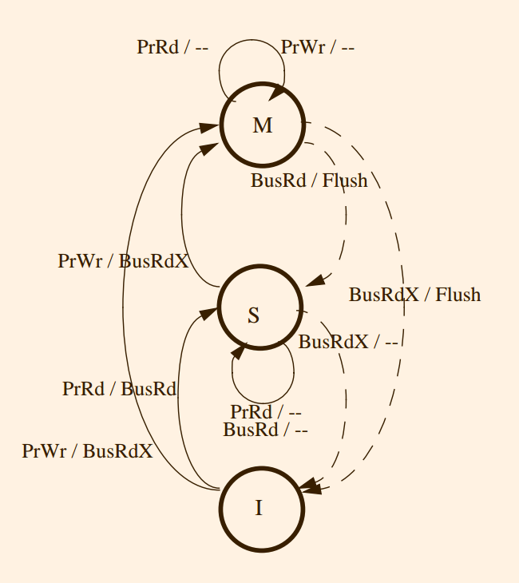
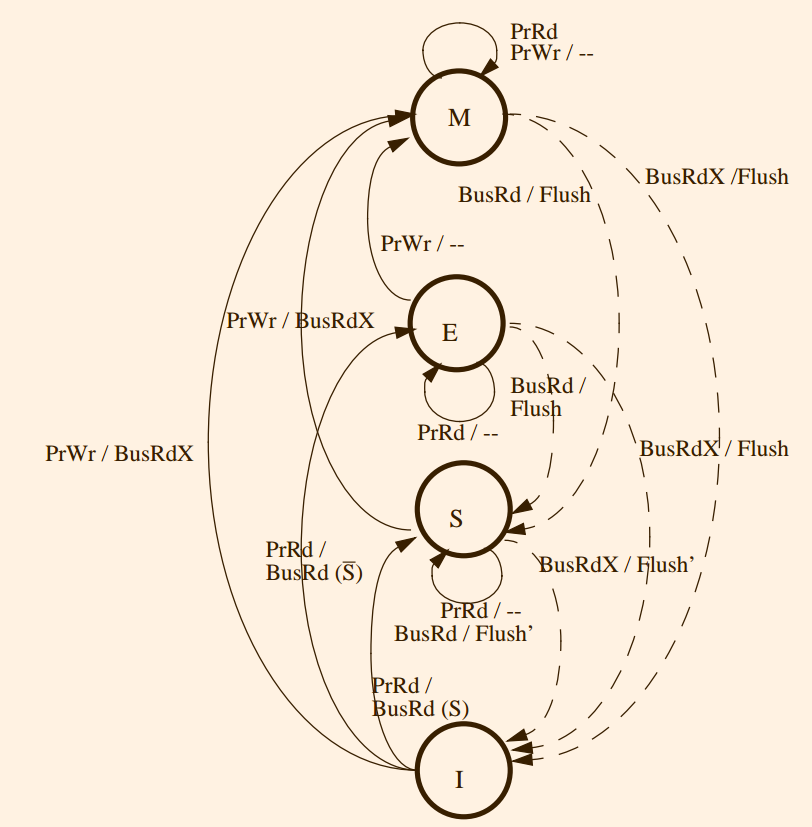
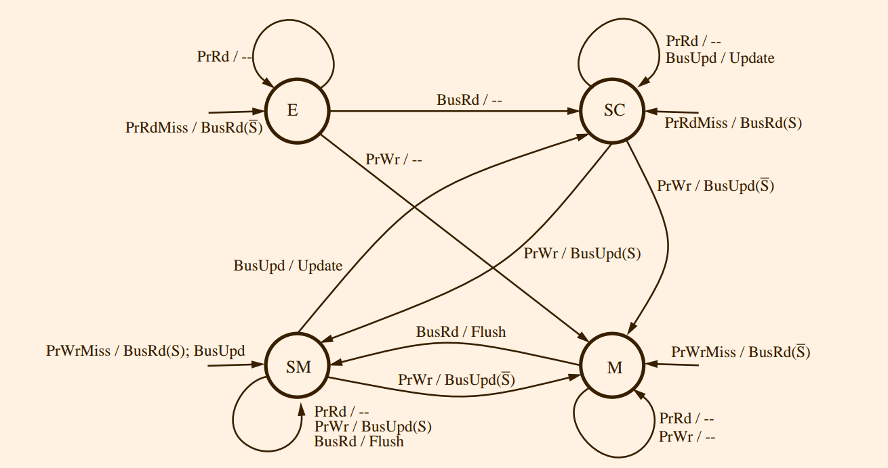

The most prevalent form of parallel architecture is the multiprocessor of moderate scale that provides a global physical address space and symmetric access to all of main memory from any processor, often called a Symmetric Multiprocessor or SMP

The efficient sharing of resources, such as memory and processors, makes these machines attractive as “throughput engines” for multiple
**sequential** jobs with varying memory and CPU requirements, and the ability to access all shared
data efficiently using ordinary loads and stores from any of the processors makes them attractive
for parallel programming.

These features are also very useful for the operating system

>  In multiprocessor programming, what's the role of library and os in parallel programming ?

Since all communication and local computation generates memory accesses in a shared address space, from a system architect’s perspective the key high-level design issue is the **organization of the extended memory hierarchy**

## 5.2 Cache Coherence

#### 5.2.1 The Cache Coherence Problem
Cache coherence problems arise even in uniprocessors when I/O operations occur

By **memory operation**, we mean a single read (load), write (store), or read-modify-write access to a memory location.
Instructions that
perform multiple reads and writes, such as appear in many complex instruction sets, can be
viewed as broken down into multiple memory operations, and the order in which these memory
operations are executed is specified by the instruction.

These memory operations within an
instruction are assumed to execute **atomically** with respect to each other in the specified order,
i.e. all aspects of one appear to execute before any aspect of the next. 

A **memory operation issues** when it leaves the processor’s internal environment and is presented to the memory system,
which includes the caches, write-buffers, bus, and memory modules.

More formally, we say that a multiprocessor memory system is coherent if the results of any execution of a program are such that, for each location, it is possible to construct a hypothetical
serial order of all operations to the location (i.e., put all reads/writes issued by all processors into a total order) which is consistent with the results of the execution and in which:
1. operations issued by any particular processor occur in the above sequence in the order in which they were issued to the memory system by that processor, and
2. the value returned by each read operation is the value written by the last write to that location in the above sequence.

#### 5.2.2 Cache Coherence Through Bus Snooping
A simple and elegant solution to the cache coherence problem arises from the very nature of a bus.
> anything more than bus can we use ?

The key properties of a bus that support coherence are the following: All transactions that appear on the bus are visible to all cache controllers, and they are visible to the controllers in the same order (the order in which they appear on the bus)

The simplest illustration of maintaining coherence is a system that has single-level write-through caches

> Snooping shall not have state, but it does. Using `exclusive` state, the protocol can eliminating unnecessary bus traffic.
> So where are the state bits stored ? Maybe just appended to block.

The cache policy is defined by the cache block state transition diagram, which is a finite state machine.

For a write-through, write-no-allocate cache only two states are required: valid and invalid
A write-back cache requires an additional state, indicating a “dirty” or modified
block
> what's write-no-allocate

In a snoopy cache coherence scheme, each cache controller receives two sets of inputs: the processor issues memory requests, and the bus snooper informs about transactions from other
caches

It(snooping) is specified by the following components:
1. the set of states associated with memory blocks in the local caches;
2. the state transition diagram, which takes as inputs the current state and the processor request or observed bus transaction, and produces as output the next state for the cache block; and
3. the actual actions associated with each state transition, which are determined in part by the set of feasible actions defined by the bus, cache, and processor design.

## 5.3 Memory Consistency
<!-- Skip this chapter -->

## 5.4 Design Space for Snooping Protocols
By extending the requirements on the cache controller and exploiting the properties of the bus, the loads and stores that are inherent to the program are used implicitly to keep the caches coherent and the serialization of the bus maintains consistency
> `the loads and stores that are inherent to the program` is what ?

Thus, extra care is required to ensure that enough information is transmitted over the bus to maintain coherence. We will also see how the protocols provide sufficient ordering constraints to maintain write serialization and a sequentially consistent memory model.

In general, a cache is said to be the **owner** of a block if it must supply the data upon a request for that block.

A cache is said to have an **exclusive** copy of a block if it is the only cache with a valid copy of the block (main memory may or may not have a valid copy)

On a write miss, then, a special form of transaction called a read-exclusive is used to tell other caches about the impending write and to acquire a copy of the block with exclusive ownership.

The cache coherence actions are driven by these two types of transactions: **read** and **read-exclusive**

#### 5.4.1 A 3-state (MSI) Write-back Invalidation Protocol
basic invalidation-based protocol for write-back caches

1. **Invalid** has the obvious meaning.
2. **Shared** means the block is present in unmodified state in this cache, main memory is up-to-date,
and *zero or more* other caches may also have an up-to-date (shared) copy.
3. **Modified**, also called dirty, was discussed earlier; it means that only this processor has a valid copy of the block in its
cache, the copy in main memory is stale, and no other cache may have a valid copy of the block
(in either shared or modified state).

Before a shared or invalid block can be written and placed in the modified state, all the other potential copies must be invalidated via a read-exclusive bus transaction.

The processor issues two types of requests: reads (**PrRd**) and writes (**PrWr**). 

We assume that the bus allows the following transactions:
1. Bus Read (**BusRd**): The cache controller puts the address on the bus and asks for a copy that
it does not intend to modify. The memory system (possibly another cache) supplies the data.

2. Bus Read-Exclusive (**BusRdX**): The cache controller puts the address on the bus and asks for
an exclusive copy that it intends to modify. The memory system (possibly another cache) supplies the data. All other caches need to be invalidated. This transaction is generated by a PrWr
to a block that is either not in the cache or is in the cache but not in modified state. Once the
cache obtains the exclusive copy, the write can be performed in the cache. The processor may
require an acknowledgment as a result of this transaction.

3. Writeback (**BusWB**): The cache controller puts the address and the contents for the memory
block on the bus. The main memory is updated with the latest contents. This transaction is
generated by the cache controller on a writeback; the processor does not know about it, and
does not expect a response.

4. The other new concept needed to support write-back protocols
is that in addition to changing the state of cached blocks, the cache controller can intervene in the
bus transaction and “**flush**” the contents of the referenced block onto the *bus*, rather than allow
the memory to supply the data
> great idea, flush to is more quick than memory access !

#### 5.4.2 A 4-state (MESI) Write-Back Invalidation Protocol
A serious concern with our MSI protocol arises if we consider a sequential application running on a multiprocessor; When it reads in and modifies a data item, in the MSI protocol two bus transactions are generated even though there are never any sharers.
The first is a BusRd that gets the memory block in S state, and the second is a BusRdX (or BusUpgr) that converts the block from S to M state.

By adding a state that indicates that the block is *the only (exclusive)
copy but is not modified* and loading the block in this state, we can save the latter transaction
since the state indicates that no other processor is caching the block.

This new state, called **exclusive-clean** or exclusive-unowned or sometime simply exclusive, indicates an intermediate level of
binding between shared and modified.

It is exclusive, so unlike the shared state it can perform a
write and move to modified state without further bus transactions;
but it does imply ownership, so
unlike in the modified state the cache need not reply upon observing a request for the block
(memory has a valid copy).

I and M have the same semantics as before. E, the exclusive-clean or just exclusive state, means that only one cache (this cache) has a copy of the block, and it has not been
modified (i.e., the main memory is up-to-date). S means that potentially *two or more* processors
have this block in their cache in an unmodified state.

The notation BusRd(S) means that when the bus read transaction occurred the signal “S” was asserted, and BusRd(S) means “S” was unasserted.

There must be an additional signal, the shared signal (S), available to the controllers in order to determine on a BusRd if any other cache currently holds the data

Notice that it is possible for a block to be in the S state even if no other copies exist, since copies may be replaced (S -> I) without notifying other caches

Whenever feasible, the protocol also makes caches, rather than main memory, supply data for BusRd and BusRdX transactions. Since multiple processors may have a copy of the memory block in their cache, we need to select only one to supply the data on the bus. Flush’ is true only for that processor; the remaining processors take null action.

#### 5.4.3 A 4-state (Dragon) Write-back Update Protocol
a basic update-based protocol for writeback caches

The Dragon protocol consists of four states: exclusive-clean (E), shared-clean (SC), shared-modified (SM), and modified(M)

1. **Exclusive-clean** (or exclusive) again means that only one cache (this cache) has a copy of the block, and it has not been modified (i.e., the main memory is up-todate)
2. **SC** means that potentially two or more processors (including this cache) have this block in their cache, and main memory may or may not be up-to-date.
3. **SM** means that potentially two or more processor’s have this block in their cache, main memory is not up-to-date, and it is this processor’s responsibility to update the main memory at the time this block is replaced from the cache.
4. **M** means, as before, that the block is modified (dirty) in this cache alone, main memory is stale, and
it is this processor’s responsibility to update main memory on replacemen

