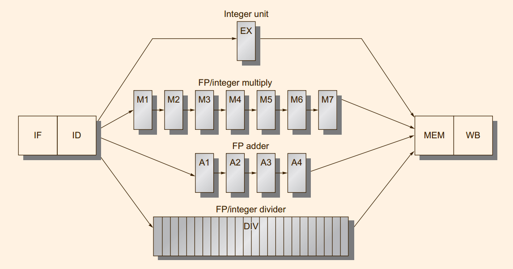
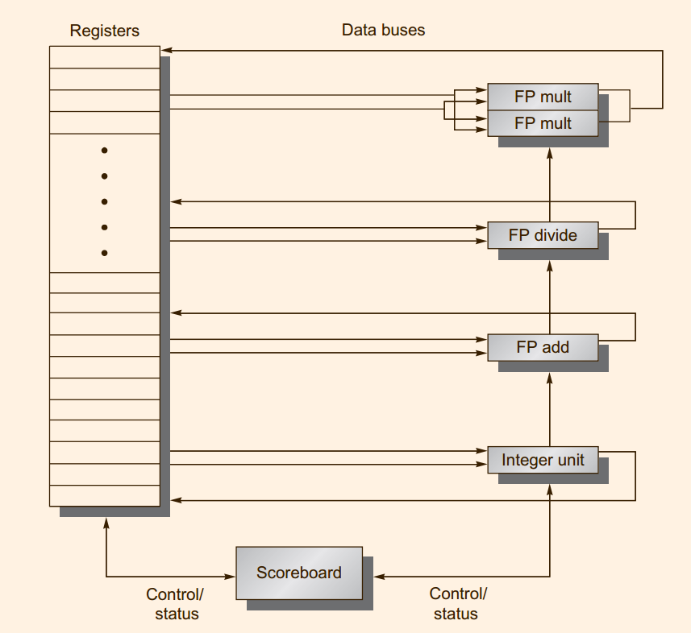

# Pipelinng: Basic and Intermediate Conceptes

Exceptions can be characterized on five semi-independent axes

| axes                                          | description                                                                                                                                                                                                                                                                                                                                                                                                                                |
|-----------------------------------------------|--------------------------------------------------------------------------------------------------------------------------------------------------------------------------------------------------------------------------------------------------------------------------------------------------------------------------------------------------------------------------------------------------------------------------------------------|
| **synchronous** versus **asynchronous**       | Asynchronous events usually can be handled after the completion of the current instruction, which makes them easier to handle.                                                                                                                                                                                                                                                                                                             |
| **user requested** versus **coerced**         | User-requested exceptions can always be handled after the instruction has completed. Coerced exceptions are caused by some hardware event that is not under the control of the user program. Coerced exceptions are harder to implement because they are not predictable                                                                                                                                                                   |
| **User maskable** versus **user nonmaskable** | mask simply controls whether the hardware responds to the exception or not                                                                                                                                                                                                                                                                                                                                                                 |
| **Within** versus **between instructions**    | Exceptions that occur within instructions are usually synchronous, because the instruction triggers the exception. It’s harder to implement exceptions that occur within instructions than those between instructions, because the instruction must be stopped and restarted. Asynchronous exceptions that occur within instructions arise from catastrophic situations (e.g., hardware malfunction) and always cause program termination. |
| **resume** versus **terminate**               |                                                                                                                                                                                                                                                                                                                                                                                                                                            |


| Exception type      | Synchronous vs. asynchronous | User request vs. coerced | User maskable vs. nonmaskable | Within vs. between instructions | Resume vs. terminate |
|---------------------|------------------------------|--------------------------|-------------------------------|---------------------------------|----------------------|
| I/O device  request | Asynchronous                 | Coerced                  | Nonmaskable                   | Between                         | Resume               |
Invoke operating system Synchronous User request Nonmaskable Between Resume

Tracing instruction
execution
Synchronous User request User maskable Between Resume
Breakpoint Synchronous User request User maskable Between Resume
Integer arithmetic
overflow
Synchronous Coerced User maskable Within Resume
Floating-point arithmetic
overflow or underflow
Synchronous Coerced User maskable Within Resume
Page fault Synchronous Coerced Nonmaskable Within Resume
Misaligned memory
accesses
Synchronous Coerced User maskable Within Resume
Memory protection
violations
Synchronous Coerced Nonmaskable Within Resume
Using undefined
instructions
Synchronous Coerced Nonmaskable Within Terminate
Hardware malfunctions Asynchronous Coerced Nonmaskable Within Terminate
Power failure Asynchronous Coerced Nonmaskable Within Terminate

If a pipeline provides the ability for the
processor to **handle the exception**, **save the state**, and **restart without affecting the
execution of the program, the pipeline or processor** is said to be restartable.

If the pipeline can be stopped so that the instructions
just before the faulting instruction are completed and those after it can be restarted
from scratch, the pipeline is said to have **precise exceptions**


There are a number of different aspects to the hazard detection and forwarding for a
pipeline like that shown above
1. Because the divide unit is not fully pipelined, structural hazards can occur.
These will need to be detected and issuing instructions will need to be stalled.
2. Because the instructions have varying running times, the number of register
writes required in a cycle can be larger than 1
3. Write after write (WAW) hazards are possible, because instructions no longer
reach WB in order. Note that write after read (WAR) hazards are not possible,
because the register reads always occur in ID.
4. Instructions can complete in a different order than they were issued, causing
problems with exceptions; we deal with this in the next subsection.
5. Because of longer latency of operations, stalls for RAW hazards will be more
frequent

There are two different ways to implement this interlock(structure hazard).
1. The first is to track the use of the write port in the ID stage and to stall an instruction before it issues, just as
we would for any other structural hazard
2.  An alternative scheme is to stall a conflicting instruction when it tries to enter
either the MEM or WB stage


Assuming that the pipeline does all hazard detection in ID, there are three checks that must be performed
before an instruction can issue:
1. Check for structural hazards
2. Check for a RAW data hazard
3. Check for a WAW data hazard

This problem arises because instructions are completing in a different order
than they were issued. There are four possible approaches to dealing with outof-order completion.
1. The first is to ignore the problem and settle for imprecise
exceptions
2. A second approach is to buffer the results of an operation until all the operations
that were issued earlier are complete
3. A third technique in use is to allow the exceptions to become somewhat imprecise, but to keep enough information so that the trap-handling routines can create a
precise sequence for the exception
4. The final technique is a hybrid scheme that allows the instruction issue to continue only if it is certain that all the instructions before the issuing instruction will
complete without causing an exception


To allow an instruction to begin execution as soon as its operands are available, even if a predecessor is stalled, we must separate the issue process
into two parts: checking the structural hazards and waiting for the absence of a data
hazard

The four steps, which replace the ID, EX, and WB steps in the standard
RISC V pipeline, are as follows

### Scoreboard


To control the execution of the instructions, the scoreboard maintains three status tables:
1. Instruction Status: Indicates, for each instruction being executed, which of the four stages it is in.
2. Functional Unit Status: Indicates the state of each functional unit. Each function unit maintains 9 fields in the table:
  1. Busy: Indicates whether the unit is being used or not
  1. Op: Operation to perform in the unit (e.g. MUL, DIV or MOD)
  1. Fi: Destination register
  1. Fj,Fk: Source-register numbers
  1. Qj,Qk: Functional units that will produce the source registers Fj, Fk
  1. Rj,Rk: Flags that indicates when Fj, Fk are ready for and are not yet read.
3. Register Status: Indicates, for each register, which function unit will write results into it.

```
function issue(op, dst, src1, src2)
    /** the instruction is stalled until instructions intending to write to the same register
        are completed. The instruction is also stalled when required functional units are
        currently busy.
    */
    /** FU can be any functional unit that can execute operation op */
    wait until (!Busy[FU] AND !Result[dst]);
    Busy[FU] ← Yes;
    Op[FU] ← op;
    Fi[FU] ← dst;
    Fj[FU] ← src1;
    Fk[FU] ← src2;
    Qj[FU] ← Result[src1];
    Qk[FU] ← Result[src2];
    Rj[FU] ← Qj[FU] == 0;
    Rk[FU] ← Qk[FU] == 0;
    Result[dst] ← FU;
```

```
 function read_operands(FU)
    wait until (Rj[FU] AND Rk[FU]);
    Rj[FU] ← No;
    Rk[FU] ← No;
```

```
 function execute(FU)
    // Execute whatever FU must do
```
In general, then, a completing instruction cannot be allowed to write its results when:
1. There is an instruction that has not read its operands that precedes (i.e., in order of issue) the completing instruction
2. One of the operands is the same register as the result of the completing instruction.

```
 function write_back(FU)
    wait until (∀f {(Fj[f]≠Fi[FU] OR Rj[f]=No) AND (Fk[f]≠Fi[FU] OR Rk[f]=No)})
    foreach f do
        if Qj[f]=FU then Rj[f] ← Yes;
        if Qk[f]=FU then Rk[f] ← Yes;
    Result[Fi[FU]] ← 0; // 0 means no FU generates the register's result
    Busy[FU] ← No;
```
Because the operands for an instruction are read only when both operands are
available in the register file, this scoreboard does not take advantage of forwarding
