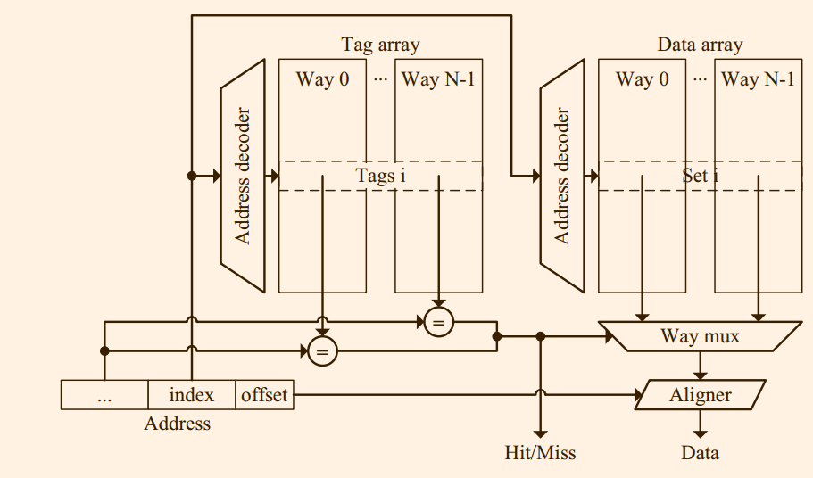
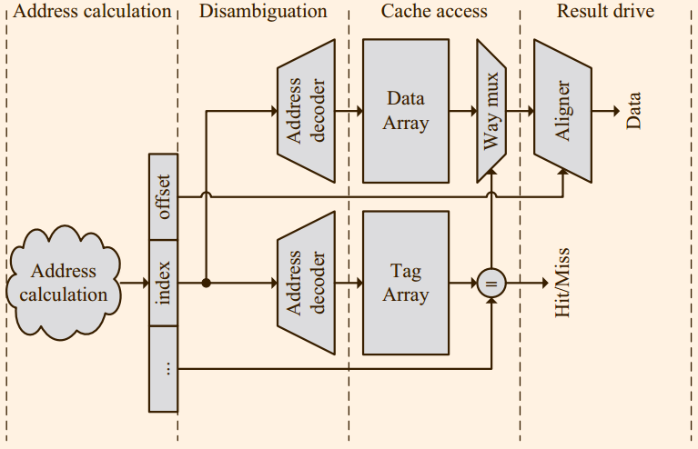

# 2 Cache
Cache存储最近使用过的数据和指令。

Cache一般被划分三层，容量逐渐增加。第一级分为数据和指令两种cache, 相连度很低。

通常，指令和数据都是通过虚拟地址访问的。Cache可以使用虚拟地址或者物理地址进行索引，前者可以让地址翻译和Cache访问并行。为了防止重名问题，tag必须使用物理地址。

访存指令需要数个步骤才可以完成:
1. AGU(address generation unit)中间生成地址。
2. disambiguation决定一条指令是否可以执行。

指令cache更加简单，因为没有写操作，但是需要使用分支预测器来预测下一次访问的位置。

接下来，首先介绍虚拟地址转换，然后介绍数据Cache的构造，最后简要分析Cache的设计可选项。

## 2.1 地址转换
为了实现快速的地址变化，需要使用TLB。TLB使用虚拟地址访问，

## 2.2 Cache的结构
Cache主要划分成为数据阵列和标签阵列。

### 2.2.1 并行访问数据阵列和标签阵列

### 2.2.2 并行访问数据阵列和标签阵列

### 2.2.3 关于相联性的一些考虑

## 2.3 Lockup-free Caches
对于一个阻塞Cache, 如果使用未命中，它会逐级向下访问，直到提交数据，期间会拒绝提供访存服务。

非阻塞Cache则会允许上一条未命中尚未处理完的情况下继续提供服务。需要添加两个部件:
1. miss status/information holding register
2. fill buffer

在非阻塞的上下文中间，不命中被划分成为三种情况:
1. 主不命中
2. 次不命中
3. 结构冲突不命中

接下来我们会分析MSHRs的几种设计:
### 2.3.1 隐式地址MSHRs
每一个最多block最多允许一次不命中，其后的造成结构冲突

### 2.3.2 显示地址MSHRs

增加block offset字段

### 2.3.3 Cache内MSHRs
使用标志阵列指示当前的状态为临时态，数据阵列存储格式信息。

## 2.4 多通道Cache
为了实现高带宽的执行，当代大多数的处理器都是每一个周期都是多发射的。有很多方法可以实现双通道的Cache(每一个周期可以支持两个操作)，各有各的取舍。

### 2.4.1 真正的多通道Cache设计
除了数据阵列和标签阵列，其他部件都是双倍，虽然这一种设计提供的带宽最高，但是会影响时钟周期。
*allowing two writes per cycle in the cache does not necessarily imply two write ports to the arrays if the processor can guarantee that 1 bit cannot be written twice in a cycle*
> 什么J8意思

### 2.4.2 矩阵重复
通过重复阵列，在不降低时钟周期的情况下可以提高带宽，但是带来面积和数据同步的问题

### 2.4.3 虚拟多通道设计
此方案不具有扩展性，而且当代处理器的频率高达GHZ,难以实现double-pump数据阵列。

### 2.4.4 Multibanking
将数据阵列划分成为不同的bank, 当访问不同的bank的时候，那么就可以实现多通道。
> skip something

## 2.5 指令Cache
> skip, I am tired
