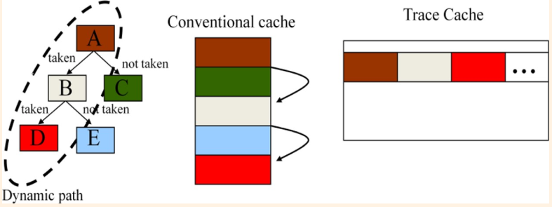

# 指令读取
指令读取单元是为处理器提供指令，也就是指令被处理的第一个部分。指令读取单元通常由指令cache和相应的地址计算逻辑组成。

高性能处理器可以每一个周期读取一条指令，这也就意味着每一个周期都需要计算出来新的指令地址，也就是说下一跳指令的地址和访问指令cache是同时进行的。然而分支指令导致这一个过程变得异常复杂，因为只有当分支指令执行结束之后才可以知道下一条指令的地址。所以，处理器需要预测下一条指令的位置。

预测分为两个部分，第一个部分预测是否跳转，第二个部分预测跳转的地址，这一个功能被叫做branch target buffer（BTB）的实现。有的处理器将函数（subroutine)作为一种特殊情况，使用return address stack（RAS）来预测。

图3.1是指令读取的high-level block diagram, 有很多可选的部件（multicycle predictors, multiple prediction levels, 等等), 但是此图展示了每一个周期读取新的指令的高性能处理器的设计思路。正如第二章提到的，图中的发数据阵列（data array）和标签阵列（tag array）是并行访问。我们也可以看到，指令TLB的访问和指令cache的访问也是并行。在这一个设计中间，使用虚拟地址对cache array寻址，而使用物理地址来比较tag。图3.1中，所有地址预测器都是在第一个阶段并行访问的，在下一个阶段进行选择哪一个预测期的输出，这样的设计是为了实现更高的频率，虽然读取一个指令需要四个周期，但是如果完全流水线化，相当于每一个周期都独处了一条指令。
> virtual address index cache array, how it works
> now that only fetch one instruction per circle, so what's meaning of multiple issue

## 指令cache
指令cache中间保存最近会被读取的指令。指令cache通常的配置为: 容量为几十KB, 组相连，cache line大约为64字节。指令cache可以使用虚拟地址或者物理地址寻址，由于地址翻译可以并发的进行，前者可以将访问cache进行的更加早。由于需要处理别名问题，标签一般都是使用物理地址。

在超标量处理器中间，每一个周期必须读取多个指令，通常从同一个cache line中间读取多个字节来实现这一个要求，这一个方法让单一的memory port提供所需的带宽成为可能。字节流被读取，下一步就是将它划分成为指令，如果指令长度是固定，划分操作是很简单的。

#### Trace Cache
传统的cache按照指令的静态顺序存储。然而Trace cache按照指令的动态执行存储，图3.2展示了两者的不同，两者的区别含有两个关键点:数据重复和effective bandwidth per memory port。在传统cache中间，每条指令只会在cache中间出现一次，但是trace cache中间的出现次数取决于指令的执行。此外，传统的每一个memory port 的最大带宽被分支跳转的频率所限制。

## 3.2 Branch Target Buffer
Predicting whether an instruction is a branch can be done with a hardware table that is indexed
with the current fetch address and, for every entry, has as many elements as instructions in a fetch
block. A single bit per element may suffice. This bit indicates whether the corresponding instruction is expected to be a branch or not. By adding more bits, one can also predict the type of branch
(conditional, call, return, etc.). Once the fetch block is available, the prediction is checked, and in
case of misprediction, the table is update
为了预测一条指令是否是分支指令，可以使用一个使用fetch address作为索引，每一个条目包含和fecth block一样多的位的硬件来实现。
> 为什么还需要预测一条指令是不是branch指令

大多数跳转指令的目标地址是PC-Relative的，所以它们可以在被fetch的时候计算出来目标地址，而不是使用预测的方式，但是另外的需要一个气泡，对于高性能的处理器，这一点不可接受。

为了消除这一个气泡，需要使用使用一个使用fetch address作为索引，对于instruction block中间每一台指令含有一个项的硬件，这一个硬件和之前描述用于预测指令是否为分支指令的硬件和合并起来，被叫做BTB

## 3.3 返回地址栈
返回地址栈的结构更加简单，大多数情况下，精度更高。

## 3.4 条件分支预测
是否进行跳转，必须预测，否则在很多处理器中间需要等待数十个周期。条件分支预测可以静态，动态或者两者协作的完成。

### 3.4.1 静态预测
静态预测需要使用使用profiling information,如果没有，那么对于循环倾向于分支是跳转的，其它的则难以判断。

静态预测需要的硬件资源很少，在指令中间添加一个位就可以。
### 3.4.2 动态预测
现代处理器中间如果分支预测失败的代价非常高，仅仅使用2bit局部预测器是不行的。

图3.5是gshare预测器。
> this part is easy, we will make a conclusion soon
