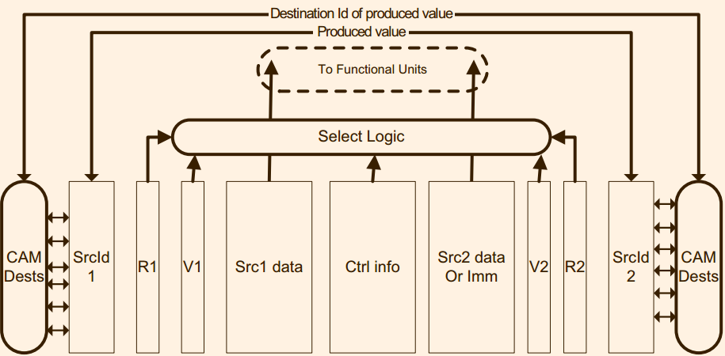

# 第六章　发射
## 6.1 前言
在流水线中，**发射**的下一个阶段是**功能单元**。目前，主要有两种发射策略：**顺序发射**和**乱序发射**。前者按照程序顺序，后者只要指令的操作数准备好了就发射。

大多数新的处理器使用乱序发射策略。实现乱序发射策略的方法很多。实际上，发射阶段的实现依赖于其后的阶段的实现策略，比如说，如果在分发阶段(dispatch stage)的前后含有读取操作数的硬件，那么发射阶段就是不需要含有读取操作数的硬件。当然，是否基于reservation station, distributed station, distributed queues或者unified issue queue对于发射阶段的具体实现也有很大的影响。

本章仅仅接受在现有处理器中间最经常使用的发射策略。
## 6.2 顺序发射逻辑单元
> This kind of issue logic is sometimes implemented at the decode stage of the processor due to its simplicity using scoreboarding.
> 为什么issue logic 放到decode stage

在使用计分板策略的时候，由于实现简单，这种发射逻辑单元有时候使用在解码阶段。计分板通常含有两个表：**数据依赖表**和**资源表**。这些表会随着硬件资源的约束而有所变化。

> This state ranges from nonavailable, so that the instruction cannot be issued yet, until value available, either at some bypass level or written into the register file

使用将要发射的指令的操作数寄存器编号来索引数据依赖表的项，每一个项记录着对应的寄存器值的状态，这些状态包括nonavailable和available，分别表示需要的操作数未就绪和就绪。
当寄存器被写入或者bypass level的时候，操作数从未就绪状态变为就绪状态。第七章将描述更多关于bypass的内容。

由于有的功能单元比如触发器并没有办法每一个周期完成一个操作，资源表中间记录执行资源是否就绪。

超长指令字依赖于软件而不是硬件来避免数据依赖和资源未就绪的问题。

## 6.3 乱序发射逻辑单元
本章假设使用unified issue queue, 并且在此基础上分析两种情景。

unified issue queue 会存储所有重命名过的指令。reservation station 或者　distributed issue station queue会根据指令依赖的资源类型将指令存储在不同的位置。

两种情景的区别在于，在指令送到发射队列之前，操作数是否会首先被读取。

> Nevertheless, since this is an **orthogonal design decision**, for the sake of clarity, we will assume a **merged register file** for both implementations. 

### 6.3.1 在发射之前读取操作数

##### 6.3.1.1 反射队列的分配

### 6.3.2 在发射之后读取操作数

## 6.4 访存指令发生逻辑

访存指令的数据依赖在重命名阶段无法被检测出来， 这些基于内存的数据依赖只有在指令被发射并且其地址被计算出来才能被检查出来。

负责检查基于内存的数据依赖的机制被称作memory disambiguation policy（MDP）。不同的处理器实现的MDP大相径庭。
表6.1展示了不同微架构上面的典型的方案。这些方案大致分为两种：推测和非推测（nonspeculative and speculative disambiguation policies）

选择合适的方案对于处理器的性能和设计复杂性影响巨大。由于大约有30%的指令是访存指令，如果使用非常保守的方案，那么可能导致不必要的指令顺序执行，这将导致性能的下降，另一方面，激进的方案可能导致异常复杂的失败预测恢复机制以及大幅增加的功耗。

> order is used for *access memory* or *issue*
> 无论是那一种方案，都是要求写操作是顺序，但是，如果地址不相同，那么写顺序性有什么必要?

### 6.4.1 非推测MDP(Nospeculative Memory Disambiguation)
非推测MDP只有之前的存储操作计算出来它们的地址之后才会发生新的访存指令，这一种方案主要被划分为三种，total ordering, load ordering with store ordering and partial ordering.

在total ordering中间，所有的访存操作都是顺序的， 目前没有任何一个处理器采用这一个方案。
> 时刻注意发两个问题，访存操作和计算地址，涉及到的问题含有两个!
> 其实可以和一致性的部分一同分析一下

load ordering with store ordering需要保证所有的读操作和写操作都是顺序的，但是读操作不需要等到先前的写操作。这一个方案被AMD K6所采用。
在partial ordering中间，一条读操作在只要之前的所有写操作完成之后就可以马上开始，这一个方案被MIPS R10000以及AMD K8所采用。

注意，memory disambiguation可以在写操作的地址被计算出来就开始。
所以，有些处理器将写操作划分成为两个部分，首先计算出地址，然后获取
数据。有些情况下，就算处理器早早地将地址计算出来，也会等到存储操作
成为最后未完成的最后一条指令之后才会写数据。

#### 6.4.1.1 案例分析1: AMD K6处理器上load ordering with store ordering 
AMD K6中间将读和写划分成为两个流水线， *both pipelines are decoupled with some level of communication*, 但是在每条流水线里面指令顺序固定不变。
访存流水线包括一下几个部分:
1. 读队列: 在指令重命名之后，读操作送入队列中间，并且一直待到该指令队列到达开头并且需要的源操作数就绪。
2. 地址生成器: 负责将读写操作的源操作数计算出来该指令的访问地址。
3. 写队列：和读队列类似
4. 写缓冲：按照程序顺序记录写操作，如果该存储操作 成为最后未完成的最后一条指令，那么就可以更新内存。

图7.1描述AMD k6的访存流水线，上部分是读操作，下部分是写操作。

读写队列都是等待指令到达队首并且操作数已经就绪，需要指出的是，写队列不需要等到要写入的值就绪就可以发射了。

在READ阶段，指令获取通过访问寄存器文件或者重定向网络来获取操作数。

在地址生成阶段(ADDRESS GENERATION),访存地址被计算出来，如果指令是写操作，在此阶段需要等待需要被写入的值，如果没有就绪，那么将会阻塞整个写队列。

获取了地址之后，就会进入到disambiguation阶段， 如果是写操作，那么数据和地址都存储到store buffer中间
如果是一条读操作，那么需要检查包括store buffer，地址生成阶段，以及issue阶段中间先于此操作的写指令是否写入以及可能写入到相同的位置。
> disambiguation操作似乎仅仅是为了load操作而设置的，本阶段需要检查的关键是如何确定我怎么会知道哪一个store操作是在该操作之后的

我们可能会想，即使不保证顺序读，依旧保证内存一致性。在X86手册中间有一个实现内存一致性的简单描述:
stores have to be visible in order, and loads have to be perceived as executed in order.这是可能，比如AMD K8L, 又比如Intel Core中允许读操作乱序执行，而且允许读操作overtake那些尚未计算出来地址的写操作。

#### 6.4.1.1 案例分析1: MIPS R10000处理器上partial ordering
在MIPS R10000写操作需要严格按照顺序，但是读操作只需要保证先于其的写指令的地址已经被计算出来了。其和memory disambiguation的流水线布局如图6.8所示。

流水线的主要部分如下:
1. 读写队列: 用于存储读写指令，此时源操作数尚未就绪。
2. 不确定矩阵
3. 依赖矩阵:用于保证pariial ordering
3. 地址生成器
4. 地址队列

> 不确定矩阵的作用到底是做什么，不就是为了实现顺序发射吗？显然需要更多的细节

### 6.4.2 推测的Memory Disambiguation
假定读操作不依赖任何先前的写操作。
#### 6.4.2.1 案例分析: Alpha 21264
流水线包含一下内容：
1. 读写队列
2. 读队列
3. 写队列
4. 等待表
> 关于等待表有一个问题：为什么需要记录virtual pc,　为什么是16384周期之后就是全部都是１
> wait table为什么需要放置到issue fetch阶段，此时地址操作数尚未就绪。
> Load/Store queue中间在等待源操作数，wait table 在此处应该只是一个简单推测防止在相同的位置反复跌倒

In the case of a store, we wait for the source operands required to compute the address and the *data conversely
to what happened on previous case studies*
> 先前的案例？，相反地?

*Moreover, they compare its
address with the address of younger loads, and in case they match, a load-load memory violation
trap is triggered*
> 为什么load-load会触发memory violation.

## 6.5 Speculative wakeup of load consumer

## 译者注
1. reservation station, distributed station, distributed queues　或者　unified issue queue　都是什么东西?

2. emmmmm
Each cycle the *tags* of the destination registers of instructions that have finished must
be compared against each of the source registers from each instruction in the
IQ. This process, called *wakeup logic*, determines which instructions are ready
to get executed.

Another process, called *selection logic*, determines which ready
instructions get selected and are effectively issued to their respective functional
units and which remain in the IQ

3. CAM
https://en.wikipedia.org/wiki/Content-addressable_memory
https://www.pagiamtzis.com/cam/camintro/

Content-addressable memory (CAM) is a special type of computer memory used in certain very-high-speed searching applications. It is also known as associative memory or associative storage[a] and compares input search data (tag) against a table of stored data, and returns the address of matching data (or in the case of associative memory, the matching data).
