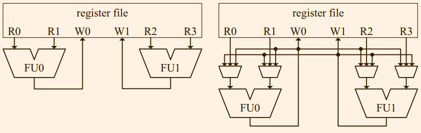
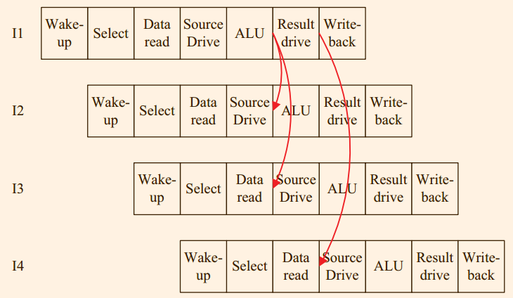
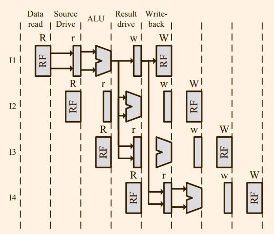
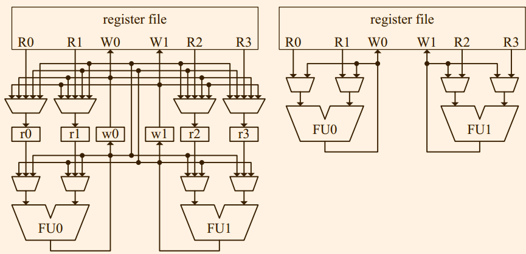

# 第7章 执行
执行阶段将一条指令的源操作数(source operand)和操作码被作为输入，输出计算结果。

## 7.1 计算单元

## 7.2 SIMD单元
SIMD是单指令多数据流的缩写，SIMD指令可以并行的对于一组数据实行相同的操作。一般来说，通用指令和SIMD指令使用不同的寄存器文件。

> skip one paragraph

如今的SIMD处理的向量的长度为4-16， 可能需要数条指令才可以实现70年代机器上的一条长向量指令的操作。发生这种转变的原因是，现代的处理器的SIMD指令是为了加速多媒体应用和游戏而不是科学计算。
由于这种实现（或者理念）的不同，“向量”通常指的是大量的元素，而“SIMD"指的是少量元素。

> this paragraph tells some different SIMD ISA

SSE x86扩展定义了在x86指令集的基础上增加了16个新的SIMD寄存器，每一个位宽128bit. 类似的，AltiVec扩展在POWER指令集上增加了32个128位的SIMD寄存器。每一个SIMD寄存器可以表示为一组不同类型的元素:
16个字节， 8个字， 4个双字等等

SIMD单元必须支持指令集定义各种数据长度和操作，在SSE中间，需要支持的操作包括算术，位操作和element permutaion operation(移位).

通常SIMD单元包含多个子单元： 浮点单元，整数/逻辑单元和移位单元。一个单元通常包含有包含有若干个通道(lane), 每一个通道是构建SIMD的最小单位，比如一个接收两个操作数产生一个结果的电路。
SIMD的操作都是并行，也就是说通道之前的执行是互相没有依赖的。一个整数SIMD通道和ALU的硬件构造很相似，同时一个浮点SIMD通道和FPU的硬件构造很相似，这有助于重复利用组件。

根据我们对于通道的定义，SIMD指令集的寄存器位宽是一个通道的位宽的整数倍， 我们可以一个支持所有倍数的SIMD单元。在SSE中间，向量元素最大为64位，而通道的宽度也是64位,所以SEE只能单通道或者双通道。

*An alternative design with lower performance but with half the hardware cost is shown in
the bottom part of the figure. Here we only have 1 lane, so we split one SSE operation into “low" 
and “high” parts. The SIMD unit will operate on the low part in one cycle and on the high part on
the other. The issue bandwidth in this case is reduced by two (but latency per instruction has only
increased by one cycle).*

前面提到过，SSE的浮点通道和FPU非常相似，所以对于x86处理器，让FPU和SIDM指令共用一个可以实现80位或者一个64位或者两个浮点操作的器件。

SIMD单元不同子单元中间的通道数目不一定相同，同一个单元中间的不同通道也是未必相同的。

## 7.2 Result Bypassing
> 为什么out of order也是需要bypassing, 因为都是持有所有操作数才会开始执行，没有道理啊。
> 至少不用写入到文件中间

在流水线中间，一条指令产生的结果可能需要花费很多周期才可能到达提交阶段。在写回wirte-back阶段，功能部件中间数值被写入到架构寄存器文件(architectural register file), merged register file 或者ROB中间，取决于实现的策略。

在如今的处理器中间，写回阶段至少需要花费一个周期，读取操作数也最少需要花费一个周期。

图7.7中间展示一个简单模型，两条指令中间需要插入一个气泡。如图7.8中显示乱序处理器中，两条相关的指令需要插入四个气泡。如果需要等到先执行的指令将结果写入到寄存器中间才可以读取，处理器的并行度会下降，解决的一个办法通过编译器和out-of-order引擎，但是想要完全利用流水线很难做到的。所以我们可以将一个ALU的结直接果重定向(forward or bypass)到另一个ALU的端口中间去。

重定向消除了流水线中间的气泡，但是它需要处理器中间添加一个由多路选择器和连线(wires)组成的数据通路，这个数据通路通常被称为重定向网络(bypass network)。不同的流水线中间含有不同复杂程度不一的重定向网路，但是它都是执行单元的重要一环，影响着芯片面积，功耗，cirtical path和物理布局。

重定向网络的实现也是含有取舍的。

#### 7.2.1 简易乱序处理器中的重定向
图7.10展示了包含两个功能部件的执行引擎。

#### 7.2.2 wide乱序处理器中的重定向
> 什么叫做wide
> 为什么需要添加这些锁存器

图7.10展示了包含两个功能部件的执行引擎，图7.11和7.12是对应演示。

> *Not shown in Figure 7.11 is the output latch of the FU that latches data at the end of the “ALU” stage to the beginning of the “result drive” stage*

#### 7.2.3 顺序处理器的重定向
顺序处理器的重定向未必比乱序处理的简单。*顺序处理器必须延迟写会阶段(write-back)直到流水线中间最慢的FU操作完成，否则乱序的架构的状态*.
*The process of delaying the result write-back is called staging of the result (the latches involved are
called the staging latches). Some form of staging takes places in out-of-order machines also, for
example, the “result drive” stage of Figure*.在顺序处理器中间，如果不想引入气泡，那么就需要将所有的staging锁存器以及FU的输出做重定向。
> 你看看，这是人说的话吗？

在图7.14中间展示了Atom处理器的流水线。

虽然没有Atom处理器的文档，但是图7.14也是一个合理的重定向路径。

图7.15中间展示对应硬件块图形，此处含有两个假设。首先，不可以将太多的输入接入到ALU/AGU中间，这就是为什么将数据重定向到前一个流水阶段的原因。其次，一旦数据被重定向过来，数据会随着流水线进入到正确阶段。也就是说，AGU阶段接受的重定向数据可以在ALU阶段被使用。

顺序处理器和乱序处理器的重定向的还有一个不同在于storage element。

*A straightforward implementation of the staging latches would implement one latch per result per staging cycle.*这一个方案要求对于每一个产生重定向数据staging latch都创建出来一个新的数据通路，这将导致严重的布线问题(wiring problem)。另一个问题是，数据在每一个周期都需要从锁存器中间复制出去导致不必要的能耗。

更好的方法是实现一个项目数目等于流水线的宽度和深度之积的寄存器文件结构，记为SRF。
> 这个操作完全无法理解，write-back阶段到底是什么一样的阶段，那不是简单的五级流水的访存阶段吗?为什么会出现在这一个位置。

#### 7.2.4 功能部件的组织方式
对于一个高频率，wide execution engines(比如包含有多个执行单元)的现代处理器，如果将任何一个功能单元的结果重定向到任何一个其他的功能单元，重定向网络会变得过大，而且影响处理器的执行周期。

实际上，并没有必要将所有的功能部件使用重定向网络连接起来。

就重定向网络而言，内存也是一个功能部件，可以使用功能部件和其他的部分连接起来。

## 7.3 Clustering
现代的处理器通过增加流水线的宽度，长度以及预测实现了性能的增加，但是带来复杂度，功耗，散热以及使用在bypass以及multiported array structure中间的global/long wires的扩展性的降低。

为了维持并行性以及提交扩展性，一个设计思想就是将关键的硬件组件分散开来。一个技术的例子就是第二章中间的阵列重复(array replication)以及第六章中间将发射逻辑的拆分。
Clustered架构将这种思想运用到多层次所有关键组件上。

#### 7.3.1 重定向网络的Clustering
图7.17中间展示两个网络，右侧的相对于左侧做出了简化，消除了很多布线并且除去一个流水线的一级，代价是两条相关的指令在不同的功能器件中间执行的时候需要插入气泡。

#### 7.3.2 Clustering with Replicated Register File
寄存器中间的读写端口的增加会导致访问延迟的增加。在Alpha 21264中间，执行引擎含有四个单元，被划分成为两个cluster,每一个cluster含有一个寄存器文件，当cluster 0 需要访问由cluster 中间产生的值的时候，需要另外的一个周期。

Alpha 21264为四个整数部件（也就是两个cluster）使用一个unified issue queue.
> skip the following three paragraph, because I still can not understand the *unified issue queue*

#### 7.3.3 分布式的发射队列和寄存器文件
已经被提出的更加激进的clustered架构不重复寄存器文件，而是将其拆分开来。分布式的寄存器文件clustered架构不仅仅将不仅仅拆分寄存器文件，而且拆分整个执行路径，发射队列以及发射逻辑。

在分布式寄存器文件中间，指令执行的结果并不会广播出去，而是仅仅写入到本地的寄存器文件中， 同时，一条指令也会仅仅从本地的寄存器文件中间读取。处理器需要提供专用的机制实现寄存器文件中间通信。一种方案是:*maintaining a small register file with registers that are replicated*. 另一种方案是提供专门的复制指令

这一个架构的另一个特点是发射队列也被拆分了，指令在重命名阶段通知*指令引导*(instruction steering)机制来实现指令分配。跨cluster的依赖在重命名阶段被处理，在发射阶段只会*compete*本cluster的资源。

图7.19展示了这一种架构的图解， 虽然这一种架构*相对于上一个方案降低了复杂度和功耗*, 但是它让指令引导机制需要小心的引导指令来减少跨cluster的通信以及cluster的负载均衡。

