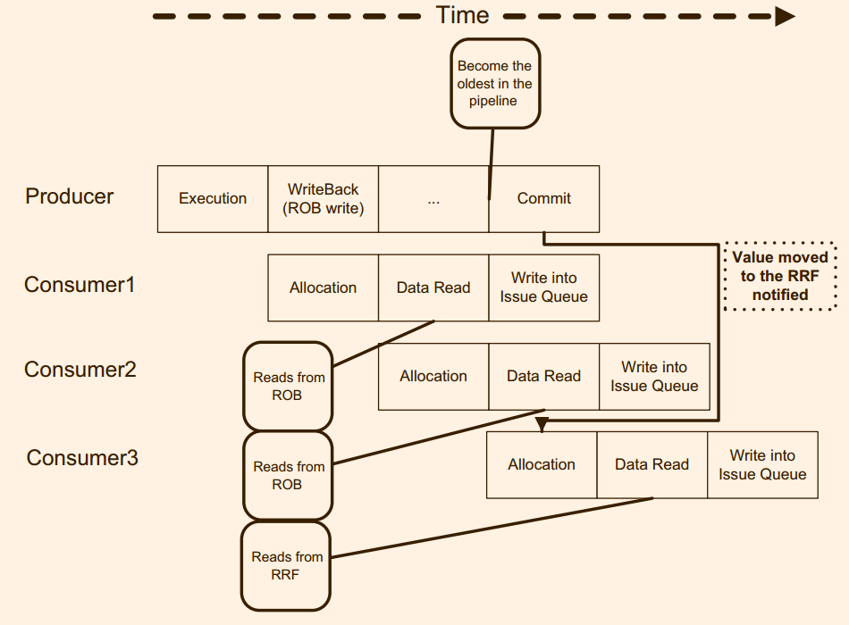

# 第8章　提交
> understand issue, then we can understand commit, or wisevurse

## 8.1 背景介绍
当代处理器的执行都是基于顺序执行模型，也就是当上一条指令执行完成之后，下一条指令会紧跟着执行。但是无论是顺序处理器还是乱序处理器的下一条指令都不会等到上一条指令执行结束之后才开始执行。

现存处理器中实现模拟顺序执行最常用的方案是在流水线的末尾添加一个提交阶段(commit stage)。指令必须按照程序顺序顺次通过提交阶段。这样的话，直到指令被提交，任何流水线上的推测结果都不会修改架构状态(architectural state)。

一个处理器的状态被区分为两种: 架构状态(architectual state)和推测状态(speculative state)。架构状态在提交阶段被修改。推测状态包括架构状态和未完成指令的状态。未完成指令的状态之所以是推测的，是因为这些状态未必可以转化架构状态。为了不停的执行指令，处理器使用分支预测和speculative memory disambiguation技术，当这一个预测失败或者发生异常的时候，推测的状态就变成无效的，并且不会被转化为架构状态。

和RISC处理器稍微有区别的是，CISC指令处理器（Inter Core architecture)为了乱序部分执行，需要将一条指令划分成为多个微操作，在提交阶段，只有当条指令的所有微操作全部完成，这条指令的才会被提交。唯一的例外就是那些可以被大量的内存复制的操作的指令，它们的微操作会在特殊时间点周期性的提交。

由于提交阶段是流水线的最后的一个阶段，所以指令需要在此处释放自己占用的资源，比如Reorder Buffer(ROB) entries, memory order buffer(MOB) 以及物理寄存器(pysical register). 注意，只有当那些不会再别使用的资源才可以被释放，比如有的指令的结果会写入到物理寄存器中间，只有确定该寄存器的值不会被使用才可以释放它。

> skip paragraph

## 8.2 架构状态管理
架构状态包括内存状态和每一个逻辑寄存器的值。

内存作为架构状态的一部分，所以存储指令会在store buffer中间存储它们需要修改的内存地址，大小和值，直到commit阶段才会修改内存
*Some processors like the PA8000 or the MIPS R10000 do not store the data on the store buffer, but they read it from the register file using a dedicated port at commit time.*所以，所有的读取操作会首先检查store buffer中间包含先前的存储操作，如果有，那么就是从中读取数值或者等到该数值被被更新出来。
> 为什么是 wait for the store to updte the cache.

有好几种方案实现跟踪(track)逻辑寄存器的最新状态，它们和allocation阶段相呼应。本章将会介绍两种方案，第一种是基于reorder buffer(ROB)和retire register filer(RRF)，第二种方案基于同时存储推测的和架构的寄存器值。

#### 8.2.1 基于RRF的架构状态
RRF的仅仅存储逻辑寄存器的值，所以寄存器数目和逻辑寄存器数目相同。

如图8.1所示，在ROB是一个循环队列，在allocation阶段分配，在指令提交时候入队，分支预测失败或者异常的时候出队。ROB的项主要包含主要的两个部分为: 指令信息(instruction information)和产生的值。
指令信息主要包括: 指令类型，执行的状态，产生结果的架构寄存器的标识等。当指令提交的时候，ROB中间值被复制到RRF中间，同时ROB的项出队。

注意，一条指令产生的结果的存储的位置首先出现在ROB中间，然后提交阶段被复制到RRF中间。这导致流水线某些阶段的设计变得复杂。

大多数基于ROB的处理器在renaming stage之后，发射指令之前读取操作数。处于allocation阶段的指令需要被通知去更新renaming table，也就是操作数在RFF中间。

> However, the allocation stage should be notified in order to update the renaming table and mark this value as available in the RRF
> 为什么提都不提Reservation Station, 想要误导人吗?
> 指令开始执行的时候，同时需要开始同时请求Reservation Station 和ROB,　ROB中间未就绪，记录ROB的编号，当ROB准备好的时候，发消息到总线上面去。
> 所以renaming table是在哪里介绍的？
> 量化中间没有讨论这一个问题，因为没有将allocation 和data read两者拆分开，但是为什么allocation和data read需要划分成为两个部分，为什么不在重命名阶段读取, **感觉，量化轻微的说明过这一个事情, 找到他**

然而，如果是在指令发射之后读取操作，这个通知操作将会变得复杂。通知的目标将会不仅仅是处于allocation阶段的指令，而且还会包括出去allcation到发射阶段的所有指令以及处于发射队列中间的指令。
> we will check this problem later

#### 8.2.2 基于Merged Register File的架构状态

> 1. 物理寄存器的释放和分配到底过程是什么样子的?
> 2. 有没有使用Reservation Station：　相当于合并ROB和RTF, RS不可以省去,　是不是别修改成为rename table
> 3. 映射表如何使用的?: 记录是否有效，记录映射的位置
> 4. 为什么数目会逻辑寄存器的数目更多? 

Merged Register File（MRF）会存储一条指令的结果，直到该结果不在被使用。相对于基于ROB的方案，一共含有三个好处:
1. 指令的结果不会改变位置
2. 基于ROB实现的方案需要为所有指令奉陪ROB项，然后大约有25%的指令是存储指令和分支指令，并不会产生任何的值。
3. ROB是一个中心化的结构，所有指令都需要从它哪里读取操作数。然而，ROB会让在指令在发射之后读取操作数的decoupled架构变得复杂。根据指令需要的执行资源的不同，指令被引导到不同的execution cluster。
> skip some line
> 所以为什么不把ROB分散开来。

第一个好处是由于推测状态和架构状态被存储到相同的位置，而后面的两个好处来自于使用物理寄存器文件来存储结果而不是ROB.所以，使用其他的方案类似于future file来存储推测状态和架构状态可以获取类似的好处。

但是MRF需要另外的队列来实现指令的顺序提交。
> skip some line

资源的释放也变得更加复杂，处理器目前使用策略是当随后的指令写相同的逻辑寄存器的时候释放。

## 8.3 从推测状态中间恢复

### 8.3.1 从分支预测错误中间恢复 
分支预测错误的恢复被划分成为两个部分: 前段恢复和后端恢复。前段恢复主要包括: 清空intermedia buffers, 矫正分支预测器和更新程序计数器。
后端出去错误指令在buffer中间的影响，包括memory buffer, issu queue和reorder buffer等等，而且renaming table中间项以及后端资源如发射队列以及物理寄存器等需要被释放。

##### 8.3.1.1 基于ROB的架构从分支预测错误中间恢复 
基于merged register file的处理器可以通过retire register file(RRF)可以实现的所有恢复技术，同时基于ROB的处理器也可以使用此技术。但是这些架构使用一个类似于Intel Pentium Pro的技术。

当在Intel Pentium Pro中间，知道所有先于错误预测的指令都提交完成之后，恢复工作才会开始。此时，在RRF中间保存的架构状态就是错误预测之前的指令架构状态，恢复renaming table就只需要通过将值还存在于RRF中间的项目。

##### 8.3.1.2 基于Merged Register File的架构从分支预测器中间恢复
Processors implementing a merge register file do not usually wait for the mispredicted branch to commit in order to recover
the speculative state
> 为什么需要一直等到commit的状态

