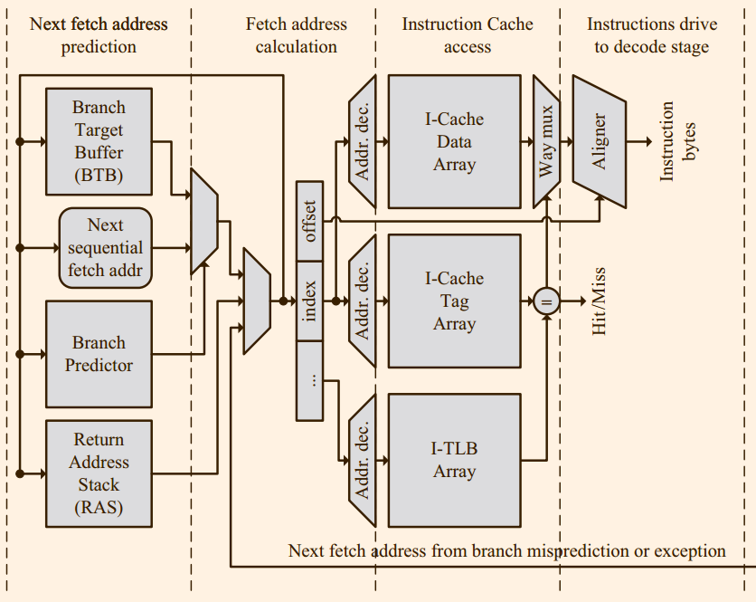
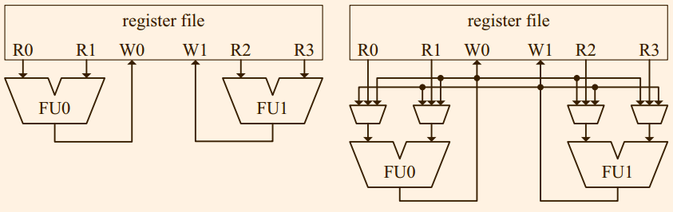
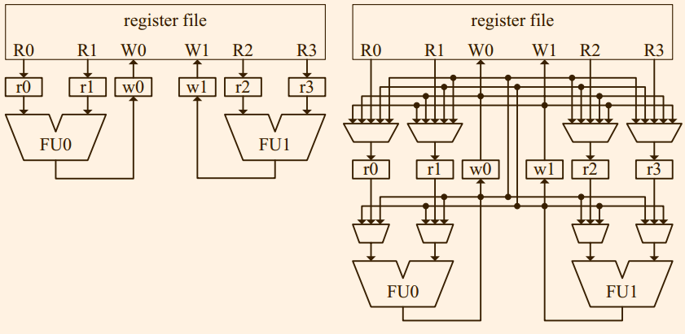

# 3 指令读取
指令读取单元是为处理器提供指令，也就是指令被处理的第一个部分。指令读取单元通常由指令cache和相应的地址计算逻辑组成。

高性能处理器可以每一个周期读取一条指令，这也就意味着每一个周期都需要计算出来新的指令地址，也就是说下一跳指令的地址和访问指令cache是同时进行的。然而分支指令导致这一个过程变得异常复杂，因为只有当分支指令执行结束之后才可以知道下一条指令的地址。所以，处理器需要预测下一条指令的位置。

预测分为两个部分，第一个部分预测是否跳转，第二个部分预测跳转的地址，这一个功能被叫做branch target buffer（BTB）的实现。有的处理器将函数（subroutine)作为一种特殊情况，使用返回地址栈（RAS）来预测。

图3.1是指令读取的高层次块图, 有很多可选的部件（多周期预测期, 多层次预测器, 等等), 但是此图展示了每一个周期读取新的指令的高性能处理器的设计思路。正如第二章提到的，图中的发数据阵列（data array）和标签阵列（tag array）是并行访问。我们也可以看到，指令TLB的访问和指令cache的访问也是并行。在这一个设计中间，使用虚拟地址对cache array寻址，而使用物理地址来比较tag。图3.1中，所有地址预测器都是在第一个阶段并行访问的，在下一个阶段进行选择哪一个预测期的输出，这样的设计是为了实现更高的频率，虽然读取一个指令需要四个周期，但是如果完全流水线化，相当于每一个周期都独处了一条指令。


## 3.1 指令cache
指令cache中间保存最近会被读取的指令。指令cache通常的配置为: 容量为几十KB, 组相连，cache line大约为64字节。指令cache可以使用虚拟地址或者物理地址寻址，由于地址翻译可以并发的进行，前者可以将访问cache进行的更加早。由于需要处理别名问题，标签一般都是使用物理地址。

在超标量处理器中间，每一个周期必须读取多个指令，通常从同一个cache line中间读取多个字节来实现这一个要求，这一个方法让单一的memory port提供所需的带宽成为可能。字节流被读取，下一步就是将它划分成为指令，如果指令长度是固定，划分操作是很简单的。

#### 3.2　踪迹Cache
传统的cache按照指令的静态顺序存储。然而Trace cache按照指令的动态执行存储，图3.2展示了两者的不同，两者的区别含有两个关键点:数据重复和effective bandwidth per memory port。在传统cache中间，每条指令只会在cache中间出现一次，但是trace cache中间的出现次数取决于指令的执行。此外，传统的每一个memory port 的最大带宽被分支跳转的频率所限制。


## 3.2 分支目标缓冲区
为了预测一条指令是否是分支指令，可以使用一个使用fetch address作为索引，每一个条目包含和fecth block一样多的位的硬件来实现。

大多数跳转指令的目标地址是PC-Relative的，所以它们可以在被fetch的时候计算出来目标地址，而不是使用预测的方式，但是另外的需要一个气泡，对于高性能的处理器，这一点不可接受。

为了消除这一个气泡，需要使用使用一个使用fetch address作为索引，对于instruction block中间每一台指令含有一个项的硬件，这一个硬件和之前描述用于预测指令是否为分支指令的硬件和合并起来，被叫做BTB

## 3.3 返回地址栈
由于函数调用地址不同，导致函数返回的位置变得无法预测，使用普通的分支预测器的效果并不好。
返回地址栈的结构更加简单，大多数情况下，精度更高。
如果返回地址栈的项是无限多的，那么就可以没有任何错误，如今的处理器中间一般含有几十项，

## 3.4 条件分支预测
是否进行跳转，必须预测，否则在很多处理器中间需要等待数十个周期。条件分支预测可以静态，动态或者两者协作的完成。

### 3.4.1 静态预测
静态预测需要使用使用侧边信息,如果没有，那么对于循环倾向于分支是跳转的，其它的则难以判断。

静态预测需要的硬件资源很少，在指令中间添加一个位就可以。相反动态分支预测需要的硬件资源就非常的丰富。
### 3.4.2 动态预测
现代处理器中间如果分支预测失败的代价非常高，仅仅使用2bit局部预测器是不行的。

图3.5是gshare预测器。它采用的原理将最近是否跳转的历史和PC的低地址部分异或作为索引。


# 4.1 解码
解码阶段的左右就是让处理器知道指令的作用进而知道如何处理该指令。在这一个阶段，处理器需要确定:
1. 指令的类型是什么: 控制，访存，算术等。
2. 指令需要执行何种操作，比如当指令是一条算术指令时，ALU将会执行操作，当是条件分支指令的时候，what condition should be evaluated,等等。
3. 指令需要何种资源，比如对于一条算术指令，那些寄存器将会被读，那些寄存器会被写。

通常来说，解码阶段的输入是原始的字节流。解码单元需要确定指令的边界，然后将字节流划分为指令，然后输入各种控制信号。解码单元的复杂程度取决于指令集和并发度。

第一节将会简要的介绍RISC机器上解码工作是如何进行的。在第二节中将会描述X86的解码工作方式，并且会解释为什么ISA是如何影响解码单元的复杂性的。接下来，我们将会讲解当代的X86处理器中是如何使用动态翻译技术(dyanmic translate technique)将x86指令翻译成为类似RISC的指令。最后，我们将讲解现代的x86乱序处理器的解码流水线如何动态的将x86指令翻译为类RISC的指令。

## 4.2 RISC的解码
一个典型的RISC解码流水线如图4.1所示。图中展示了可以同时解码四条指令的RISC超标量处理器，接下来的讨论以此为基础。


通常来说，RISC指令的解码很容易。大多数的RISC指令集的长度都是固定的, 所以在fetch buffer中间确定指令的边界以及将原始的字位传递到解码器很trivial。由于第一条指令未必和fetch buffer的开始位置对其，所以需要使用PC的低字段来确定。

RISC指令集只有少量的编码方式，也就是说操作码和操作数在指令中间的位置含有很少的变动。加之RISC指令更加"简单",也就是他们会为流水线产生很少的控制信号，这都导致RISC的解码器更加简单。

RISC指令集的简单性让高性能处理器可以借助简单的PLA电路或者简单的查询表实现单周期的解码

## 4.3 X86指令集的解码方式
X86的指令长度是变长的，其格式如图4.2所示。


一条x86指令包含: 多达四个前缀字节(prefix bytes)（可选的），一个长度可以为1到3字节的mandatory操作码，一个包含ModR/M字节和SIB（可选）的寻址码（addressing specifier）.有的指令可能需要displacement（多达四字节)或者immediate field（多达四字节）.

指令前缀有好几个作用，比如, 
前缀可以修改指令的操作数,比如段重写操作符可以修改段寄存器的地址，而操作数大小重写寄存器可以将寄存器从16位和32位之间修改。

x86解码器遇到的第一个问题就是确定指令的长度。如果想要并发的解码多个指令，我们必须知道每条指令的起始位置。由于指令长度是变化的，导致这项任务是顺序性，也就是说只有第i条指令的起始位置被确定，第i+1指令的位置才可以被确定。所以，快速的计算出来指令的长度对于性能的提升至关重要。

通过解码操作码（opcode)可以知道是否含有ModR/M，displacement 或者 immediate是否存在，通过解码ModR/M可以确定是否含有SIB。

解码操作码含有两个问题，第一个问题是，没有办法判断操作码的位置，由于操作码前面含有前缀码，所以操作码可能开始于前五个操作码中间任何一个。第一个问题是，没有办法确定操作数的长度，操作数的长度可能１到３，而且ModR/M中间的3到5位还可能作为操作数的扩展位。

x86解码器遇到的第第二个问题就是确定指令的操作数。比如，一条简单的寄存器－寄存器操作，操作数可能编码在操作数中间或者ModR/M中间。ModR/M根据其6,7位，可能包含两个或者一个操作数。

在寄存器－寄存器指令的例子中间，一个3位的操作数可以定位一个通用寄存器，但是知道真正的使用哪一个，还需要从操作数中间件获取信息（当前执行模式(current execution mode)）, 某些情况下，需要从前缀码中间获取这信息（如果含有操作数长度覆盖前缀(oprand-size override prefix)）。只是由于仅仅靠3位，仅仅可以知道编码８个通用寄存器，但是无法确定是哪一个架构寄存器(architectural registers)。在32位的x86中间，操作数的值为０可以表示为AL,AX,EAX,MM0或者XMM0.

通过上面的讨论可以看出来，x86的编码绝不简单。在现代的x86处理器中间，解码需要花费数个周期，解码是复杂性的重要来源。接下来，我们将会探讨高性能，乱序，超标量的处理器中的编码如何实现的。

## 4.4 动态翻译
一条x86指令中间包含很多语义信息，而且可能要求执行单元的多个操作。

所以,在一个乱序执行单元上高效的执行复杂指令不是一个简单的事情。

另一方面，RISC ISA的编译器会将复杂的操作分解成为多个简单的操作

由于x86 CISC指令会导致执行单元的复杂化，所以从很早以前，x86处理器就决定在解码阶段动态的将x86指令翻译成为类RISC指令。最先实现设一个设计的是Intel P6和AMD K5。这样的话，既可以保证指令集的兼容，也可以让执行单元大大的简化。

如今，所有的x86处理器都动态的翻译x86指令成内部的类RISC指令格式。特别的，Intel称这些内部的指令为微操作(micro-opreation). P6的未操作含有118位,编码了一个操作码和三个操作数, 使用load/store模型。

从P6微操作的长度，我们可以推测，一个微操作的并不是对应于一条RISC指令，而是一条已经解码的指令，也就是类RISC操作的流水线控制信号。显然，当代的处理器中间的微操作和P6中间已有不同，但是我们相信理念是相同。

## 4.5 高性能x86解码
图4.3是Intel Nehalem架构的解码图，从中可以看出x86的解码是一个多周期的行为。在该实现中间，解码被划分为两个部分：指令长度解码器（ILD）和动态翻译器。两者被指令队列分开(IQ), 这是为了将指令长度解码器遇到复杂指令是产生的气泡隐藏起来。IQ也是使用简单的锁存器来替代。


#### 4.6 指令长度解码器（ILD）
ILD每个周期从prefetch buffer中间读取16字节，给出每条指令的长度，分析它们的前缀，并且标识出指令的各种有助于第二阶段翻译的属性。
> Instruction length decoding is sequential by nature, so it must be as fast as possible if we want to be able to predecode many instructions at high frequency

大多数编码形式的指令都是可以被ILD单周期处理，但是在Intel Core和Core 2微架构（Nehalem应该也是如此），有两种情况不可以被通用方法处理，需要使用一个６周期数据通路来处理:*omit*


#### 4.7 动态翻译器
这一个阶段将从指令队列中间的指令转化为微操作。大多数的寄存器－寄存器指令被翻译为一条微操作，有些操作数为内存单元的指令被翻译多条微操作。

图4.3中间设计实现了三个简单的解码器来处理那些被翻译为单条微操作的指令，只有一个复杂解码器来处理那些可以被翻译为多条微操作的指令。如果大多数指令都是被简单解码器处理并且没有损失解码的带宽，那么这种设计是可以降低功耗的。

图4.3中MSROM是为了处理字符串指令。


# 5 Allocation
本阶段主要完成两个任务：寄存器重命名(register renaming)和指令分发(instruction dispatch)。前者的作用是消除由于重用寄存器导致的伪数据依赖，后者是为了预定指令执行时所需要的资源。

指令分发(instruction dispatch)阶段预定的资源包括:entries in the issue queue, the reorder buffer 和 the load/store queue。如果任何一个要求的资源未就绪，那么指令就会被阻塞。

只有在乱序处理器中间才使用寄存器重命名。乱序处理器中间指令的执行顺序受制于依赖关系而不是依赖于程序顺序。依赖关系分为两种：数据依赖和名称依赖。
```
r1 = r2 + r3        r1 = r2 + r3            r1 = r2 + r3
r4 = r1+r5          r1 = r4 + r5            r2 = r4 + r5
Data dependence     Name dependence         Name dependence
Read after write    Write after Write       Write after read
```

可以通过将数据写入到不同的位置消除寄存器重命名，但是这需要过多的存储空间，而且导致数据局部性的消失。

相对于处理整个程序的指令的名称依赖，乱序处理器只是需要实现一个更加简单的目标，那就是消除正在被处理的指令的名称依赖。由于通用的指令窗口(instruction windows)大概是一百左右，为这些指令提供存储空间是可以接受。
本章重点关注寄存器操作数的重命名，在第六章中间将会分析内存作为操作数时候的重命名。

在Tomasulo 实现的IBM 360/91中间， destination operands were renamed using the identifier of the reservation station that would produce
them. 这一种策略已经被现在的处理器所放弃了，因为只有当指令执行结束之后才会释放Reservation Staion。在第六章中会讲到，当代的处理器会在发射完指令之后立刻释放发射队列(在Tomasulo的命名法中叫Reservation station)项。

当代的处理器使用三种策略实现重命名策略，分别是reorder buffer, rename buffer 和 merged register file。

## 使用Reorder Buffer实现重命名
在这一种方案中间，寄存器的值被存储在Reorder Buffer和the architectural register file中间。The reorder buffer (ROB) stores the results of noncommitted instructions, whereas the architectural
register file stores the latest committed value for each architectural register。为此需要有一个Rename Table来指明一个architectural register的最新的definition是在Reorder Buffer中间还是architectural register file中间。
为了帮助Reorder Buffer中间的操作数，rename table中间也需要包含一个字段来描述改操作数在Reorder Buffer的位置。

当一条指令执行的时候，该指令的结果被放置到Reoder Buffer中间，当该指令被提交的时候，结果就会被复制到architectural register file中间。这一种策略可能会导致操作数在它的生命周期中间出现在两个位置里，这让读取该操作数含有一定的困难。

此方案被Intel Core 2所使用。

## 使用Rename Buffer实现重命名
本策略和上面的策略稍有不同。由于大约有三分之一的指令是不会写寄存器文件，使用Reoder Buffer实现重命名会浪费大约三分之一的空间。Rename Buffer的想法是to have a separate structure for the result of in-flight(也就是未提交的) instructions.

IBM Power 3使用此策略。

## 使用Merged Register File实现重命名
除此之外，需要使用一个寄存器映射表实现从物理寄存器和架构寄存器之间的映射。


# 第六章　发射
## 6.1 前言
在流水线中，**发射**的下一个阶段是**功能单元**。目前，主要有两种发射策略：**顺序发射**和**乱序发射**。前者按照程序顺序，后者只要指令的操作数准备好了就发射。

大多数新的处理器使用乱序发射策略。实现乱序发射策略的方法很多。实际上，发射阶段的实现依赖于其后的阶段的实现策略，比如说，如果在分发阶段(dispatch stage)的前后含有读取操作数的硬件，那么发射阶段就是不需要含有读取操作数的硬件。当然，是否基于reservation station, distributed station, distributed queues或者unified issue queue对于发射阶段的具体实现也有很大的影响。

本章仅仅接受在现有处理器中间最经常使用的发射策略。
## 6.2 顺序发射逻辑单元

在使用计分板策略的时候，由于实现简单，这种发射逻辑单元有时候使用在解码阶段。计分板通常含有两个表：**数据依赖表**和**资源表**。这些表会随着硬件资源的约束而有所变化。


使用将要发射的指令的操作数寄存器编号来索引数据依赖表的项，每一个项记录着对应的寄存器值的状态，这些状态包括nonavailable和available，分别表示需要的操作数未就绪和就绪。
当寄存器被写入或者bypass level的时候，操作数从未就绪状态变为就绪状态。第七章将描述更多关于bypass的内容。

由于有的功能单元比如触发器并没有办法每一个周期完成一个操作，资源表中间记录执行资源是否就绪。

超长指令字依赖于软件而不是硬件来避免数据依赖和资源未就绪的问题。

## 6.3 乱序发射逻辑单元
本章假设使用unified issue queue, 并且在此基础上分析两种情景。

unified issue queue 会存储所有重命名过的指令。reservation station 或者　distributed issue station queue会根据指令依赖的资源类型将指令存储在不同的位置。

两种情景的区别在于，在指令送到发射队列之前，操作数是否会首先被读取。


### 6.3.1 在发射之前读取操作数

##### 6.3.1.1 反射队列的分配

### 6.3.2 在发射之后读取操作数

## 6.4 访存指令发生逻辑

访存指令的数据依赖在重命名阶段无法被检测出来， 这些基于内存的数据依赖只有在指令被发射并且其地址被计算出来才能被检查出来。

负责检查基于内存的数据依赖的机制被称作memory disambiguation policy（MDP）。不同的处理器实现的MDP大相径庭。
表6.1展示了不同微架构上面的典型的方案。这些方案大致分为两种：推测和非推测（nonspeculative and speculative disambiguation policies）

选择合适的方案对于处理器的性能和设计复杂性影响巨大。由于大约有30%的指令是访存指令，如果使用非常保守的方案，那么可能导致不必要的指令顺序执行，这将导致性能的下降，另一方面，激进的方案可能导致异常复杂的失败预测恢复机制以及大幅增加的功耗。


### 6.4.1 非推测MDP(Nospeculative Memory Disambiguation)
非推测MDP只有之前的存储操作计算出来它们的地址之后才会发生新的访存指令，这一种方案主要被划分为三种，total ordering, load ordering with store ordering and partial ordering.

在total ordering中间，所有的访存操作都是顺序的， 目前没有任何一个处理器采用这一个方案。

load ordering with store ordering需要保证所有的读操作和写操作都是顺序的，但是读操作不需要等到先前的写操作。这一个方案被AMD K6所采用。
在partial ordering中间，一条读操作在只要之前的所有写操作完成之后就可以马上开始，这一个方案被MIPS R10000以及AMD K8所采用。

注意，memory disambiguation可以在写操作的地址被计算出来就开始。
所以，有些处理器将写操作划分成为两个部分，首先计算出地址，然后获取
数据。有些情况下，就算处理器早早地将地址计算出来，也会等到存储操作
成为最后未完成的最后一条指令之后才会写数据。


#### 6.4.1.1 案例分析1: AMD K6处理器上load ordering with store ordering 
AMD K6中间将读和写划分成为两个流水线， *both pipelines are decoupled with some level of communication*, 但是在每条流水线里面指令顺序固定不变。
访存流水线包括一下几个部分:
1. 读队列: 在指令重命名之后，读操作送入队列中间，并且一直待到该指令队列到达开头并且需要的源操作数就绪。
2. 地址生成器: 负责将读写操作的源操作数计算出来该指令的访问地址。
3. 写队列：和读队列类似
4. 写缓冲：按照程序顺序记录写操作，如果该存储操作 成为最后未完成的最后一条指令，那么就可以更新内存。

图7.1描述AMD k6的访存流水线，上部分是读操作，下部分是写操作。

读写队列都是等待指令到达队首并且操作数已经就绪，需要指出的是，写队列不需要等到要写入的值就绪就可以发射了。

在READ阶段，指令获取通过访问寄存器文件或者重定向网络来获取操作数。

在地址生成阶段(ADDRESS GENERATION),访存地址被计算出来，如果指令是写操作，在此阶段需要等待需要被写入的值，如果没有就绪，那么将会阻塞整个写队列。

获取了地址之后，就会进入到disambiguation阶段， 如果是写操作，那么数据和地址都存储到store buffer中间
如果是一条读操作，那么需要检查包括store buffer，地址生成阶段，以及issue阶段中间先于此操作的写指令是否写入以及可能写入到相同的位置。
> disambiguation操作似乎仅仅是为了load操作而设置的，本阶段需要检查的关键是如何确定我怎么会知道哪一个store操作是在该操作之后的

我们可能会想，即使不保证顺序读，依旧保证内存一致性。在X86手册中间有一个实现内存一致性的简单描述:
stores have to be visible in order, and loads have to be perceived as executed in order.这是可能，比如AMD K8L, 又比如Intel Core中允许读操作乱序执行，而且允许读操作overtake那些尚未计算出来地址的写操作。

#### 6.4.1.1 案例分析1: MIPS R10000处理器上partial ordering
在MIPS R10000写操作需要严格按照顺序，但是读操作只需要保证先于其的写指令的地址已经被计算出来了。其和memory disambiguation的流水线布局如图6.8所示。

流水线的主要部分如下:
1. 读写队列: 用于存储读写指令，此时源操作数尚未就绪。
2. 不确定矩阵
3. 依赖矩阵:用于保证pariial ordering
3. 地址生成器
4. 地址队列

### 6.4.2 推测的Memory Disambiguation

假定读操作不依赖任何先前的写操作。
#### 6.4.2.1 案例分析: Alpha 21264
流水线包含一下内容：
1. 读写队列
2. 读队列
3. 写队列
4. 等待表

## 6.5 Speculative wakeup of load consumer

# 第7章 执行
执行阶段将一条指令的源操作数(source operand)和操作码被作为输入，输出计算结果。

## 7.1 计算单元

## 7.2 SIMD单元
SIMD是单指令多数据流的缩写，SIMD指令可以并行的对于一组数据实行相同的操作。一般来说，通用指令和SIMD指令使用不同的寄存器文件。


如今的SIMD处理的向量的长度为4-16， 可能需要数条指令才可以实现70年代机器上的一条长向量指令的操作。发生这种转变的原因是，现代的处理器的SIMD指令是为了加速多媒体应用和游戏而不是科学计算。
由于这种实现（或者理念）的不同，“向量”通常指的是大量的元素，而“SIMD"指的是少量元素。


SSE x86扩展定义了在x86指令集的基础上增加了16个新的SIMD寄存器，每一个位宽128bit. 类似的，AltiVec扩展在POWER指令集上增加了32个128位的SIMD寄存器。每一个SIMD寄存器可以表示为一组不同类型的元素:
16个字节， 8个字， 4个双字等等

SIMD单元必须支持指令集定义各种数据长度和操作，在SSE中间，需要支持的操作包括算术，位操作和element permutaion operation(移位).

通常SIMD单元包含多个子单元： 浮点单元，整数/逻辑单元和移位单元。一个单元通常包含有包含有若干个通道(lane), 每一个通道是构建SIMD的最小单位，比如一个接收两个操作数产生一个结果的电路。
SIMD的操作都是并行，也就是说通道之前的执行是互相没有依赖的。一个整数SIMD通道和ALU的硬件构造很相似，同时一个浮点SIMD通道和FPU的硬件构造很相似，这有助于重复利用组件。

根据我们对于通道的定义，SIMD指令集的寄存器位宽是一个通道的位宽的整数倍， 我们可以一个支持所有倍数的SIMD单元。在SSE中间，向量元素最大为64位，而通道的宽度也是64位,所以SEE只能单通道或者双通道。

前面提到过，SSE的浮点通道和FPU非常相似，所以对于x86处理器，让FPU和SIDM指令共用一个可以实现80位或者一个64位或者两个浮点操作的器件。

SIMD单元不同子单元中间的通道数目不一定相同，同一个单元中间的不同通道也是未必相同的。

## 7.2 Result Bypassing

在流水线中间，一条指令产生的结果可能需要花费很多周期才可能到达提交阶段。在写回wirte-back阶段，功能部件中间数值被写入到架构寄存器文件(architectural register file), merged register file 或者ROB中间，取决于实现的策略。

在如今的处理器中间，写回阶段至少需要花费一个周期，读取操作数也最少需要花费一个周期。

图7.7中间展示一个简单模型，两条指令中间需要插入一个气泡。如图7.8中显示乱序处理器中，两条相关的指令需要插入四个气泡。如果需要等到先执行的指令将结果写入到寄存器中间才可以读取，处理器的并行度会下降，解决的一个办法通过编译器和out-of-order引擎，但是想要完全利用流水线很难做到的。所以我们可以将一个ALU的结直接果重定向(forward or bypass)到另一个ALU的端口中间去。

重定向消除了流水线中间的气泡，但是它需要处理器中间添加一个由多路选择器和连线(wires)组成的数据通路，这个数据通路通常被称为重定向网络(bypass network)。不同的流水线中间含有不同复杂程度不一的重定向网路，但是它都是执行单元的重要一环，影响着芯片面积，功耗，cirtical path和物理布局。

重定向网络的实现也是含有取舍的。


#### 7.2.1 简易乱序处理器中的重定向
图7.10展示了包含两个功能部件的执行引擎。


#### 7.2.2 wide乱序处理器中的重定向
> 什么叫做wide
> 为什么需要添加这些锁存器

图7.10展示了包含两个功能部件的执行引擎，图7.11和7.12是对应演示。



#### 7.2.3 顺序处理器的重定向
顺序处理器的重定向未必比乱序处理的简单。*顺序处理器必须延迟写会阶段(write-back)直到流水线中间最慢的FU操作完成，否则乱序的架构的状态*.


在图7.14中间展示了Atom处理器的流水线。

虽然没有Atom处理器的文档，但是图7.14也是一个合理的重定向路径。

图7.15中间展示对应硬件块图形，此处含有两个假设。首先，不可以将太多的输入接入到ALU/AGU中间，这就是为什么将数据重定向到前一个流水阶段的原因。其次，一旦数据被重定向过来，数据会随着流水线进入到正确阶段。也就是说，AGU阶段接受的重定向数据可以在ALU阶段被使用。

顺序处理器和乱序处理器的重定向的还有一个不同在于storage element。

*A straightforward implementation of the staging latches would implement one latch per result per staging cycle.*这一个方案要求对于每一个产生重定向数据staging latch都创建出来一个新的数据通路，这将导致严重的布线问题(wiring problem)。另一个问题是，数据在每一个周期都需要从锁存器中间复制出去导致不必要的能耗。

更好的方法是实现一个项目数目等于流水线的宽度和深度之积的寄存器文件结构，记为SRF。
> 这个操作完全无法理解，write-back阶段到底是什么一样的阶段，那不是简单的五级流水的访存阶段吗?为什么会出现在这一个位置。

#### 7.2.4 功能部件的组织方式
对于一个高频率，wide execution engines(比如包含有多个执行单元)的现代处理器，如果将任何一个功能单元的结果重定向到任何一个其他的功能单元，重定向网络会变得过大，而且影响处理器的执行周期。

实际上，并没有必要将所有的功能部件使用重定向网络连接起来。

就重定向网络而言，内存也是一个功能部件，可以使用功能部件和其他的部分连接起来。


## 7.3 Clustering
现代的处理器通过增加流水线的宽度，长度以及预测实现了性能的增加，但是带来复杂度，功耗，散热以及使用在bypass以及multiported array structure中间的global/long wires的扩展性的降低。

为了维持并行性以及提交扩展性，一个设计思想就是将关键的硬件组件分散开来。一个技术的例子就是第二章中间的阵列重复(array replication)以及第六章中间将发射逻辑的拆分。
Clustered架构将这种思想运用到多层次所有关键组件上。

#### 7.3.1 重定向网络的Clustering
图7.17中间展示两个网络，右侧的相对于左侧做出了简化，消除了很多布线并且除去一个流水线的一级，代价是两条相关的指令在不同的功能器件中间执行的时候需要插入气泡。


#### 7.3.2 Clustering with Replicated Register File
寄存器中间的读写端口的增加会导致访问延迟的增加。在Alpha 21264中间，执行引擎含有四个单元，被划分成为两个cluster,每一个cluster含有一个寄存器文件，当cluster 0 需要访问由cluster 中间产生的值的时候，需要另外的一个周期。

Alpha 21264为四个整数部件（也就是两个cluster）使用一个unified issue queue.
> skip the following three paragraph, because I still can not understand the *unified issue queue*

#### 7.3.3 分布式的发射队列和寄存器文件
已经被提出的更加激进的clustered架构不重复寄存器文件，而是将其拆分开来。分布式的寄存器文件clustered架构不仅仅将不仅仅拆分寄存器文件，而且拆分整个执行路径，发射队列以及发射逻辑。

在分布式寄存器文件中间，指令执行的结果并不会广播出去，而是仅仅写入到本地的寄存器文件中， 同时，一条指令也会仅仅从本地的寄存器文件中间读取。处理器需要提供专用的机制实现寄存器文件中间通信。一种方案是:*maintaining a small register file with registers that are replicated*. 另一种方案是提供专门的复制指令

这一个架构的另一个特点是发射队列也被拆分了，指令在重命名阶段通知*指令引导*(instruction steering)机制来实现指令分配。跨cluster的依赖在重命名阶段被处理，在发射阶段只会*compete*本cluster的资源。

图7.19展示了这一种架构的图解， 虽然这一种架构*相对于上一个方案降低了复杂度和功耗*, 但是它让指令引导机制需要小心的引导指令来减少跨cluster的通信以及cluster的负载均衡。


# 第8章　提交
> understand issue, then we can understand commit, or wisevurse

## 8.1 背景介绍
当代处理器的执行都是基于顺序执行模型，也就是当上一条指令执行完成之后，下一条指令会紧跟着执行。但是无论是顺序处理器还是乱序处理器的下一条指令都不会等到上一条指令执行结束之后才开始执行。

现存处理器中实现模拟顺序执行最常用的方案是在流水线的末尾添加一个提交阶段(commit stage)。指令必须按照程序顺序顺次通过提交阶段。这样的话，直到指令被提交，任何流水线上的推测结果都不会修改架构状态(architectural state)。

一个处理器的状态被区分为两种: 架构状态(architectual state)和推测状态(speculative state)。架构状态在提交阶段被修改。推测状态包括架构状态和未完成指令的状态。未完成指令的状态之所以是推测的，是因为这些状态未必可以转化架构状态。为了不停的执行指令，处理器使用分支预测和speculative memory disambiguation技术，当这一个预测失败或者发生异常的时候，推测的状态就变成无效的，并且不会被转化为架构状态。

和RISC处理器稍微有区别的是，CISC指令处理器（Inter Core architecture)为了乱序部分执行，需要将一条指令划分成为多个微操作，在提交阶段，只有当条指令的所有微操作全部完成，这条指令的才会被提交。唯一的例外就是那些可以被大量的内存复制的操作的指令，它们的微操作会在特殊时间点周期性的提交。

由于提交阶段是流水线的最后的一个阶段，所以指令需要在此处释放自己占用的资源，比如Reorder Buffer(ROB) entries, memory order buffer(MOB) 以及物理寄存器(pysical register). 注意，只有当那些不会再别使用的资源才可以被释放，比如有的指令的结果会写入到物理寄存器中间，只有确定该寄存器的值不会被使用才可以释放它。


## 8.2 架构状态管理
架构状态包括内存状态和每一个逻辑寄存器的值。

内存作为架构状态的一部分，所以存储指令会在store buffer中间存储它们需要修改的内存地址，大小和值，直到commit阶段才会修改内存

有好几种方案实现跟踪(track)逻辑寄存器的最新状态，它们和allocation阶段相呼应。本章将会介绍两种方案，第一种是基于reorder buffer(ROB)和retire register filer(RRF)，第二种方案基于同时存储推测的和架构的寄存器值。

#### 8.2.1 基于RRF的架构状态
RRF的仅仅存储逻辑寄存器的值，所以寄存器数目和逻辑寄存器数目相同。

如图8.1所示，在ROB是一个循环队列，在allocation阶段分配，在指令提交时候入队，分支预测失败或者异常的时候出队。ROB的项主要包含主要的两个部分为: 指令信息(instruction information)和产生的值。
指令信息主要包括: 指令类型，执行的状态，产生结果的架构寄存器的标识等。当指令提交的时候，ROB中间值被复制到RRF中间，同时ROB的项出队。


注意，一条指令产生的结果的存储的位置首先出现在ROB中间，然后提交阶段被复制到RRF中间。这导致流水线某些阶段的设计变得复杂。

大多数基于ROB的处理器在renaming stage之后，发射指令之前读取操作数。处于allocation阶段的指令需要被通知去更新renaming table，也就是操作数在RFF中间。


然而，如果是在指令发射之后读取操作，这个通知操作将会变得复杂。通知的目标将会不仅仅是处于allocation阶段的指令，而且还会包括出去allcation到发射阶段的所有指令以及处于发射队列中间的指令。


#### 8.2.2 基于Merged Register File的架构状态

Merged Register File（MRF）会存储一条指令的结果，直到该结果不在被使用。相对于基于ROB的方案，一共含有三个好处:
1. 指令的结果不会改变位置
2. 基于ROB实现的方案需要为所有指令奉陪ROB项，然后大约有25%的指令是存储指令和分支指令，并不会产生任何的值。
3. ROB是一个中心化的结构，所有指令都需要从它哪里读取操作数。然而，ROB会让在指令在发射之后读取操作数的decoupled架构变得复杂。根据指令需要的执行资源的不同，指令被引导到不同的execution cluster。

第一个好处是由于推测状态和架构状态被存储到相同的位置，而后面的两个好处来自于使用物理寄存器文件来存储结果而不是ROB.所以，使用其他的方案类似于future file来存储推测状态和架构状态可以获取类似的好处。

但是MRF需要另外的队列来实现指令的顺序提交。

资源的释放也变得更加复杂，处理器目前使用策略是当随后的指令写相同的逻辑寄存器的时候释放。

## 8.3 从推测状态中间恢复

### 8.3.1 从分支预测错误中间恢复 
分支预测错误的恢复被划分成为两个部分: 前段恢复和后端恢复。前段恢复主要包括: 清空intermedia buffers, 矫正分支预测器和更新程序计数器。
后端出去错误指令在buffer中间的影响，包括memory buffer, issu queue和reorder buffer等等，而且renaming table中间项以及后端资源如发射队列以及物理寄存器等需要被释放。

##### 8.3.1.1 基于ROB的架构从分支预测错误中间恢复 
基于merged register file的处理器可以通过retire register file(RRF)可以实现的所有恢复技术，同时基于ROB的处理器也可以使用此技术。但是这些架构使用一个类似于Intel Pentium Pro的技术。

当在Intel Pentium Pro中间，知道所有先于错误预测的指令都提交完成之后，恢复工作才会开始。此时，在RRF中间保存的架构状态就是错误预测之前的指令架构状态，恢复renaming table就只需要通过将值还存在于RRF中间的项目。

##### 8.3.1.2 基于Merged Register File的架构从分支预测器中间恢复
基于Merged Register File的处理器为了从
