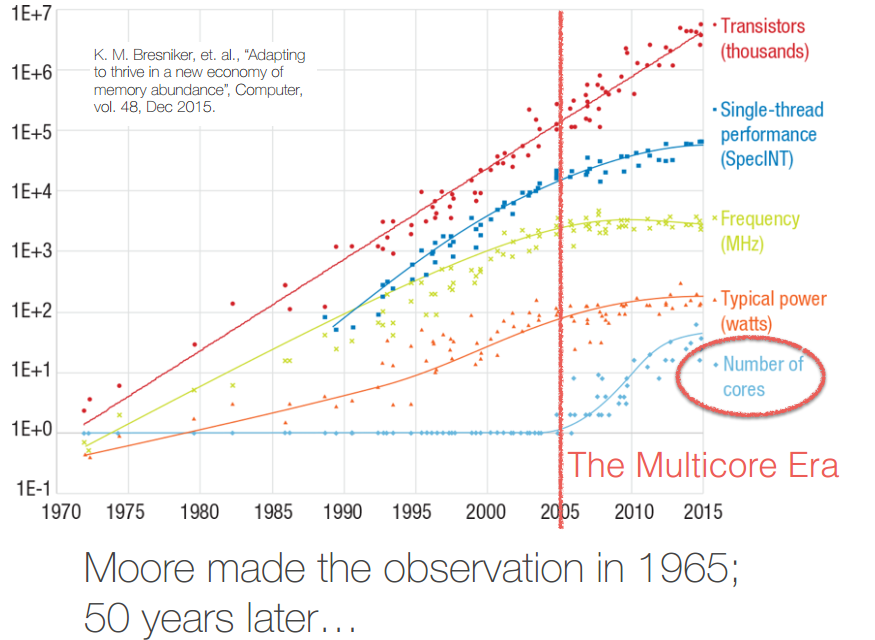

The [site](https://inst.eecs.berkeley.edu/~cs252/sp17/) of this course




# 1 intruction
What is computer architecture?
1. Myopic view from years ago: Instruction Set Architecture (ISA)
2. Updated view: Instruction Set Architecture, Microarchitecture, and Hardware

> D. Bhandarkar, “A journey through history from mainframes to smartphones”, Electronic Design Process Symposium, Apr 2015. 7
>
> [J. Devietti, “CIS 501: Computer Architecture — Technology and Energy”,, Jan 2016](http://www.cis.upenn.edu/~cis371/18sp/)


### The CS252 Approach to Understanding Computer Architecture
1. History
    1. Understand how the current architecture landscape was shaped by design decisions driven by earlier application, technology, or business concerns
    2. Don’t make the same mistakes
    3. Application and technology maturing can turn an old did-not-work/old bad idea into a new good idea

2. Applications
    1. Need to understand demands of current and future applications to guide architecture design decisions
    2. Real applications are complex and include much legacy code (if only in OS and libraries)
    3. Benchmarks and kernels are often used instead of real applications in architectural studies; need to understand workload modeling

3. Technology Trends
Computing technology is a very fast-moving field, so one must
constantly track changing technology abilities to make futurelooking design decision

4. A virtuous circle
    1. New technologies make new applications possible
    2. Revenues from popular applications fund and guide technology development

5. Architectural Design Patterns
    1. We will understand computer architecture through longlived, recurring standard architectural design patterns
for processors, memory systems, and interconnect
    2. Almost any “new” architecture can be understood as
composition of standard architectural design patterns
    3. We will look at case studies of real machines and break
the design down into standard architectural design patterns

6. Programming Models
Major architectural design patterns are usually
associated with an expected programming model
Serial code :: Uniprocessors (C)

Loop nests :: Vector machines (FORTRAN)

Annotated loops :: Shared memory multiprocessors
(OpenMP)

Element function code :: GPUs (CUDA/OpenCL)

Explicit message passing :: Clusters (MPI)

7. Business Models
    1. Viability of different computer designs depends on the
expected business model
    2. Some factors to consider: Volume: billions of units/year for smartphones or hundreds of units/ year for supercomputers

Non-recurring engineering costs: new complex custom
chip requires $10-50M or new FPGA board requires $10-100K

### Appendix: The 1-2-3 of a Good Project Proposal
1. Will have a list of example projects for consideration
2. Can come up with your own projects
3. Should be able to answer the following questions:

    1. What problem are you trying to solve?

    2. What idea/solution are you proposing?

    3. Are there other solutions that you know of? If so, compare and contrast.

    4. What is the potential upside using your idea/solution?

    5. How will you evaluate your idea/solution?

    6. What are the intermediary milestones to measure your progress?

Course Project (40%)
• Pick a topic that could be a paper at a top-tier architecture conferences (ISCA, MICRO, ASPLOS, HPCA)
1. ISCA
2. MICRO
3. ASPLOS
4. HPCA

# 2 Instruction Set Architectures
Tell some history, too concise to understand the deep meaning of it !

# 3 From CISC to RISC
separate ISA from implementation (aka. microarchitecture)

# 3 From CISC to RISC II

# 6 Out-of-Order Processors
https://courses.cs.washington.edu/courses/cse590g/04sp/Smith-1982-Decoupled-Access-Execute-Computer-Architectures.pdf

Definition of	a supercomputer:
1. Fastest machine	in	world	at	given	task
1. **A device	to	turn	a	compute-bound	problem	into	an	 I/O	bound	problem**
1. Any machine	costing	$30M+
1. Any machine	designed	by	Seymour	Cray

Out-of-Order Fades into Background until two major problme solved:
1. Precise traps
    1. Imprecise	traps	complicate	debugging	and	OS	code
    2. Note,	precise	interrupts	are	relatively	easy	to	provide
2. Branch prediction
    1. Amount	of	exploitable	instruction-level	parallelism	(ILP) limited	by	control	hazards

Separating Completion from Commit
1. Re-order	buffer	holds	register	results	from completion	until	commit
    1. Entries	allocated in program order during decode
    1. Buffers	completed values and exception state until	inorder	commit	point
    1. Completed values can	be	used by	dependents	before committed (bypassing)
    1. Each	entry holds program	counter, instruction type,
    1. destination	register specifier and	value if any, and exception	status	(info	often	compressed	to	save	hardware)
2. Memory reordering needs special	data structures
    1. Speculative	store address and data buffers
    2. Speculative	load address and data buffers

In-Order Commit	for	Precise	Traps
1. In-order	instruction	fetch	and	decode,	and	dispatch	to reservation	stations	inside	reorder	buffer
2. Instructions	issue	from	reservation	stations	out-of-order
3. Out-of-order	completion,	values	stored	in	temporary	buffers
4. Commit	is	in-order,	checks	for	traps,	and	if	none	updates	 architectural	state

# 7 Advanced Out-of-Order Designs

```
 +--------------+
 |     PC       |--------------------------
 +------+-------+
        |
+-------v---------+
|    I-Cache      |  Fetch : instruction bit retrive
+-------+---------+     from instruction cache
        |
 +------v-------+
 |  Fetch Buffer|---------------------------
 +------+-------+
        |
+-------v---------+
|  Decode/Rename  | Decode : instruction dispatch to
+-------+---------+     appropriate issue buffer
        |
 +------v-------+
 | Issue Buffer |--------------------------
 +------+-------+
        |
+-------v---------+ Execute: Instructions and operands issued to functional	units.
| Functional Units|     When execution completes, all results and exception	flags are available.
+-------+---------+
        |
 +------v-------+
 |Result Buffer |--------------------------
 +------+-------+
        |
+-------v---------+ Commit:	Instruction	irrevocably	updates	architectural state(aka	“graduation”)
|    Commit       |     ,or takes precise trap/interrupt.
+-------+---------+
        |
+-------v-----------+
|Architectural State|----------------------
+-------------------+
```
| Object | In Order | Out of Order |
|--------|----------|--------------|
| Phase  |
