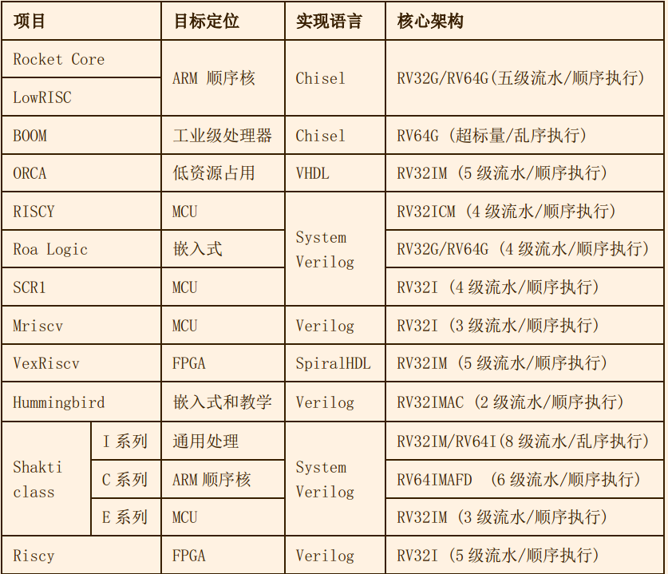
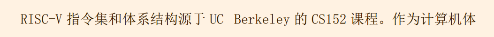
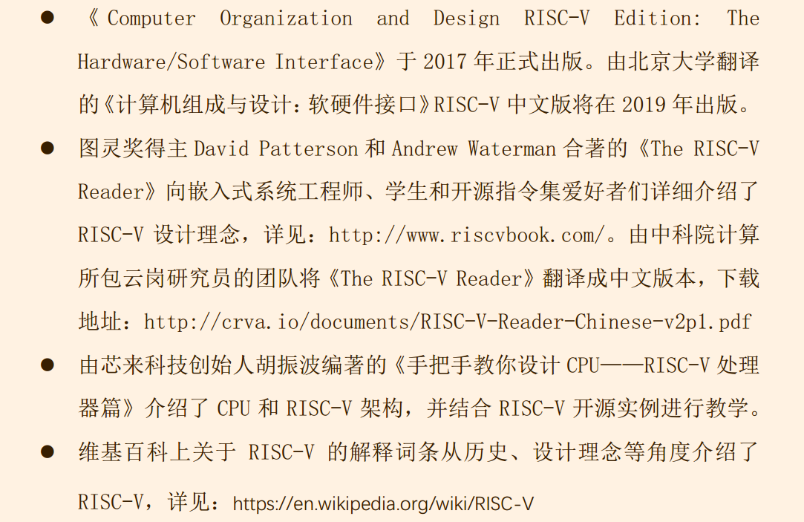

# Learn Chisel
[入门](https://github.com/freechipsproject/chisel-bootcamp)
[实战](https://github.com/ucb-bar/chisel-tutorial)
1. [Chisel Document](https://chisel.eecs.berkeley.edu/documentation.html)
> include a Chinese document
2. [Chisel api](https://chisel.eecs.berkeley.edu/api/latest/index.html)

[https://github.com/d0iasm/rvemu](模拟器，而不是翻译器，应该意义不大)
- https://github.com/riscv/educational-materials

## Risc-V
https://marz.utk.edu/my-courses/cosc230/book/example-risc-v-assembly-programs/ : 汇编教程
