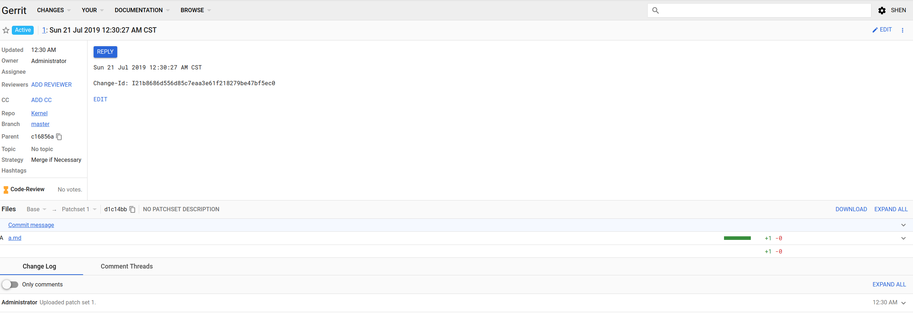

# Gerrit 配置
电脑配置的信息

```
➜  git-in-practice git:(master) ✗ neofetch
██████████████████  ████████   shen@shen-pc
██████████████████  ████████   ------------
██████████████████  ████████   OS: Manjaro Linux x86_64
██████████████████  ████████   Host: TM1701
████████            ████████   Kernel: 5.2.1-1-MANJARO
████████  ████████  ████████   Uptime: 21 hours, 9 mins
████████  ████████  ████████   Packages: 1552 (pacman)
████████  ████████  ████████   Shell: zsh 5.7.1
████████  ████████  ████████   Resolution: 1920x1080, 1080x1920, 2560x1440
████████  ████████  ████████   DE: Deepin
████████  ████████  ████████   WM: Mutter(DeepinGala)
████████  ████████  ████████   Theme: deepin [GTK2/3]
████████  ████████  ████████   Icons: deepin [GTK2/3]
████████  ████████  ████████   Terminal: deepin-terminal
                               Terminal Font: DejaVuSansMono Nerd Font Mono 11
                               CPU: Intel i7-8550U (8) @ 4.000GHz
                               GPU: NVIDIA GeForce MX150
                               GPU: Intel UHD Graphics 620
                               Memory: 5072MiB / 15923MiB
```

## 设置mysql数据库
1. 安装mysql数据库
> 参考资料 : https://dominicm.com/install-mysql-mariadb-on-arch-linux/

`systemctl status mysqld`
```
● mariadb.service - MariaDB 10.4.6 database server
   Loaded: loaded (/usr/lib/systemd/system/mariadb.service; enabled; vendor preset: disabled)
   Active: active (running) since Sat 2019-07-20 01:22:59 CST; 20h ago
     Docs: man:mysqld(8)
           https://mariadb.com/kb/en/library/systemd/
  Process: 754 ExecStartPre=/bin/sh -c systemctl unset-environment _WSREP_START_POSITION (code=exited, status=0/SUCCESS)
  Process: 758 ExecStartPre=/bin/sh -c [ ! -e /usr/bin/galera_recovery ] && VAR= ||   VAR=`/usr/bin/galera_recovery`; [ $? -eq 0 ]   && systemctl set-environment _WSREP_START_POSITION=$VAR || exit 1 (code=exited, status=0/SUCCESS)
  Process: 907 ExecStartPost=/bin/sh -c systemctl unset-environment _WSREP_START_POSITION (code=exited, status=0/SUCCESS)
 Main PID: 781 (mysqld)
   Status: "Taking your SQL requests now..."
    Tasks: 30 (limit: 4915)
   Memory: 93.1M
   CGroup: /system.slice/mariadb.service
           └─781 /usr/bin/mysqld

Jul 20 01:22:59 shen-pc mysqld[781]: 2019-07-20  1:22:59 0 [Note] InnoDB: Waiting for purge to start
Jul 20 01:22:59 shen-pc mysqld[781]: 2019-07-20  1:22:59 0 [Note] InnoDB: 10.4.6 started; log sequence number 139167; transaction id 23
Jul 20 01:22:59 shen-pc mysqld[781]: 2019-07-20  1:22:59 0 [Note] InnoDB: Loading buffer pool(s) from /var/lib/mysql/ib_buffer_pool
Jul 20 01:22:59 shen-pc mysqld[781]: 2019-07-20  1:22:59 0 [Note] InnoDB: Buffer pool(s) load completed at 190720  1:22:59
Jul 20 01:22:59 shen-pc mysqld[781]: 2019-07-20  1:22:59 0 [Note] Server socket created on IP: '::'.
Jul 20 01:22:59 shen-pc mysqld[781]: 2019-07-20  1:22:59 0 [Note] Reading of all Master_info entries succeeded
Jul 20 01:22:59 shen-pc mysqld[781]: 2019-07-20  1:22:59 0 [Note] Added new Master_info '' to hash table
Jul 20 01:22:59 shen-pc mysqld[781]: 2019-07-20  1:22:59 0 [Note] /usr/bin/mysqld: ready for connections.
Jul 20 01:22:59 shen-pc mysqld[781]: Version: '10.4.6-MariaDB'  socket: '/run/mysqld/mysqld.sock'  port: 3306  Source distribution
Jul 20 01:22:59 shen-pc systemd[1]: Started MariaDB 10.4.6 database server.
```
2. 添加数据库
> 参考资料 : https://gerrit.googlesource.com/plugins/verify-status/+/master/src/main/resources/Documentation/mysql-setup-example.md
```
➜  git-in-practice git:(master) ✗ mysql -u gerrit -p
Enter password:
Welcome to the MariaDB monitor.  Commands end with ; or \g.
Your MariaDB connection id is 12
Server version: 10.4.6-MariaDB Source distribution

Copyright (c) 2000, 2018, Oracle, MariaDB Corporation Ab and others.

Type 'help;' or '\h' for help. Type '\c' to clear the current input statement.

MariaDB [(none)]> show databases;
+--------------------+
| Database           |
+--------------------+
| information_schema |
| reviewdb           |
+--------------------+
2 rows in set (0.000 sec)

MariaDB [(none)]> SHOW GRANTS FOR 'gerrit'@'localhost';
+---------------------------------------------------------------------------------------------------------------+
| Grants for gerrit@localhost                                                                                   |
+---------------------------------------------------------------------------------------------------------------+
| GRANT USAGE ON *.* TO 'gerrit'@'localhost' IDENTIFIED BY PASSWORD '*14E65567ABDB5135D0CFD9A70B3032C179A49EE7' |
| GRANT ALL PRIVILEGES ON `reviewdb`.* TO 'gerrit'@'localhost'                                                  |
+---------------------------------------------------------------------------------------------------------------+
2 rows in set (0.000 sec)

MariaDB [(none)]>
```

## 添加用户gerrit
```
sudo useradd -u
```

## 添加反向代理
1. 启动httpd
```
➜  git-in-practice git:(master) ✗ systemctl status httpd
● httpd.service - Apache Web Server
   Loaded: loaded (/usr/lib/systemd/system/httpd.service; enabled; vendor preset: disabled)
   Active: active (running) since Sat 2019-07-20 01:22:58 CST; 21h ago
 Main PID: 753 (httpd)
    Tasks: 109 (limit: 4915)
   Memory: 14.7M
   CGroup: /system.slice/httpd.service
           ├─ 753 /usr/bin/httpd -k start -DFOREGROUND
           ├─ 784 /usr/bin/httpd -k start -DFOREGROUND
           ├─ 785 /usr/bin/httpd -k start -DFOREGROUND
           ├─ 786 /usr/bin/httpd -k start -DFOREGROUND
           └─2081 /usr/bin/httpd -k start -DFOREGROUND

Jul 20 01:22:58 shen-pc systemd[1]: Started Apache Web Server.
Jul 20 01:22:58 shen-pc httpd[753]: AH00548: NameVirtualHost has no effect and will be removed in the next release /etc/httpd/conf/httpd.con>
Jul 20 01:22:58 shen-pc httpd[753]: AH00558: httpd: Could not reliably determine the server's fully qualified domain name, using 127.0.1.1. >
lines 1-16/16 (END)
```

2. 添加反向代理的配置
> 参考资料: https://gerrit-review.googlesource.com/Documentation/config-reverseproxy.html
> https://gerrit-review.googlesource.com/Documentation/config-gerrit.html#httpd.listenUrl

```
➜  ~ tail -30 /etc/httpd/conf/httpd.conf
#       starting without SSL on platforms with no /dev/random equivalent
#       but a statically compiled-in mod_ssl.
#
<IfModule ssl_module>
SSLRandomSeed startup builtin
SSLRandomSeed connect builtin
</IfModule>

<VirtualHost *>
        ServerName 10.10.150.139
        ProxyRequests Off
        ProxyVia Off
        ProxyPreserveHost On

        <Proxy *>
              Order deny,allow
              Allow from all
        </Proxy>

        <Location /login/>
          AuthType Basic
          AuthName "Gerrit Code Review"
          AuthBasicProvider file
          AuthUserFile /home/gerrit/.htpasswd
          Require valid-user
        </Location>

        AllowEncodedSlashes On
        ProxyPass /r/ http://127.0.0.1:8081/r/ nocanon
</VirtualHost>
```

## 安装
1. 切换用户
```sh
sudo su gerrit
```

2. 检查Java版本
```sh
[gerrit@shen-pc ~]$ java -version
openjdk version "1.8.0_222"
OpenJDK Runtime Environment (build 1.8.0_222-b05)
OpenJDK 64-Bit Server VM (build 25.222-b05, mixed mode)
```

#### 使用 `development_become_any_account`　认真模式

```txt
[gerrit@shen-pc ~]$ java -jar ~/gerrit-3.0.1.war init  -d ~/Gerrit
Using secure store: com.google.gerrit.server.securestore.DefaultSecureStore
[2019-07-20 22:47:12,441] [main] INFO  com.google.gerrit.server.config.GerritServerConfigProvider : No /home/gerrit/Gerrit/etc/gerrit.config; assuming defaults

*** Gerrit Code Review 3.0.1
***

Create '/home/gerrit/Gerrit'   [Y/n]?

*** Git Repositories
***

Location of Git repositories   [git]:

*** Index
***

Type                           [lucene/?]:

*** User Authentication
***

Authentication method          [openid/?]: ?
       Supported options are:
         openid
         openid_sso
         http
         http_ldap
         client_ssl_cert_ldap
         ldap
         ldap_bind
         custom_extension
         development_become_any_account
         oauth
Authentication method          [openid/?]: development_become_any_account
Enable signed push support     [y/N]?

*** Review Labels
***

Install Verified label         [y/N]?

*** Email Delivery
***

SMTP server hostname           [localhost]:
SMTP server port               [(default)]:
SMTP encryption                [none/?]:
SMTP username                  :

*** Container Process
***

Run as                         [gerrit]:
Java runtime                   [/usr/lib/jvm/java-8-openjdk/jre]:
Copy gerrit-3.0.1.war to /home/gerrit/Gerrit/bin/gerrit.war [Y/n]?
Copying gerrit-3.0.1.war to /home/gerrit/Gerrit/bin/gerrit.war

*** SSH Daemon
***

Listen on address              [*]:
Listen on port                 [29418]:
Generating SSH host key ... rsa... ed25519... ecdsa 256... ecdsa 384... ecdsa 521... done

*** HTTP Daemon
***

Behind reverse proxy           [y/N]?
Use SSL (https://)             [y/N]?
Listen on address              [*]:
Listen on port                 [8080]:
Canonical URL                  [http://shen-pc:8080/]:

*** Cache
***


*** Plugins
***

Installing plugins.
Install plugin codemirror-editor version v3.0.1 [y/N]?
Install plugin commit-message-length-validator version v3.0.1 [y/N]?
Install plugin delete-project version v3.0.1 [y/N]?
Install plugin download-commands version v3.0.1 [y/N]?
Install plugin gitiles version v3.0.1 [y/N]?
Install plugin hooks version v3.0.1 [y/N]?
Install plugin plugin-manager version v3.0.1 [y/N]?
Install plugin replication version v3.0.1 [y/N]?
Install plugin reviewnotes version v3.0.1 [y/N]?
Install plugin singleusergroup version v3.0.1 [y/N]?
Install plugin webhooks version v3.0.1 [y/N]?
Initializing plugins.
No plugins found with init steps.


*** Gerrit Administrator
***

Create administrator user      [Y/n]?
username                       [admin]:
name                           [Administrator]:
HTTP password                  [secret]:
public SSH key file            []:
email                          [admin@example.com]: hubachelar@qq.com
Initialized /home/gerrit/Gerrit
Reindexing projects:    100% (2/2) with: reindex --site-path /home/gerrit/Gerrit --threads 1 --index projects
Reindexed 2 documents in projects index in 0.1s (20.0/s)
Executing /home/gerrit/Gerrit/bin/gerrit.sh start
Starting Gerrit Code Review: WARNING: Could not adjust Gerrit's process for the kernel's out-of-memory killer.
         This may be caused by /home/gerrit/Gerrit/bin/gerrit.sh not being run as root.
         Consider changing the OOM score adjustment manually for Gerrit's PID=18518 with e.g.:
         echo '-1000' | sudo tee /proc/18518/oom_score_adj
OK
Waiting for server on shen-pc:8080 ... OK
Opening http://shen-pc:8080/#/admin/projects/ ...No protocol specified
OK
```

进一步的添加项目和使用之后，效果如下:


#### 使用 http 认证模式
配置过程:
```
[gerrit@shen-pc ~]$ java -jar ~/gerrit-3.0.1.war init  -d /home/gerrit/Gerrit
Using secure store: com.google.gerrit.server.securestore.DefaultSecureStore
[2019-07-21 01:02:30,162] [main] INFO  com.google.gerrit.server.config.GerritServerConfigProvider : No /home/gerrit/Gerrit/etc/gerrit.config; assuming defaults

*** Gerrit Code Review 3.0.1
***

Create '/home/gerrit/Gerrit'   [Y/n]?

*** Git Repositories
***

Location of Git repositories   [git]:

*** Index
***

Type                           [lucene/?]:

*** User Authentication
***

Authentication method          [openid/?]: http
Get username from custom HTTP header [y/N]? N
SSO logout URL                 :
Enable signed push support     [y/N]?

*** Review Labels
***

Install Verified label         [y/N]?

*** Email Delivery
***

SMTP server hostname           [localhost]:
SMTP server port               [(default)]:
SMTP encryption                [none/?]:
SMTP username                  :

*** Container Process
***

Run as                         [gerrit]:
Java runtime                   [/usr/lib/jvm/java-8-openjdk/jre]:
Copy gerrit-3.0.1.war to /home/gerrit/Gerrit/bin/gerrit.war [Y/n]?
Copying gerrit-3.0.1.war to /home/gerrit/Gerrit/bin/gerrit.war

*** SSH Daemon
***

Listen on address              [*]:
Listen on port                 [29418]:
Generating SSH host key ... rsa... ed25519... ecdsa 256... ecdsa 384... ecdsa 521... done

*** HTTP Daemon
***

Behind reverse proxy           [y/N]?
Use SSL (https://)             [y/N]? N
Listen on address              [*]:
Listen on port                 [8080]: 8081
Canonical URL                  [http://shen-pc:8081/]:

*** Cache
***


*** Plugins
***

Installing plugins.
Install plugin codemirror-editor version v3.0.1 [y/N]?
Install plugin commit-message-length-validator version v3.0.1 [y/N]?
Install plugin delete-project version v3.0.1 [y/N]?
Install plugin download-commands version v3.0.1 [y/N]?
Install plugin gitiles version v3.0.1 [y/N]?
Install plugin hooks version v3.0.1 [y/N]?
Install plugin plugin-manager version v3.0.1 [y/N]?
Install plugin replication version v3.0.1 [y/N]?
Install plugin reviewnotes version v3.0.1 [y/N]?
Install plugin singleusergroup version v3.0.1 [y/N]?
Install plugin webhooks version v3.0.1 [y/N]?
Initializing plugins.
No plugins found with init steps.

Initialized /home/gerrit/Gerrit
Reindexing projects:    100% (2/2) with: reindex --site-path /home/gerrit/Gerrit --threads 1 --index projects
Reindexed 2 documents in projects index in 0.1s (22.2/s)
Executing /home/gerrit/Gerrit/bin/gerrit.sh start
Starting Gerrit Code Review: WARNING: Could not adjust Gerrit's process for the kernel's out-of-memory killer.
         This may be caused by /home/gerrit/Gerrit/bin/gerrit.sh not being run as root.
         Consider changing the OOM score adjustment manually for Gerrit's PID=25155 with e.g.:
         echo '-1000' | sudo tee /proc/25155/oom_score_adj
OK
Waiting for server on shen-pc:8081 ... OK
Opening http://shen-pc:8081/#/admin/projects/ ...No protocol specified
OK
[gerrit@shen-pc ~]$ cat Gerrit/etc/gerrit.config
[gerrit]
  basePath = git
  canonicalWebUrl = http://shen-pc:8081/
  serverId = ba8a5bd1-3332-473b-8891-2dbf9a2ef9d0
[container]
  javaOptions = "-Dflogger.backend_factory=com.google.common.flogger.backend.log4j.Log4jBackendFactory#getInstance"
  javaOptions = "-Dflogger.logging_context=com.google.gerrit.server.logging.LoggingContext#getInstance"
  user = gerrit
  javaHome = /usr/lib/jvm/java-8-openjdk/jre
[index]
  type = LUCENE
[auth]
  type = HTTP
[receive]
  enableSignedPush = false
[sendemail]
  smtpServer = localhost
[sshd]
  listenAddress = *:29418
[httpd]
  listenUrl = http://*:8081/
[cache]
  directory = cache
```

为了对应反向代理，对于$site_path/ect/gerrit.config 作出以下调整,但是依旧无法使用:
```
[gerrit]
  basePath = git
  canonicalWebUrl = http://shen-pc:8080/
  serverId = ba8a5bd1-3332-473b-8891-2dbf9a2ef9d0
[container]
  javaOptions = "-Dflogger.backend_factory=com.google.common.flogger.backend.log4j.Log4jBackendFactory#getInstance"
  javaOptions = "-Dflogger.logging_context=com.google.gerrit.server.logging.LoggingContext#getInstance"
  user = gerrit
  javaHome = /usr/lib/jvm/java-8-openjdk/jre
[index]
  type = LUCENE
[auth]
  type = HTTP
[receive]
  enableSignedPush = false
[sendemail]
  smtpServer = localhost
[sshd]
  listenAddress = *:29418
[httpd]
  listenUrl = proxy-http://127.0.0.1:8081/r/
[cache]
  directory = cache
```
错误内容为:
```
The HTTP server did not provide the username in the Authorization header when it forwarded the request to Gerrit Code Review.

If the HTTP server is Apache HTTPd, check the proxy configuration includes an authorization directive with the proper location, ensuring it ends with '/':
...
```
## 结论
不要在 Arch 上搭建 Gerrit，尝试在 Ubuntu 上搭建吧。
