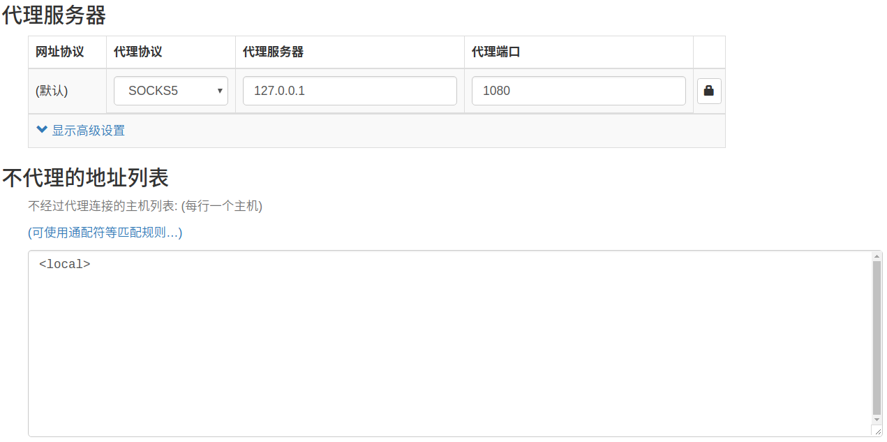
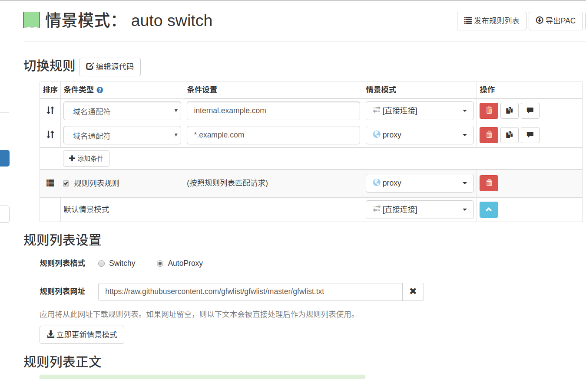

# 注册机器
注册新的机器,注意添加ssh key. 就是添加机器的公钥
然后`ssh root@12.23.43.45`

## 配置autoSwitchy
> url of gfwlist



https://raw.githubusercontent.com/gfwlist/gfwlist/master/gfwlist.txt
## 配置终端上网
```
export http_proxy="socks5://127.0.0.1:1080"
export https_proxy="socks5://127.0.0.1:1080"
```
## 可能会遇到的问题
Fix shadowsocks [ref](https://kionf.com/2016/12/15/errornote-ss/)
Read the error to find where is `openssl.py`.
Open `openssl.py`
Replace `cleanup` with `reset`
```
:%s/cleanup/reset/
:x
```

# 参考资料
1. [github shadowsocks wiki中文教程](https://github.com/shadowsocks/shadowsocks/wiki/Shadowsocks-%E4%BD%BF%E7%94%A8%E8%AF%B4%E6%98%8E)
