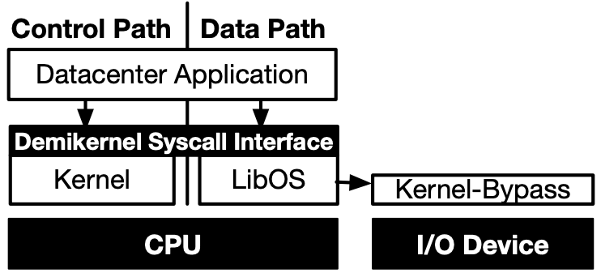

# 19

## I'm Not Dead Yet!: The Role of the Operating System in a Kernel-Bypass Era
- tag: demikernel

While today’s kernel-bypass accelerators have some limitations, eventually accelerators
will eliminate the OS kernel from the fast I/O path, relegating the kernel to slow, control-path operations.

关键工作是提出了下图中的，libos kermikernel，具体实现没有看。

感觉作者的 blog 解释的更加清楚: http://irenezhang.net/blog/2019/05/21/demikernel.html

Every RDMA or DPDK application must work around these two hardware limitations, and most of them do it in the same way.
For example, most DPDK application will use full networking stack (e.g., mTCP) to break up messages into network packets and implement congestion and flow control.
