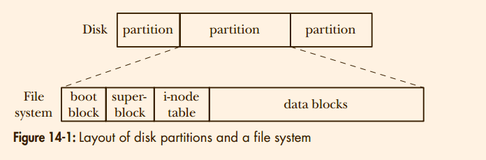

# Linux Programming Interface: Chapter 14 : File system
> 19章的内容也值得一看

## 14.1 Device Special Files (Devices)
The udev program relies on the sysfs file system, which
exports information about devices and other kernel objects into user space via a
pseudo-file system mounted under /sys.

Each device file has a major ID number and a minor ID number. The major ID identifies the general class of device, and is used by the kernel to look up the appropriate
driver for this type of device. The minor ID uniquely identifies a particular device
within a general class. 

Each device driver registers its association
with a specific major device ID, and this association provides the connection
between the device special file and the device driver. 

Each disk is divided into one or more (nonoverlapping) partitions. Each partition is
treated by the kernel as a separate device residing under the /dev directory.

## 14.2 Disks and Partitions
The system administrator determines the number, type, and size of partitions
on a disk using the fdisk command. The command fdisk –l lists all partitions on
a disk. The Linux-specific /proc/partitions file lists the major and minor device
numbers, size, and name of each disk partition on the system.
> 神奇的操作，所以
> 1. 如果fdisk，gendisk , block device , inode 等等现在所有接触到的概念，都是对于disk 和 ssd 通用的，so when the path diverge to two
> 2. what is driver name of disk and ssd in my computer ?

A swap area is created using the mkswap(8) command. A privileged (CAP_SYS_ADMIN)
process can use the swapon() system call to notify the kernel that a disk partition is
to be used as a swap area. The swapoff() system call performs the converse function,
telling the kernel to cease using a disk partition as a swap area.


## 14.3 File Systems


A file system contains the following parts:
1. boot block
This is always the first block in a file system. The boot block is not
used by the file system; rather, it contains information used to boot the operating system. Although only one boot block is needed by the operating system,
all file systems have a boot block (most of which are unused).
2. super block
3. I-node table
4. Data blocks


## 14.6 Journaling File Systems
Journaling file systems eliminate the need for lengthy file-system consistency checks after a system crash.

The most notable disadvantage of journaling is that it adds time to file updates,
though good design can make this overhead low.

With Linux 2.4.19 and later, things became more complicated. The kernel
now supports per-process mount namespaces. This means that each process
potentially has its own set of file-system mount points, and thus may see a different single directory hierarchy from other processes

## 14.8 Mounting and Unmounting File Systems
Before looking at these system calls, it is useful to know about three files that
contain information about the file systems that are currently mounted or can be
mounted:
1. A list of the currently mounted file systems can be read from the Linux-specific
/proc/mounts virtual file. /proc/mounts is an interface to kernel data structures, so
it always contains accurate information about mounted file systems.
2. The mount(8) and umount(8) commands automatically maintain the file /etc/mtab,
which contains information that is similar to that in /proc/mounts, but slightly
more detailed.
3. The /etc/fstab file, maintained manually by the system administrator, contains
descriptions of all of the available file systems on a system, and is used by the
mount(8), umount(8), and fsck(8) commands

> 主要介绍了mount 和 unmount 两个函数的使用

## 14.9 Advanced Mount Features
> @todo mount 的一些骚操作

##　14.10 A Virtual Memory File System: tmpfs
By default, a tmpfs file system is permitted to grow to half the size of RAM, but
the size=nbytes mount option can be used to set a different ceiling for the file-system
size, either when the file system is created or during a later remount. (A tmpfs file
system consumes only as much memory and swap space as is currently required for
the files it holds.)

## 14.11 Obtaining Information About a File System: statvfs()
Aside from use by user applications, tmpfs file systems also serve two special
purposes:
1. An invisible tmpfs file system, mounted internally by the kernel, is used for
implementing System V shared memory (Chapter 48) and shared anonymous
memory mappings (Chapter 49).
2. A tmpfs file system mounted at /dev/shm is used for the glibc implementation of
POSIX shared memory and POSIX semaphores.
```c
struct ustatvfs {
```
